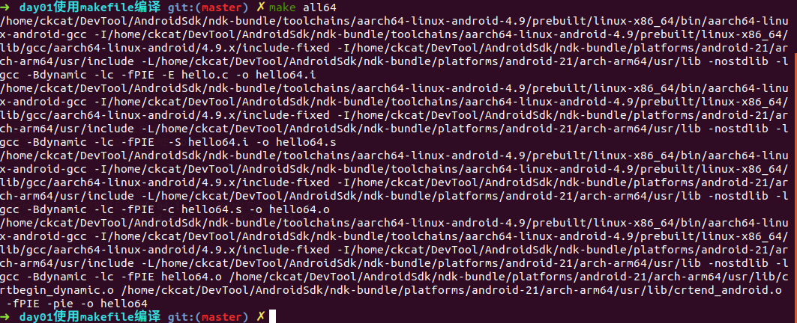
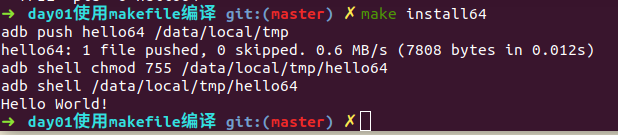
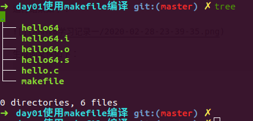
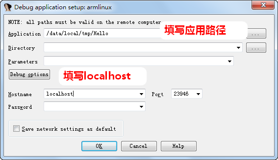
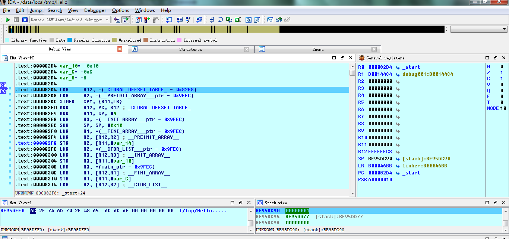
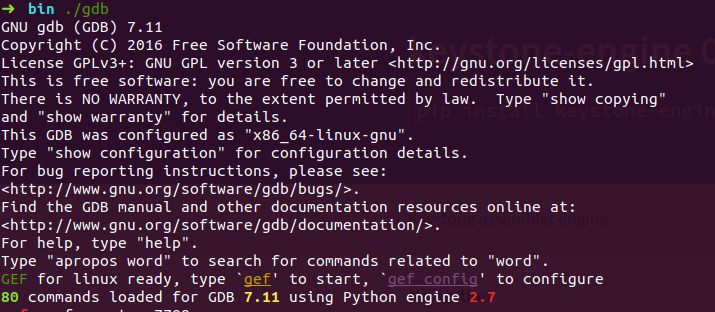
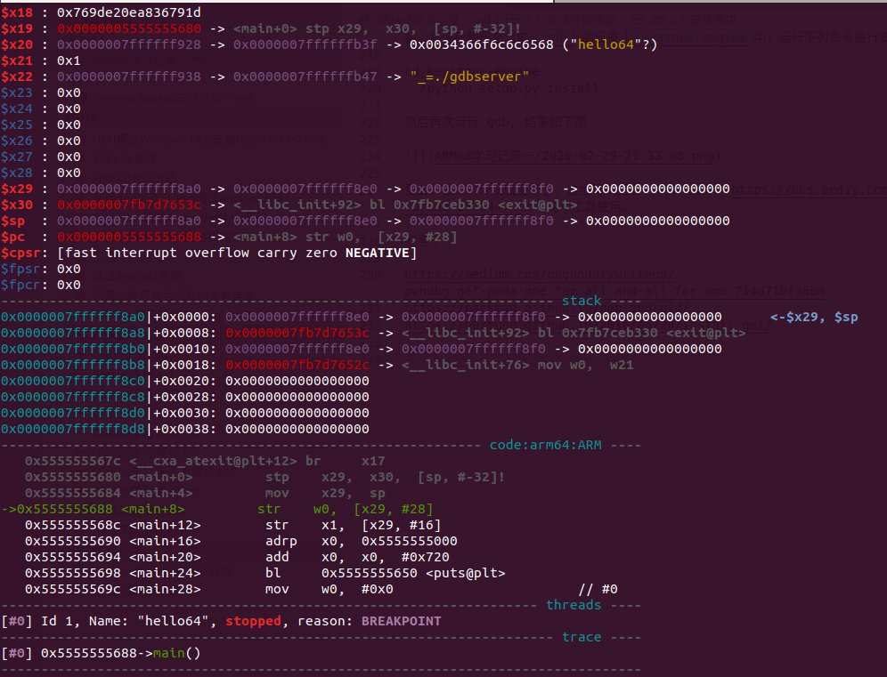
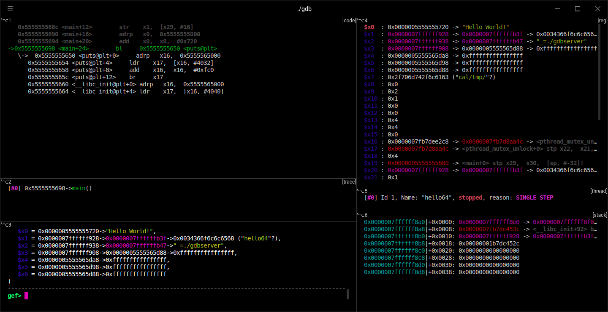

# 从一个 HelloWorld 开始

## 使用 clang 编译（推荐）

首先使用 `which` 命令查看 `clang` 的位置，由于我没有将 `clang` 添加到环境变量，最终结果是找不到的，那么需要将 `clang` 添加到临时环境变量中。

```bash
export PATH="$ANDROID_HOME/ndk/21.0.6113669/toolchains/llvm/prebuilt/linux-x86_64/bin/:$PATH"
```

然后参考 NDK 官方指南 [将 NDK 与其他构建系统配合使用](https://developer.android.com/ndk/guides/other_build_systems) 部分，可以知道使用 `clang` 编译时需要使用 `-target` 参数传递适当的目标，例如以下命令为编译 `minSdkVersion` 为 `21` 的 `64` 位 Android ARM 平台的应用。

```bash
➜  clang -target aarch64-linux-android21 hello.c -o hello
➜  file hello
hello: ELF 64-bit LSB shared object, ARM aarch64, version 1 (SYSV), dynamically linked, interpreter /system/bin/linker64, not stripped
```

以上命令为一步编译成功，实际过程可以分为三步，我们以 ARM 平台为例进行讲解。

1. 预处理

```bash
➜  clang -target arm-linux-android21 -E hello.c -o arm_hello.i
```

2. 编译成汇编文件

```bash
➜  clang -target arm-linux-android21 -S arm_hello.i -o arm_hello.s
```

3. 汇编成 obj 文件

```bash
➜  clang -target arm-linux-android21 -c arm_hello.s -o arm_hello.o
```

4. 链接成可执行程序

```bash
➜  clang -target arm-linux-android21 arm_hello.o -o arm_hello
```

编写 `makefile` 执行 `arm_hello` 。

```makefile
# 编译64位，需要指定 host=aarch64，例如: make host=aarch64
host=arm
ifeq ($(OS), Windows_NT)
	PLATFORM=windows
else
	PLATFORM=linux
endif

# export ANDROID_NDK="$ANDROID_HOME/ndk/21.0.6113669"
CC=$(ANDROID_NDK)/toolchains/llvm/prebuilt/$(PLATFORM)-x86_64/bin/clang
all:
	$(CC) -target $(host)-linux-android21 -E hello.c -o $(host)_hello.i
	$(CC) -target $(host)-linux-android21 -S $(host)_hello.i -o $(host)_hello.s
	$(CC) -target $(host)-linux-android21 -c $(host)_hello.s -o $(host)_hello.o
	$(CC) -target $(host)-linux-android21 $(host)_hello.o -o $(host)_hello

install:
	adb push $(host)_hello /data/local/tmp/$(host)_hello
	adb shell chmod +x /data/local/tmp/$(host)_hello

run:
	adb shell /data/local/tmp/$(host)_hello

.PHONY : clean
clean:
	-rm -f *.o *.i *.s $(host)_hello
```

[代码](https://github.com/CKCat/CKCat.github.io/tree/main/source/_posts/ARMv8%E5%AD%A6%E4%B9%A0%E8%AE%B0%E5%BD%9501/src/)

## 使用 gcc 编译

由于最新 ndk 环境中已经删除了 gcc 编译工具，因此下列方法在较新版本的 NDK 中不可用。

首先配置环境变量:

1. windows 下需要将 ndk 的根目录 `%ANDROID_NDK%` 和 `make.exe` 对应的目录 `%ANDROID_NDK%\prebuilt\windows-x86_64\bin` 添加到环境变量中。
2. linux 下需要将 ndk 的根目录 `export PATH="$PATH:$ANDROID_NDK` 添加到 shell 对应的配置文件中。

由于我们主要学习 ARMv8 的指令，所以直接使用 C 源文件生成一个 ARMv8 的汇编源文件。

C 代码如下：

```c
// hello.c
#include<stdio.h>
int main(int argc, char const *argv[]){
    printf("Hello World!\r\n");
    return 0;
}
```

Makefile 内容如下：

```makefile
#文件名称
MODALE_NAME=hello
ifeq ($(OS), Windows_NT)
	PLATFORM=windows
else
	PLATFORM=linux
endif
#ndk根目录
NDK_ROOT = $(HOME)/DevTool/AndroidSdk/ndk-bundle
#编译器根目录
TOOLCHAINS_ROOT_ARM=$(NDK_ROOT)/toolchains/arm-linux-androideabi-4.9/prebuilt/$(PLATFORM)-x86_64
TOOLCHAINS_ROOT_AARCH64=$(NDK_ROOT)/toolchains/aarch64-linux-android-4.9/prebuilt/$(PLATFORM)-x86_64
#编译器目录
TOOLCHAINS_PREFIX=$(TOOLCHAINS_ROOT_ARM)/bin/arm-linux-androideabi
TOOLCHAINS_PREFIX_AARCH64=$(TOOLCHAINS_ROOT_AARCH64)/bin/aarch64-linux-android

#头文件搜索路径
TOOLCHAINS_INCLUDE=$(TOOLCHAINS_ROOT_ARM)/lib/gcc/arm-linux-androideabi/4.9.x/include-fixed
TOOLCHAINS_INCLUDE_AARCH64=$(TOOLCHAINS_ROOT_AARCH64)/lib/gcc/aarch64-linux-android/4.9.x/include-fixed

#SDK根目录
PLATFROM_ROOT=$(NDK_ROOT)/platforms/android-21/arch-arm
PLATFROM_ROOT_AARCH64=$(NDK_ROOT)/platforms/android-21/arch-arm64

#sdk头文件搜索路径
PLATFROM_INCLUDE=$(PLATFROM_ROOT)/usr/include
PLATFROM_INCLUDE_AARCH64=$(PLATFROM_ROOT_AARCH64)/usr/include

#sdk库文件搜索路径
PLATFROM_LIB=$(PLATFROM_ROOT)/usr/lib
PLATFROM_LIB_AARCH64=$(PLATFROM_ROOT_AARCH64)/usr/lib

#删除
RM=del

#编译选项
FLAGS=-I$(TOOLCHAINS_INCLUDE) \
      -I$(PLATFROM_INCLUDE)   \
      -L$(PLATFROM_LIB) \
      -nostdlib \
      -lgcc \
      -Bdynamic \
      -lc \
      -fPIE

FLAGS_AARCH64=-I$(TOOLCHAINS_INCLUDE_AARCH64) \
      -I$(PLATFROM_INCLUDE_AARCH64)   \
      -L$(PLATFROM_LIB_AARCH64) \
      -nostdlib \
      -lgcc \
      -Bdynamic \
      -lc \
      -fPIE

#所有obj文件
OBJS=$(MODALE_NAME).o \
     $(PLATFROM_LIB)/crtbegin_dynamic.o \
     $(PLATFROM_LIB)/crtend_android.o

OBJS_AARCH64=$(MODALE_NAME)64.o \
     $(PLATFROM_LIB_AARCH64)/crtbegin_dynamic.o \
     $(PLATFROM_LIB_AARCH64)/crtend_android.o

#编译器链接
all:
	$(TOOLCHAINS_PREFIX)-gcc $(FLAGS) -E $(MODALE_NAME).c -o $(MODALE_NAME).i
	$(TOOLCHAINS_PREFIX)-gcc $(FLAGS)  -S $(MODALE_NAME).i -o $(MODALE_NAME).s
	$(TOOLCHAINS_PREFIX)-gcc $(FLAGS) -c $(MODALE_NAME).s -o $(MODALE_NAME).o
	$(TOOLCHAINS_PREFIX)-gcc $(FLAGS) $(OBJS) -fPIE -pie -o $(MODALE_NAME)

all64:
	$(TOOLCHAINS_PREFIX_AARCH64)-gcc $(FLAGS_AARCH64) -E $(MODALE_NAME).c -o $(MODALE_NAME)64.i
	$(TOOLCHAINS_PREFIX_AARCH64)-gcc $(FLAGS_AARCH64)  -S $(MODALE_NAME)64.i -o $(MODALE_NAME)64.s
	$(TOOLCHAINS_PREFIX_AARCH64)-gcc $(FLAGS_AARCH64) -c $(MODALE_NAME)64.s -o $(MODALE_NAME)64.o
	$(TOOLCHAINS_PREFIX_AARCH64)-gcc $(FLAGS_AARCH64) $(OBJS_AARCH64) -fPIE -pie -o $(MODALE_NAME)64
#删除所有.o文件
clean:
	$(RM) *.o
#安装程序到手机
install:
	adb push $(MODALE_NAME) /data/local/tmp
	adb shell chmod 755 /data/local/tmp/$(MODALE_NAME)
	adb shell /data/local/tmp/$(MODALE_NAME)
debug:
	adb forward tcp:23946 tcp:23946
	adb shell /data/local/tmp/android_server

install64:
	adb push $(MODALE_NAME)64 /data/local/tmp
	adb shell chmod 755 /data/local/tmp/$(MODALE_NAME)64
	adb shell /data/local/tmp/$(MODALE_NAME)64

debug64:
	adb forward tcp:23946 tcp:23946
	adb shell /data/local/tmp/android_server64
#运行程序
run:
	adb shell /data/local/tmp/$(MODALE_NAME)  

run64:
	adb shell /data/local/tmp/$(MODALE_NAME)64
```

使用 `make all64` 命令编译后的结果：



运行结果如下：



生成的文件如下：



`hello64.s` 对应的内容，后面所有的指令学习将以此文件为基础进行修改。

```
	.cpu generic+fp+simd
	.file	"hello.c"
	.section	.rodata
	.align	3
.LC0:
	.string	"Hello World!\r"
	.text
	.align	2
	.global	main
	.type	main, %function
main:
	stp	x29, x30, [sp, -32]!
	add	x29, sp, 0
	str	w0, [x29,28]
	str	x1, [x29,16]
	adrp	x0, .LC0
	add	x0, x0, :lo12:.LC0
	bl	puts
	mov	w0, 0
	ldp	x29, x30, [sp], 32
	ret
	.size	main, .-main
	.ident	"GCC: (GNU) 4.9.x 20150123 (prerelease)"
	.section	.note.GNU-stack,"",%progbits

```

至此，已经从一个 HelloWorld 开始了 ARMv8 的旅程。

## ndk-build 编译

1. 在源码目录中创建一个`Application.mk`，内容如下所示：

```makefile
APP_BUILD_SCRIPT := Android.mk
APP_PLATFORM := android-21
```

2. 在源码目录中创建一个`Android.mk`文件，内容如下所示：

```makefile
LOCAL_PATH := $(call my-dir)
include $(CLEAR_VARS)
LOCAL_SRC_FILES := hello.c
LOCAL_MODULE := foo
include $(BUILD_EXECUTABLE)
```

### 方法一（推荐）：

将源码和`mk`文件放入 `jni` 目录，进入 `jni` 目录中，直接使用 `ndk-build` 命令编译即可。

```bash
➜  jni ndk-build
[arm64-v8a] Compile        : foo <= hello.c
[arm64-v8a] Executable     : foo
[arm64-v8a] Install        : foo => libs/arm64-v8a/foo
[armeabi-v7a] Compile thumb  : foo <= hello.c
[armeabi-v7a] Executable     : foo
[armeabi-v7a] Install        : foo => libs/armeabi-v7a/foo
[x86] Compile        : foo <= hello.c
[x86] Executable     : foo
[x86] Install        : foo => libs/x86/foo
[x86_64] Compile        : foo <= hello.c
[x86_64] Executable     : foo
[x86_64] Install        : foo => libs/x86_64/foo
```

### 方法二：

进入源码目录使用以下命令编译：

```bash
➜  ndk-build NDK_PROJECT_PATH=$(pwd) NDK_APPLICATION_MK=$(pwd)/Application.mk
[arm64-v8a] Compile        : foo <= hello.c
[arm64-v8a] Executable     : foo
[arm64-v8a] Install        : foo => libs/arm64-v8a/foo
[armeabi-v7a] Compile thumb  : foo <= hello.c
[armeabi-v7a] Executable     : foo
[armeabi-v7a] Install        : foo => libs/armeabi-v7a/foo
[x86] Compile        : foo <= hello.c
[x86] Executable     : foo
[x86] Install        : foo => libs/x86/foo
[x86_64] Compile        : foo <= hello.c
[x86_64] Executable     : foo
[x86_64] Install        : foo => libs/x86_64/foo
```

或者进入源码目录使用以下命令进行编译：

```bash
➜  ndk-build NDK_PROJECT_PATH=$(pwd) APP_BUILD_SCRIPT=$(pwd)/Android.mk
Android NDK: APP_PLATFORM not set. Defaulting to minimum supported version android-19.
[arm64-v8a] Compile        : foo <= hello.c
[arm64-v8a] Executable     : foo
[arm64-v8a] Install        : foo => libs/arm64-v8a/foo
[armeabi-v7a] Compile thumb  : foo <= hello.c
[armeabi-v7a] Executable     : foo
[armeabi-v7a] Install        : foo => libs/armeabi-v7a/foo
[x86] Compile        : foo <= hello.c
[x86] Executable     : foo
[x86] Install        : foo => libs/x86/foo
[x86_64] Compile        : foo <= hello.c
[x86_64] Executable     : foo
[x86_64] Install        : foo => libs/x86_64/foo
```

# 调试环境搭建

## IDA 调试（推荐）

### 配置环境

将 ida dbgsrv 目录下的 `android_server` 拷贝到 android 手机的 `/data/local/tmp` 目录中，给予其执行权限。

```bash
$ adb push android_server /data/local/tmp
android_server: 1 file pushed. 3.3 MB/s (589588 bytes in 0.171s)

adb shell
root@1603_A02:/ # cd /data/local/tmp/
root@1603_A02:/data/local/tmp # chmod 777 android_server
```

### 开始调试

1. 运行 `android_server`。

```bash
root@1603_A02:/data/local/tmp # ./android_server
IDA Android 32-bit remote debug server(ST) v1.22. Hex-Rays (c) 2004-2017
Listening on 0.0.0.0:23946...
```

2. 端口映射。

```bash
adb forward tcp:23946 tcp:23946
```

3. 启动 IDA 打开 `debugger->run->remote Armlinux/andoid debugger` , 填写为 `localhost`，端口为 `23946`。



4. 开始调试



## GDB + gef 调试

### 安装 gef

进入 android gdb 的目录 `/ndk-bundle/prebuilt/linux-x86_64/bin`,启动命令行，执行下列命令：

```
wget -q -O .gdbinit-gef.py https://github.com/hugsy/gef/raw/master/gef.py
echo source .gdbinit-gef.py >> .gdbinit
```

然后执行 `./gdb` 命令，出现如下信息

```
GNU gdb (GDB) 7.11
Copyright (C) 2016 Free Software Foundation, Inc.
License GPLv3+: GNU GPL version 3 or later <http://gnu.org/licenses/gpl.html>
This is free software: you are free to change and redistribute it.
There is NO WARRANTY, to the extent permitted by law.  Type "show copying"
and "show warranty" for details.
This GDB was configured as "x86_64-linux-gnu".
Type "show configuration" for configuration details.
For bug reporting instructions, please see:
<http://www.gnu.org/software/gdb/bugs/>.
Find the GDB manual and other documentation resources online at:
<http://www.gnu.org/software/gdb/documentation/>.
For help, type "help".
Type "apropos word" to search for commands related to "word".
GEF for linux ready, type `gef' to start, `gef config' to configure
78 commands loaded for GDB 7.11 using Python engine 2.7
[*] 2 commands could not be loaded, run `gef missing` to know why.
gef> gef missing
[*] Command `assemble` is missing, reason -> Missing `keystone-engine` package for Python2, install with: `pip2 install keystone-engine`.
[*] Command `set-permission` is missing, reason -> Missing `keystone-engine` package for Python2, install with: `pip2 install keystone-engine`.
```

根据提示可以发现缺少了 `keystone-engine` 模块，当然还有可能缺少其他模块。

**后面的内容可以省略，安装过程中会出现比较多的问题，模块不安装也不影响使用。**

---

### 安装模块

退出 `gdb` , 下载 `[ez_setup.py](https://bootstrap.pypa.io/ez_setup.py)` ，运行列命令，进 行 `easy_install` 工具的安装：

```
./python ez_setup.py
```

安装成功之后就可以使用 `easy_install` 进行安装 `package` 了，然后根据提示安装需要的模块，也可以利用 `easy_install` 先安装 `pip`, 然后在利用 `pip` 进行安装其他模块，这里我使用 `easy_install` 进行安装其他模块。

```
./easy_install keystone-engine
```

安装完 `keystone-engine` 后，发现还是会有同样的提示，此时就需要下载 `[keystone-engine](https://pypi.org/project/keystone-engine/)` 源码进行安装。将源码解压至当前 `gdb` 的目录 `keystone-engine`中，运行下列命令进行安装：

```
cd keystone-engine
../python setup.py install
```

然后再次运行 gdb, 结果如下图：





至此，我们的环境就配好了，这里可以配合 [Hyperpwn](https://bbs.pediy.com/thread-257344.htm) 这个工具使用。



# 参考

https://medium.com/bugbountywriteup/pwndbg-gef-peda-one-for-all-and-all-for-one-714d71bf36b8

https://packmad.github.io/gdb-android/

https://o0xmuhe.github.io/2016/06/29/install-gef/
