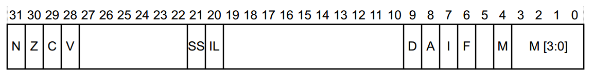
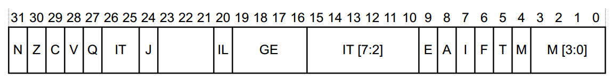
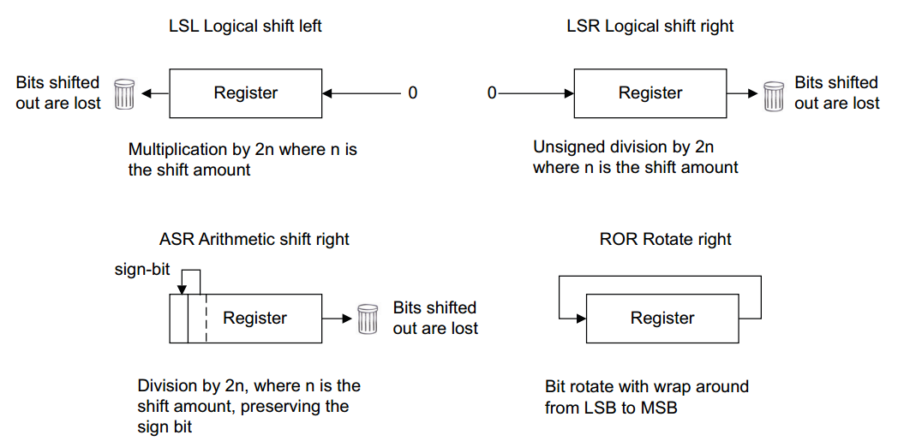
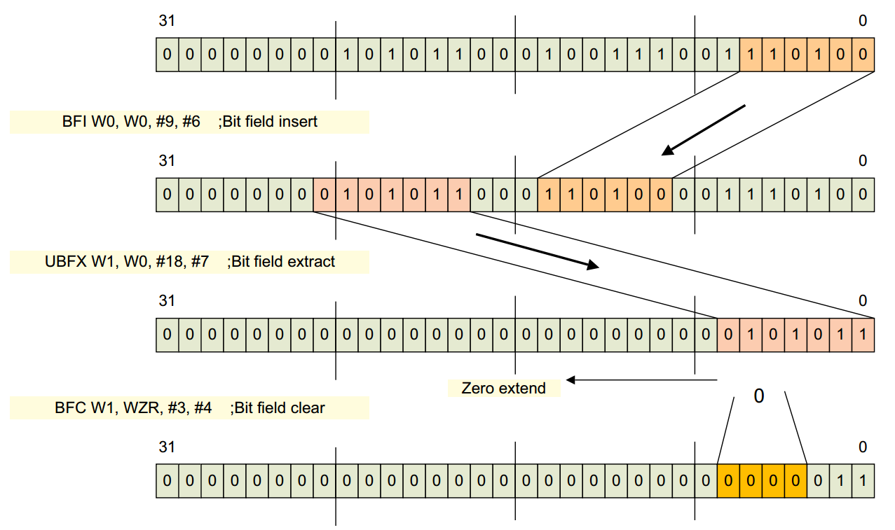
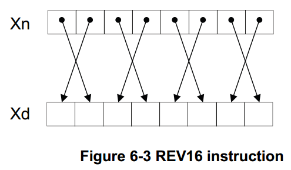
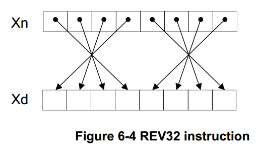

前面的环境搭建好了，下面主要学习 ARMv8 的一些基本知识和指令

# 基本知识

## ARMv8 寄存器

寄存器名称描述

| 位宽   | 分类       |                 |                 |
| ------ | ---------- | --------------- | --------------- |
| 32-bit | Wn（通用） | WZR（0 寄存器） | WSP（堆栈指针） |
| 64-bit | Xn（通用） | XZR（0 寄存器） | SP（堆栈指针）  |

AArch64 通用寄存器共 31 个 `X0-X30` , 其中各寄存器的作用如下表。

| 寄存器        | 描述                                                               |
| ------------- | ------------------------------------------------------------------ |
| `X0` – `X7`   | 参数寄存器，用来传递参数或保存返回值 （`X0`，`X1`）。              |
| `X8`          | 间接结果寄存器，一般保存返回值是结构体的地址。                     |
| `X9` – `X15`  | 易失性寄存器，调用者需要保存的临时寄存器。                         |
| `X16` – `X17` | 子程序内部调用寄存器（Intra-Procedure-Call Temporary Registers）。 |
| `X18`         | 平台寄存器（Platform Register），用于保存当前所用的平台的 ABI 。   |
| `X19` – `X28` | 非易失性寄存器，被调用者保存的寄存器。                             |
| `X29`         | 帧指针寄存器（FP），用于连接栈帧，使用时必须保存。                 |
| `X30`         | 链接寄存器（LR） 用于保存子程序的返回地址。                        |

除了 31 个核心寄存器外，还有一些特殊的寄存器。

**零寄存器 `XZR/WZR`** ：效果和软件层面的 `/dev/zero` 类似，作为源寄存器产生 0，作为目标寄存器丢弃传入的数据。

**栈指针寄存器 `SP`（Stack Pointer）**：指向栈当前的位置。

**程序计数器 `PC`（Program Counter）**：PC 总是指向当前指令下面的第二条指令的地址，不能被直接访问和修改。

**异常链接寄存器 `ELR`（Exception Link Register）**：ELR 的作用是保存异常返回地址。

**进程状态保存寄存器**：

1. PSTATE at AArch64 (SPSR)



2. PSTATE at AArch32 (CPSR)



### 条件码

此处的条件码对应的上面状态寄存器对应的标志位。

| Code | Encoding | Meaning (when set by CMP)                            | Meaning (when set by FCMP)                              | Condition flags      |
| ---- | -------- | ---------------------------------------------------- | ------------------------------------------------------- | -------------------- | --- | -------- |
| `EQ` | 0000     | Equal to.                                            | Equal to.                                               | `Z = 1`              |
| `NE` | 0001     | Not equal to.                                        | Unordered, or not equal to.                             | `Z = 0`              |
| `CS` | 0010     | Carry set (identical to HS).                         | Greater than, equal to, or unordered (identical to HS). | `C = 1`              |
| `HS` | 0010     | Greater than, equal to (unsigned) (identical to CS). | Greater than, equal to, or unordered (identical to CS). | `C = 1`              |
| `CC` | 0011     | Carry clear (identical to LO).                       | Less than (identical to LO).                            | `C = 0`              |
| `LO` | 0011     | Unsigned less than (identical to CC).                | Less than (identical to CC).                            | `C = 0`              |
| `MI` | 0100     | Minus, Negative.                                     | Less than.                                              | `N = 1`              |
| `PL` | 0101     | Positive or zero.                                    | Greater than, equal to, or unordered.                   | `N = 0`              |
| `VS` | 0110     | Signed overflow.                                     | Unordered. (At least one argument was NaN).             | `V = 1`              |
| `VC` | 0111     | No signed overflow.                                  | Not unordered. (No argument was NaN).                   | `V = 0`              |
| `HI` | 1000     | Greater than (unsigned).                             | Greater than or unordered.                              | `(C = 1) && (Z = 0)` |
| `LS` | 1001     | Less than or equal to (unsigned).                    | Less than or equal to.                                  | `(C = 0)             |     | (Z = 1)` |
| `GE` | 1010     | Greater than or equal to (signed).                   | Greater than or equal to.                               | `N==V`               |
| `LT` | 1011     | Less than (signed).                                  | Less than or unordered.                                 | `N!=V`               |
| `GT` | 1100     | Greater than (signed).                               | Greater than.                                           | `(Z==0) && (N==V)`   |
| `LE` | 1101     | Less than or equal to (signed).                      | Less than, equal to or unordered.                       | `(Z==1)              |     | (N!=V)`  |
| `AL` | 1110     | Always executed.                                     | Default. Always executed.                               | `Any`                |
| `NV` | 1111     | Always executed.                                     | Always executed.                                        | `Any`                |

# 指令

## 数据处理指令

### 算术和逻辑运算

| Type | Instructions                             |
| ---- | ---------------------------------------- |
| 算术 | `ADD`, `SUB`, `ADC`, `SBC`, `NEG`, `RSB` |
| 逻辑 | `AND`, `BIC`, `ORR`, `ORN`, `EOR`, `EON` |
| 比较 | `CMP`, `CMN`, `TST`                      |
| 移动 | `MOV`, `MVN`                             |

```asm
ADC{S} rd, rn, rm         // rd = rn + rm + C
ADD{S} rd, rn, op2        // rd = rn + op2
ADR xd, rel               // xd = pc + re , rel 的值为 21 位有符号数。
ADRP xd, rel              // xd = pc + rel , rel 的值为 33 位有符号数，并且 pc 和 rel 的值 4k 对齐，即低 12 位为 0 。
CMN rd, op2               // rd + op2 影响标志位。
CMP rd, op2               // rd - op2 影响标志位。
MADD rd, rn, rm, ra       // rd = ra + rn * rm
MSUB rd, rn, rm, ra       // rd = ra - rn * rm
MNEG rd, rn, rm           // rd = - rn * rm
MUL rd, rn, rm            // rd = rn * rm
NEG{S} rd, op2            // rd = - op2
NGC{S} rd, rm             // rd = -rm - ~C <==> rd = -rm + C - 1
SBC{S} rd, rn, rm         // rd = rn -rm - ~C <==> rd = rn - rm + C - 1
SDIV rd, rn, rm           // rd = rn / rm
SMADDL Xd, Wn, Wm, Xa     // Xd = Xa + Wn * Wm
SMNEGL Xd, Wn, Wm         // Xd = - Wn * Wm
SMSUBL Xd, Wn, Wm, Xa     // Xd = Xa - Wn * Wm
SMULH Xd, Xn, Xm          // Xd = (Xn * Xm) >> 64
SMULL Xd, Wn, Wm          // Xd = Wn * Wm
SUB{S} rd, rn, op2        // rd = rn - op2
UDIV rd, rn, rm           // rd = rn / rm
UMADDL Xd, Wn, Wm, Xa     // Xd = Xa + Wn * Wm
UMNEGL Xd, Wn, Wm         // Xd = - Wn * Wm
UMSUBL Xd, Wn, Wm, Xa     // Xd = Xa - Wn * Wm
UMULH Xd, Xn, Xm          // Xd = Xn * Xm >> 64
UMULL xd, Wn, Wm          // Xd = Wn * Wm
```

例子

```asm
CMN w0, #-3                    // 等价CMP W0, #3 即 x0 == 3
ADD W0, W1, W2, LSL #3         // W0 = W1 + (W2 << 3)
SUBS X0, X4, X3, ASR #2        // X0 = X4 - (X3 >> 2), set flags
MOV X0, X1                     // Copy X1 to X0
CMP W3, W4                     // Set flags based on W3 - W4
ADD W0, W5, #27                // W0 = W5 + 27
MNEG w0, w1, w2                // w0 = w0 - w1 * w2
NEG w0, w1                     // w0 = -w1

and     x1, x0, 15             // x1 = x0 % 16

tst     x0, x0                 // x0 == 0?
beq     zero

eor     x0, x0, x0             // x0 = 0
```

### 乘法和除法指令

| Opcode                    | Description                           |
| ------------------------- | ------------------------------------- |
| **Multiply instructions** |
| `MADD`                    | Multiply add                          |
| `MNEG`                    | Multiply negate                       |
| `MSUB`                    | Multiply subtract                     |
| `MUL`                     | Multiply                              |
| `SMADDL`                  | Signed multiply-add long              |
| `SMNEGL`                  | Signed multiply-negate long           |
| `SMSUBL`                  | Signed multiply-subtract long         |
| `SMULH`                   | Signed multiply returning high half   |
| `SMULL`                   | Signed multiply long                  |
| `UMADDL`                  | Unsigned multiply-add long            |
| `UMNEGL`                  | Unsigned multiply-negate long         |
| `UMSUBL`                  | Unsigned multiply-subtract long       |
| `UMULH`                   | Unsigned multiply returning high half |
| `UMULL`                   | Unsigned multiply long                |
| **Divide instructions**   |
| `SDIV`                    | Signed divide                         |
| `UDIV`                    | Unsigned divide                       |

```
MUL X0, X1, X2   // X0 = X1 * X2
MNEG X0, X1, X2  // X0 = -(X1 * X2)

UDIV W0, W1, W2  // W0 = W1 / W2 (unsigned, 32-bit divide)
SDIV X0, X1, X2  // X0 = X1 / X2 (signed, 64-bit divide)
```

### 移位操作

| Instruction | Description                        |
| ----------- | ---------------------------------- |
| **Shift**   |
| `ASR`       | **A**rithmetic **S**hift **R**ight |
| `LSL`       | **L**ogical **S**hift **L**eft     |
| `LSR`       | **L**ogical **S**hift **R**ight    |
| `ROR`       | **RO**tate **R**ight               |
| **Move**    |
| `MOV`       | Move                               |
| `MVN`       | Bitwise NOT                        |

```
// x1 = x0 / 8
lsr     x1, x0, 3

// x1 = x0 * 4
lsl     x1, x0, 2
```



### 位和字节操作指令

| Mnemonic         | Operands               | Instruction                                                                                                                                                                                                                                                    |
| ---------------- | ---------------------- | -------------------------------------------------------------------------------------------------------------------------------------------------------------------------------------------------------------------------------------------------------------- |
| `BFI`            | `Rd, Rn, #lsb, #width` | Bitfield Insert copies any number of low-order bits from a source register into the same number of adjacent bits at any position in the destination register, leaving other bits unchanged.                                                                    |
| `BFM`            | `Rd, Rn, #immr, #imms` | Bitfield Move copies any number of low-order bits from a source register into the same number of adjacent bits at any position in the destination register, leaving other bits unchanged.                                                                      |
| `BFXIL`          | `Rd, Rn, #lsb, #width` | Bitfield extract and insert at low end copies any number of low-order bits from a source register into the same number of adjacent bits at the low end in the destination register, leaving other bits unchanged.                                              |
| `CLS`            | `Rd, Rn`               | Count leading sign bits.                                                                                                                                                                                                                                       |
| `CLZ`            | `Rd, Rn`               | Count leading zero bits.                                                                                                                                                                                                                                       |
| `EXTR`           | `Rd, Rn, Rm, #lsb`     | Extract register extracts a register from a pair of registers.                                                                                                                                                                                                 |
| `RBIT`           | `Rd, Rn`               | Reverse Bits reverses the bit order in a register.                                                                                                                                                                                                             |
| `REV16`          | `Rd, Rn`               | Reverse bytes in 16-bit halfwords reverses the byte order in each 16-bit halfword of a register.                                                                                                                                                               |
| `REV32`          | `Rd, Rn`               | Reverse bytes in 32-bit words reverses the byte order in each 32-bit word of a register.                                                                                                                                                                       |
| `REV64`          | `Rd, Rn`               | Reverse Bytes reverses the byte order in a 64-bit general-purpose register.                                                                                                                                                                                    |
| `SBFIZ`          | `Rd, Rn, #lsb, #width` | Signed Bitfield Insert in Zero zeroes the destination register and copies any number of contiguous bits from a source register into any position in the destination register, sign-extending the most significant bit of the transferred value. Alias of SBFM. |
| `SBFM`           | `Wd, Wn, #immr, #imms` | Signed Bitfield Move copies any number of low-order bits from a source register into the same number of adjacent bits at any position in the destination register, shifting in copies of the sign bit in the upper bits and zeros in the lower bits.           |
| `SBFX`           | `Rd, Rn, #lsb, #width` | Signed Bitfield Extract extracts any number of adjacent bits at any position from a register, sign-extends them to the size of the register, and writes the result to the destination register.                                                                |
| `{S,U}XT{B,H,W}` | `Rd, Rn`               | (S)igned/(U)nsigned eXtend (B)yte/(H)alfword/(W)ord extracts an 8-bit,16-bit or 32-bit value from a register, zero-extends it to the size of the register, and writes the result to the destination register. Alias of UBFM.                                   |







### 条件执行

| Mnemonic           | Operands                | Instruction                                                                                                                                                                                                                                |
| ------------------ | ----------------------- | ------------------------------------------------------------------------------------------------------------------------------------------------------------------------------------------------------------------------------------------ |
| `CCMN` (immediate) | `Rn, #imm, #nzcv, cond` | Conditional Compare Negative (immediate) sets the value of the condition flags to the result of the comparison of a register value and a negated immediate value if the condition is TRUE, and an immediate value otherwise.               |
| `CCMN` (register)  | `Rn, Rm, #nzcv, cond`   | Conditional Compare Negative (register) sets the value of the condition flags to the result of the comparison of a register value and the inverse of another register value if the condition is TRUE, and an immediate value otherwise.    |
| `CCMP` (immediate) | `Rn, #imm, #nzcv, cond` | Conditional Compare (immediate) sets the value of the condition flags to the result of the comparison of a register value and an immediate value if the condition is TRUE, and an immediate value otherwise.                               |
| `CCMP` (register)  | `Rn, Rm, #nzcv, cond`   | Conditional Compare (register) sets the value of the condition flags to the result of the comparison of two registers if the condition is TRUE, and an immediate value otherwise.                                                          |
| `CSEL`             | `Rd, Rn, Rm, cond`      | Conditional Select returns, in the destination register, the value of the first source register if the condition is TRUE, and otherwise returns the value of the second source register.                                                   |
| `CSINC`            | `Rd, Rn, Rm, cond`      | Conditional Select Increment returns, in the destination register, the value of the first source register if the condition is TRUE, and otherwise returns the value of the second source register incremented by 1. Used by CINC and CSET. |
| `CSINV`            | `Rd, Rn, Rm, cond`      | Conditional Select Invert returns, in the destination register, the value of the first source register if the condition is TRUE, and otherwise returns the bitwise inversion value of the second source register. Used by CINV and CSETM.  |
| `CSNEG`            | `Rd, Rn, Rm, cond`      | Conditional Select Negation returns, in the destination register, the value of the first source register if the condition is TRUE, and otherwise returns the negated value of the second source register. Used by CNEG.                    |
| `CSET`             | `Rd, cond`              | Conditional Set sets the destination register to 1 if the condition is TRUE, and otherwise sets it to 0.                                                                                                                                   |
| `CSETM`            | `Rd, cond`              | Conditional Set Mask sets all bits of the destination register to 1 if the condition is TRUE, and otherwise sets all bits to 0.                                                                                                            |
| `CINC`             | `Rd, Rn, cond`          | Conditional Increment returns, in the destination register, the value of the source register incremented by 1 if the condition is TRUE, and otherwise returns the value of the source register.                                            |
| `CINV`             | `Rd, Rn, cond`          | Conditional Invert returns, in the destination register, the bitwise inversion of the value of the source register if the condition is TRUE, and otherwise returns the value of the source register.                                       |
| `CNEG`             | `Rd, Rn, cond`          | Conditional Negate returns, in the destination register, the negated value of the source register if the condition is TRUE, and otherwise returns the value of the source register.                                                        |

```asm
CSINC X0, X1, X0, NE  // Set the return register X0 to X1 if Zero flag clear, else increment X0
CINC X0, X0, LS       // If less than or same (LS) then X0 = X0 + 1
CSET W0, EQ           // If the previous comparison was equal (Z=1) then W0 = 1,
                      // else W0 = 0
CSETM X0, NE          // If not equal then X0 = -1, else X0 = 0

                      //if (i == 0) r = r + 2; else r = r - 1;
CMP w0, #0            // if (i == 0)
SUB w2, w1, #1        // r = r - 1
ADD w1, w1, #2        // r = r + 2
CSEL w1, w1, w2, EQ   // select between the two results
```

## 内存访问指令

### 加载和存储指令

| Mnemonic | Operands       | Instruction |
| -------- | -------------- | ----------- | ----------------------------------------------------------------------------------------------------------------------------------------------------------------------------------------------------- | ---- | -------- | ----------- | ----------------------------------------------------------------------------------------------------------------------------------------------------------------------------------------------- | ----------------------------------------------------------------------------------------------------------------------------------------------------------------------------------------------------------------------------------------------- |
| `LDR(B   | H              | SB          | SH                                                                                                                                                                                                    | SW)` | `Wt, [Xn | SP], #simm` | Load Register (immediate) loads a word or doubleword from memory and writes it to a register. The address that is used for the load is calculated from a base register and an immediate offset. |
| `LD(B    | H              | SB          | SH                                                                                                                                                                                                    | SW)` | `Wt, [Xn | SP, (Wm     | Xm){, extend {amount}}]`                                                                                                                                                                        | Load Register (register) calculates an address from a base register value and an offset register value, loads a byte/half-word/word from memory, and writes it to a register. The offset register value can optionally be shifted and extended. |
| `STR(B   | H              | SB          | SH                                                                                                                                                                                                    | SW)` | `Wt, [Xn | SP], #simm` | Store Register (immediate) stores a word or a doubleword from a register to memory. The address that is used for the store is calculated from a base register and an immediate offset.          |
| `STR(B   | H              | SB          | SH                                                                                                                                                                                                    | SW)` | `Wt, [Xn | SP, (Wm     | Xm){, extend {amount}}]`                                                                                                                                                                        | Store Register (immediate) stores a word or a doubleword from a register to memory. The address that is used for the store is calculated from a base register and an immediate offset.                                                          |
| `LDP`    | `Wt1, Wt2, [Xn | SP], #imm`  | Load Pair of Registers calculates an address from a base register value and an immediate offset, loads two 32-bit words or two 64-bit doublewords from memory, and writes them to two registers.      |
| `STP`    | `Wt1, Wt2, [Xn | SP], #imm`  | Store Pair of Registers calculates an address from a base register value and an immediate offset, and stores two 32-bit words or two 64-bit doublewords to the calculated address, from two registers |

```
// load a byte from x1
ldrb    w0, [x1]

// load a signed byte from x1
ldrsb   w0, [x1]

// store a 32-bit word to address in x1
str     w0, [x1]

// load two 32-bit words from stack, advance sp by 8
ldp     w0, w1, [sp], 8

// store two 64-bit words at [sp-96] and subtract 96 from sp
stp     x0, x1, [sp, -96]!

// load 32-bit immediate from literal pool
ldr     w0, =0x12345678
```

### 寻址模式

| Addressing Mode                | Immediate       | Register                | Extended Register |
| ------------------------------ | --------------- | ----------------------- | ----------------- | ---------------- |
| Base register only (no offset) | `[base{, 0}]`   |                         |                   |
| Base plus offset               | `[base{, imm}]` | `[base, Xm{, LSL imm}]` | `[base, Wm, (S    | U)XTW { #imm }]` |
| Pre-indexed                    | `[base, imm]!`  |                         |                   |
| Post-indexed                   | `[base], imm`   | `[base], Xm a`          |                   |
| Literal (PC-relative)          | `label`         |                         |                   |

```
// load a byte from x1
ldrb   w0, [x1]

// load a half-word from x1
ldrh   w0, [x1]

// load a word from x1
ldr    w0, [x1]

// load a doubleword from x1
ldr    x0, [x1]

// load a byte from x1 plus 1
ldrb   w0, [x1, 1]

// load a half-word from x1 plus 2
ldrh   w0, [x1, 2]

// load a word from x1 plus 4
ldr    w0, [x1, 4]

// load a doubleword from x1 plus 8
ldr    x0, [x1, 8]

// load a doubleword from x1 using x2 as index
// w2 is multiplied by 8
ldr    x0, [x1, x2, lsl 3]

// load a doubleword from x1 using w2 as index
// w2 is zero-extended and multiplied by 8
ldr    x0, [x1, w2, uxtw 3]
// load a byte from x1 plus 1, then advance x1 by 1
ldrb   w0, [x1, 1]!

// load a half-word from x1 plus 2, then advance x1 by 2
ldrh   w0, [x1, 2]!

// load a word from x1 plus 4, then advance x1 by 4
ldr    w0, [x1, 4]!

// load a doubleword from x1 plus 8, then advance x1 by 8
ldr    x0, [x1, 8]!
// load a byte from x1, then advance x1 by 1
ldrb   w0, [x1], 1

// load a half-word from x1, then advance x1 by 2
ldrh   w0, [x1], 2

// load a word from x1, then advance x1 by 4
ldr    w0, [x1], 4

// load a doubleword from x1, then advance x1 by 8
ldr    x0, [x1], 8

  // load address of label
adr    x0, label

// load address of label
adrp   x0, label
```

## 流程控制指令

| Mnemonic | Operands          | Instruction                                                                                                                                                                                                                                                                                                          |
| -------- | ----------------- | -------------------------------------------------------------------------------------------------------------------------------------------------------------------------------------------------------------------------------------------------------------------------------------------------------------------- |
| `B`      | `label`           | Branch causes an unconditional branch to a label at a PC-relative offset, with a hint that this is not a subroutine call or return.                                                                                                                                                                                  |
| `B.cond` | `label`           | Branch conditionally to a label at a PC-relative offset, with a hint that this is not a subroutine call or return.                                                                                                                                                                                                   |
| `BL`     | `label`           | Branch with Link branches to a PC-relative offset, setting the register X30 to PC+4. It provides a hint that this is a subroutine call.                                                                                                                                                                              |
| `BLR`    | `Xn`              | Branch with Link to Register calls a subroutine at an address in a register, setting register X30 to PC+4.                                                                                                                                                                                                           |
| `BR`     | `Xn`              | Branch to Register branches unconditionally to an address in a register, with a hint that this is not a subroutine return.                                                                                                                                                                                           |
| `CBNZ`   | `Rn, label`       | Compare and Branch on Nonzero compares the value in a register with zero, and conditionally branches to a label at a PC-relative offset if the comparison is not equal. It provides a hint that this is not a subroutine call or return. This instruction does not affect the condition flags.                       |
| `CBZ`    | `Rn, label`       | Compare and Branch on Zero compares the value in a register with zero, and conditionally branches to a label at a PC-relative offset if the comparison is equal. It provides a hint that this is not a subroutine call or return. This instruction does not affect condition flags.                                  |
| `RET`    | `Xn`              | Return from subroutine branches unconditionally to an address in a register, with a hint that this is a subroutine return.                                                                                                                                                                                           |
| `TBNZ`   | `Rn, #imm, label` | Test bit and Branch if Nonzero compares the value of a bit in a general-purpose register with zero, and conditionally branches to a label at a PC-relative offset if the comparison is not equal. It provides a hint that this is not a subroutine call or return. This instruction does not affect condition flags. |
| `TBZ`    | `Rn, #imm, label` | Test bit and Branch if Zero compares the value of a test bit with zero, and conditionally branches to a label at a PC-relative offset if the comparison is equal. It provides a hint that this is not a subroutine call or return. This instruction does not affect condition flags.                                 |

## System

| Mnemonic | Instruction                                                                                                                                           |
| -------- | ----------------------------------------------------------------------------------------------------------------------------------------------------- |
| `MSR`    | Move general-purpose register to System Register allows the PE to write an AArch64 System register from a general-purpose register.                   |
| `MRS`    | Move System Register allows the PE to read an AArch64 System register into a general-purpose register.                                                |
| `SVC`    | Supervisor Call causes an exception to be taken to EL1.                                                                                               |
| `NOP`    | No Operation does nothing, other than advance the value of the program counter by 4. This instruction can be used for instruction alignment purposes. |

# 指令记录

本节主要记录一些自已不知道其含义的指令，后续通过查询资料后才弄懂的指令，由于比较容易忘记，故记录下来。

## IT

分支语句（If-Then），该指令根据特定条件来执行紧随其后的 1~4 条指令，格式为 `IT{x{y{z}}} {cond}`。其中 x 、y 、z 分别是执行第二、三、四条指令的条件，可取的值为 T(**T**hen)或 E(**E**lse)，对应于条件的成立和不成立。cond 指定 `IT` 块中第一条指令的条件。下面来看例子：

```armasm
ITETT EQ
MOVEQ R0, #1;	//指令1
MOVNE R0, #0;	//指令2
MOVEQ R1, #0;	//指令3
MOVEQ R2, #0;	//指令4
```

若 `EQ` 条件符合（根据 `CPSR` 寄存器 `Z` 的值判断），执行指令 1 、3 、4 的 `mov` 操作，否则执行指令 2 的 `mov` 操作。

## TBNZ

指令格式为：`TBNZ Rt, #imm, label` 。

测试位不为 0，则跳转到 label，imm 指定目的寄存器的某一个位， 其值为 0-63 或者 0-31 。

```armasm
TBNZ W0, #31, loc_16B4  # 若 w0 第31位不为0，则跳转到 loc_16B4
```

`TBZ` 则是测试位为 0，则跳转。


# 参考

[A Guide to ARM64 / AArch64 Assembly on Linux with Shellcodes and Cryptography](https://modexp.wordpress.com/2018/10/30/arm64-assembly/)

[DEN0024A_v8_architecture_PG.pdf](https://static.docs.arm.com/den0024/a/DEN0024A_v8_architecture_PG.pdf)

[ARMv8 A64 Quick Reference](https://courses.cs.washington.edu/courses/cse469/19wi/arm64.pdf)

[Armv8 架构简介](https://cataloc.gitee.io/blog/2021/06/03/Armv8%E6%9E%B6%E6%9E%84%E7%AE%80%E4%BB%8B)
