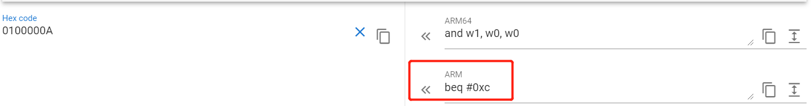
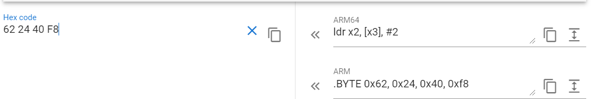

# ARMv7 汇编

首先将 clang 添加到临时环境变量中，方便后面使用。

```bash
 ➜ export PATH=$PATH:$ANDROID_HOME/ndk/21.0.6113669/toolchains/llvm/prebuilt/linux-x86_64/bin
```

## 调用 printf 函数

```armasm
    .text
    .globl	main                    @ -- Begin function main
    .align	2
main:
    push {lr}

    ldr r0, [r1]                      @ 输出 argv[0]
    bl printf

    mov r0, #0
    pop {lr}
    bx lr
```

以上代码主要作用就是输出第一个参数，编译运行结果如下：

```bash
clang -target arm-linux-android21 hello.s -o arm_hello
adb push arm_hello /data/local/tmp/arm_hello
adb shell chmod +x /data/local/tmp/arm_hello
adb shell /data/local/tmp/arm_hello
/data/local/tmp/arm_hello%
```

## 实现 ls 功能

```armasm
    .text
    .globl	main                    @ -- Begin function main
    .align	2
main:
    push {r4, r5, lr}

    ldr r0, [r1, #4]
    bl opendir
    cmp r0, #0
    beq .LABEL_EXIT
    mov r4, r0          @ r4保存返回值
    bl readdir
    cmp r0, #0
    beq .LABEL_CLOSE_DIR

    ldr r5, .formart_str_
.LABEL0:
    add r5, pc, r5

.LOOP_READDIR:

    add r1, r0, #0x13
    mov r0, r5
    bl printf
    mov r0, r4
    bl readdir
    cmp r0, #0
    bne .LOOP_READDIR


.LABEL_CLOSE_DIR:
    mov r0, r4
    bl closedir


.LABEL_EXIT:
    mov r0, #0
    pop {r4, r5, lr}
    bx lr

.formart_str_:
    .long .formart_str-(.LABEL0 + 8)

.formart_str:
    .asciz "%s\r\n"     @ 表示定义一个以0结尾的字符串， ascii 表示定义一个不以0结尾的字符串
```

以上代码实现了简单的 `ls` 功能，我们给定参数为 `/sdcard` ，编译运行结果如下：

```bash
clang -target arm-linux-android21 arm_ls.s -o arm_ls
adb push arm_ls /data/local/tmp/arm_ls
adb shell chmod +x /data/local/tmp/arm_ls
adb shell /data/local/tmp/arm_ls /sdcard
.
Podcasts
fart
Notifications
..
Alarms
Ringtones
Download
Android
Movies
DCIM
Pictures
Music
```

## 系统调用

ARMv7 系统调用使用 `R7` 保存系统调用号，`R0` 保存返回结果，`R0-R6` 保存参数。详细信息可以使用 `man syscall` 查看文档。

```armasm
    .text
    .global main
    .align	2
main:
    mov r0, #1              @ stdout
    adr r1, msg             @ address of the string
    ldr r2, =len            @ string length
    mov r7, #4              @ syscall for 'write'
    svc #0                  @ software interrupt

_exit:
    mov r0, 0               @ exit status
    mov r7, #1              @ syscall for 'exit'
    svc #0                  @ software interrupt

msg:
    .ascii "hello syscall v7\n"
len = . - msg
```

以上代码主要作用就是输出 `hello syscall v7`，编译运行结果如下：

```bash
clang -target arm-linux-android21 syscall.s -o syscall
adb push syscall /data/local/tmp/syscall
syscall: 1 file pushed, 0 sk... MB/s (6524 bytes in 0.000s)
adb shell chmod +x /data/local/tmp/syscall
adb shell /data/local/tmp/syscall
hello syscall v7
```

## C 内联汇编

```c
#include <stdio.h>

int add(int i, int j)
{
  int res = 0;
  __asm ("add %[result], %[input_i], %[input_j]"
    : [result] "=r" (res)
    : [input_i] "r" (i), [input_j] "r" (j)
  );
  return res;
}

int main(void)
{
  int a = 1;
  int b = 2;
  int c = 0;

  c = add(a,b);

  printf("Result of %d + %d = %d\n", a, b, c);
}
```

以上代码主要作用就是内联汇编实现两数相加，编译运行结果如下：

```bash
clang -target arm-linux-android21 helloc.c -o arm_helloc
adb push arm_helloc /data/local/tmp/arm_helloc
adb shell chmod +x /data/local/tmp/arm_helloc
adb shell /data/local/tmp/arm_helloc
Result of 1 + 2 = 3
```

## C 内联汇编 syscall

```c
#include <inttypes.h>

void main(void) {
    uint32_t exit_status;

    /* write */
    {
        char msg[] = "hello c inline syscall v7\n";
        uint32_t syscall_return;
        register uint32_t r0 __asm__ ("r0") = 1; /* stdout */
        register char *r1 __asm__ ("r1") = msg;
        register uint32_t r2 __asm__ ("r2") = sizeof(msg);
        register uint32_t r8 __asm__ ("r7") = 4; /* syscall number */
        __asm__ __volatile__ (
            "svc 0;"
            : "+r" (r0)
            : "r" (r1), "r" (r2), "r" (r8)
            : "memory"
        );
        syscall_return = r0;
        exit_status = (syscall_return != sizeof(msg));
    }

    /* exit */
    {
        register uint32_t r0 __asm__ ("r0") = exit_status;
        register uint32_t r7 __asm__ ("r7") = 1;
        __asm__ __volatile__ (
            "svc 0;"
            : "+r" (r0)
            : "r" (r7)
            :
        );
    }
}
```

以上代码主要作用就是内联汇编实现系统调用，编译运行结果如下：

```bash
clang -target arm-linux-android21 hellosyscall.c -o hellosyscall
adb push hellosyscall /data/local/tmp/hellosyscall
adb shell chmod +x /data/local/tmp/hellosyscall
adb shell /data/local/tmp/hellosyscall
hello c inline syscall v7
```

## C/C++ 调用汇编

汇编代码

```armasm
.text
.global add

add:
    add r0, r1
    bx lr
```

C 代码

```c
#include <stdio.h>

int add(int, int);

int main(void)
{
    printf("1+2=%d\n", add(1, 2));
    return 0;
}
```

C++ 代码

```cpp
#include <stdio.h>

extern "C" int add(int, int);

int main(void)
{
    printf("1+2=%d\n", add(1, 2));
    return 0;
}
```

以上代码主要作用就是内联汇编实现系统调用，编译运行结果如下：

```bash
clang -target arm-linux-android21  -c add.s -o add.o
clang -target arm-linux-android21  calladd.cpp add.o -o calladd
adb push calladd /data/local/tmp/calladd
adb shell chmod +x /data/local/tmp/calladd
adb shell /data/local/tmp/calladd
1+2=3
```

# ARMv8 汇编

由于 ARMv8 汇编与 ARMv7 相比，使用的差别不到，这里就简单的举两个例子进行说明。

## 系统调用

ARMv8 系统调用使用 `X8` 保存系统调用号，`X0` 保存返回结果，`X0-X5` 保存参数。详细信息可以使用 `man syscall` 查看文档。

```armasm
.text
.global main
main:
    /* write */
    mov x0, #1
    adr x1, msg
    ldr x2, =len
    mov x8, #64
    svc #80

    /* exit */
    mov x0, #0
    mov x8, #93
    svc #80
msg:
    .asciz "hello syscall v8\n"
len = . - msg
```

以上代码主要作用就是输出 `hello syscall v8`，编译运行结果如下：

```bash
clang -target arm-linux-android21 syscall.s -o syscall
adb push syscall /data/local/tmp/syscall
syscall: 1 file pushed, 0 sk... MB/s (6524 bytes in 0.000s)
adb shell chmod +x /data/local/tmp/syscall
adb shell /data/local/tmp/syscall
hello syscall v7
```

## C 内联汇编 syscall

```c
#include <inttypes.h>

void main(void) {
    uint64_t exit_status;

    /* write */
    {
        char msg[] = "hello syscall v8\n";
        uint64_t syscall_return;
        register uint64_t x0 __asm__ ("x0") = 1; /* stdout */
        register char *x1 __asm__ ("x1") = msg;
        register uint64_t x2 __asm__ ("x2") = sizeof(msg);
        register uint64_t x8 __asm__ ("x8") = 64; /* syscall number */
        __asm__ __volatile__ (
            "svc 0;"
            : "+r" (x0)
            : "r" (x1), "r" (x2), "r" (x8)
            : "memory"
        );
        syscall_return = x0;
        exit_status = (syscall_return != sizeof(msg));
    }

    /* exit */
    {
        register uint64_t x0 __asm__ ("x0") = exit_status;
        register uint64_t x8 __asm__ ("x8") = 93;
        __asm__ __volatile__ (
            "svc 0;"
            : "+r" (x0)
            : "r" (x8)
            :
        );
    }
}
```

以上代码主要作用就是内联汇编实现系统调用，编译运行结果如下：

```bash
clang -target aarch64-linux-android21 inline64.c -o inline64
adb push inline64 /data/local/tmp/inline64
adb shell chmod +x /data/local/tmp/inline64
adb shell /data/local/tmp/inline64
hello syscall v8
```

# 如何查看文档

我这里使用的文档是[DDI0487A_a_armv8_arm.pdf](http://kib.kiev.ua/x86docs/ARMARM/DDI0487A_a_armv8_arm.pdf)

## 查看 AArch32 平台 beq 指令

首先通过目录 `The AArch32 Instruction Sets Overview  -> Branch instructions`找到跳转指令的页面，最终找到 b 指令文档页面。


其中 cond 表示条件，需要去 `About the T32 and A32 Instruction Descriptions ->Conditional execution` 查找。


通过文档我们可以知道，BEQ 指令为下列格式：

```
0000 1010 xxxx xxxx xxxx xxxx xxxx xxxx
```

其中 `xxxx xxxx xxxx xxxx xxxx xxxx` 表示 imm24 ，根据 imm32 算法，最终 imm24 应该是如下方式显示，其中 `s` 表示符号。

```
ssss ss xxxx xxxx xxxx xxxx xxxx xxxx00
```

举例说明

```
0000 1010 0000 0000 0000 0000 0000 0001   // 16进制为0100000A
```

imm32 的值为：

```
0000 000000 0000 0000 0000 0000 000100
```

由于 RAM 指令的 3 级流水线，实际跳转指令为 `beq 0x4 + 2*指令长度` = `beq 0xC` 。

最终去 [armconverter](https://armconverter.com/) 网站进行验证：



## 查看 AArch64 平台 `ldr x2, [x3], 2` 指令


根据文档，该指令二进制如下所示。

```bash
11 111 0 00 01 0 000000010 01 00011 00010
```

对应的 16 进制为 0xF8402462 。



# 参考

[A64-General-Instructions](https://developer.arm.com/documentation/100069/0610/A64-General-Instructions)

[aapcs64.rst](https://github.com/ARM-software/abi-aa/blob/master/aapcs64/aapcs64.rst)

[linux syscall](https://man7.org/linux/man-pages/man2/syscall.2.html)

[chromiumos syscalls](https://chromium.googlesource.com/chromiumos/docs/+/master/constants/syscalls.md)
