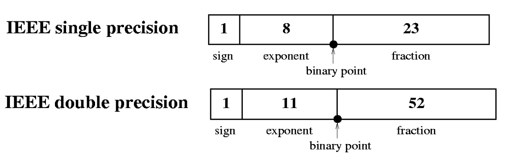
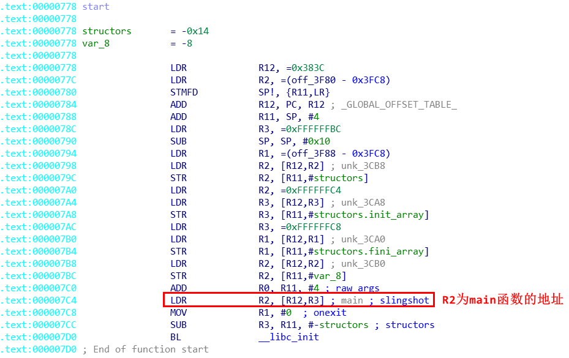
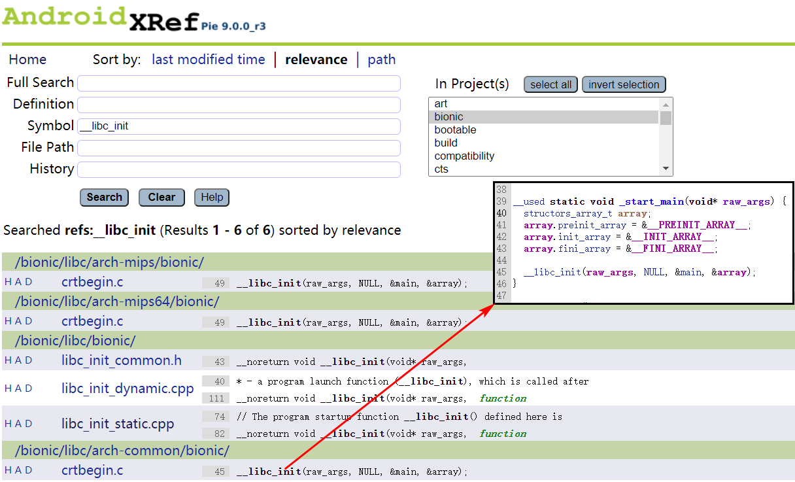

> 本文主要讲 ARMv7 逆向，下一篇将 ARMv8 逆向。

# 基本数据类型

## IEEE 浮点数

通常一个浮点数由符号、尾数、基数和指数组成。尾数的位数用于确定精度；指数的位数用于确定能表示的数的范围。

单精度浮点数为 32 位，具有 24 位有效数字，双精度浮点数位 64 位，具有 53 位有效数字。其记录格式如下：



单精度：31位为符号位，22~30 位为指数位，0~22 位为尾数位。其中指数位为指数值加上 127，尾数位为小数点后对应的二进制数。

双精度：63位为符号位，51~62  位为指数位，0~51 位为尾数位。其中指数位为指数值加上 1023，尾数位为小鼠点后对应的二进制数。

十进制浮点数转换二进制数：
- 整数部分采用除2取余法。
- 小数部分转换乘2取整法。

由此可知，对于十进制浮点数，小数部分最后一位是5时，才可以用浮点数精确表示。

**例1： 7.625 浮点数二进制数表示为：**

整数部分：111

小数部分：
```
0.625 * 2 = 1.25，	整数位为 1 ==> 0.1
0.25 * 2 = 0.5，	整数位为 0 ==> 0.10
0.5 * 2 = 1，		整数位为 1 ==> 0.101
```
即 `7.625 = 1*2^2 + 1*2^1 + 1*2^0 + 1*2^-1 + 0*2^-2 + 1*2^-3` 。
最终结果为 `111.101 = 1.11101 * 10^2`，对应的单精度浮点格式为
```
0   10000001   11101000000000000000000        ==> 0x40F400
--- ------------ -------------------------------
正数  指数为 127+ 2        尾数（小数部分）
```

对应的双精度浮点格式为
```
0   10000000001    1110100000000000000000000000000000000000000000000000  ==> 0x401E800000000000
--- -------------  ---------------------------------------------------
正数  指数为 1023+2      尾数（小数部分）
```

**例2： 0.625 的二进制数为 `0.101= 1.01*10^-1` ；对应的单精度浮点格式为**
```
0         01111110         01000000000000000000000    ==> 0x 3F20 0000
----- ----------------    -------------------------------
正数  指数为 127+ (-1)        尾数（小数部分）
```

**例3：1.3 将无法用二进制表示一个精确值，其小数位23位的结果为： `1.01001100110011001100110` 对应的单精度浮点格式为**
```
1   01111111   01001100110011001100110     ==> 0xBFA6 6666
--- ------------ -------------------------------
正数  指数为 127+ 0        尾数（小数部分）
```

##  main 函数
一般情况下，IDA 会自动将 main 函数标记出来，但是还是有部分应用 IDA 无法自动标记，需要我们手动确认 main 函数。首先找到 start 函数，然后查找 `__libc_init` 的第 3 个参数 R2，该参数即为 main 函数的地址。



可以通过 Android 源码进行验证，在 http://androidxref.com/ 网站上搜索 `__libc_init` 调用位置，可以发现其第三个参数为 main 函数的地址。




## 整型
C++ 的整型包含 int、short、long、long long、unsigned int、unsigned short、unsigned long、unsigned long long。

基本数据类型没有什么好说的，下面简单的了解一下就好。

```c
# include <stdio.h>

int main(int argc, char const *argv[])
{
    float f1 = 7.625f, f2 = 0.625f, f3 = -7.625f;
    double d1 = 7.625, d2 = 0.625, d3 = -7.625;
    char a = 'a';
    unsigned short u2 = 265;
    unsigned int u4 = 123;
    unsigned long u8 = 456;
    unsigned long long uu8 =789;

    short s2 = -265;
    int i4 = -123;
    long l8 = -456;
    long long ll8 =-789;

    return 0;
}
```
使用下列命令生成 ARMv7 汇编文件。
```
➜  export PATH=$PATH:$ANDROID_HOME/ndk/21.0.6113669/toolchains/llvm/prebuilt/linux-x86_64/bin
➜  clang -target arm-linux-android21 -S basic.c -o basic.s 
➜  clang -target arm-linux-android21 basic.s  -o basic
```

为了防止被优化，所以没有启动 `O2` 优化编译选项，因此汇编代码比较冗余。IDA 对应的汇编内容如下。
```armasm
.text:0000039C                 SUB             SP, SP, #0x60
.text:000003A0                 MOV             R2, #0
.text:000003A4                 STR             R2, [SP,#0x60+var_4]
.text:000003A8                 STR             R0, [SP,#0x60+var_8]
.text:000003AC                 STR             R1, [SP,#0x60+var_C]
.text:000003B0                 MOV             R0, #0x40F40000 ; R0 = 0x40F40000  => 7.725f
.text:000003B8                 STR             R0, [SP,#0x60+var_10] ; 使用栈空间保存 7.725 , 即局部变量都保存在栈中，下面的操作类似。
.text:000003BC                 MOV             R0, #0x3F200000
.text:000003C4                 STR             R0, [SP,#0x60+var_14]
.text:000003C8                 MOV             R0, #0xC0F40000
.text:000003D0                 STR             R0, [SP,#0x60+var_18]
.text:000003D4                 MOV             R0, #0x401E8000
.text:000003DC                 STR             R0, [SP,#0x60+var_1C] ; 对应着 double 类型的高32位
.text:000003E0                 STR             R2, [SP,#0x60+var_20] ; 对应着 double 类型的低32位，即最终值为 0x401E 8000 0000 0000
.text:000003E4                 MOV             R0, #0x3FE40000
.text:000003EC                 STR             R0, [SP,#0x60+var_24]
.text:000003F0                 STR             R2, [SP,#0x60+var_28]
.text:000003F4                 MOV             R0, #0xC01E8000
.text:000003FC                 STR             R0, [SP,#0x60+var_2C]
.text:00000400                 STR             R2, [SP,#0x60+var_30]
.text:00000404                 MOV             R0, #0x61 ; 'a'
.text:00000408                 STRB            R0, [SP,#0x60+var_31]
.text:0000040C                 MOV             R0, #0x109
.text:00000414                 STRH            R0, [SP,#0x60+var_34]
.text:00000418                 MOV             R0, #0x7B ; '{'
.text:0000041C                 STR             R0, [SP,#0x60+var_38]
.text:00000420                 MOV             R0, #0x1C8
.text:00000424                 STR             R0, [SP,#0x60+var_3C]
.text:00000428                 STR             R2, [SP,#0x60+var_44]
.text:0000042C                 MOV             R0, #0x315
.text:00000434                 STR             R0, [SP,#0x60+var_48]
.text:00000438                 MOV             R0, #0xFEF7
.text:00000440                 STRH            R0, [SP,#0x60+var_4A]
.text:00000444                 MOV             R0, #0xFFFFFF85
.text:00000448                 STR             R0, [SP,#0x60+var_50]
.text:0000044C                 LDR             R0, =0xFFFFFE38
.text:00000450                 STR             R0, [SP,#0x60+var_54]
.text:00000454                 MOV             R0, #0xFFFFFFFF
.text:00000458                 STR             R0, [SP,#0x60+var_5C] ; 高32位为 -1
.text:0000045C                 MOV             R0, #0xFFFFFCEB
.text:00000460                 STR             R0, [SP,#0x60+var_60] ; 低32位位-789;
.text:00000464                 MOV             R0, R2
.text:00000468                 ADD             SP, SP, #0x60 ; '`'
.text:0000046C                 BX              LR
```
可以看出基本数据类型直接使用对应大小的内存保存。

# 加、减、乘和位运算

整型的加法和减法比较简单，我们主要看一下浮点数的加法。

## 浮点数加法
```c
#include<stdio.h>

int main(int argc, char const *argv[])
{
    float f1 = argc +  0.625;
    printf("%f\r\n", f1);
    return 0;
}
```
对应的 makefile 文件。
```makefile
add_sub:
	clang -target arm-linux-android21 -O2 add_sub.c -o add_sub
	adb push add_sub /data/local/tmp/add_sub
	adb shell chmod +x /data/local/tmp/add_sub
	adb shell /data/local/tmp/add_sub
```
使用 IDA 查看对应的汇编代码：
```armasm
.text:000003D4                 PUSH            {R11,LR}
.text:000003D8                 MOV             R11, SP
.text:000003DC                 BL              __floatsisf ; Convert int to float.
.text:000003E0                 MOV             R1, #0x3F200000
.text:000003E8                 BL              __aeabi_fadd ; Add, float.
.text:000003EC                 BL              __extendsfdf2 ; Extend float to double.
.text:000003F0                 MOV             R2, R0
.text:000003F4                 LDR             R0, =(aF - 0x404) ; "%f\r\n"
.text:000003F8                 MOV             R3, R1
.text:000003FC                 ADD             R0, PC, R0 ; "%f\r\n"
.text:00000400                 BL              printf
.text:00000404                 MOV             R0, #0
.text:00000408                 POP             {R11,LR}
.text:0000040C                 BX              LR
```
在汇编代码中，我们可以看到调用了 `__floatsisf` 、 `__aeabi_fadd` 、 `__extendsfdf2` 函数，通过名字可以猜测与浮点数运算相关。通过搜索后发现了相关文档：https://www.segger.com/doc/UM12008_FloatingPointLibrary.html ，通过该文档可以查看各种浮点运算相关的库函数。

而实际逆向过程中，各种函数的名称都经过处理了，不会有这么多符号，我们使用 strip 工具进行处理一下：
```bash
arm-linux-androideabi-strip --strip-unneeded add_sub
```

IDA 反汇编结果如下：
```armasm
.text:000003D4                 PUSH            {R11,LR}
.text:000003D8                 MOV             R11, SP
.text:000003DC                 BL              sub_970
.text:000003E0                 MOV             R1, #0x3F200000
.text:000003E8                 BL              sub_7D8
.text:000003EC                 BL              sub_718
.text:000003F0                 MOV             R2, R0
.text:000003F4                 LDR             R0, =(aF - 0x404) ; "%f\r\n"
.text:000003F8                 MOV             R3, R1
.text:000003FC                 ADD             R0, PC, R0 ; "%f\r\n"
.text:00000400                 BL              printf
.text:00000404                 MOV             R0, #0
.text:00000408                 POP             {R11,LR}
.text:0000040C                 BX              LR
```
可以发现浮点数相关的函数名没有了，这时就需要进一步跟进函数进行或者制作 sig 文件确认函数的功能。

## 乘法
```c
#include <stdio.h>
int main(int argc, char const *argv[])
{
    int n = argc * 8;
    printf("%d\r\n", n);
    n = n * 7;
    printf("%d\r\n", n);
    return 0;
}
```
makefile 文件内容如下：
```makefile
mul:
	clang -target arm-linux-android21 -O2 mul.c -o mul
	adb push mul /data/local/tmp/mul
	adb shell chmod +x /data/local/tmp/mul
	adb shell /data/local/tmp/mul
```

IDA 反汇编结果如下：
```armasm
.text:000003D4                 PUSH            {R4,R5,R11,LR}
.text:000003D8                 ADD             R11, SP, #8
.text:000003DC                 LDR             R5, =(aD - 0x3F0) ; "%d\r\n"
.text:000003E0                 MOV             R4, R0
.text:000003E4                 MOV             R1, R0,LSL#3
.text:000003E8                 ADD             R5, PC, R5 ; "%d\r\n"
.text:000003EC                 MOV             R0, R5  ; format
.text:000003F0                 BL              printf
.text:000003F4                 RSB             R0, R4, R4,LSL#3 ; R0=R4<<3-R4=R4*7
.text:000003F8                 MOV             R1, R0,LSL#3
.text:000003FC                 MOV             R0, R5  ; format
.text:00000400                 BL              printf
.text:00000404                 MOV             R0, #0
.text:00000408                 POP             {R4,R5,R11,LR}
.text:0000040C                 BX              LR
```
可以看到乘法运算编译后变成了位运算，这是因为位运算使用的指令周期比较短，速度更快。

## 位运算
```c
#include <stdio.h>
int main(int argc, char const *argv[])
{
    int n = argc & 2;
    printf("%d\r\n", n);
    
    n = n | (int)argv;
    printf("%d\r\n", n);

    n = n ^ 3;
    printf("%d\r\n", n);

    n = ~n;
    printf("%d\r\n", n);

    n = n<<3;
    printf("%d\r\n", n);

    n = n>>argc;
    printf("%d\r\n", n);
    return 0;
}

```
makefile 文件内容如下：
```makefile
bit:
	clang -target arm-linux-android21 -O2 bit.c -o bit
	adb push bit /data/local/tmp/bit
	adb shell chmod +x /data/local/tmp/bit
	adb shell /data/local/tmp/bit
```

IDA 反汇编结果如下：

```armasm
.text:000003D4                 PUSH            {R4-R7,R11,LR}
.text:000003D8                 ADD             R11, SP, #0x10
.text:000003DC                 LDR             R7, =(aD - 0x3F8) ; "%d\r\n"
.text:000003E0                 AND             R6, R0, #2
.text:000003E4                 MOV             R5, R1
.text:000003E8                 MOV             R4, R0
.text:000003EC                 MOV             R1, R6
.text:000003F0                 ADD             R7, PC, R7 ; "%d\r\n"
.text:000003F4                 MOV             R0, R7  ; format
.text:000003F8                 BL              printf
.text:000003FC                 ORR             R5, R6, R5
.text:00000400                 MOV             R0, R7  ; format
.text:00000404                 MOV             R1, R5
.text:00000408                 BL              printf
.text:0000040C                 EOR             R1, R5, #3
.text:00000410                 MOV             R0, R7  ; format
.text:00000414                 BL              printf
.text:00000418                 MOV             R0, #0xFFFFFFFC
.text:0000041C                 EOR             R5, R5, R0
.text:00000420                 MOV             R0, R7  ; format
.text:00000424                 MOV             R1, R5
.text:00000428                 BL              printf
.text:0000042C                 MOV             R5, R5,LSL#3
.text:00000430                 MOV             R0, R7  ; format
.text:00000434                 MOV             R1, R5
.text:00000438                 BL              printf
.text:0000043C                 MOV             R1, R5,ASR R4
.text:00000440                 MOV             R0, R7  ; format
.text:00000444                 BL              printf
.text:00000448                 MOV             R0, #0
.text:0000044C                 POP             {R4-R7,R11,LR}
.text:00000450                 BX              LR
```
可以看到位运算基本都有对应的汇编指令。

# 除法和模运算
除法运算会转换位乘法和位运算，在转换过程中比较复杂，有多种转换公式，下面将分多种情况进行讲解。

##  x 除以 2^n
算法：
```
if(n >= 0){
    x >> n;
}else{
    (x + 2^n -1) >> n;
}
```
例如：
```c
#include<stdio.h>

int main(int argc, char const *argv[])
{
    int i = argc / 4;
    int j = argc % 8;
    printf("%d, %d\r\n", i, j);
    return 0;
}
```

IDA 反汇编结果如下：
```armasm
.text:000003D4                 PUSH            {R11,LR}
.text:000003D8                 MOV             R11, SP
.text:000003DC                 MOV             R1, R0,ASR#31 ;  获取符号位，R1=0或者R1=-1
.text:000003E0                 ADD             R2, R0, R1,LSR#29 ; 如果R1=0,则R2=R0,否则R2=R0+7
.text:000003E4                 BIC             R2, R2, #7 ; 按位清除
.text:000003E8                 SUB             R2, R0, R2
.text:000003EC                 ADD             R0, R0, R1,LSR#30 ; 如果R1=0,则R2=R0,否则R2=R0+3
.text:000003F0                 MOV             R1, R0,ASR#2 ; R1=R0>>2,即n=2,除数位2^2=4
.text:000003F4                 LDR             R0, =(aDD - 0x400) ; "%d, %d\r\n"
.text:000003F8                 ADD             R0, PC, R0 ; "%d, %d\r\n"
.text:000003FC                 BL              printf
.text:00000400                 MOV             R0, #0
.text:00000404                 POP             {R11,LR}
.text:00000408                 BX              LR
```


## x 除以负 2^n
算法：
```
if(x >= 0)
    -(x >> n);
else
    -((x + 2^n -1) >> n);
```
例如:
```c
#include <stdio.h>

int main(int argc, char const *argv[])
{
    int n = argc /-4;
    printf("%d\r\n", n);
    n = argc % -8;
    printf("%d\r\n", n);
    return 0;
}
```
makefile文件：
```makefile
div02:
	clang -target arm-linux-android21 -O2 div02.c -o div02
	adb push div02 /data/local/tmp/div02
	adb shell chmod +x /data/local/tmp/div02
	adb shell /data/local/tmp/div02
```

IDA 反汇编结果如下：
```
.text:000003D4                 PUSH            {R4-R6,R10,R11,LR}
.text:000003D8                 ADD             R11, SP, #0x10
.text:000003DC                 LDR             R5, =(aD - 0x3FC) ; "%d\r\n"
.text:000003E0                 MOV             R6, R0,ASR#31 ; 获取符号位，R6=0或者R6=-1
.text:000003E4                 MOV             R4, R0
.text:000003E8                 MOV             R1, #0
.text:000003EC                 ADD             R0, R0, R6,LSR#30 ; R6逻辑右移30位，则R6=0或者R6=3
.text:000003F0                 SUB             R1, R1, R0,ASR#2 ; 0-(R0>>2)
.text:000003F4                 ADD             R5, PC, R5 ; "%d\r\n"
.text:000003F8                 MOV             R0, R5  ; format
.text:000003FC                 BL              printf
.text:00000400                 ADD             R0, R4, R6,LSR#29 ; R6逻辑右移29位，则R6=0或者R6=7
.text:00000404                 BIC             R0, R0, #7
.text:00000408                 SUB             R1, R4, R0
.text:0000040C                 MOV             R0, R5  ; format
.text:00000410                 BL              printf
.text:00000414                 MOV             R0, #0
.text:00000418                 POP             {R4-R6,R10,R11,LR}
.text:0000041C                 BX              LR
```

## x 除以非 2^n
### 第一种情况，MAGIC_NUM > 0
算法：
```
if(x >=0)
    (x * MAGIC_NUM) >> (32 + n);
else
    ((x * MAGIC_NUM) >> (32 + n)) + 1;
``` 
> 除数 o = 2^(32+n) / MAGIC_NUM;

例如:
```c
#include <stdio.h>
int main(int argc, char const *argv[])
{
    int n = argc / 3;
    printf("%d\r\n", n);
    n = argc % 5;
    printf("%d\r\n", n);
    return 0;
}
```
makefile文件：
```makefile
div03:
	clang -target arm-linux-android21 -O2 div03.c -o div03
	adb push div03 /data/local/tmp/div03
	adb shell chmod +x /data/local/tmp/div03
	adb shell /data/local/tmp/div03
```

IDA 反汇编结果如下：
```armasm
.text:B7A693D4                 PUSH            {R4,R5,R11,LR}
.text:B7A693D8                 ADD             R11, SP, #8
.text:B7A693DC                 LDR             R5, =(aD - 0xB7A693F4) ; "%d\r\n"
.text:B7A693E0                 MOV             R4, R0
.text:B7A693E4                 LDR             R0, =0x55555556
.text:B7A693E8                 SMULL           R1, R2, R4, R0 ; R1,R2=x*MAGIC_NUM
.text:B7A693EC                 ADD             R5, PC, R5 ; "%d\r\n"
.text:B7A693F0                 ADD             R1, R2, R2,LSR#31 ; 逻辑右移31位获取符号位，即+0或+1；R1,R2组成的64位数隐式的右移动了32位
.text:B7A693F4                 MOV             R0, R5  ; format
.text:B7A693F8                 BL              printf
.text:B7A693FC                 LDR             R0, =0x66666667
.text:B7A69400                 SMULL           R1, R2, R4, R0
.text:B7A69404                 MOV             R0, R2,ASR#1 ; R2算术右移1位，实际相当于R1,R2组成的64位数移动了32+1位
.text:B7A69408                 ADD             R0, R0, R2,LSR#31 ; 逻辑右移31位获取符号位
.text:B7A6940C                 ADD             R0, R0, R0,LSL#2
.text:B7A69410                 SUB             R1, R4, R0
.text:B7A69414                 MOV             R0, R5  ; format
.text:B7A69418                 BL              printf
.text:B7A6941C                 MOV             R0, #0
.text:B7A69420                 POP             {R4,R5,R11,LR}
.text:B7A69424                 BX              LR
```

###  第二种情况，MAGIC_NUM < 0
算法：
```
    if (x >=0) 
        ((x * MAGIC_NUM) >> 32 + x) >> n
    if (x < 0) 
        (((x * MAGIC_NUM) >> 32 + x) >> n) + 1
```
> 除数o = 2^(32+n) / MAGIC_NUM;

例如:
```
#include <stdio.h>

int main(int argc, char const *argv[])
{
    int n = argc / 7;
    printf("%d\r\n", n);
    n = argc % 13;
    printf("%d\r\n", n);
    return 0;
}
```
makefile文件：
```makefile
div03:
	clang -target arm-linux-android21 -O2 div03.c -o div03
	adb push div03 /data/local/tmp/div03
	adb shell chmod +x /data/local/tmp/div03
	adb shell /data/local/tmp/div03
```

IDA 反汇编结果如下：
```armasm
.text:000003D4                 PUSH            {R4,R5,R11,LR}
.text:000003D8                 ADD             R11, SP, #8
.text:000003DC                 MOV             R4, R0
.text:000003E0                 LDR             R0, =0x92492493
.text:000003E4                 LDR             R5, =(aD - 0x3F4) ; "%d\r\n"
.text:000003E8                 SMULL           R1, R2, R4, R0
.text:000003EC                 ADD             R5, PC, R5 ; "%d\r\n"
.text:000003F0                 ADD             R0, R2, R4 ; 等价(x * MAGIC_NUM) >> 32 + x
.text:000003F4                 MOV             R1, R0,ASR#2 ; 然后继续右移n位
.text:000003F8                 ADD             R1, R1, R0,LSR#31 ; 获取符号位
.text:000003FC                 MOV             R0, R5  ; format
.text:00000400                 BL              printf
.text:00000404                 LDR             R0, =0x4EC4EC4F
.text:00000408                 SMULL           R1, R2, R4, R0
.text:0000040C                 MOV             R0, R2,ASR#2
.text:00000410                 MOV             R1, #0xD
.text:00000414                 ADD             R0, R0, R2,LSR#31
.text:00000418                 MUL             R2, R0, R1
.text:0000041C                 MOV             R0, R5  ; format
.text:00000420                 SUB             R1, R4, R2
.text:00000424                 BL              printf
.text:00000428                 MOV             R0, #0
.text:0000042C                 POP             {R4,R5,R11,LR}
.text:00000430                 BX              LR
```

## x 除以负非 2^n
当 x 除以负数 c 时， MAGIC_NUM 为 x 除以 |c| 的 MAGIC_NUM 的补码
### 第一种情况， MAGIC_NUM > 0
算法：
```
if(x >=0)
    ((x * MAGIC_NUM)>>32 - x)>>n;
else
    ((x * MAGIC_NUM)>>32 - x)>>n + 1;
```
> 除数o = - 2^(32 + n) /(2^32-MAGIC_NUM)

例如: 
```c
#include <stdio.h>
int main(int argc, char const *argv[])
{
    int n = argc / -3;
    printf("%d\r\n", n);
    n = argc / -5;
    printf("%d\r\n", n);
    return 0;
}
```
makefile文件：
```makefile
div05:
	clang -target arm-linux-android21 -O2 div05.c -o div05
	adb push div05 /data/local/tmp/div05
	adb shell chmod +x /data/local/tmp/div05
	adb shell /data/local/tmp/div05
```

IDA 反汇编结果如下：
```armasm

```


### 第二种情况，MAGIC_NUM < 0
算法：
```
if(x >=0)
    (x * MAGIC_NUM) >> (32 + n);
else
    ((x * MAGIC_NUM) >> (32 + n)) + 1;
```
> 除数o = -2^(32+n) / (2^32-MAGIC_NUM)

例如: 
```
x / -7; 
MOV     R5, R0
MOV     R6, R0,ASR#31
LDR     R1, =2454267027
SMULL   R3, R1, R5, R1
ADD     R1, R1, R5
RSB     R1, R6, R1,ASR#2

o = -2^34 / 2454267027;
```

## x 为无符号数，除以2^n
算法：
```
x >> n
```
例如: 
```
 x / 8
MOV     R1, R0,LSR#3
```

## x 为无符号数，除以非 2^n
### 第一种情况 
算法：
```
(x * MAGIC_NUM)>>(32+n)
```
> 除数o = 2^(32+n) / MAGIC_NUM

例如: 
```
x / 3

LDR     R1, =0xAAAAAAAB
UMULL   R3, R1, R0, R1
MOV     R1, R1,LSR#1

```

### 第二种情况
算法：
```
(((x - (x*MAGIC_NUM) >> 32) >> i) + (x*MAGIC_NUM) >> 32) >> j
```
> 除数o = (2^(32 + i +j)) / (2^32 + MAGIC_NUM);

例如：
```
x / 7; 
LDR     R3, =0x24924925
UMULL   R2, R3, R0, R3
RSB     R1, R3, R0
ADD     R1, R3, R1,LSR#1
MOV     R1, R1,LSR#2
```
除法运算主要就是以上几种模式，看到类似的 MAGIC_NUM 可以初步判断为除法。


