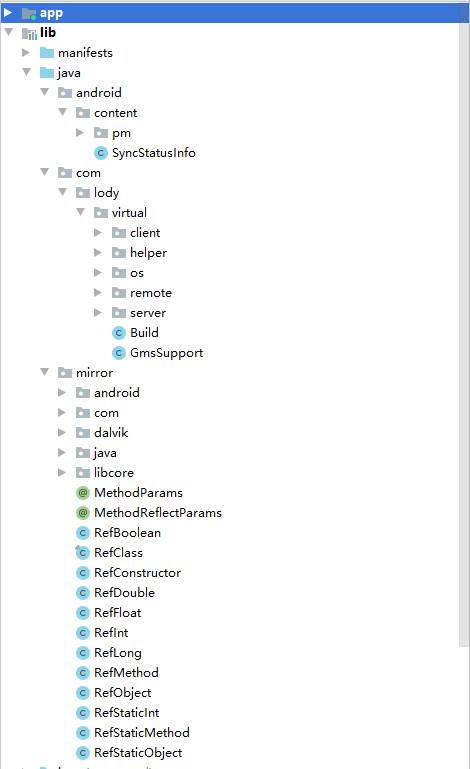
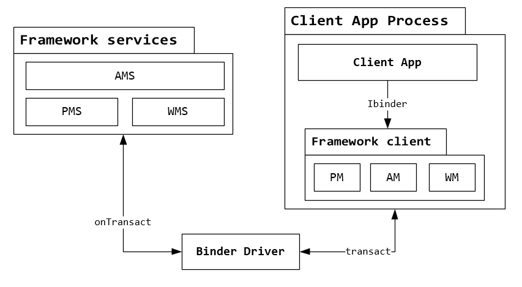
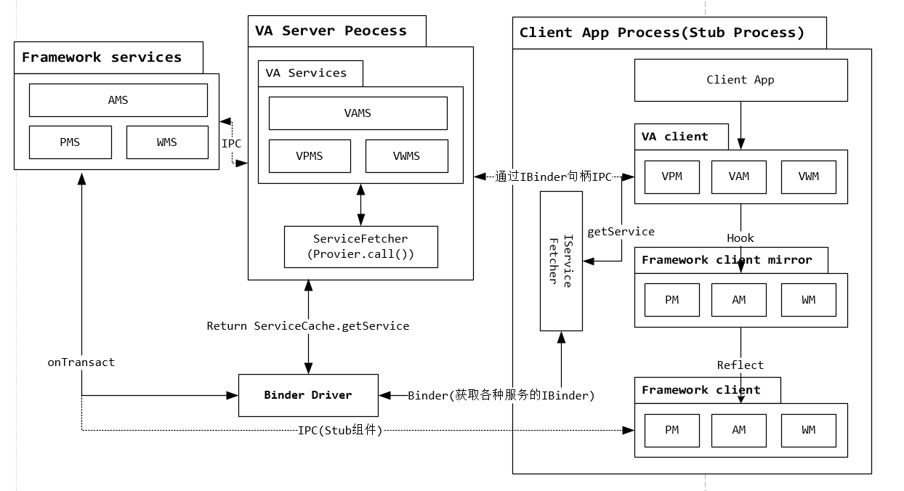

> 转载 : https://blog.csdn.net/ganyao939543405/article/details/76146760

最近发现了一个非常好的开源项目，基本实现了一个 Android 上的沙箱环境，不过应用场景最多的还是应用双开。
* VA github: https://github.com/asLody/VirtualApp 
* VA 的源码注释: https://github.com/ganyao114/VA_Doc 

本文主要是分析一下项目的整体结构。


# 包结构



## android.content
主要是 `PackageParser`,该类型覆盖了系统的隐藏类 `android.content.pm.PackageParser`

## com.lody.virtual
这里就是框架的主体代码了

### client
运行在客户端的代码，指加载到 `VA` 中的子程序在被 `VA` 代理(hook)之后,所运行的代码

### HOOK
hook java 层函数的一些代码

### IPC
伪造的一些 `framework` 层的 `IPC` 服务类，诸如 `ActivityManager`, `ServiceManager` 等等，使用 `VXXXXX` 命名。`hook` 之后，子程序就会运行到这里而不是原来真正的系统 `framework` 代码。

### Stub
系统四大组件的插桩，如提前注册在 `Menifest` 里的几十个 `StubActivity` 。

### remote
一些可序列化 `Model` ，继承于 `Parcelable` 。  

### server
`server` 端代码， `VA` 伪造了一套 `framework` 层系统 `service` 的代码，他在一个独立的服务中记录管理组件的各种 `Recorder` ，其逻辑其实与系统原生的相近，通过 `Binder` 与 `client` 端的 `ipc` 包中的 `VXXXXManager` 通讯。诸如 `AMS(VAMS)` 、 `PMS(VPMS)`。

## mirror
系统 `framework` 的镜像，实现了与 `framework` 层相对应的结构，封装了反射获取系统隐藏字段和方法的，便于直接调用获取或者赋值以及调用方法。


# 一些基础措施的封装
## Mirror framework 层镜像

### 成员变量 Field 映射
根据成员变量类型，映射类型分为几个基本数据类型和对象引用类型。下面就以对象引用类型为例，其他类型类似。

类型 `RefObject` 代表映射 `framework` 层同名的泛型类型成员变量。
```
// Field 映射
@SuppressWarnings("unchecked")
public class RefObject<T> {

    // framework 层对应的 Field
    private Field field;

    public RefObject(Class<?> cls, Field field) throws NoSuchFieldException {
        // 获取 framework 中同名字段的 field
        this.field = cls.getDeclaredField(field.getName());
        this.field.setAccessible(true);
    }

    // 获取变量值
    public T get(Object object) {
        try {
            return (T) this.field.get(object);
        } catch (Exception e) {
            return null;
        }
    }
    // 赋值
    public void set(Object obj, T value) {
        try {
            this.field.set(obj, value);
        } catch (Exception e) {
            //Ignore
        }
    }
}
```

以 `framework` 层中隐藏类 `LoadedApk` 来说：
```
public class LoadedApk {
    public static Class Class = RefClass.load(LoadedApk.class, "android.app.LoadedApk");
    public static RefObject<ApplicationInfo> mApplicationInfo;
    @MethodParams({boolean.class, Instrumentation.class})
    public static RefMethod<Application> makeApplication;
```

`mApplicationInfo` 就是 `LoadedApk` 中私有字段 `ApplicationInfo` 类型的同名映射。

当你引用 `LoadedApk Mirror` 类时，类加载器加载该类并执行静态成员的初始化 `RefClass.load(LoadedApk.class, “android.app.LoadedApk”)` ， `LoadedApk Mirror` 类中的同名字段将被反射赋值。

下面看一下 `RefClass.load()` 函数。
```
public static Class load(Class mappingClass, Class<?> realClass) {
    // 获取 Mirror 类的所有字段
    Field[] fields = mappingClass.getDeclaredFields();
    for (Field field : fields) {
        try {
            // 必须是 static 变量
            if (Modifier.isStatic(field.getModifiers())) {
                // 从预设的 Map 中找到 RefXXXX 的构造器
                Constructor<?> constructor = REF_TYPES.get(field.getType());
                if (constructor != null) {
                    // 这里首先利用构造函数获取framework层真正的字段，然后赋值 LoadedApk 的静态字段，一遍后续调用 get 和 set
                    field.set(null, constructor.newInstance(realClass, field));
                }
            }
        }
        catch (Exception e) {
            // Ignore
        }
    }
    return realClass;
}
```
后续再进行调用的话，使用 `LoadedApk.mApplicationInfo.get(instance)` 、 `LoadedApk.mApplicationInfo.set(instance)` 就相当于直接调用 `framework` 层的 `LoadedApk.mApplicationInfo` 字段了。

### Method 映射

其实与 `Field` 类似，只是 `Field` 主要是一个 `call` 即调用方法。
```
@MethodParams({File.class, int.class})
public static RefMethod<PackageParser.Package> parsePackage;
```

表现在 `Mirror` 类型中也是一个字段，不过要在字段上边加上注解以标注参数类型。

当然还有一种情况，参数类型也是隐藏的，则要使用全限定名表示
```
@MethodReflectParams({"android.content.pm.PackageParser$Package", "int"})
public static RefMethod<Void> collectCertificates;
```

## Java 层 Hook
位于 `com.lody.virtual.client.hook`

`Java` 层使用了 `Java` 自带的动态代理

### MethodProxy 
`Hook` 点的代理接口，动态代理中的 `call` 。

重要的是这三个方法：
```
public boolean beforeCall(Object who, Method method, Object... args) {
        return true;
}

public Object call(Object who, Method method, Object... args) throws Throwable {
    return method.invoke(who, args);
}

public Object afterCall(Object who, Method method, Object[] args, Object result) throws Throwable {
    return result;
}
```

以 `hook getServices` 为例：
```
static class GetServices extends MethodProxy {
    @Override
    public String getMethodName() {
        return "getServices";
    }

    @Override
    public Object call(Object who, Method method, Object... args) throws Throwable {
        int maxNum = (int) args[0];
        int flags = (int) args[1];
        return VActivityManager.get().getServices(maxNum, flags).getList();
    }

    @Override
    public boolean isEnable() {
        return isAppProcess();
    }
}
```
* `getMethodName` 是要 `Hook` 的方法名 
* `Hook getServices` 之后发现，真正返回服务的方法变成了仿造的 `VActivityManager` 对象。而在后面我们会知道这些服务最后都会从 `VAMS` 中获取，而不是原来的 `AMS` 。
* 实现了 `isEnable` 方法，这是 `Hook` 开关，如果返回 `false` 则不 `Hook` 该方法，而在这里的条件是，只有在子程序环境中 `Hook` ，而宿主即框架是不需要 `Hook` 的，框架仍然需要连接真正的 `AMS` 以获取在系统 `AMS` 中注册的“外部” `service` 。

那么上面这个 `call` 在哪里被调用呢？ 

**`MethodInvocationStub`** ，这个桩对应一个需要 `Hook` 的类，各种 `Method` 可以在内部添加。

我们需要专注这个方法 `addMethodProxy` 。
```
/**
* Add a method proxy.
*
* @param methodProxy proxy
*/
public MethodProxy addMethodProxy(MethodProxy methodProxy) {
    if (methodProxy != null && !TextUtils.isEmpty(methodProxy.getMethodName())) {
        if (mInternalMethodProxies.containsKey(methodProxy.getMethodName())) {
            VLog.w(TAG, "The Hook(%s, %s) you added has been in existence.", methodProxy.getMethodName(),
                    methodProxy.getClass().getName());
            return methodProxy;
        }
        mInternalMethodProxies.put(methodProxy.getMethodName(), methodProxy);
    }
    return methodProxy;
}
```
这个也是关于动态代理的知识，这里的区别其实就是 `Lody` 对他做了一些接口的抽象，和一些诸如 `Log` 的封装。

添加 `Hook Method` 的方式有两个：
* 一是调用 `addMethodProxy` ，
* 二是在 `Stub` 上添加 `@Inject` 注解。

具体见下一段。

### MethodProxies 
叫这个名字的类很多，每一个 `MethodProxies` 对应一个需要 `Hook` 的 `framework` 类型，需要 `Hook` 的方法以内部类(MethodProxy)的形式罗列在内部。
```
@Inject(MethodProxies.class)
public class LibCoreStub extends MethodInvocationProxy<MethodInvocationStub<Object>> {
```
将要 `Hook` 的方法集合 `MethodProxies` 绑定到 `Stub` 上。然后就是 `Stub` 对自己头上注解的解析，最终还是会调用到内部的 `addMethodProxy` 方法。
```
protected void onBindMethods() {

    if (mInvocationStub == null) {
        return;
    }
    Class<? extends MethodInvocationProxy> clazz = getClass();
    Inject inject = clazz.getAnnotation(Inject.class);
    if (inject != null) {
        Class<?> proxiesClass = inject.value();
        Class<?>[] innerClasses = proxiesClass.getDeclaredClasses();
        // 遍历内部类
        for (Class<?> innerClass : innerClasses) {
            if (!Modifier.isAbstract(innerClass.getModifiers())
                    && MethodProxy.class.isAssignableFrom(innerClass)
                    && innerClass.getAnnotation(SkipInject.class) == null) {
                addMethodProxy(innerClass);
            }
        }
    }
}
```


# 运行时结构
这点很重要， `VA` 在运行时并不是一个简单的单进程的库，其需要在系统调用到其预先注册的 `Stub` 组件之后接手系统代理 `Client App` 的 四大组件，包括生命周期等一切事物。

`VA` 参照原生系统 `framework` 仿造了一套 `framework service`，还有配套在 `client` 端的 `framework` 库。

## 系统原生的 framework 运作方式 
简单来说，我们平时所用到的 `app` 运行空间中的 `framework api` 最终会通过 `Binder` 远程调用到 `framework service` 空间的远程服务。

而远程服务类似 `AMS` 中的 `Recoder` 中会持有 `app` 空间的 `Ibinder token` 句柄，通过 `token` 也可以让 `framework service` 远程调用到 `app` 空间。




## VA 环境下 framework 运作方式 
而在 `VA` 环境下，情况其实也是类似，只不过在 `framework service` 和 `client app` 之间还有另外一个 `VA` 实现的 `VAService` ， `VAService` 仿造了 `framework service` 的一些功能。

因为在 `VA` 中运行的 `Client App` 都是没有(也不能注册)在 `framework service `的，注册的只有 `VA` 预先注册在 `Menifest` 中的 `Stub` 而已。所以 `frameservice` 是无法像普通 `App` 一样管理 `VA Client App` 的会话的。

这就要依靠 `VA` 仿造的另外一套 `VAService` 完成对 `VA` 中 `Client App` 的会话管理了。



需要注意的是 `VA Client` 获取 `VA Service` 的 `IBinder` 句柄是统一通过 `IServiceFetcher` 这个句柄，这个看上去有些奇怪。而获得 `IServiceFetcher` 本身的方式是通过 `ContentProvider` ，选择 `ContentProvider` 原因是 `ContentProvider` 是同步的，如果使用 `Servicec` ，`Service` 的连接是异步的。

> 使用contentprovider比service实现同步轻松得多。前不久我还在想怎么同步调用service中的方法，最终选择了aidl。但是aidl需要绑定服务才能使用，而使用contentprovider调用同app不同进程的方法一个字符串就可以了，也不要求进程必须在。
