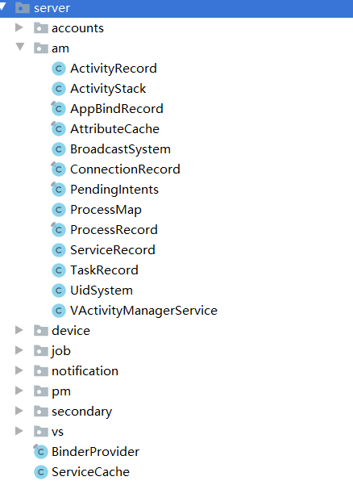

> 转载 : https://blog.csdn.net/ganyao939543405/article/details/76177392


在这之前，我们还是要先了解一下 VA Client Framework 和 VAService 之间的通讯方式

# VAService 与通讯
## VAService
首先 `VAService` 是指 `VA` 仿造 `Android` 原生 `framework` 层 `Service` 实现的一套副本，举例有 `VActivityManagerService` ，它和系统 `AMS` 一样，只不过他管理的是 `VA` 内部 `Client App` 的组件会话。



# VAService 统一管理
首先所有 `VAService` 直接继承与 `XXX.Stub`，也就是 `Binder` ，并且直接使用了一个 `Map` 储存在 `VAService` 进程空间中，并没有注册到系统 `AMS` 中，事实上在 `VAService` 进程中，每个 `Service` 都被当作一个普通对象 `new` 和初始化。

最终，他们被添加到了 `ServiceCache` 中:
```
public class ServiceCache {

	private static final Map<String, IBinder> sCache = new ArrayMap<>(5);

	public static void addService(String name, IBinder service) {
		sCache.put(name, service);
	}

	public static IBinder removeService(String name) {
		return sCache.remove(name);
	}

	public static IBinder getService(String name) {
		return sCache.get(name);
	}

}
```
这个 `cache` 很简单，就是一个 `Map` 。

而被添加的时机则在 `BinderProvider` 的 `onCreate()` 回调中:
```
@Override
public boolean onCreate() {
    Context context = getContext();
    // 这是一个空前台服务，目的是为了保活 VAService 进程，即 :x 进程
    DaemonService.startup(context);
    if (!VirtualCore.get().isStartup()) {
        return true;
    }
    VPackageManagerService.systemReady();
    addService(ServiceManagerNative.PACKAGE, VPackageManagerService.get());
    VActivityManagerService.systemReady(context);
    addService(ServiceManagerNative.ACTIVITY, VActivityManagerService.get());
    addService(ServiceManagerNative.USER, VUserManagerService.get());
    VAppManagerService.systemReady();
    addService(ServiceManagerNative.APP, VAppManagerService.get());
    BroadcastSystem.attach(VActivityManagerService.get(), VAppManagerService.get());
    if (Build.VERSION.SDK_INT >= Build.VERSION_CODES.LOLLIPOP) {
        addService(ServiceManagerNative.JOB, VJobSchedulerService.get());
    }
    VNotificationManagerService.systemReady(context);
    addService(ServiceManagerNative.NOTIFICATION, VNotificationManagerService.get());
    VAppManagerService.get().scanApps();
    VAccountManagerService.systemReady();
    addService(ServiceManagerNative.ACCOUNT, VAccountManagerService.get());
    addService(ServiceManagerNative.VS, VirtualStorageService.get());
    addService(ServiceManagerNative.DEVICE, VDeviceManagerService.get());
    return true;
}
```
需要注意的是 `DeamonService` 是一个空前台服务，目的是为了保活 `VAService` 进程，即 `:x` 进程，因为现在后台服务很容易被杀，在 Android 8.0 以后后台服务只能在后台存活 `5S` ，而前台服务则不受影响。

## ServiceFetcher
`VA` 设计了一个单独的 `ServiceFetcher` 服务用于向外部暴露 `VAService` 中的所有服务的 `IBinder` 句柄，而 `ServiceFetcher` 本身也是 `Binder` 服务，也就是说， `ServiceFetcher` 的 `Ibinder` 句柄是拿到其他 `VAService IBinder` 的钥匙。
```
// ServiceFetcher 实现类 远程调用类
private class ServiceFetcher extends IServiceFetcher.Stub {
    @Override
    public IBinder getService(String name) throws RemoteException {
        if (name != null) {
            return ServiceCache.getService(name);
        }
        return null;
    }

    @Override
    public void addService(String name, IBinder service) throws RemoteException {
        if (name != null && service != null) {
            ServiceCache.addService(name, service);
        }
    }

    @Override
    public void removeService(String name) throws RemoteException {
        if (name != null) {
            ServiceCache.removeService(name);
        }
    }
}
```

`ServicecFetcher` 自身的 `IBnder` 则通过 `BinderProvicer` `这个ContentProvider` 暴露给其他进程:
```
@Override
public Bundle call(String method, String arg, Bundle extras) {
    if ("@".equals(method)) {
        Bundle bundle = new Bundle();
        BundleCompat.putBinder(bundle, "_VA_|_binder_", mServiceFetcher);
        return bundle;
    }
    return null;
}
```

那么在 `Client App` 中` VA Client` 就可以通过 `IServiceFetcher` 这个 `IBinder` 拿到其他服务的 `IBinder` 了：
```
// 通过 ContentProvider 传递一个
private static IServiceFetcher sFetcher;

private static IServiceFetcher getServiceFetcher() {
    if (sFetcher == null || !sFetcher.asBinder().isBinderAlive()) {
        synchronized (ServiceManagerNative.class) {
            Context context = VirtualCore.get().getContext();
            Bundle response = new ProviderCall.Builder(context, SERVICE_CP_AUTH).methodName("@").call();
            /* SERVICE_CP_AUTH 对应着下面的 Provider
                <provider
                    android:name="com.lody.virtual.server.BinderProvider"
                    android:authorities="${applicationId}.virtual.service.BinderProvider"
                    android:exported="false"
                    android:process="@string/engine_process_name" />
            */
            if (response != null) {
                IBinder binder = BundleCompat.getBinder(response, "_VA_|_binder_");
                linkBinderDied(binder);
                sFetcher = IServiceFetcher.Stub.asInterface(binder);
            }
        }
    }
    return sFetcher;
}

// 返回服务的 IBinder 句柄
public static IBinder getService(String name) {
    // 如果是本地服务，直接本地返回
    if (VirtualCore.get().isServerProcess()) {
        return ServiceCache.getService(name);
    }
    // 通过 ServiceFetcher 的句柄找到远程 Service 的句柄
    IServiceFetcher fetcher = getServiceFetcher();
    if (fetcher != null) {
        try {
            return fetcher.getService(name);
        } catch (RemoteException e) {
            e.printStackTrace();
        }
    }
    VLog.e(TAG, "GetService(%s) return null.", name);
    return null;
}
```

# 启动 App
首先要了解的是 `Android App` 是组件化的， `Apk` 其实是 N 多个组件的集合，以及一些资源文件和 `Assert` ， `App` 的启动有多种情况，只要在一个新的进程中调起了 `apk` 中任何一个组件， `App` 将被初始化， `Application` 将被初始化。

## 启动 Activity
我们先看启动 `Activity` 的情况:

### Hook startActivity(重定位 Intent 到 StubActivity)
首先在 `Client App` 中， `startActivity` 方法必须被 `Hook` 掉，不然 `Client App` 调用 `startActivity` 就直指外部 `Activity` 去了。

这部分的原理其实与 `DroidPlugin` 大同小异，由于插件(`Client App`)中的 `Activity` 是没有在 `AMS` 中注册的， `AMS` 自然无法找到我们的插件 `Activity` 。

`Hook` 的目的是我们拿到用户的 `Intent` ，把他替换成指向 `VA` 在 `Menifest` 中站好坑的 `StubActivity` 的 `Intent` ，然后将原 `Intent` 当作 `data` 打包进新 `Intent` 以便日后流程再次进入 `VA` 时恢复。

`Hook` 的方法就是用我们动态代理生成的代理类对象替换系统原来的 `ActiityManagerNative.geDefault` 对象。
```
//ActivityManagerStub.java
@Override
public void inject() throws Throwable {
    if (BuildCompat.isOreo()) {
        //Android Oreo(8.X)
        Object singleton = ActivityManagerOreo.IActivityManagerSingleton.get();
        Singleton.mInstance.set(singleton, getInvocationStub().getProxyInterface());
    } else {
        if (ActivityManagerNative.gDefault.type() == IActivityManager.TYPE) {
            ActivityManagerNative.gDefault.set(getInvocationStub().getProxyInterface());
        } else if (ActivityManagerNative.gDefault.type() == Singleton.TYPE) {
            Object gDefault = ActivityManagerNative.gDefault.get();
            Singleton.mInstance.set(gDefault, getInvocationStub().getProxyInterface());
        }
    }
    BinderInvocationStub hookAMBinder = new BinderInvocationStub(getInvocationStub().getBaseInterface());
    hookAMBinder.copyMethodProxies(getInvocationStub());
    ServiceManager.sCache.get().put(Context.ACTIVITY_SERVICE, hookAMBinder);
}
```
好了，下面只要调用到 `startActivity` 就会被 `Hook` 到 `call` 。

这个函数需要注意以下几点：
1. `VA` 有意将安装和卸载 `APP` 的请求重定向到了卸载 `VA` 内部 `APK` 的逻辑。
2. `resolveActivityInfo` 调用到了 `VPM` 的 `resolveIntent` ，最终会远程调用到 `VPMS` 的 `resolveIntent` ，然后 `VPMS` 就会去查询 `VPackage` 找到目标 `Activity` 并将信息附加在 `ResolveInfo` 中返回 `VPM` 。
3. 最后也是最重要的一点， `startActivity` 会调用到` VAM.startActivity` ，同样最终会远程调用到 `VAMS` 的 `startActivity` 。

```
// Hook startActivity
static class StartActivity extends MethodProxy {

    private static final String SCHEME_FILE = "file";
    private static final String SCHEME_PACKAGE = "package";

    @Override
    public String getMethodName() {
        return "startActivity";
    }

    @Override
    public Object call(Object who, Method method, Object... args) throws Throwable {
        int intentIndex = ArrayUtils.indexOfObject(args, Intent.class, 1);
        if (intentIndex < 0) {
            return ActivityManagerCompat.START_INTENT_NOT_RESOLVED;
        }
        int resultToIndex = ArrayUtils.indexOfObject(args, IBinder.class, 2);
        String resolvedType = (String) args[intentIndex + 1];
        Intent intent = (Intent) args[intentIndex];
        intent.setDataAndType(intent.getData(), resolvedType);
        IBinder resultTo = resultToIndex >= 0 ? (IBinder) args[resultToIndex] : null;
        int userId = VUserHandle.myUserId();

        if (ComponentUtils.isStubComponent(intent)) {
            return method.invoke(who, args);
        }

        // 请求安装和卸载界面
        if (Intent.ACTION_INSTALL_PACKAGE.equals(intent.getAction())
                || (Intent.ACTION_VIEW.equals(intent.getAction())
                && "application/vnd.android.package-archive".equals(intent.getType()))) {
            if (handleInstallRequest(intent)) {
                return 0;
            }
        } else if ((Intent.ACTION_UNINSTALL_PACKAGE.equals(intent.getAction())
                || Intent.ACTION_DELETE.equals(intent.getAction()))
                && "package".equals(intent.getScheme())) {

            if (handleUninstallRequest(intent)) {
                return 0;
            }
        }

        String resultWho = null;
        int requestCode = 0;
        Bundle options = ArrayUtils.getFirst(args, Bundle.class);
        if (resultTo != null) {
            resultWho = (String) args[resultToIndex + 1];
            requestCode = (int) args[resultToIndex + 2];
        }
        // chooser 调用选择界面
        if (ChooserActivity.check(intent)) {
            intent.setComponent(new ComponentName(getHostContext(), ChooserActivity.class));
            intent.putExtra(Constants.EXTRA_USER_HANDLE, userId);
            intent.putExtra(ChooserActivity.EXTRA_DATA, options);
            intent.putExtra(ChooserActivity.EXTRA_WHO, resultWho);
            intent.putExtra(ChooserActivity.EXTRA_REQUEST_CODE, requestCode);
            return method.invoke(who, args);
        }

        if (Build.VERSION.SDK_INT >= Build.VERSION_CODES.JELLY_BEAN_MR2) {
            args[intentIndex - 1] = getHostPkg();
        }

        //解析 ActivityInfo
        ActivityInfo activityInfo = VirtualCore.get().resolveActivityInfo(intent, userId);
        if (activityInfo == null) {
            VLog.e("VActivityManager", "Unable to resolve activityInfo : " + intent);
            if (intent.getPackage() != null && isAppPkg(intent.getPackage())) {
                return ActivityManagerCompat.START_INTENT_NOT_RESOLVED;
            }
            return method.invoke(who, args);
        }

        // 调用远程 VAMS.startActivity
        int res = VActivityManager.get().startActivity(intent, activityInfo, resultTo, options, resultWho, requestCode, VUserHandle.myUserId());
        if (res != 0 && resultTo != null && requestCode > 0) {
            VActivityManager.get().sendActivityResult(resultTo, resultWho, requestCode);
        }

        // 处理 Activity 切换动画，因为此时动画还是 Host 的 Stub Activity 默认动画，需要覆盖成子程序包的动画
        if (resultTo != null) {
            ActivityClientRecord r = VActivityManager.get().getActivityRecord(resultTo);
            if (r != null && r.activity != null) {
                try {
                    TypedValue out = new TypedValue();
                    Resources.Theme theme = r.activity.getResources().newTheme();
                    theme.applyStyle(activityInfo.getThemeResource(), true);
                    if (theme.resolveAttribute(android.R.attr.windowAnimationStyle, out, true)) {

                        TypedArray array = theme.obtainStyledAttributes(out.data,
                                new int[]{
                                        android.R.attr.activityOpenEnterAnimation,
                                        android.R.attr.activityOpenExitAnimation
                                });

                        r.activity.overridePendingTransition(array.getResourceId(0, 0), array.getResourceId(1, 0));
                        array.recycle();
                    }
                } catch (Throwable e) {
                    // Ignore
                }
            }
        }
        return res;
    }


    private boolean handleInstallRequest(Intent intent) {
        IAppRequestListener listener = VirtualCore.get().getAppRequestListener();
        if (listener != null) {
            Uri packageUri = intent.getData();
            if (SCHEME_FILE.equals(packageUri.getScheme())) {
                File sourceFile = new File(packageUri.getPath());
                try {
                    listener.onRequestInstall(sourceFile.getPath());
                    return true;
                } catch (RemoteException e) {
                    e.printStackTrace();
                }
            }

        }
        return false;
    }

    private boolean handleUninstallRequest(Intent intent) {
        IAppRequestListener listener = VirtualCore.get().getAppRequestListener();
        if (listener != null) {
            Uri packageUri = intent.getData();
            if (SCHEME_PACKAGE.equals(packageUri.getScheme())) {
                String pkg = packageUri.getSchemeSpecificPart();
                try {
                    listener.onRequestUninstall(pkg);
                    return true;
                } catch (RemoteException e) {
                    e.printStackTrace();
                }
            }

        }
        return false;
    }
}
```

逻辑最终走到 `VAMS` `后，VAMS` 调用 `ActivityStack`.`startActivityLocked`
```
// 参考 framework 的实现
int startActivityLocked(int userId, Intent intent, ActivityInfo info, IBinder resultTo, Bundle options,
                        String resultWho, int requestCode) {
    optimizeTasksLocked();

    Intent destIntent;
    ActivityRecord sourceRecord = findActivityByToken(userId, resultTo);
    TaskRecord sourceTask = sourceRecord != null ? sourceRecord.task : null;

    ReuseTarget reuseTarget = ReuseTarget.CURRENT;
    ClearTarget clearTarget = ClearTarget.NOTHING;
    boolean clearTop = containFlags(intent, Intent.FLAG_ACTIVITY_CLEAR_TOP);
    boolean clearTask = containFlags(intent, Intent.FLAG_ACTIVITY_CLEAR_TASK);

    if (intent.getComponent() == null) {
        intent.setComponent(new ComponentName(info.packageName, info.name));
    }
    if (sourceRecord != null && sourceRecord.launchMode == LAUNCH_SINGLE_INSTANCE) {
        intent.addFlags(Intent.FLAG_ACTIVITY_NEW_TASK);
    }
    if (clearTop) {
        removeFlags(intent, Intent.FLAG_ACTIVITY_REORDER_TO_FRONT);
        clearTarget = ClearTarget.TOP;
    }
    if (clearTask) {
        if (containFlags(intent, Intent.FLAG_ACTIVITY_NEW_TASK)) {
            clearTarget = ClearTarget.TASK;
        } else {
            removeFlags(intent, Intent.FLAG_ACTIVITY_CLEAR_TASK);
        }
    }
    if (Build.VERSION.SDK_INT >= Build.VERSION_CODES.LOLLIPOP) {
        switch (info.documentLaunchMode) {
            case ActivityInfo.DOCUMENT_LAUNCH_INTO_EXISTING:
                clearTarget = ClearTarget.TASK;
                reuseTarget = ReuseTarget.DOCUMENT;
                break;
            case ActivityInfo.DOCUMENT_LAUNCH_ALWAYS:
                reuseTarget = ReuseTarget.MULTIPLE;
                break;
        }
    }
    boolean singleTop = false;

    switch (info.launchMode) {
        case LAUNCH_SINGLE_TOP: {
            singleTop = true;
            if (containFlags(intent, Intent.FLAG_ACTIVITY_NEW_TASK)) {
                reuseTarget = containFlags(intent, Intent.FLAG_ACTIVITY_MULTIPLE_TASK)
                        ? ReuseTarget.MULTIPLE
                        : ReuseTarget.AFFINITY;
            }
        }
        break;
        case LAUNCH_SINGLE_TASK: {
            clearTop = false;
            clearTarget = ClearTarget.TOP;
            reuseTarget = containFlags(intent, Intent.FLAG_ACTIVITY_MULTIPLE_TASK)
                    ? ReuseTarget.MULTIPLE
                    : ReuseTarget.AFFINITY;
        }
        break;
        case LAUNCH_SINGLE_INSTANCE: {
            clearTop = false;
            clearTarget = ClearTarget.TOP;
            reuseTarget = ReuseTarget.AFFINITY;
        }
        break;
        default: {
            if (containFlags(intent, Intent.FLAG_ACTIVITY_SINGLE_TOP)) {
                singleTop = true;
            }
        }
        break;
    }
    if (clearTarget == ClearTarget.NOTHING) {
        if (containFlags(intent, Intent.FLAG_ACTIVITY_REORDER_TO_FRONT)) {
            clearTarget = ClearTarget.SPEC_ACTIVITY;
        }
    }
    if (sourceTask == null && reuseTarget == ReuseTarget.CURRENT) {
        reuseTarget = ReuseTarget.AFFINITY;
    }

    String affinity = ComponentUtils.getTaskAffinity(info);

    // 根据 Flag 寻找合适的 Task
    TaskRecord reuseTask = null;
    switch (reuseTarget) {
        case AFFINITY:
            reuseTask = findTaskByAffinityLocked(userId, affinity);
            break;
        case DOCUMENT:
            reuseTask = findTaskByIntentLocked(userId, intent);
            break;
        case CURRENT:
            reuseTask = sourceTask;
            break;
        default:
            break;
    }

    boolean taskMarked = false;
    if (reuseTask == null) {
        startActivityInNewTaskLocked(userId, intent, info, options);
    } else {
        boolean delivered = false;
        mAM.moveTaskToFront(reuseTask.taskId, 0);
        boolean startTaskToFront = !clearTask && !clearTop && ComponentUtils.isSameIntent(intent, reuseTask.taskRoot);

        if (clearTarget.deliverIntent || singleTop) {
            taskMarked = markTaskByClearTarget(reuseTask, clearTarget, intent.getComponent());
            ActivityRecord topRecord = topActivityInTask(reuseTask);
            if (clearTop && !singleTop && topRecord != null && taskMarked) {
                topRecord.marked = true;
            }
            // Target activity is on top
            if (topRecord != null && !topRecord.marked && topRecord.component.equals(intent.getComponent())) {
                deliverNewIntentLocked(sourceRecord, topRecord, intent);
                delivered = true;
            }
        }
        if (taskMarked) {
            synchronized (mHistory) {
                scheduleFinishMarkedActivityLocked();
            }
        }
        if (!startTaskToFront) {
            if (!delivered) {
                destIntent = startActivityProcess(userId, sourceRecord, intent, info);
                if (destIntent != null) {
                    startActivityFromSourceTask(reuseTask, destIntent, info, resultWho, requestCode, options);
                }
            }
        }
    }
    return 0;
}
```

然后 `call` 到了 `startActivityProcess` ，这就是真正替换 `Intent` 的地方。
```
// 使用 Host Stub Activity 的 Intent 包装原 Intent 瞒天过海
private Intent startActivityProcess(int userId, ActivityRecord sourceRecord, Intent intent, ActivityInfo info) {
    intent = new Intent(intent);
    // 获得 Activity 对应的 ProcessRecorder，如果没有则表示这是 Process 第一个打开的组件，需要初始化 Application
    ProcessRecord targetApp = mService.startProcessIfNeedLocked(info.processName, userId, info.packageName);
    if (targetApp == null) {
        return null;
    }
    Intent targetIntent = new Intent();

    // 根据 Client App 的 PID 获取 StubActivity
    String stubActivityPath = fetchStubActivity(targetApp.vpid, info);

    Log.e("gy", "map activity:" + intent.getComponent().getClassName() + " -> " + stubActivityPath);

    targetIntent.setClassName(VirtualCore.get().getHostPkg(), stubActivityPath);
    ComponentName component = intent.getComponent();
    if (component == null) {
        component = ComponentUtils.toComponentName(info);
    }
    targetIntent.setType(component.flattenToString());
    StubActivityRecord saveInstance = new StubActivityRecord(intent, info,
            sourceRecord != null ? sourceRecord.component : null, userId);
    saveInstance.saveToIntent(targetIntent);
    return targetIntent;
}
```

`fetchStubActivity` 会根据相同的进程 `id` 在 `VA` 的 `Menifest` 中找到那个提前占坑的 `StubActivity` 。
```
// 获取合适的 StubActivity，返回 StubActivity 全限定名
private String fetchStubActivity(int vpid, ActivityInfo targetInfo) {

    boolean isFloating = false;
    boolean isTranslucent = false;
    boolean showWallpaper = false;
    try {
        int[] R_Styleable_Window = R_Hide.styleable.Window.get();
        int R_Styleable_Window_windowIsTranslucent = R_Hide.styleable.Window_windowIsTranslucent.get();
        int R_Styleable_Window_windowIsFloating = R_Hide.styleable.Window_windowIsFloating.get();
        int R_Styleable_Window_windowShowWallpaper = R_Hide.styleable.Window_windowShowWallpaper.get();

        AttributeCache.Entry ent = AttributeCache.instance().get(targetInfo.packageName, targetInfo.theme,
                R_Styleable_Window);
        if (ent != null && ent.array != null) {
            showWallpaper = ent.array.getBoolean(R_Styleable_Window_windowShowWallpaper, false);
            isTranslucent = ent.array.getBoolean(R_Styleable_Window_windowIsTranslucent, false);
            isFloating = ent.array.getBoolean(R_Styleable_Window_windowIsFloating, false);
        }
    } catch (Throwable e) {
        e.printStackTrace();
    }

    boolean isDialogStyle = isFloating || isTranslucent || showWallpaper;

    // 根据在 Menifest 中注册的 pid
    if (isDialogStyle) {
        return VASettings.getStubDialogName(vpid);
    } else {
        return VASettings.getStubActivityName(vpid);
    }
}
```

这里需要特别注意， `VA` 占坑的方式和 `DroidPlugin` `有些小不同，VA` 没有为每个 `Process` 注册多个 `Activity` ，也没有为不同的启动方式注册多个 `Activity` ，这里确实是有改进的。

这里根本原因是因为 `VA` 对 `VAMS` 实现的更为完整，实现了原版 `AMS` 的基本功能，包括完整的 `Recorder` 管理，`Task Stack` 管理等，这样的话 `StubActivity` 的唯一作用便是携带 `Client App` 真正的 `Intent` 交给 `VAMS` 处理。这套机制衍生到其他的组件也是一样的。

可以简单看一下 `ActivityStack，` 、 `ActivityRecorder` 、 `ActivityRecord` 。
```
/* package */ class ActivityStack {

    private final ActivityManager mAM;
    private final VActivityManagerService mService;

    /**
     * [Key] = TaskId [Value] = TaskRecord
     */
    private final SparseArray<TaskRecord> mHistory = new SparseArray<>();
}

class TaskRecord {
    public final List<ActivityRecord> activities = Collections.synchronizedList(new ArrayList<ActivityRecord>());
    public int taskId;
    public int userId;
    public String affinity;
    public Intent taskRoot;
}

/* package */ class ActivityRecord {
    public TaskRecord task;
    public ComponentName component;
    public ComponentName caller;
    // Client App 中 Activity 的句柄
    public IBinder token;
    public int userId;
    public ProcessRecord process;
    public int launchMode;
    public int flags;
    public boolean marked;
    public String affinity;
}
```

`StubActivityRecorder` 
```
public class StubActivityRecord  {
        public Intent intent;
        public ActivityInfo info;
        public ComponentName caller;
        public int userId;

        public StubActivityRecord(Intent intent, ActivityInfo info, ComponentName caller, int userId) {
            this.intent = intent;
            this.info = info;
            this.caller = caller;
            this.userId = userId;
        }

        // 获取原版 Intent 和一些其他信息
        public StubActivityRecord(Intent stub) {
            this.intent = stub.getParcelableExtra("_VA_|_intent_");
            this.info = stub.getParcelableExtra("_VA_|_info_");
            this.caller = stub.getParcelableExtra("_VA_|_caller_");
            this.userId = stub.getIntExtra("_VA_|_user_id_", 0);
        }

    // 将原版 Intent 塞到 Stub Intent
    public void saveToIntent(Intent stub) {
        stub.putExtra("_VA_|_intent_", intent);
        stub.putExtra("_VA_|_info_", info);
        stub.putExtra("_VA_|_caller_", caller);
        stub.putExtra("_VA_|_user_id_", userId);
    }
}
```

## 初始化 Application
还有一个非常重要的事情，注意到这一行 。
```
// 获得 Activity 对应的 ProcessRecorder，如果没有则表示这是 Process 第一个打开的组件，需要初始化 Application
ProcessRecord targetApp = mService.startProcessIfNeedLocked(info.processName, userId, info.packageName);
```
这里会先去找对应 `Client App` 进程的 `ProcessRecorder` , 找不到代表 `Application` 刚启动尚未初始化:
```
private ProcessRecord performStartProcessLocked(int vuid, int vpid, ApplicationInfo info, String processName) {
    ProcessRecord app = new ProcessRecord(info, processName, vuid, vpid);
    Bundle extras = new Bundle();
    BundleCompat.putBinder(extras, "_VA_|_binder_", app);
    extras.putInt("_VA_|_vuid_", vuid);
    extras.putString("_VA_|_process_", processName);
    extras.putString("_VA_|_pkg_", info.packageName);

    // 调用子程序包的 init_process 方法，并且得到子程序包 IBinder 句柄
    Bundle res = ProviderCall.call(VASettings.getStubAuthority(vpid), "_VA_|_init_process_", null, extras);
    if (res == null) {
        return null;
    }
    int pid = res.getInt("_VA_|_pid_");
    IBinder clientBinder = BundleCompat.getBinder(res, "_VA_|_client_");
    // attach 到 Client 的 VAM
    attachClient(pid, clientBinder);
    return app;
}
```

`ProviderCall.call` 向 `Client App` 的 `StubContentProvider` 发起远程调用：
```
@Override
public Bundle call(String method, String arg, Bundle extras) {
    if ("_VA_|_init_process_".equals(method)) {
        return initProcess(extras);
    }
    return null;
}

private Bundle initProcess(Bundle extras) {
    ConditionVariable lock = VirtualCore.get().getInitLock();
    if (lock != null) {
        lock.block();
    }
    IBinder token = BundleCompat.getBinder(extras,"_VA_|_binder_");
    int vuid = extras.getInt("_VA_|_vuid_");
    VClientImpl client = VClientImpl.get();
    client.initProcess(token, vuid);
    Bundle res = new Bundle();
    BundleCompat.putBinder(res, "_VA_|_client_", client.asBinder());
    res.putInt("_VA_|_pid_", Process.myPid());
    return res;
}
```

`Client App` 的 `IBinder` 句柄(`VClientImpl.asBinder`) 被打包在了 `Bundle` 中返回给 `VAMS` 。

最终 `VAMS` 调用原生 `AM` 的 `startActivity` 向真正的 `AMS` 发送替换成 `StubActivity` 的伪造 `Intent` 。
```
mirror.android.app.IActivityManager.startActivity.call(ActivityManagerNative.getDefault.call(), (Object[]) args);
```

## 恢复原 Intent 重定向到原 Activity
当 `AMS` 收到伪装的 `Intent` 后，就会找到 `StubActivity` ，这时流程回到 `VA` 里的主线程中的消息队列中。

`Hook` 过程就是用我们自己的 `Handler` 替换 `android.os.Handler.mCallback` 因为主线程在这里分发一些操作。
```
@Override
public void inject() throws Throwable {
    otherCallback = getHCallback();
    mirror.android.os.Handler.mCallback.set(getH(), this);
}
```

`handlerMessage` 判断是 `LAUNCH_ACTIVITY Action` 后直接调用了 `handlerLaunchActivity` 方法，和原版其实很像。
```
private boolean handleLaunchActivity(Message msg) {
    Object r = msg.obj;
    Intent stubIntent = ActivityThread.ActivityClientRecord.intent.get(r);
    // 获取原版 Intent 信息
    StubActivityRecord saveInstance = new StubActivityRecord(stubIntent);
    if (saveInstance.intent == null) {
        return true;
    }
    // 原版 Intent
    Intent intent = saveInstance.intent;
    ComponentName caller = saveInstance.caller;
    IBinder token = ActivityThread.ActivityClientRecord.token.get(r);
    ActivityInfo info = saveInstance.info;

    // 如果 token 还没初始化，代表 App 刚刚启动第一个组件
    if (VClientImpl.get().getToken() == null) {
        VActivityManager.get().processRestarted(info.packageName, info.processName, saveInstance.userId);
        getH().sendMessageAtFrontOfQueue(Message.obtain(msg));
        return false;
    }
    // AppBindData 为空，则 App 信息不明
    if (!VClientImpl.get().isBound()) {
        // 初始化并绑定 Application
        VClientImpl.get().bindApplication(info.packageName, info.processName);
        getH().sendMessageAtFrontOfQueue(Message.obtain(msg));
        return false;
    }

    // 获取 TaskId
    int taskId = IActivityManager.getTaskForActivity.call(
            ActivityManagerNative.getDefault.call(),
            token,
            false
    );

    // 1.将 ActivityRecorder 加入 mActivities 2.通知服务端 VAMS Activity 创建完成
    VActivityManager.get().onActivityCreate(ComponentUtils.toComponentName(info), caller, token, info, intent, ComponentUtils.getTaskAffinity(info), taskId, info.launchMode, info.flags);
    ClassLoader appClassLoader = VClientImpl.get().getClassLoader(info.applicationInfo);
    intent.setExtrasClassLoader(appClassLoader);
    // 将 Host Stub Activity Intent 替换为原版 Intent
    ActivityThread.ActivityClientRecord.intent.set(r, intent);
    // 同上
    ActivityThread.ActivityClientRecord.activityInfo.set(r, info);
    return true;
}
```

需要注意的是，如果这个 `Activity` 是这个 `Apk` 启动的第一个组件，则需要 `bindApplication` 初始化 `Application` 操作。
```
private void bindApplicationNoCheck(String packageName, String processName, ConditionVariable lock) {
    mTempLock = lock;
    try {
        // 设置未捕获异常的 Callback
        setupUncaughtHandler();
    } catch (Throwable e) {
        e.printStackTrace();
    }
    try {
        // 修复 Provider 信息
        fixInstalledProviders();
    } catch (Throwable e) {
        e.printStackTrace();
    }
    mirror.android.os.Build.SERIAL.set(deviceInfo.serial);
    mirror.android.os.Build.DEVICE.set(Build.DEVICE.replace(" ", "_"));
    ActivityThread.mInitialApplication.set(
            VirtualCore.mainThread(),
            null
    );
    // 从 VPMS 获取 apk 信息
    AppBindData data = new AppBindData();
    InstalledAppInfo info = VirtualCore.get().getInstalledAppInfo(packageName, 0);
    if (info == null) {
        new Exception("App not exist!").printStackTrace();
        Process.killProcess(0);
        System.exit(0);
    }
    // dex 优化的开关，dalvik 和 art 处理不同
    if (!info.dependSystem && info.skipDexOpt) {
        VLog.d(TAG, "Dex opt skipped.");
        if (VirtualRuntime.isArt()) {
            ARTUtils.init(VirtualCore.get().getContext());
            ARTUtils.setIsDex2oatEnabled(false);
        } else {
            DalvikUtils.init();
            DalvikUtils.setDexOptMode(DalvikUtils.OPTIMIZE_MODE_NONE);
        }
    }
    data.appInfo = VPackageManager.get().getApplicationInfo(packageName, 0, getUserId(vuid));
    data.processName = processName;
    data.providers = VPackageManager.get().queryContentProviders(processName, getVUid(), PackageManager.GET_META_DATA);
    Log.i(TAG, "Binding application " + data.appInfo.packageName + " (" + data.processName + ")");
    mBoundApplication = data;
    // 主要设置进程的名字
    VirtualRuntime.setupRuntime(data.processName, data.appInfo);
    int targetSdkVersion = data.appInfo.targetSdkVersion;
    if (targetSdkVersion < Build.VERSION_CODES.GINGERBREAD) {
        StrictMode.ThreadPolicy newPolicy = new StrictMode.ThreadPolicy.Builder(StrictMode.getThreadPolicy()).permitNetwork().build();
        StrictMode.setThreadPolicy(newPolicy);
    }
    if (Build.VERSION.SDK_INT >= Build.VERSION_CODES.N) {
        if (mirror.android.os.StrictMode.sVmPolicyMask != null) {
            mirror.android.os.StrictMode.sVmPolicyMask.set(0);
        }
    }
    if (Build.VERSION.SDK_INT >= Build.VERSION_CODES.LOLLIPOP && targetSdkVersion < Build.VERSION_CODES.LOLLIPOP) {
        mirror.android.os.Message.updateCheckRecycle.call(targetSdkVersion);
    }
    if (VASettings.ENABLE_IO_REDIRECT) {
        // IO 重定向
        startIOUniformer();
    }
    // hook native 函数
    NativeEngine.hookNative();
    Object mainThread = VirtualCore.mainThread();
    // 准备 dex 列表
    NativeEngine.startDexOverride();
    // 获得子 pkg 的 Context 前提是必须在系统中安装的（疑问？）
    Context context = createPackageContext(data.appInfo.packageName);
    // 设置虚拟机系统环境 临时文件夹 codeCacheDir
    System.setProperty("java.io.tmpdir", context.getCacheDir().getAbsolutePath());
    // oat 的 cache 目录
    File codeCacheDir;
    if (Build.VERSION.SDK_INT >= Build.VERSION_CODES.M) {
        codeCacheDir = context.getCodeCacheDir();
    } else {
        codeCacheDir = context.getCacheDir();
    }
    // 硬件加速的 cache 目录
    if (Build.VERSION.SDK_INT < Build.VERSION_CODES.N) {
        if (HardwareRenderer.setupDiskCache != null) {
            HardwareRenderer.setupDiskCache.call(codeCacheDir);
        }
    } else {
        if (ThreadedRenderer.setupDiskCache != null) {
            ThreadedRenderer.setupDiskCache.call(codeCacheDir);
        }
    }
    if (Build.VERSION.SDK_INT >= Build.VERSION_CODES.M) {
        if (RenderScriptCacheDir.setupDiskCache != null) {
            RenderScriptCacheDir.setupDiskCache.call(codeCacheDir);
        }
    } else if (Build.VERSION.SDK_INT >= Build.VERSION_CODES.JELLY_BEAN) {
        if (RenderScript.setupDiskCache != null) {
            RenderScript.setupDiskCache.call(codeCacheDir);
        }
    }

    // 修复子 App 中 ActivityThread.AppBinderData 的参数，因为之前用的是在 Host 程序中注册的 Stub 的信息
    Object boundApp = fixBoundApp(mBoundApplication);
    mBoundApplication.info = ContextImpl.mPackageInfo.get(context);
    mirror.android.app.ActivityThread.AppBindData.info.set(boundApp, data.info);

    // 同样修复 targetSdkVersion 原来也是可 Host 程序一样的
    VMRuntime.setTargetSdkVersion.call(VMRuntime.getRuntime.call(), data.appInfo.targetSdkVersion);

    boolean conflict = SpecialComponentList.isConflictingInstrumentation(packageName);
    if (!conflict) {
        InvocationStubManager.getInstance().checkEnv(AppInstrumentation.class);
    }

    // 开始构建子程序包的 Application 对象，并且替换原来通过 Host Stub 生成的 mInitialApplication
    mInitialApplication = LoadedApk.makeApplication.call(data.info, false, null);
    mirror.android.app.ActivityThread.mInitialApplication.set(mainThread, mInitialApplication);
    ContextFixer.fixContext(mInitialApplication);
    if (data.providers != null) {
        // 注册 Providers
        installContentProviders(mInitialApplication, data.providers);
    }
    // 初始化锁开，异步调用的初始化函数可以返回了
    if (lock != null) {
        lock.open();
        mTempLock = null;
    }
    try {
        // 调用 Application.onCreate
        mInstrumentation.callApplicationOnCreate(mInitialApplication);
        InvocationStubManager.getInstance().checkEnv(HCallbackStub.class);
        if (conflict) {
            InvocationStubManager.getInstance().checkEnv(AppInstrumentation.class);
        }
        Application createdApp = ActivityThread.mInitialApplication.get(mainThread);
        if (createdApp != null) {
            mInitialApplication = createdApp;
        }
    } catch (Exception e) {
        if (!mInstrumentation.onException(mInitialApplication, e)) {
            throw new RuntimeException(
                    "Unable to create application " + mInitialApplication.getClass().getName()
                            + ": " + e.toString(), e);
        }
    }
    VActivityManager.get().appDoneExecuting();
}

private void setupUncaughtHandler() {
    ThreadGroup root = Thread.currentThread().getThreadGroup();
    while (root.getParent() != null) {
        root = root.getParent();
    }
    ThreadGroup newRoot = new RootThreadGroup(root);
    if (Build.VERSION.SDK_INT < Build.VERSION_CODES.N) {
        final List<ThreadGroup> groups = mirror.java.lang.ThreadGroup.groups.get(root);
        //noinspection SynchronizationOnLocalVariableOrMethodParameter
        synchronized (groups) {
            List<ThreadGroup> newGroups = new ArrayList<>(groups);
            newGroups.remove(newRoot);
            mirror.java.lang.ThreadGroup.groups.set(newRoot, newGroups);
            groups.clear();
            groups.add(newRoot);
            mirror.java.lang.ThreadGroup.groups.set(root, groups);
            for (ThreadGroup group : newGroups) {
                mirror.java.lang.ThreadGroup.parent.set(group, newRoot);
            }
        }
    } else {
        final ThreadGroup[] groups = ThreadGroupN.groups.get(root);
        //noinspection SynchronizationOnLocalVariableOrMethodParameter
        synchronized (groups) {
            ThreadGroup[] newGroups = groups.clone();
            ThreadGroupN.groups.set(newRoot, newGroups);
            ThreadGroupN.groups.set(root, new ThreadGroup[]{newRoot});
            for (Object group : newGroups) {
                ThreadGroupN.parent.set(group, newRoot);
            }
            ThreadGroupN.ngroups.set(root, 1);
        }
    }
}
```

`bindApplication` 主要做了以下几个事情：
1. 从 `VPMS` 获取 `APK` 的信息，根据设置控制 `Dex` 优化的开关。
2. 调用 `mirror.android.os.Process.setArgV0.call(processName);` 设置进程的名称，如果不设置则还是 `p0 p1` 这样。
3. 做 `nativeHook` 主要 `Hook` 一些 `native` 的函数，主要是一些 `IO` 函数，包括文件访问重定向等等。
4. 准备一些 `cache` 临时文件夹。
5. 设置 `AppBinderData` ， `AppBinderData` 内部包含了 `ApplicationInfo` 和 `provider` 信息等重要的 `apk` 信息。可以理解为 `framework` 所需要的关键数据结构。
6. 安装 `ContentProvider` 。
7. 初始化用户的 `Application` 对象，并通过 `Instrumentation` 调用其 `onCreate` ，代表着 `Client App` 的生命周期正式开始。

最后成功从 `StubActivity Intent` 还原出来的原版 `Intent` 被继续交给原生的 `AM` 。
```
// 将 Host Stub Activity Intent 替换为原版 Intent
ActivityThread.ActivityClientRecord.intent.set(r, intent);
// 同上
ActivityThread.ActivityClientRecord.activityInfo.set(r, info);
```

最后，最后一个 `Hook` 点在 `Instrumentation.callActivityOnCreate` 。

因为 `AMS` 实际上启动的是 `StubActivity` 的关系，真正的 `Activity` 的一些信息还不是其真正的信息，比如主题之类的，所以需要在这个时机修复一下，选择这个时间修复的原因也是因为 `Activity` 已经被 `new` 出来了，而且资源已经准备完毕。
```
public void callActivityOnCreate(Activity activity, Bundle icicle) {
    VirtualCore.get().getComponentDelegate().beforeActivityCreate(activity);
    IBinder token = mirror.android.app.Activity.mToken.get(activity);
    ActivityClientRecord r = VActivityManager.get().getActivityRecord(token);
    // 替换 Activity 对象
    if (r != null) {
        r.activity = activity;
    }
    ContextFixer.fixContext(activity);
    ActivityFixer.fixActivity(activity);
    ActivityInfo info = null;
    if (r != null) {
        info = r.info;
    }
    // 设置主题和屏幕纵横控制
    if (info != null) {
        if (info.theme != 0) {
            activity.setTheme(info.theme);
        }
        if (activity.getRequestedOrientation() == ActivityInfo.SCREEN_ORIENTATION_UNSPECIFIED
                && info.screenOrientation != ActivityInfo.SCREEN_ORIENTATION_UNSPECIFIED) {
            activity.setRequestedOrientation(info.screenOrientation);
        }
    }
    super.callActivityOnCreate(activity, icicle);
    VirtualCore.get().getComponentDelegate().afterActivityCreate(activity);
}
```
下一章介绍 `Service` 的代理。

