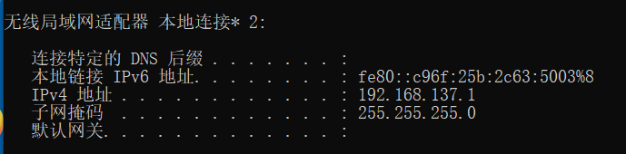
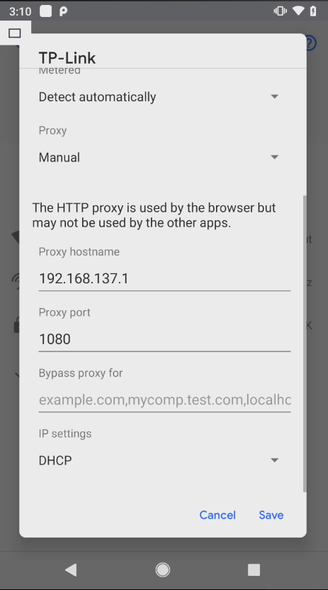
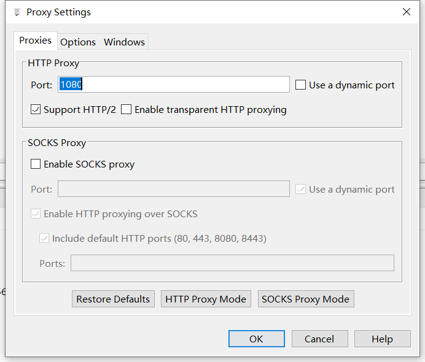
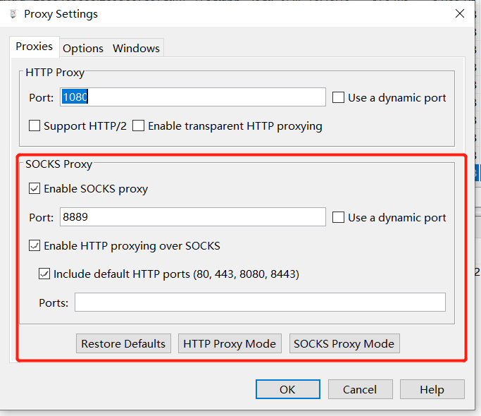
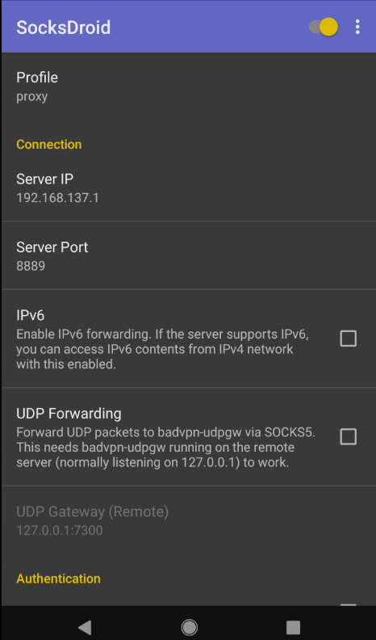
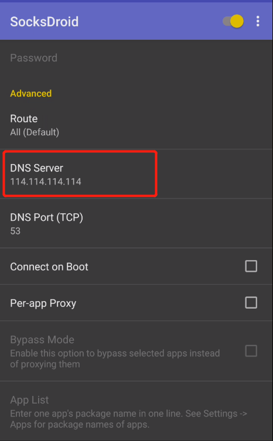
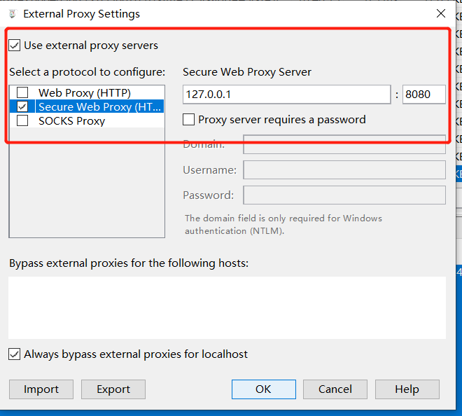

# Android 抓包

## 使用 Charles 抓包

1. PC 端共享无线网络，使用 ipconfig 命令查看 ip 地址：



2. 手机端设置代理



3. 抓包工具设置代理



4. 安装证书

手机端访问 chls.pro/ssl 下载证书并安装。其中可以通过 Magisk 插件 [movecerts](https://github.com/Androidacy/movecerts) 将证书从用户证书移动到系统证书。后续即可进行抓包了。 **如果无法进行抓包，尝试一下关闭 Windows 防火墙。**

> brup 配置好代理后，下载证书地址 http://burp 。

手动将用户证书移动到系统证书。

```bash
# 挂载根目录，正常情况下，使其可读写
mount -o rw,remount /
# 将用户证书移入系统证书目录
mv -f /data/misc/user/0/cacerts-added/123abc456.0 /system/etc/security/cacerts
# 重新挂载根目录，使其为只读
mount -o ro,remount /
```

## VPN 配合 Charles 抓包

## Charles 设置

首先要把 Charles 当做一个 SOCKS5 的代理服务器，所以要先设置 SOCKS5 代理服务器。打开 Proxy 设置选项，开启 SOCKS 服务器，我这里开启的端口为 8889 ，也可以随意填写。



下面介绍 3 款手机端的 VPN 应用。

[SagerNet](https://github.com/SagerNet/SagerNet)

[SocksDroid](https://github.com/bndeff/socksdroid)

### SocksDroid 设置

这里还有另一款 VPN 工具 [SocksDroid](Android抓包/SocksDroid.apk) 可以使用，这里也顺便说一下其配置方法，除了设置服务器 IP 和端口外，还需要设置一下 DNS 服务器，以适应国内网络环境。




### HTTP/HTTPS 转发到 Burp Suite

在 Charles 中，打开 External Proxy Settings 选项卡，选择把数据转到 Burp Suite 的代理服务器中。



# Windows 虚拟机抓包

Charles 安装在物理机上。

1. 首先保存证书
   在 Charles 菜单栏选择 `Help -> SSL proxying -> Save Charles Root Certificate` 保存证书，其中证书格式为 `.cer`。

然后将证书拖入虚拟中，直接双击安装，将证书存储改为：受信任的根证书颁发机构。

2. 设置代理
   将虚拟机的代理设置为物理机的 IP，并且将代理端口设置为 Charles 的代理端口。其中设置代理的位置在：所有设置 -> 网络和 Internet -> 代理 -> 手动设置代理。

3. 设置 Charles
   在 Charles 菜单栏选择 `Proxy -> SSL Proxying Settings -> SSL Proxying` ，选中 Enable SSL Proxying，并且在 Include 选项添加 Location，Host 和 Port 都设置为 `*`。

# 微信抓包

1. 首先用数据线把手机连接到电脑。
2. 手机打开 USB 调试。
3. 手机进入微信随便打开一个聊天窗口输入并发送： `http://debugxweb.qq.com/?inspector=true` 点击打开这个链接，弹出“执行成功”，即可。

4. 手机微信打开想要抓包调试的网页。
5. 电脑上打开 chrome 内核的浏览器或 edge 浏览器。
   chrome 内核的浏览器输入 `chrome://inspect/#devices`
   edge 浏览器输入：`edge://inspect/#devices`

打开后稍等片刻，然后在打开的界面中点击 inspect fallback 。

# 参考连接：

https://mp.weixin.qq.com/s/ahPbBSfkkBsv4oy265rI2Q

https://www.cnblogs.com/lulianqi/p/11380794.html

https://www.52pojie.cn/thread-1826013-1-1.html
