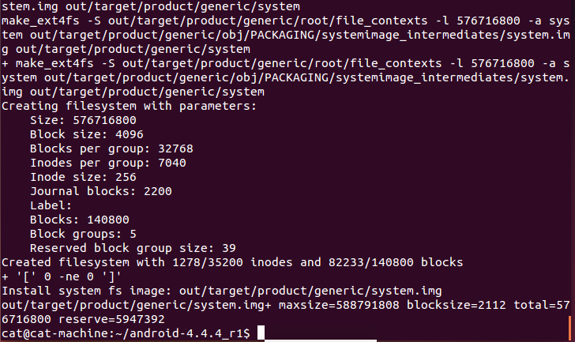
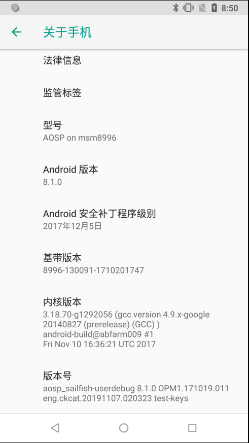
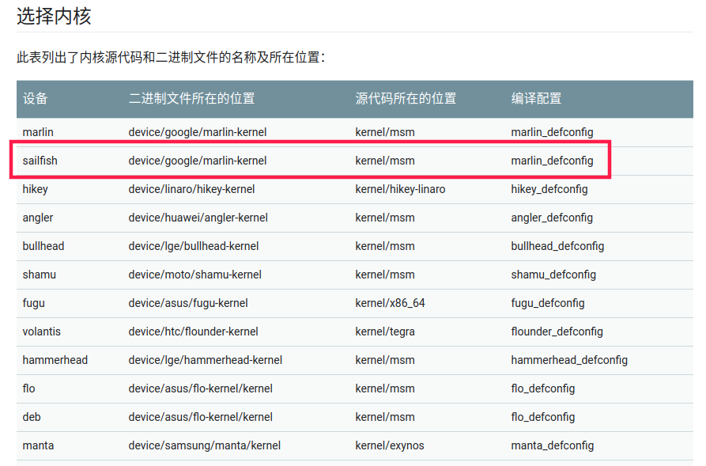

# 基本环境配置

## JDK 环境

官方 Android 版本与 JDK 版本说明：

- Android 7.0 (Nougat) - Android 8.0 (O)：Ubuntu - OpenJDK 8；Mac OS - jdk 8u45 或更高版本
- Android 5.x (Lollipop) - Android 6.0 (Marshmallow)：Ubuntu - OpenJDK 7；Mac OS - jdk-7u71-macosx-x64.dmg
- Android 2.3.x (Gingerbread) - Android 4.4.x (KitKat)：Ubuntu - Java JDK 6；Mac OS - Java JDK 6
- Android 1.5 (Cupcake) - Android 2.2.x (Froyo)：Ubuntu - Java JDK 5

## 下载源码

由于国内网络环境问题，下列下载源码方式均未采用 google 官方提供的方式。

### 1. 下载 repo 工具

使用清华 mirror 下载 repo 工具

```bash
$ curl https://mirrors.tuna.tsinghua.edu.cn/git/git-repo -o repo
$ chmod +x repo
```

然后设置更新源：

```bash
export REPO_URL='https://mirrors.tuna.tsinghua.edu.cn/git/git-repo/'
```

### 2. 下载 Android 源码

因为 Android 的源码越来越大，`repo sync` 失败的概率也越来越高。
所以我们可以避开使用 `repo sync` 的方式，而采用下载预下载包的方式来实现：

```bash
$ wget -c https://mirrors.tuna.tsinghua.edu.cn/aosp-monthly/aosp-latest.tar # 下载初始化包
$ tar xf aosp-latest.tar
$ cd aosp   # 解压得到的 aosp 工程目录
$ repo init -u https://aosp.tuna.tsinghua.edu.cn/platform/manifest -b android-8.1.0_r1
$ repo sync # 正常同步一遍即可得到完整目录
```

> 参考：https://mirrors.tuna.tsinghua.edu.cn/

这里考虑到网络问题，sync 的过程中可能会意外断开，我们不可能一直守着看的，所以通过下面的脚本来完成代码的下载。将下面的内容保存为`start_repo.sh`，然后该脚本执行权限`chmod a+x start_repo.sh`，然后就是等待了，推荐晚上睡觉扔在那里下载，第二天就可以用了。

```bash
#!/bin/bash
echo "======start repo sync======"
./repo sync -j4
while [ $? = 1 ]; do
        echo "======sync failed, re-sync again======"
        sleep 3
        ./repo sync -j4
done
```

如果不想使用上述方式下载源码，可以使用国内用户提供的百度云盘连接下载：

http://pan.baidu.com/s/1ngsZs

以上链接来源自[此处](https://testerhome.com/topics/2229)。

### 3. android 源码查看所有分支切换分支

```bash
cd .repo/manifests
git branch -a   #查看所有分支

repo init -b android-4.1.2_r1   # 切换分支
repo sync
```

后续就可以进行编译了。

# Android 4.4 系统源码编译

编译环境: ubuntu 14.04 或 Ubuntu 16.04。

## 安装 Java JDK 6 环境

JDK 6 安装包下载地址：https://repo.huaweicloud.com/java/jdk/6u45-b06/

下载 `jdk-6u45-linux-x64.bin` 并安装。

```bash
$ cd /usr/local
$ sudo mkdir java
$ cd jav
$ sudo cp ~/jdk-6u45-linux-x64.bin /usr/local/java
$ sudo chmod 777 jdk-6u45-linux-x64.bin
$ sudo ./jdk-6u45-linux-x64.bin
```

打开 `~/.bashrc` 文件，将下列内容添加到文件末尾，配置 java 环境变量。

```bash
# Java Environment
export JAVA_HOME=/usr/local/java/jdk1.6.0_45
export JRE_HOME=/usr/local/java/jdk1.6.0_45/jre
export CLASSPATH=.:$JAVA_HOME/lib:$JRE_HOME/lib:$CLASSPATH
export PATH=$JAVA_HOME/bin:$JRE_HOME/bin:$JAVA_HOME:$PATH
```

重启终端，输入 `java -version` 验证环境是否配置完成。

```bash
$ java -version
java version "1.6.0_45"
Java(TM) SE Runtime Environment (build 1.6.0_45-b06)
Java HotSpot(TM) 64-Bit Server VM (build 20.45-b01, mixed mode)
```

如果系统中存在多个 java 版本，可以通过下列命令设置默认的 Java 版本。

```bash
sudo update-alternatives --config java
sudo update-alternatives --config javac
```

## 二、安装依赖库

```bash
$ sudo apt-get install -y git flex bison gperf build-essential \
libncurses5-dev:i386 libx11-dev:i386 libreadline6-dev:i386 \
libgl1-mesa-dev g++-multilib tofrodos python-markdown libxml2-utils \
xsltproc zlib1g-dev:i386 dpkg-dev libsdl1.2-dev libesd0-dev git-core \
gnupg flex bison gperf build-essential zip curl zlib1g-dev \
gcc-multilib libc6-dev-i386 lib32ncurses5-dev x11proto-core-dev \
libx11-dev lib32z-dev ccache unzip m4
```

Ubuntu 16.04 以上的系统请务必使用上面的依赖，Ubuntu 16.04 需要的依赖和 Ubuntu 14.04 所需要的依赖是不同的。

以下是 Ubuntu 14.04 所需要的依赖：

```bash
$ sudo apt-get install git-core gnupg flex bison gperf build-essential \
zip curl zlib1g-dev gcc-multilib g++-multilib libc6-dev-i386 \
lib32ncurses5-dev x11proto-core-dev libx11-dev lib32z-dev ccache \
libgl1-mesa-dev libxml2-utils xsltproc unzip
```

编译 android4.4.4 需要 make 3.81 或 3.82 ，所以要降级 make。

前往 ftp://ftp.gnu.org/gnu/make/ 下载 `make-3.82.tar.gz`，并编译安装。

```bash
$ tar -zxvf make-3.82.tar.gz
$ cd make-3.82
$ sudo ./configure
$ sudo make
$ sudo make install
```

如果出现错误，可以按如下方式修改源码：

```diff
$ diff --git a/glob/glob.c b/glob/glob.c
index f3911bc..e4d551e 100644
--- a/glob/glob.c
+++ b/glob/glob.c
@@ -208,8 +208,6 @@ my_realloc (p, n)
    #endif /* __GNU_LIBRARY__ || __DJGPP__ */


-#if !defined __alloca && !defined __GNU_LIBRARY__
-
    # ifdef    __GNUC__
    #  undef alloca
    #  define alloca(n)        __builtin_alloca (n)
@@ -229,8 +227,6 @@ extern char *alloca ();

    # define __alloca  alloca

-#endif
-
    #ifndef __GNU_LIBRARY__
    # define __stat stat
    # ifdef STAT_MACROS_BROKEN
```

## 下载驱动

- 由于我使用的是 NEXUS 5 设备，并且打算编译 Android 4.4.4_r1 版本，所以去官方 Nexus 和 Pixel 设备的二进制驱动下载页面：https://developers.google.com/android/drivers 下载了相应的二进制驱动。
- 将三个压缩包解压出的自解压脚本放在源码树的根目录下并运行将会得到一个`Vendor`目录 。

## 六、开始编译

- 命令删除所有以前编译操作的已有输出：
  `make clobber`

- 使用` build`目录中的`envsetup.sh `脚本初始化环境
  `source build/envsetup.sh`

- 使用 lunch 选择要编译的目标
  `lunch`
  选择你想编译的版本，这里我选的是 aosp_hammerhead-userdebug,所以输入 13，

- 编译代码
  `make -j4`
  -j4 的意思是 4 个线程同步编译
  关于 cpu 个数，可以用下面命令查看:
  `cat /proc/cpuinfo | grep processor`
  经过漫长的等待后就编译完成界面，如果中途出错就根据错误信息谷歌一下或者重新编译。
  

## 刷入目标机器

1. 手机开启调试模式，连上电脑，执行`adb devices`命令将会显示连接的机器。

2. 以 fastboot 模式启动手机，然后进行刷机
   `adb reboot bootloader`
3. 刷机
   `fastboot -w flashall`

至此整个编译源码并刷机的过成圆满结束了。

## 遇到的一些坑

1. 编译过程种突然中止，怎么都找不到原因

可能是给的内存太小，重新编译几次就好了。

2. adb 和 fastboot 都没有权限

可以参考https://github.com/snowdream/51-android

3. adb 以及 fastboot 运行后提示需要安装

此时可以到 android 源码目录运行` build`目录中的`envsetup.sh `脚本初始化环境
`source build/envsetup.sh` 并 `lunch` 。

4. 刷机后进不了系统，可能是 fastboot 版本过高的原因。

**参考：**

[xposed 源码编译与集成](https://www.jianshu.com/p/6471bab49cb1)

[记一次安卓系统源码下载过程](https://bbs.pediy.com/thread-218366.htm)

[记一次安卓系统源码编译刷机过程](https://bbs.pediy.com/thread-218513.htm)

[记一次安卓内核源码编译刷机过程(修改反调试标志位)](https://bbs.pediy.com/thread-219233.htm)

# Android 8.1 系统源码编译

编译环境：ubuntu 18.04

## 配置编译环境

### 安装 JDK

安装 `openjdk-8-jdk` :

```bash
sudo apt-get update
sudo apt-get install openjdk-8-jdk
```

### 安装编译所需要的包

```bash
apt-get -y install git-core gnupg flex bison build-essential zip curl zlib1g-dev gcc-multilib g++-multilib libc6-dev-i386 lib32ncurses5-dev x11proto-core-dev libx11-dev lib32z1-dev libgl1-mesa-dev libxml2-utils xsltproc unzip fontconfig
```

以上的依赖包在编译 `android-9.0.0_r36` 时测试没有问题，其中 `openjdk-8-jdk` 非必须。

**ubuntu 20.04 需要安装 python2 。**

## 下载驱动

根据手机型号和 Android 版本下载对应的驱动

https://developers.google.com/android/drivers

下载完成后解压到`aosp`目录，并执行对应的脚本,最终会产生一个`vendor`目录。


## 编译

首先运行`source build/envsetup.sh`:


执行 `lunch` ,选择需要编译的版本,执行 `make -j16` 进行编译。


编译成功


## 刷机

为了保险期间，建议更新 bootloader 到相应的版本,可以去官方下载刷机包，刷入对应的 bootloader，我这里就是遇到了这个坑。

https://developers.google.com/android/images/#sailfish

**刷机前，需要特别注意在 `setting->User & accounts` 中将 Google account remove 掉，否则刷完机后会要求登录刷机前的 Google 账户才允许进入 launcher 界面。**

首先 `adb reboot bootloader` 进入 bootloader 模式，然后进入下载好的刷机包，执行 `./flash-base.sh` 即可更新 `bootloader` 和 `radio` 。

然后将路径切换到`out/target/product/sailfish`下，下面我们刷入其他镜像文件

首先是`boot.img`，执行`fastboot flash boot_a boot.img` 和 `fastboot flash boot_b boot.img` 。

接下来是`system.img`，执行`fastboot flash system system.img` 和 `fastboot flash system_b system_other.img` 。

最后是`vendor.img`，执行`fastboot flash vendor vendor.img` 。

当然如果你有自己定义，例如破解电信 4G 的 modem，可以执行 `fastboot flash modem modem.img`
最后通过 `fastboot reboot`，重启手机。

上列命令也可以使用下列命令进行替代

```bash
$ fastboot flashall -w
```

注意：此命令会在当前文件夹中查找全部 img 文件，将这些 img 文件烧写到全部相应的分区中，并又一次启动手机。


其他命令

```bash
# 清空分区
$ fastboot erase boot
$ fastboot erase system
$ fastboot erase data
$ fastboot erase cache
# 上面的命令也可以简化成一条命令
$ fastboot erase system -w

# 单刷
# 最重要刷 boot.img、system.img、userdata.img、vendor.img 这四个固件.
$ adb reboot bootloader
$ fastboot flash boot boot.img
$ fastboot flash system system.img
$ fastboot flash userdata userdata.img
$ fastboot flash vendor vendor.img
$ fastboot flash recovery recovery.img # 没有编出来，可选
$ fastboot flash cache cache.img # 没有编出来，可选
$ fastboot flash persist persist.img # 没有编出来，可选
$ fastboot reboot
```

**遇到的坑**

我的手机版本是 7.1.2 的，然后直接刷机，开机后开机画面一闪而过，然后无限重启循环这个过程。

**解决**

先刷官方 8.1 的系统，在刷自己编译的 8.1 系统就可以了，具体原因就是 bootloader 没有更新到相应的版本。

下图为刷机成功的的手机系统信息。



## 编译内核并刷机

### 获取内核源码

进入到源码根目录下的 kernel 文件夹中执行 `git clone https://aosp.tuna.tsinghua.edu.cn/kernel/msm`，就可以下载到相应 msm 的内核源码了。
通过 https://source.android.com/source/building-kernels 页面找到设备对应的源码位置。



通过 `git branch -r|grep marlin-kernel` 命令查找对应的分支，然后通过 `git checkout remotes/origin/android-msm-marlin-3.18-oreo-mr1` 切换分支获取到源码。

### 编译

修改内核目录下的 `Makefile` 文件，修改内容如下：

```diff
 # Note: Some architectures assign CROSS_COMPILE in their arch/*/Makefile
- ARCH           ?= $(SUBARCH)
- CROSS_COMPILE  ?= $(CONFIG_CROSS_COMPILE:"%"=%)
+ ARCH           ?= arm64
+ CROSS_COMPILE  ?= aarch64-linux-android-
+ SUBARCH           ?= arm64
+ CROSS_COMPILE_ARM32  ?= arm-linux-androideabi-

 # Architecture as present in compile.
```

回到 `aosp` 目录进行 `source`、`lunch` 操作，然后进入 msm 目录执行 `make marlin_defconfig`，得到 `.config` 文件后，直接执行 `make -j4` 即可。

在编译过程中出现如下错误：

```bash
/bin/sh: 1: lz4c: not found
arch/arm64/boot/Makefile:36: recipe for target 'arch/arm64/boot/Image.lz4' failed
```


显然是`lz4c`没有找到，应该就是有依赖工具没有安装，通过 `sudo apt-get install liblz4-tool` 安装即可，继续 `make -j4` 编译，最后得到 `arch/arm64/boot/Image.lz4-dtb` 。


将上面编译得到的 `Image.lz4-deb` 文件复制到 aosp 源码目录下的 `device/google/marlin-kernel` 路径即可，然后到 aosp 源码根目录下执行 `make bootimage` 。


或者按下列命令生成 `boot.img`

```bash
$ export TARGET_PREBUILT_KERNEL=/media/ckcat/other/aosp/msm/arch/arm64/boot/Image.lz4-dtb
$ rm out/target/product/sailfish/boot.img && make bootimage
```

如果想要替换 `boot.img` 中的 `default.prop`,可以在 `build/core/Makefile` 中搜索关键字 `TARGET_RECOVERY_ROOT_OUT)/default.prop` 做如下修改，[参考](https://blog.csdn.net/XXOOYC/article/details/85679143):


最后按照前面所写的内容，使用 `fastboot flash boot_a boot.img` 和 `fastboot flash boot_b boot.img` 刷入即可。如下截图可以看到 kernel 是使用`ckcat`的机器编译的。


参考: https://blog4jimmy.com/2018/02/418.html

## 错误处理

### flex-2.5.39: loadlocale.c:130 错误。

bing 搜索相关内容，在这个[链接](https://stackoverflow.com/questions/49955137/error-when-build-lineageos-make-ninja-wrapper-error-1)中找到解法。

```bash
export LC_ALL=C
```

把这行代码添加到 `.bashrc` 文件中，实测有效。

`LC_ALL=C` 是为了去除所有本地化的设置，让命令能正确执行。

**注意**

> 以上设置可能会导致 gnome-terminal 无法启动，通过 `grep "gnome-terminal" /var/log/syslog` 查看会发现是 `Non UTF-8 locale (ANSI_X3.4-1968) is not supported!`。此时删掉刚才设置的 `export LC_ALL=C` 即可。

参考：

https://forums.linuxmint.com/viewtopic.php?t=280655

https://blog.csdn.net/aaa111/article/details/80330848

### adb 和 fastboot 都没有权限

> 可以参考 https://github.com/snowdream/51-android 或者 https://github.com/M0Rf30/android-udev-rules

### adb devices 无法工作。

这是因为缺少 USB 驱动的原因，按照以下方法更新

1. 打开设备管理器
1. 查找未知的 Android 设备
1. 更新驱动程序
1. 浏览我的计算机以查找驱动程序软件
1. 让我从设备列表中选择，选择列出所有设备
1. 在 Android 设备 或 Google Inc 下，您会找到 Android Bootloader Interface
1. 选择 Android Bootloader 界面
1. 当它说驱动程序可能不兼容时单击 是

如果以上步骤 6 无法找到相应的设备，就需要安装对应的设备，参考网站 https://developer.android.com/studio/run/oem-usb#InstallingDriver 上的说明进行安装即可。

> 参考： https://stackoverflow.com/questions/8588595/android-fastboot-devices-not-returning-device

### SSL error when connecting to the Jack server. Try 'jack-diagnose'

原因就是编译时用的是 open-jdk 8u292，默认禁用了 TLSv1, TLSv1.1，
从`/etc/java-8-openjdk/security/java.security`中取消 TLSv1, TLSv1.1 禁用，
修改前

```bash
#   jdk.tls.disabledAlgorithms=MD5, SSLv3, DSA, RSA keySize < 2048
jdk.tls.disabledAlgorithms=SSLv3, TLSv1, TLSv1.1, RC4, DES, MD5withRSA, \
    DH keySize < 1024, EC keySize < 224, 3DES_EDE_CBC, anon, NULL, \
    include jdk.disabled.namedCurves
```

修改后:

```bash
#   jdk.tls.disabledAlgorithms=MD5, SSLv3, DSA, RSA keySize < 2048
jdk.tls.disabledAlgorithms=SSLv3, RC4, DES, MD5withRSA, \
    DH keySize < 1024, EC keySize < 224, 3DES_EDE_CBC, anon, NULL, \
    include jdk.disabled.namedCurves
```

`aosp/prebuilts/sdk/tools/` 目录下执行 `./jack-admin kill-server && ./jack-admin start-server` 成功。

# 其他

编译亲儿子内核时简单几步让版本信息和官方镜像一致，而不是显示 `-dirty` 。

```bash
adb shell cat /proc/version

export KBUILD_BUILD_VERSION=1
export KBUILD_BUILD_USER=android-build
export KBUILD_BUILD_HOST=xxx.google.com
export KBUILD_BUILD_TIMESTAMP="Web Feb 13 19:10:11 UTC 2019"
sed -i "s/#define LINUX_COMPILER/#define LINUX_COMPILER "'\\"gcc version xxx-google xxx \\(prerelease\\) \\(GCC\\) \\" # /' scripts/mkcompile_h
make xxx_defconfig
make -j7 KERNELRELEASE="xxx"
```

修改了 AOSP 源码之后，比如加了文件，哪怕在一个文件夹下，AS 开发时可以正常引用并使用里面的函数，但是编译时就是报找不到，此时要修改这个文件，将添加的文件包括进去。然后运行一次 `make update-api`。最后再 `m` 编译。

# lineage-16.0 编译

## 配置安装平台工具

安装 `adb` 和 `fastboot` ， 可以从谷歌[下载](https://dl.google.com/android/repository/platform-tools-latest-linux.zip)它们。提取运行：

```bash
unzip platform-tools-latest-linux.zip -d ~
```

添加 `adb` 和 `fastboot` 到 `PATH` 。打开 `~/.profile` 并添加以下内容：

```bash
# add Android SDK platform tools to path
if [ -d "$HOME/platform-tools" ] ; then
    PATH="$HOME/platform-tools:$PATH"
fi
```

然后，运行 `source ~/.profile` 以更新环境。

## 配置必须的环境

### 安装必须的库

```bash
$ sudo apt install bc bison build-essential ccache curl flex g++-multilib gcc-multilib git gnupg gperf imagemagick lib32ncurses5-dev lib32readline-dev lib32z1-dev liblz4-tool libncurses5 libncurses5-dev libsdl1.2-dev libssl-dev libxml2 libxml2-utils lzop pngcrush rsync schedtool squashfs-tools xsltproc zip zlib1g-dev
```

对于 20.04 之前的 Ubuntu 版本，需要安装：

```bash
$ sudo apt install libwxgtk3.0-dev
```

对于早于 16.04 的 Ubuntu 版本，请安装：

```bash
$ sudo apt install libwxgtk2.8-dev
```

### JDK

- LineageOS 16.0：OpenJDK 1.9（默认包含）
- LineageOS 14.1-15.1：OpenJDK 1.8（安装 openjdk-8-jdk）
- LineageOS 11.0-13.0：OpenJDK 1.7（安装 openjdk-7-jdk）

## 下载源码

### 创建目录

创建构建环境中设置一些目录：

```bash
$ mkdir -p ~/bin
$ mkdir -p ~/android/lineage
```

### 安装 repo 命令

输入以下内容以下载 repo 二进制文件并使其可执行（可运行）：

```bash
$ curl https://storage.googleapis.com/git-repo-downloads/repo > ~/bin/repo
$ chmod a+x ~/bin/repo
```

将 `~/bin` 目录放在执行路径中，打开 `~/.profile` 文件，添加下列代码：

```bash
# set PATH so it includes user's private bin if it exists
if [ -d "$HOME/bin" ] ; then
    PATH="$HOME/bin:$PATH"
fi
```

然后，运行 `source ~/.profile` 以更新环境。

### 配置 git

运行以下命令来配置 git 身份：

```bash
$ git config --global user.email "you@example.com"
$ git config --global user.name "Your Name"
```

### 初始化 LineageOS 源并下载源代码

```bash
cd ~/android/lineage
repo init -u https://github.com/LineageOS/android.git -b lineage-16.0

repo sync
```

## 准备特定于设备的代码

源代码下载后，确保您位于源代码的根目录 ( `cd ~/android/lineage`)，然后键入：

```bash
source build/envsetup.sh
breakfast sailfish
```

这将下载您设备的[设备特定配置](https://github.com/LineageOS/android_device_google_sailfish)和 [内核](https://github.com/LineageOS/android_kernel_google_marlin)。

> 有一些设备需要在 breakfast 之前准备好 vendor 目录 如果出现错误，按下面的方法提取专有 Blob，推荐使用 通过修改 `.repo/local_manifests/*.xml` 文件进行提取 。

## 提取专有 Blob

### 通过 `extract_files.sh` 脚本提取（不推荐）

确保您的 Pixel 已通过 USB 电缆连接到计算机，并且已启用 ADB 和 root 身份，并且位于 `~/android/lineage/device/google/sailfish` 文件夹中。然后运行 `extract-files.sh`脚本：

```bash
./extract-files.sh
```

Blob 应被拉入 `~/android/lineage/vendor/google` 文件夹。

### 通过修改 `.repo/local_manifests/*.xml` 文件进行提取(推荐)

在 `.repo/local_manifests/roomservice.xml` 文件中添加下列代码

```xml
<project clone-depth="1" name="TheMuppets/proprietary_vendor_google" path="vendor/google" remote="github" />
```

最终代码：

```xml
<?xml version="1.0" encoding="UTF-8"?>
<manifest>
  <project name="LineageOS/android_device_google_sailfish" path="device/google/sailfish" remote="github" />
  <project name="LineageOS/android_device_google_marlin" path="device/google/marlin" remote="github" />
  <project name="LineageOS/android_kernel_google_marlin" path="kernel/google/marlin" remote="github" />
  <project clone-depth="1" name="TheMuppets/proprietary_vendor_google" path="vendor/google" remote="github" />
</manifest>
```

然后执行 `repo sync` ， 最终将会 `~/android/lineage/vendor/google` 文件夹如下所示：


## 开始编译

### 准备设备特定的代码

进入 `~/android/lineage` 目录中，运行下列命令：

```bash
$ source build/envsetup.sh
including device/generic/car/vendorsetup.sh
including device/generic/mini-emulator-arm64/vendorsetup.sh
including device/generic/mini-emulator-armv7-a-neon/vendorsetup.sh
including device/generic/mini-emulator-x86/vendorsetup.sh
including device/generic/mini-emulator-x86_64/vendorsetup.sh
including device/generic/uml/vendorsetup.sh
including device/google/marlin/vendorsetup.sh
including vendor/lineage/vendorsetup.sh
including sdk/bash_completion/adb.bash


$ breakfast sailfish
including vendor/lineage/vendorsetup.sh
Looking for dependencies in device/google/sailfish
Looking for dependencies in device/google/marlin
Looking for dependencies in kernel/google/marlin
kernel/google/marlin has no additional dependencies.

============================================
PLATFORM_VERSION_CODENAME=REL
PLATFORM_VERSION=9
LINEAGE_VERSION=16.0-20200607-UNOFFICIAL-sailfish
TARGET_PRODUCT=lineage_sailfish
TARGET_BUILD_VARIANT=userdebug
TARGET_BUILD_TYPE=release
TARGET_ARCH=arm64
TARGET_ARCH_VARIANT=armv8-a
TARGET_CPU_VARIANT=kryo
TARGET_2ND_ARCH=arm
TARGET_2ND_ARCH_VARIANT=armv8-a
TARGET_2ND_CPU_VARIANT=kryo
HOST_ARCH=x86_64
HOST_2ND_ARCH=x86
HOST_OS=linux
HOST_OS_EXTRA=Linux-5.3.0-53-generic-x86_64-Ubuntu-18.04.4-LTS
HOST_CROSS_OS=windows
HOST_CROSS_ARCH=x86
HOST_CROSS_2ND_ARCH=x86_64
HOST_BUILD_TYPE=release
BUILD_ID=PQ3A.190801.002
OUT_DIR=/media/ckcat/5670d030-468f-f443-9854-3a9e65ef901c/lineage/out
============================================
```

### 开始构建

```bash
croot
brunch sailfish
```

> 需要注意的是，如果使用的 ubuntu 20.04 进行编译，会出现 `prebuilts/gcc/linux-x86/aarch64/aarch64-linux-android-4.9/bin/aarch64-linux-android-gcc: not found` 错误，这是有由于找不到 `/usr/bin/python` 的原因，此时安装 python 就好。

### 安装版本

假设构建已完成且没有错误（完成后将很明显），请在构建运行的终端窗口中键入以下内容：

```bash
cd $OUT
```

在这里，您会找到所有已创建的文件。更具兴趣的两个文件是：

- `boot.img`，这是 LineageOS 引导映像，并包含 recovery-ramdisk 。

- `lineage-17.1-20200605-UNOFFICIAL-sailfish.zip`，这是 LineageOS 安装程序包。


成功!

## 刷机

重启手机至 bootloader 模式，刷入 recovery 。

```bash
# 重启至 bootloader
$ adb reboot bootloader

# 刷入 recovery
$ flash boot boot.img
```

然后重启至 recovery 模式。选择 **Apply update** -> **Apply from ADB** 再执行下列命令刷机。

```bash
adb sideload lineage-17.1-20220317-UNOFFICIAL-sailfish.zip
```

如果需要格式化手机内的数据，则需要先选择 **Factory Reset** -> **Format data/factory reset** -> **Format data** ，等待格式化完成，最后再安装上面的方式刷入系统即可。

参考：

> https://wiki.lineageos.org/devices/sailfish/build > https://www.reddit.com/r/LineageOS/comments/bjo6v3/error_building_lineageos/ > https://wiki.lineageos.org/devices/sailfish/install
