> 转载：https://blog.csdn.net/feelabclihu/article/details/105534145

# 前言

`Binder` 从入门到放弃包括了上下篇，上篇是框架部分，即本文。下篇通过几个典型的 `binder` 通信过程来呈现其实现细节，稍后发布，敬请期待。

# 一、什么是Binder？

`Binder` 是安卓平台上的一种 `IPC framework` ，其整体的架构如下：

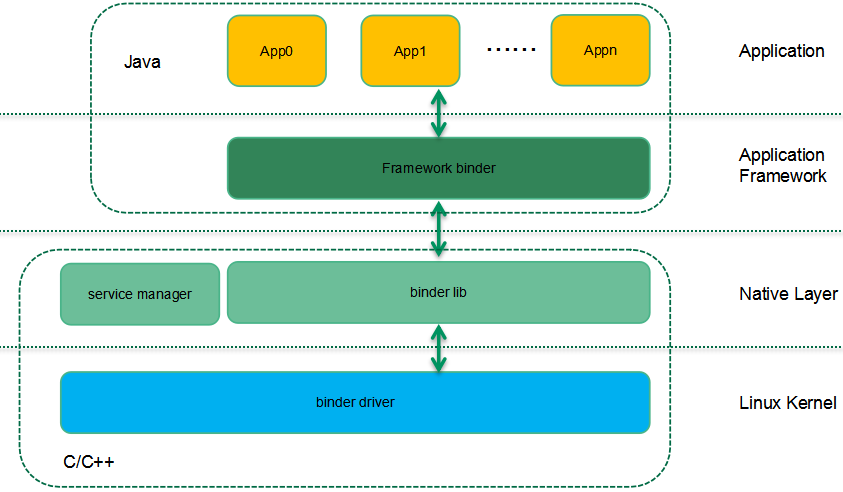

`Binder` 渗透到了安卓系统的各个软件层次：在应用层，利用 `Framework` 中的 `binder Java` 接口，开发者可以方便的申请系统服务提供的服务、实现自定义 `Service` 组件并开放给其他模块等。由于 `Native` 层的 `binder` 库使用的是 `C++` ，因此安卓框架中的 `Binder` 模块会通过 `JNI` 接口进入 `C/C++` 世界。在最底层， `Linux` 内核提供了 `binder` 驱动，完成进程间通信的功能。

`Binder` 对安卓非常重要，绝大多数的进程通信都是通过 `Binder` 完成。 `Binder` 采用了 `C/S` 的通信形式：

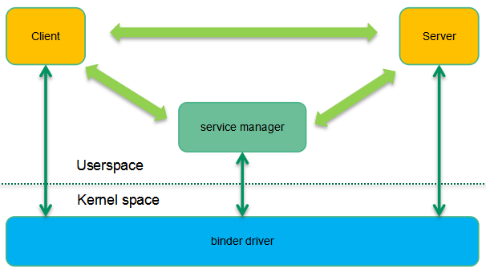

从进程角度看，参与 `Binder` 通信的实体有三个：`binder client` 、 `binder server` 和 `service manager` 。 `Binder server` 中的 `service` 组件对外提供了服务，但是需要对外公布，因此它会向 `service manager` 注册自己的服务。 `Binder client` 想要请求服务的时候统一到 `service manager` 去查询，获取了对应的描述符后即可以通过该描述符和 `service` 组件进行通信。当然，这些 `IPC` 通信并不是直接在 `client` 、 `server` 和 `service manager` 之间进行的，而都是需要通过 `binder driver` 间接完成。

安卓应用程序开发是基于组件的，也就是说通过四大组件（ `Activity` 、 `Service` 、 `Broadcast Receiver` 和 `Content Provider` ），开发者可以象搭积木一样的轻松开发应用程序，而无需关心底层实现。然而安卓这种面向对象的应用框架环境却是基于传统的 `Linux` 内核构建的，这使得安卓在进程间通信方面遇到了新的挑战，这也就是为何谷歌摒弃了传统的内核 `IPC` 机制（管道、命名管道、 `domain socket` 、 `UDP/TCP socket` 、 `system V IPC` ， `share memory` 等），建立了全新的 `binder` 通信形式，具体细节我们下一章分解。

# 二、为什么是Binder？

在上一节中，我们简单的描述了 `binder` 的 `C/S` 通信模型，在内核已经提供了 `socket` 形态的 `C/S` 通信机制的情况下，在安卓系统上直接使用 `socket` 这种 `IPC` 机制似乎是顺理成章的，为何还要重新制作一个新的轮子呢？是否需要新建轮子其实是和需求相关的，下面我们会仔细分析安卓系统上，组件之间 `IPC` 机制的需求规格，从而窥视谷歌创建全新 `binder` 通信机制背后的原因。

## 1、安卓系统需要的是一个IPC框架

为了提高软件生产效率，安卓的应用框架希望能够模糊进程边界，即在 A 组件调用 B 组件的方法的时候，程序员不需要考虑是否跨进程。即便是在不同的进程中，对 B 组件的服务调用仍然象本地函数调用一样简单。传统 `Linux` 内核的 `IPC` 机制是无法满足这个需求的，安卓需要一个复杂的 `IPC framework` 能够支持线程池管理、自动跟踪引用计数等有挑战性的任务。

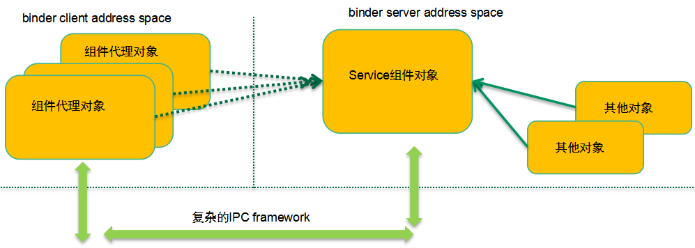

当然，基于目前 `Linux` 内核的 `IPC` 机制，也可以构建复杂的 `IPC framework` ，不过传统的内核 `IPC` 机制并没有考虑面向对象的应用框架，因此很多地方实现起来有些水土不服。上图给了一个简单的例子：在一个地址空间中跟踪对象的引用计数非常简单，可以在该对象内部构建一个引用计数，每当有本进程对象引用 `service` 组件对象的时候，引用计数加一，不再引用的时候减一，没有任何对象引用 `service` 组件对象的时候，该对象可以被销毁。不过，当引用该 `service` 组件的代理对象来自其他进程空间（例如 `binder client` 的组件代理对象）的时候，事情就不那么简单了，这需要一个复杂的 `IPC framework` 来小心的维护组件对象的引用计数，否则在 `server` 端销毁了一个组件对象，而实际上有可能在 `client` 端还在远程调度该 `service` 组件提供的服务。

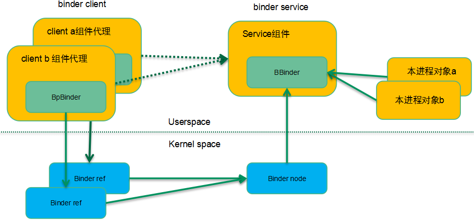

为了解决这个问题， `binder` 驱动构建了 `binder ref` 和 `binder node` 数据对象，分别对应到上层软件中的 `service` 组件代理和 `service` 组件对象，同时也设计了相应的 `binder` 通信协议来维护引用计数，解决了传统的 `IPC` 机制很难解决的跨进程对象生命周期问题。

## 2、安卓系统需要的是高效IPC机制

我们再看一下性能方面的需求：由于整个安卓系统的进程间通信量比较大，我们希望能有一个性能卓越的 `IPC` 机制。大部分传统 `IPC` 机制都需要两次拷贝容易产生性能问题。而 `binder` 只进行了一次拷贝，性能优于大部分的传统 `IPC` 机制，除了 `share memory` 。当然，从内存拷贝的角度看，`share memory` 优于 `binder` ，但实际上如果基于 `share memory` 设计安卓的 `IPC framework` ，那么还是需要构建复杂的同步机制，这也会抵消 `share memory` 部分零拷贝带来性能优势，因此 `Binder` 并没有选择共享内存方案，而是在简单和性能之间进行了平衡。在 `binder` 机制下，具体的内存拷贝如下图所示：

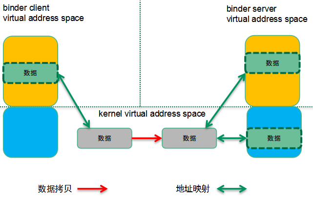

`binder server` 会有专门二段用于 `binder` 通信的虚拟内存区间，一段在内核态，一段在用户空间。这两段虚拟地址空间映射到同样的物理地址上，当拷贝数据到 `binder server` 的内核态地址空间，实际上用户态也就可以直接访问了。当 `Binder client` 要把一个数据块传递到 `binder server`（通过 `binder transaction` ）的时候，实际上会在 `binder server` 的内核虚拟地址空间中分配一块内存，并把 `binder client` 的用户地址空间的数据拷贝到 `binder server` 的内核空间。因为 `binder server` 的 `binder` 内存区域被同时映射到用户空间和内核空间，因此就可以省略一次数据考虑，提高了性能。

并不是说安卓不使用共享内存机制，实际上当进程之间要传递大量的数据的时候（例如 APP 的图形数据要传递到 `surfaceflinger` 进行实际的显示）还是使用了 `share memory` 机制（ `Ashmem` ）。安卓使用文件描述符来标示一块匿名共享内存， `binder` 机制可以把文件描述符从一个进程传递到另外的进程，完成文件的共享。一个简单的示意图如下：

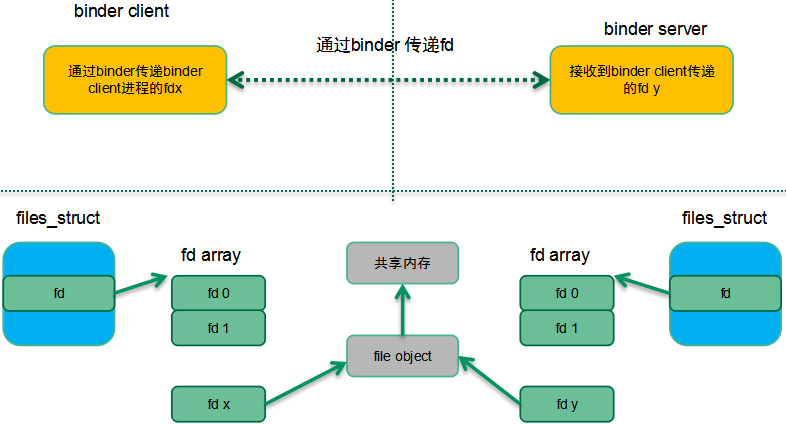

在上图中， `binder client` 传递了 `fd x` （ `binder client` 有效的描述符）到 `binder server` ，实际上 `binder` 驱动会通过既有的内核找到对应的 `file object` 对象，然后在 `binder server` 端找到一个空闲的`fd y`（ `binder server` 进程有效），让其和 `binder client` 指向同一个对象。这个 `binder client` 传递了 `fd x` 到 `binder server` ，在 `server` 端变成 `fd y` 并实现了和 `client` 进程中 `fd x` 指向同一个文件的目标。而传统的 `IPC` 机制（除了 `socket` ）没有这种机制。

## 3、安卓系统需要的是稳定的IPC机制

数据传输形态（非共享内存）的 `IPC` 机制有两种形态：`byte stream` 和 `message-based` 。如果使用字节流形态的方式（例如 `PIPE` 或者 `socket` ），那么对于 `reader` 一侧，我们需要在内核构建一个 `ring buffer` ，把 `writer` 写入的数据拷贝到 `reader` 的这个环形缓冲区。而在 `reader` 一侧的，如何管理这个 `ring buffer` 是一个头疼的事情。因此 `binder` 采用了 `message-based` 的形态，并形成了如下的缓冲区管理方式：

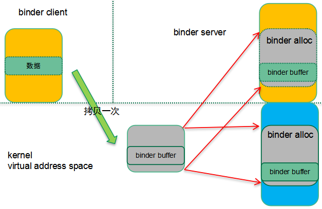

需要进行 `Binder` 通信的两个进程传递结构化的 `message` 数据，根据 `message` 的大小在内核分配同样大小的 `binder` 缓冲区（从 `binder` 内存区中分配，内核用 `binder alloc` 对象来抽象），并完成用户空间到内核空间的拷贝。 `Binder server` 在用户态的程序直接可以访问到 `binder buffer` 中的 `message` 数据。

从内存管理的角度来看，这样的方案是一个稳定性比较高的方案。每个进程可以使用的 `binder` 内存是有限制的，一个进程不能使用超过 `1M` 的内存，杜绝了恶意 APP 无限制的通过 `IPC` 使用内存资源。此外，如果撰写 `APP` 的工程师不那么谨慎，有些传统的 `Linux IPC` 机制容易导致内存泄露，从而导致系统稳定性问题。同样的，如果对通信中的异常（例如 `server` 进程被杀掉）没有有良好的处理机制，也会造成稳定性问题。 `Binder` 通信机制提供了 `death-notification` 机制，优雅的处理了通信两端异常退出的异常，增强了系统的稳定性。

## 4、安卓系统需要的是安全的IPC机制

从安全性（以及稳定性）的角度，各个安卓应用在自己的 `sandbox` 中运行并用一个系统唯一的 `id` 来标示该应用（ `uid` ）。由于 APP 和系统服务进程是完全隔离的，安卓设计了 `transaction-based` 的进程间通信机制： `binder` ， APP 通过 `binder` 请求系统服务。由于 `binder driver` 隔离了通信的两段进程。因此实际上在 `binder driver` 中是最好的一个嵌入安全检查的地方，具体可以参考下面的安全检查机制示意图：

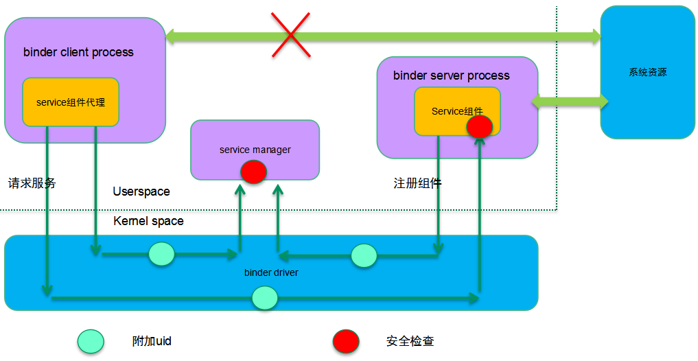

安卓是一个开放的系统，因此安全性显得尤为重要。在安卓世界， `uid` 用来标示一个应用，在内核（而非用户空间）中附加 `UID/PID` 标识并在具体提供服务的进程端进行安全检查，主要体现在下面两个方面：

1. 系统提供了唯一的上下文管理者：`service manager` 并且只有信任的 `uid` 才能注册 `service` 组件。

2. 系统把特定的资源权限赋权给 `Binder server` （ `service` 组件绑定的进程），当 `binder client` 请求服务的时候对 `uid` 进行安全检查。

传统的 `IPC` 机制在内核态并不支持 `uid/pid` 的识别，通过上层的通信协议增加发起端的 `id` 并不安全，而且传统的 `IPC` 机制没有安全检查机制，这种情况下任何人都可以撰写恶意 APP 并通过 `IPC` 访问系统服务，获取用户隐私数据。

解决了 what 和 why 之后，我们后续的章节将主要讲述 `binder` 的软件框架和通信框架，在了解了蓝图之后，我们再深入到 `binder` 是如何在各种场景下工作的。随着 `binder` 场景解析，我们也顺便描述了 `binder` 驱动中的主要数据结构。

# 三、Binder软件框架和通信框架

## 1、软件框架

一个大概的软件结构如下：

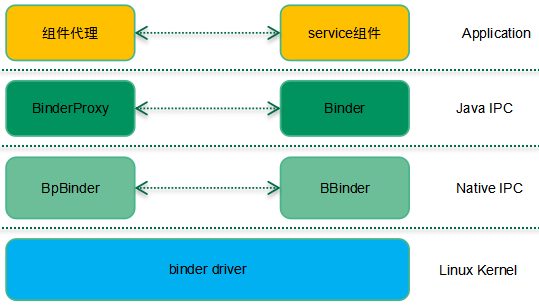

所有的通信协议都是分层的， `binder` 也不例外，只不过简单一些。 `Binder` 通信主要有三层：应用层，`IPC` 层，内核层。如果使用 `Java` 写应用，那么 `IPC` 层次要更丰富一些，需要通过 `Java layer` 、 `jni` 和 `Native IPC layer` 完成所有的 `IPC` 通信过程。如果使用 `C++` 在 `Native` 层写应用，那么基本上 `BpBinder` 和 `BBinder` 这样的 `Native IPC` 机制就足够了，这时候，软件结构退化成（后续我们基本上是基于这个软件结构描述）：

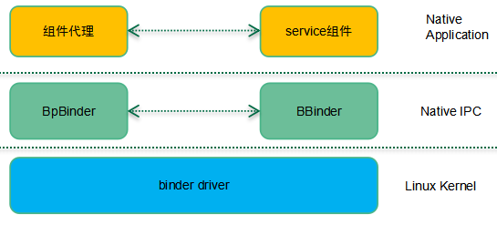

对于应用层而言，互相通信的实体交互的是类似 `start activity` 、 `add service` 这样的应用相关的协议数据，通信双方并不知道底层实现，感觉它们之间是直接通信似得。而实际上，应用层数据是通过 `Native IPC` 层、 `kerenl` 层的封装，解析，映射完成了最后的通信过程。在 `Native IPC` 层， `BpBinder` 和 `BBinder` 之间通信之间的封包有自己的格式，`IPC header` 会标记通信的起点和终点（ `binder ref` 或者 `binder node` ）、通信类型等信息，而应用层数据只是 `IPC` 层的 `payload` 。同样的，表面上是 `BpBinder` 和 `BBinder` 两个实体在交互 `IPC` 数据，实际上需要底层 `binder driver` 提供通信支持。

## 2、通信框架

分别位于 `binder client` 和 `server` 中的应用层实体进行数据交互的过程交过 `transaction` ，当然，为了保证 `binder transaction` 能够正确、稳定的完成， `binder` 代理实体、 `binder` 实体以及 `binder driver` 之间需要进行非常复杂的操作，因此 `binder` 通信定义了若干的通信协议码，下面表格列出了几个常用的 `binder` 实体或者 `binder` 代理实体发向 `binder driver` 的通信协议码：

| Binder command code       | 描述                              |
| ------------------------- | --------------------------------- |
| `BC_TRANSACTION`          | `Binder` 代理实体请求数据通信服务 |
| `BC_REPLY`                | `Binder` 实体完成了服务请求的回应 |
| `BC_INCREFS` `BC_DECREFS` | 管理 `binder ref` 的引用计数      |
| ......                    | ......                            |

下面的表格列出了几个常用的 `binder driver` 发向 `binder` 实体或者 `binder` 代理实体的通信协议码：

| Binder response code      | 描述                                                                                                                                                          |
| ------------------------- | ------------------------------------------------------------------------------------------------------------------------------------------------------------- |
| `BR_TRANSACTION`          | `Binder driver` 收到 `transaction` 请求，将其转发给 `binder` 实体对象                                                                                         |
| `BR_REPLY`                | `Binder driver` 通知 `binder` 代理实体， `server` 端已经完成服务请求，返回结果。                                                                              |
| `BR_TRANSACTION_COMPLETE` | `Binder driver` 通知 `binder` 代理实体，它发出的 `transaction` 请求已经收到。或者 `Binder driver` 通知 `binder` 实体，它发出的 `transaction reply` 已经收到。 |
| ......                    | ......                                                                                                                                                        |

`Binder` 通信的形态很多种，有些只涉及 `binder server` 中的实体对象和 `binder driver` 的交互。例如： `BC_REGISTER_LOOPER` 。不过使用最多、过程最复杂的还是传递应用数据的 `binder transaction` 过程，具体如下：

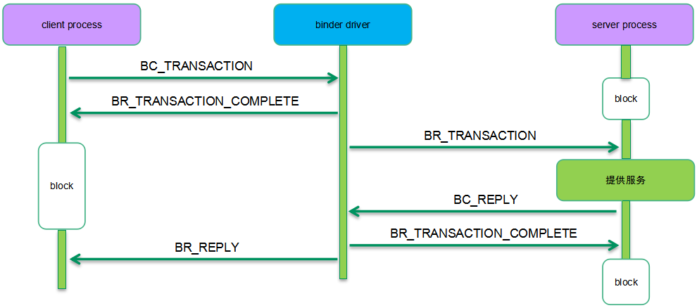

`Binder client` 和 `server` 之间的进程间通信实际上是通过 `binder driver` 中转的。在这样的通信框架中，`client/server` 向 `binder driver` 发送 `transaction/reply` 是直接通过 `ioctl` 完成的，而相反的方向， `binder driver` 向 `client/server` 发送的 `transaction/reply` 则有些复杂，毕竟在用户空间的 `client/server` 不可能不断的轮询接收数据。正因为如此，在 `binder` 通信中有了 `binder work` 的概念，具体的方式如下：

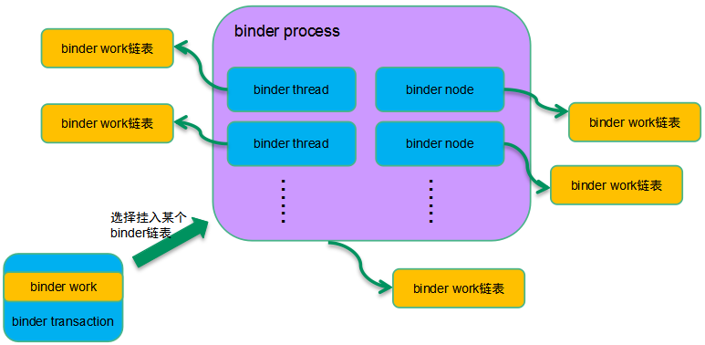

对于 `binder transaction` 这个场景， `Binder work` 对象是嵌入在 `transaction` 对象内的， `binder driver` 在把 `transaction` （服务请求）送达到 `target` 的时候需要做两个动作：

1. 选择一个合适的 `binder work` 链表把本 `transaction` 相关的 `work` 挂入链表。

2. 唤醒 `target process` 或者 `target thread` 。

对于异步 `binder` 通信， `work` 是挂入 `binder node` 对应的 `work` 链表。如果是同步 `binder` 通信，那么要看是否能够找到空闲的 `binder thread` ，如果找到那么挂入线程的 `work todo list` ，否则挂入 `binder process` 的链表。

## 3、应用层通信数据格式

本身应用层的数据应该是通信两端的实体自己的事情，不过由于需要交互 `binder` 实体对象信息，因此这里也简单描述其数据格式，如下：

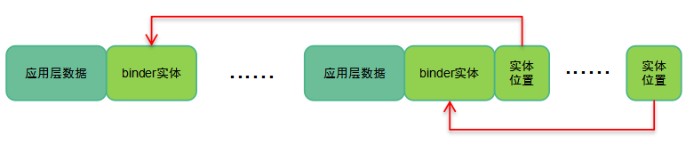

`Binder Client` 和 `server` 之间通信的基本单元是 应用层的数据 + 相关的 `binder` 实体对象数据 ，这个基本的单元可以是 1 个或者多个。为了区分开各个基本的单元，在应用层数据缓冲区的尾部有一个数组保存了各个 `binder` 实体对象的位置。每一个 `binder` 实体用 `flat_binder_object` 来抽象，主要的成员包括：

| 成员                    | 描述                                                                                               |
| ----------------------- | -------------------------------------------------------------------------------------------------- |
| header                  | 说明该 binder 实体的类型，可能的类型包括：本地 binder 实体对象、远端 binder 实体对象（ handle ）、文件描述符 |
| binder_uintptr_t binder | 描述本地 binder 实体对象                                                                             |
| __u32 handle            | 描述远端 binder 实体对象                                                                             |
| binder_uintptr_t cookie | 描述本地 binder 实体对象                                                                             |

我们这里可以举一个简单的例子：假设我们写了一个 APP ，实现了一个 xxx 服务组件，在向 `service manager` 注册的时候就需要发起一次 `transaction` ，这时候缓冲区的数据就包括了上面图片中的应用层数据和一个 xxx 服务组件对应的 `binder` 实体对象。这时候应用层数据中会包括 `xxx service` 这样的字符串信息，这是方便其他 `client` 可以通过这个字符串来寻址到本 `service` 组件必须要的信息。除了应用层数据之外，还需要传递 `xxx service` 组件对应的 `binder` 实体。上面的例子说的是注册 `service` 组件的场景，因此传递的是本地 `binder` 实体对象。如果场景切换成 `client` 端申请服务的场景，这时候没有本地对象，因此需要传递的是远端的 `binder` 实体对象，即 `handle` 。因此 `flat_binder_object` 描述的是 `transaction` 相关的 `binder` 实体对象，可能是本地的，也可能是远端的。

## 4、Binder帧数据格式

`Binder IPC` 层的数据格式如下：

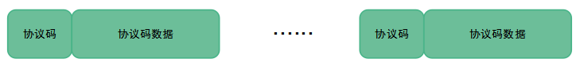

`Binder IPC` 层看到的帧数据单元是 协议码 + 协议码数据 ，一个完整的帧数据是由一个或者多个帧数据单元组成。协议码区域就是上文中描述的 `BC_XXX` 和 `BR_XXX` ，不同的协议码有不同的协议码数据，同样的我们采用 `binder transaction` 为例说明协议码数据区域。 `BR_TRANSACTION` 、 `BR_REPLY` 、 `BC_TRANSACTION` 和 `BC_REPLY` 这四个协议码的数据都是 `binder_transaction_data` ，和应用层的数据关系如下：

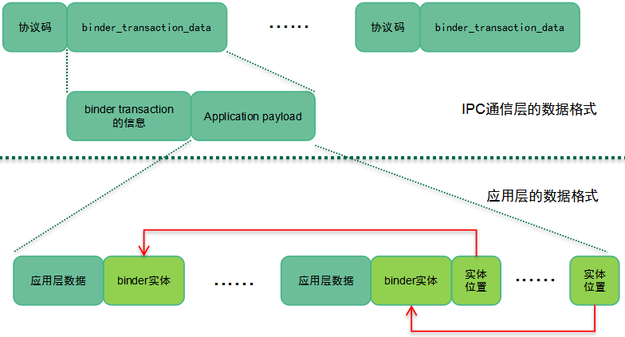

`Binder transaction` 信息包括：本次通信的目的地、`sender pid` 和 `uid` 等通用信息，此外还有一些成员描述应用层的数据 `buffer` 信息，具体大家可以参考源代码。顺便提一句的是这里的 `sender pid` 和 `uid` 都是内核态的 `binder driver` 附加的，用户态的程序无法自己标记，从而保证了通信的安全性。

了解了整体框架之后，我们后面的章节将进入细节，通过几个典型 `binder` 通信场景的分析来加强对 `binder` 通信的理解，这些将在下篇文档中呈现，敬请期待！

参考文献：

1.Android系统源代码情景分析，罗升阳著

2.http://gityuan.com/tags/#binder ，袁辉辉的博客