> 转载：https://blog.csdn.net/feelabclihu/article/details/105534146

# 前言

`Binder` 从入门到放弃包括了上下篇，上篇是框架部分，下篇通过几个典型的 `binder` 通信过程来呈现其实现细节，即本文。

# 一、启动 service manager

## 1. 流程

`Service manager` 进程和 `binder` 驱动的交互如下：

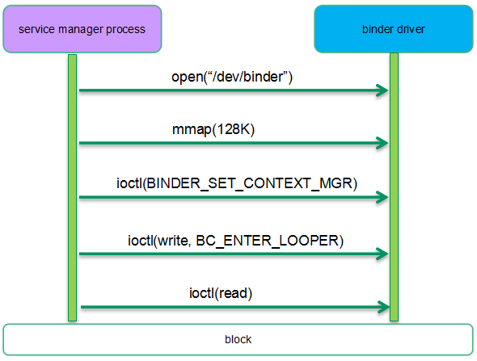

在安卓系统启动过程中， `init` 进程会启动 `service manager` 进程。`service manager` 会打开 `/dev/binder` 设备，一个进程打开 `binder` 设备就意味着该进程会使用 `binder` 这种 `IPC` 机制，这时候在内核态会相应的构建一个 `binder proc` 对象，来管理该进程相关的 `binder` 资源（ `binder ref` 、 `binder node` 、 `binder thread` 等）。为了方便 `binder` 内存管控，这时候还会映射一段 128K 的内存地址用于 `binder` 通信。之后 `service manager` 会把自己设定为 `context manager` 。所谓 `context manager` 实际上就是一个“名字服务器”，可以完成 `service` 组件名字的解析。随后 `service manager `会通过 `binder` 协议（ `BC_ENTER_LOOPER` ）告知驱动自己已经准备好接收请求了。最后 `service manager` 会进入读阻塞状态，等待来自其他进程的服务请求。

完成上面的一系列操作之后，内核相关的数据结构如下所示：

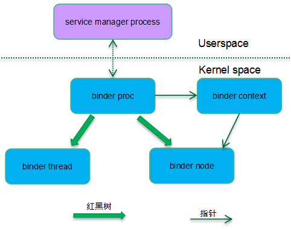

由于 `Service manager` 也算是一个特殊的 `service` 组件，因此在内核态也有一个 `binder node` 对象与之对应。 `service manager` 和其他的 `service` 组件不同的是它没有使用线程池模型，而是一个单线程的进程，因此它在内核态只有一个 `binder proc` 和 `binder thread` 。整个系统系统只有一个 `binder context` ，系统中所有的 `binder proc` 都指向这个全局唯一的 `binder` 上下文对象。而找到了 `binder context` 也就找到了 `service manager` 对应的 `binder node` 。

`binder proc` 使用了红黑树来管理其所属的 `binder thread` 和 `binder node` ，不过在 `Service manager` 这个场景中， `binder proc` 只管理了一个 `binder thread` 和 `binder node` ，看起来似乎有些小题大做，不过在其他场景（例如 `system server` ）中，`binder proc` 会创建线程池，也可能注册多个 `service` 组件。

## 2. 相关数据结构

在内核态，每一个参与 `binder` 通信的进程都会用一个唯一的 `struct binder_proc` 对象来表示。 `struct binder_proc` 主要成员如下表所示：

| 成员变量                         | 描述                                                                                                                                                                                |
| -------------------------------- | ----------------------------------------------------------------------------------------------------------------------------------------------------------------------------------- |
| struct hlist_node proc_node      | 系统中的所有 binder proc 挂入 binder_procs 的链表中，这个成员是挂入全局 binder_procs 的链表的节点                                                                                         |
| struct rb_root threads           | binder 进程对应的所有 binder thread 组成的红黑树， tid 作为 key                                                                                                                           |
| struct rb_root nodes             | 一个 binder 进程可以注册多个 service 组件，因此 binder proc 可以有很多的 binder node 。 Binder proc 对应的所有 binder node 组成一颗红黑树。当然对于 service manager 而言，它只有一个 binder node 。 |
| struct list_head waiting_threads | 该 binder 进程的线程池中等待处理 binder work 的 binder thread 链表                                                                                                                        |
| int pid                          | 进程 ID                                                                                                                                                                              |
| struct task_struct *tsk          | 指向该 binder 进程对应的进程描述符（指向 thread group leader 对应的 task struct ）                                                                                                        |
| struct list_head todo            | 需要该 binder 进程处理的 binder work 链表                                                                                                                                               |
| int max_threads                  | 线程池中运行的最大数目                                                                                                                                                              |
| struct binder_alloc alloc        | 管理 binder 内存分配的数据结构                                                                                                                                                       |
| struct binder_context *context   | 保存 binder 上下文管理者的信息。通过 binder context 可以找到 service manager 对应的 bind node 。                                                                                            |

和进程抽象类似，`binder proc` 也是管理 `binder` 资源的实体，但是真正执行 `binder` 通信的实体是 `binder thread` 。`struct binder_thread` 主要成员如下表所示：

| 成员变量                                     | 描述                                                     |
| -------------------------------------------- | -------------------------------------------------------- |
| struct binder_proc *proc                     | 该 binder thread 所属的 binder proc                         |
| struct rb_node rb_node                       | 挂入 binder proc 红黑树的节点                              |
| struct list_head waiting_thread_node         | 无事可做的时候， binder thread 会挂入 binder proc 的等待队列 |
| int pid                                      | Thread id                                                |
| struct binder_transaction *transaction_stack | 该 binder thread 正在处理的transaction                     |
| struct list_head todo                        | 需要该 binder 线程处理的 binder work 链表                    |
| struct task_struct *task                     | 该 binder thread 对应的进程描述符                          |

`Binder node` 是用户空间 `service` 组件对象的内核态实体对象， `struct binder_node` 主要成员如下表所示：

| 成员变量                                             | 描述                                                                                                                                          |
| ---------------------------------------------------- | --------------------------------------------------------------------------------------------------------------------------------------------- |
| struct rb_node rb_node;                              | 一个 binder proc 可能有多个 service 组件（提供多种服务），属于一个 binder proc 的 binder node 会挂入 binder proc 的红黑树，这个成员是嵌入红黑树的节点。 |
| struct binder_proc *proc                             | 该 binder node 所属的 binder proc                                                                                                                |
| int debug_id                                         | 唯一标示该 node 的 id ，用于调试                                                                                                                  |
| struct hlist_head refs                               | 一个 service 组件可能会有多个 client 发起服务请求，也就是说每一个 client 都是对 binder node 的一次引用，这个成员是就是保存 binder ref 的哈希表          |
| binder_uintptr_t ptr  binder_uintptr_t cookie         | 指向用户空间 service 组件相关的信息                                                                                                             |
| u8 sched_policy:2;  u8 inherit_rt:1;  u8 min_priority; | 这些属性定义了该 service 组件在处理 transaction 的时候优先级的设定。                                                                              |
| bool has_async_transaction                           | 是否有异步通信需要处理                                                                                                                        |
| struct list_head async_todo                          | 异步 binder 通信的队列                                                                                                                          |

# 二、client 如何找到 service manager ？

## 1、流程

为了完成 `service` 组件注册， `Client` 需要首先定位 `service manager` 组件。在 `client` 这个 `binder process` 中，我们使用 `handle` 作为地址来标记 `service` 组件。`Service manager` 比较特殊，对任何一个 `binder process` 而言， `handle` 等于 0 的那个句柄就是指向 `service manager` 组件。对内核态 `binder` 驱动而言，寻找 `service manager` 实际上就是寻找其对应的 `binder node` 。下面是一个 `binder client` 向 `service manager` 请求注册服务的过程示例，我们重点关注 `binder` 驱动如何定位 `service manager` ：

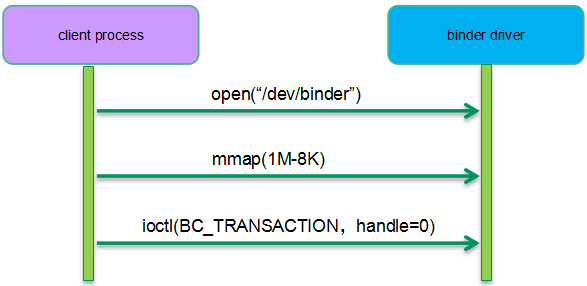

想要访问 `service manager` 的进程需要首先打开 `binder driver` ，这时候内核会创建该进程对应的 `binder proc` 对象，并建立 `binder proc` 和 `context manager` 的关系，这样进一步可以找到 `service manager` 对应的 `binder node` 。随后， `client` 进程会调用 `mmap` 映射了（ 1M-8K ）的 `binder` 内存空间。之所以映射这么怪异的内存 `size` 主要是为了有效的利用虚拟地址空间（ `VMA` 之间有 4K 的 `gap` ）。完成上面两步操作之后，`client process` 就可以通过 `ioctl` 向 `service manager` 发起 `transaction` 请求了，同时告知目标对象 `handle` 等于 0 。

实际上这个阶段的主要工作在用户空间，主要是 `service manager` 组件代理 `BpServiceManager` 以及 `BpBinder` 的创建过程。一般的通信过程需要为组件代理对象分配一个句柄，但是 `service manager` 访问比较特殊，对于每一个进程，等于 0 的句柄都保留给了 `service manager` ，因此这里就不需要分配句柄这个过程了。

## 2、路由过程

在 `binder C/S` 通信结构中， `binder client` 中的 `BpBinder` 找到 `binder server` 中的 `BBinder` 的过程需要如下过程：

1. `binder client` 用户空间中的 `service` 组件代理（ `BpBinder` ）用句柄表示要访问的 `server` 中的 `service` 组件（ `BBinder` ）。

2. 对于每一个句柄， `binder client` 内核空间使用 `binder ref` 对象与之对应。

3. `binder ref` 对象会指向一个 `binder node` 对象。

4. `binder node` 对象对应一个 `binder server` 进程的 `service` 组件。

在我们这个场景中， `binder ref` 是在 `client` 第一次通过 `ioctl` 和 `binder` 驱动交互时候完成的。这时候 `binder` 驱动的 `binder_ioctl` 函数中会建立上面路由过程需要的完整的数据对象：

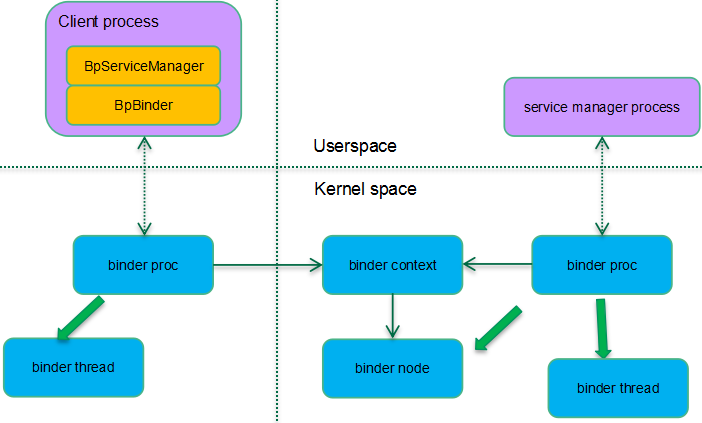

`Service manager` 的路由比较特殊，没有采用 `binder ref--->binder node` 的过程。在 `binder` 驱动中，看到 0 号句柄自然就知道是去往 `service manager` 的请求。因此，通过 `binder proc--->binder context-----binder node` 这条路径就找到了 `service manager` 。

# 三、注册 Service 组件

## 1. 流程

上一节描述了 `client` 如何找到 `service manager` 的过程，这是整个注册 `service` 组件的前半部分，这一节我们补全整个流程。由于 `client` 和 `service manager` 都完成了 `open` 和 `mmap` 的过程，双方都准备好，后续可以通过 `ioctl` 进行 `binder transaction` 的通信过程了，因此下面的流程图主要呈现 `binder transaction` 的流程（忽略 `client/server` 和 `binder` 驱动系统调用的细节）：

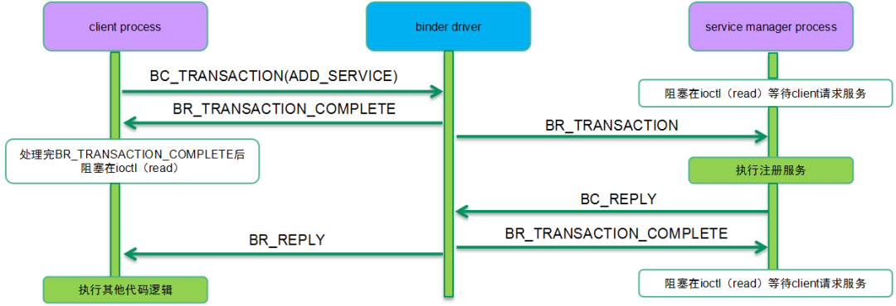

`Service manager` 是一个 `service` 组件管理中心，任何一个 `service` 组件都需要向 `service manager` 进行注册（ `add service` ），以便其他的 APP 可以通过 `service manager` 定位到该 `service` 组件（ `check service` ）。

## 2、数据对象综述

注册服务相关数据结构全图如下：

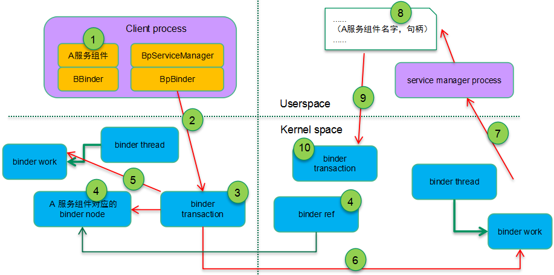

配合上面的流程， `binder` 驱动会为 `client` 和 `server` 分别创建对应的各种数据结构对象，具体过程如下：

1. 假设我们现在准备注册 A 服务组件，绑定 A 服务组件的进程在 `add service` 这个场景下是 `client process` ，它在用户空间首先会创建了 `service` 组件对象，在递交 `BC_TRANSACTION` 的时候会携带 `service` 组件的信息（把 `service` 组件地址信息封装在 `flat_binder_object` 数据结构中）。

2. 在系统调用接口层面，我们使用 `ioctl` （ `BINDER_WRITE_READ` ）来完成具体 `transaction` 的递交过程。具体的 `transaction` 数据封装在 `struct binder_write_read` 对象中，具体如下图所示：

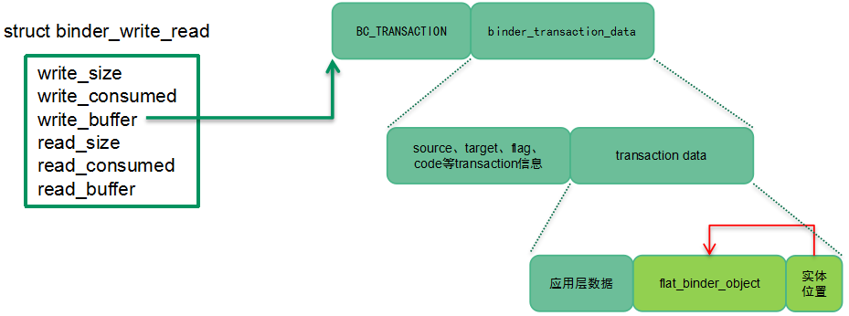

1. `Binder` 驱动创建 `binder_transaction` 对象来控制完成本次 `binder transaction` 。首先要初始化 `transaction` ，具体包括：和谁通信（用户空间通过 `binder_transaction_data` 的 `target` 成员告知 `binder` 驱动 `transaction` 的 `target` ）、为何通信（ `binder_transaction_data` 的 `code` ）等

2. 对于每一个 `service` 组件，内核都会创建一个 `binder node` 与之对应。用户空间通过 `flat_binder_object` 这个数据结构把本次要注册的 `service` 组件扁平化，传递给 `binder` 驱动。驱动根据这个 `flat_binder_object` 创建并初始化了该 `service` 组件对应的 `binder node` 。由于是注册到 `service manager` ，也就是说 `service manager` 会有一个对本次注册组件的引用，所以需要在 `target proc`（即 `service manager` ）中建立一个 `binder ref` 对象（指向这个要注册的 `binder` 实体）并分配一个 `handle` 。

3. 把一个 `BINDER_WORK_TRANSACTION_COMPLETE` 类型的 `binder work` 挂入 `client binder thread` 的 `todo list` ，通知 `client` 其请求的 `transaction` 已经被 `binder` 处理完毕，可以进行其他工作了（当然对于同步 `binder` 通信， `client` 一般会通过 `read` 类型的 `ioctl` 进入阻塞态，等待 `server` 端的回应）。

4. 至此， `client` 端已经完成了所有操作，现在我们开始进入 `server` 端的数据流了。 `Binder` 驱动会把一个 `BINDER_WORK_TRANSACTION` 类型的 `binder work` （内嵌在 `binder transaction` ）挂入 `binder` 线程的 `todo list` ，然后唤醒它起来干活。

5. `binder server` 端会使用 `ioctl` （ `BINDER_WRITE_READ` ）进入读阻塞状态，等待 `client` 的请求到来。一旦有请求到来，`Service manager` 进程会从 `binder_thread_read` 中醒来处理队列上的 `binder work` 。所谓处理 `binder work` 其实完成 `client transaction` 的向上递交过程。具体的`transaction` 数据封装在 `struct binder_write_read` 对象中，具体如下图所示：

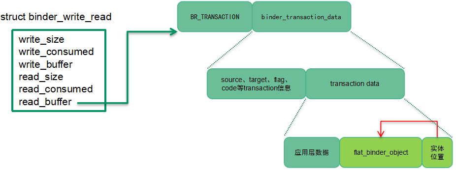

需要强调的一点是：在步骤2中， `flat_binder_object` 传递的是 `binder node` ，而这里传递的是 `handle` （即 `binder ref` ，步骤4中创建的）

1. 在 `Service manager` 进程的用户态，识别了本次 `transaction` 的 `code` 是 `add service` ，那么它会把（ `service name` ， `handle` ）数据写入其数据库，完成服务注册。

2. 从 `transaction` 的角度看，上半场已经完成。现在开始下半场的 `transaction` 的处理，即 `BC_REPLY` 的处理。和 `BC_TRANSACTION` 处理类似，也是通过 `binder_ioctl ---> binder_ioctl_write_read ---> binder_thread_write ---> binder_transaction` 这个调用链条进入 `binder transaction` 处理流程的。

3. 和上半场类似，在这里 `Binder` 驱动同样会创建一个 `binder_transaction` 对象来控制完成本次 `BC_REPLY` 的 `binder transaction` 。通过 `thread->transaction_stack` 可以找到其对应的 `BC_TRANSACTION` 的 `binder transaction` 对象，进而找到回应给哪一个 `binder process` 和 `thread` 。后续的处理和上半场类似，这里就不再赘述了。

## 3. 相关数据结构

`struct transaction`主要用来表示 `binder client` 和 `server` 之间的一次通信，该数据结构的主要成员如下表所示：

| 成员变量                | 描述                                                                                                                                              |
| ----------------------- | ------------------------------------------------------------------------------------------------------------------------------------------------- |
| work                    | 本次 transaction 涉及的 binder work ，它会挂入 target proc 或者 target binder thread 的 todo list 中。                                                      |
| from                    | 发起 binder 通信的线程                                                                                                                              |
| to_proc                 | 处理 binder 请求的进程                                                                                                                              |
| to_thread               | 处理 binder 请求的线程                                                                                                                              |
| buffer                  | binder 通信使用的 buffe r，当 A 向 B 服务请求 binder 通信的时候， B 进程分配 buffer ，并 copy A 的数据（ user space ）到 buffer 中。**这是 binder 通信唯一一次内存拷贝。** |
| code                    | 本次 transaction 的操作码。 Binder server 端根据操作码提供相应的服务                                                                                  |
| flags                   | 本次 transaction 的一些属性标记                                                                                                                     |
| Priority saved_priority | 和优先级处理相关的成员                                                                                                                            |

 `BC_TRANSACTION` 、 `BC_REPLY` 、 `BR_TRANSACTION` 和 `BR_REPLY` 这四个协议码的协议数据是 `struct binder_transaction_data` ，该数据结构的主要成员如下表所示：

| 成员变量                    | 描述                                                                                                                                                                                                                                                                            |
| --------------------------- | ------------------------------------------------------------------------------------------------------------------------------------------------------------------------------------------------------------------------------------------------------------------------------- |
| target                      | 本次 transation 去向何方？ Target 有两种形式，一种是本地 binder 实体，另外一种是表示远端 binder 实体的句柄。在 client 向 service manager 发起 transaction 的时候，那么 target.handle 等于 0 。当该 transaction 到达 service manager 的时候， binder 实体变成本地对象，因此用 Target.ptr 和 cookie 来表示。 |
| cookie                      | 如果 transaction 的目的地是本地 binder 实体，那么这个成员保存了 binder 实体对象的用户空间地址                                                                                                                                                                                         |
| code                        | Client 和 service 组件之间的操作码， binder 驱动不关心这个码字。                                                                                                                                                                                                                    |
| flags                       | 描述 transaction 特性的 flag 。例如 TF_ONE_WAY 说明是同步还是异步 binder 通信                                                                                                                                                                                                           |
| sender_pid sender_euid      | 是谁发起 transaction ？在 binder 驱动中会根据当前线程设定。                                                                                                                                                                                                                         |
| data_size offsets_size data | 本次 transaction 的数据缓冲区信息。                                                                                                                                                                                                                                               |

`flat_binder_object` 主要用来在进程之间传递 `Binder` 对象，该数据结构的主要成员如下表所示：

| 成员变量      | 描述                                                                                                                                                                                                                                                                |
| ------------- | ------------------------------------------------------------------------------------------------------------------------------------------------------------------------------------------------------------------------------------------------------------------- |
| hdr           | 用来描述 Binder 对象的类型，目前支持的类型有： binder 实体（本地 service 组件） Binder 句柄（远端的 service 组件） 文件描述符 本文主要关注前两种对象类型                                                                                                                     |
| Binder handle | 如果 flat_binder_object 传递的是本地 service 组件，那么这个联合体中的 binder 成员有效，指向本地 service 组件（用户空间对象）的一个弱引用对象的地址。 如果 flat_binder_object 传递的是句柄，那么这个联合体中的 handle 成员有效，该 handle 对应的 binder ref 指向一个 binder 实体对象。 |
| cookie        | 如果传递的是 binder 实体，那么这个成员保存了 binder 实体对象（ service 组件）的用户空间地址                                                                                                                                                                               |

`struct binder_ref` 主要用来表示一个对 `Binder` 实体对象（ `binder node` ）的引用，该数据结构的主要成员如下表所示：

| 成员变量     | 描述                                                    |
| ------------ | ------------------------------------------------------- |
| data         | 这个成员最核心的数据是用户空间的句柄                    |
| rb_node_desc | 挂入 binder proc 的红黑树（ key 是描述符， userspace 的句柄） |
| rb_node_node | 挂入 binder proc 的红黑树（ key 是 binder node ）             |
| node_entry   | 挂入 binder node 的哈希表                                 |
| proc         | 该 binder ref 属于哪一个 binder  proc                       |
| node         | 该 binder ref 引用哪一个 binder node                       |

# 四、如何和 Service 组件通信

我们以 B 进程向 A 服务组件（位于 A 进程）发起服务请求为例来说明具体的操作流程。 B 进程不能直接请求 A 服务组件的服务，因为 B 进程唯一获知的信息是 A 服务组件的名字而已。由于 A 服务组件已经注册在案，因此 `service manager` 已经有（ A 服务组件名字，句柄）的记录，因此 B 进程可以通过下面的流程获得 A 服务组件的信息并建立其代理组件对象：

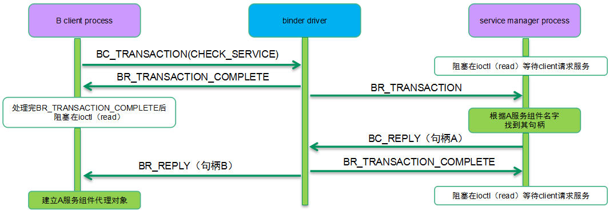

B 进程首先发起 `BC_TRANSACTION` 操作，操作码是 `CHECK_SERVICE` ，数据是 A 服务组件的名字。 `Service manager` 找到了句柄后将其封装到 `BC_REPLY` 中。这里的句柄是 `service manager` 进程的句柄，这个句柄并不能直接被 B 进程直接使用，毕竟（进程，句柄）才对应唯一的 `binder` 实体。这里的 `binder driver` 有一个很关键的操作：把 `service manager` 中句柄 A 转换成 `B client` 进程中的句柄 B ，并封装在 `BR_REPLY` 中。这时候（ `service manager` 进程，句柄 A ）和（ `B client` 进程，句柄 B ）都指向 A 服务组件对应的 `bind node` 对象。

一旦定位了 A 服务组件，那么可以继续进行如下的流程：

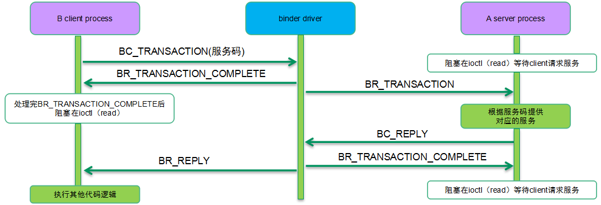

# 五、Binder内存操作

## 1.逻辑过程

在处理 `binder transaction` 的过程中，相关的内存操作如下所示：

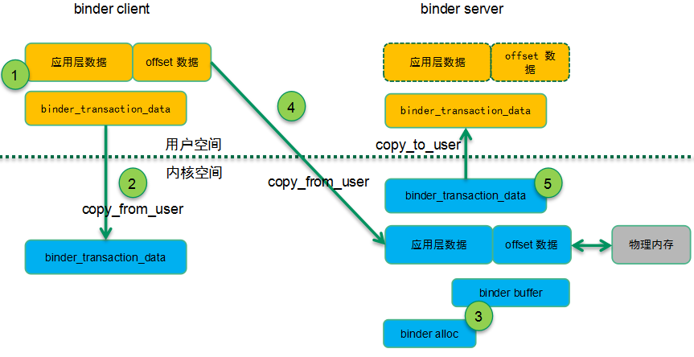

配合上面的流程，内存操作的逻辑过程如下：

1. 在 `binder client` 的用户空间中，发起 `transaction` 的一方会构建用户数据缓冲区（包括两部分：实际的数据区和 `offset` 区），把想要传递到 `server` 端的数据填充到缓冲区并封装在 `binder_transaction_data` 数据结构中。

2. `binder_transaction_data` 会被 `copy` 到内核态， `binder` 驱动会根据它计算出本次需要 `binder` 通信的数据量。

3. 根据 `binder` 通信的数据量在 `server` 进程的 `binder VMA` 分配数据缓冲区（ `binder buffer` 是这个缓冲区的控制数据对象），同时根据需要也会分配对应的物理 `page` 并建立地址映射，以便用户空间可以访问这段 `buffer` 的数据。

4. 建立内核地址空间的映射，把用户空间的 `binder` 数据缓冲区拷贝到内核中，然后释放掉该映射。

5. 在把 `binder buffer` 的数据传递到 `server` 用户空间的时候，我们需要一个 `binder_transaction_data` 来描述 `binder` 通信的缓冲区数据，这个数据对象需要拷贝到用户地址空间，而 `binder buffer` 中的数据则不需要拷贝，因为在上面步骤3中已经建立了地址映射， `server` 进程可以直接访问即可。

## 2.主要的数据结构

`struct binder_alloc` 用来描述 `binder` 进程内存分配器，该数据结构的主要成员如下表所示：

| 成员变量          | 描述                                                                               |
| ----------------- | ---------------------------------------------------------------------------------- |
| vma               | binder 内存对应的 VMA                                                                |
| vma_vm_mm         | binder 进程对应的地址空间描述符                                                     |
| buffer            | 该 binder proc 能用于 binder 通信的内存地址。该地址是 mmap 的用户空间虚拟地址。          |
| buffers           | 所有的 binder buffers （包括空闲的和正在使用的）                                     |
| free_buffers      | 空闲 binder buffers 的红黑树，按照 size 排序                                           |
| allocated_buffers | 已经分配的 binder buffers 的红黑树， key 是 buffer address                              |
| free_async_space  | 剩余的可用于异步 binder 通信的内存大小。初始化的时候配置为 2M （整个 binder 内存的一半） |
| pages             | binder 内存区域对应的 page 们。在 reclaim binder 内存的时候                             |
| buffer_size       | 通过 mmap 映射的，用于 binder 通信的缓冲区大小，即 binder alloc 管理的整个内存的大小。   |
| pid               | Binder proc 的pid                                                                   |

`struct binder_buffer` 用来描述一个用于 `binder` 通信的缓冲区，该数据结构的主要成员如下表所示：

| 成员变量               | 描述                                                                                                   |
| ---------------------- | ------------------------------------------------------------------------------------------------------ |
| entry                  | 挂入 binder alloc buffer 链表（ buffers 成员）的节点                                                       |
| rb_node                | 挂入 binder alloc 红黑树的节点：如果是空闲的 buffer ，挂入空闲红黑树，如果是已经分配的，挂入已分配红黑树。 |
| transaction            | Binder 缓冲区都是用于某次 binder transaction 的，这个成员指向对应的 transaction 。                          |
| target_node            | 该 buffer 的去向哪一个 node （ service 组件）                                                                |
| data_size offsets_size | Binder 缓冲区的数据区域的大小以及 offset 区域的大小。                                                     |
| user_data              | 该 binder buffer 的用户空间地址                                                                          |

参考文献：

[1]Android系统源代码情景分析，罗升阳著

[2]http://gityuan.com/tags/#binder ，袁辉辉的博客

