## 虚拟环境

为了避免各种不同环境的依赖互相干扰，这里我们使用 miniconda 创建虚拟环境来开发 django 应用。

镜像下载地址：https://mirrors.tuna.tsinghua.edu.cn/help/anaconda/

安装完成后，可以通过修改用户目录下的 `.condarc` 文件来使用 TUNA 镜像源。
Windows 用户无法直接创建名为 `.condarc` 的文件，可先执行 `conda config --set show_channel_urls yes` 生成该文件之后再修改。
Windows 平台 `.condarc` 文件的路径为 `%USERPROFILE%/.condarc` 。

```bash
channels:
  - defaults
show_channel_urls: true
default_channels:
  - https://mirrors.tuna.tsinghua.edu.cn/anaconda/pkgs/main
  - https://mirrors.tuna.tsinghua.edu.cn/anaconda/pkgs/r
  - https://mirrors.tuna.tsinghua.edu.cn/anaconda/pkgs/msys2
custom_channels:
  conda-forge: https://mirrors.tuna.tsinghua.edu.cn/anaconda/cloud
  msys2: https://mirrors.tuna.tsinghua.edu.cn/anaconda/cloud
  bioconda: https://mirrors.tuna.tsinghua.edu.cn/anaconda/cloud
  menpo: https://mirrors.tuna.tsinghua.edu.cn/anaconda/cloud
  pytorch: https://mirrors.tuna.tsinghua.edu.cn/anaconda/cloud
  pytorch-lts: https://mirrors.tuna.tsinghua.edu.cn/anaconda/cloud
  simpleitk: https://mirrors.tuna.tsinghua.edu.cn/anaconda/cloud
```

为了使 cmder 默认打开就可以使用 conda ，进入 cmder `Setting -> Startup -> Tasks` 添加一个新的 task 。将 task 名称设置为 anaconda ，命令设置为 `cmd /k ""%ConEmuDir%\..\init.bat"" & D:\miniconda3\Scripts\activate.bat D:\miniconda3`，并勾选 default task for new console 。

配置好了以后，打开 cmder 运行下列命令创建一个 python 虚拟环境。

```bash
(base) $ conda create -n pyWeb python=3.6
```

`pyWeb` 为虚拟环境名称，`python=3.6` 为 python 版本设置为 3.6。

接着激活 pyWeb 环境并安装 django 即可。

```bash
(base) $ conda activate pyWeb
(pyWeb) $ pip install django==3.2.18
```

下面列出 conda 一些常用命令：

```bash
conda create -n myenv python=3.9             # 创建环境
conda activate myenv                         # conda 激活名称为 myenv 的环境
conda deactivate                             # conda 退出当前环境
conda env list                               # 列出环境列表
conda env export > environment.yaml          # 导出当前环境
conda create -f environment.yaml -n myenv    # 从导出的 environment.yaml 文件创建环境
conda env remove -n myenv                    # conda 删除环境
pip freeze > requirements.txt                # 导出pip install 安装的包
pip uninstall -r requirements.txt -y -v      # pip 删除全部包，-r 包列表文件，-y 不提示是否删除，-v 输出日志
```

## 创建项目

首先选定好项目的存放目录，我这里存放在 `/home/ckcat/code/PythonProjects/Django_Study` ，使用如下命令创建项目：

```bash
django-admin startproject project_name
```

例如：
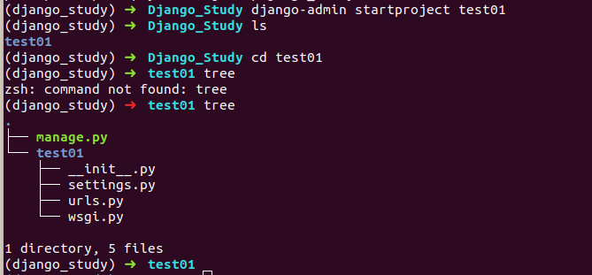

目录结构：

- `manage.py` 是项目管理文件，通过他管理项目。
- `test01` 与项目同名的目录。
- `_init_.py` 是一个空文件，作用是这个目录`test01`可以被当作包使用。
- `settings.py` 是项目的整体配置文件。
- `urls.py` 是项目的 URL 配置文件。
- `wsgi.py` 是项目与 WSGI 兼容的 WEB 服务器入口。

接下来可以使用 pycharm 打开该项目。

## 2.1. 创建应用

使用一个应用开发一个业务模块，此处创建应用名称为 booktest,创建应用命令如下：

```
python manage.py startapp booktest
```

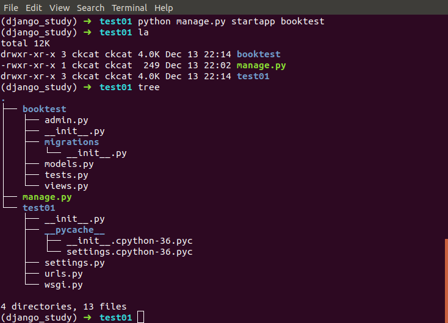

目录结构：

- `_init_.py` 是一个空文件，作用是这个目录`booktest`可以被当作包使用。
- `tests.py` 用于开发测试用例。
- `models.py` 与数据库操作相关。
- `views.py` 与接收浏览器请求，进行处理，返回页面相关。
- `admin.py` 与网站后台管理相关。

## 2.2. 安装应用

应用创建完成后需要安装才可以使用，在`settings.py` 中 `INSTALLED_APPS` 下添加应用名称就可以完成安装。

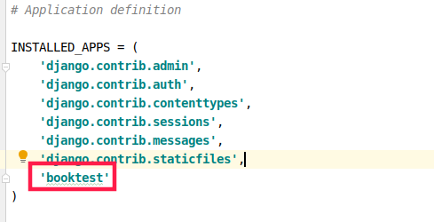

## 2.3. 开发服务器

在开发阶段，为了能快速预览到开发的效果，django 提供了一个纯 python 编写的轻量级 web 服务器，仅在开发阶段使用，运行命令如下：

```
python manage.py runserver ip:port
```

> ip 和端口默认为 127.0.0.1:8000

例如：
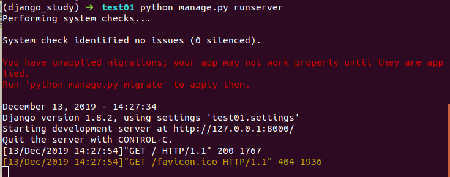

接着在浏览器中输入网址 `127.0.0.1:8000` 可以查看当前站点的开发效果，如下图所示：
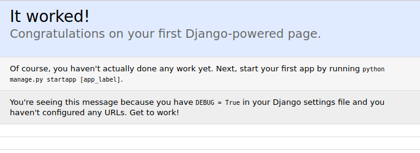

# 3. 设计模型

## 3.1. ORM 框架

O 是 object，也就是类对象的意思，R 是 relation，也就是关系数据库中数据表的意思，M 是 Mapping，是映射的意思。在 ORM 框架中，它帮助我们把类和数据表进行了一个映射，可以让我们通过类和类对象就能操作它所对应的表格中的数据。ORM 框架还有一个功能，它可以根据我们设计的类自动帮我们生成数据库中的表格，省去了我们自己建表的过程。

django 中内嵌了 ORM 框架，不需要直接面向数据库编程，而是定义模型类，通过模型类和对象完成数据表的增删改查操作。

使用 django 进行数据库开发的步骤如下：

1. 在 models.py 中定义模型类。
2. 迁移。
3. 通过类和对象完成数据增删改查。

## 3.2. 定义模型类

模型类定义在 models.py 文件中，继承自 models.Model 类。

> 说明：不需要定义主键列，在生成时会自动添加，并且值自动增长。

### 3.2.1. 设计图书类

读书类：

- 类名 : BookInfo
- 读书名称 : btitle
- 读书发布日期 : bpub_date

### 3.2.2. 模型类设计

根据设计，在 models.py 中定义模型类如下：

```
from django.db import models

# Create your models here.
class BookInfo(models.Model):
    btitle = models.CharField(max_length=20)
    bpub_date = models.DateField()
```

## 3.3. 迁移

迁移前目录结构如下图：
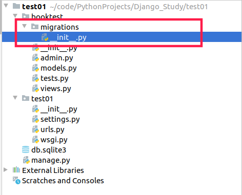

迁移由两步完成：

1. 生成迁移文件：根据模型类生成创建表的迁移文件。
2. 执行迁移：根据第一步生成的迁移文件在数据库中创建表。

生成迁移文件命令如下：

```
python manage.py makemigrations
```

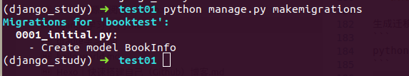

执行生成迁移文件命令后，会在应用 booktest 目录下的 migrations 目录中生成迁移文件，内容如下：
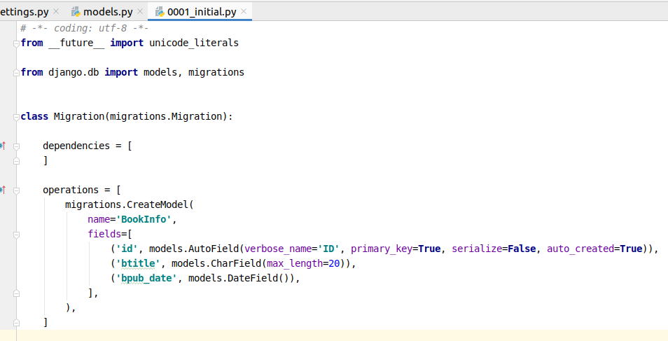

django 框架根据我们设计的模型类生成了迁移文件，在迁移文件中我们可以看到 fields 列表中每一个元素跟 BookInfo 类属性名以及属性的类型是一致的。同时我们发现一个 id 项，这一项是 django 框架帮我们自动生成的，在创建表的时候 id 就会作为对应的主键列，并且主键列自动增长。

执行迁移命令如下：

```
python manage.py migrate
```

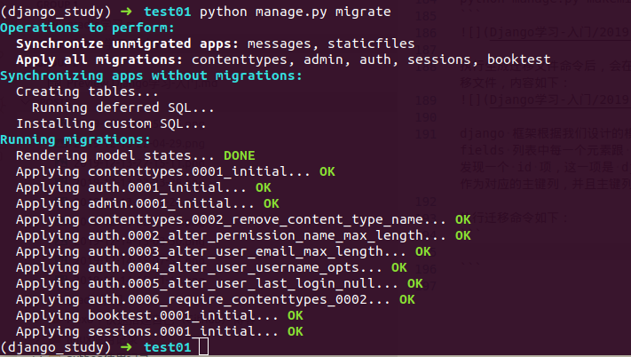

执行迁移命令后，将会生成对应的 sqlite3 数据库文件，数据表默认名称为：

```
<app_name>_<model_name>
例如：
booktest_bookinfo
```

### 3.3.1. 设计英雄类

英雄类：

- 类名 : HeroInfo
- 英雄名 : hname
- 英雄性别 : hgender
- 英雄简介 : hcomment
- 英雄所属读书 : hbook
- 读书-英雄的关系为一对多

打开 booktest/models.py , 定义英雄类代码如下：

```
class HeroInfo(models.Model):
    hname = models.CharField(max_length=20)
    hgender = models.BooleanField()
    hcomment = models.CharField(max_length=100)
    hbook = models.ForeignKey("BookInfo") # BookInfo 作为 HeroInfo 的外键。
```

生成迁移文件，并执行迁移：

```
python manage.py makemigrations
python manage.py migrate
```

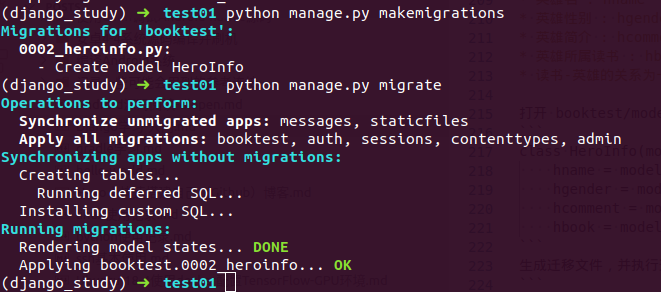

之后将会生成 booktest_HeroInfo 表，并且 hbook 字段将会变成 hbook_id 对应 booktest_BookInfo 中的主键。

## 3.4. 数据操作

完成数据表的迁移之后，就可以通过进入项目的 shell 进行简单的 API 操作。如果需要退出可以使用 `ctrl+d` 或者输入 `quit()` .

进入项目 shell :

```
pyhotn manage.py shell
```

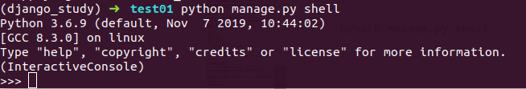

首先引入 booktest/models 中的类：

```
from booktest.models import BookInfo, HeroInfo
```

查询所有图书信息

```
BookInfo.objects.all()
```

新建图书对象，并查看所有图书信息：

```
b = BookInfo()
b.btitle = "射雕英雄传"
from datetime import date
b.bpub_date=date(1990,1,23)
b.save()
BookInfo.objects.all()
```

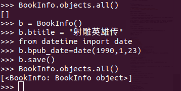

查找图书信息并查看值：

```
>>> b=BookInfo.objects.get(id=1)
>>> b
<BookInfo: BookInfo object>
>>> b.id
1
>>> b.btitle
'射雕英雄传'
>>> b.bpub_date
datetime.date(1990, 1, 23)
```

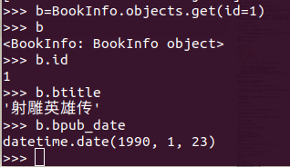

修改图书信息：

```
>>> b.bpub_date=date(2019,12,14)
>>> b.save
<bound method Model.save of <BookInfo: BookInfo object>>
>>> b.bpub_date
datetime.date(2019, 12, 14)
```

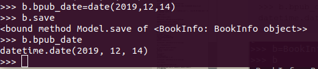

删除读书信息：

```
b.delete()
```

### 3.4.1. 对象关联操作

创建一个 HeroInfo 对象：

```
>>> h=HeroInfo()
>>> h.hname="黄蓉"
>>> h.hgender=False
>>> h.hcomment="她是女主角"
>>> h.hbook=b
>>> h.save()
```

图书与英雄是一对多的关系，django 中提供了关联的操作方式。
获得关联集合，返回当前 book 对象的所有 hero 。

```
>>> b.heroinfo_set.all()
[<HeroInfo: HeroInfo object>]
```

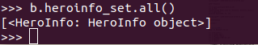

# 4. 后台管理

使用 django 后台管理需要安装如下步骤操作：

1. 管理页面本地化
2. 管理管理员
3. 注册模型类
4. 自定义管理页面

## 4.1. 管理页面本地化

本地化是将显示的语言、时间等使用本地的习惯。
打开 `test01/settings.py` 文件，找到语言编码、时区的设置，将内容改为如下

```
LANGUAGE_CODE = 'zh-hans' #'en-us'使用中文
TIME_ZONE = 'Asia/Shanghai' #'UTC' 设置上海时区
```

## 4.2. 创建管理员

创建管理员命令如下，按提示输入用户名，邮箱，密码。

```
python manage.py createsuperuser
```

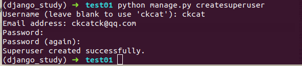

接下来启动服务器。

```
python manage.py runserver
```

在浏览器中打开如下地址

```
http://localhost:8000/admin/
```

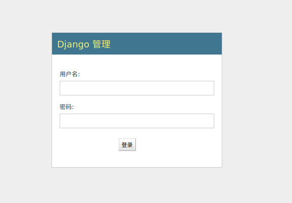

输入刚才创建的用户名和密码，进入管理页面。
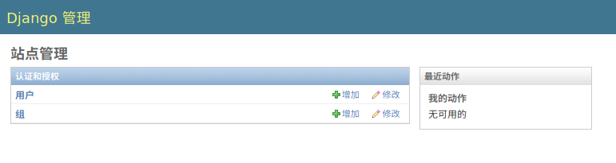

## 4.3. 注册模型类

登陆后台管理后，默认没有我们创建的应用中定义的模型类，需要在自己应用中的 admin.py 文件中注册，才可以在后台管理中看到，并进行增删查找操作。

打开 `booktest/admin.py` 文件，编写如下代码：

```
from django.contrib import admin

# Register your models here.
from booktest.models import BookInfo, HeroInfo

admin.site.register(BookInfo)
admin.site.register(HeroInfo)
```

刷新浏览器页面，可以看到模型类 BookInfo 和 HeroInfo 的管理了。
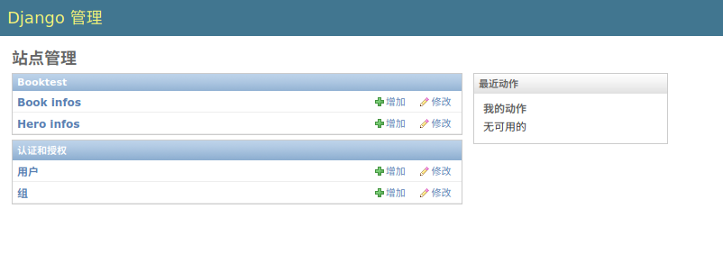

## 4.4. 自定义管理页面

在列表中只显示了 BookInfo object ，对象的其他属性并没有列出来，查看非常不方便。Django 提供了自定义管理页面的功能。

打开 `booktest/admin.py` 文件，自定义类，继承自 `admin.ModelAdmin` 类。

- 属性 list_display 表示要显示哪些属性

```
class BookInfoAdmin(admin.ModelAdmin):
    list_display = ['id', 'btitle', 'bpub_date']
```

- 修改该模型类 BookInfo 的注册代码如下

```
admin.site.register(BookInfo, BookInfoAdmin)
```

- 刷新 BookInfo 的列表也，所有的属性都显示出来了

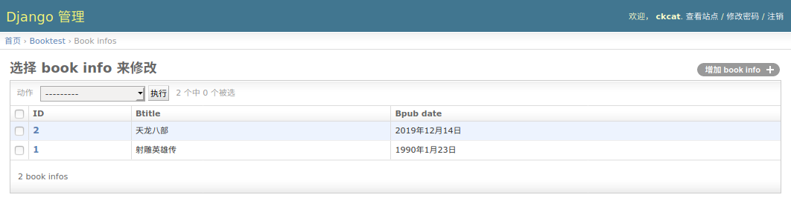

最终 booktest/admin.py 文件代码如下:

```
from django.contrib import admin

# Register your models here.
from booktest.models import BookInfo, HeroInfo

class BookInfoAdmin(admin.ModelAdmin):
    list_display = ['id', 'btitle', 'bpub_date']

class HeroInfoAdmin(admin.ModelAdmin):
    list_display = ['id', 'hname', 'hgender', 'hcomment']

admin.site.register(BookInfo, BookInfoAdmin)
admin.site.register(HeroInfo, HeroInfoAdmin)
```

# 5. 视图以及 URL

django 的设计框架是 MVT ，用户在 URL 中请求的是视图，视图接收请求后进行处理，并将处理结果返回给请求者。
使用视图时需要进行两步操作：

1. 定义视图
2. 配置 URLconf

## 5.1. 定义视图

视图就是一个 python 函数， 被定义在 `views.py` 中。

视图必须有一个参数，一般叫 `request` ,视图必须返回 `HttpResponse` 对象, `HttpResponse` 中的参数内容会显示在浏览器页面上。

打开 `booktest/views.py` 文件，定义视图 `index` 如下:

```
from django.shortcuts import render

# Create your views here.
from django.http import HttpResponse

def index(request):
    return HttpResponse("index")
```

## 5.2. 配置 URLconf

### 5.2.1. 查找视图的过程

请求者在浏览器中输入 url ，请求到网站后，获取 url 信息，然后编写好的 URLconf 逐条匹配，如果匹配成功则调用对应的视图函数，如果所有的 URLconf 都没有匹配成功，则返回 404 错误。

一条 URLconf 包括 url 规则、视图两部分：

- url 规则使用正则表达式定义。
- 视图就是在 `views.py` 中定义的视图函数。

需要两步完成 URLconf 配置：

1. 在应用中定义 URLconf 。
2. 包含到项目中的 URLconf 中。

在 booktest 应用下创建 `urls.py` 文件，定义代码如下：

```
from django.conf.urls import url
from booktest import views

urlpatterns = [
    url(r'^$', views.index),
]
```

包含到项目 `test01/urls.py` 文件中, 完整代码如下

```
from django.conf.urls import include, url
from django.contrib import admin

urlpatterns = [
    url(r'^admin/', include(admin.site.urls)),
    url(r'^', include('booktest.urls'))
]
```

## 5.3. 请求访问

视图和 URLconf 都定义好后，在流浪其中打开 `localhost:8000` 页面。
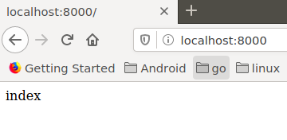

# 6. 模板

在 django 中，将前端的内容定义在模板中，然后再把模板交给视图调用，各种漂亮、炫酷的效果就出现了。

## 6.1. 创建模板

为 booktet 的视图 index 创建模板 `index.html` ,目录结构如下图：
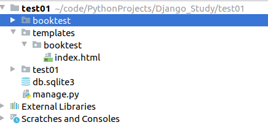

一般将定义 `templates` 目录在项目的根目录，其中根据不同的应用创建不同的目录。

设置查找模板的路径： 打开 `test01/setting.py` 文件，设置 TEMPLATES 的 DIRS 值：

```
TEMPLATES = [
    {
        'BACKEND': 'django.template.backends.django.DjangoTemplates',
        'DIRS': [os.path.join(BASE_DIR, 'templates')], # 设置模板路径
        'APP_DIRS': True,
        'OPTIONS': {
            'context_processors': [
                'django.template.context_processors.debug',
                'django.template.context_processors.request',
                'django.contrib.auth.context_processors.auth',
                'django.contrib.messages.context_processors.messages',
            ],
        },
    },
]
```

## 6.2. 自定义模板

打开 `templates/booktest/index.html`，定义代码如下：

```
<!DOCTYPE html>
<html lang="en">
<head>
    <meta charset="UTF-8">
    <title>读书列表</title>
</head>
<body>
<!-- title 为变量名-->
<h1>{{ title }}</h1>

{{ i }}<br>


</body>
</html>
```

## 6.3. 视图调用模板

打开 `booktest/views.py` 文件，调用上面的模板文件

```
from django.shortcuts import render

# Create your views here.
from django.http import HttpResponse
from django.template import loader, RequestContext
def index(request):
    # 1. 获取模板
    template = loader.get_template('booktest/index.html')
    # 2. 定义上下文
    context = RequestContext(request, {'title':'图书列表', 'list':range(10)})
    # 3. 渲染模板
    return HttpResponse(template.render(context))
```

对应的页面如下图：

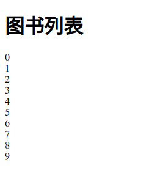

## 6.4. 视图调用模板简写

视图调用模板都要执行以上三部分，于是 django 提供了一个函数 render 封装了以上代码。

方法 render 包含 3 个参数：

- 第一个参数为 request 对象
- 第二个参数为模板文件路径
- 第三个参数为字典，表示向模板中传递的上下文数据

打开 `booktest/views.py` 文件，调用 render 的代码如下：

```
def index(request):
    context = {'title':'图书列表', 'list':range(10)}
    return render(request, 'booktest/index.html', context)
```

> 对应的[代码地址](https://github.com/CKCat/Note/tree/master/Python/Django/test01)

# 总结

1. 安装 Django，可以指定版本安装。

```bash
python -m pip install Django==3.2.11
```

2. 创建项目和应用，一个项目可以创建多个应用。

```bash
# 创建项目
django-admin startproject mysite
# 创建应用
python manage.py startapp polls
```

3. URLconf
   函数 include() 允许引用其它 URLconfs。每当 Django 遇到 include() 时，它会截断与此项匹配的 URL 的部分，并将剩余的字符串发送到 URLconf 以供进一步处理。

函数 path() 具有四个参数，两个必须参数：route 和 view，两个可选参数：kwargs 和 name。

- route: 是一个匹配 URL 的准则（类似正则表达式）。当 Django 响应一个请求时，它会从 urlpatterns 的第一项开始，按顺序依次匹配列表中的项，直到找到匹配的项。
- view: 当 Django 找到了一个匹配的准则，就会调用这个特定的视图函数，并传入一个 HttpRequest 对象作为第一个参数，被“捕获”的参数以关键字参数的形式传入。
- kwargs: 任意个关键字参数可以作为一个字典传递给目标视图函数。
- name: 为你的 URL 取名能使你在 Django 的任意地方唯一地引用它，尤其是在模板中。

4. 数据库配置：

ENGINE -- 可选值有 'django.db.backends.sqlite3'，'django.db.backends.postgresql'，'django.db.backends.mysql'，或 'django.db.backends.oracle'等。

NAME -- 数据库的名称。

> 除了 SQLite 以外，使用其他数据库之前必须先创建好数据库。

创建数据表。

```bash
python manage.py migrate polls
```

迁移。

```bash
python manage.py makemigrations
```

查看迁移对应的 SQL 语句。

```bash
python manage.py sqlmigrate polls 0001
```

5. 创建管理员账号

```bash
python manage.py createsuperuser
```

6. 模板
   项目的 TEMPLATES 配置项描述了 Django 如何载入和渲染模板。默认的设置文件设置了 DjangoTemplates 后端，并将 APP_DIRS 设置成了 True。这一选项将会让 DjangoTemplates 在每个 INSTALLED_APPS 文件夹中寻找 "templates" 子目录。

我们需要帮助 Django 选择正确的模板，最好的方法就是把他们放入各自的 命名空间 中，也就是把这些模板放入一个和 自身 应用重名的子文件夹里。

7. 去除硬编码 URL
   可以使用 `` 标签去除硬编码 URL，其中 name 为 `url()` 函数中 name 参数定义的字符串。

8. 通用视图 ListView 和 DetailView
   DetailView 期望从 URL 中捕获名为 "pk" 的主键值。

默认情况下，通用视图 DetailView 使用一个叫做 `<app name>/<model name>_detail.html` ListView 使用一个叫做 `<app name>/<model name>_list.html` 的默认模板；可以通过修改 template_name 的值改变默认的模板。

默认情况下， DetailView 和 ListView 会根据 model 属性自动提供 context 变量，默认名称为模型的小写，可以通过修改 context_object_name 属性改变默认值。

9. 自动测试
   根据被测试文件或类名，创建对应的测试文件，编写测试类继承 `django.test.TestCase`，编写测试代码。

测试试图还需要导入 `django.test.Client` 类，该类可以模拟用户和视图层代码的交互。

更深入的测试可以使用 Selenium 工具。

10. 静态文件
    Django 的 STATICFILES_FINDERS 设置包含了一系列的查找器，它们知道去哪里找到 static 文件。AppDirectoriesFinder 是默认查找器中的一个，它会在每个 INSTALLED_APPS 中指定的应用的子文件中寻找名称为 static 的特定文件夹。管理后台采用相同的目录结构管理它的静态文件。

我们需要指引 Django 选择正确的静态文件，而最好的方式就是把它们放入各自的 命名空间 。

我们需要再 html 文件开头添加 `` 才可以使用 `` 模板标签，该标签会生成静态文件的绝对路径。

`` 模板标签在静态文件（例如样式表）中是不可用的。

11. 自定义后台界面和风格

在项目根目录新建一个文件夹 `templates/admin`，并将存放 Django 默认模板的目录（`django/contrib/admin/templates`）内的模板文件 `admin/base_site.html` 复制到这个目录内。可以使用 ` python -c "import django; print(django.__path__)"` 查看 Django 的安装目录。

修改 `setting.py` 中 TEMPLATES 选项中 DIRS 字段为 `BASE_DIR / 'templates'`。最后修改 `admin/base_site.html` 文件中的内容。
