# 静态文件

项目中的 CSS、图片、js 都是静态文件。一般会将静态文件放到一个单独的目录中，以方便管理。在 html 页面中调用时，也需要指定静态文件的路径，Django 中提供了一种解析的方式配置静态文件路径。静态文件可以放在项目根目录下，也可以放在应用的目录下，由于有些静态文件在项目中是通用的，所以推荐放在项目的根目录下，方便管理。

## 示例

创建 `test5` 项目并创建 `booktest` 应用.

1）在 `test5/settings.py` 文件中定义静态文件存放的物理目录。

```
STATIC_URL = '/static/'
STATICFILES_DIRS = [
    os.path.join(BASE_DIR, 'static'),
]
```

2）在项目根目录下创建 `static` 目录，再创建 `img` 、`css` 、`js` 目录。

3）在 `booktest/views.py` 中定义视图 `static_test` 。

```
def static_test(request):
    return render(request,'booktest/static_test.html')
```

4）在 `booktest/urls.py` 中配置 url。

```
    url(r'^static_test/$',views.static_test),
```

5）在 `templates/booktest/` 下创建 `static_test.html` 文件。

```
<html>
<head>
    <title>静态文件</title>
</head>
<body>

</body>
</html>
```

6）保存图片到 `static/img/` 目录下，名称为 `sg.jpeg` 。

7）运行服务器，浏览效果如下图：


## 配置静态文件

Django 提供了一种配置，可以在 html 页面中可以隐藏真实路径。

1）在 `test5/settings.py` 文件中修改 STATIC_URL 项。

```
# STATIC_URL = '/static/'
STATIC_URL = '/abc/'
```

2）刷新浏览器，图片找不到了，效果如下图：

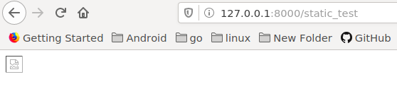

3）修改 `templates/booktest/static_test.html` 如下：

```
<html>
<head>
    <title>静态文件</title>
</head>
<body>
修改前：
<hr>
修改后：
</body>
</html>
```

3）刷新浏览器，效果如下图：


4）查看网页源代码，发现可以网址和真实地址之间没有关系。

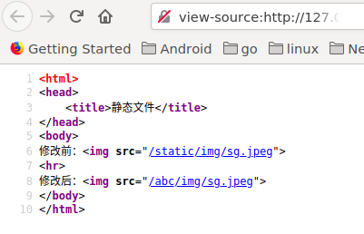

为了安全可以通过配置项隐藏真实图片路径，在模板中写成固定路径，后期维护太麻烦，可以使用 `static` 标签，根据配置项生成静态文件路径。

1）修改 `templates/booktest/static_test.html` 如下：

```
<html>
<head>
    <title>静态文件</title>
</head>
<body>
修改前：
<hr>
修改后：
<hr>
动态配置：


</body>
</html>
```

2）刷新浏览器，效果如下图：

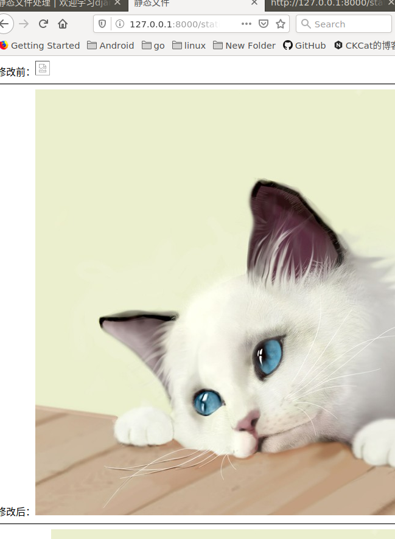

查看网页源代码如下图：

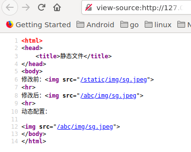

说明：这种方案可以隐藏真实的静态文件路径，但是结合 Nginx 布署时，会将所有的静态文件都交给 Nginx 处理，而不用转到 Django 部分，所以这项配置就无效了。

# 中间件

Django 中的中间件是一个轻量级、底层的插件系统，可以介入 Django 的请求和响应处理过程，修改 Django 的输入或输出。中间件的设计为开发者提供了一种无侵入式的开发方式，增强了 Django 框架的健壮性，其它的 MVC 框架也有这个功能，名称为 IoC 。

Django 在中间件中预置了五个方法，这五个方法的区别在于不同的阶段执行，对输入或输出进行干预，方法如下：

1）初始化：无需任何参数，服务器响应第一个请求的时候调用一次，用于确定是否启用当前中间件。

```
def __init__(self):
    pass
```

2）处理请求前：在每个请求上，request 对象产生之后，url 匹配之前调用，返回 None 或 HttpResponse 对象。

```
def process_request(self, request):
    pass
```

3）处理视图前：在每个请求上，url 匹配之后，视图函数调用之前调用，返回 None 或 HttpResponse 对象。

```
def process_view(self, request, view_func, *view_args, **view_kwargs):
    pass
```

4）处理响应后：视图函数调用之后，所有响应返回浏览器之前被调用，在每个请求上调用，返回 HttpResponse 对象。

```
def process_response(self, request, response):
    pass
```

5）异常处理：当视图抛出异常时调用，在每个请求上调用，返回一个 HttpResponse 对象。

```
def process_exception(self, request,exception):
    pass
```

## 示例

中间件是一个独立的 python 类，，可以定义这五个方法中的一个或多个。

1）在 `booktest`目录下创建 `middleware.py`文件，代码如下：

```
class my_mid:
    def __init__(self):
        print("-----init-----")

    def process_request(self, request):
        print("-----process_request-----")

    def process_view(self, view_func, *view_args, **kwargs):
        print("-----process_view-----")

    def process_response(self, request, response):
        print("-----process_response-----")
        return response
```

2）在 `test5/settings.py` 文件中，向 `MIDDLEWARE_CLASSES` 项中注册。

```
MIDDLEWARE_CLASSES = (
    'django.contrib.sessions.middleware.SessionMiddleware',
    'django.middleware.common.CommonMiddleware',
    'django.middleware.csrf.CsrfViewMiddleware',
    'django.contrib.auth.middleware.AuthenticationMiddleware',
    'django.contrib.auth.middleware.SessionAuthenticationMiddleware',
    'django.contrib.messages.middleware.MessageMiddleware',
    'django.middleware.clickjacking.XFrameOptionsMiddleware',
    'django.middleware.security.SecurityMiddleware',
    'booktest.middleware.my_mid',
)
```

3）修改 `booktest/views.py` 中视图 index 。

```
def index(request):
    print("++==index==++")
    return render(request, 'booktest/index.html')
```

4）运行服务器，命令行中效果如下图：

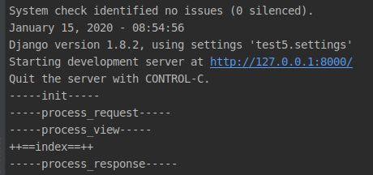

5）刷新页面，命令行中效果如下图：

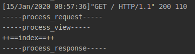

## 异常中间件

1）在 `booktest/middleware.py` 中定义两个异常类如下：

```
class exp1:
    def process_exception(self, request, exception):
        print("-----exp1-----")

class exp2:
    def process_exception(self, request, exception):
        print("-----exp2-----")
```

2）在 `test5/settings.py` 文件中，向 `MIDDLEWARE_CLASSES` 项中注册。

```
MIDDLEWARE_CLASSES = (
    'django.contrib.sessions.middleware.SessionMiddleware',
    'django.middleware.common.CommonMiddleware',
    'django.middleware.csrf.CsrfViewMiddleware',
    'django.contrib.auth.middleware.AuthenticationMiddleware',
    'django.contrib.auth.middleware.SessionAuthenticationMiddleware',
    'django.contrib.messages.middleware.MessageMiddleware',
    'django.middleware.clickjacking.XFrameOptionsMiddleware',
    'django.middleware.security.SecurityMiddleware',
    'booktest.middleware.my_mid',
    'booktest.middleware.exp1',
    'booktest.middleware.exp2',
)
```

3）修改 `booktest/views.py` 中视图 index 。

```
def index(request):
    print("++==index==++")
    raise Exception('自定义异常')
    return render(request, 'booktest/index.html')
```

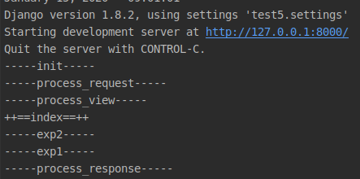

总结：如果多个注册的中间件类中都有 `process_exception` 的方法，则先注册的后执行。

# Admin 站点

内容发布的部分由网站的管理员负责查看、添加、修改、删除数据，开发这些重复的功能是一件单调乏味、缺乏创造力的工作，为此，Django 能够根据定义的模型类自动地生成管理模块。

在第一部分对管理站点做了简单介绍，现在做详细讲解。在 Django 项目中默认启用 Admin 管理站点。

1）准备工作：创建管理员的用户名和密码。

```
python manage.py createsuperuser
```

按提示填写用户名、邮箱、密码。

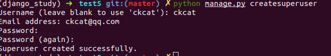

2）使用：在应用的 `admin.py` 中注册模型类

例：打开 `booktest/admin.py` 文件，注册地区模型。

```
from django.contrib import admin
from booktest.models import *

admin.site.register(AreaInfo)
```

3）输入如下网址：

```
http://127.0.0.1:8000/admin/
```

按提示填写用户名、密码，点击“Log in”按钮登录。

登录成功后，可以看到 AreaInfos，可以进行增加、修改、删除、查询的管理。

## 控制管理页展示

类 ModelAdmin 可以控制模型在 Admin 界面中的展示方式，主要包括在列表页的展示方式、添加修改页的展示方式。

1）在 `booktest/admin.py` 中，注册模型类前定义管理类 AreaAdmin 。

```
class AreaAdmin(admin.ModelAdmin):
    pass
```

管理类有两种使用方式：

- 注册参数
- 装饰器

注册参数：打开 `booktest/admin.py` 文件，注册模型类代码如下：

```
admin.site.register(AreaInfo,AreaAdmin)
```

装饰器：打开 `booktest/admin.py` 文件，在管理类上注册模型类，代码如下：

```
@admin.register(AreaInfo)
class AreaAdmin(admin.ModelAdmin):
    pass
```

接下来介绍如何控制列表页、增加修改页展示效果。

## 列表页选项

### 页大小

每页中显示多少条数据，默认为每页显示 100 条数据，属性如下：

```
list_per_page=100
```

1）打开 `booktest/admin.py` 文件，修改 AreaAdmin 类如下：

```
class AreaAdmin(admin.ModelAdmin):
    list_per_page = 10
```

### 操作选项"的位置

顶部显示的属性，设置为 `True` 在顶部显示，设置为 `False` 不在顶部显示，默认为 `True` 。

```
actions_on_top=True
```

底部显示的属性，设置为 `True` 在底部显示，设置为 `False` 不在底部显示，默认为 `False` 。

```
actions_on_bottom=False
```

1）打开 booktest/admin.py 文件，修改 AreaAdmin 类如下：

```
class AreaAdmin(admin.ModelAdmin):
    ...
    actions_on_top = True
    actions_on_bottom = True
```

2）在浏览器中刷新效果如下图：

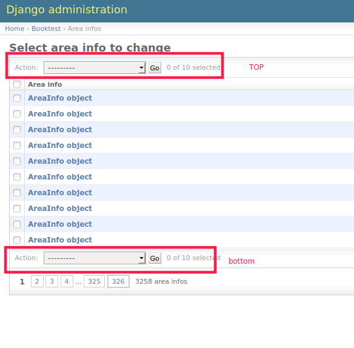

### 列表中的列

属性如下：

```
list_display=[模型字段1,模型字段2,...]
```

1）打开 booktest/admin.py 文件，修改 AreaAdmin 类如下：

```
class AreaAdmin(admin.ModelAdmin):
    ...
    list_display = ['id','atitle']
```

2）在浏览器中刷新效果如下图：

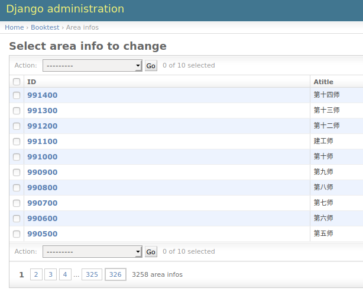

点击列头可以进行升序或降序排列。

### 将方法作为列

列可以是模型字段，还可以是模型方法，要求方法有返回值。

1）打开 `booktest/models.py` 文件，修改 AreaInfo 类如下：

```
class AreaInfo(models.Model):
    ...
    def title(self):
        return self.atitle
```

2）打开 `booktest/admin.py` 文件，修改 AreaAdmin 类如下：

```
class AreaAdmin(admin.ModelAdmin):
    ...
    list_display = ['id','atitle','title']
```

3）在浏览器中刷新效果如下图：

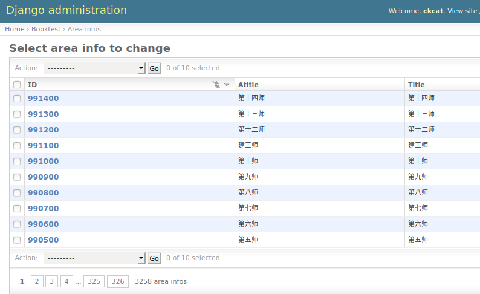

### 列标题

列标题默认为属性或方法的名称，可以通过属性设置。需要先将模型字段封装成方法，再对方法使用这个属性，模型字段不能直接使用这个属性。

```
short_description='列标题'
```

1）打开 `booktest/models.py` 文件，修改 AreaInfo 类如下：

```
class AreaInfo(models.Model):
    atitle = models.CharField(max_length=30)
    aParent = models.ForeignKey('self', null=True, blank=True)

    def title(self):
        return self.atitle
    title.short_description = '区域名称'
```

2）在浏览器中刷新效果如下图：

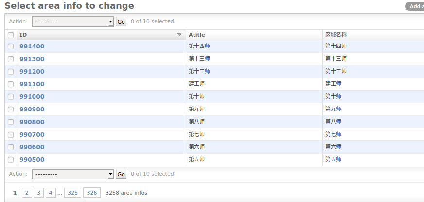

### 关联对象

无法直接访问关联对象的属性或方法，可以在模型类中封装方法，访问关联对象的成员。

1）打开 `booktest/models.py` 文件，修改 AreaInfo 类如下：

```
class AreaInfo(models.Model):
    ...
    def parent(self):
        if self.aParent is None:
          return ''
        return self.aParent.atitle
    parent.short_description='父级区域名称'
```

2）打开 booktest/admin.py 文件，修改 AreaAdmin 类如下：

```
class AreaAdmin(admin.ModelAdmin):
    ...
    list_display = ['id','atitle','title','parent']
```

3）在浏览器中刷新效果如下图：

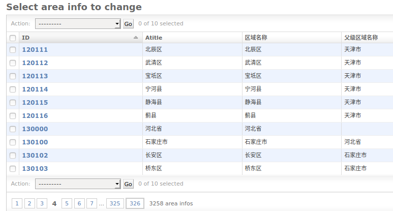

### 右侧栏过滤器

属性如下，只能接收字段，会将对应字段的值列出来，用于快速过滤。一般用于有重复值的字段。

```
list_filter=[]
```

1）打开 `booktest/admin.py` 文件，修改 AreaAdmin 类如下：

```
class AreaAdmin(admin.ModelAdmin):
    ...
    list_filter=['atitle']
```

2）在浏览器中刷新效果如下图：

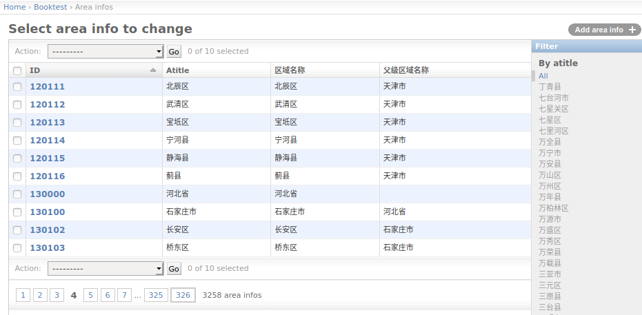

### 搜索框

属性如下，用于对指定字段的值进行搜索，支持模糊查询。列表类型，表示在这些字段上进行搜索。

```
search_fields=[]
```

1）打开 `booktest/admin.py` 文件，修改 AreaAdmin 类如下：

```
class AreaAdmin(admin.ModelAdmin):
    ...
    search_fields=['atitle']
```

2）在浏览器中刷新效果如下图：

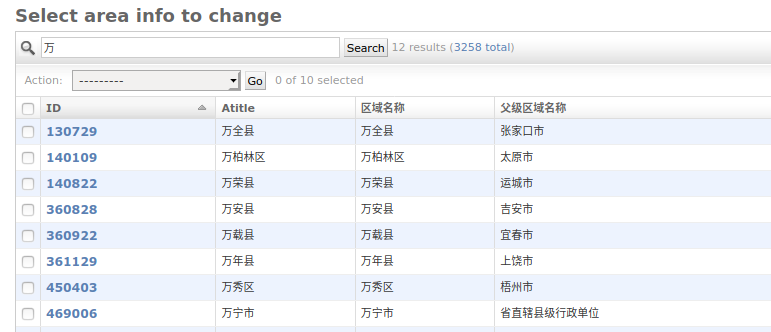

### 中文标题

1）打开 `booktest/models.py` 文件，修改模型类，为属性指定 `verbose_name` 参数，即第一个参数。

```
class AreaInfo(models.Model):
    atitle=models.CharField('标题',max_length=30)#名称
    ...
```

2）在浏览器中刷新效果如下图：

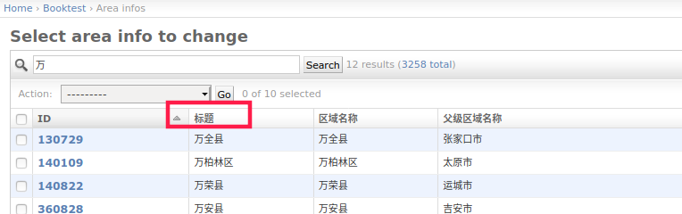

## 编辑页选项

### 显示字段顺序

属性如下：

```
fields=[]
```

1）点击某行 ID 的链接，可以转到修改页面，默认效果如下图：

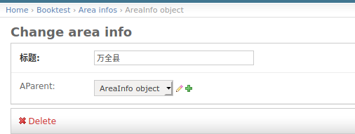

2）打开 `booktest/admin.py` 文件，修改 AreaAdmin 类如下：

```
class AreaAdmin(admin.ModelAdmin):
    ...
    fields=['aParent','atitle']
```

3）刷新浏览器效果如下图：

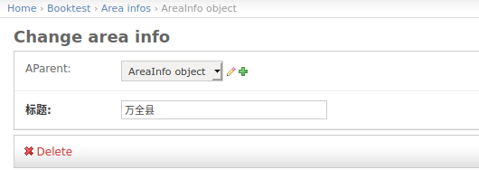

在下拉列表中输出的是对象的名称，可以在模型类中定义 `str` 方法用于对象转换字符串。

1）打开 `booktest/models.py` 文件，修改 AreaInfo 类，添加 str 方法。

```
class AreaInfo(models.Model):
    ...
    def __str__(self):
        return self.atitle
```

2）刷新浏览器效果如下图：

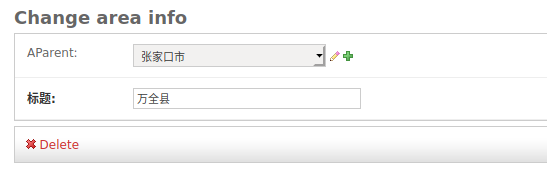

### 分组显示

属性如下：

```
fieldset=(
    ('组1标题',{'fields':('字段1','字段2')}),
    ('组2标题',{'fields':('字段3','字段4')}),
)
```

1）打开 `booktest/admin.py` 文件，修改 AreaAdmin 类如下：

```
class AreaAdmin(admin.ModelAdmin):
    ...
    # fields=['aParent','atitle']
    fieldsets = (
        ('基本', {'fields': ['atitle']}),
        ('高级', {'fields': ['aParent']})
    )
```

2）刷新浏览器效果如下图：

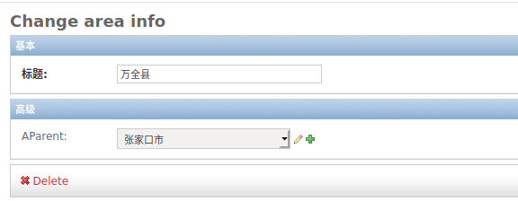

> 说明：fields 与 fieldsets 两者选一使用。

### 关联对象

在一对多的关系中，可以在一端的编辑页面中编辑多端的对象，嵌入多端对象的方式包括表格、块两种。

- 类型 InlineModelAdmin：表示在模型的编辑页面嵌入关联模型的编辑。
- 子类 TabularInline：以表格的形式嵌入。
- 子类 StackedInline：以块的形式嵌入。

1）打开 `booktest/admin.py` 文件，创建 AreaStackedInline 类。

```
class AreaStackedInline(admin.StackedInline):
    model = AreaInfo#关联子对象
    extra = 2#额外编辑2个子对象
```

2）打开 `booktest/admin.py` 文件，修改 AreaAdmin 类如下：

```
class AreaAdmin(admin.ModelAdmin):
    ...
    inlines = [AreaStackedInline]
```

3）刷新浏览器效果如下图：

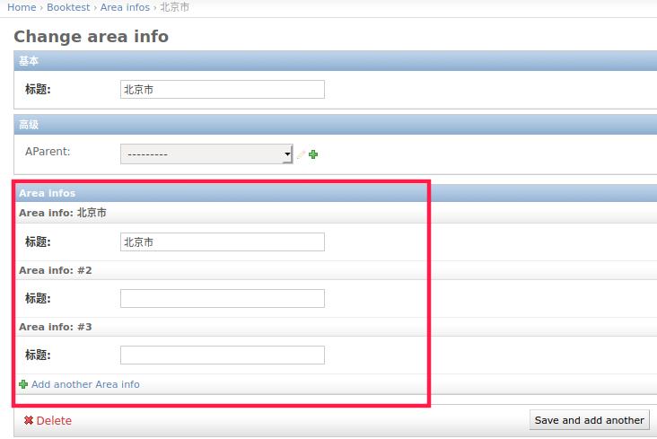

可以用表格的形式嵌入。

1）打开 `booktest/admin.py` 文件，创建 AreaTabularInline 类。

```
class AreaTabularInline(admin.TabularInline):
    model = AreaInfo#关联子对象
    extra = 2#额外编辑2个子对象
```

2）打开 booktest/admin.py 文件，修改 AreaAdmin 类如下：

```
class AreaAdmin(admin.ModelAdmin):
    ...
    inlines = [AreaTabularInline]
```

3）刷新浏览器效果如下图：

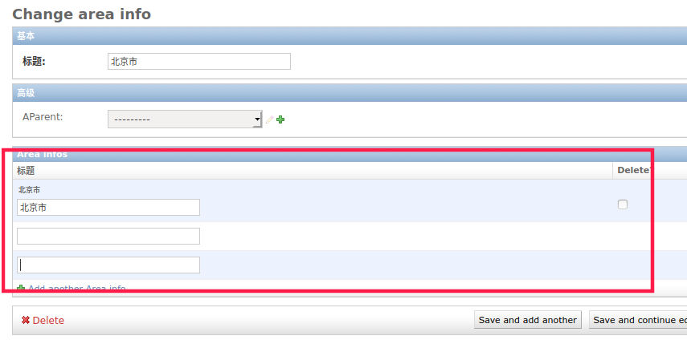

## 重写模板

1）在 templates 目录下创建 admin 目录，结构如下图：

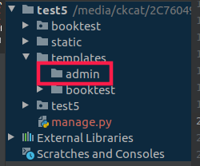

2）打开当前虚拟环境中 Django 的目录，再向下找到 admin 的模板，目录如下：

```
~/.virtualenvs/py_django/lib/python3.6/site-packages/django/contrib/admin/templates/admin
```

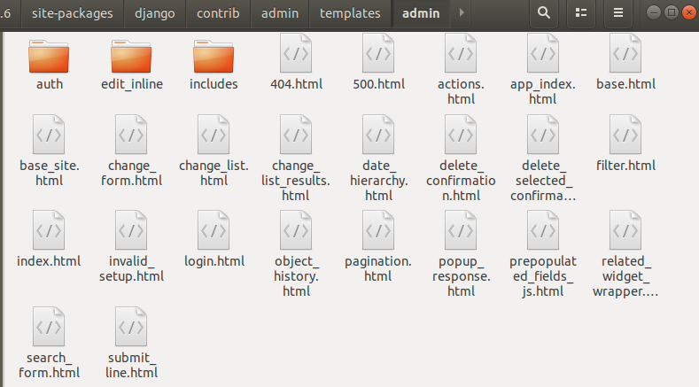

3）将需要更改文件拷贝到第一步建好的目录里，此处以 `base_site.html` 为例。

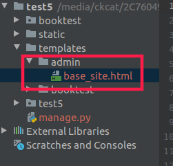

编辑 `base_site.html` 文件：

```


{{ title }} | {{ site_title|default:_('Django site admin') }}


<h1 id="site-name"><a href="">{{ site_header|default:_('Django administration') }}</a></h1>
    <hr>
    <h1>自定义的管理页模板</h1>
    <hr>



```

4）在浏览器中转到列表页面，刷新后如下图：

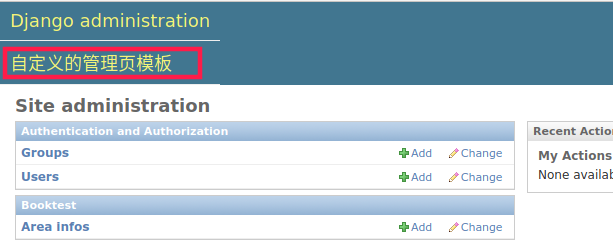

其它后台的模板可以按照相同的方式进行修改。

# 上传图片

## 创建包含图片的模型类

将模型类的属性定义成 `models.ImageField` 类型。

1）打开 `booktest/models.py` 文件，定义模型类 PicTest 。

```
class PicTest(models.Model):
    pic = models.ImageField(upload_to='booktest/')
```

2）回到命令行中，生成迁移。

```
python manage.py makemigrations
python manage.py migrate
```

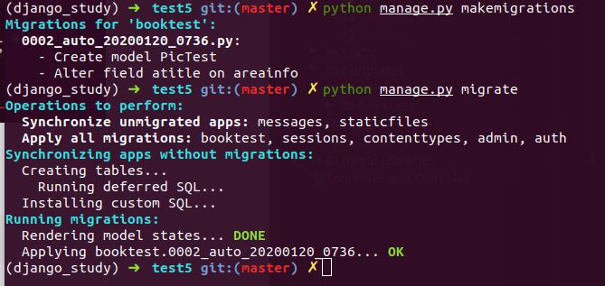

3）打开 `test5/settings.py` 文件，设置图片保存路径。

因为图片也属于静态文件，所以保存到 static 目录下。

```
MEDIA_ROOT=os.path.join(BASE_DIR,"static/media")
```

4）在 static 目录下创建 media 目录，再创建应用名称的目录，此例为 booktest 。

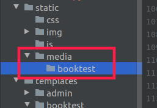

## 在管理页面 admin 中上传图片

1）打开 booktest/admin.py 文件，注册 PicTest。

```
from django.contrib import admin
from booktest.models import *

admin.site.register(PicTest)
```

2）运行服务器，输入如下网址。

```
http://127.0.0.1:8000/admin/
```

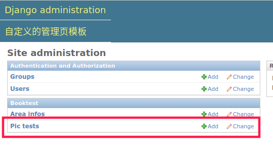

3）点击 Add 添加数据，打开新页面，选择图片，点击 save 按钮完成图片上传。

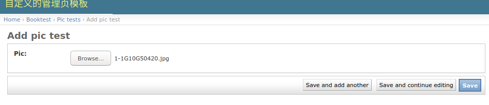

5）回到数据库命令行，查询表 pictest 中的数据如下图：

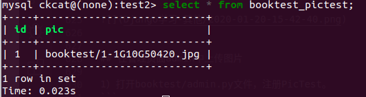

6）图片被保存到目录 `static/media/booktest/` 下，如下图：

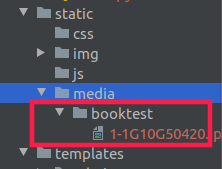

## 自定义 form 表单中上传图片

1）打开 `booktest/views.py` 文件，创建视图 pic_upload 。

```
def pic_upload(request):
    return render(request,'booktest/pic_upload.html')
```

2）打开 booktest/urls.py 文件，配置 url。

```
    url(r'^pic_upload/$', views.pic_upload),
```

3）在 `templates/booktest/` 目录下创建模板 `pic_upload.html` 。

```
<html>
<head>
    <title>自定义上传图片</title>
</head>
<body>
    <form method="post" action="/pic_handle/" enctype="multipart/form-data">
        
        <input type="file" name="pic"/><br>
        <input type="submit" value="上传">
    </form>
</body>
</html>
```

4）打开 `booktest/views.py` 文件，创建视图 pic_handle ，用于接收表单保存图片。

request 对象的 FILES 属性用于接收请求的文件，包括图片。

```
from django.conf import settings
from django.http import HttpResponse
...
def pic_handle(request):
    f1=request.FILES.get('pic')
    fname='%s/booktest/%s'%(settings.MEDIA_ROOT,f1.name)
    with open(fname,'wb') as pic:
        for c in f1.chunks():
            pic.write(c)
    return HttpResponse('OK')
```

5）打开 booktest/urls.py 文件，配置 url。

```
    url(r'^pic_handle/$', views.pic_handle),
```

6）运行服务器，在浏览器中输入如下网址：

```
http://127.0.0.1:8000/pic_upload/
```

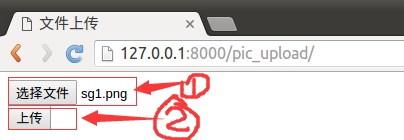

选择文件后点击按钮上传图片。

7）图片上传目录如下图：

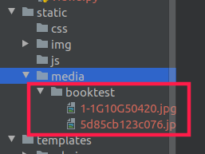

这里只是完成图片上传的代码，如果需要保存数据到表中需要创建 PicTest 对象完成保存。

## 显示图片

1）打开 `booktest/views.py` 文件，创建视图 pic_show 。

```
from booktest.models import PicTest
...
def pic_show(request):
    pic=PicTest.objects.get(pk=1)
    context={'pic':pic}
    return render(request,'booktest/pic_show.html',context)
```

2）打开 `booktest/urls.py` 文件，配置 url。

```
    url(r'^pic_show/$', views.pic_show),
```

3）在 `templates/booktest/` 目录下创建模板 `pic_show.html` 。

```
<!DOCTYPE html>
<html lang="en">
<head>
    <meta charset="UTF-8">
    <title>显示上传的图片</title>
</head>
<body>

</body>
</html>
```

4）运行服务器，在浏览器中输入如下网址：

```
http://127.0.0.1:8000/pic_show/
```

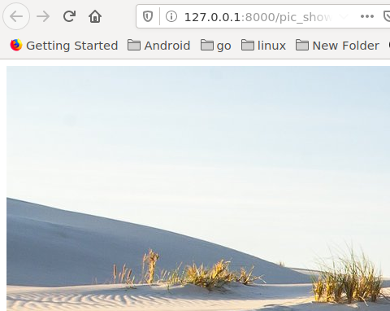

# 分页

Django 提供了数据分页的类，这些类被定义在 `django/core/paginator.py` 中。 类 Paginator 用于对列进行一页 n 条数据的分页运算。类 Page 用于表示第 m 页的数据。

**Paginator 类实例对象**

- 方法*init*(列表,int)：返回分页对象，第一个参数为列表数据，第二个参数为每页数据的条数。
- 属性 count：返回对象总数。
- 属性 num_pages：返回页面总数。
- 属性 page_range：返回页码列表，从 1 开始，例如[1, 2, 3, 4]。
- 方法 page(m)：返回 Page 类实例对象，表示第 m 页的数据，下标以 1 开始。

**Page 类实例对象**

- 调用 Paginator 对象的 page()方法返回 Page 对象，不需要手动构造。
- 属性 object_list：返回当前页对象的列表。
- 属性 number：返回当前是第几页，从 1 开始。
- 属性 paginator：当前页对应的 Paginator 对象。
- 方法 has_next()：如果有下一页返回 True。
- 方法 has_previous()：如果有上一页返回 True。
- 方法 len()：返回当前页面对象的个数。

## 示例

1）在 `booktest/views.py` 文件中创建视图 page_test。

```
from django.core.paginator import Paginator
from booktest.models import AreaInfo
...
#参数pIndex表示：当前要显示的页码
def page_test(request,pIndex):
    #查询所有的地区信息
    list1 = AreaInfo.objects.filter(aParent__isnull=True)
    #将地区信息按一页10条进行分页
    p = Paginator(list1, 10)
    #如果当前没有传递页码信息，则认为是第一页，这样写是为了请求第一页时可以不写页码
    if pIndex == '':
        pIndex = '1'
    #通过url匹配的参数都是字符串类型，转换成int类型
    pIndex = int(pIndex)
    #获取第pIndex页的数据
    list2 = p.page(pIndex)
    #获取所有的页码信息
    plist = p.page_range
    #将当前页码、当前页的数据、页码信息传递到模板中
    return render(request, 'booktest/page_test.html', {'list': list2, 'plist': plist, 'pIndex': pIndex})
```

2）在 `booktest/urls.py` 文件中配置 url。

```
    url(r'^page(?P<pIndex>[0-9]*)/$', views.page_test),
```

3）在 `templates/booktest/` 目录下创建 `page_test.html` 模板文件。

```
<html>
<head>
    <title>分页</title>
</head>
<body>
显示当前页的地区信息：<br>
<ul>

<li>{{area.id}}--{{area.atitle}}</li>

</ul>
<hr>
显示页码信息：当前页码没有链接，其它页码有链接<br>

    
        {{pindex}}&nbsp;&nbsp;
    
        <a href="/page{{pindex}}/">{{pindex}}</a>&nbsp;&nbsp;
    

</body>
</html>
```

4）运行服务器，在浏览器中输入如下网址，效果如下图：

```
http://127.0.0.1:8000/page/
```

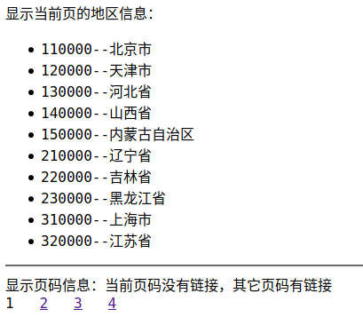

### 示例：省市区选择

1）将 jquery 文件拷贝到 `static/js/` 目录下。

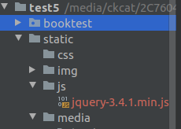

2）打开 `booktest/views.py` 文件，定义视图 area1 ，用于显示下拉列表。

```
#提供显示下拉列表的控件，供用户操作
def area1(request):
    return render(request,'booktest/area1.html')
```

3）打开 `booktest/urls.py` 文件，配置 url。

```
    url(r'^area1/$', views.area1),
```

4）在 `templates/booktest/` 目录下创建 `area1.html` 。

```
<html>
<head>
    <title>省市区列表</title>
    <script type="text/javascript" src="/static/js/jquery-1.12.4.min.js"></script>
    <script type="text/javascript">
        $(function(){
            //页面加载完成后获取省信息，并添加到省select
            $.get('/area2/',function(dic) {
                pro=$('#pro')
                $.each(dic.data,function(index,item){
                    pro.append('<option value='+item[0]+'>'+item[1]+'</option>');
                })
            });
            //为省select绑定change事件，获取市信息，并添加到市select
            $('#pro').change(function(){
                $.get('/area3_'+$(this).val()+'/',function(dic){
                    city=$('#city');
                    city.empty().append('<option value="">请选择市</option>');
                    dis=$('#dis');
                    dis.empty().append('<option value="">请选择区县</option>');
                    $.each(dic.data,function(index,item){
                        city.append('<option value='+item[0]+'>'+item[1]+'</option>');
                    })
                });
            });
            //为市select绑定change事件，获取区县信息，并添加到区县select
            $('#city').change(function(){
                $.get('/area3_'+$(this).val()+'/',function(dic){
                    dis=$('#dis');
                    dis.empty().append('<option value="">请选择区县</option>');
                    $.each(dic.data,function(index,item){
                        dis.append('<option value='+item[0]+'>'+item[1]+'</option>');
                    })
                })
            });

        });
    </script>
</head>
<body>
<select id="pro">
    <option value="">请选择省</option>
</select>
<select id="city">
    <option value="">请选择市</option>
</select>
<select id="dis">
    <option value="">请选择区县</option>
</select>
</body>
</html>
```

5）运行服务器，在浏览器中输入如下网址：

```
http://127.0.0.1:8000/area1/
```

浏览效果如下图：

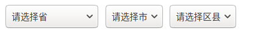

6）打开 `booktest/views.py` 文件，定义视图 area2 ，用于获取省信息。

```
from django.http import JsonResponse
...
#获取省信息
def area2(request):
    list = AreaInfo.objects.filter(aParent__isnull=True)
    list2 = []
    for item in list:
        list2.append([item.id, item.atitle])
    return JsonResponse({'data': list2})
```

7）打开 `booktest/urls.py` 文件，配置 url。

```
    url(r'^area2/$', views.area2),
```

8）在浏览器中输入如下网址。

```
http://127.0.0.1:8000/area2/
```

浏览效果如下图：

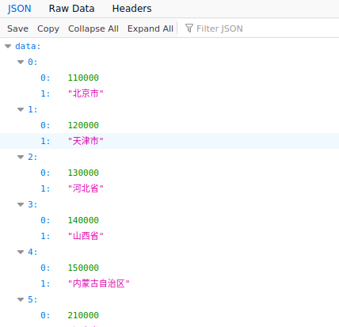

9）打开 `booktest/views.py` 文件，定义视图 area3，用于根据编号获取对应的子级信息，如果传递的是省编号则获取市信息，如果传递的是市编号则获取区县信息。

```
#根据pid查询子级区域信息
def area3(request, pid):
    list = AreaInfo.objects.filter(aParent_id=pid)
    list2 = []
    for item in list:
        list2.append([item.id, item.atitle])
    return JsonResponse({'data': list2})
```

10）打开 `booktest/urls.py` 文件，配置 url。

```
    url(r'^area3_(\d+)/$', views.area3),
```

11）在浏览器中输入如下网址：

```
http://127.0.0.1:8000/area3_140000/
```

浏览效果如下图：

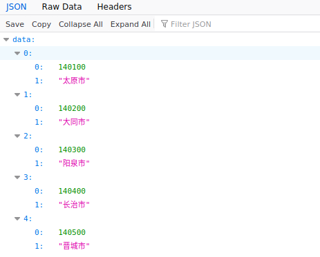

12）在浏览器中输入如下网址：

```
http://127.0.0.1:8000/area1/
```

选择效果如下图：


