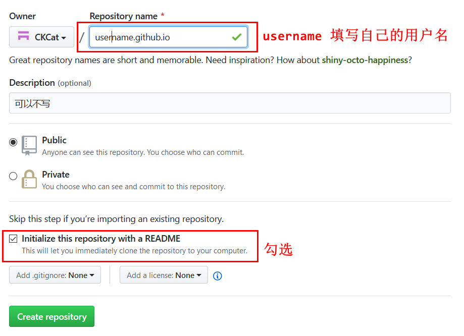
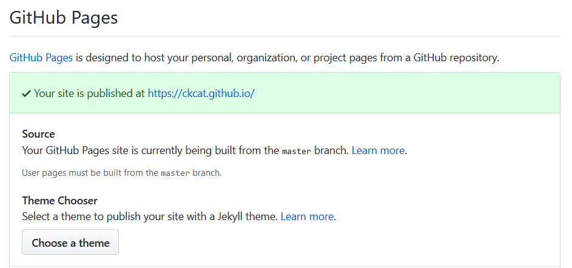

<!-- TOC -->

- [一、准备工作](#%E4%B8%80%E5%87%86%E5%A4%87%E5%B7%A5%E4%BD%9C)
- [二、申请github博客](#%E4%BA%8C%E7%94%B3%E8%AF%B7github%E5%8D%9A%E5%AE%A2)
    - [创建github仓库](#%E5%88%9B%E5%BB%BAgithub%E4%BB%93%E5%BA%93)
- [三、安装Hexo](#%E4%B8%89%E5%AE%89%E8%A3%85hexo)
    - [初始化](#%E5%88%9D%E5%A7%8B%E5%8C%96)
    - [新建文章](#%E6%96%B0%E5%BB%BA%E6%96%87%E7%AB%A0)
    - [开启服务](#%E5%BC%80%E5%90%AF%E6%9C%8D%E5%8A%A1)
- [四、配置Hexo与Github pages进行关联](#%E5%9B%9B%E9%85%8D%E7%BD%AEhexo%E4%B8%8Egithub-pages%E8%BF%9B%E8%A1%8C%E5%85%B3%E8%81%94)
    - [配置关联](#%E9%85%8D%E7%BD%AE%E5%85%B3%E8%81%94)
    - [发布](#%E5%8F%91%E5%B8%83)
- [五、更换NexT主题](#%E4%BA%94%E6%9B%B4%E6%8D%A2next%E4%B8%BB%E9%A2%98)
    - [下载主题](#%E4%B8%8B%E8%BD%BD%E4%B8%BB%E9%A2%98)
    - [设置主题](#%E8%AE%BE%E7%BD%AE%E4%B8%BB%E9%A2%98)
    - [配置主题](#%E9%85%8D%E7%BD%AE%E4%B8%BB%E9%A2%98)
        - [标签云页面](#%E6%A0%87%E7%AD%BE%E4%BA%91%E9%A1%B5%E9%9D%A2)
        - [分类页面](#%E5%88%86%E7%B1%BB%E9%A1%B5%E9%9D%A2)
        - [About页面](#about%E9%A1%B5%E9%9D%A2)
        - [腾讯公益404页面](#%E8%85%BE%E8%AE%AF%E5%85%AC%E7%9B%8A404%E9%A1%B5%E9%9D%A2)
        - [代码高亮主题](#%E4%BB%A3%E7%A0%81%E9%AB%98%E4%BA%AE%E4%B8%BB%E9%A2%98)
        - [站点建立时间](#%E7%AB%99%E7%82%B9%E5%BB%BA%E7%AB%8B%E6%97%B6%E9%97%B4)
        - [数学公式显示](#%E6%95%B0%E5%AD%A6%E5%85%AC%E5%BC%8F%E6%98%BE%E7%A4%BA)
        - [侧边栏社交链接](#%E4%BE%A7%E8%BE%B9%E6%A0%8F%E7%A4%BE%E4%BA%A4%E9%93%BE%E6%8E%A5)
        - [首页显示文章摘录](#%E9%A6%96%E9%A1%B5%E6%98%BE%E7%A4%BA%E6%96%87%E7%AB%A0%E6%91%98%E5%BD%95)
        - [设置 favicon](#%E8%AE%BE%E7%BD%AE-favicon)
        - [配置不蒜子计数](#%E9%85%8D%E7%BD%AE%E4%B8%8D%E8%92%9C%E5%AD%90%E8%AE%A1%E6%95%B0)
- [六、问题](#%E5%85%AD%E9%97%AE%E9%A2%98)
    - [hexo引用本地图片无法显示](#hexo%E5%BC%95%E7%94%A8%E6%9C%AC%E5%9C%B0%E5%9B%BE%E7%89%87%E6%97%A0%E6%B3%95%E6%98%BE%E7%A4%BA)
        - [插件安装与配置](#%E6%8F%92%E4%BB%B6%E5%AE%89%E8%A3%85%E4%B8%8E%E9%85%8D%E7%BD%AE)
- [hexo 升级](#hexo-%E5%8D%87%E7%BA%A7)
    - [升级](#%E5%8D%87%E7%BA%A7)
    - [调整配置](#%E8%B0%83%E6%95%B4%E9%85%8D%E7%BD%AE)
    - [NexT-8.x 跨版本升级](#next-8x-%E8%B7%A8%E7%89%88%E6%9C%AC%E5%8D%87%E7%BA%A7)
    - [设置摘要](#%E8%AE%BE%E7%BD%AE%E6%91%98%E8%A6%81)
    - [统计人数设置](#%E7%BB%9F%E8%AE%A1%E4%BA%BA%E6%95%B0%E8%AE%BE%E7%BD%AE)

<!-- /TOC -->

# 一、准备工作

* 安装[nodejs](https://nodejs.org/en/)
* 安装[git](https://git-scm.com/)
* 注册[github](https://github.com/)账号

# 二、申请github博客

## 1.创建github仓库
创建一个新的github仓库，仓库名为`username.github.io`,其他选项可以默认。



创建按仓库成功后，进入设置页面GitHub Pages 选项，出现如下界面则表示博客页面创建成功。



# 三、安装Hexo

```bash
$ npm install hexo-cli -g
```

## 1. 初始化
```bash
$ hexo  init blog
$ cd blog
$ npm install
```

## 2. 新建文章
```bash
$ hexo new "Hello-Hexo"
```
会在根目录下source/_posts/ 生成Hello-Hexo.md文件，使用markdown编辑器非常方便。

## 3. 开启服务
```bash
$ hexo server
```
会看到提示`INFO  Hexo is running at http://0.0.0.0:4000/. Press Ctrl+C to stop.` 代表博客已经正常运行，在浏览器打开`http://0.0.0.0:4000/` 即可预览博客的初始状态。

了解更多Hexo的信息和其他步骤请参考官网的[这篇文档](https://hexo.io/zh-cn/docs/setup.html) 。

# 四、配置Hexo与Github pages进行关联

## 1. 配置关联
进入`Blog`目录，然后以文本编辑器打开_config.yml文件，修改deploy配置如下，rego为CKCat.github.io.git仓库提交代码的git地址。
```yml
deploy:
  type: git
  repo: https://github.com/CKCat/CKCat.github.io.git
  branch: master
```
## 2. 发布
使用下面的命令进行发布：
```bash
hexo clean  # 清除缓存
hexo g      # 生成本地发布文件夹
hexo d      # 发布到github pages上
```
更多的hexo命令操作请参考[Hexo官方文档](https://hexo.io/zh-cn/docs/commands.html)即可。

# 五、更换NexT主题

## 1. 下载主题
在Blog目录运行下列命令：
```bash
$ git clone https://github.com/iissnan/hexo-theme-next themes/next
```

## 2. 设置主题
克隆完成以后打开站点配置 `_config.yml`，找到theme字段，值改为`next`。
运行`hexo server --debug`，访问`http://0.0.0.0:4000/` 查看主题是否生效。

## 3. 配置主题
常用的配置可以直接按照主题的官方[参考手册](http://theme-next.iissnan.com/)配置。
下面介绍一下常用配置：
### 1. 标签云页面

1. 新建一个页面，命名为tags。命令如下：
    ```bash
    $ hexo new page "tags"
    ```

2. 编辑刚新建的页面，将页面的类型设置为tags，主题将自动为这个页面显示标签云。页面内容如下：
    ```bash
    ---

    title: 标签
    date: 2019-11-01 11:46:23
    type: "tags"
    ---
    ```
    注意：如果有启用多说 或者 Disqus 评论，默认页面也会带有评论。需要关闭的话，请添加字段 comments 并将值设置为 false，如：
    ```bash
    title: 标签
    date: 2019-11-01 11:46:23
    type: "tags"
    comments: false
    ---
    ```

3. 在菜单中添加链接。编辑 **主题配置文件** ，添加tags到 menu中，如下:
    ```bash
    menu: 
    home: / 
    archives: /archives 
    tags: /tags
    ```

### 2. 分类页面

1. 新建一个页面，命名为categories。命令如下：
    ```bash
    $ hexo new page categories
    ```

2. 编辑刚新建的页面，将页面的类型设置为categories，主题将自动为这个页面显示所有分类。
    ```bash
    ---
    title: 分类
    date: 2019-11-01 12:03:27
    type: "categories"
    ---
    ```

    注意：如果有启用多说 或者 Disqus 评论，默认页面也会带有评论。需要关闭的话，请添加字段comments并将值设置为false，如：

    ```bash
    ---
    title: 分类
    date: 2019-11-01 12:03:27
    type: "categories"
    comments: false
    ---
    ```

3. 在菜单中添加链接。编辑 **主题配置文件** ，将menu中的categories: /categories注释去掉，如下:
    ```
    menu: 
    home: / 
    categories: /categories 
    archives: /archives 
    tags: /tags
    ```

### 3. About页面

1. 新建一个 about页面：
    ```bash
    $ hexo new page "about"
    ```
2. 菜单显示about链接，在 **主题配置文件** 设置中将menu中about
前面的注释去掉即可。
    ```
    menu: 
    home: / 
    archives: /archives 
    tags: /tags 
    about: /about
    ```

3. 友情链接编辑 **站点配置文件** 添加：
    ```
    # title, chinese available
    links_title: Links
    # links
    links: 
    MacTalk: http://macshuo.com/
    ```

### 4. 腾讯公益404页面

简体中文增加腾讯公益404页面，寻找丢失儿童，让大家一起关注此项公益事业！效果如下http://www.ixirong.com/404.html

使用方法，新建 404.html 页面，放到主题的source目录下，内容如下：
```html
<!DOCTYPE HTML><html><head>
 <meta http-equiv="content-type" content="text/html;charset=utf-8;"/>
 <meta http-equiv="X-UA-Compatible" content="IE=edge,chrome=1" />
 <meta name="robots" content="all" />
 <meta name="robots" content="index,follow"/>
</head>
<body>

<script type="text/javascript" src="http://www.qq.com/404/search_children.js" charset="utf-8" homePageUrl="your site url " homePageName="回到我的主页"></script>
</body>
</html>
```

### 5. 代码高亮主题

NexT 使用 [Tomorrow Theme0](https://github.com/chriskempson/tomorrow-theme) 作为代码高亮，共有5款主题供你选择。
默认使用的是白色的 normal。

### 6. 站点建立时间

这个时间将在站点的底部显示，例如`© 2013 - 2019`编辑 **站点配置文件**，新增字段since。
```
since: 2013
```

### 7. 数学公式显示

NexT 借助于 MathJax 来显示数学公式，此选项默认关闭。
编辑 **主题配置文件**，将mathjax设定为true即可。
```
# MathJax Support
mathjax: true
```
ProTip: [使用七牛 CDN 来加速 MathJax 脚本的加载](https://github.com/iissnan/hexo-theme-next/pull/363)

### 8. 侧边栏社交链接

编辑 **站点配置文件** ，新增字段social，然后添加社交站点名称与地址即可。例如：
```
#Social linkssocial: 
  github: https://github.com/your-user-name 
  twitter: https://twitter.com/your-user-name 
  weibo: http://weibo.com/your-user-name 
  douban: http://douban.com/people/your-user-name 
  zhihu: http://www.zhihu.com/people/your-user-name 
  # 等等
```

### 9. 首页显示文章摘录
NexT 支持三种方式来控制首页文章的显示方式。若需要在首页显示摘录，可以通过以下方法：

在文章中使用`<!-- more -->`手动进行截断
在文章的 [front-matter](https://hexo.io/docs/front-matter.html) 中添加description，并提供文章摘录
自动形成摘要，在 主题配置文件 中添加：
```
auto_excerpt: 
enable: true 
length: 150
```
默认截取的长度为150字符，可以根据需要自行设定。

### 10. 设置 favicon

将`favicon`放置到站点的 `source`目录下即可。


### 11. 配置不蒜子计数
1. 安装脚本（必选）
要使用不蒜子必须在页面中引入busuanzi.js，代码如下：
```
<script async src="//busuanzi.ibruce.info/busuanzi/2.3/busuanzi.pure.mini.js"></script>
```

本人使用的是next主题，所以在themes/next/layout/_partial/footer.swig中添加上述脚本，也可以把脚本添加在header中，如果使用的是其他主题，大致也是一样的，不过可能后缀是ejs，没有影响。

2. 配置方式使用不蒜子计数
第一种引入脚本的方法适用于任何类型的个人站点，如果你使用的主题是NexT，那么你可以很方便的进行不蒜子的访客统计设置，仅仅只需要一步：

打开主题的配置文件`/theme/next/_config.yml`，配置如下：
```
# Show PV/UV of the website/page with busuanzi.
# Get more information on http://ibruce.info/2015/04/04/busuanzi/
busuanzi_count:
  # count values only if the other configs are false
  enable: true
  # custom uv span for the whole site
  site_uv: true
  site_uv_header: <i class="fa fa-user"></i> 访客数
  site_uv_footer: 人
  # custom pv span for the whole site
  site_pv: true
  site_pv_header: <i class="fa fa-eye"></i> 总访问量
  site_pv_footer: 次
  # custom pv span for one page only
  page_pv: true
  page_pv_header: <i class="fa fa-file-o"></i>
  page_pv_footer: 次
```
> site_uv表示是否显示整个网站的UV数
> 
> site_pv表示是否显示整个网站的PV数
> 
> page_pv表示是否显示每个页面的PV数


# 六、问题

## 1.hexo引用本地图片无法显示
### 插件安装与配置
首先我们需要安装一个图片路径转换的插件，这个插件名字是hexo-asset-image
```bash
$ npm install https://github.com/CodeFalling/hexo-asset-image --save
```
但是这个插件的内容需要修改【不然可能会出Bug】

打开`/node_modules/hexo-asset-image/index.js`，将内容更换为下面的代码
```javascript
'use strict';
var cheerio = require('cheerio');

// http://stackoverflow.com/questions/14480345/how-to-get-the-nth-occurrence-in-a-string
function getPosition(str, m, i) {
  return str.split(m, i).join(m).length;
}

var version = String(hexo.version).split('.');
hexo.extend.filter.register('after_post_render', function(data){
  var config = hexo.config;
  if(config.post_asset_folder){
    	var link = data.permalink;
	if(version.length > 0 && Number(version[0]) == 3)
	   var beginPos = getPosition(link, '/', 1) + 1;
	else
	   var beginPos = getPosition(link, '/', 3) + 1;
	// In hexo 3.1.1, the permalink of "about" page is like ".../about/index.html".
	var endPos = link.lastIndexOf('/') + 1;
    link = link.substring(beginPos, endPos);

    var toprocess = ['excerpt', 'more', 'content'];
    for(var i = 0; i < toprocess.length; i++){
      var key = toprocess[i];
 
      var $ = cheerio.load(data[key], {
        ignoreWhitespace: false,
        xmlMode: false,
        lowerCaseTags: false,
        decodeEntities: false
      });

      $('img').each(function(){
		if ($(this).attr('src')){
			// For windows style path, we replace '\' to '/'.
			var src = $(this).attr('src').replace('\\', '/');
			if(!/http[s]*.*|\/\/.*/.test(src) &&
			   !/^\s*\//.test(src)) {
			  // For "about" page, the first part of "src" can't be removed.
			  // In addition, to support multi-level local directory.
			  var linkArray = link.split('/').filter(function(elem){
				return elem != '';
			  });
			  var srcArray = src.split('/').filter(function(elem){
				return elem != '' && elem != '.';
			  });
			  if(srcArray.length > 1)
				srcArray.shift();
			  src = srcArray.join('/');
			  $(this).attr('src', config.root + link + src);
			  console.info&&console.info("update link as:-->"+config.root + link + src);
			}
		}else{
			console.info&&console.info("no src attr, skipped...");
			console.info&&console.info($(this));
		}
      });
      data[key] = $.html();
    }
  }
});
```

打开_config.yml文件，修改下述内容
```
# URL
## If your site is put in a subdirectory, set url as 'http://yoursite.com/child' and root as '/child/'
url: https://ckcat.github.io
root: /
permalink: :year/:month/:day/:title/
permalink_defaults:
pretty_urls:
  trailing_index: true # Set to false to remove trailing index.html from permalinks


post_asset_folder: true
```
参考[hexo引用本地图片无法显示](https://850552586.github.io/2018/11/15/hexo%E5%BC%95%E7%94%A8%E6%9C%AC%E5%9C%B0%E5%9B%BE%E7%89%87%E6%97%A0%E6%B3%95%E6%98%BE%E7%A4%BA/)


# hexo 升级 
由于最近安装了 NodeJS 14 导致无法使用旧版的 hexo，所以进行了一次升级，记录一下。

## 升级
Hexo 升级需要使用 `npm-check`、`npm-upgrade`、`npm-update` 按以下顺序逐步执行完成后，Hexo 版本及系统插件均会升级到最新。
```bash
//以下指令均在Hexo目录下操作，先定位到Hexo目录
//查看当前版本，判断是否需要升级
> hexo version

//全局升级hexo-cli
> npm i hexo-cli -g

//再次查看版本，看hexo-cli是否升级成功
> hexo version

//安装npm-check，若已安装可以跳过
> npm install -g npm-check

//检查系统插件是否需要升级
> npm-check

//安装npm-upgrade，若已安装可以跳过
> npm install -g npm-upgrade

//更新package.json
> npm-upgrade

//更新全局插件
> npm update -g

//更新系统插件
> npm update --save

//再次查看版本，判断是否升级成功
> hexo version
```

## 调整配置
升级后别急着 `hexo g`，需要先调整站点配置文件 `hexo/_config.yml`，否则会报错。

以下是废弃的字段，需要重新配置
```bash
# Deprecated
external_link: true|false
# New option
external_link:
  enable: true # Open external links in new tab
  field: site # Apply to the whole site
  exclude: ''

# Deprecated
use_date_for_updated: true
# New option
## pdated_option supports 'mtime', 'date', 'empty'
updated_option: 'mtime'
```
其他字段可以看官方文档，我这里不关心就不设置了。

## NexT-8.x 跨版本升级
升级完 hexo 为 5.4 以后， next 主题也需要进行升级。

通过 npm 方式安装新版：
```bash
//定位到hexo目录,npm安装主题
> npm install hexo-theme-next
```
将 Next 主题配置文件 `node_modules/hexo-theme-next/_config.yml` 改名为 `_config.next.yml`, 复制到根目录（与 Hexo 站点配置文件`_config.yml` 在同一目录），这个文件的作用等同于旧版 `next.yml`，但优先级最高。这样做的好处是以后可以通过 npm 顺滑升级 Next 版本，不用担心配置文件被覆盖。相关字段的解释可以通过[官方文档](https://theme-next.js.org/docs/getting-started/)查看，我这里主要说一下摘要设置和统计人数设置。

> 参考：https://www.imczw.com/post/tech/hexo5-next8-updated.html
## 设置摘要
官方给的方法：
1. 使用 `<!-- more -->` 插入你想设置摘要的文本位置之后，这个方法也是官方推荐的。
1. 在文件头设置 `description` 字段,内容即为摘要。

这两种方法都比较麻烦，我这里使用了第三方插件设置摘要。直接安装插件：
```bash
npm install hexo-excerpt --save
```
在 Hexo 站点配置文件`_config.yml` 添加下列字段
```bash
excerpt:
  depth: 10 
  excerpt_excludes: []
  more_excludes: []
  hideWholePostExcerpts: true
```

> 参考：https://github.com/chekun/hexo-excerpt

## 统计人数设置

统计人数可以直接通过设置 `_config.next.yml` 配置文件，将 `enable` 对应的值改为 `true` 即可。
```Bash
# Show Views / Visitors of the website / page with busuanzi.
# For more information: http://ibruce.info/2015/04/04/busuanzi/
busuanzi_count:
  enable: true
  total_visitors: true
  total_visitors_icon: fa fa-user
  total_views: true
  total_views_icon: fa fa-eye
  post_views: true
  post_views_icon: far fa-eye
```