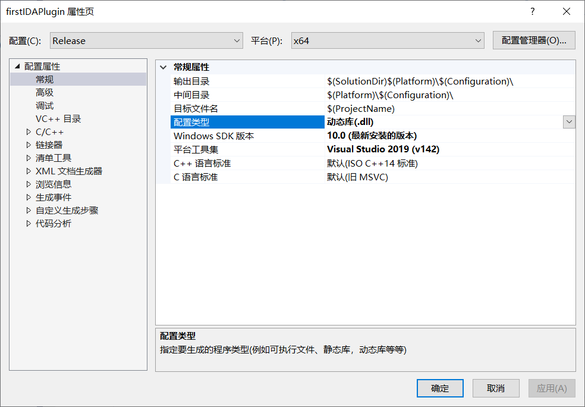
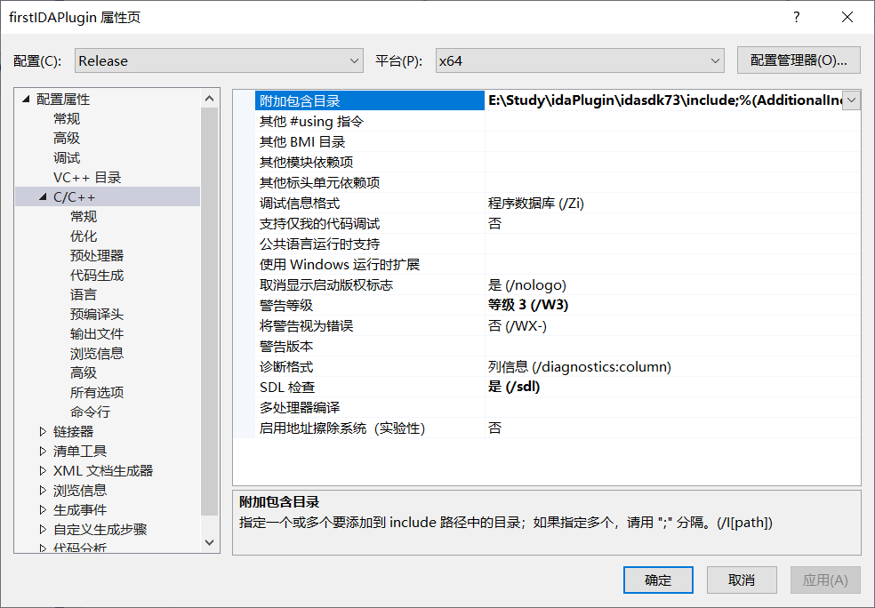
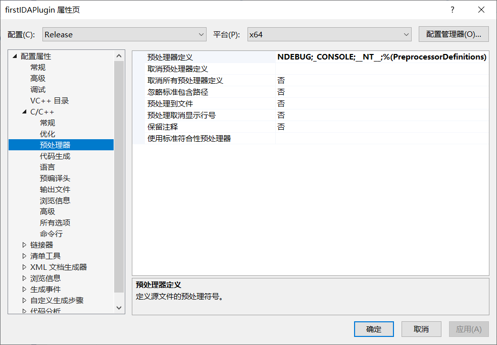
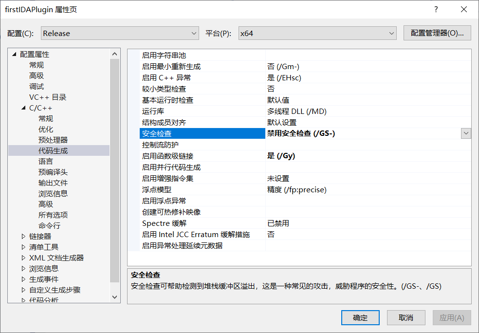
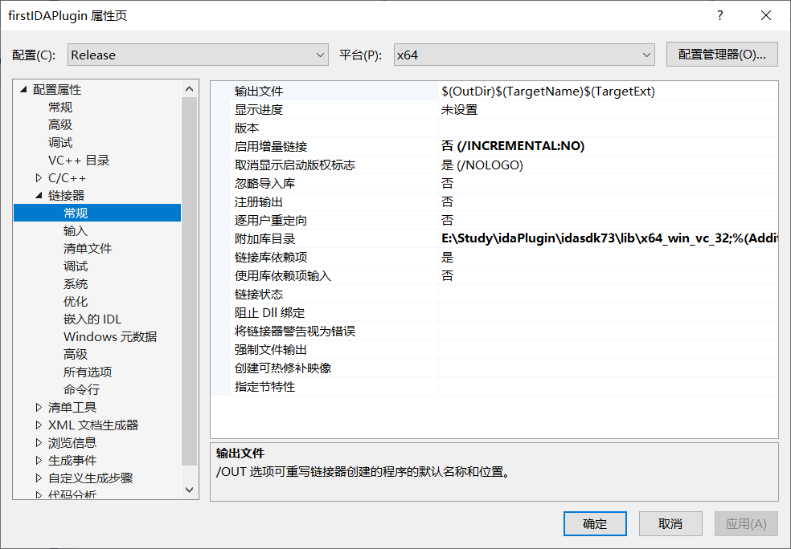
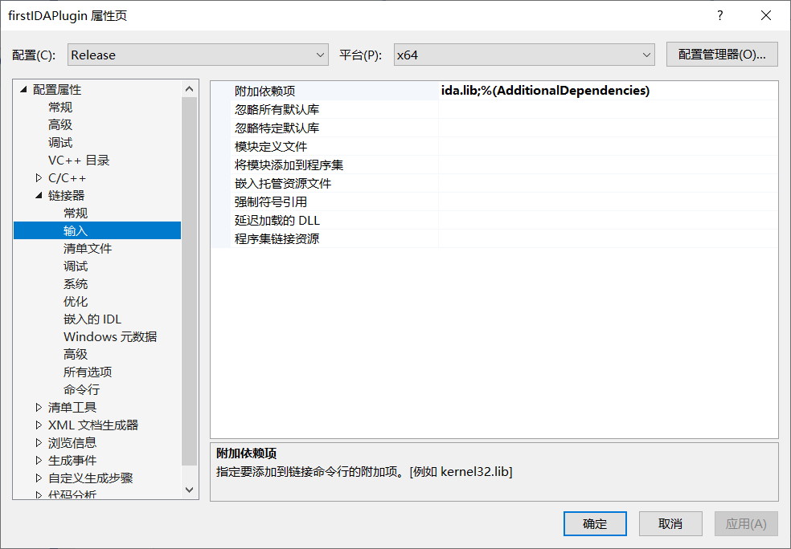
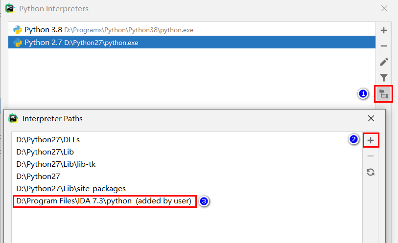

> 环境：vs2019,ida7.3

# 使用 VS 配置 IDA C++ 插件环境

1. 使用 VS2019 新建一个 C++ 空工程，添加 C++ 文件 `myplugin.cpp` , 添加如下代码：
```cpp
#include <ida.hpp>
#include <idp.hpp>
#include <loader.hpp>
#include <kernwin.hpp>

//以上是导入的SDK头文件

int idaapi init(void)
{
	//IDA在启动的时候会调用每个插件的init函数。
	//返回值有三种选项:
	//PLUGIN_SKIP适合那些不支持的插件，IDA将不会加载该插件
	//PLUGIN_OK适合那些执行一次性功能的插件
	//PLUGIN_KEEP适合那些需要一直保持功能的插件
	return PLUGIN_OK;
}

void idaapi term(void)
{
	//当结束插件时，一般您可以在此添加一点任务清理的代码。
	return;
}

bool idaapi run(size_t)
{
	//当按下热键时候,执行功能的入口函数
	warning("Hello, world!");
	return true;
}

static char comment[] = "It's a plugin to show Hello world!";

plugin_t PLUGIN =
{
  IDP_INTERFACE_VERSION,
  0,                    // 插件的一些属性,一般为0即可
  init,                 // initialize
  term,                 // terminate. this pointer may be NULL.
  run,                  // invoke plugin
  comment,              // 插件的说明,会显示在IDA下方的状态栏中
  "",                   // multiline help about the plugin
  "Hello, world",		// 插件在列表中显示的名称
  "Alt-F1"              // 插件想要注册的功能快捷键
};
```
2. 进入项目属性选项，进行如下配置

配置属性 -> 常规 -> 配置类型： 选中 **动态库(.dll)。**



C/C++ -> 常规 -> 附加包含目录：添加 IDASDK include 目录。



C/C++ -> 常规 -> 预处理器：添加 `__NT__`



C/C++ -> 代码生成 -> 安全检查：修改为 **禁用安全检查(/GS-)**



链接器 -> 常规 ->  附加包含目录：
- 针对 `ida.exe` ，则添加 `idasdk\lib\x64_win_vc_32`。
- 针对 `ida64.exe` ，则添加 `idasdk\lib\x64_win_vc_64` 。



链接器 -> 输入 -> 附加依赖项：添加 `ida.lib` 。



通过以上配置就完成了 IDA 插件环境配置。

# 使用 CMAKE 配置 IDA C++ 插件环境

直接使用 [ida-cmake](https://github.com/Jinmo/ida-cmake) 项目, 不过不同的编译环境需要修改相应的 gen 代码。下面为我修改适配 vs2109 的代码：
```python
def get_cmake_gen(target_version, custom_gen):
    if custom_gen:
        return custom_gen.strip()
    if os.name == 'posix':
        return 'Unix Makefiles'
    elif os.name == 'nt':
        gen = 'Visual Studio ' + (
            '10' if target_version[0] <= 6 and target_version[1] <= 8 else '16'
        )
        return (gen + ' 2019') if target_version >= (7, 0) else gen
    else:
        assert False
```

# 使用 python 编写 IDA 插件

vscode 使用相应的插件 [idacode](https://github.com/ioncodes/idacode)

pycharm 导入对应的文件夹既可高亮提示，如下图所示如何导入：




```python
class UnknowClass(idaapi.plugin_t):
    '''
        给插件接口,实例的类定义
    '''
    flags = idaapi.PLUGIN_KEEP  # 插件的状态, 当前状态保持在Plugin菜单中
    comment = "XXX"             # 描述信息

    help = ""                   # 帮助信息
    wanted_name = "XXX"         # 菜单中显示的名字
    #wanted_hotkey = "Ctrl+Alt+Shift+F12"   # 希望注册的快捷键
    wanted_hotkey = ""

    #_PREFIX_NAME = 'carveSelectedBytes'
    #_MIN_MAX_MATH_OPS_TO_ALLOW_RENAME = 11
    
    def __init__(self):
        '''
	        初始化工作
            构造基类,一般没什么实质操作, 
            记得给Super第一个参数更正为 当前类的名称
        '''
        super(UnknowClass, self).__init__()
        self._data = None

    def term(self):
        '''
            Destory函数, 同析构函数, 留待释放资源
        '''
        pass
        
    def init(self):
        '''
            进行初始化操作,可在此输出一些描述信息
        '''
        self.view = None
        # self._cfg = None
        # print("=" * 80)
        # print("carveSelectedBytes")
        # print(u"保存所选的 HexData 到文件")
        # print("=" * 80)
        

        return idaapi.PLUGIN_OK
        
    def run(self, arg):
        '''
            每次运行插件时, 执行的具体操作
            功能代码在此编写
        '''
        pass

def PLUGIN_ENTRY():
    '''
        插件入口,用于实例对象
        返回的就是插件的功能等
    '''
    return carveSelectedBytes()
```