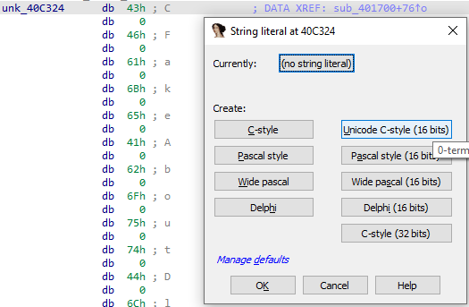
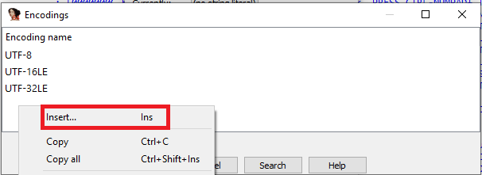

# 快捷键

可以使用 IDA 菜单栏 `Options > Shortcuts` 来查看、修改、添加快捷键。 

## 文本输入框
使用 `Ctrl+Enter` 进行确认，使用 `ESC` 取消，使用 `F1` 查看帮助。使用所有的文本输入框，如注释、编辑本地类型等。


## 快速菜单导航
使用 `Alt` 键，可以在菜单项下看到下划线，同时按住带下划线的字母可以打开该菜单。可以通过 `cfg/idagui.cfg` 文件修改相应的加速键。


## 对话框

`Tab` 键切换对话框上多个控件的焦点，使用 `Space` 键选中焦点对应的控件，也可以使用 `Alt` 键显示相关的加速键。

例如：快速退出 IDA 并丢弃自打开的数据库以来的所有修改，可以使用下列快捷键。
- `Alt + F4` 退出IDA，将会显示保存数据库的对话框。
- `D` 选择 `DON’T SAVE the database` 复选框。
- `Enter` 或者 `Alt + K` 确认。


## 命令面板

使用 Ctrl + Shift + P 可以打开命令面板，可以在底部输入文本过滤相关操作。


## 选择

按住 `Shift` 使用 光标导航键 `← ↑ → ↓` 。

`Alt + L` 选择开始，然后导航到需要选择的末尾，执行相应的操作，最后 `Alt + L` 结束选择。


## 代码分析

`Ctrl + PgUp` 转到数据库开头。

`Ctrl + PgDn` 转到数据库开头。

选中按 `C` 将选中的数据转为代码。

选中按 `T` 转换为结构体偏移。

选中按 `A` 将选中的数据转为代码。

## 高亮导航

`Alt + Up` 或 `Alt + Down` 实现选中的高亮字符串之间前后跳转。

**IDA 7.5 新增功能**

`Shift + Alt + Up` 查找定义（写入）所选寄存器的先前位置。
`Shift + Alt + Down` 查找使用所选寄存器的下一个位置。


**IDA 7.2 新增功能**

`Ctrl + Shift + Up` / `Ctrl + Shift + Down` 跳至上一个/下一个函数的开头。

# IDA 命令行

## 打开文件
```
ida <filename>
```
`<filename>` 可以是您要反汇编的新文件或现有数据库。这种用法基本上与使用“文件”->“打开”或将文件拖放到IDA的图标上相同。您仍然需要手动确认“加载文件”对话框中的选项或IDA显示的任何其他提示，但是会跳过初始启动屏幕。

### 自动选择Loader
```
ida -T<prefix> <filename>
```
其中 `<prefix>` 是“加载文件”对话框中显示的加载器描述的唯一前缀。相关选项如下：
```
-TMicrosoft       Microsoft.Net程序集
-TPortable        适用于AMD64（PE）的可移植可执行文件
-TMS              MS-DOS可执行文件（EXE）
-TBinary          二进制文件
```

当 `<prefix>` 包含空格时，使用引号将  `<prefix>` 包起来。For example, to load the first slice from a fat Mach-O file:
```
ida "-TFat Mach-O File, 1" file.macho
```

如果是 ZIP 格式的归档文件，则可以指定要在冒号后装入的归档成员。要从 apk 中加载主dex文件:
```
ida -TZIP:classes.dex:Android file.apk
```

但是，通常最好在顶层选择APK加载程序
```
ida -TAPK file.apk
```

当-T指定时，将跳过初始加载对话框，并且IDA会直接使用指定的加载器直接加载文件。

### 使用默认模式打开文件
```
ida -A <filename>
```
这将使用自主模式或批处理模式加载文件，其中IDA将不显示任何对话框，但在所有情况下均接受默认答案。

> 在此模式下，加载完成后将不会显示任何交互式对话框。要恢复交互性，请 `batch(0)` 在 IDA 窗口底部的 IDC 或 Python 控制台中执行语句。

### 批量反汇编
```
ida -B <filename>
```
IDA 将使用所有默认选项加载文件，等待自动分析结束，将反汇编输出到 `<filename>.asm` 并在保存数据库后退出。

### 二进制文件选项
```
ida -p<processor> -B<base> <filename>
```
- `<processor>` 是IDA支持的处理器类型之一。
- `<base>` 是加载基址(16进制)。

例如，要在线性地址 `0xBFC00000` 上加载大端 `MIPS` 固件：
```
ida -pmipsb -bBFC0000 firmware.bin
```

映射到 `0x4000` 的 `Cortex-M3` 固件：
```
ida -parm:ARMv7-M -b400 firmware.bin
```

### 打印log
```
ida -B -Lida_batch.log <filename>
```
打开 log 输出信息。

## 批量反编译
反编译整个文件：
```
ida -Ohexrays:outfile.c:ALL -A <filename>
```

反编译 main 函数
```
ida -Ohexrays:outfile.c:main -A <filename>
```
### 定制批量反编译
Python脚本可与该 `-S` 开关一起使用，以在文件加载后自动运行
```
ida -A -Sdecompile_entry_points.py -Llogfile.txt <filename>
```

```python
from __future__ import print_function

#
# This example tries to load a decompiler plugin corresponding to the current
# architecture (and address size) right after auto-analysis is performed,
# and then tries to decompile the function at the first entrypoint.
#
# It is particularly suited for use with the '-S' flag, for example:
# idat -Ldecompile.log -Sdecompile_entry_points.py -c file
# filename: Sdecompile_entry_points.py

import ida_ida
import ida_auto
import ida_loader
import ida_hexrays
import ida_idp
import ida_entry

# becsause the -S script runs very early, we need to load the decompiler
# manually if we want to use it
def init_hexrays():
    ALL_DECOMPILERS = {
        ida_idp.PLFM_386: "hexrays",
        ida_idp.PLFM_ARM: "hexarm",
        ida_idp.PLFM_PPC: "hexppc",
        ida_idp.PLFM_MIPS: "hexmips",
    }
    cpu = ida_idp.ph.id
    decompiler = ALL_DECOMPILERS.get(cpu, None)
    if not decompiler:
        print("No known decompilers for architecture with ID: %d" % ida_idp.ph.id)
        return False
    if ida_ida.inf_is_64bit():
        if cpu == ida_idp.PLFM_386:
            decompiler = "hexx64"
        else:
            decompiler += "64"
    if ida_loader.load_plugin(decompiler) and ida_hexrays.init_hexrays_plugin():
        return True
    else:
        print('Couldn\'t load or initialize decompiler: "%s"' % decompiler)
        return False


def decompile_func(ea, outfile):
    print("Decompiling at: %X..." % ea)
    cf = ida_hexrays.decompile(ea)
    if cf:
        print("OK.")
        outfile.write(str(cf) + "\n")
    else:
        print("failed!")
        outfile.write("decompilation failure at %X!\n" % ea)


def main():
    print("Waiting for autoanalysis...")
    ida_auto.auto_wait()
    if init_hexrays():
        eqty = ida_entry.get_entry_qty()
        if eqty:
            idbpath = idc.get_idb_path()
            cpath = idbpath[:-4] + ".c"
            with open(cpath, "w") as outfile:
                print("writing results to '%s'..." % cpath)
                for i in range(eqty):
                    ea = ida_entry.get_entry(ida_entry.get_entry_ordinal(i))
                    decompile_func(ea, outfile)
        else:
            print("No known entrypoint. Cannot decompile.")
    if idaapi.cvar.batch:
        print("All done, exiting.")
        ida_pro.qexit(0)


main()

```
### 加快批处理速度
```
TVHEADLESS=1 idat -A -Smyscript.idc file.bin >/dev/null &
```
idat使用轻量级文本模式UI的文本模式可执行文件，不需要初始化初始化所有依赖的UI库，可以使用命令行参数在后台运行。

# 重新分析
## 重新分析指令
将鼠标放在需要重新分析的指令上，然后按 `C` 键转换为代码。

## 重新分析函数
使用 Alt + P 键编辑函数。

## 选中范围分析
按 Alt + L 选中开始，转到选择的结尾，按 `C` 键转换为代码。

## 重新分析整个数据库

1. Menu Options >  General…, Analysis Tab, Reanalyze program button;


2. 右键单击IDA窗口底部的状态栏，Reanalyze program .


# 数组

## 创建数组
使用 右键菜单-> Array… 创建一个数据，或者按 `*` 键创建数组。

## 创建字符串数组
1. 首先创建第一个字符串。
2. 选择所有需要创建的字符串，创建数组。
3. 不选中 `Create as array` ，点击 `OK` 即可。

# 结构体

## 使用已经格式化的数据

在反汇编中选中已经格式化数据，右键 -> `Create struct from selection` 并将其创建为一个结构。


## 使用本地类型
使用 `Shift+ F1` 或菜单 `View > Open subviews > Local Types` 打开本地类型。按 `Ins` 键创建一个结构体。


## 通过代码自动创建字段

选中结构体首地址的寄存器，按 `T` 键或者右键菜单 -> `Structure offset` 添加缺少的字段。

# 字符串

## Unicode字符串

如果程序使用宽字符串，则在创建字符串文字时通常使用相应的 `Unicode C-style` 选项就足够了：



可以使用 `Alt + A + U` 快速创建 Unicode 16-bits 字符串。

## 添加新的编码
要将自定义编码添加到默认列表（通常为UTF-8，UTF-16LE和UTF-32LE）：

1. Options > String literals… (`Alt + A`);
2. 点击 `Currently:` 按钮。
3. 右键菜单 -> `Insert…` (Ins);
4. 指定编码名称。




## 对特定的字符串文字使用编码

1. Options > String literals… (`Alt + A`);
2. 点击 `Manage defaults`。
3. 单击 `Default 8-bit` 旁边的按钮，然后选择要使用的编码。


后续使用 `A` 键创建字符串将使用现在设置的默认编码。


# 其他

## 

# 参考
> IDA 博客 Igor’s tip of the week 系列文章