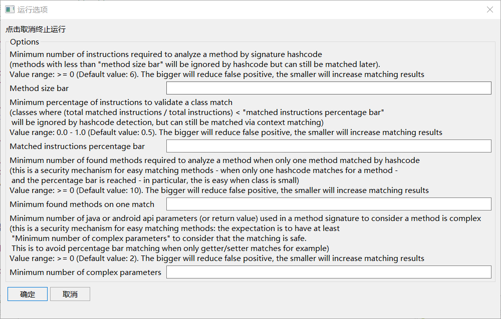
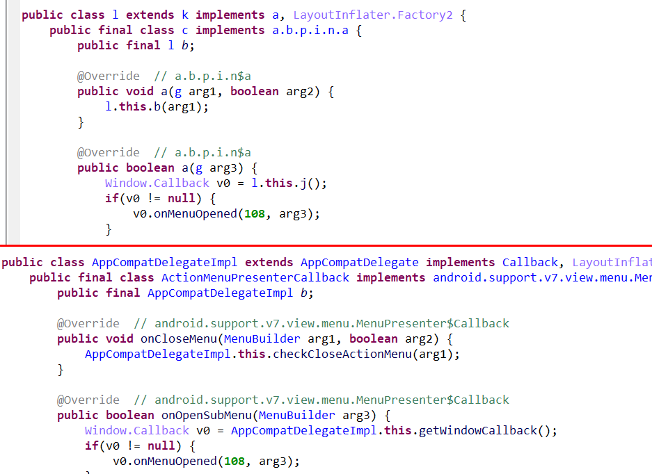
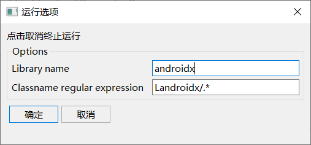
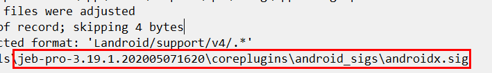

最近使用了一下 JebAndroidSigPlugin 插件，感觉效果还可以，记录一下使用过程。

# 安装

直接去 https://github.com/pnfsoftware/jeb2-androsig 下载编译好的 jar 包， 丢到 `jeb/coreplugins` 目录下，正常情况下 JEB 应该自带该插件

# 使用
使用过程主要参考下面两篇文章：
```dotnetcli
https://www.pnfsoftware.com/blog/jeb-library-code-matching-for-android/
https://www.pnfsoftware.com/blog/new-version-of-androsig/
```
这里我直接使用上面链接提供的 [androsig_1.1_db_20190515.zip](https://s3-us-west-2.amazonaws.com/jebdecompiler2/androsig_1.1_db_20190515.zip),解压到 `JEB/coreplugins/android_sigs/` 目录下。

## Android Signature Recognizer

JEB 打开待分析 APK ，执行 Android Signature Recognizer 插件，将会弹出下列界面，直接点击确定执行。



执行完成效果如下图所示



## Android Signature Generator 
接下来简单讲一下 Android Signature Generator 插件的使用，我们在分析过程中，发现了一些库被混淆了，此时就可以利用该插件制作 Sig 文件，然后利用 Android Signature Recognizer 插件进行识别。

这里我是用 Android Studio 创建一个新的应用，然后将 androidx 包制作一个 sig 文件，首先打开  Android Signature Generator 插件，按下图进行设置，点击确定。



执行成功后，将会生成一个 `jeb/coreplugins/android_sigs` 目录下 androidx.sig 文件。



后续如果发现 androidx 相关的包被混淆了，就可以使用 Android Signature Recognizer 插件进行识别了。