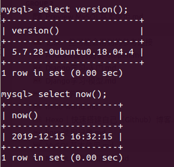
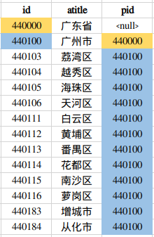

> 推荐使用 [mycli](https://github.com/dbcli/mycli) 操作 MySQL 数据库.

# MySQL 使用

## 基本操作

命令行连接

```bash
$ mysql -uroot -p #回车后输入密码。
```

退出登录

```bash
$ quit # 或 exit 或 ctrl+D
```

其他

```bash
$ select version();     # 查看版本
$ select now();         # 查看当前时间
```



## 数据库操作

查看所有的数据库

```bash
$ show databases;
```

使用数据库

```bash
$ use 数据库名;
```

查看当前使用的数据库

```bash
$ select database();
```

创建数据库

```bash
$ create database 数据库名 charset=utf8mb4;
# 例如：
$ create database test01 charset=utf8mb4;
```

**utf8mb4 才是正真的 utf8。**

查看创建数据库

```bash
$ show create database 数据库名;
# 例如：
$ show create database test01;
```

删除数据库

```bash
$ drop database 数据库名;
# 例如：
$ drop database test01;
```

当数据名称有特殊字符时，使用``包起来。

## 数据表操作

查看当前数据库中的所有表

```bash
$ show tables;
```

创建表

```sql
create table 表名(id int, name varchar(100));

-- 创建xxx表
create table xxxx(
    id int primary key not null auto_increment,
    name varchar(100));

-- 创建 students表（id、name、age、high, gender、cls_id)
create table students(
    id int unsigned not null auto_increment primary key,
    name varchar(100) not null,
    age tinyint unsigned,
    high decimal(5, 2),
    gender enum("男", "女", "保密") default "保密",
    cls_id int unsigned);

-- 插入数据
insert into students values(0, "zhangsan", 18, 188, "男", 0);

-- 创建classe表(id、name)
create table classes(id int unsigned not null auto_increment primary key, name varchar(30));
```

查看表结构

```bash
$ desc 表名;
# 例如：
$ desc students;
```

修改表

```sql
-- 添加字段 alter table 表名 add 列名 类型;
alter table students add birthday datetime;

-- 修改字段 alter table 表名 modify 列名 类型;
alter table students modify birthday date;

-- 修改字段-重命名 alter table 表名 change 原名 新名 类型及约束;
alter table students modify birthday  birth date default "2000-1-1";

-- 删除字段(尽量不用) alter table 表名 drop 列名;
alter table students drop high;
```

删除表

```bash
$ drop table 表名; -- 删除表
$ drop database 数据库; -- 删除数据库
```

查看创建表

```bash
$ show create table 表名;
```

## 增删改查

增加

```sql
-- 全列插入
-- insert into 表名 values(...);
-- 主键字段 可以用0 null default 来占位
insert into classes values(0, "class02")

insert into students values(0, "lisi", 18, "女", 0, "2011-01-01", 167);
insert into students values(null, "lisi", 18, "女", 0, "2011-01-01", 167);
insert into students values(default, "lisi", 18, "女", 0, "2011-01-01", 167);
insert into students values(default, "lisi", 18, 1, 0, "2011-01-01", 167);
insert into students values(default, "lisi", 18, 3, 0, "2011-01-01", 167);


-- 部分插入
-- insert into 表名(列1, 列2 ...) values(值1，值2);

-- 插入多行
insert into students (name, gender) values ("貂蝉", 2)，("大乔", 2);
insert into students values(default, "鲁班", 18, 2, 0, "2011-01-01", 167), (default, "后羿", 18, 1, 0, "2011-01-01", 167);
```

修改

```sql
-- update 表名 set 列1=值1, 列2=值2 ... where 条件
update students set gender=1;
update students set gender=2 where id>6;

```

查询

```sql
-- 查询所有的列
-- select * from 表名;
select * from students;
-- 查询name="lisi"的所有数据
select * from students where name="lisi";
-- 查询id > 8的所有数据
select * from students where id>8;

-- 查询指定的列
-- select * 列1, 列2 ... from 表名;
select name, gender from students;

-- 使用 as 为列或表指定别名
-- select 字段[as 别名], 字段[as 别名] from 数据表 where ...;
select name as 姓名, gender as 性别 from students;

-- 字段的顺序
select id as 序号, gender as 性别, name as 姓名 from students;
```

删除(基本不会使用，一般用一个字段标记是否删除)

```sql
-- delete from 表名 where 条件;
delete from students;
delete from students where name="lisi";

-- 逻辑删除
-- 给students 表添加一个 is_delete 字段，bit类型
alter table students add is_delete bit default 0;
-- 删除
update students set is_delete = 1 where id = 6;
```

## 数据库备份和恢复

备份

```bash
$ mysqldump -u用户名 -p 数据库名 > dump.sql #按提示输入密码
```

恢复

```bash
$ mysql -u用户名 -p 新数据库名 < dump.sql #按提示输入密码
```

# 数据库设计

## 三范式

经过研究和对使用中问题的总结，对于设计数据库提出了一些规范，这些规范被称为范式(Normal Form)，
目前有迹可寻的共有 8 种范式，一般需要遵守 3 范式即可。

- 第一范式（1NF）：强调的是列的原子性，即列不能够再分成其他几列。
- 第二范式（2NF）：首先是 1NF，另外包含两部分内容，一是表必须有一个主键；二是没有包含在主键中的列必须完全依赖于主键，而不能只依赖于主键的一部分。
- 第三范式（3NF）：首先是 2NF，另外非主键列必须直接依赖于主键，不能存在传递依赖。即不能存在：非主键列 A 依赖于非主键列 B，非主键列 B 依赖于主键的情况。

## E-R 模型

- E 表示 entry-实体，设计实体就像定义一个类一样，指定从哪些方面描述对象，一个实体转换为数据库中的一个表。
- R 表示 relationship-关系，关系描述两个实体之间的对应规则，关系的类型包括包括一对一、一对多、多对多。

1. 一对一 :
   但一个表的列太多时，并且某些列不经常出现在结果中，此时可以对列进行拆分，此时两个表的关系为一对一关系。实体 A 对实体 B 为 1 对 1，则在表 A 或表 B 中创建一个字段，存储另一个表的主键值。

2. 一对多 :
   A 表中的一条数据对应 B 表中的一条数据， B 表中的一条数据对应 A 表中的多条数据。此时 A 与 B 为多对一的关系。实体 A 对实体 B 为 1 对多：在表 B 中创建一个字段，存储表 A 的主键值。

3. 多对多 :
   A 表中的一条数据对应 B 表中的多条数据， B 表中的一条数据对应 A 表中的多条数据。此时 A 与 B 为多对多的关系。实体 A 对实体 B 为多对多：新建一张表 C，这个表只有两个字段，一个用于存储 A 的主键值，一个用于存储 B 的主键值。

# 更多查询用法

消除重复行

```bash 
$ select distinct 列1, 列2 ... from 表名;
# 例如:
$ select distinct gender from students;
```

## 条件

使用 where 子句对表中的数据筛选，结果为 true 的行为会出现在结果集中。

```bash
$ select * from 表名 where 条件;
```

where 后面支持多种运算符，进行条件的处理。

## 比较运算符

- 等于 =
- 大于 >
- 大于等于 >=
- 小于 <
- 小于等于 <=
- 不等于 != 或 <>

例： 查询编号大于 3 的学生

```bash
$ select * from students where id > 3;
```

例：查询编号不大于 4 的学生

```bash
$ select * from students where id <= 4;
```

例：查询姓名不是“黄蓉”的学生

```bash
$ select * from students where name != "黄蓉";
```

例：查询没被删除的学生

```bash
$ select * from students where is_delete=0;
```

## 逻辑运算

- and
- or
- not

例：查询编号大于 3 的女同学

```bash
$ select * from students where id > 4 or gender = 0;
```

例 6：查询编号小于 4 或没被删除的学生

```bash
$ select * from students where id < 4 or is_delete = 0;
```

## 模糊查询

- `like`
- `%` 表示任意多个任意字符
- `_` 表示一个任意字符

例：查询姓黄的学生

```bash
$ select * from students where name like "黄%";
```

例：查询姓黄并且“名”是一个字的学生

```bash
$ select * from students where name like "黄_";
```

例：查询姓黄或叫靖的学生

```bash
$ select * from students where name like "黄%" or name like "%靖";
```

## 范围查询

- `in` 表示在一个非连续的范围内

例：查询编号是 1 或 3 或 8 的学生

```bash
$ select * from students where id in(1,3, 8);
```

- `between ... and ...` 表示在一个连续的范围内

例：查询编号为 3 至 8 的学生

```bash
$ select * from students where id between 3 and 8;
```

例：查询编号是 3 至 8 的男生

```bash
$ select * from students where (id between 3 and 8) and gender = 1;
```

## 空判断

- 注意: `null` 和 `""` 是不同的
- 判空 `is null`

例：查询没有填写身高的学生

```bash
$ select * from students where height is null;
```

- 判非空 `is not null`

例：查询填写了身高的学生

```bash
$ select * from students where height is not null and gender=1;
```

## 优先级

- 优先级由高到低的顺序为：小括号，not，比较运算符，逻辑运算符
- and 比 or 先运算，如果同时出现并希望先算 or，需要结合()使用

## 排序

语法：

```bash
$ select * from 表名 order by 列1 asc|desc [,列2 asc|desc,...]
```

说明

- 将行数据按照列 1 进行排序，如果某些行列 1 的值相同时，则按照列 2 排序，以此类推
- 默认按照列值从小到大排列（asc）
- `asc` 从小到大排列，即升序
- `desc` 从大到小排序，即降序

例：查询未删除男生信息，按学号降序

```bash
$ select * from students where gender = 1 and is_delete = 0 order by id desc;
```

例：查询未删除学生信息，按名称升序(默认升序)

```
select * from students where is_delete=0 order by id;
```

例 3：显示所有的学生信息，先按照年龄从大-->小排序，当年龄相同时 按照身高从高-->矮排序

```
select * from students order by age, height desc;
```

## 聚合函数

- count(\*)表示计算总行数，括号中写星与列名，结果是相同的

例：查询学生总数

```
select count(*) from students;
```

- max(列)表示求此列的最大值

例：查询女生的编号最大值

```
select max(id) from students where gender = 2;
```

- min(列)表示求此列的最小值

例：查询未删除的学生最小编号

```
select min(id) from students where is_delete = 0;
```

- sum(列)表示求此列的和

例：查询男生的总年龄

```
select sum(age) from students where gender = 1;
-- 平均年龄
select sum(age)/count(*) from students where gender = 1;
```

- avg(列)表示求此列的平均值

例：查询未删除女生的编号平均值

```
select avg(age) from students where is_delete = 0 and gender = 2;
```

## 分组

- group by 的含义:将查询结果按照 1 个或多个字段进行分组，字段值相同的为一组
- group by 可用于单个字段分组，也可用于多个字段分组

```
-- 根据gender字段来分组
select gender from students group by gender;
```

group by + group_concat()

- group_concat(字段名)可以作为一个输出字段来使用，
- 表示分组之后，根据分组结果，使用 group_concat()来放置每一组的某字段的值的集合

```
select gender, group_concat(name) from students group by gender;

select gender, group_concat(id) from students group by gender;
+--------+------------------+
| gender | group_concat(id) |
+--------+------------------+
| 男     | 3,4,8,9,13,15    |
| 女     | 1,2,5,7,10,12,14 |
| 中性   | 11               |
| 保密   | 6                |
+--------+------------------+
```

group by + 集合函数

- 通过 group_concat()的启发，我们既然可以统计出每个分组的某字段的值的集合，那么我们也可以通过集合函数来对这个值的集合做一些操作。

```
select gender, group_concat(age) from students group by gender;

-- 分别统计性别为男/女的平均年龄
select gender, avg(age) from students group by gender;

-- 分别统计性别的个数
select gender, count(*) from students group by gender;
```

group by + having

- having 条件表达式：用来分组查询后指定一些条件来输出查询结果
- having 作用和 where 一样，但 having 只能用于 group by

```
select gender, count(*) from students group by gender
 having count(*) >2;
```

group by + with rollup

- with rollup 的作用是：在最后新增一行，来记录当前列里所有记录的总和

```
 select gender, count(*) from students group by gender
 with rollup;

 select gender, group_concat(age) from students group by gender with rollup;
```

## 分页

语法

```
select * from 表名 limit start,count
```

说明

- 从 start 开始，获取 count 条数据

例：查询前 3 行男生信息

```
select * from students where gender = 1 limit 0,3;
```

## 连接查询

当查询结果的列来源于多张表时，需要将多张表连接成一个大的数据集，再选择合适的列返回

mysql 支持三种类型的连接查询，分别为：

- 内连接查询：查询的结果为两个表匹配到的数据


- 右连接查询：查询的结果为两个表匹配到的数据，右表特有的数据，对于左表中不存在的数据使用 null 填充


- 左连接查询：查询的结果为两个表匹配到的数据，左表特有的数据，对于右表中不存在的数据使用 null 填充


语法

```
select * from 表1 inner 或 left 或 right join 表2 on 表1.列 = 表2.列;
```

例：使用内连接查询班级表与学生表

```
select * from students inner join classes on students.cls_id = classes.id;
```

例 2：使用左连接查询班级表与学生表, 此处使用了 as 为表起别名，目的是编写简单

```
select * from students as s left join classes as c on s.cls_id = c.id;
```

例 3：使用右连接查询班级表与学生表

```
select * from students as s right join classes as c on s.cls_id = c.id;
```

例 4：查询学生姓名及班级名称

```
select s.name, c.name from students as s inner join classes as c on s.cls_id = c.id;
```

## 自关联

- 设计省信息的表结构 provinces

  - id
  - ptitle

- 设计市信息的表结构 citys

  - id
  - ctitle
  - proid

- citys 表的 proid 表示城市所属的省，对应着 provinces 表的 id 值

问题：

> 能不能将两个表合成一张表呢？

思考：

> 观察两张表发现，citys 表比 provinces 表多一个列 proid，其它列的类型都是一样的

意义：

> 存储的都是地区信息，而且每种信息的数据量有限，没必要增加一个新表，或者将来还要存储区、乡镇信息，都增加新表的开销太大

答案：

> 定义表 areas，结构如下

- id
- atitle
- pid

说明:

- 因为省没有所属的省份，所以可以填写为 null
- 城市所属的省份 pid，填写省所对应的编号 id
- 这就是自关联，表中的某一列，关联了这个表中的另外一列，但是它们的业务逻辑含义是不一样的，城市信息的 pid 引用的是省信息的 id
- 在这个表中，结构不变，可以添加区县、乡镇街道、村社区等信息



- 创建 areas 表的语句如下：

```
create table areas(
    aid int primary key,
    atitle varchar(20),
    pid int
);
```

- 从 sql 文件中导入数据, `areas.sql` [文件地址](https://github.com/CKCat/Note/blob/master/Django/areas.sql)

```
source areas.sql;
```

- 查询一共有多少个省

```
select count(*) from areas where pid is null;
```

例：查询省的名称为“山西省”的所有城市

```
select city.* from areas as city
inner join areas as province on city.pid=province.aid
where province.atitle='山西省';
```

例：查询市的名称为“广州市”的所有区县

```
select dis.* from areas as dis
inner join areas as city on city.aid=dis.pid
where city.atitle='广州市';
```

## 子查询

子查询

> 在一个 select 语句中,嵌入了另外一个 select 语句, 那么被嵌入的 select 语句称之为子查询语句。

主查询

> 主要查询的对象,第一条 select 语句

主查询和子查询的关系

- 子查询是嵌入到主查询中
- 子查询是辅助主查询的,要么充当条件,要么充当数据源
- 子查询是可以独立存在的语句,是一条完整的 select 语句

子查询分类

- 标量子查询: 子查询返回的结果是一个数据(一行一列)
- 列子查询: 返回的结果是一列(一列多行)
- 行子查询: 返回的结果是一行(一行多列)

标量子查询 - 查询班级学生的平均身高

```
select * from students where age > (select avg(age) from students);
```

列级子查询 - 查询还有学生在班的所有班级名字

```
select name from classes where id in (select cls_id from students);
```

行级子查询 - 查找班级年龄最大,身高最高的学生

```
select * from students where (height,age) = (select max(height),max(age) from students);
```

子查询中特定关键字使用

- in 范围
  - 格式: 主查询 where 条件 in (列子查询)

## 总结

查询的完整格式

```
SELECT select_expr [,select_expr,...] [
      FROM tb_name
      [WHERE 条件判断]
      [GROUP BY {col_name | postion} [ASC | DESC], ...]
      [HAVING WHERE 条件判断]
      [ORDER BY {col_name|expr|postion} [ASC | DESC], ...]
      [ LIMIT {[offset,]rowcount | row_count OFFSET offset}]
]
```

完整的 select 语句

```
select distinct *
from 表名
where ....
group by ... having ...
order by ...
limit start,count
```

# MySql 高级

## 视图

### 视图是什么

通俗的讲，视图就是一条 SELECT 语句执行后返回的结果集。所以我们在创建视图的时候，主要的工作就落在创建这条 SQL 查询语句上。

视图是对若干张基本表的引用，一张虚表，查询语句执行的结果，不存储具体的数据（基本表数据发生了改变，视图也会跟着改变）；

方便操作，特别是查询操作，减少复杂的 SQL 语句，增强可读性；

### 定义视图

```
create view 视图名称 as select语句;
```

### 查看视图

查看表会将所有的视图也列出来

```
show tables;
```

### 使用视图

视图的用途就是查询

```
select * from v_stu_score;
```

### 删除视图

```
drop view 视图名称;
例：
drop view v_stu_sco;
```

### 视图的作用

- 提高了重用性，就像一个函数
- 对数据库重构，却不影响程序的运行
- 提高了安全性能，可以对不同的用户
- 让数据更加清晰

## 事务

所谓事务,它是一个操作序列，这些操作要么都执行，要么都不执行，它是一个不可分割的工作单位。

### 事务四大特性(简称 ACID)

#### 原子性(Atomicity)

一个事务必须被视为一个不可分割的最小工作单元，整个事务中的所有操作要么全部提交成功，要么全部失败回滚，对于一个事务来说，不可能只执行其中的一部分操作，这就是事务的原子性.

#### 一致性(Consistency)

数据库总是从一个一致性的状态转换到另一个一致性的状态。（在前面的例子中，一致性确保了，即使在执行第三、四条语句之间时系统崩溃，支票账户中也不会损失 200 美元，因为事务最终没有提交，所以事务中所做的修改也不会保存到数据库中。）

#### 隔离性(Isolation)

通常来说，一个事务所做的修改在最终提交以前，对其他事务是不可见的。（在前面的例子中，当执行完第三条语句、第四条语句还未开始时，此时有另外的一个账户汇总程序开始运行，则其看到支票帐户的余额并没有被减去 200 美元。）

#### 持久性(Durability)

一旦事务提交，则其所做的修改会永久保存到数据库。（此时即使系统崩溃，修改的数据也不会丢失。）

### 事务命令

表的引擎类型必须是 innodb 类型才可以使用事务，这是 mysql 表的默认引擎

查看表的创建语句，可以看到 engine=innodb

```
-- 选择数据库
use jing_dong;
-- 查看goods表
show create table goods;
```

开启事务，命令如下：

开启事务后执行修改命令，变更会维护到本地缓存中，而不维护到物理表中

```
begin;
或者
start transaction;
```

提交事务，命令如下

将缓存中的数据变更维护到物理表中

```
commit;
```

回滚事务，命令如下：

放弃缓存中变更的数据

```
rollback;
```

注意

- 修改数据的命令会自动的触发事务，包括 insert、update、delete
- 而在 SQL 语句中有手动开启事务的原因是：可以进行多次数据的修改，如果成功一起成功，否则一起会滚到之前的数据

### 提交

为了演示效果，需要打开两个终端窗口，使用同一个数据库，操作同一张表

step1：连接

终端 1：查询商品分类信息

```
select * from goods_cates;
```

step2：增加数据

终端 2：开启事务，插入数据

```
begin;
insert into goods_cates(name) values('小霸王游戏机');
```

终端 2：查询数据，此时有新增的数据

```
select * from goods_cates;
```

step3：查询

终端 1：查询数据，发现并没有新增的数据

```
select * from goods_cates;
```

step4：提交

终端 2：完成提交

```
commit;
```

step5：查询

终端 1：查询，发现有新增的数据

```
select * from goods_cates;
```

### 回滚

为了演示效果，需要打开两个终端窗口，使用同一个数据库，操作同一张表

step1：连接

终端 1

```
select * from goods_cates;
```

step2：增加数据

终端 2：开启事务，插入数据

```
begin;
insert into goods_cates(name) values('小霸王游戏机');
```

终端 2：查询数据，此时有新增的数据

```
select * from goods_cates;
```

step3：查询

终端 1：查询数据，发现并没有新增的数据

```
select * from goods_cates;
```

step4：回滚

终端 2：完成回滚

```
rollback;
```

step5：查询

终端 1：查询数据，发现没有新增的数据

```
select * from goods_cates;
```

### 索引

#### 索引是什么

索引是一种特殊的文件(InnoDB 数据表上的索引是表空间的一个组成部分)，它们包含着对数据表里所有记录的引用指针。

更通俗的说，数据库索引好比是一本书前面的目录，能加快数据库的查询速度。

#### 索引目的

索引的目的在于提高查询效率，可以类比字典，如果要查“mysql”这个单词，我们肯定需要定位到 m 字母，然后从下往下找到 y 字母，再找到剩下的 sql。如果没有索引，那么你可能需要把所有单词看一遍才能找到你想要的，如果我想找到 m 开头的单词呢？或者 ze 开头的单词呢？是不是觉得如果没有索引，这个事情根本无法完成？

#### 索引原理

除了词典，生活中随处可见索引的例子，如火车站的车次表、图书的目录等。它们的原理都是一样的，通过不断的缩小想要获得数据的范围来筛选出最终想要的结果，同时把随机的事件变成顺序的事件，也就是我们总是通过同一种查找方式来锁定数据。

数据库也是一样，但显然要复杂许多，因为不仅面临着等值查询，还有范围查询(>、<、between、in)、模糊查询(like)、并集查询(or)等等。数据库应该选择怎么样的方式来应对所有的问题呢？我们回想字典的例子，能不能把数据分成段，然后分段查询呢？最简单的如果 1000 条数据，1 到 100 分成第一段，101 到 200 分成第二段，201 到 300 分成第三段……这样查第 250 条数据，只要找第三段就可以了，一下子去除了 90%的无效数据。

#### 索引的使用

查看索引

```
show index from 表名;
```

创建索引

- 如果指定字段是字符串，需要指定长度，建议长度与定义字段时的长度一致
- 字段类型如果不是字符串，可以不填写长度部分

```
create index 索引名称 on 表名(字段名称(长度))
```

删除索引：

```
drop index 索引名称 on 表名;
```

#### 例子

创建测试表 testindex

```
create table test_index(title varchar(10));
```

使用 python 程序通过 pymsql 模块 向表中加入十万条数据

```
from pymysql import *

def insert():
    # 创建 Connection 连接
    conn = connect(host="localhost", port=3306, database="jing_dong", user="ckcat", password="mysql", charset="utf8mb4")
    # 获得 Cursor 对象
    cs = conn.cursor()

    # 插入10万次数据
    for i in range(100000):
        cs.execute("insert into test_index values('ha-%d')" % i)
    # 提交数据
    conn.commit()

    # 关闭 cursor 对象 和 Connection 对象
    cs.close()
    conn.close()


if __name__ == '__main__':
    insert()
```

#### 查询

开启运行时间监测：

```
set profiling=1;
```

查找第 1 万条数据 ha-99999

```
select * from test_index where title='ha-99999';
```

查看执行的时间：

```
show profiles;
```

为表 title_index 的 title 列创建索引：

```
create index title_index on test_index(title(10));
```

执行查询语句：

```
select * from test_index where title='ha-99999';
```

再次查看执行的时间

```
show profiles;
```

#### 注意：

要注意的是，建立太多的索引将会影响更新和插入的速度，因为它需要同样更新每个索引文件。对于一个经常需要更新和插入的表格，就没有必要为一个很少使用的 where 字句单独建立索引了，对于比较小的表，排序的开销不会很大，也没有必要建立另外的索引。

建立索引会占用磁盘空间
