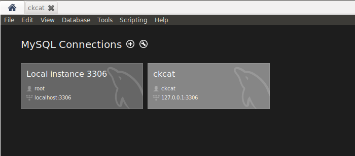

# MySQL 服务其安装与配置

> 转载：https://www.digitalocean.com/community/tutorials/how-to-install-mysql-on-ubuntu-18-04

## 安装 MySQL

首先运行下面命令更新软件包：

```
$ sudo apt update
```

然后安装默认软件包：

```
$ sudo apt install mysql-server
```

这将安装 MySQL，但不会提示您设置密码或进行任何其他配置更改。

## 调整用户身份验证和特权

### 创建 root 密码

在运行 MySQL 5.7（及更高版本）的 Ubuntu 系统中，默认情况下，MySQL root 用户设置为使用 `auth_socket` 插件而不是密码进行身份验证。

为了使用密码以 root 用户身份连接到 MySQL ，您需要将其身份验证方法从切换 `auth_socket` 为 `mysql_native_password` ，首先使用 root 账号打开 mysql。

```
$ sudo mysql
```

接下来，使用以下命令检查每个 MySQL 用户帐户使用的身份验证方法：

```
mysql> SELECT user,authentication_string,plugin,host FROM mysql.user;
```

```
Output
+------------------+-------------------------------------------+-----------------------+-----------+
| user             | authentication_string                     | plugin                | host      |
+------------------+-------------------------------------------+-----------------------+-----------+
| root             |                                           | auth_socket           | localhost |
| mysql.session    | *THISISNOTAVALIDPASSWORDTHATCANBEUSEDHERE | mysql_native_password | localhost |
| mysql.sys        | *THISISNOTAVALIDPASSWORDTHATCANBEUSEDHERE | mysql_native_password | localhost |
| debian-sys-maint | *CC744277A401A7D25BE1CA89AFF17BF607F876FF | mysql_native_password | localhost |
+------------------+-------------------------------------------+-----------------------+-----------+
4 rows in set (0.00 sec)
```

在此示例中，您可以看到 root 用户实际上使用 auth_socket 插件进行了身份验证。要将 root 帐户配置为使用密码进行身份验证，请运行以下 `ALTER USER` 命令。

```
mysql> ALTER USER 'root'@'localhost' IDENTIFIED WITH mysql_native_password BY 'password';
```

然后，运行 `FLUSH PRIVILEGES` 告诉服务器重新加载授权表并使新的更改生效：

```
mysql> FLUSH PRIVILEGES;
```

再次检查每个用户使用的身份验证方法，以确认 root 不再使用该 auth_socket 插件进行身份验证：

```
mysql> SELECT user,authentication_string,plugin,host FROM mysql.user;
```

```
Output
+------------------+-------------------------------------------+-----------------------+-----------+
| user             | authentication_string                     | plugin                | host      |
+------------------+-------------------------------------------+-----------------------+-----------+
| root             | *3636DACC8616D997782ADD0839F92C1571D6D78F | mysql_native_password | localhost |
| mysql.session    | *THISISNOTAVALIDPASSWORDTHATCANBEUSEDHERE | mysql_native_password | localhost |
| mysql.sys        | *THISISNOTAVALIDPASSWORDTHATCANBEUSEDHERE | mysql_native_password | localhost |
| debian-sys-maint | *CC744277A401A7D25BE1CA89AFF17BF607F876FF | mysql_native_password | localhost |
+------------------+-------------------------------------------+-----------------------+-----------+
4 rows in set (0.00 sec)
```

您可以在此示例输出中看到，MySQL 根用户现在使用密码进行了身份验证。

### 创建普通用户

一般情况下，我们会创建一个普通用户操作 mysql 数据库，可以按下面方法创建一个普通用户。

首先使用 root 账号进入 mysql 中。

```bash
$ mysql -u root -p
```

接着创建一个新用户并为其设置一个强密码。

```
mysql> CREATE USER 'username'@'host' IDENTIFIED BY 'password';
```

- username: 创建的用户名。
- host: 指定该用户在哪个主机上可以登陆，如果是本地用户可用 localhost，如果是远程登陆，可以使用通配符 `%` 。
- password：用户的登陆密码。

> 其中需要注意的是，如果 host 指定为 `%` ，那么还需要进入设置 `/etc/mysql/mysql.conf.d/mysqld.cnf` 配置文件，注释掉其中的 `bind-address = 127.0.0.1` 行，然后执行 `sudo systemctl restart mysql` 重新启动 mysql 服务。

例如：
```bash
CREATE USER 'ckcat'@'%' IDENTIFIED BY 'xxxxxxxx';
```

### 给新用户授权

```
mysql> GRANT privileges ON databasename.tablename TO 'username'@'host'
```

- privileges：用户的操作权限。如 SELECT，INSERT，UPDATE 等，如果要授予所的权限则使用 ALL
- databasename：数据库名
- tablename：表名，如果要授予该用户对所有数据库和表的相应操作权限则可用表示，如 `.*` 。


例如：
```bash
mysql> GRANT SELECT, INSERT ON test.user TO 'ckcat'@'%';
mysql> GRANT ALL ON *.* TO 'ckcat'@'%';
mysql> flush privileges;
mysql> show grants for 'ckcat'@'%'
```

## 配置 MySQL

对于全新安装，您将需要运行随附的安全脚本。这会更改一些不太安全的默认选项，例如远程 root 登录和样本用户。

```
$ sudo mysql_secure_installation
```

这将引导您完成一系列提示，在其中您可以对 MySQL 安装的安全性选项进行一些更改。第一个提示将询问您是否要设置验证密码插件，该插件可用于测试 MySQL 密码的强度。无论您选择什么，下一个提示都是为 MySQL root 用户设置密码。输入，然后确认您选择的安全密码。

## 1.4. 测试 MySQL

无论您如何安装，MySQL 都应该已经开始自动运行。要对此进行测试，请检查其状态。

```
$  systemctl status mysql.service
```

您将看到类似于以下内容的输出：

```
● mysql.service - MySQL Community Server
   Loaded: loaded (/lib/systemd/system/mysql.service; enabled; vendor preset: en
   Active: active (running) since Sun 2019-12-15 10:36:06 CST; 32min ago
 Main PID: 8876 (mysqld)
    Tasks: 35 (limit: 4915)
   CGroup: /system.slice/mysql.service
           └─8876 /usr/sbin/mysqld --daemonize --pid-file=/run/mysqld/mysqld.pid

Dec 15 10:36:05 ckcat-ubuntu systemd[1]: Starting MySQL Community Server...
Dec 15 10:36:06 ckcat-ubuntu systemd[1]: Started MySQL Community Server.
```

如果 MySQL 未运行，则可以使用来启动它 `sudo systemctl start mysql` ，也可以通过下列方法进行操作。

启动服务

```
$ sudo service mysql start
```

停止服务

```
$ sudo service mysql stop
```

重启服务

```
$ sudo service mysql restart
```

## 使用 MySQL Workbench 连接数据库

安装 MySQL Workbench

```
sudo apt update
sudo apt install mysql-workbench
```

启动 MySQL Workbench ，选择 ip、端口、用户名，输入密码连接对应的数据库


# 将 MySQL 数据目录移动到新位置

> 参考：https://www.digitalocean.com/community/tutorials/how-to-move-a-mysql-data-directory-to-a-new-location-on-ubuntu-18-04

## 介绍

数据库会随着时间增长，有时会超出文件系统上的空间。当 I/O 与操作系统的其余部分位于同一分区时，您也可能会遇到 I/O 竞争。 RAID 、网络块存储和其他设备可以提供冗余和其他所需的功能。无论您是要添加更多空间，评估优化性能的方式还是希望利用其他存储功能，本教程都将指导您重新定位 MySQL 的数据目录。

## 先决条件

要完成本指南，您将需要：

- 具有非 root 用户 sudo 特权的 Ubuntu 18.04 服务器。
- 一个 MySQL 服务器

在此示例中，我们将数据移至 `~/.mysqldata` 目录中。

## 第 1 步-移动 MySQL 数据目录

为了准备移动 MySQL 的数据目录，让我们通过使用管理凭据启动交互式 MySQL 会话来验证当前位置。

```
$ mysql -u root -p
```

出现提示时，提供 MySQL root 密码。然后在 MySQL 提示符下，选择数据目录：

```
mysql> select @@datadir;
```

```
Output
+-----------------+
| @@datadir       |
+-----------------+
| /var/lib/mysql/ |
+-----------------+
1 row in set (0.00 sec)
```

此输出确认 MySQL 已配置为使用默认数据目录， `/var/lib/mysql/` ,因此这是我们需要移动的目录。

为了确保数据的完整性，在实际更改数据目录之前，我们将关闭 MySQL：

```
$ sudo systemctl stop mysql
```

`systemctl` 不会显示所有服务管理命令的结果，因此，如果要确保成功，请使用以下命令：

```
$ sudo systemctl status mysql
```

如果输出的最后一行告诉您服务器已停止，则可以确定它已关闭：

```
Output
. . .
Dec 15 11:42:15 ckcat-ubuntu systemd[1]: Stopped MySQL Community Server.
```

现在服务器已关闭，我们将使用 `rsync` 将现有数据库目录复制到新位置。使用该 `-a` 标志保留权限和其他目录属性，同时 `-v` 提供详细的输出，以便您可以跟踪进度。

> 注意：请确保目录上没有斜杠，如果使用制表符补全，可以添加斜杠。当出现斜杠时，rsync 会将目录的内容转储到安装点，而不是将其传输到包含 mysql 目录.

```
$ sudo rsync -av /var/lib/mysql ~/.mysqldata
```

一旦 rsync 完成，用.bak 扩展名重命名当前文件夹中保存，直到我们已经证实，此举是成功的。通过重命名，我们可以避免新旧位置文件引起的混乱：

```
$ sudo mv /var/lib/mysql /var/lib/mysql.bak
```

现在，我们准备将注意力转向配置。

## 第 2 步-指向新数据位置

MySQL 有几种方法可以覆盖配置值。默认情况下， `/etc/mysql/mysql.conf.d/mysqld.cnf` 在文件中 `datadir` 设置为 `/var/lib/mysql` 。编辑此文件以反映新的数据目录：

```
$ sudo vim /etc/mysql/mysql.conf.d/mysqld.cnf
```

找到开头的行， `datadir=` 并更改其后的路径以反映新位置。

在我们的例子中，更新后的文件如下所示：

```
. . .
datadir=~/.mysqldata/mysql
. . .
```

这似乎是重新启动 MySQL 的正确时机，但是在成功完成此配置之前，还需要配置一件事。

## 步骤 3 —配置 AppArmor 访问控制规则

我们需要告诉 AppArmor 通过在默认目录和新位置之间创建别名来让 MySQL 写入新目录。为此，请编辑 AppArmor `alias` 文件：

```
$ sudo vim /etc/apparmor.d/tunables/alias
```

在文件底部，添加以下别名规则：

```
. . .
alias /var/lib/mysql/ -> ~/.mysqldata/mysql,
. . .
```

为了使更改生效，请重新启动 AppArmor：

```
$ sudo systemctl restart apparmor
```

> 注意：如果跳过 AppArmor 配置步骤，则会遇到以下错误消息：

```
Output
Job for mysql.service failed because the control process
exited with error code. See "systemctl status mysql.service"
and "journalctl -xe" for details.
```

> 从 `systemctl` 和`journalctl` 两者的输出结尾判断：

```
Output
Jul 18 11:03:24 ubuntu-512mb-nyc1-01 systemd[1]:
mysql.service: Main process exited, code=exited, status=1/FAILURE
```

> 由于消息没有在 AppArmor 和数据目录之间建立显式连接，因此该错误可能需要一些时间才能弄清楚。

## 第 4 步-重新启动 MySQL

下一步是启动 MySQL ，但如果这样做，则会遇到另一个错误。这次不是发生 AppArmor 问题，而是因为该脚本 `mysql-systemd-start` 检查是否存在与两个默认路径匹配的目录 `-d` 或符号链接 `-L` 。如果找不到它们，它将失败：

```
. . .
if [ ! -d /var/lib/mysql ] && [ ! -L /var/lib/mysql ]; then
 echo "MySQL data dir not found at /var/lib/mysql. Please create one."
 exit 1
fi

if [ ! -d /var/lib/mysql/mysql ] && [ ! -L /var/lib/mysql/mysql ]; then
 echo "MySQL system database not found. Please run mysql_install_db tool."
 exit 1
fi
. . .

```

因为我们需要这些来启动服务器，所以我们将创建最小的目录结构以通过脚本的环境检查。

```
$ sudo mkdir /var/lib/mysql/mysql -p
```

现在我们准备启动 MySQL。

```
$ sudo systemctl start mysql
$ sudo systemctl status mysql
```

为了确保确实使用了新的数据目录，请启动 MySQL 监视器。

```
$ mysql -u root -p
```

再次查看数据目录的值：

```
mysql> select @@datadir;

+-------------------------------+
| @@datadir                     |
+-------------------------------+
| /home/ckcat/.mysqldata/mysql/ |
+-------------------------------+
1 row in set (0.00 sec)
```

现在，您已经重新启动了 MySQL 并确认它正在使用新位置，请借此机会确保您的数据库可以正常运行。验证所有现有数据的完整性后，即可删除备份数据目录：

```
$ sudo rm -Rf /var/lib/mysql.bak
```

最后一次重启 MySQL，以确保它能按预期运行：

```
$ sudo systemctl restart mysql
$ sudo systemctl status mysql
```

## 结论

在本教程中，我们将 MySQL 的数据目录移动到了新位置，并更新了 Ubuntu 的 AppArmor ACL 以适应该调整。尽管我们使用的是块存储设备，但无论底层技术如何，此处的说明都应适用于重新定义数据目录的位置。

有关管理 MySQL 数据目录的更多信息，请参见 MySQL 官方文档中的以下部分：

- [Mysql 数据目录](https://dev.mysql.com/doc/refman/5.7/en/data-directory.html)
- [设置多个数据目录](https://dev.mysql.com/doc/refman/5.7/en/multiple-data-directories.html)
