> 转载： https://www.ruanyifeng.com/blog/2013/06/rsa_algorithm_part_one.html

如果你问我，哪一种算法最重要？

我可能会回答"公钥加密算法"。

因为它是计算机通信安全的基石，保证了加密数据不会被破解。你可以想象一下，信用卡交易被破解的后果。

进入正题之前，我先简单介绍一下，什么是"公钥加密算法"。

# 一点历史

1976 年以前，所有的加密方法都是同一种模式：

```
    （1）甲方选择某一种加密规则，对信息进行加密；
    （2）乙方使用同一种规则，对信息进行解密。
```

由于加密和解密使用同样规则（简称"密钥"），这被称为"对称加密算法"（Symmetric-key algorithm）。

这种加密模式有一个最大弱点：甲方必须把加密规则告诉乙方，否则无法解密。保存和传递密钥，就成了最头疼的问题。

1976 年，两位美国计算机学家 Whitfield Diffie 和 Martin Hellman，提出了一种崭新构思，可以在不直接传递密钥的情况下，完成解密。这被称为"Diffie-Hellman 密钥交换算法"。这个算法启发了其他科学家。人们认识到，加密和解密可以使用不同的规则，只要这两种规则之间存在某种对应关系即可，这样就避免了直接传递密钥。

这种新的加密模式被称为"非对称加密算法"。

```
（1）乙方生成两把密钥（公钥和私钥）。公钥是公开的，任何人都可以获得，私钥则是保密的。
（2）甲方获取乙方的公钥，然后用它对信息加密。
（3）乙方得到加密后的信息，用私钥解密。
```

如果公钥加密的信息只有私钥解得开，那么只要私钥不泄漏，通信就是安全的。

1977 年，三位数学家 Rivest、Shamir 和 Adleman 设计了一种算法，可以实现非对称加密。这种算法用他们三个人的名字命名，叫做 RSA 算法。从那时直到现在，RSA 算法一直是最广为使用的"非对称加密算法"。毫不夸张地说，只要有计算机网络的地方，就有 RSA 算法。

这种算法非常可靠，密钥越长，它就越难破解。根据已经披露的文献，目前被破解的最长 RSA 密钥是 768 个二进制位。也就是说，长度超过 768 位的密钥，还无法破解（至少没人公开宣布）。因此可以认为，1024 位的 RSA 密钥基本安全，2048 位的密钥极其安全。

下面，我就进入正题，解释 RSA 算法的原理。文章共分成两部分，今天是第一部分，介绍要用到的四个数学概念。你可以看到，RSA 算法并不难，只需要一点数论知识就可以理解。

# 互质关系

如果两个正整数，除了 1 以外，没有其他公因子，我们就称这两个数是互质关系（coprime）。比如，15 和 32 没有公因子，所以它们是互质关系。这说明，不是质数也可以构成互质关系。

关于互质关系，不难得到以下结论：
```
1. 任意两个质数构成互质关系，比如 13 和 61。
2. 一个数是质数，另一个数只要不是前者的倍数，两者就构成互质关系，比如 3 和 10。
3. 如果两个数之中，较大的那个数是质数，则两者构成互质关系，比如 97 和 57。
4. 1 和任意一个自然数是都是互质关系，比如 1 和 99。
5. p 是大于 1 的整数，则 p 和 p-1 构成互质关系，比如 57 和 56。
6. p 是大于 1 的奇数，则 p 和 p-2 构成互质关系，比如 17 和 15。
```
# 欧拉函数

请思考以下问题：

> 任意给定正整数 n，请问在小于等于 n 的正整数之中，有多少个与 n 构成互质关系？（比如，在 1 到 8 之中，有多少个数与 8 构成互质关系？）

计算这个值的方法就叫做欧拉函数，以 φ(n)表示。在 1 到 8 之中，与 8 形成互质关系的是 1、3、5、7，所以 φ(n) = 4。

φ(n) 的计算方法并不复杂，但是为了得到最后那个公式，需要一步步讨论。

**第一种情况**

如果 n=1，则 φ(1) = 1 。因为 1 与任何数（包括自身）都构成互质关系。

**第二种情况**

如果 n 是质数，则 φ(n)=n-1 。因为质数与小于它的每一个数，都构成互质关系。比如 5 与 1、2、3、4 都构成互质关系。

**第三种情况**

如果 n 是质数的某一个次方，即 n = p^k (p 为质数，k 为大于等于 1 的整数)，则

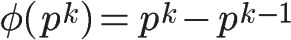

比如 φ(8) = φ(2^3) =2^3 - 2^2 = 8 -4 = 4。

这是因为只有当一个数不包含质数 p，才可能与 n 互质。而包含质数 p 的数一共有 p^(k-1)个，即 1×p、2×p、3×p、...、p^(k-1)×p，把它们去除，剩下的就是与 n 互质的数。

上面的式子还可以写成下面的形式：

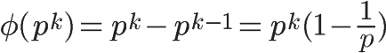

可以看出，上面的第二种情况是 k=1 时的特例。

**第四种情况**

如果 n 可以分解成两个互质的整数之积，

```
    n = p1 × p2
```

则

```
    φ(n) = φ(p1p2) = φ(p1)φ(p2)
```

即积的欧拉函数等于各个因子的欧拉函数之积。比如，φ(56)=φ(8×7)=φ(8)×φ(7)=4×6=24。

这一条的证明要用到"中国剩余定理"，这里就不展开了，只简单说一下思路：如果 a 与 p1 互质(a<p1)，b 与 p2 互质(b<p2)，c 与 p1p2 互质(c<p1p2)，则 c 与数对 (a,b) 是一一对应关系。由于 a 的值有 φ(p1) 种可能，b 的值有 φ(p2) 种可能，则数对 (a,b) 有 φ(p1)φ(p2) 种可能，而 c 的值有 φ(p1p2) 种可能，所以 φ(p1p2) 就等于 φ(p1)φ(p2)。

**第五种情况**

因为任意一个大于 1 的正整数，都可以写成一系列质数的积。

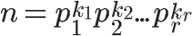

根据第 4 条的结论，得到

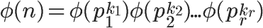

再根据第 3 条的结论，得到

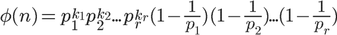

也就等于

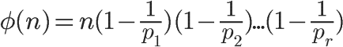

这就是欧拉函数的通用计算公式。比如，1323 的欧拉函数，计算过程如下：

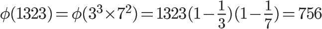

# 欧拉定理

欧拉函数的用处，在于欧拉定理。"欧拉定理"指的是：

> 如果两个正整数 a 和 n 互质，则 n 的欧拉函数 φ(n) 可以让下面的等式成立：

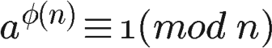

也就是说，a 的 φ(n) 次方被 n 除的余数为 1。或者说，a 的 φ(n) 次方减去 1，可以被 n 整除。比如，3 和 7 互质，而 7 的欧拉函数 φ(7) 等于 6，所以 3 的 6 次方（729）减去 1，可以被 7 整除（728/7=104）。

欧拉定理的证明比较复杂，这里就省略了。我们只要记住它的结论就行了。

欧拉定理可以大大简化某些运算。比如，7 和 10 互质，根据欧拉定理，

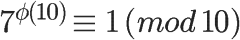

已知 φ(10) 等于 4，所以马上得到 7 的 4 倍数次方的个位数肯定是 1。

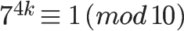

因此，7 的任意次方的个位数（例如 7 的 222 次方），心算就可以算出来。

欧拉定理有一个特殊情况。

> 假设正整数 a 与质数 p 互质，因为质数 p 的 φ(p)等于 p-1，则欧拉定理可以写成

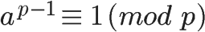

这就是著名的费马小定理。它是欧拉定理的特例。

欧拉定理是 RSA 算法的核心。理解了这个定理，就可以理解 RSA。

# 模反元素

还剩下最后一个概念：

> 如果两个正整数 a 和 n 互质，那么一定可以找到整数 b，使得 ab-1 被 n 整除，或者说 ab 被 n 除的余数是 1。

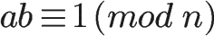

> 这时，b 就叫做 a 的"模反元素"。

比如，3 和 11 互质，那么 3 的模反元素就是 4，因为 (3 × 4)-1 可以被 11 整除。显然，模反元素不止一个， 4 加减 11 的整数倍都是 3 的模反元素 {...,-18,-7,4,15,26,...}，即如果 b 是 a 的模反元素，则 b+kn 都是 a 的模反元素。

欧拉定理可以用来证明模反元素必然存在。

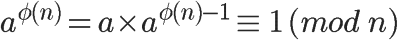

可以看到，a 的 φ(n)-1 次方，就是 a 的模反元素。

---

好了，需要用到的数学工具，全部介绍完了。RSA 算法涉及的数学知识，就是上面这些，下一次我就来介绍公钥和私钥到底是怎么生成的。

有了这些知识，我们就可以看懂 RSA 算法。这是目前地球上最重要的加密算法。

# 密钥生成的步骤

我们通过一个例子，来理解 RSA 算法。假设爱丽丝要与鲍勃进行加密通信，她该怎么生成公钥和私钥呢？

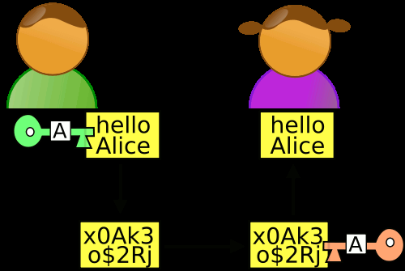

**第一步，随机选择两个不相等的质数 p 和 q。**

爱丽丝选择了 61 和 53。（实际应用中，这两个质数越大，就越难破解。）

**第二步，计算 p 和 q 的乘积 n。**

爱丽丝就把 61 和 53 相乘。

```
    n = 61×53 = 3233
```

n 的长度就是密钥长度。3233 写成二进制是 110010100001，一共有 12 位，所以这个密钥就是 12 位。实际应用中，RSA 密钥一般是 1024 位，重要场合则为 2048 位。

**第三步，计算 n 的欧拉函数 φ(n)。**

根据公式：

```
    φ(n) = (p-1)(q-1)
```

爱丽丝算出 φ(3233)等于 60×52，即 3120。

**第四步，随机选择一个整数 e，条件是 1< e < φ(n)，且 e 与 φ(n) 互质。**

爱丽丝就在 1 到 3120 之间，随机选择了 17。（实际应用中，常常选择 65537。）

**第五步，计算 e 对于 φ(n)的模反元素 d。**

所谓"模反元素"就是指有一个整数 d，可以使得 ed 被 φ(n)除的余数为 1。

```
    ed ≡ 1 (mod φ(n))
```

这个式子等价于

```
    ed - 1 = kφ(n)
```

于是，找到模反元素 d，实质上就是对下面这个二元一次方程求解。

```
    ex + φ(n)y = 1
```

已知 e=17, φ(n)=3120，

```
    17x + 3120y = 1
```

这个方程可以用"扩展欧几里得算法"求解，此处省略具体过程。总之，爱丽丝算出一组整数解为 (x,y)=(2753,-15)，即 d=2753。

至此所有计算完成。

**第六步，将 n 和 e 封装成公钥，n 和 d 封装成私钥。**

在爱丽丝的例子中，n=3233，e=17，d=2753，所以公钥就是 (3233,17)，私钥就是（3233, 2753）。

实际应用中，公钥和私钥的数据都采用 ASN.1 格式表达（实例）。

# RSA 算法的可靠性

回顾上面的密钥生成步骤，一共出现六个数字：

```
　　p
　　q
　　n
　　φ(n)
　　e
　　d
```

这六个数字之中，公钥用到了两个（n 和 e），其余四个数字都是不公开的。其中最关键的是 d，因为 n 和 d 组成了私钥，一旦 d 泄漏，就等于私钥泄漏。

**那么，有无可能在已知 n 和 e 的情况下，推导出 d？**

```
（1）ed≡1 (mod φ(n))。只有知道 e 和 φ(n)，才能算出 d。

（2）φ(n)=(p-1)(q-1)。只有知道 p 和 q，才能算出 φ(n)。

（3）n=pq。只有将 n 因数分解，才能算出 p 和 q。
```

**结论：如果 n 可以被因数分解，d 就可以算出，也就意味着私钥被破解。**

可是，大整数的因数分解，是一件非常困难的事情。目前，除了暴力破解，还没有发现别的有效方法。维基百科这样写道：

> "对极大整数做因数分解的难度决定了 RSA 算法的可靠性。换言之，对一极大整数做因数分解愈困难，RSA 算法愈可靠。

> 假如有人找到一种快速因数分解的算法，那么 RSA 的可靠性就会极度下降。但找到这样的算法的可能性是非常小的。今天只有短的 RSA 密钥才可能被暴力破解。到 2008 年为止，世界上还没有任何可靠的攻击 RSA 算法的方式。

> 只要密钥长度足够长，用 RSA 加密的信息实际上是不能被解破的。"

举例来说，你可以对 3233 进行因数分解（61×53），但是你没法对下面这个整数进行因数分解。

```

　　12301866845301177551304949
　　58384962720772853569595334
　　79219732245215172640050726
　　36575187452021997864693899
　　56474942774063845925192557
　　32630345373154826850791702
　　61221429134616704292143116
　　02221240479274737794080665
　　351419597459856902143413
```

它等于这样两个质数的乘积：

```

　　33478071698956898786044169
　　84821269081770479498371376
　　85689124313889828837938780
　　02287614711652531743087737
　　814467999489
　　　　×
　　36746043666799590428244633
　　79962795263227915816434308
　　76426760322838157396665112
　　79233373417143396810270092
　　798736308917
```

事实上，这大概是人类已经分解的最大整数（232 个十进制位，768 个二进制位）。比它更大的因数分解，还没有被报道过，因此目前被破解的最长 RSA 密钥就是 768 位。

# 加密和解密

有了公钥和密钥，就能进行加密和解密了。

**（1）加密要用公钥 (n,e)**

假设鲍勃要向爱丽丝发送加密信息 m，他就要用爱丽丝的公钥 (n,e) 对 m 进行加密。这里需要注意，m 必须是整数（字符串可以取 ascii 值或 unicode 值），且 m 必须小于 n。

所谓"加密"，就是算出下式的 c：

```
    me ≡ c (mod n)
```

爱丽丝的公钥是 (3233, 17)，鲍勃的 m 假设是 65，那么可以算出下面的等式：

```
    6517 ≡ 2790 (mod 3233)
```

于是，c 等于 2790，鲍勃就把 2790 发给了爱丽丝。

**（2）解密要用私钥(n,d)**

爱丽丝拿到鲍勃发来的 2790 以后，就用自己的私钥(3233, 2753) 进行解密。可以证明，下面的等式一定成立：

```
    cd ≡ m (mod n)
```

也就是说，c 的 d 次方除以 n 的余数为 m。现在，c 等于 2790，私钥是(3233, 2753)，那么，爱丽丝算出

```
    27902753 ≡ 65 (mod 3233)
```

因此，爱丽丝知道了鲍勃加密前的原文就是 65。

至此，"加密--解密"的整个过程全部完成。

我们可以看到，如果不知道 d，就没有办法从 c 求出 m。而前面已经说过，要知道 d 就必须分解 n，这是极难做到的，所以 RSA 算法保证了通信安全。

你可能会问，公钥(n,e) 只能加密小于 n 的整数 m，那么如果要加密大于 n 的整数，该怎么办？有两种解决方法：一种是把长信息分割成若干段短消息，每段分别加密；另一种是先选择一种"对称性加密算法"（比如 DES），用这种算法的密钥加密信息，再用 RSA 公钥加密 DES 密钥。

# 私钥解密的证明

最后，我们来证明，为什么用私钥解密，一定可以正确地得到 m。也就是证明下面这个式子：

```
    cd ≡ m (mod n)
```

因为，根据加密规则

```
    ｍe ≡ c (mod n)
```

于是，c 可以写成下面的形式：

```
    c = me - kn
```

将 c 代入要我们要证明的那个解密规则：

```
    (me - kn)d ≡ m (mod n)
```

它等同于求证

```
    med ≡ m (mod n)
```

由于

```
    ed ≡ 1 (mod φ(n))
```

所以

```
    ed = hφ(n)+1
```

将 ed 代入：

```
    mhφ(n)+1 ≡ m (mod n)
```

接下来，分成两种情况证明上面这个式子。

**（1）m 与 n 互质。**

根据欧拉定理，此时

```
    mφ(n) ≡ 1 (mod n)
```

得到

```
    (mφ(n))h × m ≡ m (mod n)
```

原式得到证明。

**（2）m 与 n 不是互质关系。**

此时，由于 n 等于质数 p 和 q 的乘积，所以 m 必然等于 kp 或 kq。

以 m = kp 为例，考虑到这时 k 与 q 必然互质，则根据欧拉定理，下面的式子成立：

```
    (kp)q-1 ≡ 1 (mod q)
```

进一步得到

```
    [(kp)q-1]h(p-1) × kp ≡ kp (mod q)
```

即

```
    (kp)ed ≡ kp (mod q)
```

将它改写成下面的等式

```
    (kp)ed = tq + kp
```

这时 t 必然能被 p 整除，即 t=t'p

```
    (kp)ed = t'pq + kp
```

因为 m=kp，n=pq，所以

```
    med ≡ m (mod n)
```

原式得到证明。
