> 转载自：https://www.mzihen.com/how-to-install-ubuntu-18-04-lts-with-windows-10-on-uefi/
<!-- TOC -->

- [一、制作支持UEFI启动的Ubuntu USB启动盘](#一制作支持uefi启动的ubuntu-usb启动盘)
- [二、Windows10中的设置](#二windows10中的设置)
- [三、分区](#三分区)
- [四、安装Ubuntu系统](#四安装ubuntu系统)
- [存在的问题。](#存在的问题)

<!-- /TOC -->
# 一、制作支持UEFI启动的Ubuntu USB启动盘
我使用了开源软件Rufus（[Rufus官网](https://rufus.akeo.ie/?locale=zh_CN)）创建的USB启动盘，Ubuntu使用了最新版的Ubuntu 18.04.1 LTS（[ubuntu官网](https://www.ubuntu.com/download/desktop)）。

现有台式机是SSD硬盘加机械硬盘，win10系统安装在SSD硬盘，SSD是MBR分区的，机械硬盘是GPT分区，主板使用的UEFI启动模式。因为要将Ubuntu安装在机械硬盘上，所以制作启动盘选择的 **分区类型选择GPT，目标系统类型选择UEFI(非CSM)** ，其它都按照我设置的即可，如下图。

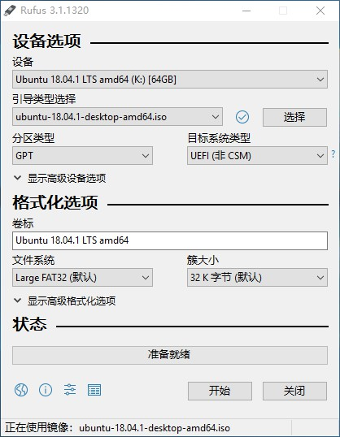

需要注意的是，建议使用新版本的Ubuntu，因为低版本的Ubuntu不支持UEFI+GPT，比如Ubuntu16.04 386（32bit），而Ubuntu 18.04版本是64位的，支持UEFI+GPT。

# 二、Windows10中的设置
在“控制面板\硬件和声音\电源选项\系统设置”去掉勾选“启用快速启动（推荐）”

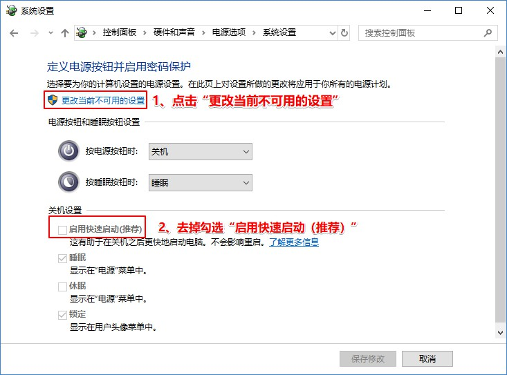

取消”启用快速启动(推荐)”的原因是： “快速启动”是Windows8时代引进的新特性，“快速启动”会影响Grub开机引导过程，可能出现无法载入Ubuntu的状况，最后选择“保存修改”。（[点击浏览更多…](https://www.jianshu.com/p/0ccf1778d8ae)）

另外还要禁用主板上的“安全启动（Secure Boot）”，而我的主板B150-Plus安全启动是默认勾选且灰色不可修改的，便没有更改此项。但是可以选择Windows系统或者其它操作系统。

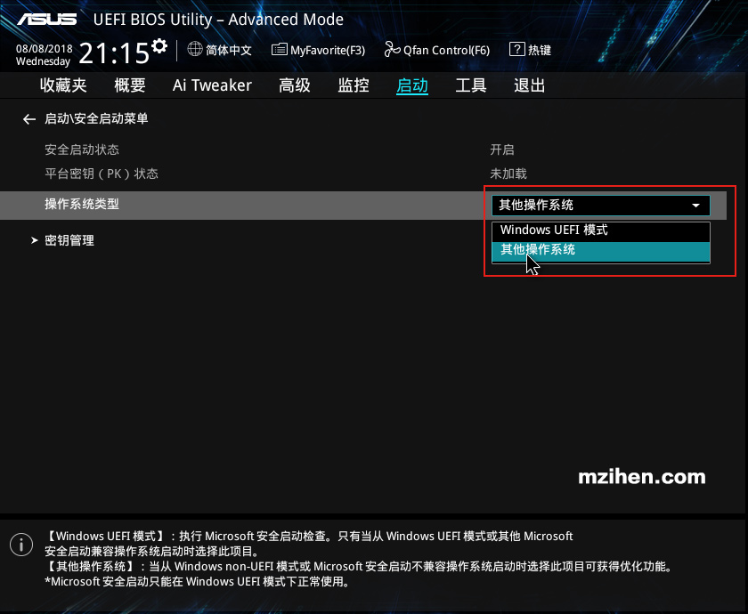

# 三、分区
准备工作：备份好数据。
使用软件DiskGenius（[官网](http://www.diskgenius.cn/)）将机械硬盘第一个分区压缩出80G空闲区出来，网上有说30G就够了，具体看硬盘容量情况。

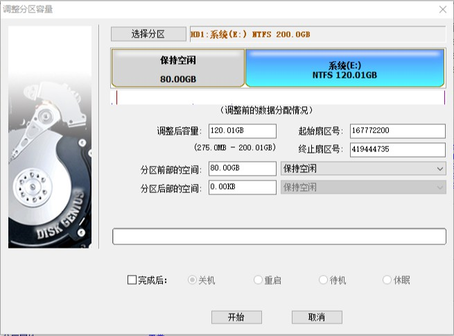

# 四、安装Ubuntu系统
进入BIOS，设置boot启动选项，选择从U盘启动，或者第一启动盘为U盘，保存并退出。
进入Ubuntu安装界面，有提示试用还是安装。我先进入了试用界面，然后在试用界面里选择的安装。

选择好语言，点击继续。

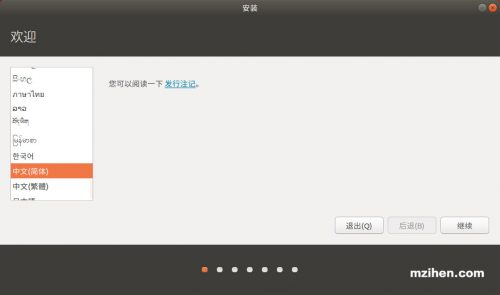

选择好键盘布局，点击继续。

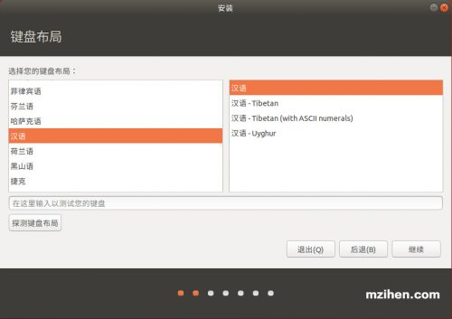

这里选择“正常安装”，在其他选项中，如果网络不好或者想安装速度快一些，不勾选“安装 Ubuntu时下载更新”。

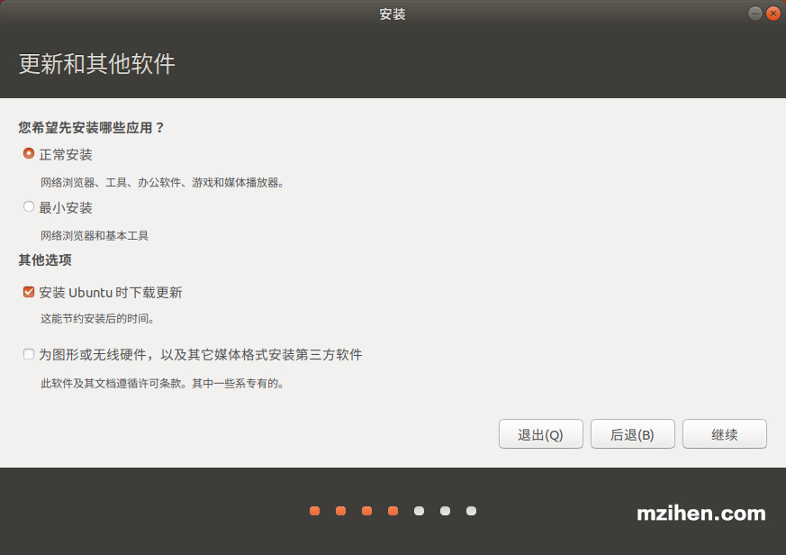

因为是安装到指定盘里，并不是全新安装，也不希望清除掉硬盘里其它分区的数据，所以这里选择“其他选项”。

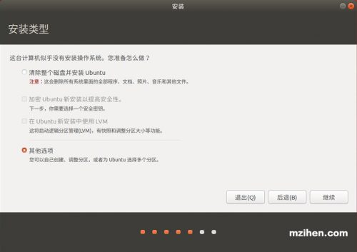

选择“其他选项”后，开始给硬盘进行分区。跟安装Windows类似，Windows会自动分成几个隐藏的区：450 MB恢复分区、100 MB系统分区和16 MB的MSR (保留)分区，Ubuntu略微不同，需要手动划分。

一般Linux设置4个分区：

> / ：根分区，一般分8G就可以，如果磁盘空间足够，10G~16G也可以，甚至有人分了30G，这里最好选择30G。

> swap ：交换空间，即虚拟内存，建议是你机器的物理内存小于1G的话虚拟内存设置为物理内存的2倍；如果物理内存大于1G，建议在物理内存的基础上加2G，最大不要超过两倍。我的物理内存是16g，只要20g足矣。因磁盘空间又够，所以分了32G。

> /boot ：启动分区，系统的启动文件，大小一般分200M。

> ~~efi ：EFI系统分区，系统的启动文件，大小一般分200M。~~

> /home ：home目录，文件分区，存放个人文件，分完其他所有区之后，剩下的空间全部给它即可。

我第一次设置了/boot分区而不是设置的efi分区，出现了错误：

>> 在复制系统文件的时候出现了“无法将 grub-efi-amd64-signed 软件包安装到 /target/中。如果没有 GRUB 启动引导器，所安装的系统将无法启动。”

重新安装了两次出现一样的错误结果。参考[知乎上这个答案后](https://www.zhihu.com/question/36811339)，使用eif系统分区取代了boot分区，最后安装成功。后面截图有出现错误的地方

选择125G的空闲区（前文分了80G的空闲区，再加上其它的空闲区，有了125G多点），点击下面“+”号，添加/分区，依次选择 大小10240MB（10GB）、主分区、空间起始位置，Ext4日志文件系统、挂载点/，然后点击OK。

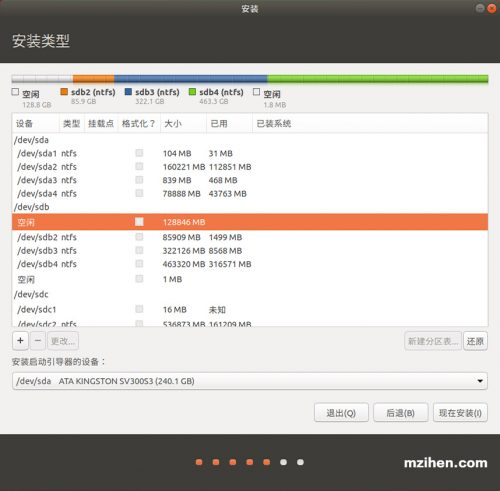

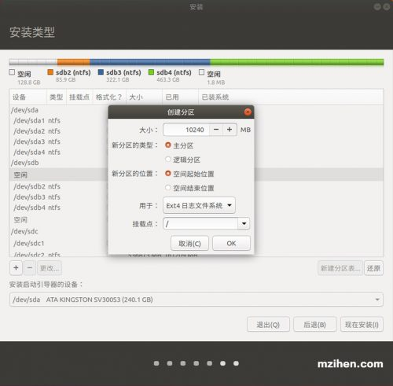

继续点击“+”号，添加swap分区（交换分区），大小填32768MB（32G），（如果你的物理内存是16G，建议此处填写20480MB（20G）），逻辑分区，空间起始位置，交换空间，点击OK。

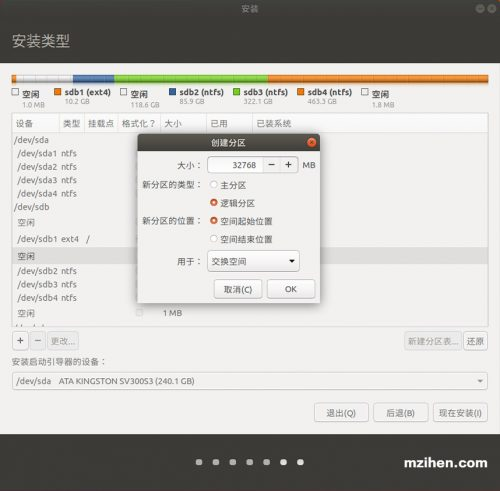

点击“+”号，添加EFI系统分区，大小200MB，逻辑分区，空间起始位置，EFI系统分区，点击OK。

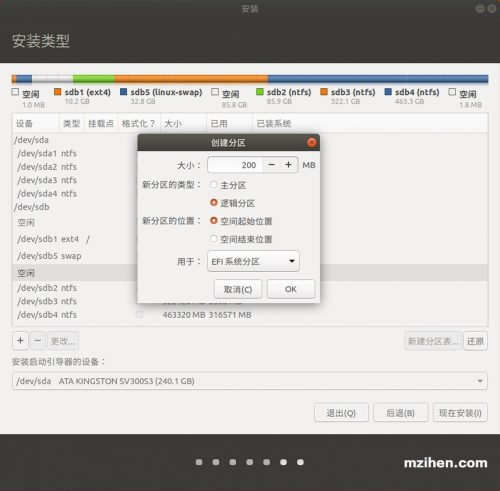

点击“+”号，添加/home分区，大小直接默认，也就是剩余的所有空间，逻辑分区，空间起始位置，挂载点选择/home，点击OK。

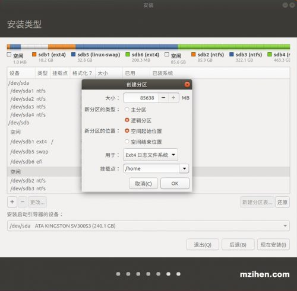

注意最下面的“安装启动引导器的设备”，要选择跟efi一致，选择好后点击现在安装。

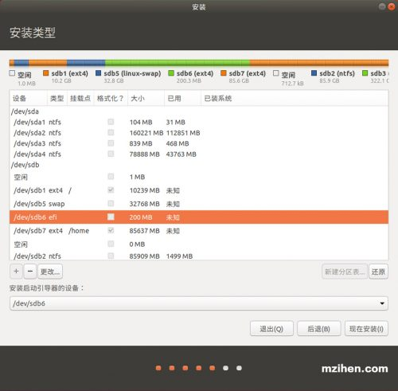

接下来就提示哪些分区被会操作。

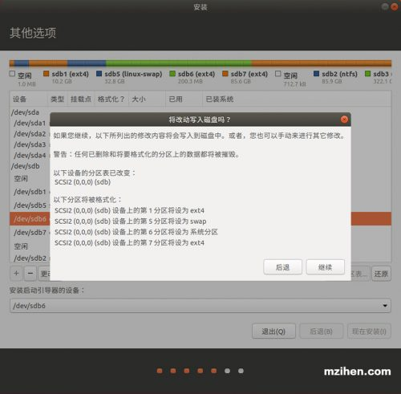

你在什么地方，选择shanghai，也可依据自己需要选择其它地区。

填写用户名和密码。

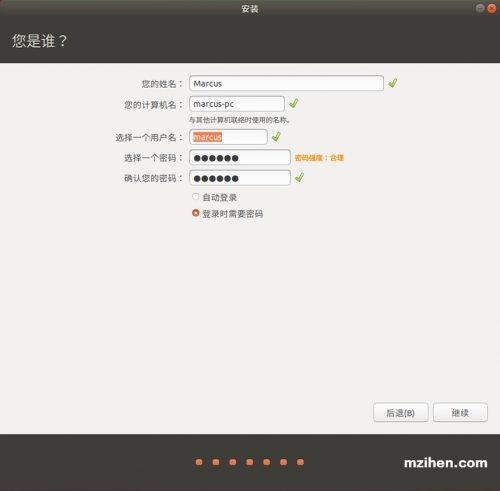

接下来就静静等待安装即可。

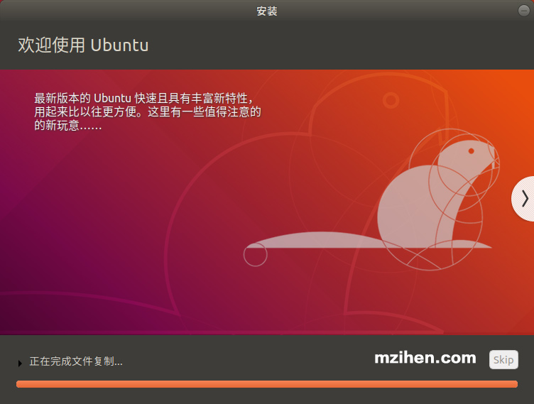

下面一个截图是特地截取的，前几次安装都是失败在此处。前面有错误说明

安装成功。因为在试用界面安装的Ubuntu，所以会提示继续试用，还是重启。

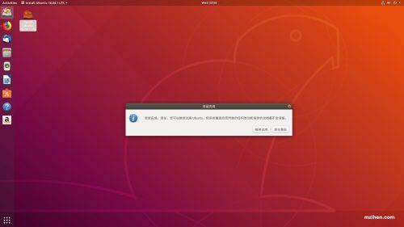

重启，按住del键进入BIOS，将Ubuntu系统所在的硬盘拖到第一位，保存并退出，就会进入Ubuntu系统。

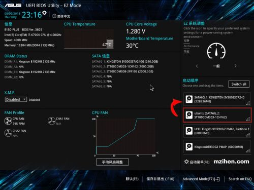

删掉分区，只设置了EFI系统分区，系统完全可以安装，且Windows10可见4个区分。

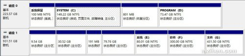

# 存在的问题。

1、Ubuntu 18.04.1 LTS下建 /boot 和 分区是无效的，需要建EFI系统分区。

2、有人将启动引导向设置在wi10的启动引导分区里，而我是单独建了一个引导分区，导致的结果就是开机直接进入系统，如果要切换Window10系统，需要到BIOS里切换。

3、进入系统后经常死机，可能跟显卡驱动有关，可以去更新显卡驱动，选择（tested)。