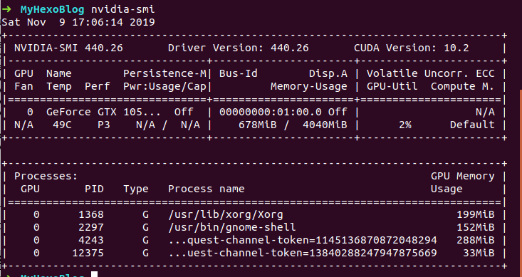
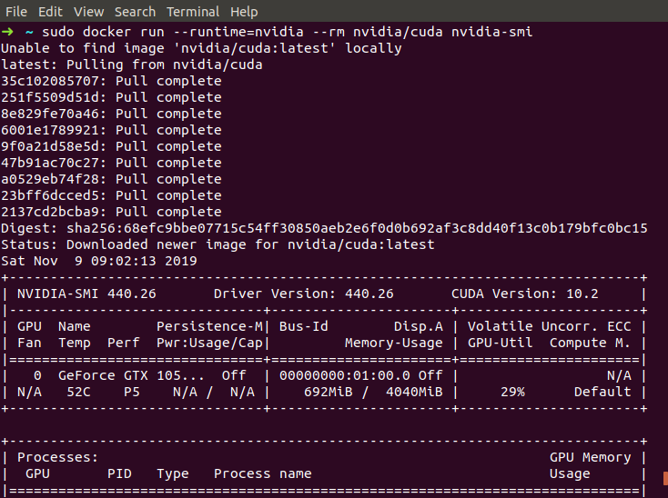
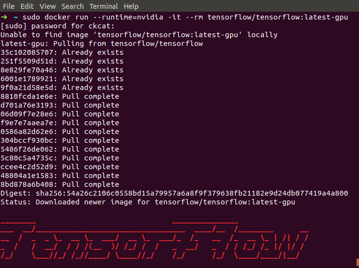
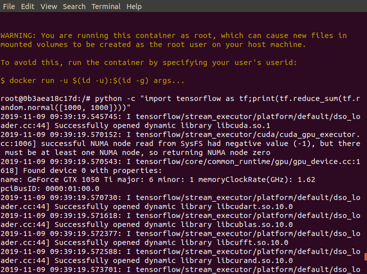

<!-- TOC -->

- [一、安装nvidia显卡驱动](#一安装nvidia显卡驱动)
  - [1. 首先，将ppa:graphics-drivers/ppa存储库添加到您的系统中：](#1-首先将ppagraphics-driversppa存储库添加到您的系统中)
  - [2. 接下来，确定您的图形卡型号和推荐的驱动程序：](#2-接下来确定您的图形卡型号和推荐的驱动程序)
  - [3. 与上面的标准Ubuntu存储库示例相同，可以自动安装所有推荐的驱动程序：](#3-与上面的标准ubuntu存储库示例相同可以自动安装所有推荐的驱动程序)
  - [4. 完成后，重新启动系统。](#4-完成后重新启动系统)
- [二、安装docker](#二安装docker)
  - [1. 设置Docker存储库](#1-设置docker存储库)
    - [1. 更新apt包索引：](#1-更新apt包索引)
    - [2. 安装软件包以允许apt通过HTTPS使用存储库：](#2-安装软件包以允许apt通过https使用存储库)
    - [3. 添加Docker的官方GPG密钥：](#3-添加docker的官方gpg密钥)
    - [4. 使用以下命令来设置稳定的存储库。](#4-使用以下命令来设置稳定的存储库)
  - [2. 安装DOCKER ENGINE-社区](#2-安装docker-engine-社区)
    - [1. 更新apt包索引。](#1-更新apt包索引-1)
    - [2. 安装最新版本的Docker Engine-Community和containerd，或者转到下一步安装特定版本：](#2-安装最新版本的docker-engine-community和containerd或者转到下一步安装特定版本)
    - [3. 要安装特定版本的Docker Engine-Community，请在存储库中列出可用版本，然后选择并安装：](#3-要安装特定版本的docker-engine-community请在存储库中列出可用版本然后选择并安装)
    - [4. 通过运行hello-world 映像来验证是否正确安装了Docker Engine-Community 。](#4-通过运行hello-world-映像来验证是否正确安装了docker-engine-community-)
- [三、`nvidia-docker`和`nvidia-container-runtime`安装和配置](#三nvidia-docker和nvidia-container-runtime安装和配置)
  - [1. 安装`nvidia-docker` 。](#1-安装nvidia-docker-)
  - [2. 安装nvidia-container-runtime](#2-安装nvidia-container-runtime)
  - [3. Docker引擎配置](#3-docker引擎配置)
    - [1. Systemd drop-in file](#1-systemd-drop-in-file)
    - [2. Daemon configuration file](#2-daemon-configuration-file)
- [四、配置tensorflow](#四配置tensorflow)
  - [1. 验证 nvidia-docker 安装](#1-验证-nvidia-docker-安装)
  - [2. 下载并运行支持 `GPU` 的 `TensorFlow` 映像](#2-下载并运行支持-gpu-的-tensorflow-映像)
    - [1. 下载支持 `GPU` 的 `TensorFlow` 映像](#1-下载支持-gpu-的-tensorflow-映像)
    - [2. 环境测试](#2-环境测试)
    - [3. 使用最新的 TensorFlow GPU 映像在容器中启动 bash shell 会话](#3-使用最新的-tensorflow-gpu-映像在容器中启动-bash-shell-会话)
- [五、通过软链接修改Docker配置本地镜像与容器的存储位置](#五通过软链接修改docker配置本地镜像与容器的存储位置)
- [六、使用非root用户运行docker](#六使用非root用户运行docker)

<!-- /TOC -->
# 一、安装nvidia显卡驱动

## 1. 首先，将ppa:graphics-drivers/ppa存储库添加到您的系统中：
```bash
$ sudo add-apt-repository ppa:graphics-drivers/ppa
$ sudo apt update
```

## 2. 接下来，确定您的图形卡型号和推荐的驱动程序：
```bash
$ ubuntu-drivers devices
== /sys/devices/pci0000:00/0000:00:01.0/0000:01:00.0 ==
modalias : pci:v000010DEd00001C8Csv00001558sd000055A1bc03sc00i00
vendor   : NVIDIA Corporation
model    : GP107M [GeForce GTX 1050 Ti Mobile]
driver   : nvidia-driver-415 - third-party free
driver   : nvidia-driver-390 - third-party free
driver   : nvidia-driver-440 - third-party free recommended
driver   : nvidia-driver-430 - distro non-free
driver   : nvidia-driver-410 - third-party free
driver   : nvidia-driver-435 - distro non-free
driver   : xserver-xorg-video-nouveau - distro free builtin
```

## 3. 与上面的标准Ubuntu存储库示例相同，可以自动安装所有推荐的驱动程序：
```
$ sudo ubuntu-drivers autoinstall
```
或选择性地使用`apt`命令。例：
```
$ sudo apt install nvidia-410
```
## 4. 完成后，重新启动系统。

使用`nvidia-smi`查看显卡信息：



> 参考连接：https://linuxconfig.org/how-to-install-the-nvidia-drivers-on-ubuntu-18-04-bionic-beaver-linux


# 二、安装docker
## 1. 设置Docker存储库

### 1. 更新apt包索引：
```
$ sudo apt-get update
```

### 2. 安装软件包以允许apt通过HTTPS使用存储库：
```
$ sudo apt-get install \
    apt-transport-https \
    ca-certificates \
    curl \
    gnupg-agent \
    software-properties-common
```

### 3. 添加Docker的官方GPG密钥：
```
$ curl -fsSL https://download.docker.com/linux/ubuntu/gpg | sudo apt-key add -
```
通过搜索指纹的后8个字符，验证您现在是否拥有带有指纹的密钥 `9DC8 5822 9FC7 DD38 854A E2D8 8D81 803C 0EBF CD88`。
```
$ sudo apt-key fingerprint 0EBFCD88
    
pub   rsa4096 2017-02-22 [SCEA]
      9DC8 5822 9FC7 DD38 854A  E2D8 8D81 803C 0EBF CD88
uid           [ unknown] Docker Release (CE deb) <docker@docker.com>
sub   rsa4096 2017-02-22 [S]
```

### 4. 使用以下命令来设置稳定的存储库。
```
$ sudo add-apt-repository \
   "deb [arch=amd64] https://download.docker.com/linux/ubuntu \
   $(lsb_release -cs) \
   stable"
```

## 2. 安装DOCKER ENGINE-社区
### 1. 更新apt包索引。
```
$ sudo apt-get update
```

### 2. 安装最新版本的Docker Engine-Community和containerd，或者转到下一步安装特定版本：
```
$ sudo apt-get install docker-ce docker-ce-cli containerd.io
```

### 3. 要安装特定版本的Docker Engine-Community，请在存储库中列出可用版本，然后选择并安装：

* 列出您的仓库中可用的版本：
```
$ apt-cache madison docker-ce

  docker-ce | 5:18.09.1~3-0~ubuntu-xenial | https://download.docker.com/linux/ubuntu  xenial/stable amd64 Packages
  docker-ce | 5:18.09.0~3-0~ubuntu-xenial | https://download.docker.com/linux/ubuntu  xenial/stable amd64 Packages
  docker-ce | 18.06.1~ce~3-0~ubuntu       | https://download.docker.com/linux/ubuntu  xenial/stable amd64 Packages
  docker-ce | 18.06.0~ce~3-0~ubuntu       | https://download.docker.com/linux/ubuntu  xenial/stable amd64 Packages
  ...
```

* 使用第二列中的版本字符串安装特定版本，例如`5:18.09.1~3-0~ubuntu-xenial`。
```
$ sudo apt-get install docker-ce=<VERSION_STRING> docker-ce-cli=<VERSION_STRING> containerd.io
```

### 4. 通过运行hello-world 映像来验证是否正确安装了Docker Engine-Community 。
```
$ sudo docker run hello-world
```
此命令下载测试镜像并在容器中运行。容器运行时，它会打印参考消息并退出。

> 参考：https://docs.docker.com/install/linux/docker-ce/ubuntu/

# 三、`nvidia-docker`和`nvidia-container-runtime`安装和配置

## 1. 安装`nvidia-docker` 。
```
# Add the package repositories
$ distribution=$(. /etc/os-release;echo $ID$VERSION_ID)
$ curl -s -L https://nvidia.github.io/nvidia-docker/gpgkey | sudo apt-key add -
$ curl -s -L https://nvidia.github.io/nvidia-docker/$distribution/nvidia-docker.list | sudo tee /etc/apt/sources.list.d/nvidia-docker.list

$ sudo apt-get update && sudo apt-get install -y nvidia-container-toolkit
$ sudo systemctl restart docker
```

## 2. 安装nvidia-container-runtime
```
sudo yum install nvidia-container-runtime
```

## 3. Docker引擎配置
### 1. Systemd drop-in file
```
sudo mkdir -p /etc/systemd/system/docker.service.d
sudo tee /etc/systemd/system/docker.service.d/override.conf <<EOF
[Service]
ExecStart=
ExecStart=/usr/bin/dockerd --host=fd:// --add-runtime=nvidia=/usr/bin/nvidia-container-runtime
EOF
sudo systemctl daemon-reload
sudo systemctl restart docker
```

### 2. Daemon configuration file
```
sudo tee /etc/docker/daemon.json <<EOF
{
    "runtimes": {
        "nvidia": {
            "path": "/usr/bin/nvidia-container-runtime",
            "runtimeArgs": []
        }
    }
}
EOF
sudo pkill -SIGHUP dockerd
```

> 参考：
> 
> https://github.com/NVIDIA/nvidia-docker
> 
> https://github.com/nvidia/nvidia-container-runtime


# 四、配置tensorflow

## 1. 验证 nvidia-docker 安装
```
$ sudo docker run --runtime=nvidia --rm nvidia/cuda nvidia-smi
```


## 2. 下载并运行支持 `GPU` 的 `TensorFlow` 映像
### 1. 下载支持 `GPU` 的 `TensorFlow` 映像
```
$ sudo docker run --runtime=nvidia -it --rm tensorflow/tensorflow:latest-gpu
```


### 2. 环境测试
```
python -c "import tensorflow as tf;print(tf.reduce_sum(tf.random.normal([1000, 1000])))"
```


### 3. 使用最新的 TensorFlow GPU 映像在容器中启动 bash shell 会话
```
$ sudo docker run --runtime=nvidia -it tensorflow/tensorflow:latest-gpu bash
```

> 参考：https://www.tensorflow.org/install/docker


# 五、通过软链接修改Docker配置本地镜像与容器的存储位置

默认情况下Docker的存放位置为：`/var/lib/docker` ,由于我的系统分区比较小，需要修改Docker配置本地镜像与容器的存储位置。

可以通过下面命令查看具体位置：
```
$ sudo docker info | grep "Docker Root Dir"
```
解决这个问题，最直接的方法当然是挂载分区到这个目录，但是我的数据盘还有其他东西，这肯定不好管理，所以采用修改镜像和容器的存放路径的方式达到目的。

这个方法里将通过软连接来实现。

首先停掉Docker服务：
```
$ sudo systemctl restart docker
或者
$ sudo service docker stop
```

然后移动整个/var/lib/docker目录到目的路径：
```
$ sudo sudo mv /var/lib/docker /root/data/docker
$ sudo ln -s /root/data/docker /var/lib/docker
```
这时候启动Docker时发现存储目录依旧是/var/lib/docker，但是实际上是存储在数据盘的，你可以在数据盘上看到容量变化。

# 六、使用非root用户运行docker
默认情况下，docker 命令会使用 Unix socket 与 Docker 主机通讯，安装完docker主机后默认会创建一个docke用户组。而只有 root 用户和 docker 组的用户才可以访问 Docker 主机的 Unix socket，所以需要把linux非root用户添加到docker组才能直接访问docker 主机。步骤如下：

1. 如果没有创建docker用户组，则需要先创建一个docket用户组。
```
$ sudo groupadd docker
```

2. 将指定的用户添加到docker用户组。
```
$ sudo usermod -aG docker userName
```
3. 重启docker服务
```
$ sudo service docker restart //或者 
$ sudo /etc/init.d/docker restart
```

4. 然后注销重登陆使用户组生效，或者使用以下命令直接登陆到docker组中。
```
 $ newgrp - docker //切换到docker用户组
```
> 参考：https://blog.csdn.net/wenwenxiong/article/details/78728696

