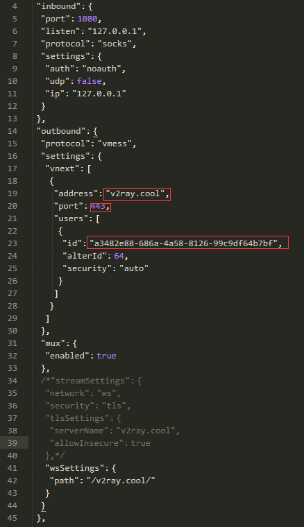

> 文章转载自：https://deng55.github.io/2017/12/04/Ubuntu%E7%8E%AF%E5%A2%83%E4%B8%8B%E4%BD%BF%E7%94%A8V2ray/
>
>https://www.imcaviare.com/2018-12-18-1/

<!-- TOC -->

- [1.安装v2ray](#1安装v2ray)
- [2.配置](#2配置)
  - [1. 启动服务](#1-启动服务)
- [3. 配置PAC](#3-配置pac)

<!-- /TOC -->
由于最近把系统换成了ubuntu，虽然已经用上了shadowsocks-qt5，但是本着折腾的态度，还是想把v2ray部署起来。
# 1.安装v2ray

安装的过程比较简单，可直接按照官方教程。

ubuntu系统下使用命令
```
bash <(curl -L -s https://install.direct/go.sh)
```

命令执行完之后，会自动生成如下文件：
```
    /usr/bin/v2ray/v2ray：V2Ray 程序；
    /etc/v2ray/config.json：配置文件；
```

# 2.配置

找了很多教程，在配置这一块都比较模糊，特别是linux环境下的配置。

很多教程说是去下载官方的`v2ray-core`包，之后的步骤就没详细说了，我也在这一块浪费了很多时间，部署起来后才知道确实是自己想复杂了

还记得我们第一步的安装过程吗，安装成功后会生成`/etc/v2ray/config.json`文件，其实在ubuntu系统下这个文件不需要，因为本身是当做客户端来使用的，这时候去看下载的核心包

下载核心包后，解压出来会有一些配置文件，核心包里面我们需要的文件是：`vpoint_socks_vmess.json` ，这个文件才是最终要使用的配置文件，把这个文件改名为`config.json`，并替换第一步安装的`/etc/v2ray/config.json`

vpoint_socks_vmess.json文件截图如下：


这就和windows下的配置是一样的了。

上面截图我有一块注释掉了，主要是不太了解这里的配置，不注释跑不起来

其实可以用偷懒的方法，如果之前在windows下部署过了，直接把config.json文件拿过来，放到`/etc/v2ray`目录下即可（删除该目录下原有的配置文件）
## 1. 启动服务

文件替换之后，就可以使用`service v2ray start`来启动 V2Ray 进程，chrome下配合SwitchyOmega扩展来使用，剩下的应该都会了。

使用以下命令启动 V2Ray:
```
sudo systemctl start v2ray
```
停止运行 V2Ray：
```
sudo systemctl stop v2ray
```
重启 V2Ray:
```
sudo systemctl restart v2ray
```
其他的命令可以参考官方文档，以上就是ubuntu下使用的办法了。

# 3. 配置PAC
安装
```
$ pip install genpac

# 从gfwlist生成代理信息为SOCKS5 127.0.0.1:1080的PAC文件
genpac --format=pac --pac-proxy="SOCKS5 127.0.0.1:1080" -o /etc/v2ray/autoproxy.pac
```
为避免不必要的bug请注意以下两点：

- 文件有足够的读写权限
- 配置URL以file://开头电脑根目录为起始。


