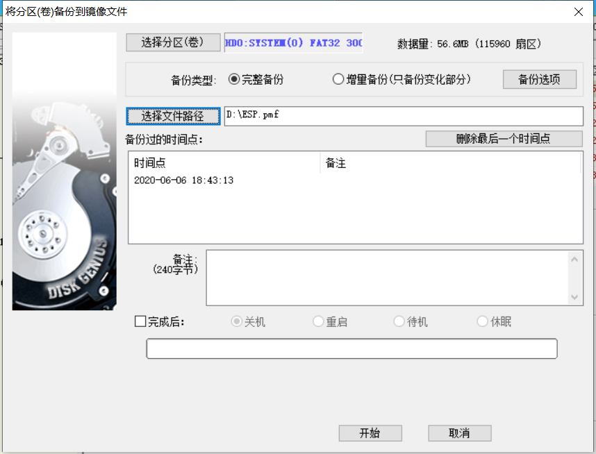
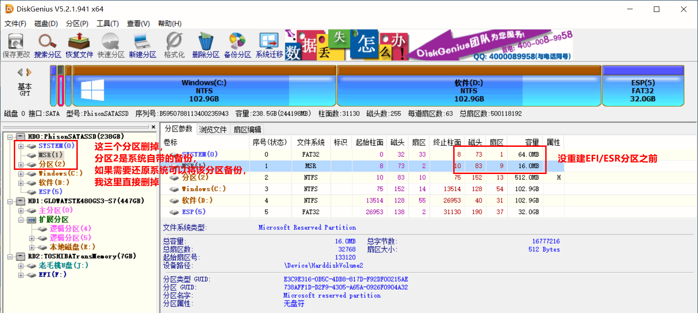
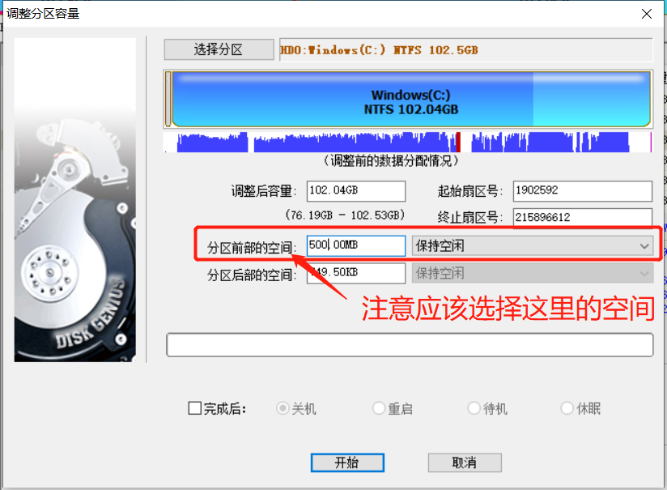
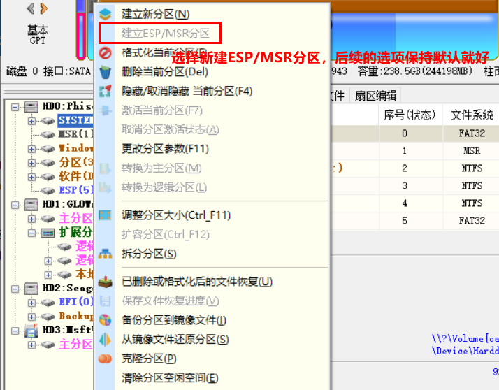
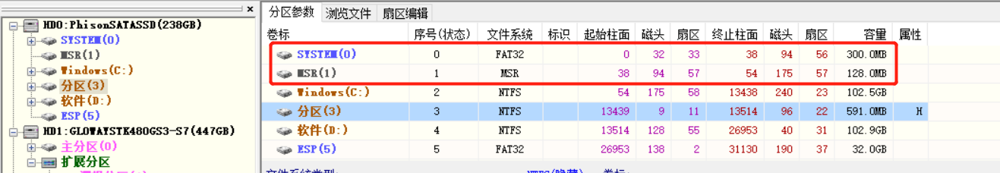
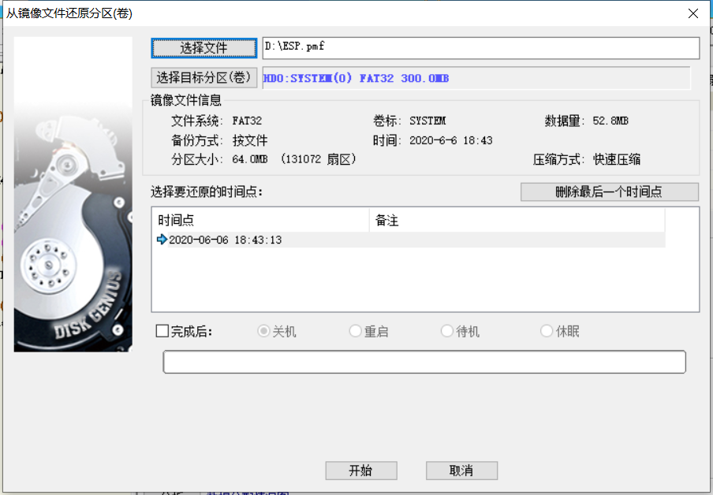
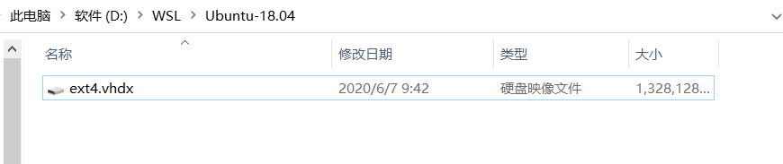

最近看到很多大佬对于wsl2的推崇，于是就想体验一番，将系统升级到2004，下面记录以下折腾过程。

<!-- TOC -->

- [1. 系统升级](#1-系统升级)
  - [1.1. 问题：我们无法更新系统保留的分区](#11-问题我们无法更新系统保留的分区)
  - [1.2. 解决办法](#12-解决办法)
    - [1.2.1. 备份EFI分区](#121-备份efi分区)
    - [1.2.2. 删除EFI/ESP 分区](#122-删除efiesp-分区)
    - [1.2.3. 扩大 EFI 分区](#123-扩大-efi-分区)
    - [1.2.4. 新建ESP/MSR分区](#124-新建espmsr分区)
    - [1.2.5. 还原 EFI 分区镜像](#125-还原-efi-分区镜像)
- [2. 安装 WSL2](#2-安装-wsl2)
  - [2.1. 第一步：启用虚拟机平台和 Linux 子系统功能](#21-第一步启用虚拟机平台和-linux-子系统功能)
  - [2.2. 启用 WSL2 并安装 linux 子系统](#22-启用-wsl2-并安装-linux-子系统)
  - [2.3. 自定义安装位置](#23-自定义安装位置)

<!-- /TOC -->


# 1. 系统升级
## 1.1. 问题：我们无法更新系统保留的分区
首先进行系统升级就出现了问题“我们无法更新系统保留的分区”，对于这个问题，网上很多人给的答案是 MSR(Microsoft Reserved)分区太小的问题，然而实际问题是ESP(EFI System Partition)分区 “EFI系统分区” 太小的原因，微软在这里所提示的系统保留的分区实际上是指“EFI系统分区”。

## 1.2. 解决办法
备份 EFI 系统分区，然后进入PE系统，删除EFI分区和MSR分区，将C盘空间分出500M空间给EFI分区和MSR分区，然后建立ESP/MSR分区，将备份的EFI分区还原就可以了。

下面说一下详细步骤：
### 1.2.1. 备份EFI分区
使用 DiskGenius 备份EFI分区，如下图：



### 1.2.2. 删除EFI/ESP 分区
进入PE系统删除 EFI 分区和 ESP 分区，我的电脑中存在一个系统还原的分区，由于我不需要系统还原，就直接删掉了，当然也可以备份，后续再还原。



### 1.2.3. 扩大 EFI 分区
将 C 盘空间分出 500M 给 EFI 分区，如果担心不够，你也可以多分一点。



### 1.2.4. 新建ESP/MSR分区
选择新建ESP/MSR分区，后续的选项保持默认就可以，可以看到分区比之前的要大一些了。





### 1.2.5. 还原 EFI 分区镜像
选中 EFI 分区，右键->从镜像文件还原分区，还原之前保存的 EFI 分区镜像。



重启系统，然后就可以愉快的升级了，记得C 盘空余空间保持在20G以上。

# 2. 安装 WSL2 

## 2.1. 第一步：启用虚拟机平台和 Linux 子系统功能
以管理员权限启动 PowerShell，然后输入以下命令启用虚拟机平台：
```
Enable-WindowsOptionalFeature -Online -FeatureName VirtualMachinePlatform
```

以管理员权限启动 PowerShell，然后输入以下命令启用 Linux 子系统功能：
```
Enable-WindowsOptionalFeature -Online -FeatureName Microsoft-Windows-Subsystem-Linux
```
在以上每一步命令执行完之后，PowerShell 中可能会提示你重新启动计算机。按“Y”可以重新启动。

以上操作可能需要先[更新 WSL 2 Linux 内核](https://docs.microsoft.com/zh-cn/windows/wsl/wsl2-kernel)。

## 2.2. 启用 WSL2 并安装 linux 子系统
使用以下命令可以在以后安装 Linux 的时候默认启用 WSL2：
```
wsl --set-default-version 2
```
去应用商店安装 linux 子系统，安装好后使用以下命令查看，可以看到 VESION 为 2 即为 wsl2 。
```
wsl --list --verbose
  NAME            STATE           VERSION
* Ubuntu-18.04    Stopped         2
```

## 2.3. 自定义安装位置
下载 [LxRunOffline](https://github.com/DDoSolitary/LxRunOffline/releases)，可以发现版本 v3.4.1 已经支持 wsl2 了。

执行 `LxRunOffline move -n {version} -d {dir}` ，将 Linux 移动到指定的目录。其中，`{version}`是版本号，可以通过 `LxRunOffline list` 来查看，`{dir}`是目标目录。

例如：
```
LxRunOffline.exe m -n Ubuntu-18.04 -d D:/WSL/Ubuntu-18.04
```
最终效果，如下图：



至此，整个折腾过程到此结束。

参考：
> https://docs.microsoft.com/en-us/windows/wsl/install-win10
> 
> https://blog.walterlv.com/post/how-to-install-wsl2.html
> 
> https://answers.microsoft.com/zh-hans/windows/forum/all/%E6%9B%B4%E6%96%B0windows10%E9%81%87%E5%88%B0/5bea3327-38e0-4c20-837a-90f156655e32
> 
> https://www.cnblogs.com/NBDWDYS2214143926/p/11543815.html
> 
> https://www.bilibili.com/read/cv1429071/