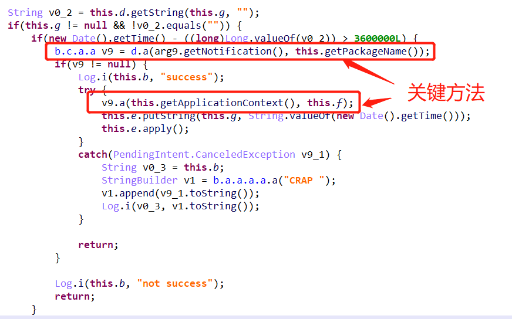
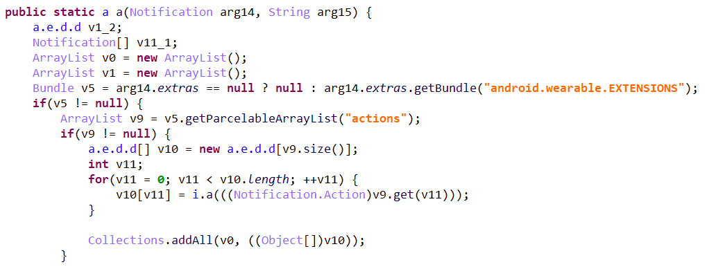
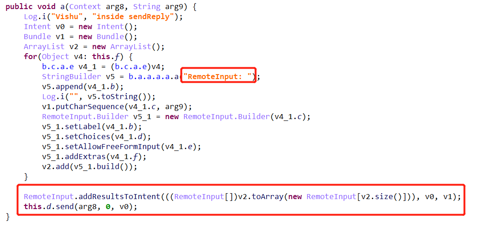
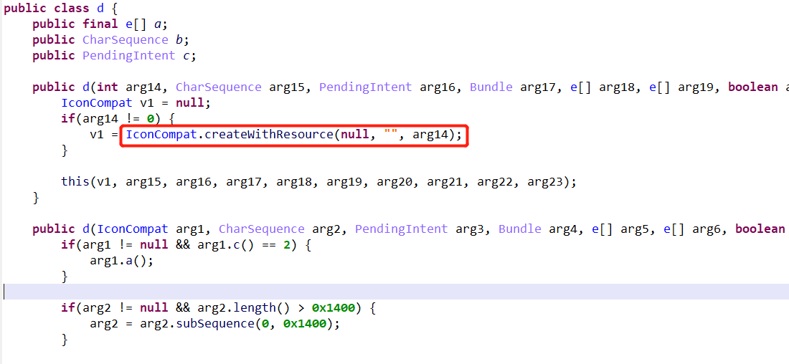
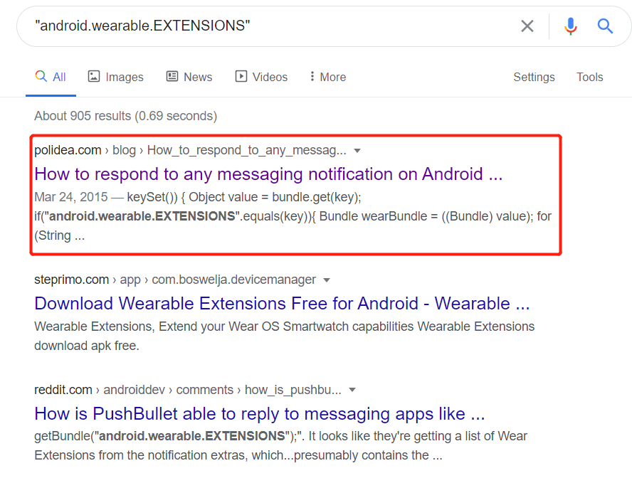
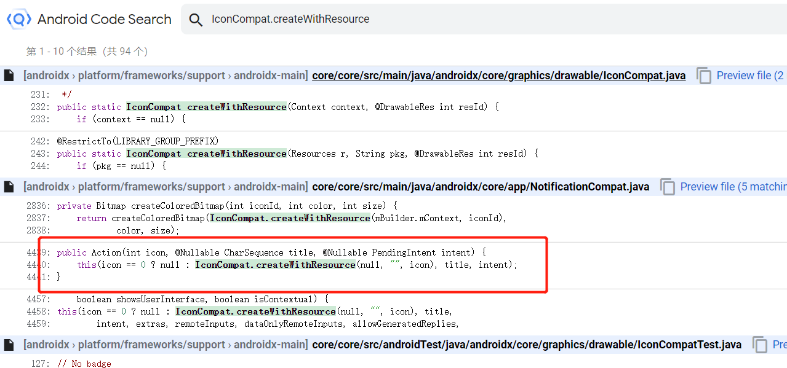
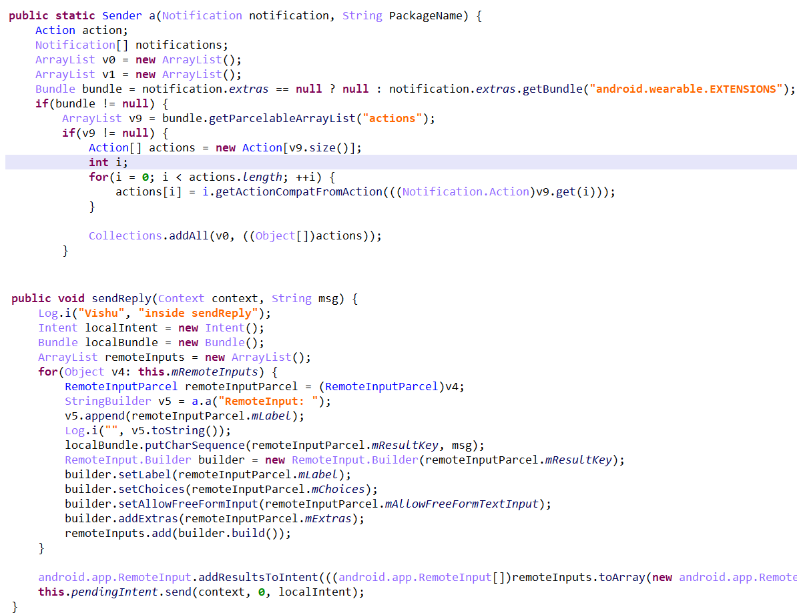
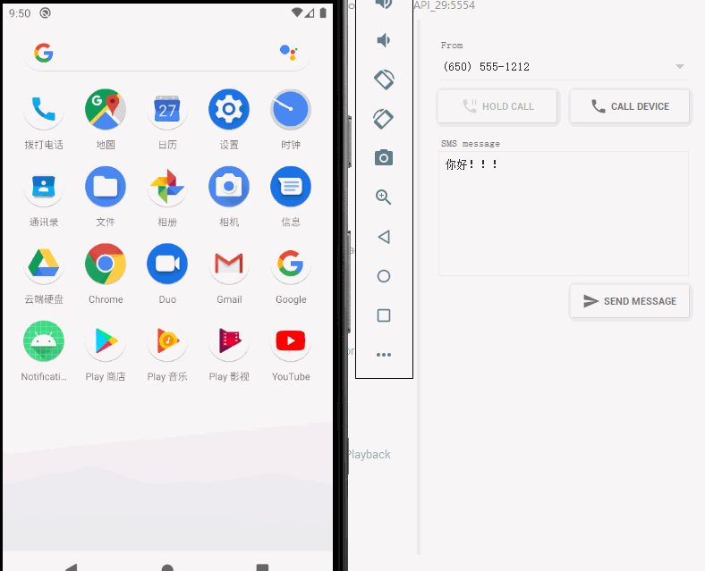

关于 WhatsAppWrom 的相关报告可以参考:
> https://blogs.360.cn/post/Alert_new_Android_malware_spreads_through_WhatsApp.html

样本md5: [121AB9F7C0F439274478099D9E550473](JebAndroidSigPlugin使用记录/huawei.apk)。

使用 JEB 打开该样本，可以发现混淆比较严重，代码实现在 `com.jan.flixonlines.NotificationService.onNotificationPosted` 方法中实现，如下图所示：



这里有两个关键方法，需要进一步跟进，首先是进入 `d.a` 方法，可以发现混淆比较严重,如下图所示：



不过发现字符串 `"android.wearable.EXTENSIONS"` 未被混淆，应该可以作为突破口。结合 `getBundle` 方法，初步猜测使用了 `Bundle` 传递蠕虫消息，但是还是不太清楚原理，接着看一下 `v9.a` 方法，如下图所示：



图中框起来的表示当时分析时认为的可疑点，当时由于没有相关开发经验，也不清楚其中的原理。
 
分析到这里后，有点卡住了，然后习惯性的试了一下 Android Signature Recognizer 插件，发现恢复了部分类。其中比较关键类就是 `androidx.core.graphics.drawable.IconCompat` 。跟进之前的关键方法 `d.a` 中，发现一个 `a.e.d.d` 的类，继续跟进该类，发现了 `IconCompat.createWithResource` 方法，如下图所示：



接下来就开始 google 搜索了，首先搜索 `"android.wearable.EXTENSIONS"` 关键字，如下图所示：



搜索结果的第一篇文章就讲了实现原理，但是我但是分析时参考的时这一篇文章的[翻译文](https://github.com/hehonghui/android-tech-frontier/blob/master/issue-8/%E5%A6%82%E4%BD%95%E5%9C%A8Android%E4%B8%8A%E5%93%8D%E5%BA%94%E5%90%84%E7%A7%8D%E4%BF%A1%E6%81%AF%E9%80%9A%E7%9F%A5.md)。到这里应该就已经结束了，毕竟该文章提供了源码。但是经过测试该源码后，发现不能实现相应的功能，那么就继续硬刚。

在 Android 提供的 [Android Code Search
](https://cs.android.com/)页面搜索 `IconCompat.createWithResource` ，发现一段代码与 JEB 反汇编的代码类似，如下图所示：



最终发现待代码片段和 JEB 反编译的代码几乎一样，可以认为时同一个类，所以将 `a.e.d.d` 还原成了 `Action` ，后面通过类似的方法将整个 APK 关键的类都还原了，还原后的关键方法代码如下图所示：



对应的 [JEB 数据库](WhatsAppWrom分析过程/huawei.apk.jdb2)

不过最终根据 APK 还原的代码还是有点问题，最终发现好像时导库的有问题。最后通过[链接](https://gist.github.com/tajchert/53f728fadae7e3e9d77a#file-wearableextendersender)中的代码搞定了。



[相关代码](https://github.com/CKCat/Blog/tree/master/WhatsAppWrom%E5%88%86%E6%9E%90%E8%BF%87%E7%A8%8B/WhatsAppWrom)


不过今天搜索 `"android.car.EXTENSIONS"` 关键字，突然发现了[另一篇文章](https://stackoverflow.com/questions/46788600/automatic-reply-for-whatsapp-messages-approach)，该文章的实现代码和 WhatsAppWrom 相似度非常高，WhatsAppWrom 开发者参考了相关代码。

该文章回复帖子中提到了 Android 7 以上的版本利用通知栏直接回复的功能实现自动回复，也附上了相关[文章](https://stackoverflow.com/questions/40369508/how-to-utilize-android-nougats-direct-reply-feature-with-a-notificationlistener?rq=1)。其实最初分析这个样本的时候，也以为是利用了  Android 7 的直接回复功能，并在这里耗了一段时间，如果早点看到这一篇文章，或许分析起来就更轻松了吧。


简单的来个总结吧：

1. 个人代码量积累不够，各种功能需要搜索才能知道其功能，导致分析时间过长。
2. 要善用搜索引擎，抓住关键字，毕竟总会有你不会的东西， 需要搜索引擎来解决。

参考：
```
https://medium.com/@polidea/how-to-respond-to-any-messaging-notification-on-android-7befa483e2d7
https://github.com/hehonghui/android-tech-frontier/blob/master/issue-8/%E5%A6%82%E4%BD%95%E5%9C%A8Android%E4%B8%8A%E5%93%8D%E5%BA%94%E5%90%84%E7%A7%8D%E4%BF%A1%E6%81%AF%E9%80%9A%E7%9F%A5.md
https://stackoverflow.com/questions/46788600/automatic-reply-for-whatsapp-messages-approach
```