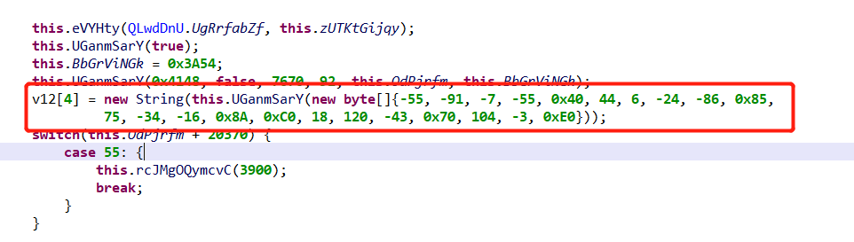
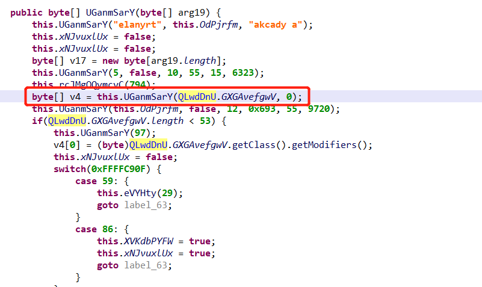
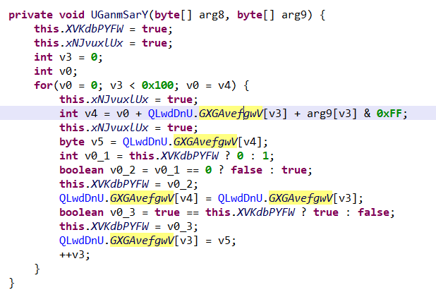
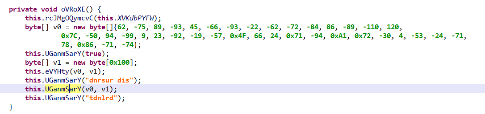
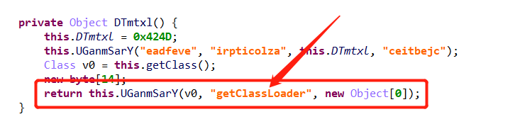

最近分析Geost家族银行木马，记录一下该木马字符串解密插件编写。
> 样本来源：https://blog.trendmicro.com/trendlabs-security-intelligence/dissecting-geost-exposing-the-anatomy-of-the-android-trojan-targeting-russian-banks/

[样本下载](dexsim插件-Geost/92394e82d9cf5de5cb9c7ac072e774496bd1c7e2944683837d30b188804c1810)

# 分析字符串解密特点
首先查看样本中解密字符串方法的特点



可以发现解密字符串函数为 `Lcom/rgamtgid/hnsolues/QLwdDnU;->UGanmSarY([B)[B` , 此代码的特征为：
```
fill-array-data v2, :array_2e
invoke-virtual {p0, v2}, Lcom/rgamtgid/hnsolues/QLwdDnU;->UGanmSarY([B)[B
move-result-object v2
invoke-direct {v1, v2}, Ljava/lang/String;-><init>([B)V
```

对应的正则表达式：
```
r'fill-array-data v\d+, :(\w+)\s+?'
r'invoke-virtual {p0, v\d}, (.*?);->(.*?)\(\[B\)\[B\s+?'
r'move-result-object v\d+\s+?'
r'invoke-direct {(v\d+), v\d+}, Ljava/lang/String;-><init>\(\[B\)V'
```

继续观察`Lcom/rgamtgid/hnsolues/QLwdDnU;->UGanmSarY([B)[B` 函数，发现该函数为非静态函数，需要先调用函数所在类的构造函数，然后再调用该解密函数，并且该函数返回值为 `byte[]` , 需要转成 `String` 类型, 所以需要修改 `dss` 相关代码如下：
```
Object obj = null;
try{
    Constructor<?> con = clz.getConstructor();
    obj = con.newInstance();
}catch (Exception e){
    e.printStackTrace();
}
ret = mtd.invoke(obj, target.getParameters());
result = new String((byte[])ret);
```
开始解密，发现解密结果为乱码
```
{
	"f2e3d508ee217c095861d260a3a9eee8f61603ed045bb4817fd28a7da11b3d9f": ["ġ��\\u001D3\\u0002��"],
	"38a80467b6d5b816cd91776ed8e51cce0df8a73d46bd47b7d188d1d84eaa678f": ["ˮ��\\u0019(\\u0003"],
	"b4e499760697584cc82d02559489ce6a99e497ab066d1a2b34a33cbfce943193": ["���"],
	"70216d6f207a1c0e370b7113334d14e9ebb12c766568369eda1a1f8afee15fc7": ["����\\u0019,\\u0006���i�"],
	"d1cdc906ab0b7c1c64a29537e9c4020f52790b0ac1e5045eaf321e9bbfe14d6f": ["��\\u0005!\\u0000��n�"],
	"d0532ef95194e0763b588f5b2ac1304c5f15333bfda545f929b3c0a8885643c3": ["ŭ��\\u001D"],
	"df2641fd22aa51c58d5150e925d75b797dac6cdd9491950a912b8c4230e22836": ["ġ��\\u00072"],
	"1c3fbc0ef0a73334f447ceb1e6eeb53afc8d38c5e054d4ceaef30ccd828b4ff3": ["ʪ��\\u0007!\\u000B"],
	"1a9a46b987f24ecf7d3be2e6501c7b6622d169a7af407a9e31ef0337bc0141d6": ["ǥ��\\u0007+I��|����;o�xl���\\u0003b6�"],
	"ff3cb5db4c0284f1bfe203fee5804cd6724267b24ee7d9596f775cd5eead7c2e": ["ġ��\\u0001.\\u0014��k���"],
	"40e2c22abf4d042c6e20a11e6ba7b2065f709005f6044ed3a4fe7835d041033a": ["ѡ��"],
	"d5f583b8ec55407eadf5a51dd3ff16b493fb94fae0e202ffd6000af1561bbd9f": ["ġ��\\u000C3\\u0008��m����"],
	"13a9e458bb010ab664661af1f4f08f084937847fc0768ca47ace65b17243fcb7": ["(��\\u000B"],
	"a0bcd2c1609d0cd07c8e2a41adbbb3cda932c6c6dca4bfefe481e0adbc83b0cd": ["�\\u000B"],
	"7787842e5212469cec7aaa95cd6d8df30d34fb6d0e7a6f1713c0cb5df550f714": ["ɥ��@,\\u0006誅z���=c�Wb���\\u0017e'�I"],
	"4d44e4687a94b79a8665bdf15134fd026587af5eed3ecae594fafe6f1a9d891d": ["ȯ��\\n*\\u0014��{���(q�pa���\\u0015"],
	"73101d880bbfd59702d96ecc3c47618dffdcf243bb3bd275484c002cb76e32db": ["¶��\\u0017#\\u0008��"],
	"8f03d383773c013569e3e1d910bd8c32fcbed206d3b5c7907bbb99310e33d617": ["ɥ��@)\\u0008���d�ތ�.b�Gy����"],
	"83718a06bf29a60b800595e9b9ca01708b6e7147b7a3513ecf7b7daa9516c24b": ["Զ��\\u000B"],
	"05711d0cc4b04eb073b4401b429f20868cba513f4828112442a2c64e379252d1": ["ġ��\\u0002!\\u0014��i���"],
	"454cf7696e8e0c6abcb6881b67a2831a5465ee7325ee08bf70cf4cc3f42d8e9c": ["ǡ�"],
	"40848d17e138ba5da879256aea50c6cda50167d856ad7c65ccfd15c60d15455b": ["ū��\\u000F-\\u0002"],
	"473b6b3f80874a14505ac2577547c5e7e3c96766c74f571bdd736c3844ae33c6": ["����\\u000F,\\u0014��g���-c�y}�浺[>d�\\n�"],
	"11b2149c2d5239839c10533b4e5363f104d69b7c79c5355ea45d8c5c884dce77": ["ש��\\u0008)\\u000B�"],
	"bc84eb8f3200f991cd94bf299877f0ffdec6503b41bc344e19e354c1acb1e794": ["С�"],
	"a47cf816863a4ecf54a03e1a6aaae35f33ddf4ba3f5139286e2bafa26bac0a6e": ["����"],
	"43ec42d64409376307a36c21db552f5335267593004c139ea1d2d5bd14d6c224": ["̴�� /\\tǾ�m�ם"],
	"04e8065097330a367c4cd538afc8678d6c9ef24584d7d20c07e94cc754a88816": ["ǡ��\\u001A%"],
	"561904e2cb0afd0008c5d16fbe3a4ba7cf0b5e5b13ba27eb8092287f0bfb96f8": ["͡��\\u00003\\u0013��m"],
	"77659956a9e869a9b051ac32cc4f457066332bb0195076d4ed1a8e8019ad4041": ["ɥ��@,\\u0006誅J����?y"],
	"c16af871c0dd1a66fc41afdc138004641939e1e2b78df4b157037466a5979423": ["̾��"],
	"f640b5ab7d87d84978011661e769a196fbd3198caaea6fa9263bfa745bd6dd88": ["ġ��\\u000F3\\u0002Ţ�|���"],
	"9153ef9514c3d163349095f4701d2cba5c06dd49c00c8a3c659d28ef81927040": ["��\\u000D#\\u0002��j��"],
	"75dd6f4f0e3b7cffb60fc0fdae51becfb27ce3d6a7ad6518db5a7fe0fb4145fb": ["ɥ��@,\\u0006誅K���\\u0012x�ph��"],
	"ce505ef1025a3c319094bfd9c0173e62448f78ab255ab4af8d11520bd8767c73": ["6��\\u001A%.��|���?z"],
	"7a3b634862a85e9cdd1946f52e8080a613aaff393c75715971ed562f940e3e7d": ["ɥ��@)\\u0008���d�"],
	"cfdf953a68d2b070f380deaefaec4020a2851a2eebb9826f7079272f6b6edd88": ["ɥ��@,\\u0006誅K���\\u0012x�ph�"],
	"7a193ee83f77b5f3f484573fe8d7645066f0698cc31d9abfc80bd1ba32a9c158": ["·��\\u001D3+��m�"],
	"13aa89b020ddf7150202fa0bdfb9c28e9580edc3e2059eaf5ef5d12c7ac12bb2": ["ͥ��"],
	"2148fad735ee74a155c3b34327cde1ff3b50cd6e441f10a85babc7c9e3b9dad2": ["+��\\u0007'I���"]
}
```

继续分析，发现 `Lcom/rgamtgid/hnsolues/QLwdDnU;->UGanmSarY([B)[B` 函数解密过程中需要成员变量 `GXGAvefgwV` 参与



查找该成员变量的初始地方，发现 `UGanmSarY` 函数。



该函数需要两个参数，继续找调用该函数的地方，发现在 `oVRoXE` 函数中被调用，并且 `oVRoXE` 为无参函数。



到此为止找到了解密函数所需的所有参数，开始编写解密脚本以及修改 `dss` 代码，相关代码如下：

`Geost.py` 代码
```
import os
import re
import tempfile
from json import JSONEncoder

from colorclass.color import Color
from dexsim import get_value
from dexsim.plugin import Plugin

PLUGIN_CLASS_NAME = "Geost"

# fill-array-data v2, :array_2e
# invoke-virtual {p0, v2}, Lcom/rgamtgid/hnsolues/QLwdDnU;->UGanmSarY([B)[B
# move-result-object v2
# invoke-direct {v1, v2}, Ljava/lang/String;-><init>([B)V


class Geost(Plugin):
    name = PLUGIN_CLASS_NAME
    enabled = True
    tname = None
    index = 3

    def __init__(self, driver, smalidir):
        Plugin.__init__(self, driver, smalidir)

    def run(self):
        if self.ONE_TIME:
            return
        self.ONE_TIME = True
        print('Run ' + __name__, end=' ', flush=True)

        regex = (
            r'fill-array-data v\d+, :(\w+)\s+?'
            r'invoke-virtual {p0, v\d}, (.*?);->(.*?)\(\[B\)\[B\s+?'
            r'move-result-object v\d+\s+?'
            r'invoke-direct {(v\d+), v\d+}, Ljava/lang/String;-><init>\(\[B\)V'
        )

        ptn = re.compile(regex, re.MULTILINE)
        for sf in self.smalidir:
            for mtd in sf.get_methods():
                self._process_mtd(mtd, ptn)
        self.decode()

    def _process_mtd(self, mtd, ptn):
        body = mtd.get_body()

        for item in ptn.finditer(body):
            old_content = item.group()  # 匹配到的内容，用来替换
            arg_pos, cname, mname, rtn_name = item.groups()
            cname = cname[1:].replace('/', '.')
            # 通过参数位置获取参数值
            rex = arg_pos + '\s*.array-data 1([\w\W\s]+?).end array-data'
            ptn_arr = re.compile(rex, re.MULTILINE)
            bjson = []
            for it in ptn_arr.finditer(body):
                arr = it.groups()
                for i in arr[0].split("\n"):
                    i = i.strip()
                    if i == "":
                        continue
                    bjson.append(int(i.replace('t', ''), 16))
            arguments = ['[B:' + str(bjson)]
            json_item = self.get_json_item(cname, mname, arguments)
            self.append_json_item(json_item, mtd, old_content, rtn_name)

    def decode(self):
        if not self.json_list or not self.target_contexts:
            return

        jsons = JSONEncoder().encode(self.json_list)

        outputs = {}
        with tempfile.NamedTemporaryFile(mode='w+', delete=False) as tfile:
            tfile.write(jsons)
        outputs = self.driver.decode(tfile.name)
        os.unlink(tfile.name)

        if not outputs:
            return

        for key, value in outputs.items():
            if key not in self.target_contexts:
                print(key, value, "not in")
                continue
            for mtd, old_content, new_content in self.target_contexts[key]:
                old_body = mtd.get_body()
                new_content = new_content.format(value[0])
                body = old_body.replace(old_content, new_content)
                mtd.set_body(body)
                self.make_changes = True
                mtd.set_modified(True)
        self.smali_files_update()

```

`dss` 相关代码
```
    public Object invoke(InvocationTarget target) {
        Class<?> clz = loadClass(target.getClassName());
        if (clz == null) {
            return null;
        }

        Method mtd = getMethod(clz, target);
        if (mtd == null) {
            return null;
        }

        Object result = null;
        Object obj = null;
        try{
            Constructor<?> con = clz.getConstructor();
            obj = con.newInstance();
        }catch (Exception e){
            e.printStackTrace();
        }
        try {
            Object ret = null;
            InvocationTarget aa= new InvocationTarget(null, null, "oVRoXE", null, null);
            Method init = getMethod(clz, aa);
            init.invoke(obj,null);
            ret = mtd.invoke(obj, target.getParameters());
            result = new String((byte[])ret);
        } catch (IllegalAccessException ignore) {
            ignore.printStackTrace();
        } catch (InvocationTargetException ignore) {
            ignore.printStackTrace();
        } catch (ExceptionInInitializerError e) {
            e.printStackTrace();
        } catch (VerifyError e) {
            e.printStackTrace();
        }
        return result;
    }

```

最后开始解密，对应的解密结果
```
 {
 	"f2e3d508ee217c095861d260a3a9eee8f61603ed045bb4817fd28a7da11b3d9f": ["getAssets"],
 	"38a80467b6d5b816cd91776ed8e51cce0df8a73d46bd47b7d188d1d84eaa678f": ["hjgfwhd"],
 	"b4e499760697584cc82d02559489ce6a99e497ab066d1a2b34a33cbfce943193": ["TRUE"],
 	"70216d6f207a1c0e370b7113334d14e9ebb12c766568369eda1a1f8afee15fc7": ["/ydxwlab.jar"],
 	"d1cdc906ab0b7c1c64a29537e9c4020f52790b0ac1e5045eaf321e9bbfe14d6f": ["mPackageInfo"],
 	"d0532ef95194e0763b588f5b2ac1304c5f15333bfda545f929b3c0a8885643c3": ["files"],
 	"df2641fd22aa51c58d5150e925d75b797dac6cdd9491950a912b8c4230e22836": ["getDir"],
 	"1c3fbc0ef0a73334f447ceb1e6eeb53afc8d38c5e054d4ceaef30ccd828b4ff3": ["initial"],
 	"1a9a46b987f24ecf7d3be2e6501c7b6622d169a7af407a9e31ef0337bc0141d6": ["dalvik.system.DexClassLoader"],
 	"ff3cb5db4c0284f1bfe203fee5804cd6724267b24ee7d9596f775cd5eead7c2e": ["getConstructor"],
 	"40e2c22abf4d042c6e20a11e6ba7b2065f709005f6044ed3a4fe7835d041033a": ["read"],
 	"d5f583b8ec55407eadf5a51dd3ff16b493fb94fae0e202ffd6000af1561bbd9f": ["getAbsolutePath"],
 	"13a9e458bb010ab664661af1f4f08f084937847fc0768ca47ace65b17243fcb7": ["close"],
 	"a0bcd2c1609d0cd07c8e2a41adbbb3cda932c6c6dca4bfefe481e0adbc83b0cd": ["space"],
 	"7787842e5212469cec7aaa95cd6d8df30d34fb6d0e7a6f1713c0cb5df550f714": ["java.lang.reflect.Constructor"],
 	"4d44e4687a94b79a8665bdf15134fd026587af5eed3ecae594fafe6f1a9d891d": ["kkksdjsdnssvfsnvfsdlfkjew"],
 	"73101d880bbfd59702d96ecc3c47618dffdcf243bb3bd275484c002cb76e32db": ["arraycopy"],
 	"8f03d383773c013569e3e1d910bd8c32fcbed206d3b5c7907bbb99310e33d617": ["java.io.FileOutputStream"],
 	"83718a06bf29a60b800595e9b9ca01708b6e7147b7a3513ecf7b7daa9516c24b": ["write"],
 	"05711d0cc4b04eb073b4401b429f20868cba513f4828112442a2c64e379252d1": ["getClassLoader"],
 	"454cf7696e8e0c6abcb6881b67a2831a5465ee7325ee08bf70cf4cc3f42d8e9c": ["dex"],
 	"40848d17e138ba5da879256aea50c6cda50167d856ad7c65ccfd15c60d15455b": ["forName"],
 	"473b6b3f80874a14505ac2577547c5e7e3c96766c74f571bdd736c3844ae33c6": [".localsinfotimestamp1494987116"],
 	"11b2149c2d5239839c10533b4e5363f104d69b7c79c5355ea45d8c5c884dce77": ["tmp_file"],
 	"bc84eb8f3200f991cd94bf299877f0ffdec6503b41bc344e19e354c1acb1e794": ["set"],
 	"a47cf816863a4ecf54a03e1a6aaae35f33ddf4ba3f5139286e2bafa26bac0a6e": ["%s%s"],
 	"43ec42d64409376307a36c21db552f5335267593004c139ea1d2d5bd14d6c224": ["openNonAssetFd"],
 	"04e8065097330a367c4cd538afc8678d6c9ef24584d7d20c07e94cc754a88816": ["delete"],
 	"561904e2cb0afd0008c5d16fbe3a4ba7cf0b5e5b13ba27eb8092287f0bfb96f8": ["newInstance"],
 	"77659956a9e869a9b051ac32cc4f457066332bb0195076d4ed1a8e8019ad4041": ["java.lang.Boolean"],
 	"c16af871c0dd1a66fc41afdc138004641939e1e2b78df4b157037466a5979423": ["ozht"],
 	"f640b5ab7d87d84978011661e769a196fbd3198caaea6fa9263bfa745bd6dd88": ["getBaseContext"],
 	"9153ef9514c3d163349095f4701d2cba5c06dd49c00c8a3c659d28ef81927040": ["setAccessible"],
 	"75dd6f4f0e3b7cffb60fc0fdae51becfb27ce3d6a7ad6518db5a7fe0fb4145fb": ["java.lang.ClassLoader2"],
 	"ce505ef1025a3c319094bfd9c0173e62448f78ab255ab4af8d11520bd8767c73": ["createInputStream"],
 	"7a3b634862a85e9cdd1946f52e8080a613aaff393c75715971ed562f940e3e7d": ["java.io.File"],
 	"cfdf953a68d2b070f380deaefaec4020a2851a2eebb9826f7079272f6b6edd88": ["java.lang.ClassLoader"],
 	"7a193ee83f77b5f3f484573fe8d7645066f0698cc31d9abfc80bd1ba32a9c158": ["mClassLoader"],
 	"13aa89b020ddf7150202fa0bdfb9c28e9580edc3e2059eaf5ef5d12c7ac12bb2": ["name"],
 	"2148fad735ee74a155c3b34327cde1ff3b50cd6e441f10a85babc7c9e3b9dad2": ["config.xml"]
 }
```

