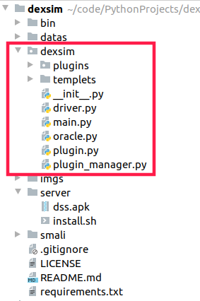
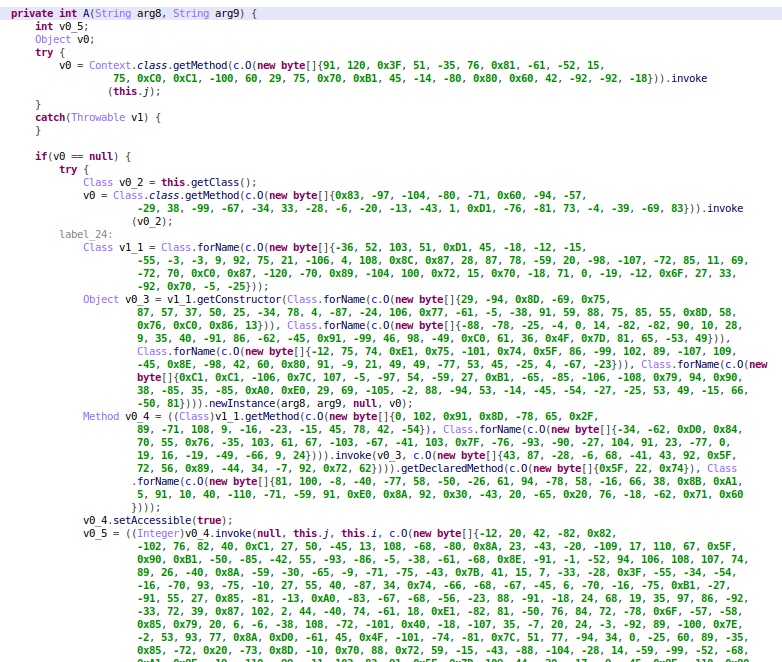
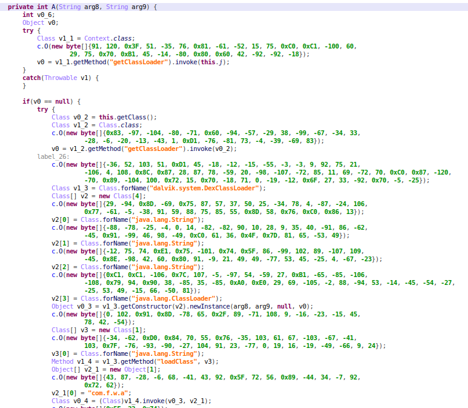

<!-- TOC -->

- [dexsim简介](#dexsim简介)
  - [dexsim 源码浅析](#dexsim-源码浅析)

<!-- /TOC -->

# dexsim简介
[dexsim](https://github.com/mikusjelly/dexsim) 是利用动态调用实现字符串解密的工具，需要配合 [DSS](https://github.com/mikusjelly/DSS) 使用。作者为 `mikusjelly` 。

## dexsim 源码浅析
`dexsim` 源码结构如下图所示，



其中关键解密方法在 `dexsim/Plugins` 中，当我们需要添加一个解密方法时直接在该目录中添加对应插件既可。

首先来看 `main` 方法
```
if __name__ == "__main__":
    parser = argparse.ArgumentParser(prog='dexsim', description='')
    parser.add_argument('f', help='APK 文件')
    parser.add_argument('-i', '--includes', nargs='*',
                        help='仅解密包含的类，如abc, a.b.c')
    parser.add_argument('-o', help='output file path')
    parser.add_argument('-d', '--debug', action='store_true', help='开启调试模式')
    parser.add_argument('-s', required=False, help='指定smali目录')
    parser.add_argument('-p', '--pname', required=False, help='加载指定插件，根据插件名字')
    # TODO parser.add_argument('-b', action='store_true', help='开启STEP_BY_STEP插件')

    args = parser.parse_args()

    start = time.time()
    main(args)
    finish = time.time()
    print('\n%fs' % (finish - start))

```
该方法主要是解析参数
* -i 仅解密包含的类 参数格式为 `a.b.c` `a.b`， 后面会将其转换为 `a/b/c.smali` `a/b.smali` 。
* -o 解密后输出文件的路径
* -s 指定smali目录
* -p 加载指定插件，根据插件名字

在 `main()` 方法中，将 apk 中的多个 dex 合并为一个名为 `new.dex` 文件
```
    ptn = re.compile(r'classes\d*.dex')

    zipFile = zipfile.ZipFile(apk_path)
    for item in zipFile.namelist():
        if ptn.match(item):
            output_path = zipFile.extract(item, tempdir)
            baksmali(output_path, smali_dir)
    zipFile.close()

    dex_file = os.path.join(tempdir, 'new.dex')
```
然后在使用 `smali` 将合并的 `dex` 转为 `samli` 文件, 并进一步解析。
```
    smali(smali_dir, dex_file)
    dexsim_apk(args.f, smali_dir, includes, output_dex)
```
上面的方法可以进行一下优化，没有必要将合并的 `dex` 进行反编译为 `smali` 文件,并且只能针对 `apk` 文件进行解密，可以增加对 `dex` 文件的解密。

接着看 `dexsim_apk` 方法.
```
    dexsim(apk_file, smali_dir, includes)
    if output_dex:
        smali(smali_dir, output_dex)
    else:
        smali(smali_dir,
              os.path.splitext(os.path.basename(apk_file))[0] + '.sim.dex')
```
发现该方法直接调用 `dexsim` 方法，然后解密完成，那么关键方法为 `dexsim`。
```
def dexsim(apk_file, smali_dir, includes):
    """推送到手机/模拟器，动态解密

    Args:
        apk_file (TYPE): Description
        smali_dir (TYPE): Description
        includes (TYPE): Description
    """
    driver = Driver()
    driver.push_to_dss(apk_file)

    oracle = Oracle(smali_dir, driver, includes)
    oracle.divine()
```
在该方法中将 `dex` 文件推送到手机中，然后调用创建 `Oracle` 对象向，调用该对象的 `divine` 进行解密.

接下来看 Oracle 对象的 `__init__` 方法
```
   def __init__(self, smali_dir, driver, includes):
        '''
        '''
        self.driver = driver
        # 下面一段代码可以删除，因为我们传的includes参数已经去掉了 L
        paths = []
        if includes:
            for item in includes:
                paths.append(item[1:].split(';')[0])

        self.smalidir = SmaliDir(smali_dir, include=paths, exclude=FILTERS)
        self.plugin_manager = PluginManager(self.driver, self.smalidir)
```
调用 `SmaliDir` 读取 smali 代码， 然后调用 `PluginManager` 加载插件。

接下来看看 `PluginManager` 如何加载所有插件的
```
    def __init__plugins(self):
        for path in sys.path:
            if path and path in __file__:
                pkg = __file__.replace(path, '')
                break
        module_path = os.path.dirname(pkg)[1:].replace(
            os.sep, '.') + '.' + self.plugin_dir + '.'

        tmp = [None] * len(self.plugin_filenames)
        # 开始加载所有插件
        for name in self.plugin_filenames:
            spec = importlib.util.find_spec(module_path + name)
            mod = spec.loader.load_module()
            clazz = getattr(mod, mod.PLUGIN_CLASS_NAME)
            if not issubclass(clazz, Plugin):
                continue

            if not clazz.enabled:
                print("Don't load plugin", clazz.name)
                continue
            tmp[clazz.index] = clazz(self.driver, self.smalidir)

        for item in tmp:
            if item:
                self.__plugins.append(item)
```
首先获取插件名，然后调用 `importlib.util.find_spec(module_path + name)` 加载插件，完成插件的加载。

接下来回到 `oracle.divine()` 方法
```
    def divine(self):
        plugins = self.plugin_manager.get_plugins()

        flag = True
        smali_mtds = set()  # 存放已被修改的smali方法
        while flag:
            flag = False
            for plugin in plugins:
                # 调用插件的run方法
                plugin.run()
                # 更新smali_mtds 文件
                smali_mtds = smali_mtds.union(plugin.smali_mtd_updated_set)
                print(plugin.make_changes)
                flag = flag | plugin.make_changes
                plugin.make_changes = False

        self.driver.adb.run_shell_cmd(['rm', DSS_APK_PATH])
```
关键的加密方法还是要看插件。
 
接下来看 Plugin 类，该类是所有插件的基类。先看看两个关键的成员变量
```
    # [{'className':'', 'methodName':'', 'arguments':'', 'id':''}, ..., ]
    json_list = []  # 存放解密对象

    # [(mtd, old_content, new_content), ..., ]
    # [(方法体， 原始的内容，解密后的内容)，...,]
    target_contexts = {}
```

json_list 存放解密对象，将转成文件推送到手机中让 DSS 解析并动态执行，其格式如下
```
[{
		"className": "othn.iclauncher",
		"methodName": "Ez",
		"arguments": ["java.lang.String:FK9FD0004670751372201EA6"],
		"id": "a439b0d815c9a0a972c6b0dc69ec7bee5663ae9b65294b2828fbb8aaa098ce70"
	}, {
		"className": "othn.iclauncher",
		"methodName": "EA",
		"arguments": ["java.lang.String:FKBEFCC3DA309EDA1B6FC62DF7E3EBECB5"],
		"id": "cdfcbfd5a872408ba4cc06b6f5a1fb48f1c5e18d5c36deb6e6fe41bd6b3d5c8c"
	},
]
```
target_contexts 存放解密前后的代码和方法体，方便后续替换。

几个关键的成员变量高清楚之后，剩下的东西也比较好理解，所以就不多说了，最后就是看看替换方法体
```
        for key, value in outputs.items():
            if key not in self.target_contexts:
                print(key, value, "not in")
                continue
            for mtd, old_content, new_content in self.target_contexts[key]:
                old_body = mtd.get_body()
                new_content = old_content + "\n" + new_content.format(value[0])
                body = old_body.replace(old_content, new_content)
                mtd.set_body(body)
                self.make_changes = True
              

        self.smali_files_update()
```
outputs 为动态执行后的结果，主要格式如下：
```
{
	"7b842f01264dc1d1a5089da9e86f531e90f5affe9ef36ecade2e2878a306ae7a": ["sender"],
	"5f0edfa5e4249ff38f5918e9b27197aec7aaeeed6c7c604a109bdfb21d9b7dc5": ["ss"],
	"642ed422a84d5ccab9e8fb27813c17d80b346af15295ffdc72dbd09d8662e34c": ["raw_data"],
	"e19e1215be04291d5a0c61232a7ae933a3ad6c6e760e7b86ccc2800f0350730a": ["SUCCEED"],
}
```
通过相同的key进行替换，上面为了避免回编译为dex文件的时报错，直接使用的追加方式。

整个代码的原理大概就是这样，关键就是写插件，这一块就不详细说了，有兴趣可以看看 `Plugin` 目录中的插件.

最后看看解密后的效果吧。

解密前



解密后




