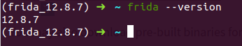
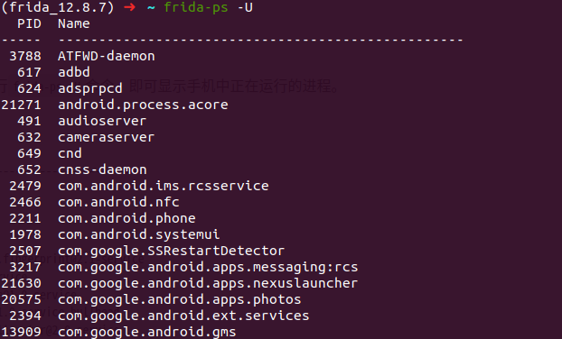
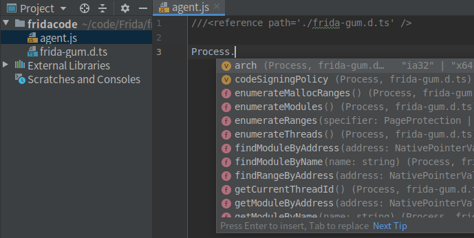
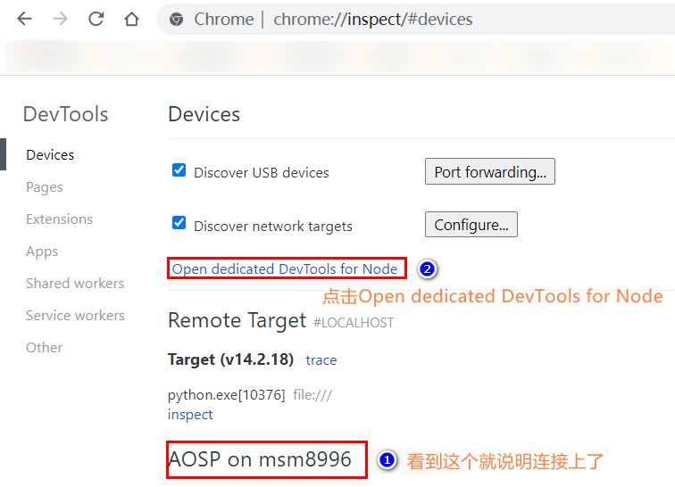
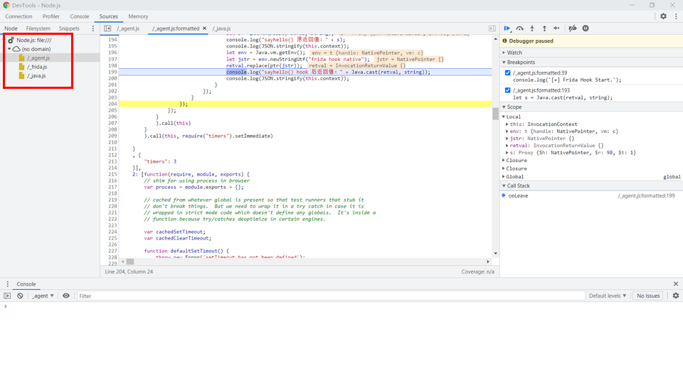
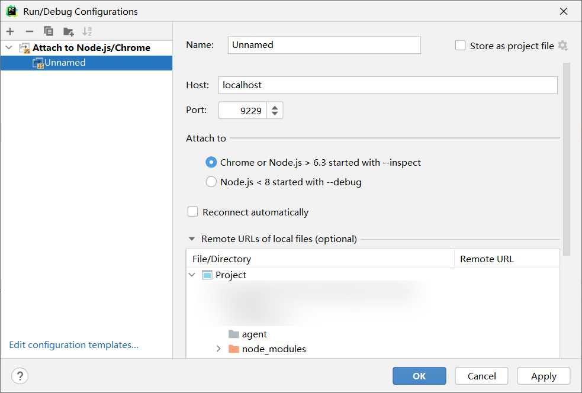
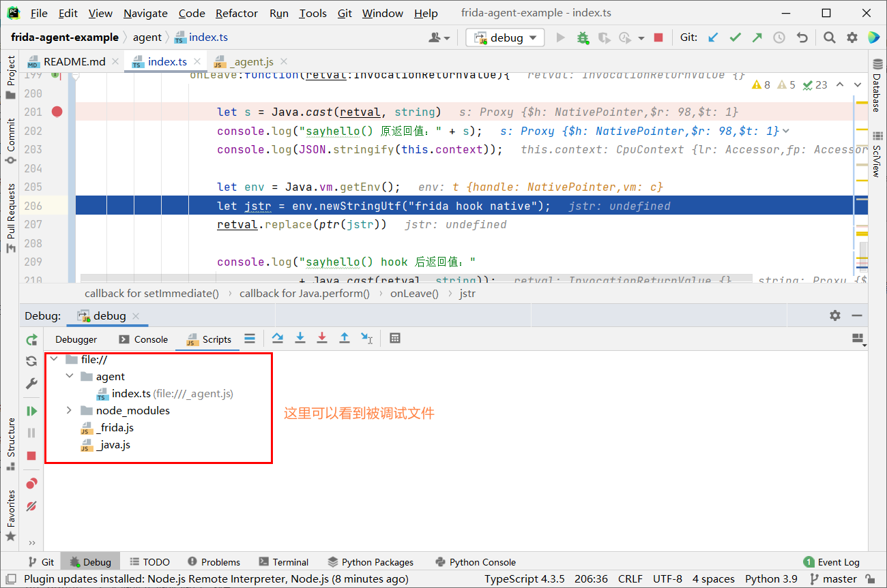

> 源码地址：https://github.com/frida/frida

> 官网：https://frida.re/


# 环境配置

## 安装 Frida
在安装 `Frida` 之前最好创建一个 `python` 虚拟环境，这样可以避免与其他环境产生干扰
```
$ mkvirtualenv -p python3 frida_12.8.7
```
> 这里使用 `pyenv` 创建虚拟环境更方便。目前我使用 `miniconda` 。

**安装最新版**

进入虚拟环境，直接运行下来命令即可安装完成
```
pip install frida-tools # CLI tools
pip install frida       # Python bindings
```
安装完成后，运行 `frida --version` 查看 frida 的版本



**安装特定版 Frida**

通过 [Frida Releases](https://github.com/frida/frida/releases) 页面找到需要安装的 `frida-tools` 版本，使用 `pip` 指定版本安装，这里以 `Frida 12.11.18` 为例。

首先找到 `frida-tools` 版本。


然后使用 `pip` 安装对应的版本，下面为完整安装命令。
```bash
pip install frida==12.11.18
pip install frida-tools==8.2.0
```

安装完成后，根据 `Frida` 的版本去[下载](https://github.com/frida/frida/releases)对应的 `frida-server`。

最后将 `frida-server push` 进 `data/local/tmp` 目录，并给予其运行权限，使用 `root` 用户启动。
```
$ adb push frida-server data/local/tmp/
$ adb shell
sailfish:/ $ su
sailfish:/ # chmod +x data/local/tmp/frida-server
sailfish:/ # data/local/tmp//frida-server &
```
执行 `frida-ps -U` ,出现以下信息则表明安装成功。




## 配置开发环境
为了在开发 Frida 脚本时有代码补全提示，我们可以使用下面两种方式进行环境配置。

### 引用 `frida-gum.d.ts`
在 `Frida` 源码中获取 [frida-gum.d.ts](https://github.com/frida/frida-gum/tree/6e36eebe1aad51c37329242cf07ac169fc4a62c4/bindings/gumjs/types/frida-gum) 文件，该文件包含了所有的 API 。

在我们开发的 `js` 脚本首行中引用 `frida-gum.d.ts` 文件，即可实现代码补全提示。
```
`///<reference path='./frida-gum.d.ts'/>`
```



其他方式获取 `frida-gum.d.ts` 文件：
> https://www.npmjs.com/package/@types/frida-gum

### 使用 `TypeScript` 
使用 `Frida` 作者提供的开发环境 [frida-agent-example](https://github.com/oleavr/frida-agent-example) ，该环境需要使用 `TypeScript` 开发。

构建开发环境
```bash
$ git clone git://github.com/oleavr/frida-agent-example.git
$ cd frida-agent-example/
$ npm install
```

启用实时编译
```bash
$ npm run watch
# 或者
$ frida-compile agent/index.ts -o _agent.js -w
```
后续直接使用 `index.ts` 开发即可实现代码补全提示。

## 配置调试环境
这里主要使用 `chrome` 和 `pycharm` 两种方式进行调试。

首先使用 `Frida` 命令或者 `python` 脚本以调试模式加载 `js` 脚本。

Frida 命令:
```bash
frida -U com.example.android -l _agent.js --debug --runtime=v8 <port/name>
```
python 脚本:
```python
session = dev.attach(app.pid)
script = session.create_script(jscode, runtime="v8")
session.enable_debugger()
```

启动后会回显 `Inspector` 正在监听 `9229` 默认端口 。

### chome
打开 `chrome://inspect` 页面, 点击 `Open dedicated DevTools for Node` 。



此时 `debug` 已经连接，切换至 `Sources` ，按 `Command + P` 加载要调试的脚本，即可下断调试了。



### pycharm
首先安装 `Node.js` 插件，重启。然后添加调试器 `Attaching to Node.js/Chrome`，端口默认即可。



> 我这里使用的 `node` 版本为 12.21.0 。

在 `ts` 文件中设置好断点，执行 pycharm 调试功能即可。



> 如果调试 `js` 脚本， 触发断点需要在 `debug` 窗口切换到 `script` 选项卡，右键要调试的脚本，选择 `Open Actual Source`，在新打开的 `Actual Source` 窗口设置好断点后，需要再取消/启用一次所有断点作为激活，发现断点上打上对勾才真正可用了。（未测试）

> 参考：https://bbs.pediy.com/thread-265160-1.htm

# Frida 使用

## Frida 启动

### attach 启动
`attach` 到已经存在的进程，核心原理是 `ptrace` 修改进程内存，如果进程处于调试状态（ `traceid` 不等于 `0` ），则 `attach` 失败。启动命令如下：
```bash
$ frida -U com.example.android --no-pause -l _agent.js
# 或者
$ frida -UF --no-pause -l _agent.js
```
- `-U` : 连接 USB 设备。
- `-l` : 加载脚本。
- `--no-pause` : 启动后自动启动主线程。
- `-F` : 附加最前面的应用。

以上命令对应的 `python` 脚本如下：
```python
import sys
import time
import frida

def on_message(message,data):
    print("message",message)
    print("data",data)

device = frida.get_usb_device()
session = device.attach("com.example.android")

with open("_agent.js","r", encoding = "utf8") as f:
    script = session.create_script(f.read())

script.on("message",on_message)
script.load()
sys.stdin.read()
```

### spawn 启动
启动一个新的进程并挂起，在启动的同时注入 `frida` 代码，适用于在进程启动前的一些 `hook` ，如 `hook RegisterNative` 等，注入完成后调用 `resume` 恢复进程。启动命令如下：
```bash
frida -U -f com.example.android --no-pause  -l _agent.js
```
对应的 `python` 脚本如下：
```python
import sys
import time
import frida

def on_message(message,data):
    print("message",message)
    print("data",data)

device = frida.get_usb_device()
pid = device.spawn(["com.example.android"])
device.resume(pid)
session = device.attach(pid)

with open("_agent.js",'r', encoding = "utf8") as f:
    script = session.create_script(f.read())

script.on("message",on_message)
script.load()

sys.stdin.read()
```

## Frida 自定义端口

默认情况下启动 `frida-server` 将会开启 `27042` 端口，如下所示：
```bash
sailfish:/ # netstat -tunlp |grep frida
tcp        0      0 127.0.0.1:27042         0.0.0.0:*               LISTEN      5038/frida-server-14.2.18-android-arm64
tcp        0      0 127.0.0.1:27042         127.0.0.1:46075         ESTABLISHED 5038/frida-server-14.2.18-android-arm64
tcp6       0      0 :::49039                :::*                    LISTEN      5038/frida-server-14.2.18-android-arm64
```
如果该端口被占用，启动 `frida-server` 将会失败，我们可以使用 `-l` 参数自定义端口，如下所示：
```bash
sailfish:/ # /data/local/tmp/frida-server-14.2.18-android-arm64 -l 0.0.0.0:6666 &
```

对应的 `Frida` 启动方式也需要作相应的改变，如下所示：
```bash
$ adb forward tcp:6666 tcp:6666
6666
$ frida -H 127.0.0.1:6666 com.example.android -l _agent.js
```
对应的 `python` 脚本如下：
```python
# -*- coding: UTF-8 -*-

import frida, sys

jsCode = """
console.log("test");
"""

def message(message, data):
    if message['type'] == 'send':
        print(f"[*] {message['payload']}")
		else:
				print(message)

process = frida.get_device_manager().add_remote_device('127.0.0.1:6666').attach('com.example.android')
script = process.create_script(jsCode)
script.on("message",message)
script.load()
input()
```

> 如果使用无线 `adb` 连接，则需要改变对应的 `IP` 为 [WADB](https://github.com/RikkaApps/WADB) 显示的 `IP` 即可。


# Frida Hook Java

## 常用方法
### Java.perform
该方法相当于 C 语言的 `main()` 函数，Java 层的 Hook 都是从 `Java.perform` 开始的。具体用法如下：
```javascript
Java.perform(function(){
    //在这里面写Hook的代码
})
```

### Java.choose
用于查找堆中指定类的实例。获得实例后可以调用实例的函数。具体用法如下：
```javascript
Java.choose("com.example.android.Dog",{
    onMatch:function(){
        //onMatch回调会在找到类的实例后调用，也就是说内存中有多少实例，就会调用多少次
    },
    onComplete:function(){
        //onComplete回调会在所有onMatch完成后调用
    }
})
```
例如：
```javascript
function main(){
    Java.perform(function(){
        console.log('Frida Hook Start.');
        // Hook 对象
        Java.choose("com.example.android.Dog", {
            onMatch:function (instance){
                console.log(`Hook 对象 ${JSON.stringify(instance)}`);
                console.log(`Hook 对象 name: ${JSON.stringify(instance.name.value)}`)
            },
            onComplete:function (){
                console.log("Hook 对象 onComplete")
            }
        });
    });
}
setImmediate(main);
```

### Java.available
确认当前进程的 java 虚拟机是否已经启动，虚拟机包括 Dalbik 或者 ART 等。虚拟机没有启动的情况下不要唤醒其他 java 的属性或者方法。返回值是一个 `boolean` 。

### Java.enumerateLoadedClasses
列出当前已经加载的类，用回调函数处理。声明为：`Java.enumerateLoadedClasses(callbacks)` 。用法如下：
```javascript
Java.enumerateLoadedClasses({
    onMacth:function(className){ //className就是类的名称
        //找到加载的每个类的时候被调用，参数就是类的名字，这个参数可以传给java.use()来获得一个js类包
    },
    onComplete:function(){
        //查找完毕所有类之后调用，主要用于扫尾工作
    }
})
```
### Java.enumerateClassLoaders
主要用于列出 Java JVM 中存在的类加载器。声明为：`Java.enumerateClassLoaders(callbacks)` 。用法如下：
```javascript
Java.enumerateClassLoaders({
    onMatch:function(loader){ //loader就是类加载器
        //每找到一个就回调一次onMatch方法
    },
    onComplete:function(){
        //在所有类加载器找出之后回调
    }
})
```

### Java.registerClass
用于注册一个类到内存，这个类可以是我们自己定义的，也就是说我们可以通过这个方式来自定义类加入到内存中，也可以是已经存在的类。声明为：`Java.registerClass(callbacks)` 。用法如下：
```javascript
let obj = Java.registerClass({
    name:"com.example.android.Dog", //类的全限定名.必传
    superClass:'xxx', //父类的全限定类名，可选
    implements:"xxx", //该类实现的接口全限定名，可选
    fields:{属性名:"类型"}, //该类的属性集，可选
    methods:{} //该类的方法集，可选
})
```
例子：
```javascript
//获取目标进程的SomeBaseClass类
let SomeBaseClass = Java.use('com.example.SomeBaseClass');
//获取目标进程的X509TrustManager类
let X509TrustManager = Java.use('javax.net.ssl.X509TrustManager');

let MyWeirdTrustManager = Java.registerClass({
  //注册一个类是进程中的MyWeirdTrustManager类
  name: 'com.example.MyWeirdTrustManager',
  //父类是SomeBaseClass类
  superClass: SomeBaseClass,
  //实现了MyWeirdTrustManager接口类
  implements: [X509TrustManager],
  //类中的属性
  fields: {
    description: 'java.lang.String',
    limit: 'int',
  },
  //定义的方法
  methods: {
    //类的构造函数
    $init: function () {
      console.log('Constructor called');
    },
    //X509TrustManager接口中方法之一，该方法作用是检查客户端的证书
    checkClientTrusted: function (chain, authType) {
      console.log('checkClientTrusted');
    },
    //该方法检查服务器的证书，不信任时。在这里通过自己实现该方法，可以使之信任我们指定的任何证书。在实现该方法时，也可以简单的不做任何处理，即一个空的函数体，由于不会抛出异常，它就会信任任何证书。
    checkServerTrusted: [{
      //返回值类型
      returnType: 'void',
      //参数列表
      argumentTypes: ['[Ljava.security.cert.X509Certificate;', 'java.lang.String'],
      //实现方法
      implementation: function (chain, authType) {
         //输出
        console.log('checkServerTrusted A');
      }
    }, {
      returnType: 'java.util.List',
      argumentTypes: ['[Ljava.security.cert.X509Certificate;', 'java.lang.String', 'java.lang.String'],
      implementation: function (chain, authType, host) {
        console.log('checkServerTrusted B');
        //返回null会信任所有证书
        return null;
      }
    }],
    //　返回受信任的X509证书数组。
    getAcceptedIssuers: function () {
      console.log('getAcceptedIssuers');
      return [];
    },
  }
});
```

### Java.use
在 Frida 中通过 `Java.use(className)` 来加载类，相当于 Java 的 `Class.forName()` 。用法如下:
```javascript
//加载String类
let jString = Java.use("java.lang.String");
```
加载类后，可以使用 `$new()` 来创建一个对象，例如创建一个 `String` 对象。
```javascript
let jStringClass = Java.use("java.lang.String");
let jString = jStringClass.$new("字符串");

```

### Java.array
通过 `Java.array()` 可以在 Frida 中创建任意类型的数组。用法如下：
```javascript
Java.array('type',[value1,value2,value3])
```
例子：
```javascript
//标准写法：
function main() {
    Java.perform(function () {
        //标准写法：
        let myCharArr = Java.array("char",['H','e','l','l','o']);
        let myStringArr = Java.array("Ljava.lang.String;",["W","o","r","l", "d"]);
        let ArrayClass = Java.use("java.util.Arrays");
        console.log(ArrayClass.toString(myCharArr));
        console.log(ArrayClass.toString(myStringArr));

        // 偷懒写法
        let charArr = ['你','好','!']
        let strArr = ["你","好","!"]
        console.log(ArrayClass.toString(charArr));
        console.log(ArrayClass.toString(strArr));
    });
}
setImmediate(main);
```

### Java.cast
在 Frida 中使用 `Java.cast()` 来强转类型。例如我想获取某个对象的 `Class` ，那么就可以如下写：
```javascript
let clazz = Java.use("java.lang.Class");
let cls = Java.cast(obj.getClass(),clazz); //先获取obj的Class，然后再强转成Class类型。
```

### Frida中数据类型定义

**基本数据类型：**

| Frida中的基本类型全名 | Frida中的基本类型缩写(定义数组时使用) |
| --------------------- | ------------------------------------- |
| boolean               | Z                                     |
| byte                  | B                                     |
| char                  | C                                     |
| double                | D                                     |
| float                 | F                                     |
| int                   | I                                     |
| long                  | J                                     |
| short                 | S                                     |

**数组类型**

在 Frida 中用 `[` 表示数组，和 java 中的的表示方法一致。

例如是 `int` 类型的数组，写法为：`[I` ，如果是 `String` 类型的数组，则写法为:`[java.lang.String;` 。


### 反射调用
反射调用效率比较低，一般情况下不要使用。

**获取方法及使用。**
```javascript
let clazz = Java.use(className);

// 获取构造方法
let Constructor  = jString.class.getConstructor([Type.class, Type.class...]);
// 设置访问属性
Constructor.setAccessible(true)
// 调用构造方法
let obj = Constructor.newInstance([Type.obj, Type.obj...]);


//获取该类的所有公共方法(包含父类的)，得到的是一个数组
let methods = jString.class.getMethods();
//获取该类所有的私有方法(不包含父类)，得到的是一个数组
let methods = jString.class.getDeclaredMethods();

//通过名称获取该类的公共方法
let method = jString.class.getMethod("methodName", [Type.class, Type.class...])
// 设置访问属性
method.setAccessible(true);
// 调用方法
method.invoke(obj, [Type.obj, Type.obj...]);


//通过名称获取该类的私有方法
let method = jString.class.getDeclaredMethod("methodName", [Type.class, Type.class...])
// 设置访问属性
method.setAccessible(true);
// 调用方法
method.invoke(obj, [Type.obj, Type.obj...]);
```

**获取属性值和设置属性值。**
```javascript
let jString = Java.use(className);


//获取该类的所有公共属性(包含父类的)，得到的是一个数组
let fields = jString.class.getFields();
//获取该类所有的私有属性(不包含父类)，得到的是一个数组
let fields = jString.class.getDeclaredFields();

//通过名称获取该类的公共属性
let field = jString.class.getField(fieldName)

field.setAccessible(true)
let field = nameField.get(obj);
field.set(user, value);


//通过名称获取该类的私有属性
let field = jString.class.getDeclaredField(fieldName)
field.setAccessible(true)
let field = nameField.get(obj);
field.set(user, value);
```

例子：
```javascript
function main(){
    Java.perform(function(){
        console.log('Frida Hook Start.');
        // 实例化对象
        let Dog = Java.use("com.example.android.Dog");
        // 反射获取所有的方法
        let Methods = Dog.class.getDeclaredMethods();
        console.log("--------------------------------------------")
        for(let method of Methods)
           console.log("Dog DeclaredMethods: " +
                    JSON.stringify(method.toString()));
        console.log("--------------------------------------------")

        let String = Java.use("java.lang.String");
        let Integer = Java.use("java.lang.Integer");
        // 获取 int.class , 目前只找到这种方法，后续如果有更好的方法再进行更新
        let int = Integer.class.getField("TYPE").get(null)
        let Constructor = Dog.class.getConstructor([String.class, int]);
        console.log(JSON.stringify(Constructor));
        let dog = Constructor.newInstance([String.$new("小白"), Integer.$new(2)]);

        // 反射调用 sleep 方法
        let sleep = Dog.class.getDeclaredMethod("sleep", null);
        sleep.setAccessible(true);
        sleep.invoke(dog, null);

        let _sleep = Dog.class.getDeclaredMethod("sleep", [String.class]);
        _sleep.invoke(dog, [String.$new("狗窝")]);

        // 反射获取字段
        console.log("============================================")
        let fields = Dog.class.getDeclaredFields();
        for (let field of fields){
            console.log("Filed: " + JSON.stringify(field.toString()));
        }
        console.log("============================================")
        // 静态字段
        let reflect_TAG = Dog.class.getDeclaredField("TAG");
        reflect_TAG.setAccessible(true);
        console.log("TAG: " + reflect_TAG.get(null))
        reflect_TAG.set(null, "HOOK OK")
        console.log("TAG: " + reflect_TAG.get(null))

        // 普通字段
        let reflect_name = Dog.class.getField("name");
        reflect_name.setAccessible(true);
        let Animal = Java.use("com.example.android.Animal")
        console.log("name: " + reflect_name.get(dog))
        reflect_name.set(dog, "小黑")
        console.log("name: " + reflect_name.get(dog))

    });
}
setImmediate(main);
```

### 实例化对象
```javascript
function main(){
    Java.perform(function(){
        console.log('Frida Hook Start.');
        // 实例化对象
        let Dog = Java.use("com.example.android.Dog");
        let dog = Dog.$new("小白", 2);
        console.log("实例化对象" + JSON.stringify(dog));
        dog.eat("狗粮");
        dog.sleep();
        dog.sleep("狗窝");
    });
}
setImmediate(main);
```

## Hook 操作
### hook 普通方法
直接使用 `类.方法名.implementation =function(){}` 来对一个方法进行 Hook 。

```javascript
function main(){
    Java.perform(function(){
        console.log('Frida Hook Start.');
        let MainActivity = Java.use("com.example.android.MainActivity");
        // hook 普通方法
        MainActivity.add.implementation = function (a:number, b:number) {
            console.log(`add params a: ${a}, b: ${b}`);
            console.log(`add params arguments[0]: ${arguments[0]}, arguments[1]: ${arguments[1]}`);

            //修改返回值
            return a * 2 + b * 2; 
        }
    });
}
setImmediate(main);
```

### Hook 重载方法
使用 `类.方法名.overload(参数).implementation =function(){}` 进行 Hook ，其中参数为重载的类型。
```javascript
function main(){
    Java.perform(function(){
        console.log('Frida Hook Start.');
        let Dog = Java.use("com.example.android.Dog");
        // Hook 重载方法
        Dog.sleep.overload().implementation = function (){
            console.log("hook 重载方法 sleep .")
        }
        Dog.sleep.overload("java.lang.String").implementation = function (str:string){
            console.log("hook 重载方法 sleep(String) " + str)
        }
    });
}
setImmediate(main);
```

### Hook 构造方法
如果没有重载，直接使用 `类.$init.implementation =function(){}` 进行 Hook 。

如果存在重载，则使用 `类.$init.overload(参数).implementation =function(){}` 进行 Hook 。
```javascript
function main(){
    Java.perform(function(){
        console.log('Frida Hook Start.');
        let Dog = Java.use("com.example.android.Dog");
        // Hook 构造方法
        Dog.$init.implementation = function (name:string, age:number){
            console.log("hook Dog 构造函数，原始参数为 name : "
                + name + "; age: " + age);
            // 修改参数
            this.$init("土狗", 10);
            console.log("hook Dog 构造函数，修改参数为 name : "
                + this.name.value + "; age: " + this.age.value);
        }
    });
}
setImmediate(main);
```

### Hook 成员变量
```javascript
function main(){
    Java.perform(function(){
        console.log('Frida Hook Start.');
        let MainActivity = Java.use("com.example.android.MainActivity");
        // Hook 静态成员，直接通过类获取静态成员变量
        let TAG = MainActivity.TAG
        console.log("static value TAG:" + TAG.value);
        // 修改静态成员
        TAG.value = "HOOK OK";

        // Hook 普通成员
        MainActivity.onCreate.overload("android.os.Bundle").implementation = function (bundle:Object){
            // 普通成员变量只能通过实例对象获取
            // 当对象的成员变量和成员方法名重复时,成员属性前加 `_` 进行区分
            let add = this._add;
            console.log("add value : " + add.value);
            console.log("static value TAG:" + TAG.value);

            this.onCreate(bundle);
            add.value = 11;
        }
    });
}
setImmediate(main);
```

### Hook 内部类
```javascript
function main(){
    Java.perform(function(){
        console.log('Frida Hook Start.');
        // Hook 内部类
        let innerClass = Java.use("com.example.android.MainActivity$innerClass");
        innerClass.setNum.implementation = function (num:number) {
            console.log("innerClass setNum num value: " + num)

            // 修改 num
            this.setNum(1);
        }
    });
}
setImmediate(main);
```

### Hook 匿名类
```javascript
function main(){
    Java.perform(function(){
        console.log('Frida Hook Start.');
        // Hook 内部类
        let cat = Java.use("com.example.android.MainActivity$1$1");
        cat.eat.implementation = function (food:string) {
            console.log(this.getName() + " eat " + food)

            this.eat("鱼");
        }

        let callback = Java.use("com.example.android.MainActivity$1$2");
        callback.finsh.implementation = function (msg:string) {
            console.log("callback finsh: " + msg)

            this.finsh("hello world!");
        }
    });
}
setImmediate(main);
```

### Hook 参数为数组的方法
```javascript
function main(){
    Java.perform(function(){
        console.log('Frida Hook Start.');
        // Hook 参数为数组
        let MainActivity = Java.use("com.example.android.MainActivity");
        let innerClass = Java.use("com.example.android.MainActivity$innerClass");
        MainActivity.printArray.overload('[Lcom.example.android.MainActivity$innerClass;')
            .implementation = function (arr: any) {
            for (let i of arr){
                console.log(i.getNum())
            }
            // 修改参数
            let a = Java.array("Lcom.example.android.MainActivity$innerClass;",
    [innerClass.$new(this, 111), innerClass.$new(this, 222), innerClass.$new(this, 333)]);
            this.printArray(a);
        }

    });
}
setImmediate(main);
```

## 其他
### 打印调用栈
在逆向中我们可以通过打印调用栈获取关键方法的调用关系。相关代码如下所示：
```javascript
function stackTraceHere() {
    return Java.use('android.util.Log').getStackTraceString(Java.use('java.lang.Exception').$new());
}

function main(){
    Java.perform(function(){
        console.log('Frida Hook Start.');
        let MainActivity = Java.use("com.example.android.MainActivity");
        MainActivity.add.implementation = function (a:number, b:number) {
            // 打印堆栈信息
            let stack = stackTraceHere();
            console.log(stack);

            return this.add(a, b);
        }
    });
}
setImmediate(main);
```

### Hook 指定类的所有方法
```javascript
function main(){
    Java.perform(function(){

        // 1. 枚举所有的类
        let classList = Java.enumerateLoadedClassesSync();
        for (let className of classList){
            // 2. 选择需要 Hook 的类
            if (className.indexOf("com.example.android.Dog") != -1){
                // 3. 获取该类的所有方法
                let declaredMethods = Java.use(className).class.getDeclaredMethods();
                console.log("---------------------------")
                for (let method of declaredMethods){
                    // 4. 获取函数名
                    let methodName = method.getName();
                    let hookClass = Java.use(className);
                    // 5. 开始 hook
                    for (let overloads_md of hookClass[methodName].overloads){
                        overloads_md.implementation = function(){
                            for (let arg of arguments){
                                console.log(`${methodName} -> argType: [${typeof arg}] ;argValue: [${arg}] .`);
                            }
                            return this[methodName].apply(this, arguments);
                        }
                    }
                }
                console.log("============================")
            }
        }
    });
}
setImmediate(main);
```

### Hook 动态加载的 dex
```javascript
function main() {
    Java.perform(function () {
        Java.enumerateClassLoaders({
            onMatch: function (loader) {
                console.log(`Java.classFactory.loader :${JSON.stringify(Java.classFactory.loader)}`);
                // 获取动态加载的类
                try {
                    let className = "com.example.Dynamic.Fibonacci";
                    if (loader.loadClass(className)) {

                        Java.classFactory.loader = loader;
                        let Fibonacci = Java.use(className);
                        // 调用 dex 中的方法
                        let ret = Fibonacci.fibonacci(20);
                        console.log("ret: " + ret);
                    }
                }
                catch (e) {
                     console.log(e);
                }
            },
            onComplete: function () {
                console.log("onComplete!!!");
            }
        });
    });
}
setImmediate(main);
```

### Hook 打印 non-ascii 和特殊字符
一些特殊字符和不可见字符, 可以先通过编码再解码的方式进行 hook 。
```java
int ֏(int x) {
    return x + 100;
}
```
针对上面的 `֏` , 直接用 `js` 编码, 在通过类名 `[js解码的方法名]` 进行 `implementation` 。
```javascript
Java.perform(
        function x() {

            var targetClass = "com.example.hooktest.MainActivity";

            var hookCls = Java.use(targetClass);
            var methods = hookCls.class.getDeclaredMethods();

            for (var i in methods) {
                console.log(methods[i].toString());
                console.log(encodeURIComponent(methods[i].toString().replace(/^.*?\.([^\s\.\(\)]+)\(.*?$/, "$1")));
            }

            hookCls[decodeURIComponent("%D6%8F")]
                .implementation = function (x) {
                    console.log("original call: fun(" + x + ")");
                    var result = this[decodeURIComponent("%D6%8F")](900);
                    return result;
                }
        }
    )
```

### write-ups-2015
首先我们根据 Frida 官网给的[测试用例](https://github.com/ctfs/write-ups-2015/tree/master/seccon-quals-ctf-2015/binary/reverse-engineering-android-apk-1)简单的熟悉一下 Frida 的使用。

```javascript
function main(){
    Java.perform(function(){
        // 获取需要 hook 方法的类
        let MainActivity = Java.use('com.example.seccon2015.rock_paper_scissors.MainActivity');
        MainActivity.onClick.implementation = function (v:any) {
            // 调用原始函数
            this.onClick(v)
            // 原始函数调用完成后，修改相应的变量
            this.m.value = 0;
            this.n.value = 1;
            this.cnt.value = 999;
            // 主动调用获取 flag
            let flag = `SECCON{${(1000 + this.calc()) *107}}`;
            console.log("flag: " + flag)
        };

        let TextView = Java.use("android.widget.TextView");
        TextView.setText.overload("java.lang.CharSequence").implementation = function (str:string) {
            // 通过 setText 获取 flag
            if(this.getId().toString(16).toUpperCase() == "7F0C0052") {
                console.log("setText : " + str)
            }
            this.setText(str)
        }
    });
}
setImmediate(main);
```

# Frida Hook so

## 常用方法

### Process.enumerateModules
用于查看目标 module 是否被正常加载, 使用 `Process.enumerateModules()` 将当前加载的所有 so 文件打印出来。

使用方法：
```javascript
function main(){
    Java.perform(function(){
        let modules = Process.enumerateModules();
        for (let module of modules){
            if (module.name.indexOf("libcalc.so") != -1){
                console.log(`module name: ${module.name} ; base: ${module.base} ; path:${module.path}`)
            }
        }
    });
}
setImmediate(main);
```

### Module.findBaseAddress
获取指定 so 文件的基地址。 

使用方法：
```javascript
function main(){
    Java.perform(function(){
        let baseAddr = Module.findBaseAddress("libcalc.so");
        console.log("libcalc.so baseAddr: ", baseAddr);
    });
}
setImmediate(main);
```

### Module.findExportByName
通过导出函数名获取对应的地址。

使用方法：
```javascript
function main(){
    Java.perform(function(){
        let calc = Module.findExportByName("libcalc.so",
            "Java_com_example_seccon2015_rock_1paper_1scissors_MainActivity_calc");
        console.log("calc addr: ", calc);
    });
}
setImmediate(main);
```

### 

# Frida 代码片段

Hook StringBuilder and print data only from a specific class
```javascript
let sbActivate = false;

Java.perform(function() {
  const StringBuilder = Java.use('java.lang.StringBuilder');
  StringBuilder.toString.implementation = function() {

    let res = this.toString();
    if (sbActivate) {
        let tmp = "";
        if (res !== null) {
          tmp = res.toString().replace("/n", "");
          console.log(tmp);
        }
    }
    return res;
  };

});

Java.perform(function() {
  const someclass = Java.use('<the specific class you are interested in>');
  someclass.someMethod.implementation = function() {

    sbActivate = true;
    let res = this.someMethod();
    sbActivate = false;

    return res;
  };

});
```

byte[]这种 hook输出的时候该怎么写呢？
```javascript
let ByteString = Java.use("com.android.okhttp.okio.ByteString");
let j = Java.use("c.business.comm.j");
j.x.implementation = function() {
    let result = this.x();
    console.log("j.x:", ByteString.of(result).hex());
    return result;
};

j.a.overload('[B').implementation = function(bArr) {
    this.a(bArr);
    console.log("j.a:", ByteString.of(bArr).hex());
};
```

hook Androd 7以上的 dlopen 。
```javascript
let android_dlopen_ext = Module.findExportByName(null, "android_dlopen_ext");
console.log(android_dlopen_ext);
if (android_dlopen_ext != null) {
    Interceptor.attach(android_dlopen_ext, {
        onEnter: function (args) {
            let soName = args[0].readCString();
            console.log(soName);
            if (soName.indexOf("**.so") !== -1) {
                console.log("------load **----------")
                this.hook = true;
            }
        },
        onLeave: function (retval) {
            if (this.hook) {
                //TODO hookso
            }
        }
    });
}
```

frida如何注入dex？
```javascript
Java.openClassFile(dexPath).load();
```

在系统里装上这个这个npm包，可以在任意工程获得frida的代码提示、补全和API查看。
```
npm i -g @types/frida-gum
```

参考:
```bash
https://kevinspider.github.io/fridahookjava/
https://zyzling.gitee.io/2020/05/12/Frida%E5%AD%A6%E4%B9%A0%E7%AC%94%E8%AE%B0/

```