本文主要记录 git 使用过程中需要搜索的一些命令。

# 基础篇

## 配置 git 用户名和邮箱

```bash
git config --global user.name "你的名字"

git config --global user.email “邮箱@邮箱.com”
```

这里的名字和邮箱决定了你在创建 `commit` 时的作者信息，与 `git` 托管平台的账号和邮箱没有关系。github 只认邮箱，也就是说 `user.email` 决定了在 github 的网页上要显示谁的用户名和头像。

你可以把上面的 `global` 改成 `local` 来为所在仓库指定默认作者，`global` 代表针对所有仓库的全局变量

## 常用命令的介绍

- `git clone` 其作用是把一个远程仓库下载到本地, 用法如下：

  - 使用 `git clone <仓库地址>` 来克隆一个仓库的默认分支
  - 使用 `git clone <地址> -b <分支名/TAG 名>` 来克隆指定分支/tag
  - 使用 `git clone <地址> <目录名>` 来克隆到一个指定目录（当然还可以和上面的`-b` 结合·一下）
  - 使用 `git clone <地址> --depth=1` 来克隆最小仓库

- `git add` 用来往缓冲区中增加文件，用法如下：

  - `git add <文件名/目录>`，来把一个文件加入缓冲区
  - 也可以使用 `git add *` 来把所有修改都加入缓冲区（隐藏文件除外）

- `git commit` 是把缓冲区中的修改，作为一个新的 commit(提交)，用法如下：

  - `git commit -m "我是提交的内容"` 直接创建 commit message
  - `git commit -a` 来省去 `git add` 的过程，直接把所有的修改创建为一个新提交

- `git status` 用来查看当前仓库的状态，包括被修改的文件以及未追踪的文件等。

- `git diff` 用来查看文件的修改内容，用法如下：

  - `git diff` 来查看当前已经被修改，但尚未加入缓冲区的文件的修改内容
  - `git diff <文件名>` 查看单独文件的修改

- `git checkout` 这个命令翻译过来应该叫做“检出”，没法一句话概括“检出”的含义，直接来看用法吧

  - 在你 `git add` 了一个文件后，你想反向 `add`（从缓冲区删除），你可以使用 `git checkout <文件名>`
  - 当你想要切换分支时，可以使用 `git checkout <分支名>` 来切换到另一个已经存在的分支
  - 当你想要创建新分支时，可以使用 `git checkout -b <新分支名>`来切换到一个新分支
  - 当你想要把一个文件的内容，用它在另一个分支里的内容覆盖时，可以使用 `git checkout <分支名> <文件名>`

- `git log` 这是最重要的命令之一，查看当前仓库的“提交历史记录”，使用方式：

  - `git log` 打开日志界面，按 Q 退出
  - `git log --oneline` 打开简洁版历史界面，按 Q 退出
  - `git log <本地分支名>` 来查看某一分支的日志
  - `git log <文件/目录名>` 来查看某一文件/目录的日志

- `git reset` 这个命令是用来改变头指针的位置的，头指针可以理解为，把当前的仓库内容状态，与哪个提交进行比较，那个提交就是头指针。用法如下。

  - `git reset <sha1>`并不会改变仓库的文件内容， 仓库里的文件还在原来的状态，只是它们所在的提交都消失了，因此那些文件都变成了尚未加入缓冲区的状态。
  - 使用 `git reset --hard <sha1>` 来把当前分支还原到指定提交时的状态，即使是当时未追踪的文件也会消失。

- `git revert` 反转一个提交，就是把指定提交的内容倒着做一遍，比如上个提交加了文件，反转之后就是把那个文件删了，它和 `git reset --hard` 并不一样，那个是重置仓库的状态，这个是反转指定的内容并作为一个新的提交创建。不过 它们两个其实可以达到相同的目的 那就是干掉导致问题的提交，使用方法：

  - `git revert <sha1>`来反转一个提交

- `git cherry-pick` 用来为当前分支应用指定的提交的，使用方法

  - `git cherry-pick <sha1>` 把指定提交打到当前分支上
  - `git cherry-pick <头>^..<尾>` 把连续多个提交打到当前分支上（包含头尾
  - 连续 `pick` 在冲突解决完后 执行 `git cherry-pick --continue` 即可继续 `pick`

- `git branch` 就是查看已存在的分支的命令了

  - `git branch` 来查看本地的所有分支
  - `git branch -r` 查看远程服务器上的所有分支
  - `git branch -D <本地分支名>` 使用前提时你当前不在这个被删除的分支上（先切换到别的分支）

- `git remote` 这个命令和远程服务器相关

  - `git remote` 来查看本地已保存的全部远程服务器
  - `git remote get-url <远程服务器名称>`来查看一个远程服务器的地址
  - `git remote add <服务器名称> <地址>`来新增远程服务器
  - `git remote remove <名称>`来删除远程服务器

- `git push` 这个命令用来将本地修改推送到远程服务器

  - `git push` 来推送修改到与当前分支绑定的远程分支
  - `git push --set-upstream <远程服务器名> <本地分支名>` 来创建上述绑定。注意！这个命令是将本地分支设为追踪同名远程分支，如果想追踪名字不同的远程分支，`请使用 git push --set-upstream <远程服务器名> <本地分支名>:<远程分支名>`
  - `git push <远程服务器名> <本地分支名>:<远程分支名>` 来把指定的本地分支推送到指定的远程分支（是否绑定无所谓）
  - git push -f 这适用于强制覆盖，就是在提交历史被修改/本地分支落后于远程分支等情况下，强制更新远程分支 （比如 git reset --hard 之后）
  - `git push --delete <远程服务器名> <远程分支名>` 删除服务器上的分支

- `git fetch` 在 `git` 仓库已经存在的情况下，想要在当前仓库中获取别的仓库/分支的内容时使用，使用方式：

  - `git fetch <远程地址/远程服务器名称>` 把指定的远程服务器的默认分支，下载到本地的一个叫做 `FETCH_HEAD` 的临时分支里（你可以这么理解）（一般临时使用远程仓库时才会这么用，比如 `merge/cherry-pick`）
  - `git fetch <远程地址/服务器名称> <远程分支名>` 把指定远程服务器的指定分支下载到 `FETCH_HEAD` 中
  - `git fetch <远程地址/服务器名称> <远程分支名>:<本地分支名>` 把远程服务器的指定分支下载到本地的指定分支

- `git merge` 合并分支，使用方式：

  - `git merge <本地分支名/FETCH_HEAD>`来合并一个分支（可能会有冲突）

- `git pull` 可以把这个命令理解为 `git fetch <绑定的远程服务器> <绑定的分支> && git merge FETCH_HEAD`

## 新建数据库

创建一个目录 `basis` ，进入目录中右键打开 Git Bash Here ，执行 `git init` 命令即可新建数据库。

```bash
$ git init
Initialized empty Git repository in /basis/.git/
```

创建成功后，basis 目录中将会出现一个 `.git` 的目录。

## 提交文件

在 `basis` 目录中新建一个名为 `sample.txt` 的文本文件，并输入下列内容。

```bash
连猴子都懂的Git命令
```

使用 `git status` 命令确认工作树和索引的状态。

```bash
$ git status
On branch master

No commits yet

Untracked files:
  (use "git add <file>..." to include in what will be committed)
        sample.txt

nothing added to commit but untracked files present (use "git add" to track)
```

使用 `git add` 命令将 `sample.txt` 文件加入到索引。

```bash
$ git add sample.txt
$ git status
On branch master

No commits yet

Changes to be committed:
  (use "git rm --cached <file>..." to unstage)
        new file:   sample.txt
```

指定参数 `.` ，可以把当前目录下所有的文件加入到索引。

执行 `git commit` 命令之后确认状态。

```bash
$ git commit -m"first commit"
[master (root-commit) 90fd96a] first commit
 1 file changed, 1 insertion(+)
 create mode 100644 sample.txt

$ git status
On branch master
nothing to commit, working tree clean
```

使用 `git log` 命令，我们可以在数据库的提交记录看到新的提交。

```bash
$ git log
commit 90fd96aa3edba60e1ef8d1c07a431612c29a9e86 (HEAD -> master)
Author: CKCat <ckcatck@qq.com>
Date:   Wed Jun 22 20:41:42 2022 +0800

    first commit
```

## push 到远程数据库

使用 `git remote` 指令添加远程数据库，并且使用 `push` 命令向数据库推送更改内容。

```bash
$ git remote add origin https://github.com/CKCat/git-tutorial.git
$ git branch -M main
$ git push -u origin main
Enumerating objects: 3, done.
Counting objects: 100% (3/3), done.
Writing objects: 100% (3/3), 236 bytes | 236.00 KiB/s, done.
Total 3 (delta 0), reused 0 (delta 0), pack-reused 0
To https://github.com/CKCat/git-tutorial
 * [new branch]      main -> main
branch 'main' set up to track 'origin/main'.
```

- `git remote add <name> <url>`
    - `name` : 远程数据库名称，默认名称为 `origin`
    - `url` : 远程数据库的 `URL` 

- `git push <repository> <refspec>`
`- `repository` : 目标地址
- `refspec` : 推送的分支。如果指定了 `-u` 选项，那么下一次推送时就可以省略分支名称了。`

通过 github 网站上修改 `sample.txt` 文件内容如下， 在 `commit` 消息中输入 `添加 add 的说明` 。

```bash
连猴子都懂的Git命令
add 把变更录入到索引中
```

使用 `git pull` 指令进行拉取操作。

```bash
$ git pull
remote: Enumerating objects: 5, done.
remote: Counting objects: 100% (5/5), done.
remote: Compressing objects: 100% (2/2), done.
remote: Total 3 (delta 0), reused 0 (delta 0), pack-reused 0
Unpacking objects: 100% (3/3), 696 bytes | 49.00 KiB/s, done.
From https://github.com/CKCat/git-tutorial
   90fd96a..c9a9b2d  main       -> origin/main
Updating 90fd96a..c9a9b2d
Fast-forward
 sample.txt | 3 ++-
 1 file changed, 2 insertions(+), 1 deletion(-)
```

- `git pull <repository> <refspec>`
    - `repository` : 数据库名称，默认为 origin；
    - `refspec` : 分支。

使用 `git log` 指令来确认历史记录是否已更新。

```bash
$ git log
commit 83e0241f23bb8a18870a34fd2d0bca67a5a59e86 (HEAD -> main, origin/main)
Author: CKCat <844045574@qq.com>
Date:   Wed Jun 22 21:05:20 2022 +0800

    添加add的说明

commit 90fd96aa3edba60e1ef8d1c07a431612c29a9e86
Author: CKCat <ckcatck@qq.com>
Date:   Wed Jun 22 20:41:42 2022 +0800

    first commit
```

## 合并修改记录

在 github 网站上修改文件内容并 `commit` 提交，修改内容如下：

```bash
连猴子都懂的Git命令
add 把变更录入到索引中
github 远程修改内容
```

随后在修改本地仓库的文件内容并 `commit` 提交，修改内容如下：

```bash
$ cat sample.txt
连猴子都懂的Git命令
add 把变更录入到索引中
本地修改内容

$ git add sample.txt

$ git commit -m"本地修改"
[main 844aa9c] 本地修改
 1 file changed, 1 insertion(+)
```

最后将本地仓库提交到远程仓库。

```bash
$ git push origin main
To https://github.com/CKCat/git-tutorial
 ! [rejected]        main -> main (fetch first)
error: failed to push some refs to 'https://github.com/CKCat/git-tutorial'
hint: Updates were rejected because the remote contains work that you do
hint: not have locally. This is usually caused by another repository pushing
hint: to the same ref. You may want to first integrate the remote changes
hint: (e.g., 'git pull ...') before pushing again.
hint: See the 'Note about fast-forwards' in 'git push --help' for details.
```

可以看到发生了错误，推送被拒绝（rejected）了。

为了把变更内容推送到远程数据库，我们必须手动解决冲突。首先请运行 `git pull`，以从远程数据库取得最新的变更记录吧。

```bash
$ git pull
remote: Enumerating objects: 5, done.
remote: Counting objects: 100% (5/5), done.
remote: Compressing objects: 100% (2/2), done.
remote: Total 3 (delta 0), reused 0 (delta 0), pack-reused 0
Unpacking objects: 100% (3/3), 720 bytes | 32.00 KiB/s, done.
From https://github.com/CKCat/git-tutorial
   83e0241..2f6ac56  main       -> origin/main
Auto-merging sample.txt
CONFLICT (content): Merge conflict in sample.txt
Automatic merge failed; fix conflicts and then commit the result.
```

打开 `sample.txt` 文件，我们看到 Git 已添加标示以显示冲突部分。

```bash
$ cat sample.txt
连猴子都懂的Git命令
add 把变更录入到索引中
<<<<<<< HEAD
本地修改内容
=======
github 远程修改内容
>>>>>>> 2f6ac56c9bc7e2d95b48f28ba77607ebb6b98c97
```

导入两方的修改，并删除多余的标示行以解决冲突。文件的内容发生了修改，所以需要进行提交。

```bash
$ cat sample.txt
连猴子都懂的Git命令
add 把变更录入到索引中
github 远程修改内容
本地修改内容

$ git add sample.txt

$ git commit -m"合并"
[main 94d7787] 合并
```

用 `git log` 命令来确认数据库的历史记录是否准确。指定 `--graph` 选项，能以文本形式显示更新记录的流程图。指定 `--oneline` 选项，能在一行中显示提交的信息。

```bash
$ git log --graph --oneline
*   94d7787 (HEAD -> main) 合并
|\
| * 2f6ac56 (origin/main) github 远程修改
* | 844aa9c 本地修改
|/
* 83e0241 添加add的说明
* 90fd96a first commit
```

最终就可以 `git push` 至远程仓库了。

# 高级篇

## 分支概念

分支是为了将修改记录的整体流程分叉保存。分叉后的分支不受其他分支的影响，所以在同一个数据库里可以同时进行多个修改。

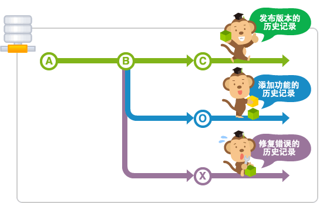

在数据库进行最初的提交后, Git 会创建一个名为 master 的分支。

### HEAD

HEAD 指向的是现在使用中的分支的最后一次更新。通常默认指向 master 分支的最后一次更新。通过移动 HEAD，就可以变更使用的分支。提交时使用 `~` 和 `^` 就可以指定某个提交的相对位置。HEAD 后面加上 `~` 可以指定 HEAD 之前的提交记录。`^` 来指定使用哪个为根节点。

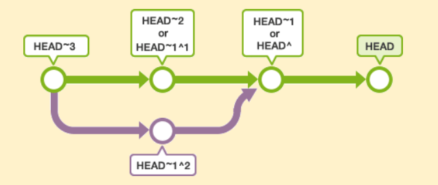

### stash

还未提交的修改内容以及新添加的文件，留在索引区域或工作树的情况下切换到其他的分支时，修改内容会从原来的分支移动到目标分支。

但是如果在 checkout 的目标分支中相同的文件也有修改，checkout 会失败的。这时要么先提交修改内容，要么用 stash 暂时保存修改内容后再 checkout。

stash 是临时保存文件修改内容的区域。stash 可以暂时保存工作树和索引里还没提交的修改内容，您可以事后再取出暂存的修改，应用到原先的分支或其他的分支上。

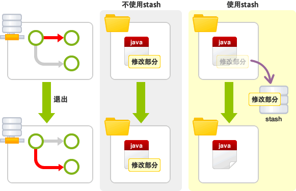

### merge

merge 合并保持修改内容的历史记录，但是历史记录会很复杂。

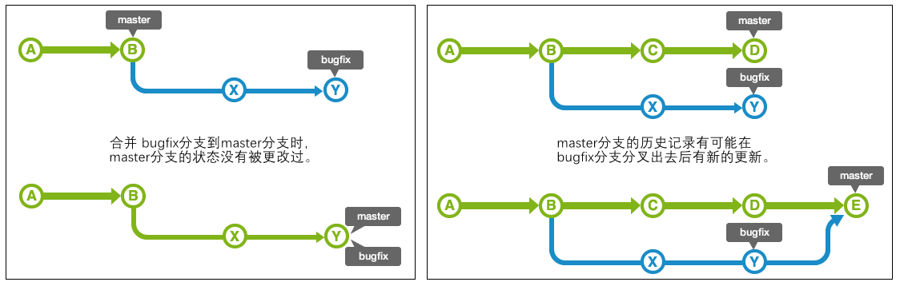

### rebase

rebase 合并历史记录简单，是在原有提交的基础上将差异内容反映进去。
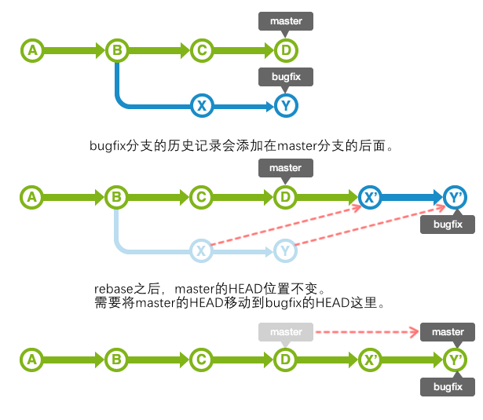

## 分支操作

### 建立分支

可以通过 branch 命令来创建分支。不指定参数直接执行 branch 命令的话，可以显示分支列表。 前面有 `*` 的就是现在的分支。

创建名为 issue1 的分支，并显示分支列表。

```bash
$ git branch issue1

$ git branch
  issue1
* main
```

### 切换分支

可以执行 checkout 命令切换分支，在 checkout 命令指定 `-b` 选项执行，可以创建分支并进行切换。

切换到 issue1 分支的状态下，修改文件内容并提交，历史记录会被记录到 issue1 分支。

```bash
$ git checkout issue1
Switched to branch 'issue1'

$ git add sample.txt
$ git commit -m"issue1分支添加"
[issue1 b68b7e0] issue1分支添加
 1 file changed, 2 insertions(+), 1 deletion(-)

 $ git log --graph --oneline
* b68b7e0 (HEAD -> issue1) issue1分支添加
*   94d7787 (origin/main, main) 合并
|\
| * 2f6ac56 github 远程修改
* | 844aa9c 本地修改
|/
* 83e0241 添加add的说明
* 90fd96a first commit
```

### 合并分支

执行 merge 命令以合并分支。该命令将指定分支导入到 HEAD 指定的分支。

执行 merge 命令命令，将 issue1 分支合并至 main 分支，这个是 fast-forward（快进）合并。

```bash
 $ git checkout main
Switched to branch 'main'
Your branch is up to date with 'origin/main'.

(base) $ git merge issue1
Updating 94d7787..b68b7e0
Fast-forward
 sample.txt | 3 ++-
 1 file changed, 2 insertions(+), 1 deletion(-)

(base) $ git log --graph --oneline
* b68b7e0 (HEAD -> main, issue1) issue1分支添加
*   94d7787 (origin/main) 合并
|\
| * 2f6ac56 github 远程修改
* | 844aa9c 本地修改
|/
* 83e0241 添加add的说明
* 90fd96a first commit
```

### 删除分支

在 branch 命令指定 `-d` 选项执行，以删除分支。

删除 issue1 分支。

```bash
$ git branch -d issue1
Deleted branch issue1 (was b68b7e0).

$ git branch
* main

$ git log --graph --oneline
* b68b7e0 (HEAD -> main) issue1分支添加
*   94d7787 (origin/main) 合并
|\
| * 2f6ac56 github 远程修改
* | 844aa9c 本地修改
|/
* 83e0241 添加add的说明
* 90fd96a first commit
```

### 并行操作

首先创建 issue2 分支和 issue3 分支，并切换到 issue2 分支，在 issue2 分支的 `sample.txt` 添加 commit 命令的说明后提交。然后切换到 issue3 分支，在 issue3 分支的 `sample.txt` 添加 commit 命令的说明后提交。

```bash
$ git branch issue2
$ git branch issue3

$ git checkout issue2
Switched to branch 'issue2'

$ git branch
* issue2
  issue3
  main

$ git add sample.txt
$ git commit -m"issue2操作"
[issue2 e0cb521] issue2操作
 1 file changed, 2 insertions(+), 1 deletion(-)

$ git log --graph --oneline
* e0cb521 (HEAD -> issue2) issue2操作
* b68b7e0 (main, issue3) issue1分支添加
*   94d7787 (origin/main) 合并
|\
| * 2f6ac56 github 远程修改
* | 844aa9c 本地修改
|/
* 83e0241 添加add的说明
* 90fd96a first commit

$ git checkout issue3
Switched to branch 'issue3'

$ git branch
  issue2
* issue3
  main

$ git add sample.txt

$ git commit -m"issue3操作"
[issue3 57b6972] issue3操作
 1 file changed, 2 insertions(+), 1 deletion(-)

$ git log --graph --oneline
* 57b6972 (HEAD -> issue3) issue3操作
* b68b7e0 (main) issue1分支添加
*   94d7787 (origin/main) 合并
|\
| * 2f6ac56 github 远程修改
* | 844aa9c 本地修改
|/
* 83e0241 添加add的说明
* 90fd96a first commit
```

这样，添加 commit 的说明的操作，和添加 pull 的说明的操作就并行进行了。

### 解决合并的冲突

把 issue2 分支和 issue3 分支的修改合并到 master。

切换 master 分支后，与 issue2 分支合并，将执行 fast-forward（快进）合并。

```bash
$ git checkout main
Switched to branch 'main'
Your branch is ahead of 'origin/main' by 1 commit.
  (use "git push" to publish your local commits)

$ git merge issue2
Updating b68b7e0..e0cb521
Fast-forward
 sample.txt | 3 ++-
 1 file changed, 2 insertions(+), 1 deletion(-)
```

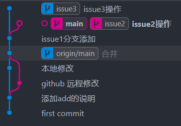

接着合并 issue3 分支，由于在同一行进行了修改，所以产生了冲突，自动合并失败

```bash
$ git merge issue3
Auto-merging sample.txt
CONFLICT (content): Merge conflict in sample.txt
Automatic merge failed; fix conflicts and then commit the result.

$ cat sample.txt
连猴子都懂的Git命令
add 把变更录入到索引中
github 远程修改内容
本地修改内容
在 issue1 分支下添加的内容
<<<<<<< HEAD
在 issue2 分支下添加的内容
=======
在 issue3 分支下添加的内容
>>>>>>> issue3
```

修改冲突的部分，重新提交。

```bash
$ git add sample.txt
$ git commit -m"合并issue3分支"
[main e6d1f77] 合并issue3分支

$ git log --graph --oneline
*   e6d1f77 (HEAD -> main) 合并issue3分支
|\
| * 57b6972 (issue3) issue3操作
* | e0cb521 (issue2) issue2操作
|/
* b68b7e0 issue1分支添加
*   94d7787 (origin/main) 合并
|\
| * 2f6ac56 github 远程修改
* | 844aa9c 本地修改
|/
* 83e0241 添加add的说明
* 90fd96a first commit
```

### 用 rebase 合并

合并 issue3 分支的时候，使用 rebase 可以使提交的历史记录显得更简洁。

现在暂时取消刚才的合并。

```bash
$ git reset --hard HEAD~
HEAD is now at e0cb521 issue2操作

$ git log --graph --oneline
* e0cb521 (HEAD -> main, issue2) issue2操作
* b68b7e0 issue1分支添加
*   94d7787 (origin/main) 合并
|\
| * 2f6ac56 github 远程修改
* | 844aa9c 本地修改
|/
* 83e0241 添加add的说明
* 90fd96a first commit
```

切换到 issue3 分支后，对 main 执行 rebase。和 merge 时的操作相同，修改在 `sample.txt` 发生冲突的部分。

rebase 的时候，修改冲突后的提交不是使用 commit 命令，而是执行 rebase 命令指定 `--continue` 选项。若要取消 rebase，指定 `--abort` 选项。

```bash
$ git checkout issue3
Switched to branch 'issue3'
$ git rebase main

$ git add sample.txt
$ git rebase --continue
[detached HEAD babe974] issue3操作
 1 file changed, 2 insertions(+), 1 deletion(-)
Successfully rebased and updated refs/heads/issue3.

$ git log --graph --oneline
* babe974 (HEAD -> issue3) issue3操作
* e0cb521 (main, issue2) issue2操作
* b68b7e0 issue1分支添加
*   94d7787 (origin/main) 合并
|\
| * 2f6ac56 github 远程修改
* | 844aa9c 本地修改
|/
* 83e0241 添加add的说明
* 90fd96a first commit
```

这样，在 main 分支的 issue3 分支就可以 fast-forward 合并了。切换到 main 分支后执行合并。

```bash
$ git checkout main
Switched to branch 'main'
Your branch is ahead of 'origin/main' by 2 commits.
  (use "git push" to publish your local commits)

$ git merge issue3
Updating e0cb521..babe974
Fast-forward
 sample.txt | 3 ++-
 1 file changed, 2 insertions(+), 1 deletion(-)

$ git log --graph --oneline
* babe974 (HEAD -> main, issue3) issue3操作
* e0cb521 (issue2) issue2操作
* b68b7e0 issue1分支添加
*   94d7787 (origin/main) 合并
|\
| * 2f6ac56 github 远程修改
* | 844aa9c 本地修改
|/
* 83e0241 添加add的说明
* 90fd96a first commit
```

## 远端数据库

### pull

执行 pull 可以取得远程数据库的历史记录。

本地数据库分支没有任何的更改将执行 fast-forward 合并。
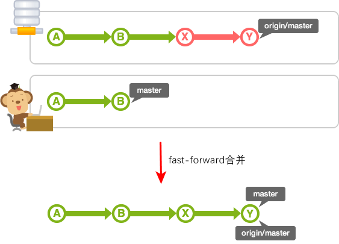
图中的 master 是本地数据库的 master 分支，`origin/master` 是远程数据库的 origin 的 master 分支。

如果本地数据库的 master 分支有新的历史记录，就需要合并双方的修改。

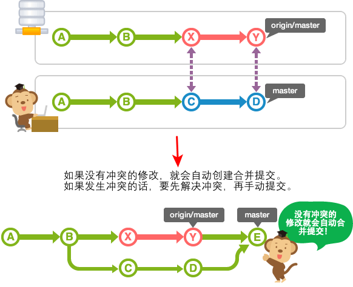

### fetch

执行 pull，远程数据库的内容就会自动合并。但是，有时只是想确认本地数据库的内容而不想合并。这种情况下，请使用 fetch。

执行 fetch 就可以取得远程数据库的最新历史记录。取得的提交会导入到没有名字的分支，这个分支可以从名为 FETCH_HEAD 的退出。

例如，在本地数据库和远程数据库的 origin，如果在从 B 进行提交的状态下执行 fetch，就会形成如下图所示的历史记录。

在这个状态下，若要把远程数据库的内容合并到本地数据库，可以合并 FETCH_HEAD，或者重新执行 pull。

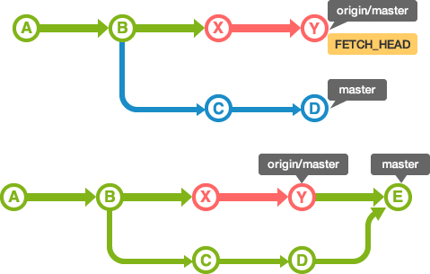

> 合并后，历史记录会和 pull 相同。**实际上 pull 的内容是 fetch + merge 组成的。**

### push

从本地数据库 push 到远程数据库时，要 fast-forward 合并 push 的分支。如果发生冲突，push 会被拒绝的。

若要共享在本地数据库创建的分支，需要明确的 push。因此，没有执行 push 就不会给远程数据库带来影响，因而可以自由的创建自己的分支。

> 基本上，远程数据库共享的提交是不能修改的。如果修改的话，跟远程数据库同步的其他数据库的历史记录会变得很奇怪的。

## 标签

标签是为了更方便地参考提交而给它标上易懂的名称。

Git 可以使用 2 种标签：轻标签和注解标签。打上的标签是固定的，不能像分支那样可以移动位置。

轻标签

- 添加名称

注解标签

- 添加名称
- 添加注解
- 添加签名

一般情况下，发布标签是采用注解标签来添加注解或签名的。轻标签是为了在本地暂时使用或一次性使用。

### 添加轻标签

使用` git tag <tagname>` 命令来添加标签，在 `<tagname>` 执行标签的名称。

如果没有使用参数而执行 tag ，可以显示标签列表。

如果在 log 命令添加 `--decorate` 选项执行，可以显示包含标签资料的历史记录。

```bash
$ git tag apple
$ git tag
apple

$ git log --decorate
commit babe9740fda8df3cb2fffb71efba89510561bc68 (HEAD -> main, tag: apple, issue3)
Author: CKCat <ckcatck@qq.com>
Date:   Thu Jun 23 15:44:26 2022 +0800

    issue3操作
    ...
```

### 添加注解标签

若要添加注解标签，可以在 tag 命令指定 `-a` 选项执行。执行后会启动编辑区，请输入注解，也可以指定 `-m` 选项来添加注解。

如果在 tag 命令指定 `-n` 选项执行，可以显示标签的列表和注解。

```bash
$ git tag -am"添加注解标签" banana

$ git tag -n
apple           issue3操作
banana          添加注解标签
```

### 删除标签

执行 `git tag -d <tagname>` 删除标签。

```bash
$ git tag -d banana
Deleted tag 'banana' (was 32445a9)

$ git tag -n
apple           issue3操作
```

## 改写提交

### 修改最近的提交

`commit --amend` 执行提交的话，可以修改同一个分支最近的提交内容和注解。

主要使用的场合：

- 添加最近提交时漏掉的档案
- 修改最近提交的注解

修改文件后执行 `commit --amend` 操作。

```bash
$ git log
commit 47b5320e7093bf243fed1385e777fd77621ce920 (HEAD -> main)
Author: CKCat <ckcatck@qq.com>
Date:   Thu Jun 23 15:44:26 2022 +0800

    操作issue3操作
$ git add sample.txt
$ git commit --amend
[main d2ed9d0] 执行commit --amend操作issue3操作
 Date: Thu Jun 23 15:44:26 2022 +0800
 1 file changed, 3 insertions(+), 1 deletion(-)

E:\Study\NoteCode\git-tutorial(main -> origin)
(base) $ git log
commit d2ed9d04cf81048ad711a595eab49dab90258ca2 (HEAD -> main)
Author: CKCat <ckcatck@qq.com>
Date:   Thu Jun 23 15:44:26 2022 +0800

    执行commit --amend操作issue3操作
```

### 取消过去的提交

revert 可以取消指定的提交内容。使用后面要提到的 rebase -i 或 reset 也可以删除提交。但是，不能随便删除已经发布的提交，这时需要通过 revert 创建要否定的提交。


主要使用的场合：

- 安全地取消过去发布的提交

用 log 命令确认历史记录。

```bash
$ git log
commit ca7dd5e0e3ecc86a7d4858a43583dfdb6b85357f (HEAD -> issue3)
Author: CKCat <ckcatck@qq.com>
Date:   Fri Jun 24 09:00:30 2022 +0800

    revert测试

commit babe9740fda8df3cb2fffb71efba89510561bc68 (tag: apple)
Author: CKCat <ckcatck@qq.com>
Date:   Thu Jun 23 15:44:26 2022 +0800

    issue3操作
    ...

$ git revert HEAD
[issue3 ea92671] Revert "取消revert"
 1 file changed, 1 insertion(+), 2 deletions(-)

 $ git log
commit ea926713db229d11e91eaabab384c8e54376e7f4 (HEAD -> issue3)
Author: CKCat <ckcatck@qq.com>
Date:   Fri Jun 24 09:01:40 2022 +0800

    Revert "取消revert"

    This reverts commit ca7dd5e0e3ecc86a7d4858a43583dfdb6b85357f.

commit ca7dd5e0e3ecc86a7d4858a43583dfdb6b85357f
Author: CKCat <ckcatck@qq.com>
Date:   Fri Jun 24 09:00:30 2022 +0800

    revert测试

commit babe9740fda8df3cb2fffb71efba89510561bc68 (tag: apple)
Author: CKCat <ckcatck@qq.com>
Date:   Thu Jun 23 15:44:26 2022 +0800

    issue3操作
    ...
```

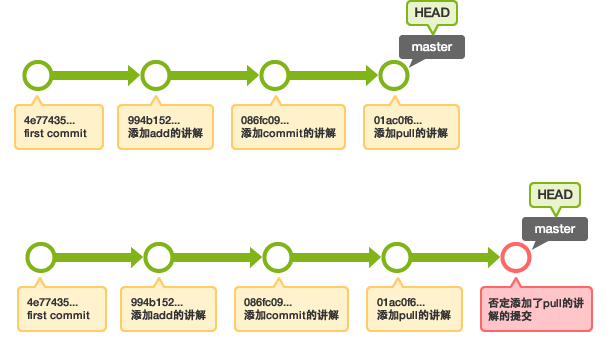

### 遗弃提交

reset 可以遗弃不再使用的提交。执行遗弃时，需要根据影响的范围而指定不同的模式，可以指定是否复原索引或工作树的内容。

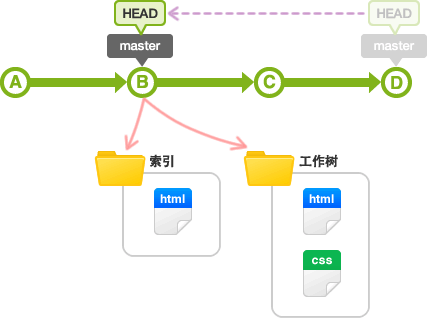

| 模式名称    | HEAD 的位置 | 索引   | 工作树 |
| ----------- | ----------- | ------ | ------ |
| soft        | 修改        | 不修改 | 不修改 |
| mixed(默认) | 修改        | 修改   | 不修改 |
| hard        | 修改        | 修改   | 修改   |

主要使用的场合：

- 复原修改过的索引的状态(mixed)
- 彻底取消最近的提交(hard)
- 只取消提交(soft)

```bash
$ git log
commit ea926713db229d11e91eaabab384c8e54376e7f4 (HEAD -> issue3)
Author: CKCat <ckcatck@qq.com>
Date:   Fri Jun 24 09:01:40 2022 +0800

    Revert "取消revert"

    This reverts commit ca7dd5e0e3ecc86a7d4858a43583dfdb6b85357f.

commit ca7dd5e0e3ecc86a7d4858a43583dfdb6b85357f
Author: CKCat <ckcatck@qq.com>
Date:   Fri Jun 24 09:00:30 2022 +0800

    revert测试

commit babe9740fda8df3cb2fffb71efba89510561bc68 (tag: apple)
Author: CKCat <ckcatck@qq.com>
Date:   Thu Jun 23 15:44:26 2022 +0800

    issue3操作
    ...

$ git reset --hard HEAD~~
HEAD is now at babe974 issue3操作

 $ git log
commit babe9740fda8df3cb2fffb71efba89510561bc68 (HEAD -> issue3, tag: apple)
Author: CKCat <ckcatck@qq.com>
Date:   Thu Jun 23 15:44:26 2022 +0800

    issue3操作

commit e0cb521f5947288c8452b28f05524b1bc71cbb23 (issue2)
Author: CKCat <ckcatck@qq.com>
Date:   Thu Jun 23 15:42:11 2022 +0800

    issue2操作
    ...
```

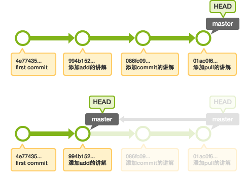

> 在 reset 之前的提交可以参照 ORIG_HEAD。Reset 错误的时候，执行` git reset --hard ORIG_HEAD` 就可以还原到 reset 前的状态。

### 提取提交

cherry-pick 您可以从其他分支复制指定的提交，然后导入到现在的分支。


主要使用的场合：

- 把弄错分支的提交移动到正确的地方
- 把其他分支的提交添加到现在的分支

```bash
$ git log --graph --oneline
* 40b4d95 (HEAD -> main) cherry-pick
* d2ed9d0 (origin/main) 执行commit --amend操作issue3操作
* e0cb521 (issue2) issue2操作
* b68b7e0 issue1分支添加
*   94d7787 合并
|\
| * 2f6ac56 github 远程修改
* | 844aa9c 本地修改
|/
* 83e0241 添加add的说明
* 90fd96a first commit

$ git checkout bugfix
$ git log --graph --oneline
* 4d8800f (HEAD -> bugfix) 修复bug2
* d711099 修复bug1
* babe974 (tag: apple, issue3) issue3操作
* e0cb521 (issue2) issue2操作
* b68b7e0 issue1分支添加
*   94d7787 合并
|\
| * 2f6ac56 github 远程修改
* | 844aa9c 本地修改
|/
* 83e0241 添加add的说明
* 90fd96a first commit

$ git checkout main
Already on 'main'
Your branch is ahead of 'origin/main' by 2 commits.
  (use "git push" to publish your local commits)
$ git cherry-pick d711099
$ git add sample.txt
$ git commit
[main 99db644] 修复bug1
 Date: Fri Jun 24 09:17:21 2022 +0800
 1 file changed, 2 insertions(+), 1 deletion(-)

$ git log --graph --oneline
* 99db644 (HEAD -> main) 修复bug1
* 40b4d95 cherry-pick
* d2ed9d0 (origin/main) 执行commit --amend操作issue3操作
* e0cb521 (issue2) issue2操作
* b68b7e0 issue1分支添加
*   94d7787 合并
|\
| * 2f6ac56 github 远程修改
* | 844aa9c 本地修改
|/
* 83e0241 添加add的说明
* 90fd96a first commit
```

### 改写提交的历史记录

在 rebase 指定 i 选项，您可以改写、替换、删除或合并提交。

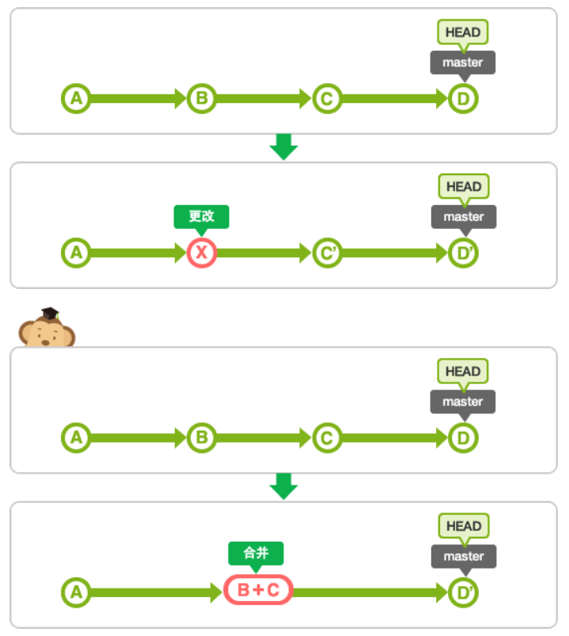

主要使用的场合：

- 在 push 之前，重新输入正确的提交注解。
- 清楚地汇合内容含义相同的提交。
- 添加最近提交时漏掉的档案。

#### 用 rebase -i 汇合提交

```bash
$ git rebase -i HEAD~~

pick 40b4d95 cherry-pick
pick 99db644 修复bug1

# Rebase d2ed9d0..99db644 onto d2ed9d0 (2 commands)
#
# Commands:
# p, pick <commit> = use commit
# r, reword <commit> = use commit, but edit the commit message
# e, edit <commit> = use commit, but stop for amending
# s, squash <commit> = use commit, but meld into previous commit
# f, fixup [-C | -c] <commit> = like "squash" but keep only the previous
#                    commit's log message, unless -C is used, in which case
#                    keep only this commit's message; -c is same as -C but
#                    opens the editor
# x, exec <command> = run command (the rest of the line) using shell
# b, break = stop here (continue rebase later with 'git rebase --continue')
# d, drop <commit> = remove commit
# l, label <label> = label current HEAD with a name
# t, reset <label> = reset HEAD to a label
# m, merge [-C <commit> | -c <commit>] <label> [# <oneline>]
# .       create a merge commit using the original merge commit's
# .       message (or the oneline, if no original merge commit was
# .       specified); use -c <commit> to reword the commit message
#
# These lines can be re-ordered; they are executed from top to bottom.
#
# If you remove a line here THAT COMMIT WILL BE LOST.
#
# However, if you remove everything, the rebase will be aborted.
#
```

将第二行的 `pick` 改成 `squash`，然后保存并退出。由于合并后要提交，所以接着会显示提交信息的编辑器，请编辑信息后保存并退出。

```bash
 $ git log --graph --oneline
* 6d58763 (HEAD -> main) cherry-pick
* d2ed9d0 (origin/main) 执行commit --amend操作issue3操作
* e0cb521 (issue2) issue2操作
* b68b7e0 issue1分支添加
*   94d7787 合并
|\
| * 2f6ac56 github 远程修改
* | 844aa9c 本地修改
|/
* 83e0241 添加add的说明
* 90fd96a first commit
```

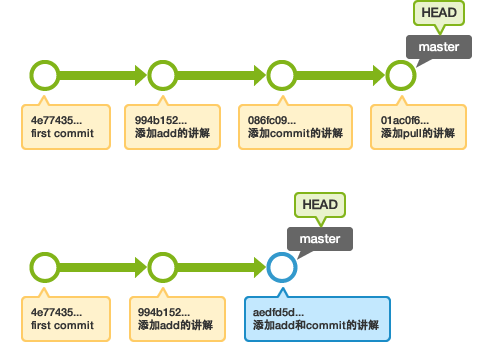

#### 用 rebase -i 修改提交

```bash
$ git rebase -i HEAD~~

# Rebase e0cb521..6d58763 onto e0cb521 (2 commands)
#
# Commands:
# p, pick <commit> = use commit
# r, reword <commit> = use commit, but edit the commit message
# e, edit <commit> = use commit, but stop for amending
# s, squash <commit> = use commit, but meld into previous commit
# f, fixup [-C | -c] <commit> = like "squash" but keep only the previous
#                    commit's log message, unless -C is used, in which case
#                    keep only this commit's message; -c is same as -C but
#                    opens the editor
# x, exec <command> = run command (the rest of the line) using shell
# b, break = stop here (continue rebase later with 'git rebase --continue')
# d, drop <commit> = remove commit
# l, label <label> = label current HEAD with a name
# t, reset <label> = reset HEAD to a label
# m, merge [-C <commit> | -c <commit>] <label> [# <oneline>]
# .       create a merge commit using the original merge commit's
# .       message (or the oneline, if no original merge commit was
# .       specified); use -c <commit> to reword the commit message
#
# These lines can be re-ordered; they are executed from top to bottom.
#
# If you remove a line here THAT COMMIT WILL BE LOST.
#
# However, if you remove everything, the rebase will be aborted.
#
```

将第一行的 `pick` 改成 `edit` ，然后保存并退出。将会显示以下内容，修改过的提交呈现退出状态。

```bash
Stopped at d2ed9d0...  执行commit --amend操作issue3操作
You can amend the commit now, with

  git commit --amend

Once you are satisfied with your changes, run

  git rebase --continue

pick d2ed9d0 执行commit --amend操作issue3操作
pick 6d58763 cherry-pick
```

打开 `sample.txt`，适当地修改，用 `commit --amend` 保存修改。

现在已经 commit，但是 rebase 操作还没结束。若要通知这个提交的操作已经结束，请指定 `--continue` 选项执行 rebase。

```bash
$ git add sample.txt
$ git commit --amend
[detached HEAD 1c5abb5] rebase 提交修改 执行commit --amend操作issue3操作
 Date: Thu Jun 23 15:44:26 2022 +0800
 1 file changed, 4 insertions(+), 1 deletion(-)

$ git rebase --continue
Auto-merging sample.txt
CONFLICT (content): Merge conflict in sample.txt
error: could not apply 6d58763... cherry-pick
hint: Resolve all conflicts manually, mark them as resolved with
hint: "git add/rm <conflicted_files>", then run "git rebase --continue".
hint: You can instead skip this commit: run "git rebase --skip".
hint: To abort and get back to the state before "git rebase", run "git rebase --abort".
Could not apply 6d58763... cherry-pick

$ git add sample.txt

$ git rebase --continue
[detached HEAD f3082c9] cherry-pick
 1 file changed, 2 insertions(+)
Successfully rebased and updated refs/heads/main.
```

提示发生冲突, 修改冲突部分后再执行 add 和 rebase --continue 即可，不需要 commit 操作。

如果在中途要停止 rebase 操作，请在 rebase 指定 `--abort` 选项执行，这样就可以抹去并停止在 rebase 的操作。

如果要把多个提交修改成 edit，下一个要修改的提交会退出，请执行同样的修改。

> 实际上，在 rebase 之前的提交会以 ORIG_HEAD 之名存留。如果 rebase 之后无法复原到原先的状态，可以用 git reset --hard ORIG_HEAD 复原到 rebase 之前的状态。

### 汇合分支上的提交，然后一同合并到分支

merge 的特殊选项 squash 用这个选项指定分支的合并，就可以把所有汇合的提交添加到分支上。

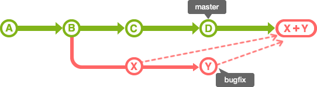

主要使用的场合：

- 汇合主题分支的提交，然后合并提交到目标分支。

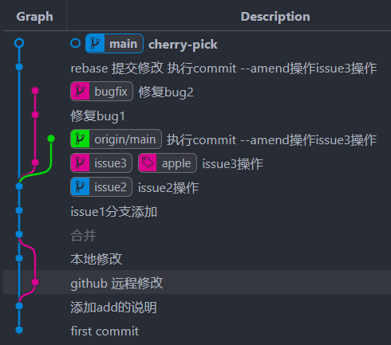

```bash
$ git merge --squash issue3
Auto-merging sample.txt
CONFLICT (content): Merge conflict in sample.txt
Squash commit -- not updating HEAD
Automatic merge failed; fix conflicts and then commit the result.

$ git add sample.txt
$ git commit
[main feca35d] Squashed commit of the following:
 1 file changed, 2 insertions(+), 1 deletion(-)
```

issue3 分支上所有的提交都汇合并添加到 main 分支了。
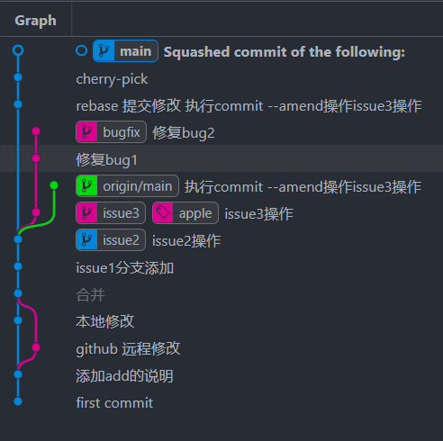

# 风格指南

下列内容主要来自：https://github.com/aseaday/git-style-guide

这份风格指南受到 [_How to Get Your Change Into the Linux Kernel_](https://www.kernel.org/doc/Documentation/SubmittingPatches)，[git man pages](http://git-scm.com/doc) 和大量社区通用实践的启发。

1. [分支](#branches)
2. [提交](#commits)
3. [消息](#messages)
4. [合并](#merging)
5. [杂项](#misc)

## Branches

- 选择*简短*和*具有描述性*的名字来命名分支：

  ```shell
  # 好
  $ git checkout -b oauth-migration

  # 不好，过于模糊
  $ git checkout -b login_fix
  ```

- 来自外部的标识符也适合用作分支的名字，例如来自 Github 的 Issue 序号。

  ```shell
  # GitHub issue #15
  $ git checkout -b issue-15
  ```

- 用破折号分割单词。

- 当不同的人围绕同一个特性开发时，维护整个团队的特性分支与每个人的独立分支是比较方便的做法。使用如下的命名方式：

  ```shell
  $ git checkout -b feature-a/master # team-wide branch
  $ git checkout -b feature-a/maria # Maria's branch
  $ git checkout -b feature-a/nick # Nick's branch
  ```

  合并时，由每个人的独立分支向全队的功能分支合并，最后合并到主分支。见[合并](#merging) 。

- 合并之后，除非有特殊原因要求不删，否则从上游仓库中删除你的分支。使用如下命令查看已合并的分支：

  ```shell
  $ git branch --merged | grep -v "\*"
  ```

## Commits

- 每个提交应当只包含一个简单的逻辑改动，不要在一个提交里包含多个逻辑改动。比如，如果一个补丁修复了一个 Bug，又优化了一个特性的性能，就将其拆分。
- 不要将一个逻辑改动拆分提交。例如一个功能的实现及其对应的测试应当一并提交。
- 尽早、尽快提交。出问题时，短小、完整的提交更容易发现并修正。
- 提交应当依*逻辑*排序。例如，如果 X 提交依赖于 Y，那么 Y 提交应该在 X 前面。

### Messages

- 使用编辑器编写提交信息，而非命令行。

  ```shell
  # 好
  $ git commit

  # 不好
  $ git commit -m "Quick fix"
  ```

  使用命令行会鼓励试图用一行概括提交內容的风气，而这会令提交信息难以理解。

- 概要行（即第一行）应当简明扼要。它最好不超过 50 个字符，首字母大写，使用现在时祈使语气。不要以句号结尾, 因为它相当于*标题*。

  ```shell
  # 好
  Mark huge records as obsolete when clearing hinting faults

  # 不好
  fixed ActiveModel::Errors deprecation messages failing when AR was used outside of Rails.
  ```

- 在那之后空一行，然后填写详细描述。每行不超过 _72 字符_，解释*为什么*需要改动, *如何*解决了这个 issue 以及它有什么*副作用*。

  最好提供相关资源的链接，例如 bug tracker 的 issue 编号：

  ```shell
  Short (50 chars or fewer) summary of changes

  More detailed explanatory text, if necessary. Wrap it to
  72 characters. In some contexts, the first
  line is treated as the subject of an email and the rest of
  the text as the body.  The blank line separating the
  summary from the body is critical (unless you omit the body
  entirely); tools like rebase can get confused if you run
  the two together.

  Further paragraphs come after blank lines.

  - Bullet points are okay, too

  - Use a hyphen or an asterisk for the bullet,
    followed by a single space, with blank lines in
    between

  Source http://tbaggery.com/2008/04/19/a-note-about-git-commit-messages.html
  ```

  最后，编写提交信息时，设想一下你一年以后再看这段提交信息时，希望获取什么信息。

- 如果 _提交 A_ 依赖于另一个 _提交 B_ ，在前者的 commit message 中应当指明。援引对应提交的 Hash。

  同理，如果 _提交 A_ 解决了 _提交 B_ 引入的 bug，这应当也被在 _提交 A_ 提及。

- 如果将一个提交 squash 到另一个提交，分别使用 `--squash` 和 `--fixup` 来强调目的。
  ```shell
  $ git commit --squash f387cab2
  ```
  _（Rebase 时使用 `--autosquash` 参数，标记的提交就会自动 squash。）_

## Merging

- **不要篡改提交历史**。仓库的历史本身就很宝贵，重要的是它能够还原*实际发生了什么*。对任何参与项目的人来说，修改历史是万恶之源。
- 尽管如此，有些时候还是可以重写历史，例如：
  - 你一个人孤军奋战，而且你的代码不会被人看到。
  - 你希望整理分支（例如使用 squash），以便日后合并。
    最重要的，_不要重写你的 master 分支历史_ 或者任何有特殊意义的分支（例如发布分支或 CI 分支）。
- 保持你的提交历史*干净*、_简单_。_在你 merge_ 你的分支之前：

  1. 确保它符合风格指南，如果不符合就执行相应操作，比如 squash 或重写提交信息。
  2. 将其 rebase 到目标分支：
     ```shell
     [my-branch] $ git fetch
     [my-branch] $ git rebase origin/master
     # then merge
     ```
     这样会在 master 后直接添加一个新版本，令提交历史更简洁。

  _（这个策略更适合较短生命周期的分支，否则还是最好经常合并而不是 rebase。）_

- 如果你的分支包含多个 commmit , 不要使用快进模式。

  ```shell
  # 好；注意添加合并信息
  $ git merge --no-ff my-branch

  # 不好
  $ git merge my-branch
  ```

## Misc.

- 有许多工作流，每一个都有好有坏。一个工作流是否符合你的情况，取决于你的团队，项目，和你的开发规律。

  也就是说，重要的是认真 _选择_ 合适的工作流并且坚持。

- _保持统一_， 这涉及到从工作流到你的提交信息，分支名还有标签。 在整个 Repository 中保持统一的命名风格有助于辨认工作进度。
- _push 前测试_， 不要提交未完成的工作。
- 使用 [annotated tags](http://git-scm.com/book/en/v2/Git-Basics-Tagging#Annotated-Tags) 标记发布版本或者其他重要的时间点。

  个人开发可以使用 [lightweight tags](http://git-scm.com/book/en/v2/Git-Basics-Tagging#Lightweight-Tags)，例如为以后参考做标记。

- 定期维护，保证你的仓库状态良好，包括本地还有远程的仓库。

  - [`git-gc(1)`](http://git-scm.com/docs/git-gc)
  - [`git-prune(1)`](http://git-scm.com/docs/git-prune)
  - [`git-fsck(1)`](http://git-scm.com/docs/git-fsck)

### 如何恢复初始的 git 提交。

您可以删除 HEAD 并将存储库还原到新的状态，在该状态下可以创建一个新的初始提交：

```bash
git update-ref -d HEAD
```

创建新提交之后，如果您已经将其推入远程，则需要强制将其发送到远程，以便覆盖先前的初始提交：

```bash
git push --force origin
```

> 不要使用 `rm -rf .git` 或者像这样的任何操作，这样都会彻底清除整个存储库，包括所有其他分支，以及您试图重置的分支。

### 撤销 git add 和 commit 操作

还没有 push 的时候使用 reset 命令。

```bash
git reset --mixed commit_id    #不删除工作空间改动代码，撤销 commit ，并且撤销 git add . 操作，默认操作。
git reset --soft  commit_id    # 不删除工作空间改动代码，撤销 commit ，不撤销 git add .  。
git reset --hard commit_id     # 删除工作空间改动代码，撤销 commit ，撤销 git add . 慎用这个命令。
git reset –hard origin/master  # 将本地的状态回退到和远程的一样
git commit --amend             # 只是改一下注释
```

已经 push 了，可以使用 git revert 还原已经提交的修改 ，此次操作之前和之后的 commit 和 history 都会保留，并且把这次撤销作为一次最新的提交。

```bash
git revert HEAD          # 撤销前一次 commit 。
git revert HEAD~n        # 撤销前n次 commit 。
git revert commit-id     # 撤销指定的版本，撤销也会作为一次提交进行保存。
git reset HEAD^ file     # 回退 flie 这个文件的版本到上一个版本
```

### 解决 Git 更新本地冲突：commit your changes or stash them before you can merge

方法一：stash

```bash
git stash               让工作区内容保证与上一次提交内容相同，同时备份当前修改的内容
git pull                 拉取仓库的最新内容
git stash pop       在仓库最新内容的基础上添加当前修改的内容
```

方法二：直接完全覆盖本地修改

```bash
git reset --hard
git pull
```

### 如何清洗 Github 提交历史

当 Github 的 Repo 变得日益臃肿、或者上传了敏感内容时，常见的方法时清理相关文件的所有历史提交记录：

```bash
git filter-branch --force --index-filter 'git rm --cached --ignore-unmatch ${FILEPATH}' --prune-empty --tag-name-filter cat -- --all
git push origin master --force
rm -rf .git/refs/original/
git reflog expire --expire=now --all
git gc --prune=now
git gc --aggressive --prune=now
```

但若这类文件非常多的时候，一个可选的方法时直接清空所有历史记录：

```bash
rm -rf .git
git init git
add -A
git commit -m "clear history"
git remote add origin ${GITHUB_REPO_URL}
git push -f -u origin master
```

参考链接: https://exp-blog.com/scm/qing-xi-github-ti-jiao-li-shi/

### ssh 方式及免密码配置

git ssh 方式免密提交方式需要将 ssh-keygen 生成的公钥放到服务器上

全局用户名密码配置

```
git config --global user.name "CKCat"
git config --global user.email "ckcatck@qq.com"
```

生成公钥和私钥

1、首先需要检查你电脑是否已经有 SSH key

运行 git Bash 客户端，检查本机的 ssh 密钥。

```bash
$ cd ~/.ssh
$ ls
```

如果不是第一次使用，已经存在 `id_rsa.pub` 或 `id_dsa.pub` 文件。请执行下面的操作，清理原有 ssh 密钥。

```bash
$ mkdir key_backup
$ cp id_rsa* key_backup
$ rm id_rsa*
```

2、执行生成公钥和私钥的命令，生成新的密钥：

```bash
ssh-keygen -t rsa -C "CKCat"
```

代码参数：

`-t` 指定密钥类型，默认是 rsa ，可以省略。

`-C` 设置注释文字，比如邮箱。

执行命令时会提示要求输入邮箱密码，这个密码会在提交时使用，如果为空的话提交时则不用输入。这个设置是防止别人往你的项目里提交内容。我们自己的电脑，自己本机使用，当然不用密码了。

按默认为空，直接按回车 3 下，生成 `id_rsa` 和 `id_rsa.pub` 两个秘钥文件。

执行查看公钥信息：

```bash
cat ~/.ssh/id_rsa.pub
```

Windows 系统，位置在用户目录下 `.ssh`文件夹中。`%USERPROFILE%`

3、复制公钥信息，打开 github，我的账户 -> setting -> SSH and GPG keys，如下图所示，把公钥粘贴到公钥文本框中，标题自己定义，然后点击确定按键，输入密码。


然后，提交时就不再需要用户名和密码了。

# 参考：

https://backlog.com/git-tutorial/cn/

https://github.com/aseaday/git-style-guide
