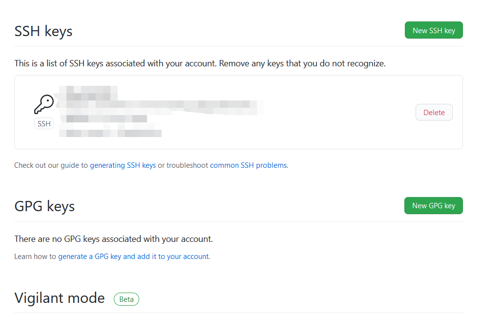

本文主要记录 git 使用过程中需要搜索的一些命令。

### 如何恢复初始的 git 提交。
您可以删除 HEAD 并将存储库还原到新的状态，在该状态下可以创建一个新的初始提交：
```bash
git update-ref -d HEAD
```

创建新提交之后，如果您已经将其推入远程，则需要强制将其发送到远程，以便覆盖先前的初始提交：
```bash
git push --force origin
```
> 不要使用 `rm -rf .git` 或者像这样的任何操作，这样都会彻底清除整个存储库，包括所有其他分支，以及您试图重置的分支。

### 撤销 git add和 commit 操作
还没有 push 的时候使用 reset 命令。
```bash
git reset --mixed commit_id    #不删除工作空间改动代码，撤销 commit ，并且撤销 git add . 操作，默认操作。
git reset --soft  commit_id    # 不删除工作空间改动代码，撤销 commit ，不撤销 git add .  。
git reset --hard commit_id     # 删除工作空间改动代码，撤销 commit ，撤销 git add . 慎用这个命令。
git reset –hard origin/master  # 将本地的状态回退到和远程的一样
git commit --amend             # 只是改一下注释
```

已经 push 了，可以使用 git revert 还原已经提交的修改 ，此次操作之前和之后的 commit 和 history 都会保留，并且把这次撤销作为一次最新的提交。
```bash
git revert HEAD          # 撤销前一次 commit 。
git revert HEAD~n        # 撤销前n次 commit 。
git revert commit-id     # 撤销指定的版本，撤销也会作为一次提交进行保存。
git reset HEAD^ file     # 回退 flie 这个文件的版本到上一个版本
```

## 解决 Git 更新本地冲突：commit your changes or stash them before you can merge

方法一：stash
```bash
git stash               让工作区内容保证与上一次提交内容相同，同时备份当前修改的内容
git pull                 拉取仓库的最新内容
git stash pop       在仓库最新内容的基础上添加当前修改的内容
```


方法二：直接完全覆盖本地修改
```bash
git reset --hard
git pull
```

# 如何清洗 Github 提交历史
当 Github 的 Repo 变得日益臃肿、或者上传了敏感内容时，常见的方法时清理相关文件的所有历史提交记录：
```bash
git filter-branch --force --index-filter 'git rm --cached --ignore-unmatch ${FILEPATH}' --prune-empty --tag-name-filter cat -- --all 
git push origin master --force 
rm -rf .git/refs/original/ 
git reflog expire --expire=now --all 
git gc --prune=now 
git gc --aggressive --prune=now
```
但若这类文件非常多的时候，一个可选的方法时直接清空所有历史记录：
```bash
rm -rf .git 
git init git 
add -A 
git commit -m "clear history" 
git remote add origin ${GITHUB_REPO_URL} 
git push -f -u origin master
```
参考链接: https://exp-blog.com/scm/qing-xi-github-ti-jiao-li-shi/

# ssh 方式及免密码配置
git ssh 方式免密提交方式需要将 ssh-keygen 生成的公钥放到服务器上

全局用户名密码配置
```
git config --global user.name "CKCat" 
git config --global user.email "ckcatck@qq.com"
```
生成公钥和私钥

1、首先需要检查你电脑是否已经有 SSH key

运行 git Bash 客户端，检查本机的ssh密钥。
```bash
$ cd ~/.ssh 
$ ls
```
如果不是第一次使用，已经存在 `id_rsa.pub` 或 `id_dsa.pub` 文件。请执行下面的操作，清理原有 ssh 密钥。
```bash
$ mkdir key_backup   
$ cp id_rsa* key_backup   
$ rm id_rsa*
```

2、执行生成公钥和私钥的命令，生成新的密钥：
```bash
ssh-keygen -t rsa -C "CKCat"
```

代码参数：

`-t` 指定密钥类型，默认是 rsa ，可以省略。

`-C` 设置注释文字，比如邮箱。

执行命令时会提示要求输入邮箱密码，这个密码会在提交时使用，如果为空的话提交时则不用输入。这个设置是防止别人往你的项目里提交内容。我们自己的电脑，自己本机使用，当然不用密码了。

按默认为空，直接按回车 3 下，生成 `id_rsa` 和 `id_rsa.pub` 两个秘钥文件。

执行查看公钥信息：
```bash
cat ~/.ssh/id_rsa.pub
```
Windows 系统，位置在用户目录下 `.ssh`文件夹中。`%USERPROFILE%`

3、复制公钥信息，打开 github，我的账户 -> setting -> SSH and GPG keys，如下图所示，把公钥粘贴到公钥文本框中，标题自己定义，然后点击确定按键，输入密码。



然后，提交时就不再需要用户名和密码了。
