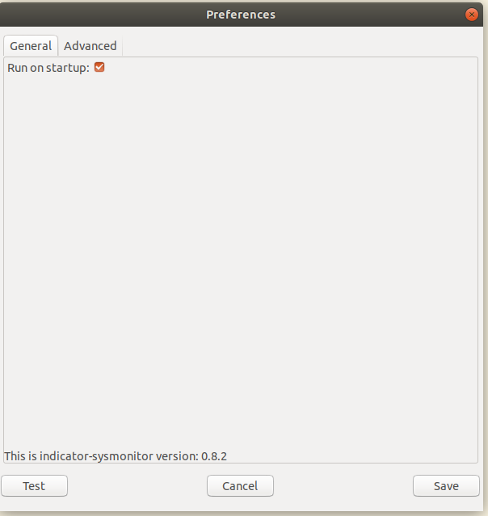
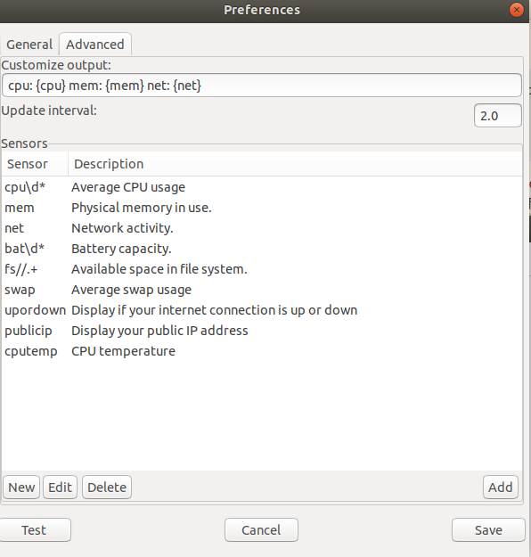
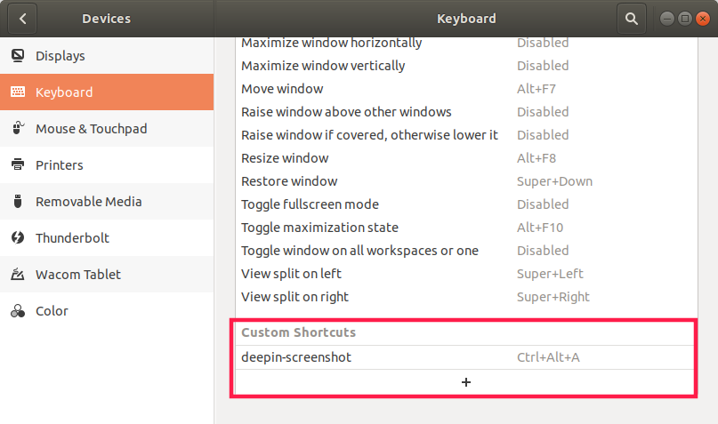
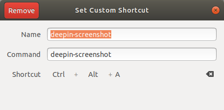
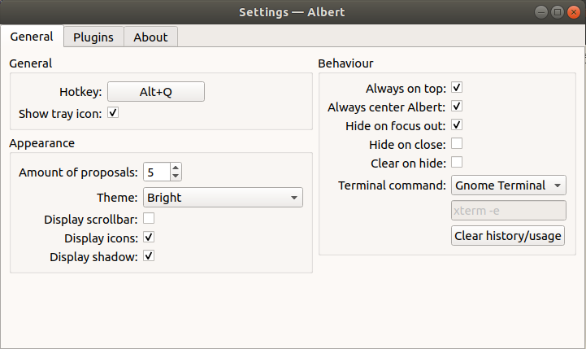

# 1. Android studio 出现 grant current user access to /dev/kvm 以及/dev/kvm devices: permission denies

linux 中启动模拟器出现 `grant current user access to /dev/kvm` 错误

- 临时解决方法：

打开 terminal 输入代码 `sudo chown username -R /dev/kvm` 注意 username 是你用的用户名， 重新启动模拟器就可以了。

- 永久解决办法：

```bash
# 安装qemu-kvm
sudo apt install qemu-kvm

# 使用以下命令将您的用户添加到kvm组：
sudo adduser $USER kvm

# 如果仍然显示拒绝权限：
sudo chown $USER /dev/kvm
```

# 2. Android studio 创建快捷方式

打开`/usr/share/applications`目录，使用`sudo vim AndroidStudio.desktop`创建 AndroidStudio 的快捷方式，加入以下内容：

```
[Desktop Entry]
Name=Android Studio     #名称
Comment=Android Dev     #注释
StartupNotify=true
Terminal=false
Type=Application
Icon=/home/ckcat/DevelopTools/android-studio/bin/studio.png     #设置图标
Exec=/home/ckcat/DevelopTools/android-studio/bin/studio.sh %F   #设置启动方式
```

保存退出后，其图标将会出现在 Applications 中，将其复制到桌面即可创建桌面快捷方式。

# 3. Ubuntu 标题栏实时显示上下行网速、CPU 及内存使用率

安装 indicator-sysmonitor：

```
sudo add-apt-repository ppa:fossfreedom/indicator-sysmonitor
sudo apt-get update

sudo apt-get install indicator-sysmonitor
```

终端执行：`indicator-sysmonitor &`， 为了方便还要为程序添加开机启动！鼠标右键点击标题栏上图标，弹出菜单，选择首选项，出现如下界面：


最后进行格式设定,设置界面如下：


设置好之后可以点击 Test 以下，最后别忘了保存,最终效果如下：


# 4. 设置深度截图快捷方式

通过应用商店安装[`deepin-screenshot`](<(https://github.com/linuxdeepin/deepin-screenshot)>),在系统 Keyboard 中添加深度截图，设置快捷方式。




# 5. 配置环境变量

## 5.1. 路径写法

```bash
# 可执行文件(一般在文件夹bin内):
export PATH=/usr/local/cuda-8.0/bin:$PATH

# 库文件(一般在文件夹lib内 .so):
export LD_LIBRARY_PATH=/home/opencv2.4.9/lib:$LD_LIBRARY_PATH

```

## 5.2. 临时设置

在终端中输入`export`命令：

```bash
export PATH=/usr/local/cuda-8.0/bin:$PATH
```

## 5.3. 当前用户的全局设置

打开 `~/.bashrc` ，在末尾添加环境变量,如下所示：

```bash
export PATH=/home/public/software_install/protobuf-3.1.0/bin:$PATH
export LD_LIBRARY_PATH=/home/public/software_install/protobuf-3.1.0/lib:$LD_LIBRARY_PATH
```

执行：`source ~/.bashrc`使之生效。

## 5.4. 所有用户的全局设置

使用 `sudo vim /etc/profile` 打开系统配置文件，在末尾添加环境变量，如下所示：

```bash
export PATH=/home/public/software_install/protobuf-3.1.0/bin:$PATH
export LD_LIBRARY_PATH=/home/public/software_install/protobuf-3.1.0/lib:$LD_LIBRARY_PATH
```

执行：`source profile`使之生效。

配置好后可以使用 `echo $PATH` 或 `env` 测试当前的环境变量。

# 6. adb devices 报错 no permissions (user in plugdev group; are your udev rules wrong?)

参考仓库：https://github.com/snowdream/51-android 或 https://github.com/M0Rf30/android-udev-rules

如果还是不行的话再参考下列方法。

## 6.1. lsusb 找到你手机的 usb 地址

```bash
$ lsusb
Bus 002 Device 003: ID 18d1:4ee7 Google Inc.
Bus 002 Device 001: ID 1d6b:0003 Linux Foundation 3.0 root hub
Bus 001 Device 003: ID 04f2:b59e Chicony Electronics Co., Ltd
Bus 001 Device 004: ID 8087:0aaa Intel Corp.
Bus 001 Device 002: ID 0ea0:2213 Ours Technology, Inc.
Bus 001 Device 001: ID 1d6b:0002 Linux Foundation 2.0 root hub
```

他会列出来所有的 usb 设备，你找下。如果试下找不到，那么拔掉手机看下，哪了没有了就是哪个。

## 6.2. 修改`/etc/udev/rules.d/51-android.rules`文件

创建`51-android.rules`文件

```bash
$ sudo gedit /etc/udev/rules.d/51-android.rules
[sudo] password for ckcat:
```

添加下列内容

```bash
ATTR{idProduct}=="4ee7", SYMLINK+="android_adb", MODE="0660", GROUP="plugdev", TAG+="uaccess", SYMLINK+="android"
```

注意：`ATTR{idProduct}` 的值是你查找手机设备的 usb 的地址。

## 6.3. 执行下列命令

```bash
$ sudo usermod -a -G plugdev $(id -u -n)
$ sudo udevadm control --reload-rules
$ sudo service udev restart
$ sudo udevadm trigger

```

执行完上述命令后，重启 adb：

```bash
$ adb kill-server
$ adb devices
* daemon not running; starting now at tcp:5037
* daemon started successfully
List of devices attached
HT6770300079	unauthorized

```

在手机上允许就可以了。

参考：

```
https://www.cnblogs.com/caoxinyu/p/10568463.html
https://juejin.im/post/5bed2b45f265da61530457ee
```

# 7. VIM 普通用户保存文件时用 sudo 获取 root 权限

```bash
:w !sudo tee %
```

百分号 (`%`) 代表当前文件名，这条命令的含义是把当前编辑的文件的内容当做标准输入输出到命令 `sudo tee` 文件名的文件里去，也就是 `sudo` 保存为当前文件名。

# 8. 安装 nodejs

1.安装仓库中包含的最新版本

```
sudo apt update
sudo apt install nodejs

# 安装npm管理工具

sudo apt install npm
```

2.升级 node 版本为长服务版（lts）

```
sudo npm install -g n
sudo n lts
```

3.切换版本

```
# 可以通过以下命令来切换node的版本

sudo n #将显示本机的可用版本列表，通过上下键来选择对应的版本

# 如果对版本比较熟悉，可直接指定版本
sudo n 10.13.0

# 查看node版本
sudo n -v
```

4.升级 npm

```
sudo npm i -g npm
```

# 9. ubuntu 安装 Metasploit Framework

## 9.1. 安装

首先打开终端输入

`curl https://raw.githubusercontent.com/rapid7/metasploit-omnibus/master/config/templates/metasploit-framework-wrappers/msfupdate.erb > msfinstall && chmod 755 msfinstall && ./msfinstall`

之后如果你不是 root 用户登录的话你要输入 root 密码
接着你要做的是就是等待安装完成

```
 Bboysoul  ➜  shell git:(master) curl https://raw.githubusercontent.com/rapid7/metasploit-omnibus/master/config/templates/metasploit-framework-wrappers/msfupdate.erb > msfinstall && chmod 755 msfinstall && ./msfinstall
  % Total    % Received % Xferd  Average Speed   Time    Time     Time  Current
                                 Dload  Upload   Total   Spent    Left  Speed
100  5394  100  5394    0     0   3105      0  0:00:01  0:00:01 --:--:--  3107
Switching to root user to update the package
[sudo] bboysoul 的密码：
Adding metasploit-framework to your repository list..OK
Updating package cache..OK
Checking for and installing update..
正在读取软件包列表... 完成
正在分析软件包的依赖关系树
正在读取状态信息... 完成
下列【新】软件包将被安装：
  metasploit-framework
升级了 0 个软件包，新安装了 1 个软件包，要卸载 0 个软件包，有 1 个软件包未被升级。
需要下载 177 MB 的归档。
解压缩后会消耗 423 MB 的额外空间。
获取:1 http://downloads.metasploit.com/data/releases/metasploit-framework/apt lucid/main amd64 metasploit-framework amd64 4.16.16+20171109102640.git.1.c5fd027~1rapid7-1 [177 MB]
已下载 177 MB，耗时 2分 8秒 (1,373 kB/s)
正在选中未选择的软件包 metasploit-framework。
(正在读取数据库 ... 系统当前共安装有 208821 个文件和目录。)
正准备解包 .../metasploit-framework_4.16.16+20171109102640.git.1.c5fd027~1rapid7-1_amd64.deb  ...
正在解包 metasploit-framework (4.16.16+20171109102640.git.1.c5fd027~1rapid7-1) ...
正在设置 metasploit-framework (4.16.16+20171109102640.git.1.c5fd027~1rapid7-1) ...
update-alternatives: 使用 /opt/metasploit-framework/bin/msfbinscan 来在自动模式中提供 /usr/bin/msfbinscan (msfbinscan)
update-alternatives: 使用 /opt/metasploit-framework/bin/msfconsole 来在自动模式中提供 /usr/bin/msfconsole (msfconsole)
update-alternatives: 使用 /opt/metasploit-framework/bin/msfd 来在自动模式中提供 /usr/bin/msfd (msfd)
update-alternatives: 使用 /opt/metasploit-framework/bin/msfdb 来在自动模式中提供 /usr/bin/msfdb (msfdb)
update-alternatives: 使用 /opt/metasploit-framework/bin/msfelfscan 来在自动模式中提供 /usr/bin/msfelfscan (msfelfscan)
update-alternatives: 使用 /opt/metasploit-framework/bin/msfmachscan 来在自动模式中提供 /usr/bin/msfmachscan (msfmachscan)
update-alternatives: 使用 /opt/metasploit-framework/bin/msfpescan 来在自动模式中提供 /usr/bin/msfpescan (msfpescan)
update-alternatives: 使用 /opt/metasploit-framework/bin/msfrop 来在自动模式中提供 /usr/bin/msfrop (msfrop)
update-alternatives: 使用 /opt/metasploit-framework/bin/msfrpc 来在自动模式中提供 /usr/bin/msfrpc (msfrpc)
update-alternatives: 使用 /opt/metasploit-framework/bin/msfrpcd 来在自动模式中提供 /usr/bin/msfrpcd (msfrpcd)
update-alternatives: 使用 /opt/metasploit-framework/bin/msfupdate 来在自动模式中提供 /usr/bin/msfupdate (msfupdate)
update-alternatives: 使用 /opt/metasploit-framework/bin/msfvenom 来在自动模式中提供 /usr/bin/msfvenom (msfvenom)
update-alternatives: 使用 /opt/metasploit-framework/bin/metasploit-aggregator 来在自动模式中提供 /usr/bin/metasploit-aggregator (metasploit-aggregator)
Run msfconsole to get started
W: --force-yes 已经被废弃，请使用以 --allow 开头的选项来代替。
安装完成
```

接着输入`msfconsole`

会提示你是否建立一个 database，你输入 yes 就好

```
 Bboysoul  ➜  shell git:(master) ✗ msfconsole

 ** Welcome to Metasploit Framework Initial Setup **
    Please answer a few questions to get started.


Would you like to use and setup a new database (recommended)? yes
Creating database at /home/bboysoul/.msf4/db
Starting database at /home/bboysoul/.msf4/db...success
Creating database users
Creating initial database schema

 ** Metasploit Framework Initial Setup Complete **


  +-------------------------------------------------------+
  |  METASPLOIT by Rapid7                                 |
  +---------------------------+---------------------------+
  |      __________________   |                           |
  |  ==c(______(o(______(_()  | |""""""""""""|======[***  |
  |             )=\           | |  EXPLOIT   \            |
  |            // \\          | |_____________\_______    |
  |           //   \\         | |==[msf >]============\   |
  |          //     \\        | |______________________\  |
  |         // RECON \\       | \(@)(@)(@)(@)(@)(@)(@)/   |
  |        //         \\      |  *********************    |
  +---------------------------+---------------------------+
  |      o O o                |        \'\/\/\/'/         |
  |              o O          |         )======(          |
  |                 o         |       .'  LOOT  '.        |
  | |^^^^^^^^^^^^^^|l___      |      /    _||__   \       |
  | |    PAYLOAD     |""\___, |     /    (_||_     \      |
  | |________________|__|)__| |    |     __||_)     |     |
  | |(@)(@)"""**|(@)(@)**|(@) |    "       ||       "     |
  |  = = = = = = = = = = = =  |     '--------------'      |
  +---------------------------+---------------------------+


       =[ metasploit v4.16.16-dev-                        ]
+ -- --=[ 1702 exploits - 969 auxiliary - 299 post        ]
+ -- --=[ 503 payloads - 40 encoders - 10 nops            ]
+ -- --=[ Free Metasploit Pro trial: http://r-7.co/trymsp ]

msf >
```

接着我们建立`Module database`，如果不建立那么你在`search`一些模块的时候会提示
`[!] Module database cache not built yet, using slow search`

在此之前我们首先要安装`postgresql`

```
sudo apt install postgresql
```

安装完成之后确认下服务是否开启，如果没有开启它

```
 Bboysoul  ➜  shell git:(master) ✗ sudo service postgresql status
● postgresql.service - PostgreSQL RDBMS
   Loaded: loaded (/lib/systemd/system/postgresql.service; enabled; vendor preset: enabled)
   Active: active (exited) since 五 2017-11-10 14:59:02 CST; 29s ago
 Main PID: 27540 (code=exited, status=0/SUCCESS)
   CGroup: /system.slice/postgresql.service

11月 10 14:59:02 bboysoul systemd[1]: Starting PostgreSQL RDBMS...
11月 10 14:59:02 bboysoul systemd[1]: Started PostgreSQL RDBMS.
11月 10 14:59:08 bboysoul systemd[1]: Started PostgreSQL RDBMS.
```

接着进入 metasploit 中，输入

```
msf > msfdb init
[*] exec: msfdb init

Found a database at /home/bboysoul/.msf4/db, checking to see if it is started
Database already started at /home/bboysoul/.msf4/db
```

之后输入

```
msf > db_rebuild_cache
[*] Purging and rebuilding the module cache in the background...
```

等几分钟之后执行

```
search ms10
```

看看是不是还有
`[!] Module database cache not built yet, using slow search`
这个警告

如果还有那么再等一段时间再次执行，如果十分钟以后还是出现这个警告，那么可能你的步骤错了

> 来源：https://www.jianshu.com/p/fdecffd6083c

# 10. 解决 Ubuntu 下 KeePass2 中文显示为方块的问题

## 10.1. 安装 keepass2

```
sudo apt install keepass2
```

## 10.2. 下载 KeePass2 语言包

`KeePass` 的[官网](http://keepass.info/translations.html)提供了各种语言的语言包，下载中文 2.x 版本语言包后解压到 `/usr/lib/KeePass/Languages` 目录下，重启 `KeePass` 后设置 `View->Change Language`，选择 `Simplified Chinese` 即可。

## 10.3. 修改启动脚本

修改/usr/bin/keepass2，加入

```
export LANG=zh_CN.utf8
```

## 10.4. 修改系统字体设置

参考 FAQ，修改/etc/fonts/conf.avail/65-nonlatin.conf，添加

```
   <alias>
      <family>Ubuntu</family>
      <prefer>
         <family>sans-serif</family>
      </prefer>
   </alias>
```

在进行上述操作后，重启 KeePass2，应该就可以正常显示中文了。

# 11. Ubuntu 安装 wireshark

添加 PPA 存储库并安装 Wireshark：

```
sudo add-apt-repository ppa:wireshark-dev/stable

sudo apt update

sudo apt -y install wireshark
```

添加 wireshark 用户组

```
sudo groupadd wireshark
```

将 dumpcap 更改为 wireshark 用户组

```
sudo chgrp wireshark /usr/bin/dumpcap
```

让 wireshark 用户组有 root 权限使用 dumpcap

```
sudo chmod 4755 /usr/bin/dumpcap
```

将需要使用的普通用户名加入 wireshark 用户组，我的用户是 `cackt` ，则需要使用命令：

```
sudo gpasswd -a dengyi wireshark
```

# 12. 安装 Albert

```
sudo add-apt-repository ppa:noobslab/macbuntu

sudo apt-get update

sudo apt-get install albert
```

设置自动启动，[参考](https://github.com/albertlauncher/albert/issues/11)

```
ln -s /usr/share/applications/albert.desktop ~/.config/autostart/
```



# 13. ubuntu 中添加和删除源

添加 PPA 源的命令为：

```
sudo add-apt-repository ppa:user/ppa-name
```

添加好更新一下： `sudo apt-get update` 。

删除命令格式则为：

```
sudo add-apt-repository -r ppa:user/ppa-name
如
sudo add-apt-repository -r ppa:eugenesan/java
```

或者进入 `/etc/apt/sources.list.d` 目录，将相应 ppa 源的保存文件删除。

# 14. vmware 装的 ubuntu 18.04,后安装 vm tools 复制粘贴失效解决办法。

```bash
apt install -y open-vm-tools open-vm-tools-desktop
reboot
```

# 15. 试用 010Editor 、 Beyond Compare 4 、Source Insight4.0

```bash
rm ~/.config/SweetScape/010\ Editor.ini
rm ~/.config/bcompare/registry.dat
rm ~/.wine/drive_c/ProgramData/Source\ Insight/4.0/si4.lic
```

# 16. 安装 Gradle

```bash
wget https://downloads.gradle-dn.com/distributions/gradle-7.0.1-bin.zip

sudo mkdir /opt/gradle

sudo unzip -d /opt/gradle gradle-7.0.1-bin.zip

export PATH=$PATH:/opt/gradle/gradle-7.0.1/bin
```

# 17. 安装 docker

## 卸载旧版本

```bash
$ sudo apt-get remove docker \
               docker-engine \
               docker.io
```

## 使用 APT 安装

首先需要添加使用 HTTPS 传输的软件包以及 CA 证书。

```bash
$ sudo apt-get update

# 添加使用 HTTPS 传输的软件包以及 CA 证书。
$ sudo apt-get install \
    apt-transport-https \
    ca-certificates \
    curl \
    gnupg \
    lsb-release
```

需要添加软件源的 GPG 密钥。

```bash
# 鉴于国内网络问题，强烈建议使用国内源
$ curl -fsSL https://mirrors.aliyun.com/docker-ce/linux/ubuntu/gpg | sudo gpg --dearmor -o /usr/share/keyrings/docker-archive-keyring.gpg

# 官方源
# $ curl -fsSL https://download.docker.com/linux/ubuntu/gpg | sudo gpg --dearmor -o /usr/share/keyrings/docker-archive-keyring.gpg
```

向 `sources.list` 中添加 Docker 软件源。

```bash
$ echo \
  "deb [arch=amd64 signed-by=/usr/share/keyrings/docker-archive-keyring.gpg] https://mirrors.aliyun.com/docker-ce/linux/ubuntu \
  $(lsb_release -cs) stable" | sudo tee /etc/apt/sources.list.d/docker.list > /dev/null


# 官方源
# $ echo \
#   "deb [arch=amd64 signed-by=/usr/share/keyrings/docker-archive-keyring.gpg] https://download.docker.com/linux/ubuntu \
#   $(lsb_release -cs) stable" | sudo tee /etc/apt/sources.list.d/docker.list > /dev/null
```

> 以上命令会添加稳定版本的 Docker APT 镜像源，如果需要测试版本的 Docker 请将 stable 改为 test。

更新 apt 软件包缓存，并安装 docker-ce 。

```bash
$ sudo apt-get update
$ sudo apt-get install docker-ce docker-ce-cli containerd.io
```

## 使用脚本自动安装

可以通过 `--mirror` 选项使用国内源进行安装

```bash
# $ curl -fsSL test.docker.com -o get-docker.sh
$ curl -fsSL get.docker.com -o get-docker.sh
$ sudo sh get-docker.sh --mirror Aliyun
# $ sudo sh get-docker.sh --mirror AzureChinaCloud
```

启动 docker 。

```bash
$ sudo systemctl enable docker
$ sudo systemctl start docker
```

建立 docker 用户组，并将当前用户加入 docker 组。

```bash
$ sudo groupadd docker
$ sudo usermod -aG docker $USER
```

测试。

```bash
docker run --rm hello-world
```

镜像加速

查看是否在 `docker.service` 文件中配置过镜像地址。

```bash
$ systemctl cat docker | grep '\-\-registry\-mirror'
```

如果该命令有输出，那么请执行 `$ systemctl cat docker` 查看 `ExecStart=` 出现的位置，修改对应的文件内容去掉 `--registry-mirror` 参数及其值，并按接下来的步骤进行配置。

如果以上命令没有任何输出，那么就可以在 `/etc/docker/daemon.json` 中写入如下内容（如果文件不存在请新建该文件）。

```json
{
  "registry-mirrors": [
    "https://hub-mirror.c.163.com",
    "https://mirror.baidubce.com"
  ]
}
```

之后重新启动服务。

```bash
$ sudo systemctl daemon-reload
$ sudo systemctl restart docker
```

> 参考： https://yeasy.gitbook.io/docker_practice/install/ubuntu

# 18. neofetch

Neofetch 是一个命令行系统信息工具。

安装和使用

```bash
$ sudo apt-get update
$ sudo apt-get install neofetch
$ neofetch
```

> 参考：https://github.com/dylanaraps/neofetch

# 安装 Google 输入法

```bash
sudo apt-get install fcitx-googlepinyin
```

然后进入 language support 设置，安装完整支持，在 Keyboard input method system 选项中选择 fcitx，重启系统。

最后打开输入法配置，添加 Google Pinyin 既可。

# 安装 Fcitx5 中文输入法

Ubuntu 设置中打开 `Region & language` -- `Manaage Installed Languages`，安装 Chinese(simplified) 语言。

然后最小安装 Fcitx 5 ，分别是主程序，中文输入法引擎，图形界面相关。

```bash
sudo apt install fcitx5 \
fcitx5-chinese-addons \
fcitx5-frontend-gtk3 fcitx5-frontend-gtk2 \
fcitx5-frontend-qt5 kde-config-fcitx5
```

然后安装[中文词库](https://github.com/felixonmars/fcitx5-pinyin-zhwiki/releases).

```bash
# 下载词库文件
wget https://github.com/felixonmars/fcitx5-pinyin-zhwiki/releases/download/0.2.4/zhwiki-20220416.dict
# 创建存储目录
mkdir -p ~/.local/share/fcitx5/pinyin/dictionaries/
# 移动词库文件至该目录
mv zhwiki-20220416.dict ~/.local/share/fcitx5/pinyin/dictionaries/
```

使用 im-config 配置 fcitx5 为首选输入法。

```bash
im-config
```

设置环境变量，即将以下配置项写入用户或系统环境变量，这里我写入系统环境变量 `/etc/profile` 中：

```bash
export XMODIFIERS=@im=fcitx
export GTK_IM_MODULE=fcitx
export QT_IM_MODULE=fcitx
```

使用 Tweaks 设置 fcitx5 为自动启动。如果没有安装 Tweaks 可以运行下列命令安装。

```bash
sudo apt install gnome-tweaks
```

使用命令行命令 `fcitx5-configtool` 打开 Fcitx5 配置图形界面，将 pinyin 加入默认分组中。

可以在 GitHub [搜索主题](https://github.com/search?q=fcitx5+theme&type=Repositories)，然后在 Fcitx5 configtool —— Addons —— Classic User Inteface 中设置即可。

> https://zhuanlan.zhihu.com/p/508797663

# 清理 VMwareWorkstation linux 虚拟机的磁盘空间

在 VMwareWorkstation 安装好 ubuntu 虚拟机使用了一段时间后，发现虚拟机的磁盘占用的空间远远大于 ubuntu 虚拟机使用的空间，导致物理机的磁盘空间不够用了，就想着如何进行清理，在网上找到了两种方法。

1. 使用 vmware-vdiskmanager 清理空间

进入 ubuntu 虚拟机，执行下列命令释放出磁盘空间。

```bash
$ cat /dev/zero > zero; sync; sleep 1; rm -f zero
```

当出现下列错误时，说明虚拟机上的剩余空间已经释放完成。

```bash
cat: write error: No space left on device
```

然后关闭虚拟机，进入物理机 VMwareWorkstation 的安装目录，执行下列命令，进行碎片整理。只需要对没有编号 vmdk 文件调用命令就可以了。

```bash
$ vmware-vdiskmanager -d ubuntu18.vmwarevm/虚拟磁盘.vmdk
  Defragment: 100% done.
Defragmentation completed successfully.
```

接下来压缩空间：

```bash
$ vmware-vdiskmanager -k ubuntu18.vmwarevm/虚拟磁盘.vmdk
  Shrink: 100% done.
Shrink completed successfully.
```

> 碎片整理和压缩空间也有图形化界面，就在 设置 -> 磁盘 对应的选项。

2. 使用 VMware Tools 的相关命令

前提是你已经安装了 Vmware-Tools 增强工具，进入虚拟机后，可以直接使用以下命令：

```bash
$ sudo vmware-toolbox-cmd disk list
$ sudo vmware-toolbox-cmd disk shrink /

Progress: 7 [=>         ]
```

参考：
```
https://zzqcn.github.io/misc/vmware/reduce-disk-size.html#vmware 
https://blog.csdn.net/Michael__One/article/details/103850274 
```

## 共享文件夹不显示

内核版本大于 4.0 的虚拟机，使用下列命令。

```bash
vmhgfs-fuse .host:/ /mnt/hgfs -o subtype=vmhgfs-fuse,allow_other
```

## ubuntu 重置网络配置

ubuntu 虚拟机突然崩了，重新进入后无法连接网络，重置网络配置就可以了。

```bash
sudo service network-manager stop
sudo rm /var/lib/NetworkManager/NetworkManager.state
sudo service network-manager start
```

# 其他

[双显卡 1050TI 笔记本的 Ubuntu18 安装实记](https://voidchen.cn/1050TI%E7%AC%94%E8%AE%B0%E6%9C%AC%E7%9A%84Ubuntu18%E5%AE%89%E8%A3%85%E5%AE%9E%E8%AE%B0/)
[How to install the NVIDIA drivers on Ubuntu 18.04 Bionic Beaver Linux ](https://linuxconfig.org/how-to-install-the-nvidia-drivers-on-ubuntu-18-04-bionic-beaver-linux)
