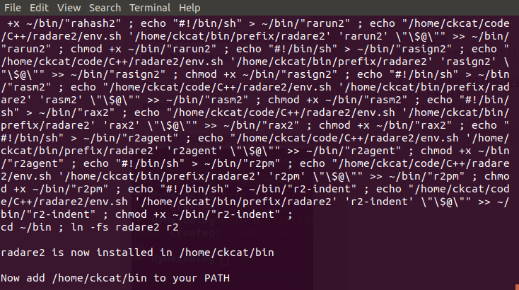
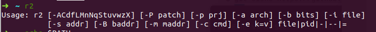
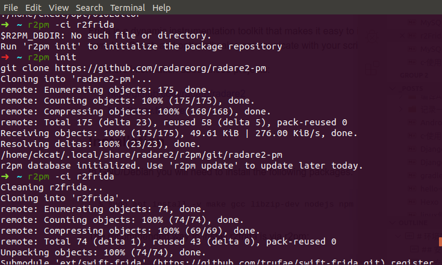

> 本机环境：ubuntu 18.04

# 环境配置
## 安装 [redare2](https://github.com/radareorg/radare2) 
参考 github 使用下列命令安装
```
$ git clone https://github.com/radare/radare2.git
$ cd radare2
$ ./sys/user.sh
```


安装完成之后，配置 `PATH` 变量，我这里将下列文本添加值 `.zshrc` 和 `.bashrc` 中。
```
PATH=/home/ckcat/bin:$PATH
```
配置好之后，执行 `source .zshrc` 命令,然后执行 `r2` 命令，显示如下则表示安装成功。




## 安装 [r2frida](https://github.com/nowsecure/r2frida)

参考 github ，首先安装依赖，使用以下命令安装
```
$ sudo apt install -y make gcc libzip-dev nodejs npm curl pkg-config git
```
使用 r2pn 安装 r2frida 
```
$ r2pm -ci r2frida
```
如果出现 `$R2PM_DBDIR: No such file or directory.` 错误，运行 `r2pm init` 初始化一下。



