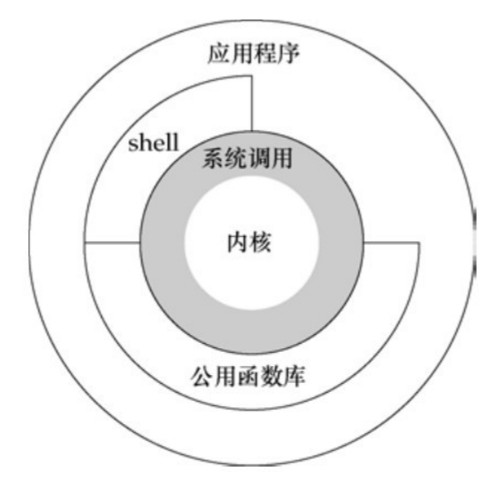

## UNIX 体系结构

从严格意义上说，可将操作系统定义为一种软件，它控制计算机硬件资源，提供程序运行环境，通常将这种软件称为内核。



内核的接口被称为系统调用（system call），公用函数库构建在系统调用接口之上，应用程序既可使用公用函数库，也可使用系统调用。shell 是一个特殊的应用程序，为运行其他应用程序提供了一个接口。

从广义上说，操作系统包括了内核和一些其他软件，这些软件使得计算机能够发挥作用，并使计算机具有自己的特性。这里所说的其他软件包括系统实用程序（system utility）、应用程序、shell 以及公用函数库等。例如，Linux 是 GNU 操作系统使用的内核。

## 登录

### 1. 登录名

登录名可以通过 `/etc/passwd` 口令文件查看，其中的登录项以 7 个冒号分隔的字段组成，
`登录名:加密口令:用户ID:组ID：注释字段:起始目录:shell程序`，如下所示：

```bash
ckcat:x:1000:1000:ckcat:/home/ckcat:/usr/bin/zsh
```

目前，所有的系统已将加密口令移到另一个文件 `/etc/shadow` 中。

### shell

shell 是一个命令行解释器，它读取用户输入，然后执行命令。用户登录后，系统通常先显示一些系统信息，然后用户就可以向 shell 程序键入命令。

常见的 shell:

- Bourne shell 由贝尔实验室 Steve Bourne 开发，位于 `/bin/sh`，几乎每一个现有的 UNIX 系统都提供 Bourne shell。
- C shell 是由 Bill Joy 在伯克利开发，位于 `/bin/csh` 。所有 BSD 版本都提供这种 shell。
- Korn shell 是由贝尔实验室的 David Korn 开发，位于 `/bin/ksh` 。在大多数 UNIX 系统上运行。
- Bourne-again shell 是 GNU shell，所有 Linux 系统都提供这种 shell，位于 `/bin/bash`。它支持 C shell 和 Korn shell 两者的特色功能。
- TENEX C shell 是 C shell 的加强版本，位于 `/bin/tcsh` 。TENEX C shell 在 C shell 基础上增加了很多特性，常被用来替换 C shell。

## 文件和目录

### 文件系统

UNIX 文件系统是目录和文件的一种层次结构，所有东西的起点是称为根（root）的目录，这个目录的名称是一个字符 `/` 。

目录（directory）是一个包含目录项的文件。在逻辑上，可以认为每个目录项都包含一个文件名，同时还包含说明该文件属性的信息。

### 文件名

目录中的各个名字称为文件名（filename）。只有斜线（`/`）和空字符这两个字符不能出现在文件名中。

创建新目录时会自动创建了两个文件名：`.` 和 `..`。分别指向当前目录和父目录。在根目录中，这两者相同。

### 路径名

由斜线分隔的一个或多个文件名组成的序列构成路径名，以斜线开头的路径名称为绝对路径名（absolute pathname），否则称为相对路径名（relative pathname）。

文件系统根 `/` 是一个特殊的绝对路径名，它不包含文件名。

例子：列出一个目录中所有文件的名字。

```c
#include "../apue.h"
#include <dirent.h>

int main(int argc, char const *argv[])
{
    DIR *dp;
    struct dirent *dirp;
    if(argc != 2)
        err_quit("usage: ls directory_name");
    if((dp = opendir(argv[1])) == NULL)
        err_sys("can't open %s\n", argv[1]);
    while ((dirp = readdir(dp)) != NULL){
        printf("%s\n", dirp->d_name);
    }
    closedir(dp);
    return 0;
}

```

编译运行：

```bash
$ gcc 1.4myls.c ../error.c
$ ./a.out
usage: ls directory_name
$ ./a.out .
1.4myls.c
..
a.out
.
```

UNIX 系统的手册是一份详细的文档，它包含了 UNIX 操作系统中各种命令、函数、系统调用、文件格式、网络协议等方面的详细资料和使用说明。上面的例子实现了一个简单的 `ls` 命令，我们可以使用 `man` 命令查看 `ls` 命令手册页:

```bash
$ man 1 ls
```

UNIX 系统的手册通常分为多个部分，例如：

- 第一部分：包含用户命令的手册页，例如常用的命令 `ls`、`cp`、`mv` 等。
- 第二部分：包含系统调用的手册页，例如常用的系统调用 `open`、`close`、`read`、`write` 等。
- 第三部分：包含库函数的手册页，例如标准 C 库中的函数 `malloc`、`free`、`printf` 等。
- 其他部分：还包含其他方面的手册页，例如文件格式、网络协议等。

### 工作目录

每个进程都有一个工作目录（working directory），有时称其为当前工作目录（current working directory）。所有相对路径名都从工作目录开始解释。进程可以用 `chdir` 函数更改其工作目录。

### 起始目录

登录时，工作目录设置为起始目录（home directory），该起始目录从口令文件 `/etc/passwd` 中相应用户的登录项中取得。

## 输入和输出

### 文件描述符

文件描述符（filedescriptor）通常是一个小的**非负整数**，内核用以标识一个特定进程正在访问的文件。当内核打开一个现有文件或创建一个新文件时，它都返回一个文件描述符。在读、写文件时，可以使用这个文件描述符。

### 标准输入、标准输出和标准错误

按惯例，每当运行一个新程序时，所有的 shell 都为其打开 3 个文件描述符，即标准输入（standard input）、标准输出（standard output）以及标准错误（standard error）。如果不做特殊处理，则这 3 个描述符都链接向终端。

### 不带缓冲的 I/O

函数 `open`、`read`、`write`、`lseek` 以及 `close` 提供了不带缓冲的 `I/O`。这些函数都使用文件描述符。

例子，从标准输入读，并向标准输出写：

```c
#include "../apue.h"

#define BUFFSIZE 4096

int main(int argc, char const *argv[])
{
    int n;
    char buf[BUFFSIZE];
    // 读标准输入，写标准输出
    while ((n = read(STDIN_FILENO, buf, BUFFSIZE)) > 0)
        if(write(STDOUT_FILENO, buf, n) != n)
            err_sys("write error");
    if (n < 0)
        err_sys("read error.");

    return 0;
}
```

编译运行：

```bash
$ gcc 1.5readwrite.c ../error.c
$ ./a.out >data.txt
1234567890 # 按下 Ctrl + D
$ cat data.txt
1234567890
$ echo "abcd" > infile.txt
$ ./a.out < infile.txt > outfile.txt
$ cat outfile.txt
abcd
```

### 标准 I/O

标准 `I/O` 函数为那些不带缓冲的 `I/O` 函数提供了一个带缓冲的接口。使用标准 `I/O` 函数无需担心如何选取最佳的缓冲区大小。

例子，用标准 `I/O` 将标准输入复制到标准输出:

```c
#include "../apue.h"

int main(int argc, char const *argv[]){
    int c;
    while ((c = getc(stdin)) != EOF){
        if( putc(c, stdout) == EOF)
            err_sys("output error.");
    }
    if (ferror(stdin))
        err_sys("input error.");
    return 0;
}
```

## 程序和进程

### 程序

程序（program）是一个存储在磁盘上某个目录中的可执行文件。内核使用 `exec` 函数，将程序读入内存，并执行程序。

### 进程和进程 ID

程序的执行实例被称为进程（process）。UNIX 系统确保每个进程都有一个唯一的数字标识符，称为进程 ID（process ID）。进程 ID 总是一个非负整数。

例子，打印进程 ID：

```c
#include "../apue.h"
int main(int argc, char const *argv[]){
    printf("hello world from process ID %ld\n", (long)getpid());
    return 0;
}
```

编译运行：

```bash
$ gcc 1.6getpid.c
$ ./a.out
hello world from process ID 9306
$ ./a.out
hello world from process ID 9352
```

程序每次运行的进程 ID 是不同的。

### 进程控制

有 3 个用于进程控制的主要函数：fork、exec 和 waitpid。

例子，从标准输入读取命令，然后执行这些命令：

```c
#include "../apue.h"
#include <sys/wait.h>

int main(int argc, char const *argv[]){
    char buf[MAXLINE];
    pid_t pid;
    int status;
    printf("%%"); // %作为命令提示符
    while (fgets(buf, MAXLINE, stdin) != NULL){
        if(buf[strlen(buf) - 1] == '\n')
            buf[strlen(buf) -1] = 0;
        if((pid = fork()) < 0)
            err_sys("fork error.");
        else if(pid == 0){
            // 子进程
            execlp(buf, buf, (char*)0); // 执行命令
            err_ret("couldn't execute:%s", buf);
            exit(127);
        }
        // 父进程等待子进程终止
        if((pid = waitpid(pid, &status, 0)) < 0)
            err_sys("waitpid error.");
        printf("%%");
    }
    return 0;
}

```

编译运行：

```bash
$ gcc 1.6fork.c ../error.c
$ ./a.out
%date
Tue Apr 11 01:41:50 UTC 2023
%abc
couldn't execute:abc: No such file or directory
%%
```

### 线程和线程 ID

一个进程内的所有线程共享同一地址空间、文件描述符、栈以及与进程相关的属性。线程也用 ID 标识。但是，线程 ID 只在它所属的进程内起作用。

## 出错处理

当 UNIX 系统函数出错时，通常会返回一个负值，而且整型变量 errno 通常被设置为具有特定信息的值。
文件 `<errno.h>` 中定义了 errno 以及可以赋与它的各种常量。这些常量都以字符 E 开头。
在 Linux 中，出错常量在 errno(3)手册页中列出。

在多线程环境中，每个线程都有属于它自己的局部 errno 以避免一个线程干扰另一个线程。Linux 支持多线程存取 errno，将其定义为：

```c
extern int *__errno_location(void);
#define errno (*__errno_location())
```

对于 errno 应当注意两条规则。

- 第一条规则是：如果没有出错，其值不会被例程清除。
- 第二条规则是：任何函数都不会将 errno 值设置为 0，而且在`<errno.h>`中定义的所有常量都不为 0。

C 标准定义了两个函数，它们用于打印出错信息。

```c
#include <string.h>
char *strerror(int errnum);

#include <stdio.h>
void perror(const char *msg);
```

`strerror` 函数将 errnum 映射为一个出错消息字符串，并且返回此字符串的指针。
`perror` 函数基于 errno 的当前值，在标准错误上产生一条出错消息，然后返回。

例子：

```c
#include "../apue.h"
#include <errno.h>

int main(int argc, char const *argv[]){
    fprintf(stderr, "EACCES: %s\n", strerror(EACCES));
    errno = ENOENT;
    perror("error message");
    return 0;
}
```

编译运行：

```bash
$ gcc 1.7error.c
$ ./a.out
EACCES: Permission denied
error message: No such file or directory
```

出错分成两类：致命性的和非致命性的。对于致命性的错误，无法执行恢复动作。对于资源相关的非致命性出错的典型恢复操作是延迟一段时间，然后重试。

## 用户标识

### 用户 ID

口令文件登录项中的用户 ID（user ID）是一个数值，用户不能更改其用户 ID。通常每个用户有一个唯一的用户 ID。

用户 ID 为 0 的用户为根用户（root）或超级用户（superuser）。

### 组 ID

口令文件登录项也包括用户的组 ID（group ID），它是一个数值。组 ID 也是由系统管理员在指定用户登录名时分配的。

组文件将组名映射为数值的组 ID。组文件通常是 `/etc/group`。大多数 UNIX 系统版本允许一个用户属于另外一些组。

例子，返回用户 ID 和组 ID。

```c
#include "../apue.h"

int main(int argc, char const *argv[]){
    printf("uid = %d, gid = %d\n", getuid(), getgid());
    return 0;
}
```

编译运行：

```bash
$ gcc 1.8guid.c
$ ./a.out
uid = 1000, gid = 1000
```

## 信号

信号（signal）用于通知进程发生了某种情况。

进程有以下 3 种处理信号的方式。

- 忽略信号。
- 按系统默认方式处理。
- 提供一个函数，信号发生时调用该函数，这被称为捕捉该信号。

例子，提供一个函数处理 SIGINT 信号。

```c
#include "../apue.h"
#include <sys/wait.h>

static void sig_int(int);

int main(int argc, char const *argv[]){
    char buf[MAXLINE];
    pid_t pid;
    int status;
    // 添加信号处理函数
    if(signal(SIGINT, sig_int) == SIG_ERR)
        err_sys("signal error.");

    printf("%%"); // %作为命令提示符
    while (fgets(buf, MAXLINE, stdin) != NULL){
        if(buf[strlen(buf) - 1] == '\n')
            buf[strlen(buf) -1] = 0;
        if((pid = fork()) < 0)
            err_sys("fork error.");
        else if(pid == 0){
            // 子进程
            execlp(buf, buf, (char*)0); // 执行命令
            err_ret("couldn't execute:%s", buf);
            exit(127);
        }
        // 父进程等待子进程终止
        if((pid = waitpid(pid, &status, 0)) < 0)
            err_sys("waitpid error.");
        printf("%%");
    }
    return 0;
}

void sig_int(int signo){
    printf("interrupt.\n%% ");
}
```

编译运行：

```bash
$ gcc 1.9sign.c ../error.c
$ ./a.out
%112
couldn't execute:112: No such file or directory
%^Cinterrupt.
% %
```

## 时间值

UNIX 系统使用过两种不同的时间值。

- 日历时间。该值是自协调世界时（Coordinated Universal Time，UTC）1970 年 1 月 1 日 00:00:00 这个特定时间以来所经过的秒数累计值（格林尼治标准时间）。
- 进程时间。也被称为 CPU 时间，用以度量进程使用的中央处理器资源。

UNIX 系统为一个进程维护了 3 个进程时间值：

- 时钟时间，进程运行时间总量。
- 用户 CPU 时间，执行用户指令所用的时间量。
- 系统 CPU 时间，进程执行内核程序所经历的时间。

例子，取得任一进程的时钟时间、用户时间和系统时间。

```bash
$ cd /usr/include
$ time -p grep _POSIX_SOURCE */*.h > /dev/null
real 0.01
user 0.00
sys 0.00
```

## 系统调用和库函数

系统调用通常提供一种最小接口，而库函数通常提供比较复杂的功能。

系统调用接口总是在《UNIX 程序员手册》的第 2 部分中说明。
通用库函数在《UNIX 程序员手册》的第 23 部分中说明。
