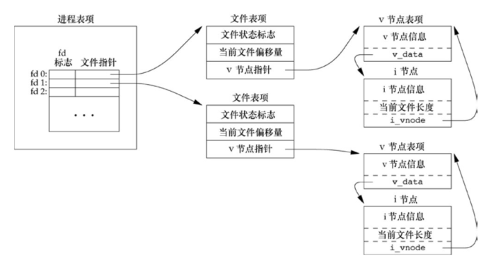
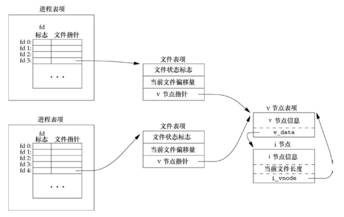
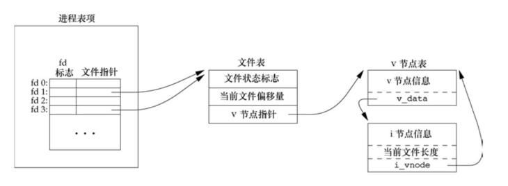

## 引言

UNIX 系统中的大多数文件 `I/O` 只需用到 5 个函数：`open`、`read`、`write`、`lseek` 以及 `close`。这些函数为不带缓冲的 I/O，是是 POSIX.1 和 Single UNIX Specification 的组成部分。

## 文件描述符

对于内核而言，所有打开的文件都通过文件描述符引用。文件描述符是一个非负整数。文件描述符的变化范围是 `0 ~ OPEN_MAX-1`。现代操作系统文件描述符的变化范围几乎是无限的。

文件描述符 0、1、2 分别表示标准输入、标准输出和标准错误。其对应的符号常量 `STDIN_FILENO`、`STDOUT_FILENO` 和
`STDERR_FILENO`，需要包含 `<unistd.h>` 头文件。

## 函数 open 或 openat

`open` 或 `openat` 函数可以打开或创建一个文件。

```c
#include <fcntl.h>
int open(const char *path, int oflag,... /* mode_t mode */);
int openat(int fd, const char *path, int oflag, ... /* mode_t mode */ );
```

**返回值：**

- 若成功，返回文件描述符；
- 若出错，返回 −1。

**参数：**

- path：要打开或创建文件的名字。
- oflag：打开的多种选项。
- fd：文件描述符。

oflag 参数必须指定下面 5 个选项的一个且只能指定一个。

- `O_RDONLY` 只读打开。
- `O_WRONLY` 只写打开。
- `O_RDWR` 读、写打开。
- `O_EXEC` 只执行打开。
- `O_SEARCH` 只搜索打开，目前操作系统不支持。

下面的选项对 oflag 参数是可选的。

- `O_APPEND` 每次写时都追加到文件的尾端。
- `O_CLOEXEC` 把 `FD_CLOEXEC` 常量设置为文件描述符标志。
- `O_CREAT` 若此文件不存在则创建它。如果指定该选项，则需要同时使用 mode 参数指定新文件的权限。
- `O_DIRECTORY` 如果 path 引用的不是目录，则出错。
- `O_EXCL` 如果同时指定了 `O_CREAT`，而文件已经存在，则出错。
- `O_NOCTTY` 如果 path 引用的是终端设备，则不将该设备分配作为此进程的控制终端。
- `O_NOFOLLOW` 如果 path 引用的是一个符号链接，则出错。
- `O_NONBLOCK` 如果 path 引用的是一个 `FIFO`、一个块特殊文件或一个字符特殊文件，则此选项为文件的本次打开操作和后续的 `I/O` 操作设置非阻塞方式。
- `O_SYNC` 使每次 `write` 等待物理 `I/O` 操作完成
- `O_TRUNC` 如果此文件存在，而且为只写或读-写成功打开，则将其长度截断为 0。
- `O_TTY_INIT` 如果打开一个还未打开的终端设备，设置非标准 termios 参数值，使其符合 Single UNIX Specification。
- `O_DSYNC` 使每次 `write` 要等待物理 `I/O` 操作完成，但是如果该写操作并不影响读取刚写入的数据，则不需等待文件属性被更新。
- `O_RSYNC` 使每一个以文件描述符作为参数进行的 read 操作等待，直至所有对文件同一部分挂起的写操作都完成。

fd 参数把 `open` 和 `openat` 函数区分开，共有 3 种可能性。

- path 参数指定的是绝对路径名，在这种情况下，fd 参数被忽略，`openat` 函数就相当于 `open` 函数。
- path 参数指定的是相对路径名，fd 参数指出了相对路径名在文件系统中的开始地址。
- path 参数指定了相对路径名，fd 参数具有特殊值 `AT_FDCWD`。

由 `open` 和 `openat` 函数返回的文件描述符一定是最小的未用描述符数值。

## 函数 creat

creat 函数创建一个新文件。

```c
#include <fcntl.h>
int creat(const char *path, mode_t mode);
```

此函数等效于：

```c
open(path, O_WRONLY｜O_CREAT｜O_TRUNC, mode);
```

**返回值：**

- 若成功，返回为只写打开的文件描述符；
- 若出错，返回 −1。

`creat` 的一个不足之处是它以只写方式打开所创建的文件。

## 函数 close

close 函数关闭一个打开文件。

```c
#include <unistd.h>
int close (int fd);
```

**返回值：**

- 若成功，返回 0；
- 若出错，返回 −1。

关闭一个文件时还会释放该进程加在该文件上的所有记录锁。当一个进程终止时，内核自动关闭它所有的打开文件。

## 函数 lseek

每个打开文件都有一个与其相关联的当前文件偏移量，调用 `lseek` 显式地为一个打开文件设置偏移量。

```c
#include <unistd.h>
off_t lseek(int fd, off_t offset, int whence);
```

**返回值：**

- 若成功，返回新的文件偏移量；
- 若出错，返回为 −1。

对参数 offset 的解释与参数 whence 的值有关。

- 若 whence 是 `SEEK_SET`，则将该文件的偏移量设置为距文件开始处 offset 个字节。
- 若 whence 是 `SEEK_CUR`，则将该文件的偏移量设置为其当前值加 offset，offset 可正可负。
- 若 whence 是 `SEEK_END`，则将该文件的偏移量设置为文件长度加 offset，offset 可正可负。

如果文件描述符指向的是一个管道、`FIFO` 或网络套接字，则 `lseek` 返回 −1，并将 `errno` 设置为 `ESPIPE` 。

例子，测试对其标准输入能否设置偏移量。

```c
#include "../apue.h"

int main(int argc, char const *argv[]){
    if(lseek(STDIN_FILENO, 0, SEEK_CUR) == -1)
        printf("cannot, seek\n");
    else
        printf("seek ok.\n");
    exit(0);
}
```

编译运行：

```bash
$ gcc 3.6lseek.c ../error.c
$ ./a.out
cannot, seek
```

比较 `lseek` 的返回值时应当谨慎，不要测试它是否小于 0，而要测试它是否等于 −1。

`lseek` 仅将当前的文件偏移量记录在内核中，它并不引起任何 `I/O` 操作。

文件偏移量可以大于文件的当前长度，在这种情况下，对该文件的下一次写将加长该文件，并在文件中构成一个空洞，这一点是允许的。位于文件中但没有写过的字节都被读为 0。文件中的空洞并不要求在磁盘上占用存储区。

例子，创建一个具有空洞的文件。

```c
#include "../apue.h"
#include <fcntl.h>

char buf1[] = "abcdefghij";
char buf2[] = "ABCDEFGHIJ";

int main(int argc, char const *argv[]){
    int fd;
    if((fd = creat("file.hole", FILE_MODE)) < 0)
        err_sys("creat error.");
    if(write(fd, buf1, 10) != 10) // offset = 10
        err_sys("buf1 write error.");

    if(lseek(fd, 16384, SEEK_SET) == -1) // offset = 20
        err_sys("lseek error.");

    if(write(fd, buf2, 10) != 10)
        err_sys("buf2 write error."); // // offset = 30
    return 0;
}
```

编译运行：

```bash
$ gcc 3.6hole.c ../error.c
$ ./a.out
$ ls -l file.hole
-rw-r--r-- 1 ckcat ckcat 16394 Apr 15 02:51 file.hole
$ od -c file.hole
0000000   a   b   c   d   e   f   g   h   i   j  \0  \0  \0  \0  \0  \0
0000020  \0  \0  \0  \0  \0  \0  \0  \0  \0  \0  \0  \0  \0  \0  \0  \0
*
0040000   A   B   C   D   E   F   G   H   I   J
0040012
```

再创建一个同样长度的非空洞文件，将其与空洞文件进行比较。

```bash
$ dd if=/dev/zero of=file.nohole bs=16394 count=1
1+0 records in
1+0 records out
16394 bytes (16 kB, 16 KiB) copied, 0.000239963 s, 68.3 MB/s
$ ls -ls file.hole file.nohole
 8 -rw-r--r-- 1 ckcat ckcat 16394 Apr 15 02:51 file.hole
20 -rw-rw-r-- 1 ckcat ckcat 16394 Apr 15 02:55 file.nohole
```

虽然两个文件的长度相同，但无空洞的文件占用了 20 个磁盘块，而具有空洞的文件只占用 8 个磁盘块。

## 函数 read

`read` 函数从打开文件中读数据。

```c
#include <unistd.h>
ssize_t read(int fd, void *buf, size_t nbytes);
```

**返回值：**

- 读到的字节数，若已到文件尾，返回 0；
- 若出错，返回 −1。

有多种情况可使实际读到的字节数少于要求读的字节数：

- 读普通文件时，在读到要求字节数之前已到达了文件尾端。
- 当从终端设备读时，通常一次最多读一行。
- 当从网络读时，网络中的缓冲机制可能造成返回值小于所要求读的字节数。
- 当从管道或 `FIFO` 读时，如若管道包含的字节少于所需的数量，那么 `read` 将只返回实际可用的字节数。
- 当从某些面向记录的设备（如磁带）读时，一次最多返回一个记录。
- 当一信号造成中断，而已经读了部分数据量时。

## 函数 write

`write` 函数向打开文件写数据。

```c
#include <unistd.h>
ssize_t write(int fd, const void *buf, size_t nbytes);
```

**返回值：**

- 若成功，返回已写的字节数；
- 若出错，返回 −1。

其返回值通常与参数 nbytes 的值相同，否则表示出错。

## `I/O` 的效率

大多数文件系统为改善性能都采用某种预读（read ahead）技术。当检测到正进行顺序读取时，系统就试图读入比应用所要求的更多数据，并假想应用很快就会读这些数据。

## 文件共享

UNIX 系统支持在不同进程间共享打开文件。

内核使用 3 种数据结构表示打开文件，它们之间的关系决定了在文件共享方面一个进程对另一个进程可能产生的影响。

1. 每个进程在进程表中都有一个记录项，记录项中包含一张打开文件描述符表：

- 文件描述符标志；
- 指向一个文件表项的指针。

2. 内核为所有打开文件维持一张文件表。每个文件表项包含：

- 文件状态标志
- 当前文件偏移量；
- 指向该文件 v 节点表项的指针。

3. 每个打开文件（或设备）都有一个 v 节点（v-node）结构。v 节点包含了文件类型和对此文件进行各种操作函数的指针。对于大多数文件，v 节点还包含了该文件的 i 节点（i-node，索引节点）。





多个进程读取同一文件都能正确工作，每个进程都有它自己的文件表项，其中也有它自己的当前文件偏移量。但是，当多个进程写同一文件时，则可能产生预想不到的结果。

## 原子操作

1. 打开文件时设置 O_APPEND 标志是一种原子操作。
2. 函数 `pread` 和 `pwrite` 是一种原子操作。

```c
#include <unistd.h>
ssize_t pread(int fd, void *buf, size_t nbytes, off_t
offset);
ssize_t pwrite(int fd, const void *buf, size_t nbytes, off_t
offset);
```

3. `open` 函数的 `O_CREAT` 和 `O_EXCL` 选项创建一个文件是原子操作。

## 函数 dup 和 dup2

下面两个函数都可用来复制一个现有的文件描述符。

```c
#include <unistd.h>
int dup(int fd);
int dup2(int fd, int fd2);
```

**返回值：**

- 若成功，返回新的文件描述符；
- 若出错，返回 −1。

由 `dup` 返回的新文件描述符一定是当前可用文件描述符中的最小数值。

对于 `dup2`，可以用 fd2 参数指定新描述符的值。

- 如果 fd2 已经打开，则先将其关闭。
- 如若 fd 等于 fd2，则 `dup2` 返回 fd2，而不关闭它。

这些函数返回的新文件描述符与参数 fd 共享同一个文件表项。



复制一个描述符的另一种方法是使用 `fcntl` 函数。

## 函数 sync、fsync 和 fdatasync

传统的 UNIX 系统实现在内核中设有缓冲区高速缓存或页高速缓存，大多数磁盘 `I/O` 都通过缓冲区进行。当我们向文件写入数据时，内核通常先将数据复制到缓冲区中，然后排入队列，晚些时候再写入磁盘。

通常，当内核需要重用缓冲区来存放其他磁盘块数据时，它会把所有延迟写数据块写入磁盘。为了保证磁盘上实际文件系统与缓冲区中内容的一致性，UNIX 系统提供了 `sync`、`fsync` 和 `fdatasync` 三个函数。

```c
#include<unistd.h>
int fsync(int fd);
int fdatasync(int fd);
void sync(void);
```

**返回值：**

- 若成功，返回 0；
- 若出错，返回 −1。

`sync` 只是将所有修改过的块缓冲区排入写队列，然后就返回，它并不等待实际写磁盘操作结束。

`fsync` 函数只对由文件描述符 fd 指定的一个文件起作用，并且等待写磁盘操作结束才返回。

`fdatasync` 函数类似于 `fsync`，但它只影响文件的数据部分。而除数据外，`fsync` 还会同步更新文件的属性。

## 函数 fcntl

`fcntl` 函数可以改变已经打开文件的属性。

```c
#include<fcntl.h>
int fcntl(int fd, int cmd, ... /* int arg */);
```

返回值：

- 若成功，则依赖于 cmd；
- 若出错，返回 −1。

`fcntl` 函数有以下 5 种功能。

- 复制一个已有的描述符（`cmd=F_DUPFD` 或 `F_DUPFD_CLOEXEC`）。
- 获取/设置文件描述符标志（`cmd=F_GETFD` 或 `F_SETFD`）。
- 获取/设置文件状态标志（`cmd=F_GETFL` 或 `F_SETFL`）。
- 获取/设置异步 `I/O` 所有权（`cmd=F_GETOWN` 或 `F_SETOWN`）。
- 获取/设置记录锁（`cmd=F_GETLK`、`F_SETLK` 或 `F_SETLKW`）。

- `F_DUPFD` 复制文件描述符 fd。新文件描述符作为函数值返回。其 `FD_CLOEXEC` 文件描述符标志被清除。
- `F_DUPFD_CLOEXEC` 复制文件描述符，设置与新描述符关联的 `FD_CLOEXEC` 文件描述符标志的值，返回新文件描述符。
- `F_GETFD` 对应于 fd 的文件描述符标志作为函数值返回。当前只定义了一个文件描述符标志 `FD_CLOEXEC`。
- `F_SETFD` 对于 fd 设置文件描述符标志。新标志值按第 3 个参数设置。
- `F_GETFL` 对应于 fd 的文件状态标志作为函数值返回。
- `F_SETFL` 将文件状态标志设置为第 3 个参数的值。
- `F_GETOWN` 获取当前接收 `SIGIO` 和 `SIGURG` 信号的进程 ID 或进程组 ID。
- `F_SETOWN` 设置接收 `SIGIO` 和 `SIGURG` 信号的进程 ID 或进程组 ID。正的 arg 指定一个进程 ID，负的 arg 表示等于 arg 绝对值的一个进程组 ID。

例子，对于指定的描述符打印文件标志。

```c
#include "../apue.h"
#include <fcntl.h>

int main(int argc, char const *argv[]){
    int val;
    if(argc != 2)
        err_quit("usage: a.out <descriptor#>");
    if((val = fcntl(atoi(argv[1]), F_GETFL, 0)) < 0)
        err_sys("fcntl error for fd %d", atoi(argv[1]));

    switch (val & O_ACCMODE) // 必须用屏蔽字O_ACCMODE取得访问方式位
    {
    case O_RDONLY:
        printf("read only");
        break;
    case O_WRONLY:
        printf("write only");
        break;
    case O_RDWR:
        printf("read write");
        break;
    default:
        printf("unkown access mode");
        break;
    }

    if(val & O_APPEND)
        printf(", append");
    if(val & O_NONBLOCK)
        printf(", nonblocking");
    if(val & O_SYNC)
        printf(", synchronous write");

    #if !defined(_POSIX_C_SOURCE) && defined(O_FSYNC) && (O_FSYNC != O_SYNC)
        if(val & O_FSYNC)
            printf(", synchronous write");
    #endif
    putchar('\n');
    return 0;
}
```

编译运行：

```bash
$ gcc 3.14fcntl.c ../error.c
$ ./a.out 0 < /dev/tty
read only
$ ./a.out 1 > tmp.foo
$ cat tmp.foo
write only
$ ./a.out 2 2>>tmp.foo
write only, append
$ ./a.out 5 5<>tmp.foo
read write
```

例子， 对一个文件描述符开启一个或多个文件状态标志。

```c
void set_fl(int fd, int flags){
    int val;
    if((val = fcntl(fd, F_GETFL, 0)) < 0)
        err_sys("fcntl FGETFL error");
    // 开启一个或多个文件状态标志
    val != flags;
    if(fcntl(fd, F_SETFL, val) < 0)
        err_sys("fcntl FSETFL error");
}
```

## 函数 ioctl

`ioctl` 函数一直是 `I/O` 操作的杂物箱，终端 `I/O` 是使用 `ioctl` 最多的地方

```c
#include <unistd.h> /* System V */
#include <sys/ioctl.h> /* BSD and Linux */
int ioctl(int fd, int request, ...);
```

**返回值：**

- 若出错，返回 −1；
- 若成功，返回其他值。

我们表示的只是 `ioctl` 函数本身所要求的头文件。通常，还要求另外的设备专用头文件。

## `/dev/fd`

较新的系统都提供名为 `/dev/fd` 的目录，其目录项是名为 0、1、2 等的文件。打开文件 `/dev/fd/n` 等效于复制描述符 `n` 。

Linux 实现中的 `/dev/fd` 是个例外。它把文件描述符映射成指向底层物理文件的符号链接。

`/dev/fd` 文件主要由 shell 使用，它允许使用路径名作为调用参数的程序，能用处理其他路径名的相同方式处理标准输入和输出。
