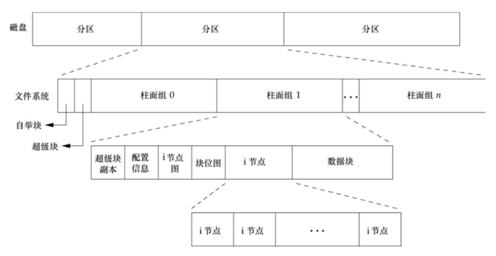
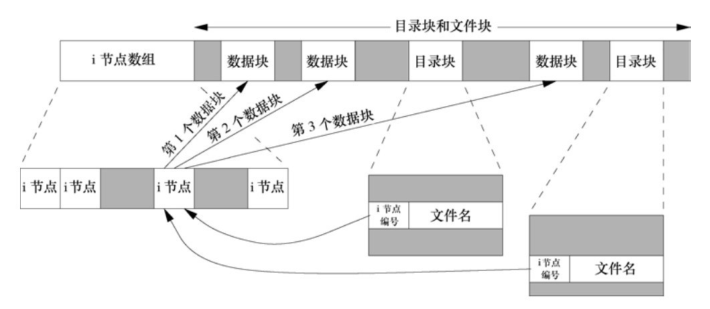
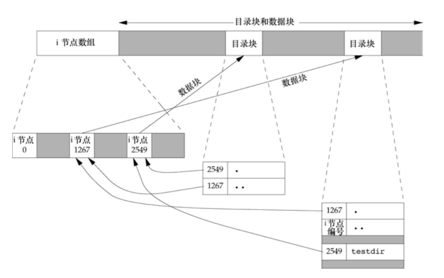

## 函数 stat、fstat、fstatat 和 lstat

```c
#include <sys/stat.h>
int stat(const char *restrict pathname, struct stat *restrict buf);
int fstat(int fd, struct stat *buf);
int lstat(const char *restrict pathname, struct stat *restrict buf);
int fstatat(int fd, const char *restrict pathname, struct stat *restrict buf, int flag);
```

返回值：

- 若成功；返回 0；
- 若出错，返回-1

函数的作用：

- `stat` 函数将返回与 pathname 文件有关的信息结构。
- `fstat` 函数获得已在描述符 fd 上打开文件的有关信息。
- `lstat` 函数类似于 `stat`，但是 pathname 文件是一个符号链接时，`lstat` 返回该符号链接的有关信息。
- `fstatat` 函数为一个相对于当前打开目录（由 fd 参数指向）的路径名返回文件统计信息。flag 参数控制着是否跟随着一个符号链接。

参数 buf 是一个指针，它指向一个我们必须提供的 `stat` 结构。

```c
struct stat {
    dev_t     st_dev;         /* 设备ID，表示文件所在的设备。 */
    ino_t     st_ino;         /* 文件的inode号，是文件在文件系统中的唯一标识。 */
    mode_t    st_mode;        /* 文件的类型和权限，包括文件类型和权限位。 */
    nlink_t   st_nlink;       /* 硬链接计数，表示指向该文件的硬链接数量。 */
    uid_t     st_uid;         /* 文件的所有者的用户ID。 */
    gid_t     st_gid;         /* 文件的所有者的组ID。 */
    dev_t     st_rdev;        /* 如果文件是特殊设备文件，则包含设备ID。*/
    off_t     st_size;        /* 文件大小，以字节为单位。*/
    blksize_t st_blksize;     /* 文件系统I/O缓冲区大小。  */
    blkcnt_t  st_blocks;      /* 文件所占的块数（以512字节为一块）。 */
    struct timespec st_atim;  /* 最后访问时间。 */
    struct timespec st_mtim;  /* 最后修改时间。 */
    struct timespec st_ctim;  /* 最后状态变更时间。 */

    #define st_atime st_atim.tv_sec      /* Backward compatibility */
    #define st_mtime st_mtim.tv_sec
    #define st_ctime st_ctim.tv_sec
};
```

`stat` 结构中的大多数成员都是基本系统数据类型，使用 `stat` 函数最多的地方可能就是 `ls -l` 命令。

例子：

```c
#include <stdio.h>
#include <stdlib.h>
#include <sys/stat.h>
#include <unistd.h>
#include <time.h>

void print_time(const time_t *timep, const char* type){
    struct tm atime_tm;
    localtime_r(timep, &atime_tm);
    char time_str[100];
    strftime(time_str, sizeof(time_str), "%Y-%m-%d %H:%M:%S", &atime_tm);
    printf("%s 时间：%s\n", type, time_str);
}

int main(int argc, char* argv[]) {
    struct stat file_info;
    if (argc != 2){
        printf("usage: %s filename.\n", argv[0]);
        exit(EXIT_FAILURE);
    }
    // 使用 stat 函数获取文件信息
    if (stat(argv[1], &file_info) == -1) {
        perror("无法获取文件信息");
        exit(EXIT_FAILURE);
    }
    // 打印文件信息
    printf("st_dev: %lu\n", file_info.st_dev); // 设备ID，表示文件所在的设备。
    printf("st_ino: %lu\n", file_info.st_ino); // 文件的inode号，是文件在文件系统中的唯一标识。
    printf("st_mode: %o\n", file_info.st_mode & 0777); // 文件的类型和权限，使用掩码获取权限。
    printf("st_nlink: %lu\n", file_info.st_nlink); // 硬链接计数，表示指向该文件的硬链接数量。
    printf("st_uid: %d\n", file_info.st_uid);   // 文件的所有者的用户ID。
    printf("st_gid: %d\n", file_info.st_gid);  // 文件的所有者的组ID。
    printf("st_rdev: %lu\n", file_info.st_rdev); // 如果文件是特殊设备文件，则包含设备ID。
    printf("st_size: %lld byte\n", (long long)file_info.st_size); // 文件大小，以字节为单位。
    printf("st_blksize: %lu\n", file_info.st_blksize);  // 文件系统I/O缓冲区大小。
    printf("st_blocks: %ld\n", file_info.st_blocks);  // 文件所占的块数（以512字节为一块）。
    print_time(&file_info.st_atime, "st_atime");    // 最后访问时间。
    print_time(&file_info.st_mtime, "st_mtime");    // 最后修改时间。
    print_time(&file_info.st_ctime, "st_ctime");    // 最后状态变更时间。
    return 0;
}
```

编译运行：

```bash
$ gcc 01stat.c
$ ./a.out 01stat.c
st_dev: 2053
st_ino: 5952954
st_mode: 664
st_nlink: 1
st_uid: 1000
st_gid: 1000
st_rdev: 0
st_size: 1990 byte
st_blksize: 4096
st_blocks: 8
st_atime 时间：2023-09-03 14:35:05
st_mtime 时间：2023-09-03 14:35:01
st_ctime 时间：2023-09-03 14:35:01
```

## 文件类型

UNIX 系统的大多数文件是普通文件或目录，但是也有另外一些文件类型。文件类型包括如下几种。

1. 普通文件（regular file）。这是最常用的文件类型，这种文件包含了某种形式的数据。
2. 目录文件（directory file）。这种文件包含了其他文件的名字以及指向与这些文件有关信息的指针。只有内核可以直接写目录文件。
3. 块特殊文件（block special file）。这种类型的文件提供对设备（如磁盘）带缓冲的访问，每次访问以固定长度为单位进行。
4. 字符特殊文件（character special file）。这种类型的文件提供对设备不带缓冲的访问，每次访问长度可变。系统中的所有设备要么是字符特殊文件，要么是块特殊文件。
5. FIFO。这种类型的文件用于进程间通信，有时也称为命名管道（named pipe）。
6. 套接字（socket）。这种类型的文件用于进程间的网络通信。套接字也可用于在一台宿主机上进程之间的非网络通信。
7. 符号链接（symbolic link）。这种类型的文件指向另一个文件。

文件类型信息包含在 `stat` 结构的 `st_mode` 成员中。可以用下图中的宏确定文件类型。这些宏的参数都是 `stat` 结构中的 `st_mode` 成员。

在 `<sys/stat.h>` 中的文件类型宏：

| 宏           | 文件类型     |
| ------------ | ------------ |
| `S_ISREG()`  | 普通文件     |
| `S_ISDIR()`  | 目录文件     |
| `S_ISCHR()`  | 字符特殊文件 |
| `S_ISBLK()`  | 块特殊文件   |
| `S_ISFIFO()` | 管道或 FIFO  |
| `S_ISLNK()`  | 符号链接     |
| `S_ISSOCK()` | 套接字       |

POSIX.1 允许实现将进程间通信（IPC）对象说明为文件。可以用下图中的宏确定 IPC 对象的类型。这些宏的参数都是指向 `stat` 结构的指针。

| 宏              | 对象的类型   |
| --------------- | ------------ |
| `S_TYPEISMQ()`  | 消息队列     |
| `S_TYPEISSEM()` | 信号量       |
| `S_TYPEISSHM()` | 共享存储对象 |

例子，对每个命令行参数打印文件类型。

```c
#include <stdio.h>
#include <stdlib.h>
#include <sys/stat.h>
#include <unistd.h>

int main(int argc, char const *argv[]){
	int i;
	struct stat buf;
	char *ptr;
	for (i = 1; i < argc; i++){
		printf("%s: ", argv[i]);
		if(lstat(argv[i], &buf) < 0){
			printf("lstat error");
			continue;
		}
		if(S_ISREG(buf.st_mode))
			ptr = "regular";
		else if(S_ISDIR(buf.st_mode))
			ptr = "directory";
		else if(S_ISCHR(buf.st_mode))
			ptr = "character special";
		else if(S_ISBLK(buf.st_mode))
			ptr = "block special";
		else if(S_ISFIFO(buf.st_mode))
			ptr = "fifo";
		else if(S_ISLNK(buf.st_mode))
			ptr = "symbolic link";
		else if(S_ISSOCK(buf.st_mode))
			ptr = "socket";
		else
			ptr = "** unknown mode **";
		printf("%s\n", ptr);
	}
	return 0;
}
```

编译运行：

```bash
$ gcc 02filetype.c
$ ./a.out /etc/passwd /etc /dev/log /dev/tty
/etc/passwd: regular
/etc: directory
/dev/log: symbolic link
/dev/tty: character special
```

## 设置用户 ID 和设置组 ID

与一个进程相关联的 ID 有 6 个或更多：

- 实际用户 ID 和实际组 ID 标识我们究竟是谁。这两个字段在登录时取自口令文件中的登录项。
- 有效用户 ID、有效组 ID 以及附属组 ID 决定了我们的文件访问权限，用于文件访问权限检查。
- 保存的设置用户 ID 和保存的设置组 ID 在执行一个程序时包含了有效用户 ID 和有效组 ID 的副本，由 `exec` 函数保存。

通常，有效用户 ID 等于实际用户 ID，有效组 ID 等于实际组 ID。

若文件所有者是超级用户，而且设置了该文件的设置用户 ID 位（st_uid），那么当该程序文件由一个进程执行时，该进程具有超级用户权限。

设置用户 ID 位及设置组 ID 位都包含在文件的 `st_mode` 值中。这两位可分别用常量 `S_ISUID` 和 `S_ISGID` 测试。

## 文件访问权限

`st_mode` 值也包含了对文件的访问权限位。

每个文件有 9 个访问权限位，可将它们分成 3 类。

| `st_mode` 屏蔽 | 含义     |
| -------------- | -------- |
| `S_IRUSR`      | 用户读   |
| `S_IWUSR`      | 用户写   |
| `S_IXUSR`      | 用户执行 |
| `S_IRGRP`      | 组读     |
| `S_IWGRP`      | 组写     |
| `S_IXGRP`      | 组执行   |
| `S_IROTH`      | 其他读   |
| `S_IWOTH`      | 其他写   |
| `S_IXOTH`      | 其他执行 |

**执行权限使我们可搜索该目录。读权限允许我们读目录，获得在该目录中所有文件名的列表。**

为了在一个目录中创建一个新文件，必须对该目录具有写权限和执行权限。

进程每次打开、创建或删除一个文件时，内核就进行文件访问权限测试:

- 若进程的有效用户 ID 是 0（超级用户），则允许访问。
- 若进程的有效用户 ID 等于文件的所有者 ID，如果所有者适当的访问权限位被设置，则允许访问；否则拒绝访问。
- 若进程的有效组 ID 或进程的附属组 ID 之一等于文件的组 ID，那么如果组适当的访问权限位被设置，则允许访问；否则拒绝访问。
- 若其他用户适当的访问权限位被设置，则允许访问；否则拒绝访问。

## 新文件和目录的所有权

新文件的用户 ID 设置为进程的有效用户 ID。关于组 ID 选择下列之一作为新文件的组 ID。

- 新文件的组 ID 可以是进程的有效组 ID。
- 新文件的组 ID 可以是它所在目录的组 ID。

## 函数 access 和 faccessat

`access` 和 `faccessat` 函数是按实际用户 ID 和实际组 ID 进行访问权限测试的。

```c
#include <unistd.h>
int access(const char *pathname, int mode);
int faccessat(int fd, const char *pathname, int mode, int flag);
```

返回值：

- 若成功，返回 0；
- 若出错，返回-1

参数：

- fd 是指定目录的文件描述符。
- pathname 是要检查权限的文件的路径（相对于指定目录）。
- mode 是要检查的权限模式。
- flags 参数用于设置一些标志，用于改变 `faccessat` 的行为。

`access` 函数的 mode 标志：

| mode   | 说明         |
| ------ | ------------ |
| `R_OK` | 测试读权限   |
| `W_OK` | 测试写权限   |
| `X_OK` | 测试执行权限 |

`faccessat` 函数的 flags 参数支持以下标志：

- 0（或者不指定标志）：默认情况，只检查文件的存在性，不检查权限。如果文件存在，返回 0；否则返回-1。
- `AT_EACCESS`：检查有效用户 ID 权限，而不是实际用户 ID 权限。通常情况下，文件的有效用户 ID 权限用于确定文件是否可执行，但如果设置了 `SUID` 位或 `SGID` 位，有效用户 ID 权限可能与实际用户 ID 权限不同。
- `AT_SYMLINK_NOFOLLOW`：如果 pathname 是符号链接，则不会解引用符号链接，而是检查符号链接本身的权限。

`faccessat` 函数与 `access` 函数在下面两种情况下是相同的：

1. pathname 参数为绝对路径
2. fd 参数取值为 `AT_FDCWD` 而 pathname 参数为相对路径。

例子，`access` 函数的使用方法。

```c
#include <stdio.h>
#include <fcntl.h>
#include <stdlib.h>
#include <unistd.h>

int main(int argc, char* argv[]){
	if(argc != 2){
		printf("usage: a.out pathname.\n");
		exit(1);
	}
	if(access(argv[1], F_OK) < 0){
		perror("no file");
		exit(1);
	}

	if(access(argv[1], R_OK) < 0)
		perror("access error");
	else
		printf("read access OK\n");

	if (open(argv[1], O_RDONLY) < 0)
		perror("open error");
	else
		printf("open for reading OK\n");
	return 0;
}
```

编译运行

```bash
$ gcc 03access.c
$ ./a.out
usage: a.out pathname.
$ ls -l a.out
-rwxrwxr-x 1 ckcat ckcat 16872 Sep  3 16:58 a.out
$ ./a.out a.out
read access OK
open for reading OK
$ ls -l /etc/shadow
-rw-r----- 1 root shadow 1577 Aug 21 12:31 /etc/shadow
$ ./a.out /etc/shadow
access error: Permission denied
open error: Permission denied
$ sudo chown root a.out     # 将文件用户ID改为 root
[sudo] password for ckcat:
$ sudo chmod u+s a.out      # 并打开设置用户ID位
$ ls -l a.out               # 检查所有者和SUID位
-rwsrwxr-x 1 root ckcat 16872 Sep  3 16:58 a.out
$ ./a.out /etc/shadow
access error: Permission denied
open for reading OK
```

尽管 `open` 函数能打开文件，但通过设置用户 ID 程序可以确定实际用户不能正常读指定的文件。

## 函数 umask

`umask` 函数为进程设置文件模式创建屏蔽字，并返回之前的值。

```c
#include <sys/stat.h>
mode_t umask(mode_t cmask);
```

返回值：

- 之前的文件模式创建屏蔽字。

参数：

- cmask 是由前面列出的 9 个常量（S_IRUSR、S_IWUSR 等）中的若干个按位“或”构成的。

进程在创建一个新文件或新目录时，就一定会使用文件模式创建屏蔽字。在文件模式创建屏蔽字中为 1 的位，在文件 mode 中相应的位一定被关闭。

例子，`umask` 函数实例。

```c
#include <stdio.h>
#include <sys/stat.h>
#include <fcntl.h>
#include <stdlib.h>

#define RWRWRW (S_IRUSR|S_IWUSR|S_IRGRP|S_IWGRP|S_IROTH|S_IWOTH) // 0666

int main(){
	umask(0); // 屏蔽字为 0
	if(creat("foo", RWRWRW) < 0){ // foo 文件 mode 为 0666
		perror("creat error for foo.\n");
		exit(1);
	}
	umask(S_IRGRP | S_IWGRP | S_IROTH | S_IWOTH); // 屏蔽字为 0066
	if (creat("bar", RWRWRW) < 0){ // bar 文件 mode 为 0600
		perror("creat error for bar.\n");
		exit(1);
	}
	return 0;
}
```

编译运行：

```bash
$ gcc 04umask.c
$ umask
002
$ ./a.out
$ ls -l foo bar
-rw------- 1 ckcat ckcat 0 Sep  3 17:26 bar
-rw-rw-rw- 1 ckcat ckcat 0 Sep  3 17:26 foo
$ umask
002
```

可以发现更改进程的文件模式创建屏蔽字并不影响其父进程（常常是 shell）的屏蔽字。

用户可以设置 `umask` 值以控制他们所创建文件的默认权限。

| 屏蔽位 | 含义     |
| ------ | -------- |
| `0400` | 用户读   |
| `0200` | 用户写   |
| `0100` | 用户执行 |
| `0040` | 组读     |
| `0020` | 组写     |
| `0010` | 组执行   |
| `0004` | 其他读   |
| `0002` | 其他写   |
| `0001` | 其他执行 |

所有 shell 都有内置 `umask` 命令，我们可以用该命令设置或打印当前文件模式创建屏蔽字。

```bash
$ umask
002
$ umask -S    # 当前文件模式创建屏蔽字
u=rwx,g=rwx,o=rx
$ umask 027
$ umask -S
u=rwx,g=rx,o=
```

## 函数 chmod、fchmod 和 fchmodat

`chmod`、`fchmod` 和 `fchmodat` 这 3 个函数使我们可以更改现有文件的访问权限。

```c
#include <sys/stat.h>
int chmod(const char *pathname, mode_t mode);
int fchmod(int fd, mode_t mode);
int fchmodat(int fd, const char *pathname, mode_t mode, int flag);
```

返回值：

- 若成功，返回 0；
- 若出错，返回 −1。

参数：

- `flag` 参数可以用于改变 `fchmodat` 的行为，当设置了 `AT_SYMLINK_NOFOLLOW` 标志时，`fchmodat` 并不会跟随符号链接。

说明：

`chmod` 函数在指定的文件上进行操作，而 `fchmod` 函数则对已打开的文件进行操作。`fchmodat` 函数与 `chmod` 函数在下面两种情况下是相同的：

1. pathname 参数为绝对路径。
1. fd 参数取值为 `AT_FDCWD` 而 pathname 参数为相对路径。

为了改变一个文件的权限位，进程的有效用户 ID 必须等于文件的所有者 ID，或者该进程必须具有超级用户权限。

`chmod` 函数的 mode 常量，取自 `<sys/stat.h>` ：

| mode      | 说明                     |
| --------- | ------------------------ |
| `S_ISUID` | 执行时设置用户 ID        |
| `S_ISGID` | 执行时设置组 ID          |
| `S_ISVTX` | 保存正文(粘着位)         |
| `S_IRWXU` | 用户(所有者)读、写和执行 |
| `S_IRUSR` | 用户(所有者)读           |
| `S_IWUSR` | 用户(所有者)写           |
| `S_IXUSR` | 用户(所有者) 执行        |
| `S_IRWXG` | 组读、写和执行           |
| `S_IRGRP` | 组读                     |
| `S_IWGRP` | 组写                     |
| `S_IXGRP` | 组执行                   |
| `S_IRWXO` | 其他读、写和执行         |
| `S_IROTH` | 其他读                   |
| `S_IWOTH` | 其他写                   |
| `S_IXOTH` | 其他执行                 |

例子， `chmod` 函数实例。

```c
#include <stdio.h>
#include <sys/stat.h>
#include <fcntl.h>
#include <stdlib.h>

int main(){
	struct stat statbuf;
	// 开启设置组ID位，关闭组执行位
	if(stat("foo", &statbuf) < 0){
		perror("stat error for foo");
		exit(1);
	}
	if(chmod("foo",(statbuf.st_mode & ~S_IXGRP) | S_ISGID) < 0){
		perror("chmod error for foo");
		exit(1);
	}
	// 设置 mode 为 "rw-r--r--"
	if(chmod("bar", S_IRUSR | S_IWUSR | S_IRGRP | S_IROTH) < 0){
		perror("chmod error for bar");
		exit(1);
	}
	return 0;
}
```

编译运行：

```bash
$ gcc 05chmod.c
$ ./a.out
$ ls -l foo bar
-rw-r--r-- 1 ckcat ckcat 0 Sep  3 17:26 bar
-rw-rwSrw- 1 ckcat ckcat 0 Sep  3 17:26 foo
```

ls 命令列出的时间和日期并没有改变。chmod 函数更新的只是 i 节点最近一次被更改的时间。

## 粘着位

早期版本中，如果一个可执行程序文件的 `S_ISVTX` 位被设置了，那么当该程序第一次被执行，在其终止时，程序正文部分的一个副本仍被保存在交换区，这使得下次执行该程序时能较快地将其装载入内存。
现今较新的 UNIX 系统大多数都配置了虚拟存储系统以及快速文件系统，所以不再需要使用这种技术。

现今的系统扩展了粘着位的使用范围，允许针对目录设置粘着位。如果对一个目录设置了粘着位，只有对该目录具有写权限的用户并且满足下列条件之一，才能删除或重命名该目录下的文件：

- 拥有此文件；
- 拥有此目录；
- 是超级用户。

目录 `/tmp` 和 `/var/tmp` 是设置粘着位的典型候选者:

- 任何用户都可在这两个目录中创建文件。任一用户（用户、组和其他）对这两个目录的权限通常都是读、写和执行。但是用户不应能删除或重命名属于其他人的文件，为此在这两个目录的文件模式中都设置了粘着位。

## 函数 chown、fchown、fchownat 和 lchown

下面几个 `chown` 函数可用于更改文件的用户 ID 和组 ID。如果两个参数 `owner` 或 `group` 中的任意一个是 -1，则对应的 ID 不变。

```c
#include <unistd.h>
int chown(const char *pathname, uid_t owner, gid_t group);
int fchown(int fd, uid_t owner, gid_t group);
int fchownat(int fd, const char *pathname, uid_t owner, gid_t group, int flag);
int lchown(const char *pathname, uid_t owner, gid_t group);
```

返回值：

- 若成功，返回 0；
- 若出错，返回 -1。

参数：

- `fd`：表示目录文件描述符，它是要修改的文件或目录的父目录的文件描述符。如果你想在当前工作目录下进行操作，可以将`fd`设置为`AT_FDCWD`。
- `pathname`：表示要修改所有者和所属组的文件或目录的路径名。它可以是相对路径或绝对路径。
- `owner`：表示新的所有者的用户 ID（UID）。如果你不想修改所有者，可以将`owner`设置为-1。
- `group`：表示新的所属组的组 ID（GID）。如果你不想修改所属组，可以将`group`设置为-1。
- `flags`：表示附加的标志位，用于控制函数的行为。可以使用以下标志的按位或来设置多个选项：
  - `AT_SYMLINK_NOFOLLOW`：如果`pathname`是一个符号链接，不要跟随符号链接。
  - `AT_EMPTY_PATH`：允许`pathname`为空字符串。
  - `AT_REMOVE_DIR`：如果`pathname`是一个目录，允许删除目录。
  - `AT_SYMLINK_FOLLOW`：如果`pathname`是一个符号链接，跟随符号链接。

除了所引用的文件是符号链接以外，这 4 个函数的操作类似。`lchown` 和 `fchownat` 设置了 `AT_SYMLINK_NOFOLLOW` 标志更改符号链接本身的所有者，而不是该符号链接所指向的文件的所有者。

`fchownat` 函数与 `chown` 或者 `lchown` 函数在下面两种情况下是相同的：

1. pathname 参数为绝对路径。
2. fd 参数取值为 `AT_FDCWD` 而 pathname 参数为相对路径。

在这两种情况下：

- 如果 flag 参数中设置了 `AT_SYMLINK_NOFOLLOW` 标志，`fchownat` 与 `lchown` 行为相同。
- 如果 flag 参数中清除了 `AT_SYMLINK_NOFOLLOW` 标志，则 `fchownat` 与 `chown` 行为相同。
- 如果 fd 参数设置为打开目录的文件描述符，并且 pathname 参数是一个相对路径名，`fchownat` 函数计算相对于打开目录的 pathname。

若 `_POSIX_CHOWN_RESTRICTED` 对指定的文件生效，则:

- 只有超级用户进程能更改该文件的用户 ID；
- 如果进程拥有此文件（其有效用户 ID 等于该文件的用户 ID），参数 owner 等于-1 或文件的用户 ID，并且参数 group 等于进程的有效组 ID 或进程的附属组 ID 之一，那么一个非超级用户进程可以更改该文件的组 ID。

## 文件长度

`stat` 结构成员 `st_size` 表示以字节为单位的文件的长度。

- 对于目录，文件长度通常是一个数（如 16 或 512）的整倍数。
- 对于符号链接，文件长度是在文件名中的实际字节数。

`stat` 结构成员 `st_blksize` 和 `st_blocks`。其中，第一个是对文件 `I/O` 较合适的块长度，第二个是所分配的实际 512 字节块块数。

空洞是由所设置的偏移量超过文件尾端，并写入了某些数据后造成的。

## 文件截断

为了截断文件可以调用函数 `truncate` 和 `ftruncate`。

```c
#include <unistd.h>
int truncate(const char *pathname, off_t length);
int ftruncate(int fd, off_t length);
```

返回值：

- 若成功，返回 0；
- 若出错，返回-1

这两个函数将一个现有文件长度截断为 length。如果该文件以前的长度大于 length，则超过 length 以外的数据就不再能访问。如果以前的长度小于 length，文件长度将增加，在以前的文件尾端和新的文件尾端之间的数据将读作 0。

## 文件系统

我们可以把一个磁盘分成一个或多个分区。每个分区可以包含一个文件系统。i 节点是固定长度的记录项，它包含有关文件的大部分信息。



下图中有两个目录项指向同一个 i 节点。每个 i 节点中都有一个链接计数，其值是指向该 i 节点的目录项数。只有当链接计数减少至 0 时，才可删除该文件。在 `stat` 结构中，链接计数包含在 `st_nlink` 成员中，其基本系统数据类型是 `nlink_t`。这种链接类型称为硬链接。

另外一种链接类型称为符号链接（symbolic link）。符号链接文件的实际内容（在数据块中）包含了该符号链接所指向的文件的名字。

i 节点包含了文件有关的所有信息：文件类型、文件访问权限位、文件长度和指向文件数据块的指针等。`stat` 结构中的大多数信息都取自 i 节点。只有两项重要数据存放在目录项中：文件名和 i 节点编号。

**因为目录项中的 i 节点编号指向同一文件系统中的相应 i 节点，一个目录项不能指向另一个文件系统的 i 节点。这就是为什么 `ln(1)` 命令不能跨越文件系统的原因。**

当在不更换文件系统的情况下为一个文件重命名时，该文件的实际内容并未移动，只需构造一个指向现有 i 节点的新目录项，并删除老的目录项。链接计数不会改变。



下图为创建了目录 testdir 后的文件系统实例，编号为 2549 的 i 节点，其类型字段表示它是一个目录，链接计数为 2。任何一个叶目录（不包含任何其他目录的目录）的链接计数总是 2，数值 2 来自于命名该目录（testdir）的目录项以及在该目录中的 `.` 项。编号为 1267 的 i 节点，其类型字段表示它是一个目录，链接计数大于或等于 3。它大于或等于 3 的原因是，至少有 3 个目录项指向它：一个是命名它的目录项（在图中没有表示出来），第二个是在该目录中的 `.` 项，第三个是在其子目录 testdir 中的 `..` 项。注意，在父目录中的每一个子目录都使该父目录的链接计数增加 1。



## 函数 link、linkat、unlink、unlinkat 和 remove

创建一个指向现有文件的链接的方法是使用 `link` 函数或 `linkat` 函数。

```c
#include <unistd.h>
int link(const char *existingpath, const char *newpath);
int linkat(int efd, const char *existingpath, int nfd, const char *newpath, int flag);
```

返回值：

- 若成功，返回 0；
- 若出错，返回-1。

参数：

- `efd`：表示源文件或目录的父目录的文件描述符。如果你想在当前工作目录下进行操作，可以将`efd`设置为`AT_FDCWD`。
- `existingpath`：表示源文件或目录的路径名。它可以是相对路径或绝对路径。
- `nfd`：表示目标文件或目录的父目录的文件描述符。如果你想在当前工作目录下进行操作，可以将`nfd`设置为`AT_FDCWD`。
- `newpath`：表示目标文件或目录的路径名。它可以是相对路径或绝对路径。
- `flags`：表示附加的标志位，用于控制函数的行为。可以使用以下标志的按位或来设置多个选项：
  - `AT_SYMLINK_FOLLOW`：如果`existingpath`是一个符号链接，跟随符号链接。
  - `AT_EMPTY_PATH`：允许`existingpath`或`newpath`为空字符串。
  - `AT_SYMLINK_NOFOLLOW`：如果`newpath`是一个符号链接，不要跟随符号链接。
  - `AT_REMOVEDIR`：如果`existingpath`是一个目录，允许删除目录。

创建新目录项和增加链接计数应当是一个原子操作。

虽然 POSIX.1 允许实现支持跨越文件系统的链接，但是大多数实现要求现有的和新建的两个路径名在同一个文件系统中。如果实现支持创建指向一个目录的硬链接，那么也仅限于超级用户才可以这样做。

为了删除一个现有的目录项，可以调用 `unlink` 函数。

```c
#include <unistd.h>
int unlink(const char *pathname);
int unlinkat(int fd, const char *pathname, int flag);
```

返回值：

- 若成功，返回 0；
- 若出错，返回-1。

参数：

`fd`：表示文件或目录的父目录的文件描述符。如果你想在当前工作目录下进行操作，可以将`fd`设置为`AT_FDCWD`。
`pathname`：表示要删除的文件或目录的路径名。它可以是相对路径或绝对路径。
`flags`：表示附加的标志位，用于控制函数的行为。参考 `linkat` 的 `flags` 参数。

这两个函数删除目录项，并将由 pathname 所引用文件的链接计数减 1。

只有当链接计数达到 0 时，该文件的内容才可被删除。

请注意，`unlinkat`函数用于删除文件和目录，但是它不会递归删除目录。如果要删除目录及其内容，你可能需要使用递归算法或者使用其他适当的系统调用函数，如`rmdir`来实现。

例子， 打开一个文件，然后 `unlink` 它。

```c
#include <stdio.h>
#include <fcntl.h>
#include <unistd.h>
#include <stdlib.h>

int main(){
	if(open("tmpfile", O_RDWR) < 0){
		perror("open tmpfile error");
		exit(1);
	}
	if(unlink("tmpfile") < 0){
		perror("unlink tmpfile error");
		exit(1);
	}
	printf("file unlinked.\n");
	// 此时文件链接计数为 0 ，但是由于还在被该进程使用，实际未被删除，还占用着磁盘空间。
	sleep(15);
	printf("done.\n");
	return 0;
}
```

编译运行：

```bash
$ df .  # 查看磁盘空间使用情况
Filesystem     1K-blocks     Used Available Use% Mounted on
/dev/sda5      122750680 93303044  23375984  80% /
$ dd if=/dev/zero of=tmpfile bs=1M count=1024 # 创建一个 1G 的文件
1024+0 records in
1024+0 records out
1073741824 bytes (1.1 GB, 1.0 GiB) copied, 1.03635 s, 1.0 GB/s
$ df .
Filesystem     1K-blocks     Used Available Use% Mounted on
/dev/sda5      122750680 94351632  22327396  81% /
$ ls -l tmpfile
-rw-rw-r-- 1 ckcat ckcat 1073741824 Sep  4 09:51 tmpfile
$ ./a.out&    # 后台运行程序
[1] 9837
file unlinked.
$ ls -l tmpfile    # 文件被 unlink
ls: cannot access 'tmpfile': No such file or directory
$ df .
Filesystem     1K-blocks     Used Available Use% Mounted on
/dev/sda5      122750680 94351628  22327400  81% /
$ done.    # 运行程序结束

[1]  + 9837 done       ./a.out
$ df .
Filesystem     1K-blocks     Used Available Use% Mounted on
/dev/sda5      122750680 93303048  23375980  80% /
```

可以发现 `unlink` 后，虽然文件不存在了，但是并未释放空间，直到程序运行结束后才释放空间。`unlink` 的这种特性经常被程序用来确保即使是在程序崩溃时，它所创建的临时文件也不会遗留下来。

`remove` 函数解除对一个文件或目录的链接。对于文件，`remove` 的功能与 `unlink` 相同。对于目录，`remove` 的功能与 `rmdir` 相同。

```c
#include <stdio.h>
int remove(const char *pathname);
```

返回值：

- 若成功，返回 0；
- 若出错，返回-1。

ISO C 指定 `remove` 函数删除一个文件，这更改了 UNIX 历来使用的名字 `unlink`，其原因是实现 C 标准的大多数非 UNIX 系统并不支持文件链接。

## 函数 rename 和 renameat

文件或目录可以用 `rename` 函数或者 `renameat` 函数进行重命名。

```c
#include <stdio.h>
int rename(const char *oldname, const char *newname);
int renameat(int oldfd, const char *oldname, int newfd, const char *newname);
```

返回值：

- 若成功，返回 0；
- 若出错，返回-1。

ISO C 对文件定义了 `rename` 函数（C 标准不处理目录）。POSIX.1 扩展此定义，使其包含了目录和符号链接。

根据 oldname 是指文件、目录还是符号链接，有几种情况需要加以说明。

1. 如果 oldname 指的是一个文件而不是目录，那么为该文件或符号链接重命名。如果 newname 文件存在，则先删除，后重命名。
1. 如若 oldname 指的是一个目录，那么为该目录重命名。如果 newname 目录存在且为空目录，则先删除，后重命名
1. 如若 oldname 或 newname 引用符号链接，则处理的是符号链接本身，而不是它所引用的文件。
1. 不能对`.`和`..`重命名。
1. 作为一个特例，如果 oldname 和 newname 引用同一文件，则函数不做任何更改而成功返回。

## 符号链接

符号链接是对一个文件的间接指针。引入符号链接的原因是为了避开硬链接的一些限制。

- 硬链接通常要求链接和文件位于同一文件系统中。
- 只有超级用户才能创建指向目录的硬链接。

**对符号链接以及它指向何种对象并无任何文件系统限制，任何用户都可以创建指向目录的符号链接。**

各个函数对符号链接的处理：

|    函数    | 不跟随符号链接 | 跟随符号链接 |
| :--------: | :------------: | :----------: |
|  `access`  |                |      •       |
|  `chdir`   |                |      •       |
|  `chmod`   |                |      •       |
|  `chown`   |                |      •       |
|  `creat`   |                |      •       |
|   `exec`   |                |      •       |
|  `lchown`  |       •        |              |
|   `link`   |                |      •       |
|  `lstat`   |       •        |              |
|   `open`   |                |      •       |
| `opendir`  |                |      •       |
| `pathconf` |                |      •       |
| `readlink` |       •        |              |
|  `remove`  |       •        |              |
|  `rename`  |       •        |              |
|   `stat`   |                |      •       |
| `truncate` |                |      •       |
|  `unlink`  |       •        |              |

## 创建和读取符号链接

可以用 `symlink` 或 `symlinkat` 函数创建一个符号链接。

```c
#include <unistd.h>
int symlink(const char *actualpath, const char *sympath);
int symlinkat(const char *actualpath, int fd, const char *sympath);
```

返回值：

- 若成功，返回 0；
- 若出错，返回-1。

参数：

- actualpath：表示符号链接的目标路径。它可以是相对路径或绝对路径。符号链接将指向 actualpath 所表示的文件或目录。
- fd：表示符号链接所在的父目录的文件描述符。如果你想在当前工作目录下创建符号链接，可以将 fd 设置为 `AT_FDCWD`。
- sympath：表示符号链接的路径名。它可以是相对路径或绝对路径。这是新创建的符号链接的路径。

可以用 `readlink` 和 `readlinkat` 函数读取符号链接。

```c
#include <unistd.h>
ssize_t readlink(const char *restrict pathname, char *restrict buf, size_t bufsize);
ssize_t readlinkat(int fd, const char* restrict pathname, char *restrict buf, size_t bufsize);
```

返回值：

- 若成功，返回读取的字节数；
- 若出错，返回-1。

参数：

- fd：表示符号链接所在的父目录的文件描述符。如果你想在当前工作目录下读取符号链接，可以将 fd 设置为 `AT_FDCWD`。
- pathname：表示要读取的符号链接的路径名。它可以是相对路径或绝对路径。
- buf：指向存储符号链接目标路径的缓冲区。
- bufsize：表示缓冲区的大小，即能够存储目标路径的最大字节数。

## 文件的时间

| 字段      | 说明                     | 例子             | ls(1)选项 |
| --------- | ------------------------ | ---------------- | --------- |
| `st_atim` | 文件数据的最后访问时间   | `read`           | `-u`      |
| `st_mtim` | 文件数据的最后修改时间   | `write`          | 默认      |
| `st_ctim` | i 节点状态的最后更改时间 | `chmod`、`chown` | `-c`      |

- 修改时间是文件内容最后一次被修改的时间。
- 状态更改时间是该文件的 i 节点最后一次被修改的时间。

系统并不维护对一个 i 节点的最后一次访问时间，所以 `access` 和 `stat` 函数并不更改这 3 个时间中的任一个。

各种函数对访问、修改和状态更改时间的作用：

| 函数                              | a   | m   | c   | a   | m   | c   | 备注                |
| --------------------------------- | --- | --- | --- | --- | --- | --- | ------------------- |
| `chmod`、`fchmod`                 |     |     | •   |     |     |     |                     |
| `chown`、`fchown`                 |     |     | •   |     | •   | •   |                     |
| `creat`                           | •   | •   | •   |     |     |     | `O_CREAT` 新文件    |
| `creat`                           |     | •   | •   |     |     |     | `O_TRUNC` 现有文件  |
| `exec`                            | •   |     |     |     |     |     |                     |
| `lchown`                          |     |     | •   |     |     |     |                     |
| `link`                            |     |     | •   |     | •   | •   | 第二个参数的父目录  |
| `mkdir`                           | •   | •   | •   |     | •   | •   |                     |
| `mkfifo`                          | •   | •   | •   |     | •   | •   |                     |
| `open`                            | •   | •   | •   |     | •   | •   | `O_CREAT` 新文件    |
| `open`                            |     | •   | •   |     |     |     | `O_TRUNC` 现有文件  |
| `pipe`                            | •   | •   | •   |     |     |     |                     |
| `read`                            | •   |     |     |     |     |     |                     |
| `remove`                          |     |     | •   |     | •   | •   | 删除文件 = `unlink` |
| `remove`                          |     |     |     |     | •   | •   | 删除目录 = `rmdir`  |
| `rename`                          |     |     | •   |     | •   | •   | 对于两个参数        |
| `rmdir`                           |     |     |     |     | •   | •   |                     |
| `truncate`、`ftruncate`           |     | •   | •   |     |     |     |                     |
| `unlink`                          |     |     | •   |     | •   | •   |                     |
| `utimes`、`utimensat`、`futimens` | •   | •   | •   |     |     |     |                     |
| `write`                           |     | •   | •   |     |     |     |                     |

> 前面的 a、m、c 对应引用的文件或目录，后面的对应所引用文件或目录的父目录。

## 函数 futimens、utimensat 和 utimes

一个文件的访问和修改时间可以用以下几个函数更改。

```c
#include <sys/stat.h>
int futimens(int fd, const struct timespec times[2]);
int utimensat(int fd, const char *path, const struct timespec times[2], int flag);
```

返回值：

- 若成功，返回 0；
- 若出错，返回-1。

参数：

- fd：表示文件或目录的父目录的文件描述符。如果你想在当前工作目录下进行操作，可以将 fd 设置为 `AT_FDCWD`。
- path：表示要修改访问和修改时间的文件或目录的路径名。它可以是相对路径或绝对路径。
- times：一个指向 `struct timespec` 数组的指针，用于指定新的访问时间和修改时间。`times[0]` 表示新的访问时间，`times[1]` 表示新的修改时间。
- flag：用于控制函数的行为的附加标志。可以使用以下标志的按位或来设置多个选项：
  - `AT_SYMLINK_NOFOLLOW`：如果 pathname 是一个符号链接，不跟随符号链接。

时间戳可以按下列 4 种方式之一进行指定。

1. 如果 `times` 参数是一个空指针，则访问时间和修改时间两者都设置为当前时间。
2. 如果 `times` 参数指向两个 `timespec` 结构的数组，任一数组元素的 `tv_nsec` 字段的值为 `UTIME_NOW`，相应的时间戳就设置为当前时间，忽略相应的 `tv_sec` 字段。
3. 如果 `times` 参数指向两个 `timespec` 结构的数组，任一数组元素的 `tv_nsec` 字段的值为 `UTIME_OMIT`，相应的时间戳保持不变，忽略相应的 `tv_sec` 字段。
4. 如果 `times` 参数指向两个 `timespec` 结构的数组，且 `tv_nsec` 字段的值为既不是 `UTIME_NOW` 也不是 `UTIME_OMIT`，在这种情况下，相应的时间戳设置为相应的 `tv_sec` 和 `tv_nsec` 字段的值。

执行这些函数所要求的优先权取决于 `times` 参数的值。

- 如果 `times` 是一个空指针，或者任一 `tv_nsec` 字段设为 `UTIME_NOW`，则进程的有效用户 ID 必须等于该文件的所有者 ID；进程对该文件必须具有写权限，或者进程是一个超级用户进程。
- 如果 `times` 是非空指针，并且任一 `tv_nsec` 字段的值既不是 `UTIME_NOW` 也不是 `UTIME_OMIT`，则进程的有效用户 ID 必须等于该文件的所有者 ID，或者进程必须是一个超级用户进程。对文件只具有写权限是不够的。
- 如果 `times` 是非空指针，并且两个 `tv_nsec` 字段的值都为 `UTIME_OMIT`，就不执行任何的权限检查。

`futimens` 和 `utimensat` 函数都包含在 `POSIX.1` 中，第 3 个函数 `utimes` 包含在 Single UNIX Specification 的 `XSI` 扩展选项中。

```c
#include <sys/time.h>
int utimes(const char *pathname, const struct timeval times[2]);
```

返回值：

- 若成功，返回 0；
- 若出错，返回-1。

调用 `utimes` 函数时，`st_ctim` 字段会被自动更新。

例子，使用带 `O_TRUNC` 选项的 `open` 函数将文件长度截断为 0，但并不更改其访问时间及修改时间。

```c
#include <stdio.h>
#include <fcntl.h>
#include <sys/time.h>
#include <sys/stat.h>
#include <stdlib.h>

int main(int argc, char* argv[]){
	int i, fd;
	struct stat statbuf;
	struct timespec times[2];
	for(i = 1; i < argc; i++){
		if(stat(argv[i], &statbuf) < 0){
			perror("stat error");
			exit(1);
		}
		if((fd = open(argv[i], O_RDWR|O_TRUNC)) < 0){
			perror("open error");
			exit(1);
		}
		times[0] = statbuf.st_atim;
		times[1] = statbuf.st_mtim;
		if(futimens(fd, times) < 0){
			perror(" futimens error");
			exit(1);
		}
	}
	return 0;
}
```

编译运行：

```bash
$ gcc 07futimens.c
$ touch changemod times    # 创建文件
$ ls -l changemod times    # 查看最后修改时间
-rw-rw-r-- 1 ckcat ckcat 0 Sep  4 18:13 changemod
-rw-rw-r-- 1 ckcat ckcat 0 Sep  4 18:13 times
$ date
Mon 04 Sep 2023 06:14:52 PM CST
$ cat changemod
$ cat times                # 使用 cat 查看文件
$ ls -l changemod times    # 查看最后修改时间没有变化
-rw-rw-r-- 1 ckcat ckcat 0 Sep  4 18:13 changemod
-rw-rw-r-- 1 ckcat ckcat 0 Sep  4 18:13 times
$ ls -lu changemod times   # 查看最后访问时间发生变化
-rw-rw-r-- 1 ckcat ckcat 0 Sep  4 18:14 changemod
-rw-rw-r-- 1 ckcat ckcat 0 Sep  4 18:14 times
$ ls -lc changemod times   # 查看最后更改时间没有变化
-rw-rw-r-- 1 ckcat ckcat 0 Sep  4 18:13 changemod
-rw-rw-r-- 1 ckcat ckcat 0 Sep  4 18:13 times
$ date
Mon 04 Sep 2023 06:16:12 PM CST
$ ./a.out changemod times  # 修改访问时间和修改时间
$ ls -l changemod times    # 查看最后修改时间没有变化
-rw-rw-r-- 1 ckcat ckcat 0 Sep  4 18:13 changemod
-rw-rw-r-- 1 ckcat ckcat 0 Sep  4 18:13 times
$ ls -lu changemod times   # 查看最后访问时间没有变化
-rw-rw-r-- 1 ckcat ckcat 0 Sep  4 18:14 changemod
-rw-rw-r-- 1 ckcat ckcat 0 Sep  4 18:14 times
$ ls -lc changemod times   # 查看最后更改时间发生变化
-rw-rw-r-- 1 ckcat ckcat 0 Sep  4 18:16 changemod
-rw-rw-r-- 1 ckcat ckcat 0 Sep  4 18:16 times
```

正如我们所预见的一样，最后修改时间和最后访问时间未变。但是，状态更改时间则更改为程序运行时的时间。

## 函数 mkdir、mkdirat 和 rmdir

用 `mkdir` 和 `mkdirat` 函数创建目录，用 `rmdir` 函数删除目录。

```c
#include <sys/stat.h>
int mkdir(const char *pathname, mode_t mode);
int mkdirat(int fd, const char *pathname, mode_t mode);

#include <unistd.h>
int rmdir(const char *pathname);
```

返回值：

- 若成功，返回 0；
- 若出错，返回-1。

参数：

- fd：表示要创建新目录的父目录的文件描述符。如果你想在当前工作目录下创建目录，可以将 fd 设置为 `AT_FDCWD`。
- pathname：表示要创建的新目录的路径名。它可以是相对路径或绝对路径。
- mode：表示新目录的权限模式，即新目录的访问权限。它是一个 `mode_t` 类型的参数，通常使用八进制表示。

**对于目录通常至少要设置一个执行权限位，以允许访问该目录中的文件名。**

## 读目录

对某个目录具有访问权限的任一用户都可以读该目录，但是，为了防止文件系统产生混乱，只有内核才能写目录。

UNIX 现在包含了一套与目录有关的例程，它们是 `POSIX.1` 的一部分。

```c
#include <dirent.h>
DIR *opendir(const char *pathname);
DIR *fdopendir(int fd);
struct dirent *readdir(DIR *dp);
void rewinddir(DIR *dp);
int closedir(DIR *dp);
long telldir(DIR *dp);
void seekdir(DIR *dp, long loc);
```

`DIR` 结构是一个内部结构，`DIR` 结构体的定义通常位于 `<dirent.h>` 头文件中。上述 7 个函数用这个内部结构保存当前正在被读的目录的有关信息。

例子，递归降序遍历目录层次结构，并按文件类型计数。

```c
#include <stdio.h>
#include <unistd.h>
#include <stdlib.h>
#include <sys/stat.h>
#include <sys/types.h>
#include <dirent.h>
#include <limits.h>
#include <errno.h>
#include <stdarg.h>
#include <string.h>


typedef int MyFunc(const char*, const struct stat*, int);

static MyFunc myfunc;
static int myftw(const char*, MyFunc*);
static int dopath(MyFunc*);
char* path_alloc(size_t *sizep);
void err_ret(const char *fmt, ...);
void err_quit(const char *fmt, ...);
void err_sys(const char *fmt, ...);
void err_dump(const char *fmt, ...);

static long nreg,ndir, nblk, nchr, nfifo, nslink, nsock, ntot;

int main(int argc, char const *argv[]){
    int ret;
    if(argc != 2)
        err_quit("realloc failed");("usage: a.out <starting-pathname>");

    ret = myftw(argv[1], myfunc);
    ntot = nreg + ndir + nblk + nchr + nfifo + nslink + nsock;
    if(ntot == 0)
        ntot = 1;
    printf("regular files   = %7ld, %5.2f %%\n", nreg, nreg*100.0/ntot);
    printf("directories     = %7ld, %5.2f %%\n", ndir, ndir*100.0/ntot);
    printf("block special   = %7ld, %5.2f %%\n", nblk, nblk*100.0/ntot);
    printf("char special    = %7ld, %5.2f %%\n", nchr, nchr*100.0/ntot);
    printf("FIFOs           = %7ld, %5.2f %%\n", nfifo, nfifo*100.0/ntot);
    printf("symblic links   = %7ld, %5.2f %%\n", nslink, nslink*100.0/ntot);
    printf("sockets         = %7ld, %5.2f %%\n", nsock, nsock*100.0/ntot);

    return 0;
}

#define FTW_F   1   // 文件
#define FTW_D   2   // 目录
#define FTW_DNR 3   // 没有读权限的目录
#define FTW_NS  4   // 无法使用 stat 访问的文件

static char *fullpath;
static size_t pathlen;

static int myftw(const char *pathname, MyFunc *func){
    fullpath = path_alloc(&pathlen);
    if(pathlen <= strlen(pathname)){
        pathlen = strlen(pathname)*2;
        if((fullpath = realloc(fullpath, pathlen)) == NULL)
            err_sys("realloc failed");
    }
    strcpy(fullpath, pathname);
    return(dopath(func));
}

static int dopath(MyFunc* func){
    struct stat statbuf;
    struct dirent *dirp;
    DIR *dp;
    int ret, n;
    if(lstat(fullpath, &statbuf) < 0) // stat 错误
        return (func(fullpath, &statbuf, FTW_NS));
    if(S_ISDIR(statbuf.st_mode) == 0) // 文件
        return (func(fullpath, &statbuf, FTW_F));
    // 目录
    if((ret = func(fullpath, &statbuf, FTW_D)) != 0)
        return (ret);
    n = strlen(fullpath);
    if (n + NAME_MAX + 2 > pathlen){
        pathlen *= 2;
        if((fullpath = realloc(fullpath, pathlen)) == NULL)
            err_sys("realloc faild");
    }

    // 将目录添加一个 /，防止后续拼接时出现问题
    fullpath[n++] = '/';
    fullpath[n] = 0;
    if((dp = opendir(fullpath)) == NULL)
        return (func(fullpath, &statbuf, FTW_DNR));
    // 开始遍历目录
    while ((dirp  = readdir(dp)) != NULL){
        if(strcmp(dirp->d_name, ".") == 0 ||
            strcmp(dirp->d_name, "..") == 0)
            continue;
        // 拼接完整的路径
        strcpy(&fullpath[n], dirp->d_name);
        if((ret = dopath(func)) != 0)
            break;
    }
    fullpath[n-1] = 0;
    if(closedir(dp) < 0)
        err_sys("can't close directory %s", fullpath);
    return (ret);
}

static int myfunc(const char *pathname, const struct stat *statptr, int type){
    switch (type)
    {
    case FTW_F:
        switch(statptr->st_mode & S_IFMT){
            case S_IFREG: nreg++;   break;
            case S_IFBLK: nblk++;   break;
            case S_IFCHR: nchr++;   break;
            case S_IFIFO: nfifo++;  break;
            case S_IFLNK: nslink++; break;
            case S_IFSOCK:nsock++;  break;
            case S_IFDIR: err_dump("for S_IFDIR for %s", pathname);
        }
        break;
    case FTW_D:
        ndir++;
        break;
    case FTW_DNR:
        err_ret("can't read directoy %s", pathname);
        break;
    case FTW_NS:
        err_ret("stat error for %s", pathname);
        break;
    default:
        err_dump("unknown type %d for pathname %s", type, pathname);
    }
    return (0);
}
```

编译运行：

```bash
$ gcc 08opendir.c
$ sudo ./a.out /
stat error for //proc/38668: No such file or directory
stat error for //proc/38669: No such file or directory
stat error for //proc/38672: No such file or directory
regular files   =  369044, 80.72 %
directories     =   53451, 11.69 %
block special   =      14,  0.00 %
char special    =     186,  0.04 %
FIFOs           =       8,  0.00 %
symblic links   =   34427,  7.53 %
sockets         =      34,  0.01 %
```

## 函数 chdir、fchdir 和 getcwd

每个进程都有一个当前工作目录，此目录是搜索所有相对路径名的起点。当前工作目录是进程的一个属性，起始目录则是登录名的一个属性。

进程调用 `chdir` 或 `fchdir` 函数可以更改当前工作目录，`getcwd` 获取当前工作目录完整的绝对路径名。

```c
#include <unistd.h>
int chdir(const char *pathname);
int fchdir(int fd);
char *getcwd(char *buf, size_t size);
```

`chdir` 和 `fchdir` 返回值：

- 若成功，返回 0；
- 若出错，返回-1

`getcwd` 返回值：

- 若成功，返回 buf；
- 若出错，返回 NULL

参数：

- buf：一个指向字符数组的指针，用于存储获取到的当前工作目录的路径名。这个数组必须具有足够的空间来容纳路径名及其终止的空字符。
- size：表示 buf 所指向的字符数组的大小，即可容纳的最大字符数。这个参数主要用于提供缓冲区的大小，以避免缓冲区溢出。通常应将 size 设置为 buf 数组的大小。

例子，将工作目录更改至一个指定的目录，然后调用 `getcwd`，最后打印该工作目录。
```c
#include <unistd.h>
#include <stdio.h>
#include <malloc.h>

int main(){
	char *ptr;
	size_t size;
	if(chdir("/usr/include/") < 0){
		perror("chdir error");
		return 1;
	}
	ptr = malloc(1024);
	if(getcwd(ptr, 1024) == NULL){
		perror("getcwd error");
		return 1;
	}
	printf("cwd = %s\n", ptr);
	return 0;
}
```
编译运行：
```bash
$ gcc 09getcwd.c 
$ ./a.out 
cwd = /usr/include
```

## 设备特殊文件

- 每个文件系统所在的存储设备都由其主、次设备号表示。设备号所用的数据类型是基本系统数据类型 `dev_t`。
- 系统中与每个文件名关联的 `st_dev` 值是文件系统的设备号，该文件系统包含了这一文件名以及与其对应的 i 节点。
- 只有字符特殊文件和块特殊文件才有 `st_rdev` 值。

例子，打印 `st_dev` 和 `st_rdev` 值。

```c
#include <stdio.h>
#include <sys/stat.h>
#include <sys/types.h>
#include <sys/sysmacros.h>

int main(int argc, char* argv[]){
	int i;
	struct stat buf;
	for(i = 1; i < argc; i++){
		printf("%s: ", argv[i]);
		if(stat(argv[i], &buf) < 0){
			perror("stat error");
			continue;
		}
		printf("dev = %d%d", major(buf.st_dev), minor(buf.st_dev));
		if(S_ISCHR(buf.st_mode) || S_ISBLK(buf.st_mode)){
			printf(" (%s) rdev = %d%d", (S_ISCHR(buf.st_mode)) ? "character" : "block", major(buf.st_rdev), minor(buf.st_rdev));
		}
		printf("\n");
	}
	return 0;
}
```

编译运行：

```bash
$ gcc 10dev.c 
$ ./a.out / /home/ckcat /dev/tty[01]
/: dev = 85
/home/ckcat: dev = 85
/dev/tty0: dev = 05 (character) rdev = 40
/dev/tty1: dev = 05 (character) rdev = 41
```

## 文件访问权限位小结

文件访问权限位对普通文件和目录文件的作用：

| 常量      | 说明        | 对普通文件的影响                                                     | 对目录的影响                                    |
| --------- | ----------- | -------------------------------------------------------------------- | ----------------------------------------------- |
| `S_ISUID` | 设置用户 ID | 执行时设置有效用户 ID                                                | (未使用)                                        |
| `S_ISGID` | 设置组 ID   | 若组执行位设置，则执行时设置有效组 ID:否则使强制性锁起作用（若支持） | 将在目录中创建的新文件的组 ID 设置为目录的组 ID |
| `S_ISVTX` | 粘着位      | 在交换区缓存程序正文（若支持）                                       | 限止在目录中删除和重命名文件                    |
| `S_IRUSR` | 用户读      | 许可用户读文件                                                       | 许可用户读目录项                                |
| `S_IWUSR` | 用户写      | 许可用户写文件                                                       | 许可用户在目录中删除和创建文件                  |
| `S_IXUSR` | 用户执行    | 许可用户执行文件                                                     | 许可用户在目录中搜索给定路径名                  |
| `S_IRGRP` | 组读        | 许可组读文件                                                         | 许可组读目录项                                  |
| `S_IWGRP` | 组写        | 许可组写文件                                                         | 许可组在目录中删除和创建文件                    |
| `S_IXGRP` | 组执行      | 许可组执行文件                                                       | 许可组在目录中搜索给定路径名                    |
| `S_IROTH` | 其他读      | 许可其他读文件                                                       | 许可其他读目录项                                |
| `S_IWOTH` | 其他写      | 许可其他写文件                                                       | 许可其他在目录中删除和创建文件                  |
| `S_IXOTH` | 其他执行    | 许可其他执行文件                                                     | 许可其他在目录中搜索给定路径名                  |

最后 9 个常量还可以分成如下 3 组：

- `S_IRWXU` = `S_IRUSR｜S_IWUSR｜S_IXUSR`
- `S_IRWXG` = `S_IRGRP｜S_IWGRP｜S_IXGRP`
- `S_IRWXO` = `S_IROTH｜S_IWOTH｜S_IXOTH`
