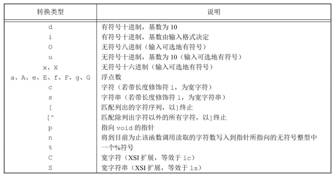
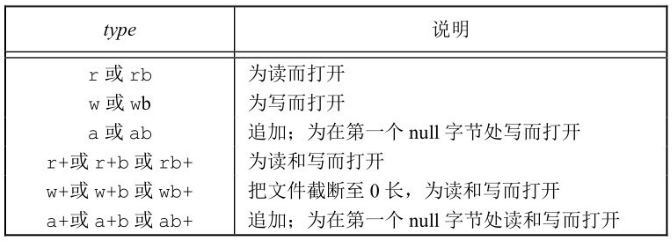

标准 `I/O` 库由 ISO C 标准说明。

## 流和 FILE 对象

标准 `I/O` 库的操作是围绕流（stream）进行的，当用标准 `I/O` 库打开或创建一个文件时，我们已使一个流与一个文件相关联。

标准 `I/O` 文件流可用于单字节或多字节字符集。流的定向（stream's orientation）决定了所读、写的字符是单字节还是多字节的。

`fwide` 函数可用于设置流的定向。

```c
#include <stdio.h>
#include <wchar.h>
int fwide(FILE *fp, int mode);
```

**返回值：**

- 若流是宽定向的，返回正值；
- 若流是字节定向的，返回负值；
- 若流是未定向的，返回 0

**mode 参数:**

- 如若 mode 参数值为负，fwide 将试图使指定的流是字节定向的。
- 如若 mode 参数值为正，fwide 将试图使指定的流是宽定向的。
- 如若 mode 参数值为 0，fwide 将不试图设置流的定向，但返回标识该流定向的值。

fwide 并不改变已定向流的定向。

## 标准输入、标准输出和标准错误

对一个进程预定义了 3 个流，并且这 3 个流可以自动地被进程使用，它们是：标准输入、标准输出和标准错误。

这 3 个标准 `I/O` 流通过预定义文件指针 `stdin`、`stdout` 和 `stderr` 加以引用。和前面文件描述符 `STDIN_FILENO`、`STDOUT_FILENO` 和 `STDERR_FILENO` 所引用的相同。

## 缓冲

标准 `I/O` 库提供缓冲的目的是尽可能减少使用 read 和 write 调用的次数。
标准 `I/O` 提供了以下 3 种类型的缓冲。

- 全缓冲。在这种情况下，在填满标准 `I/O` 缓冲区后才进行实际 `I/O` 操作。通常应用于磁盘上的文件读写。
- 行缓冲。在这种情况下，当在输入和输出中遇到换行符时，标准 `I/O` 库执行 `I/O` 操作。通常应用于终端。
- 不带缓冲。标准 `I/O` 库不对字符进行缓冲存储。

很多系统默认使用下列类型的缓冲：

- 标准错误是不带缓冲的。
- 若是指向终端设备的流，则是行缓冲的；否则是全缓冲的。

调用下列两个函数中的一个更改缓冲类型。

```c
#include <stdio.h>
void setbuf(FILE *restrict fp, char *restrict buf);
int setvbuf(FILE *restrict fp, char *restrict buf, int mode, size_t size);
```

**返回值：**

- 若成功，返回 0；
- 若出错，返回非 0

可以使用 `setbuf` 函数打开或关闭缓冲机制。将 `buf` 设置为 `NULL` 则关闭缓冲机制。

使用 `setvbuf`，我们可以精确地说明所需的缓冲类型。这是用 `mode` 参数实现的：

- `_IOFBF` 全缓冲
- `_IOLBF` 行缓冲
- `_IONBF` 不带缓冲

| 函数      | mode     | buf    | 缓冲区及长度                       | 缓冲类型       |
| --------- | -------- | ------ | ---------------------------------- | -------------- |
| `setbuf`  |          | 非空   | 长度为 `BUFSIZ` 的用户缓冲区 `buf` | 全缓冲或行缓冲 |
| `setbuf`  |          | `NULL` | (无缓冲区)                         | 不带缓冲       |
| `setvbuf` | `_IOFBF` | 非空   | 长度为 `size` 的用户缓冲区 `buf`   | 全缓冲         |
| `setvbuf` | `_IOFBF` | `NULL` | 合适长度的系统缓冲区 `buf`         | 全缓冲         |
| `setvbuf` | `_IOLBF` | 非空   | 长度为 `size` 的用户缓冲区 `buf`   | 行缓冲         |
| `setvbuf` | `_IOLBF` | `NULL` | 合适长度的系统缓冲区 `buf`         | 行缓冲         |
| `setvbuf` | `_IONBF` | (忽略) | (无缓冲区)                         | 不带缓冲       |

任何时候，我们都可强制冲洗一个流。

```c
#include<stdio.h>
int fflush(FILE *fp);
```

**返回值：**

- 若成功，返回 0；
- 若出错，返回 EOF
  此函数使该流所有未写的数据都被传送至内核。作为一种特殊情形，如若 fp 是 NULL，则此函数将导致所有输出流被冲洗。

## 打开流

下列 3 个函数打开一个标准 `I/O` 流。

```c
#include <stdio.h>
FILE *fopen(const char *restrict pathname, const char *restrict type);
FILE *freopen(const char *restrict pathname, const char *restrict type, FILE *restrict fp);
FILE *fdopen(int fd, const char *type);
```

**返回值：**
若成功，返回文件指针；
若出错，返回 NULL

这 3 个函数的区别如下。

- `fopen` 函数打开路径名为 pathname 的一个指定的文件。
- `freopen` 函数在一个指定的流上打开一个指定的文件，如若该流已经打开，则先关闭该流。
- `fdopen` 函数取一个已有的文件描述符并使一个标准的 `I/O` 流与该描述符相结合。常用于由创建管道和网络通信通道函数返回的描述符。该函数属于 POSIX.1 标准。

type 参数指定对该 `I/O` 流的读、写方式：

| type            | 说明                                   | open(2)标志 |
| --------------- | -------------------------------------- | ----------- | ------- | --------- |
| r 或 rb         | 为读而打开                             | `O_RDONLY`  |
| w 或 wb         | 把文件截断至 0 长，或为写而创建        | `O_WRONLY   | O_CREAT | O_TRUNC`  |
| a 或 ab         | 追加；为在文件尾写而打开，或为写而创建 | `O_WRONLY   | O_CREAT | O_APPEND` |
| r+或 r+b 或 rb+ | 为读和写而打开                         | `O_RDWR`    |
| w+或 w+b 或 wb+ | 把文件截断至 0 长，或为读和写而打开    | `O_RDWR     | O_CREAT | O_TRUNC`  |
| a+或 a+b 或 ab+ | 为在文件尾读和写而打开或创建           | `O_RDWR     | O_CREAT | O_APPEND` |

如果有多个进程用标准 `I/O` 追加写方式打开同一文件，那么来自每个进程的数据都将正确地写到文件中。

| 限制               | r   | w   | a   | r+  | w+  | a+  |
| ------------------ | --- | --- | --- | --- | --- | --- |
| 文件必须已存在     | x   |     |     | x   |     |     |
| 放弃文件以前的内容 |     | x   |     |     | x   |     |
| 流可以读           | x   |     |     | x   | x   | x   |
| 流可以写           |     | x   | x   | x   | x   | x   |
| 流只可在尾端处写   |     |     | x   |     |     | x   |

POSIX.1 要求实现使用如下的权限位集来创建文件：
`S_IRUSR | S_IWUSR | S_IRGRP | S_IWGRP | S_IROTH | S_IWOTH`

调用 fclose 关闭一个打开的流。

```c
#include <stdio.h>
int fclose(FILE *fp);
```

返回值：

- 若成功，返回 0；
- 若出错，返回 EOF

## 读和写流

以下 3 个函数可用于一次读一个字符。

```c
#include <stdio.h>
int getc(FILE *fp);
int fgetc(FILE *fp);
int getchar(void);
```

**返回值：**

- 若成功，返回下一个字符；
- 若已到达文件尾端或出错，返回 EOF

函数 getchar 等同于 getc(stdin)。前两个函数的区别是，getc 可被实现为宏，而 fgetc 不能实现为宏。

在 `<stdio.h>` 中的常量 EOF 被要求是一个负值，其值经常是 −1。

不管是出错还是到达文件尾端，这 3 个函数都返回同样的值。为了区分这两种不同的情况，必须调用 ferror 或 feof。

```c
#include <stdio.h>
int ferror(FILE *fp);
int feof(FILE *fp);
```

返回值：
若条件为真，返回非 0（真）；
否则，返回 0（假）

在大多数实现中，为每个流在 FILE 对象中维护了两个标志：

- 出错标志；
- 文件结束标志。

调用 clearerr 可以清除这两个标志。

```c
void clearerr(FILE *fp);
```

从流中读取数据以后，可以调用 ungetc 将字符再压送回流中。

```c
#include <stdio.h>
int ungetc(int c, FILE *fp);
```

返回值：

- 若成功，返回 c；
- 若出错，返回 EOF

用 ungetc 压送回字符时，并没有将它们写到底层文件中或设备上，只是将它们写回标准 `I/O` 库的流缓冲区中。

对应于上面所述的每个输入函数都有一个输出函数。

```c
#include <stdio.h>
int putc(int c, FILE *fp);
int fputc(int c, FILE *fp);
int putchar(int c);
```

返回值：

- 若成功，返回 c；
- 若出错，返回 EOF

putchar(c)等同于 putc(c,stdout)，putc 可被实现为宏，而 fputc 不能实现为宏。

## 每次一行 I/O

下面两个函数提供每次输入一行的功能。

```c
#include <stdio.h>
char *fgets(char *restrict buf, int n，FILE *restrict fp);
char *gets(char *buf);
```

返回值：

- 若成功，返回 buf；
- 若已到达文件尾端或出错，返回 NULL

gets 从标准输入读，而 fgets 则从指定的流读。

**gets 是一个不推荐使用的函数。**

fputs 和 puts 提供每次输出一行的功能。

```c
#include <stdio.h>
int fputs(const char *restrict str, FILE *restrict fp);
int puts(const char *str);
```

函数 fputs 将一个以 null 字节终止的字符串写到指定的流，尾端的终止符 null 不写出。
puts 将一个以 null 字节终止的字符串写到标准输出，终止符不写出。

## 标准 `I/O` 的效率

标准 `I/O` 库与直接调用 read 和 write 函数相比并不慢很多。对于大多数比较复杂的应用程序，最主要的用户 CPU 时间是由应用本身的各种处理消耗的，而不是由标准 `I/O` 例程消耗的。

## 二进制 I/O

下列两个函数以执行二进制 `I/O` 操作。

```c
#include <stdio.h>
size_t fread(void *restrict ptr, size_t size, size_t nobj, FILE *restrict fp);
size_t fwrite(const void *restrict ptr, size_t size, size_t nobj, FILE *restrict fp);
```

返回值：

- 读或写的对象数

使用二进制 `I/O` 的基本问题是，它只能用于读在同一系统上已写的数据。

## 定位流

有 3 种方法定位标准 `I/O` 流。

1. ftell 和 fseek 函数。这两个函数自 V7 以来就存在了，但是它们都假定文件的位置可以存放在一个长整型中。
1. ftello 和 fseeko 函数。SingleUNIXSpecification 引入了这两个函数，使文件偏移量可以不必一定使用长整型。它们使用 off_t 数据类型代替了长整型。
1. fgetpos 和 fsetpos 函数。这两个函数是由 ISO C 引入的。它们使用一个抽象数据类型 fpos_t 记录文件的位置。这种数据类型可以根据需要定义为一个足够大的数，用以记录文件位置。

```c
#include <stdio.h>
long ftell(FILE *fp);
int fseek(FILE *fp, long offset, int whence);
void rewind(FILE *fp);
```

返回值

- ftell 若成功，返回当前文件位置指示
- fseek 若成功，返回 0；
- 两个函数若出错，返回 −1

使用 rewind 函数也可将一个流设置到文件的起始位置。

除了偏移量的类型是 off_t 而非 long 以外，ftello 函数与 ftell 相同，fseeko 函数与 fseek 相同。

```c
#include <stdio.h>
off_t ftello(FILE *fp);
int fseeko(FILE *fp, off_t offset, int whence);
```

fgetpos 和 fsetpos 两个函数是 ISO C 标准引入的。

```c
#include <stdio.h>
int fgetpos(FILE *restrict fp, fpos_t *restrict pos);
int fsetpos(FILE *fp, const fpos_t *pos);
```

两个函数返回值：

- 若成功，返回 0；
- 若出错，返回非 0

fgetpos 将文件位置指示器的当前值存入由 pos 指向的对象中。在以后调用 fsetpos 时，可以使用此值将流重新定位至该位置。

## 格式化 I/O

格式化输出是由 5 个 printf 函数来处理的。

```c
#include <stdio.h>
int printf(const char *restrict format, ...);
int fprintf(FILE *restrict fp, const char *restrict format,...);
int dprintf(int fd, const char *restrict format, ...);
```

返回值：
若成功，返回输出字符数；
若输出出错，返回负值

```c
int sprintf(char *restrict buf, const char *restrict format, ...);
int snprintf(char *restrict buf, size_t n, const char *restrict format, ...);
```

返回值：

- sprintf 若成功，返回存入数组的字符数；
- snprintf 若缓冲区足够大，返回将要存入数组的字符数；
- 若编码出错，返回负值

一个转换说明有 4 个可选择的部分，下面将它们都示于方括号中：
`%[flags][fldwidth][precision][lenmodifier]convtype`

- `flags`

| 标志   | 说明                                                     |
| ------ | -------------------------------------------------------- |
| `'`    | (撇号)将整数按千位分组字符                               |
| `-`    | 在字段内左对齐输出                                       |
| `+`    | 总是显示带符号转换的正负号                               |
| (空格) | 如果第一个字符不是正负号，则在其前面加上一个空格         |
| `#`    | 指定另一种转换形式（例如，对于十六进制格式，加 0x 前缀） |
| `0`    | 添加前导 0（而非空格）进行填充                           |

- `fldwidth` 说明最小字段宽度。
- `precision` 说明整型转换后最少输出数字位数、浮点数转换后小数点后的最少位数、字符串转换后最大字节数。
- `lenmodifier` 说明参数长度。

| 长度修饰符 | 说明                                                        |
| ---------- | ----------------------------------------------------------- |
| `hh`       | 将相应的参数按 `signed` 或 `unsigned char` 类型输出         |
| `h`        | 将相应的参数按 `signed` 或 `unsigned short` 类型输出        |
| `l`        | 将相应的参数按 `signed` 或 `unsigned long` 或宽字符类型输出 |
| `ll`       | 将相应的参数按 `signed` 或 `unsigned long long` 类型输出    |
| `j`        | `intmax_t` 或 `uintmax_t`                                   |
| `z`        | `size_t`                                                    |
| `t`        | `ptrdiff_t`                                                 |
| `L`        | `long double`                                               |

- `convtype` 不是可选的。它控制如何解释参数。

| 转换类型 | 说明                                                                           |
| -------- | ------------------------------------------------------------------------------ |
| `d`、`i` | 有符号十进制                                                                   |
| `o`      | 无符号八进制                                                                   |
| `u`      | 无符号十进制                                                                   |
| `x`、`X` | 无符号十六进制                                                                 |
| `f`、`F` | 双精度浮点数                                                                   |
| `e`、`E` | 指数格式双精度浮点数                                                           |
| `g`、`G` | 根据转换后的值解释为 `f`、`F`、`e` 或 `E`                                      |
| `a`、`A` | 十六进制指数格式双精度浮点数                                                   |
| `c`      | 字符（若带长度修饰符 1，为宽字符）                                             |
| `s`      | 字符串（若带长度修饰符 1，为宽字符）                                           |
| `P`      | 指向 void 的指针                                                               |
| `n`      | 到目前为止，此 `printf` 调用输出的字符的数目将被写入到指针所指向的带符号整型中 |
| `%`      | 一个 `%` 字符                                                                  |
| `C`      | 宽字符(XSI 扩展，等效于 `1c`)                                                  |
| `S`      | 宽字符串(XSI 扩展，等效于 `1s`)                                                |

下列 5 种 printf 族的变体类似于上面的 5 种，但是可变参数表 `...` 替换成了 arg。

```c
#include <stdarg.h>
#include <stdio.h>
int vprintf(const char *restrict format, va_list arg);
int vfprintf(FILE *restrict fp, const char *restrict format, va_list arg);
int vdprintf(int fd, const char *restrict format, va_list arg);
```

返回值：

- 若成功，返回输出字符数；
- 若输出出错，返回负值

```c
int vsprintf(char *restrict buf, const char *restrict format, va_list arg);
int vsnprintf(char *restrict buf, size_t n, const char *restrict format, va_list arg);
```

返回值：

- vsprintf 若成功，返回存入数组的字符数；
- vsnprintf 若缓冲区足够大，返回存入数组的字符数；
- 若编码出错，返回负值

执行格式化输入处理的是 3 个 scanf 函数。

```c
#include <stdio.h>
int scanf(const char *restrict format, ...);
int fscanf(FILE *restrict fp, const char *restrict format, ...);
int sscanf(const char *restrict buf, const char *restrict format, ...);
```

返回值：

- 赋值的输入项数；
- 若输入出错或在任一转换前已到达文件尾端，返回 EOF

scanf 族用于分析输入字符串，并将字符序列转换成指定类型的变量。在格式之后的各参数包含了变量的地址，用转换结果对这些变量赋值。

一个转换说明有 3 个可选择的部分，下面将它们都示于方括号中：
`%[*][fldwidth][m][lenmodifier]convtype`

- 可选择的星号（\*）用于抑制转换。按照转换说明的其余部分对输入进行转换，但转换结果并不存放在参数中。
- fldwidth 说明最大宽度（即最大字符数）。
- lenmodifier 说明要用转换结果赋值的参数大小。
- convtype 字段类似于 printf 族的转换类型字段，但两者之间还有些差别。



与 printf 族相同，scanf 族也使用由`<stdarg.h>`说明的可变长度参数表。

```c
#include <stdarg.h>
#include <stdio.h>
int vscanf(const char *restrict format, va_list arg);
int vfscanf(FILE *restrict fp, const char *restrict format, va_list arg);
int vsscanf(const char *restrict buf, const char *restrict format, va_list arg);
```

返回值：

- 指定的输入项目数；
- 若输入出错或在任一转换前文件结束，返回 EOF

## 实现细节

每个标准 `I/O` 流都有一个与其相关联的文件描述符，可以对一个流调用 fileno 函数以获得其描述符。
fileno 不是 ISO C 标准部分，而是 POSIX.1 支持的扩展。

```c
#include <stdio.h>
int fileno(FILE *fp);
```

返回值：

- 与该流相关联的文件描述符

例子，对各个标准 `I/O` 流打印缓冲状态信息。

```c
#include "../apue.h"

void pr_stdio(const char *, FILE *);
int is_unbuffered(FILE *);
int is_linebuffered(FILE *);
int buffer_size(FILE *);

int main(int argc, char const *argv[]){
    FILE *fp;
    fputs("enter any character\n", stdout);
    if(getchar() == EOF)
        err_sys("getchar error");
    fputs("one line to standard error\n", stderr);

    pr_stdio("stdin", stdin);
    pr_stdio("stdout", stdout);
    pr_stdio("stderr", stderr);

    if((fp = fopen("/etc/passwd", "r")) == NULL)
        err_sys("fopen error");
    if(getc(fp) == EOF)
        err_sys("getc error");
    pr_stdio("/etc/passwd", fp);
    exit(0);
}

void pr_stdio(const char *name, FILE *fp){
    printf("stream = %s,", name);
    if(is_unbuffered(fp))
        printf("unbuffered");
    else if(is_linebuffered(fp))
        printf("line_buffered");
    else
        printf("fully buffered");
    printf(", buffer size = %d\n", buffer_size(fp));
}

#if defined(_IO_UNBUFFERED)

int is_unbuffered(FILE *fp){
    return (fp->_flags & _IO_UNBUFFERED);
}

int is_linebuffered(FILE *fp){
    return (fp->_flags & _IO_LINE_BUF);
}

int buffer_size(FILE *fp){
    return (fp->_IO_buf_end - fp->_IO_buf_base);
}

#elif defined(__SNBF)

int is_unbuffered(FILE *fp){
    return (fp->_flags & __SNBF);
}

int is_linebuffered(FILE *fp){
    return (fp->_flags & __SLBF);
}

int buffer_size(FILE *fp){
    return (fp->_bf._size);
}

#elif defined(_IONBF)

#ifdef _LP64
#define _flag __pad[4]
#define _ptr __pad[1]
#define _base __pad[2]
#endif

int is_unbuffered(FILE *fp){
    return (fp->_flags & _IONBF);
}

int is_linebuffered(FILE *fp){
    return (fp->_flags & _IOLBF);
}

int buffer_size(FILE *fp){
#ifdef _LP64
    return (fp->_base - fp->_ptr);
#elif
    return (BUFSIZ);
#endif
}
#else

#error unknown stdio implementation!
#endif
```

编译运行：

```bash
./a.out
enter any character
adb
one line to standard error
stream = stdin,line_buffered, buffer size = 1024
stream = stdout,line_buffered, buffer size = 1024
stream = stderr,unbuffered, buffer size = 1
stream = /etc/passwd,fully buffered, buffer size = 4096
```

## 临时文件

ISO C 标准 `I/O` 库提供了两个函数以帮助创建临时文件。

```c
#include<stdio.h>
char *tmpnam(char *ptr);
FILE *tmpfile(void);
```

返回值：

- tmpnam 指向唯一路径名的指针
- tmpfile 若成功，返回文件指针；若出错，返回 NULL

例子：

```c
#include "../apue.h"

int main(int argc, char const *argv[]){
    char name[L_tmpnam], line[MAXLINE];
    FILE *fp;
    printf("%s\n", tmpnam(NULL)); //ptr是NULL，则所产生的路径名存放在一个静态区中
    tmpnam(name);
    printf("%s\n", name);

    if((fp = tmpfile()) == NULL)
        err_sys("tmpfile error");
    fputs("one line of output\n", fp);
    rewind(fp);
    if(fgets(line, sizeof(line), fp) == NULL)
        err_sys("fgets error");
    fputs(line, stdout);
    return 0;
}
```

编译运行：

```bash
$ gcc 5.13tmpfile.c ../error.c
/tmp/ccS9zKqg.o: In function `main':
5.13tmpfile.c:(.text+0x2d): warning: the use of `tmpnam' is dangerous, better use `mkstemp'
$ ./a.out
/tmp/filez6xGEq
/tmp/fileaul6Re
one line of output
```

mkdtemp 和 mkstemp 同样处理临时文件，它们是 XSI 的扩展部分。

```c
#include <stdlib.h>
char *mkdtemp(char *template);
int mkstemp(char *template);
```

返回值：

- mkdtemp 若成功，返回指向目录名的指针；若出错，返回 NULL
- mkstemp 返回值：若成功，返回文件描述符；若出错，返回 −1

mkdtemp 函数创建的目录使用下列访问权限位集：`S_IRUSR|S_IWUSR | S_IXUSR`。
mkstemp 创建的文件使用访问权限位 `S_IRUSR | S_IWUSR`。mkstemp 创建的临时文件并不会自动删除。

例子：

```c
#include "../apue.h"
#include <errno.h>

void make_temp(char *template);

int main(int argc, char const *argv[]){
    char good_template[] = "/tmp/dirXXXXXX";
    char *bad_template = "/tmp/dirXXXXXX"; // 只读

    printf("trying to create first temp file...\n");
    make_temp(good_template);
    printf("try to create second temp file...\n");
    make_temp(bad_template);
    return 0;
}

void make_temp(char* template){
    int fd;
    struct stat sbuf;
    if((fd = mkstemp(template)) < 0)
        err_sys("can't create temp file");
    printf("temp name = %s\n", template);
    close(fd);
    if(stat(template, &sbuf) < 0){
        if(errno == ENONET)
            printf("file doesn't exist\n");
        else
            err_sys("stat failed");
    }else{
        printf("file exists\n");
        unlink(template);
    }
}
```

编译运行：

```bash
$ gcc 5.13mkstemp.c ../error.c
$ ./a.out
trying to create first temp file...
temp name = /tmp/dirH31nLr
file exists
try to create second temp file...
[1]    6143 segmentation fault (core dumped)  ./a.out
```

## 内存流

有 3 个函数可用于内存流的创建

```c
#include <stdio.h>
FILE *fmemopen(void *restrict buf, size_t size, const char *restrict type);
FILE *open_memstream(char **bufp, size_t *sizep);
#include <wchar.h>
FILE *open_wmemstream(wchar_t **bufp, size_t *sizep);
```

**返回值：**

- 若成功，返回流指针；
- 若出错，返回 NULL

buf 参数指向缓冲区的开始位置，size 参数指定了缓冲区大小的字节数。
type 参数控制如何使用流。


- 无论何时以追加写方式打开内存流时，当前文件位置设为缓冲区中的第一个 null 字节。
- 如果 buf 参数是一个 null 指针，打开流进行读或者写都没有任何意义。
- 任何时候需要增加流缓冲区中数据量以及调用 fclose、fflush、fseek、fseeko 以及 fsetpos 时都会在当前位置写入一个 null 字节。

例子：

```c
#include "../apue.h"

#define BSZ 48

int main(int argc, char const *argv[]){
    FILE *fp;
    char buf[BSZ];

    memset(buf, 'a', BSZ -2);
    buf[BSZ-2] = '\0';
    buf[BSZ-1] = 'x';
    // fmemopen在缓冲区开始处放置null字节
    if((fp = fmemopen(buf, BSZ, "w+")) == NULL)
        err_sys("fmemopen failed");
    printf("initial buffer contents: %s\n", buf);
    fprintf(fp, "hello, world");
    printf("before flush: %s\n", buf);
    // 流冲洗后缓冲区才会变化
    fflush(fp);
    printf("after fflush: %s\n", buf);
    printf("len of string in buf = %ld\n", (long)strlen(buf));

    memset(buf, 'b', BSZ-2);
    buf[BSZ-2] = '\0';
    buf[BSZ-1] = 'X';
    fprintf(fp, "hello, world");
    // fseek引起缓冲区冲洗
    fseek(fp, 0, SEEK_SET);
    printf("after fseek: %s\n", buf);
    printf("len of string in buf = %ld\n", (long)strlen(buf));

    memset(buf, 'c', BSZ-2);
    buf[BSZ-2] = '\0';
    buf[BSZ-1] = 'X';
    fprintf(fp, "hello, world");
    fclose(fp);
    printf("after fclose: %s\n", buf);
    printf("len of string in buf = %ld\n", (long)strlen(buf));
    return 0;
}
```

编译运行：

```bash
$ gcc 5.14fmemopen.c ../error.c
$ ./a.out
initial buffer contents:      #在缓冲区开始处放置 null，所以输出为空
before flush:
after fflush: hello, world    # 流冲洗后缓冲区才会变化
len of string in buf = 12
after fseek: bbbbbbbbbbbbhello, world    # fseek引起缓冲区冲洗
len of string in buf = 24
after fclose: hello, worldcccccccccccccccccccccccccccccccccc    # 没有追加写null字节
len of string in buf = 46
```

用于创建内存流的其他两个函数分别是 open_memstream 和 open_wmemstream。

```c
#include <stdio.h>
FILE *open_memstream(char **bufp, size_t *sizep);
#include <wchar.h>
FILE *open_wmemstream(wchar_t **bufp, size_t *sizep);
```

返回值：

- 若成功，返回流指针；
- 若出错，返回 NULL

open_memstream 函数创建的流是面向字节的，open_wmemstream 函数创建的流是面向宽字节的。

与 fmemopen 函数的不同在于：

- 创建的流只能写打开；
- 不能指定自己的缓冲区，但可以分别通过 bufp 和 sizep 参数访问缓冲区地址和大小；
- 关闭流后需要自行释放缓冲区；
- 对流添加字节会增加缓冲区大小。

缓冲区地址和大小的使用上必须遵循一些原则

- 缓冲区地址和长度只有在调用 fclose 或 fflush 后才有效；
- 这些值只有在下一次流写入或调用 fclose 前才有效
