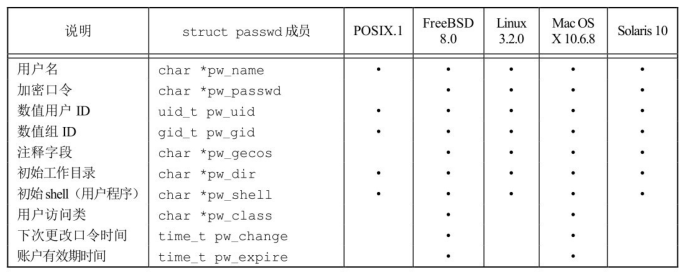
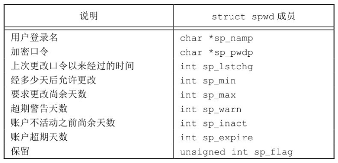
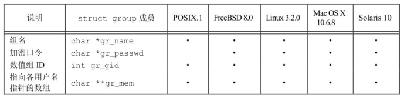
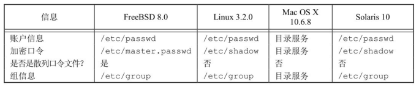
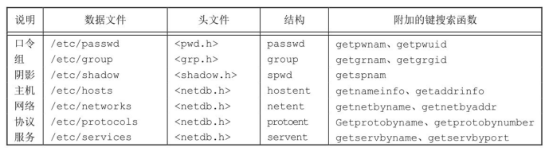
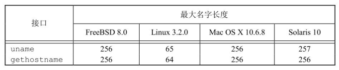
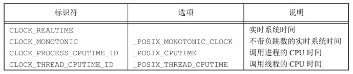
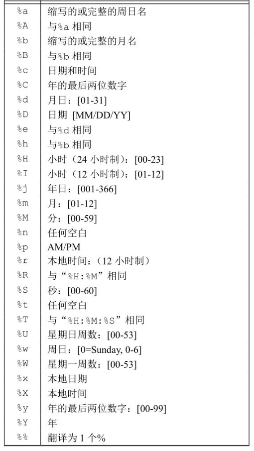

## 口令文件

UNIX 系统口令文件包含了图中所示的各字段，这些字段包含在 `<pwd.h>` 中定义的 `passwd` 结构中。



由于历史原因，口令文件是 `/etc/passwd`，而且是一个 ASCII 文件。每一行包含图中所示的各字段，字段之间用冒号分隔。

```bash
root:x:0:0:root:/root:/bin/bash
daemon:x:1:1:daemon:/usr/sbin:/usr/sbin/nologin
nobody:x:65534:65534:nobody:/nonexistent:/usr/sbin/nologin
ckcat:x:1000:1000:ckcat:/home/ckcat:/usr/bin/zsh
```

关于这些登录项，请注意下列各点：

- 通常有一个用户名为 `root` 的登录项，其用户 ID 是 0。
- 加密口令字段包含了一个占位符。
- 口令文件项中的某些字段可能是空。
- `shell` 字段包含了一个可执行程序名，它被用作该用户的登录 `shell`。若该字段为空，则取系统默认值，通常是`/bin/sh`。
- 为了阻止一个特定用户登录系统，除使用`/dev/null` 外，还有若干种替代方法。将`/bin/false` 用作登录 shell。
- 使用 `nobody` 用户名的一个目的是，使任何人都可登录至系统，但其用户 ID（65534）和组 ID（65534）不提供任何特权。
- 提供 `finger(1)`命令的某些 UNIX 系统支持注释字段中的附加信息。

POSIX.1 定义了两个获取口令文件项的函数。

```c
#include<pwd.h>
struct passwd *getpwuid(uid_t uid);
struct passwd *getpwnam(const char *name);
```

返回值：

- 若成功，返回指针；
- 若出错，返回 NULL

`getpwuid` 函数由 `ls(1)` 程序使用，它将 `i` 节点中的数字用户 `ID` 映射为用户登录名。
`getpwnam` 函数由 `login(1)` 程序使用。

`passwd` 结构通常是函数内部的静态变量，只要调用任一相关函数，其内容就会被重写。

要查看整个口令文件，下列 3 个函数则可用于此种目的，它们被定义为 XSI 扩展。

```c
#include <pwd.h>
struct passwd *getpwent(void);
void setpwent(void);
void endpwent(void);
```

getpwent 返回值：

- 若成功，返回指针；
- 若出错或到达文件尾端，返回 NULL

调用 getpwent 时，它返回口令文件中的下一个记录项。在使用 getpwent 查看完口令文件后，一定要调用 endpwent 关闭这些文件。

例子：

```c
#include <pwd.h>
#include <stddef.h>
#include <string.h>

struct passwd * getpwnam(const char *name){
    struct passwd * ptr;
    // 确保定位到文件开始处
    setpwent();
    while ((ptr == getpwent()) != NULL){
        if(strcmp(name, ptr->pw_name) == 0)
            break;
    }
    endpwent();
    return (ptr);
}
```

## 阴影口令

加密口令是经单向加密算法处理过的用户口令副本。因为此算法是单向的，所以不能从加密口令猜测到原来的口令。

现在，某些系统将加密口令存放在另一个通常称为阴影口令（shadow password）的文件中。该文件至少要包含用户名和加密口令。与该口令相关的其他信息也可存放在该文件中。



只有用户登录名和加密口令这两个字段是必须的。

阴影口令文件不应是一般用户可以读取的。仅有少数几个程序需要访问加密口令，如 login(1)和 passwd(1)。有了阴影口令后，普通口令文件/etc/passwd 可由各用户自由读取。

下列函数可用于访问阴影口令文件。

```c
#include <shadow.h>
struct spwd *getspnam(const char *name);
struct spwd *getspent(void);
两个函数返回值：若成功，返回指针；若出错，返回NULL
void setspent(void);
void endspent(void);
```

返回值：

- 若成功，返回指针；
- 若出错，返回 NULL

## 组文件

UNIX 组文件（POSIX.1 称其为组数据库）包含了图中所示字段。这些字段包含在`<grp.h>`中所定义的 group 结构中。



字段 gr_mem 是一个指针数组，其中每个指针指向一个属于该组的用户名。该数组以 null 指针结尾。
可以用下列两个由 POSIX.1 定义的函数来查看组名或数值组 ID。

```c
#include <grp.h>
struct group *getgrgid(gid_t gid);
struct group *getgrnam(const char *name);
```

返回值：

- 若成功，返回指针；
- 若出错，返回 NULL

如同对口令文件进行操作的函数一样，这两个函数通常也返回指向一个静态变量的指针，在每次调用时都重写该静态变量。

如果需要搜索整个组文件，则须使用另外几个函数，它们是 XSI 扩展。

```c
#include <grp.h>
struct group *getgrent(void);
void setgrent(void);
void endgrent(void);
```

返回值：

- 若成功，返回指针；
- 若出错或到达文件尾端，返回 NULL

## 附属组 ID

每个用户任何时候都只属于一个组。当用户登录时，系统就按口令文件记录项中的数值组 ID，赋给他实际组 ID。可以在任何时候执行 newgrp(1)以更改组 ID。

4.2BSD 引入了附属组 ID（supplementary group ID）的概念。我们不仅可以属于口令文件记录项中组 ID 所对应的组，也可属于多至 16 个另外的组。文件访问权限检查相应被修改为：不仅将进程的有效组 ID 与文件的组 ID 相比较，而且也将所有附属组 ID 与文件的组 ID 进行比较。

常量 NGROUPS_MAX 规定了附属组 ID 的数量。

为了获取和设置附属组 ID，提供了下列 3 个函数。

```c
#include <unistd.h>
int getgroups(int gidsetsize, gid_t grouplist[]);
#include <grp.h> /* on Linux */
#include <unistd.h> /* on FreeBSD, Mac OS X, and Solaris */
int setgroups(int ngroups, const gid_t grouplist[]);
#include <grp.h> /* on Linux and Solaris */
#include <unistd.h> /* on FreeBSD and Mac OS X */
int initgroups(const char *username, gid_t basegid);
```

getgroups 返回值：

- 若成功，返回附属组 ID 数量；
- 若出错，返回-1

getgroups 将进程所属用户的各附属组 ID 填写到数组 grouplist 中，际填写到数组中的附属组 ID 数由函数返回。如若 gidsetsize 为 0，则函数只返回附属组 ID 数。

setgroups 和 initgroups 返回值：

- 若成功，返回 0；
- 若出错，返回-1

setgroups 可由超级用户调用以便为调用进程设置附属组 ID 表。grouplist 是组 ID 数组，而 ngroups 说明了数组中的元素数。ngroups 的值不能大于 NGROUPS_MAX。

initgroups 读整个组文件，然后对 username 确定其组的成员关系。

## 实现区别



## 其他数据文件

在日常操作中，UNIX 系统还使用很多其他文件。BSD 网络软件有一个记录各网络服务器所提供服务的数据文件（/etc/services），有一个记录协议信息的数据文件（/etc/protocols），还有一个则是记录网络信息的数据文件（/etc/networks）。

一般情况下，对于每个数据文件至少有 3 个函数。

- get 函数：读下一个记录，如果需要，还会打开该文件。此种函数通常返回指向一个结构的指针。当已达到文件尾端时返回空指针。大多数 get 函数返回指向一个静态存储类结构的指针，如果要保存其内容，则需复制它。
- set 函数：打开相应数据文件（如果尚末打开），然后反绕该文件。如果希望在相应文件起始处开始处理，则调用此函数。
- end 函数：关闭相应数据文件。如前所述，在结束了对相应数据文件的读、写操作后，总应调用此函数以关闭所有相关文件。



图中的最后 4 个数据文件都是符号链接，它们都链接到目录/etc/inet 下的同名文件上。

## 登录账户记录

大多数 UNIX 系统都提供下列两个数据文件：utmp 文件记录当前登录到系统的各个用户；wtmp 文件跟踪各个登录和注销事件。

在 FreeBSD8.0 和 Linux3.2.0 中，登录记录的格式请参见手册页 utmp(5)。这两个文件的路径名是/var/run/utmp 和/var/log/wtmp。

## 系统标识

POSIX.1 定义了 uname 函数，它返回与主机和操作系统有关的信息。

```c
#include <sys/utsname.h>
int uname(struct utsname *name);
```

返回值：

- 若成功，返回非负值；
- 若出错，返回-1

通过该函数的参数向其传递一个 utsname 结构的地址，然后该函数填写此结构。

BSD 派生的系统提供 gethostname 函数，它只返回主机名，该名字通常就是 TCP/IP 网络上主机的名字。

```c
#include <unistd.h>
int gethostname(char *name, i n t namelen);
```

返回值：

- 若成功，返回 0；
- 若出错，返回-1

namelen 参数指定 name 缓冲区长度，如若提供足够的空间，则通过 name 返回的字符串以 null 字节结尾。



hostname(1)命令可用来获取和设置主机名。

## 时间和日期例程

由 UNIX 内核提供的基本时间服务是计算自协调世界时（Coordinated Universal Time，UTC）公元 1970 年 1 月 1 日 00:00:00 这一特定时间以来经过的秒数。

time 函数返回当前时间和日期。

```c
#include <time.h>
time_t time(time_t *calptr);
```

返回值：

- 若成功，返回时间值；
- 若出错，返回-1

时间值作为函数值返回。如果参数非空，则时间值也存放在由 calptr 指向的单元内。

POSXI.1 的实时扩展增加了对多个系统时钟的支持。时钟通过 clockid_t 类型进行标识。



clock_gettime 函数可用于获取指定时钟的时间，它把时间表示为秒和纳秒。

```c
#include <sys/time.h>
int clock_gettime(clockid_t clock_id, struct timespec *tsp);
```

返回值：

- 若成功，返回 0；
- 若出错，返回-1

当时钟 ID 设置为 CLOCK_REALTIME 时，clock_gettime 函数提供了与 time 函数类似的功能，不过在系统支持高精度时间值的情况下，clock_gettime 可能比 time 函数得到更高精度的时间值。

```c
#include <sys/time.h>
int clock_getres(clockid_t clock_id, struct timespec *tsp);
```

返回值：

- 若成功，返回 0；
- 若出错，返回-1

clock_getres 函数把参数 tsp 指向的 timespec 结构初始化为与 clock_id 参数对应的时钟精度。

要对特定的时钟设置时间，可以调用 clock_settime 函数。

```c
#include <sys/time.h>
int clock_settime(clockid_t clock_id, const struct timespec *tsp);
```

返回值：

- 若成功，返回 0；
- 若出错，返回-1

gettimeofday 提供了更高的精度

```c
#include <sys/time.h>
int gettimeofday(struct timeval *restrict tp, void *restrict tzp);
```

返回值：总是返回 0

tzp 的唯一合法值是 NULL，其他值将产生不确定的结果。

两个函数 localtime 和 gmtime 将日历时间转换成分解的时间，并将这些存放在一个 tm 结构中。

```c
#include <time.h>
struct tm *gmtime(const time_t *calptr);
struct tm *localtime(const time_t *calptr);
```

返回值：

- 指向分解的 tm 结构的指针；
- 若出错，返回 NULL
  localtime 和 gmtime 之间的区别是：localtime 将日历时间转换成本地时间，而 gmtime 则将日历时间转换成协调统一时间的年、月、日、时、分、秒、周日分解结构。

```c
struct tm { /* a broken-down time */
    int tm_sec; /* seconds after the minute: [0 - 60]*/
    int tm_min; /* minutes after the hour: [0 - 59]*/
    int tm_hour; /* hours after midnight: [0 - 23] */
    int tm_mday; /* day of the month: [1 - 31] */
    int tm_mon; /* months since January: [0 - 11] */
    int tm_year; /* years since 1900 */
    int tm_wday; /* days since Sunday: [0 - 6] */
    int tm_yday; /* days since January 1: [0 - 365] */
    int tm_isdst; /* daylight saving time flag: <0, 0,>0 */
};
```


函数mktime以本地时间的年、月、日等作为参数，将其变换成time_t值。

```c
#include <time.h>
time_t mktime(struct tm *tmptr);
```
返回值：
- 若成功，返回日历时间；
- 若出错，返回-1

函数strftime是一个类似于printf的时间值函数。它非常复杂，可以通过可用的多个参数来定制产生的字符串。
```c
#include <time.h>
size_t strftime(char *restrict buf, size_t maxsize,
                const char *restrict format,
                const struct tm *restrict tmptr);
size_t strftime_l(char *restrict buf, size_t maxsize,
                const char *restrict format,
                const struct tm *restrict tmptr, locale_t locale);
```
返回值：
- 若有空间，返回存入数组的字符数；
- 否则，返回0

strftime_l允许调用者将区域指定为参数，除此之外，strftime和strftime_l函数是相同的。strftime使用通过TZ环境变量指定的区域。

tmptr参数是要格式化的时间值，由一个指向分解时间值tm结构的指针说明。格式化结果存放在一个长度为maxsize个字符的buf数组中。
format参数控制时间值的格式。




