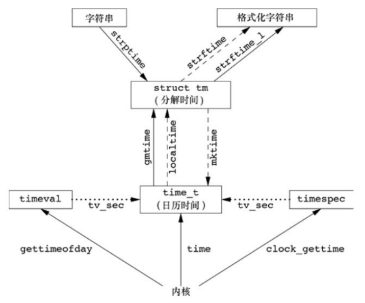

## 口令文件

UNIX 系统口令文件包含了图中所示的各字段，这些字段包含在 `<pwd.h>` 中定义的 `passwd` 结构中。

`/etc/passwd` 文件中的字段：

| 说明                  | struct passwd 成员 | POSIX.1 | FreeBSD8.0 | Linux3.2.0 | Mac OSX 10.6.8 |
| --------------------- | ------------------ | :-----: | :--------: | :--------: | :------------: |
| 用户名                | `char *pw_name`    |    •    |     •      |     •      |       •        |
| 加密口令              | `char *pw_passwd`  |         |     •      |     •      |       •        |
| 数值用户 ID           | `uid_t pw_uid`     |    •    |     •      |     •      |       •        |
| 数值组 ID             | `gid_t pw_gid`     |    •    |     •      |     •      |       •        |
| 注释字段              | `char *pw_gecos`   |         |     •      |     •      |       •        |
| 初始工作目录          | `char *pw_dir`     |    •    |     •      |     •      |       •        |
| 初始 shell (用户程序) | `char *pw_shell`   |    •    |     •      |     •      |       •        |
| 用户访问类            | `char *pw_class`   |         |     •      |            |       •        |
| 下次更改口令时间      | `time_t pw_change` |         |     •      |            |       •        |
| 账户有效期时间        | `time_t pw_expire` |         |     •      |            |       •        |

由于历史原因，口令文件是 `/etc/passwd`，而且是一个 ASCII 文件。每一行包含图中所示的各字段，字段之间用冒号分隔。

```bash
root:x:0:0:root:/root:/bin/bash
daemon:x:1:1:daemon:/usr/sbin:/usr/sbin/nologin
nobody:x:65534:65534:nobody:/nonexistent:/usr/sbin/nologin
ckcat:x:1000:1000:ckcat:/home/ckcat:/usr/bin/zsh
```

关于这些登录项，请注意下列各点：

- 通常有一个用户名为 `root` 的登录项，其用户 ID 是 0。
- 加密口令字段包含了一个占位符。
- 口令文件项中的某些字段可能是空。
- `shell` 字段包含了一个可执行程序名，它被用作该用户的登录 `shell`。若该字段为空，则取系统默认值，通常是`/bin/sh`。
- 为了阻止一个特定用户登录系统，除使用`/dev/null` 外，还有若干种替代方法。如将`/bin/false` 用作登录 `shell`。
- 使用 `nobody` 用户名的一个目的是，使任何人都可登录至系统，但其用户 ID（65534）和组 ID（65534）不提供任何特权。
- 提供 `finger(1)`命令的某些 UNIX 系统支持注释字段中的附加信息。

`POSIX.1` 定义了两个获取口令文件项的函数。

```c
#include<pwd.h>
struct passwd *getpwuid(uid_t uid);
struct passwd *getpwnam(const char *name);
```

返回值：

- 若成功，返回指针；
- 若出错，返回 `NULL`。

`getpwuid` 函数由 `ls(1)` 程序使用，它将 `i` 节点中的数字用户 `ID` 映射为用户登录名。
`getpwnam` 函数由 `login(1)` 程序使用。

`POSIX.1` 标准下的`passwd` 结构：

```c
struct passwd
{
  char *pw_name;		/* Username.  */
  char *pw_passwd;		/* Hashed passphrase, if shadow database
                                   not in use (see shadow.h).  */
  __uid_t pw_uid;		/* User ID.  */
  __gid_t pw_gid;		/* Group ID.  */
  char *pw_gecos;		/* Real name.  */
  char *pw_dir;			/* Home directory.  */
  char *pw_shell;		/* Shell program.  */
};
```

**`passwd` 结构通常是函数内部的静态变量，只要调用任一相关函数，其内容就会被重写。**

例子：

```c
#include <stdio.h>
#include <stdlib.h>
#include <pwd.h>

int main() {
    struct passwd *user_info = getpwuid(1000);
    getpwuid(0); // user_info 被重写了
    if (user_info != NULL) {
        printf("用户名: %s\n", user_info->pw_name);
        printf("用户主目录: %s\n", user_info->pw_dir);
        printf("用户ID: %d\n", user_info->pw_uid);
        printf("组ID: %d\n", user_info->pw_gid);

        endpwent();  // 关闭 passwd 文件，释放资源
    } else {
        perror("获取用户信息时出错");
    }
    return 0;
}
```

编译运行：

```bash
$ gcc 01passwd.c
$ ./a.out
用户名: root
用户主目录: /root
用户ID: 0
组ID: 0
```

如果要查看的只是登录名或用户 ID，那么这两个 `POSIX.1` 函数能满足要求，但是也有些程序要查看整个口令文件。下列 3 个函数则可用于此种目的，它们被定义为 `XSI` 扩展。

```c
#include <pwd.h>
struct passwd *getpwent(void);
void setpwent(void);
void endpwent(void);
```

`getpwent` 返回值：

- 若成功，返回指针；
- 若出错或到达文件尾端，返回 `NULL`。

调用 `getpwent` 时，它返回口令文件中的下一个记录项。在使用 `getpwent` 查看完口令文件后，一定要调用 `endpwent` 关闭这些文件。

例子，`getpwnam` 函数的一个实现：

```c
#include <stddef.h>
#include <string.h>
#include <stdio.h>
#include <pwd.h>

struct passwd *my_getpwnam(const char *name){
	struct passwd *ptr;
	// passwd 文件可能被其他进程打开，确保定位到文件开始处。
	setpwent();
	while((ptr = getpwent()) != NULL){
		if(strcmp(name, ptr->pw_name) == 0)
			break;
	}
	endpwent(); // 关闭 passwd 文件
	return ptr;
}

int main(){
	struct passwd *user_info = my_getpwnam("ckcat");
	if (user_info != NULL) {
		printf("用户名: %s\n", user_info->pw_name);
		printf("用户主目录: %s\n", user_info->pw_dir);
		printf("用户ID: %d\n", user_info->pw_uid);
		printf("组ID: %d\n", user_info->pw_gid);
		// 其他用户信息字段也可以通过结构体访问
	} else {
		perror("获取用户信息时出错");
	}
	return 0;
}
```

编译运行：

```bash
$ gcc 02getpwnam.c
$ ./a.out
用户名: ckcat
用户主目录: /home/ckcat
用户ID: 1000
组ID: 1000
```

## 阴影口令

加密口令是经单向加密算法处理过的用户口令副本。因为此算法是单向的，所以不能从加密口令猜测到原来的口令。

现在，某些系统将加密口令存放在另一个通常称为阴影口令（shadow password）的文件中。该文件至少要包含用户名和加密口令。与该口令相关的其他信息也可存放在该文件中。

`/etc/shadow` 文件中的字段：

| 说明                       | struct spwd 成员       |
| -------------------------- | ---------------------- |
| 用户登录名                 | `char *sp_namp`        |
| 加密口令                   | `char *sp_pwdp`        |
| 上次更改口令以来经过的时间 | `int sp_lstchg`        |
| 经多少天后允许更改         | `int sp_min`           |
| 要求更改尚余天数           | `int sp_max`           |
| 超期警告天数               | `int sp_warn`          |
| 账户不活动之前尚余天数     | `int sp_inact`         |
| 账户超期天数               | `int sp_expire`        |
| 保留                       | `unsigned int sp_flag` |

只有用户登录名和加密口令这两个字段是必须的。

阴影口令文件不应是一般用户可以读取的。仅有少数几个程序需要访问加密口令，如 `login(1)` 和 `passwd(1)`。有了阴影口令后，普通口令文件 `/etc/passwd` 可由各用户自由读取。

下列函数可用于访问阴影口令文件。

```c
#include <shadow.h>
struct spwd *getspnam(const char *name);
struct spwd *getspent(void);

void setspent(void);
void endspent(void);
```

`getspnam` 和 `getspent` 返回值：

- 若成功，返回指针；
- 若出错，返回 `NULL`。

## 组文件

UNIX 组文件（`POSIX.1` 称其为组数据库）包含了图中所示字段。这些字段包含在`<grp.h>`中所定义的 group 结构中。

`/etc/group` 文件中的字段：

| 说明                   | struct group 成员 | POSIX.1 | FreeBSD 8.0 | Linux 3.2.0 | Mac OS X10.6.8 |
| ---------------------- | ----------------- | :-----: | :---------: | :---------: | :------------: |
| 组名                   | `char *gr_name`   |    •    |      •      |      •      |       •        |
| 加密口令               | `char *gr_passwd` |         |      •      |      •      |       •        |
| 数值组 ID              | `int gr_gid`      |    •    |      •      |      •      |       •        |
| 指向各用户名指针的数组 | `char **gr_mem`   |    •    |      •      |      •      |       •        |

字段 `gr_mem` 是一个指针数组，其中每个指针指向一个属于该组的用户名。该数组以 `null` 指针结尾。
可以用下列两个由 `POSIX.1 `定义的函数来查看组名或数值组 ID。

```c
#include <grp.h>
struct group *getgrgid(gid_t gid);
struct group *getgrnam(const char *name);
```

返回值：

- 若成功，返回指针；
- 若出错，返回 `NULL`。

**如同对口令文件进行操作的函数一样，这两个函数通常也返回指向一个静态变量的指针，在每次调用时都重写该静态变量。**

如果需要搜索整个组文件，则须使用另外几个函数，它们是 `XSI` 扩展。

```c
#include <grp.h>
struct group *getgrent(void);
void setgrent(void);
void endgrent(void);
```

返回值：

- 若成功，返回指针；
- 若出错或到达文件尾端，返回 `NULL`。

## 附属组 ID

每个用户任何时候都只属于一个组。当用户登录时，系统就按口令文件记录项中的数值组 ID，赋给他实际组 ID。可以在任何时候执行 `newgrp(1)` 以更改组 ID。

4.2 BSD 引入了附属组 ID（supplementary group ID）的概念。我们不仅可以属于口令文件记录项中组 ID 所对应的组，也可属于多至 16 个另外的组。文件访问权限检查相应被修改为：不仅将进程的有效组 ID 与文件的组 ID 相比较，而且也将所有附属组 ID 与文件的组 ID 进行比较。

常量 `NGROUPS_MAX` 规定了附属组 ID 的数量。

为了获取和设置附属组 ID，提供了下列 3 个函数。

```c
#include <unistd.h>
int getgroups(int gidsetsize, gid_t grouplist[]);

#include <grp.h> /* on Linux */
#include <unistd.h> /* on FreeBSD, Mac OS X, and Solaris */
int setgroups(int ngroups, const gid_t grouplist[]);

#include <grp.h> /* on Linux and Solaris */
#include <unistd.h> /* on FreeBSD and Mac OS X */
int initgroups(const char *username, gid_t basegid);
```

`getgroups` 返回值：

- 若成功，返回附属组 ID 数量；
- 若出错，返回-1。

`getgroups` 参数：

- `gidsetsize` 表示 `grouplist` 数组的大小，即可以存储多少个附属组 ID 。如若 `gidsetsize` 为 0，则函数只返回附属组 ID 数。
- `grouplist` 存储附属组 ID 的数组，用于存储 `getgroups` 函数获取到的附属组 ID 列表。

`setgroups` 和 `initgroups` 返回值：

- 若成功，返回 0；
- 若出错，返回-1。

`setgroups` 参数：

- `grouplist` 存储要设置的附加组 ID 列表。
- `ngroups` 说明了数组中的元素数。`ngroups` 的值不能大于 `NGROUPS_MAX`。

`setgroups` 可由超级用户调用以便为调用进程设置附属组 ID 表。

`initgroups` 参数：

- `username` 要初始化附加组列表的用户的用户名。
- `basegid` 表示用户的主组 ID（GID）。

`initgroups` 读整个组文件，然后对 `username` 确定其组的成员关系。

例子：

```c
#include <stdio.h>
#include <unistd.h>
#include <sys/types.h>
#include <grp.h>

int main() {
	int max_groups = 32;
	gid_t group_list[max_groups];
	int num_groups;
	num_groups = getgroups(max_groups, group_list);

	if (num_groups == -1) {
		perror("获取组ID列表时出错");
	} else {
		printf("当前进程所属的组ID列表：\n");
		for (int i = 0; i < num_groups; i++) {
			printf("%d\n", group_list[i]);
		}
	}
	gid_t group_list_[] = {1001, 1002}; // 要设置的附加组ID列表
	num_groups = sizeof(group_list) / sizeof(group_list[0]);

	if (setgroups(num_groups, group_list) == -1) {
		perror("设置附加组ID列表时出错");
	} else {
		printf("附加组ID列表已设置。\n");
	}

	const char *username = "ckcat"; // 要初始化附加组列表的用户名
	gid_t main_group = 1000;	   // 用户的主组ID

	if (initgroups(username, main_group) == -1) {
		perror("初始化附加组列表时出错");
	} else {
		printf("附加组列表已初始化。\n");
	}
	return 0;
}
```

编译运行：

```bash
$ gcc 03groups.c
$ ./a.out
当前进程所属的组ID列表：
4
24
27
30
46
120
133
134
136
998
1000
1001
设置附加组ID列表时出错: Operation not permitted
初始化附加组列表时出错: Operation not permitted
```

`setgroups` 和 `initgroups` 超级用户调用。

## 实现区别

各种平台如何存储用户和组信息。

| 信息                | FreeBSD 8.0          | Linux 3.2.0   | Mac OS X10.6.8 |
| ------------------- | -------------------- | ------------- | -------------- |
| 账户信息            | `/etc/passwd`        | `/etc/passwd` | 目录服务       |
| 加密口令            | `/etc/master.passwd` | `/etc/shadow` | 目录服务       |
| 是否是散列口令文件? | 是                   | 否            | 否             |
| 组信息              | `/etc/group`         | `/etc/group`  | 目录服务       |

在很多系统中，用户和组数据库是用网络信息服务（Network Information Service，NIS）实现的。这使管理人员可编辑数据库的主副本，然后将它自动分发到组织中的所有服务器上。客户端系统联系服务器以查看用户和组的有关信息。NIS+和轻量级目录访问协议（Lightweight Directory Access Protocol，LDAP）提供了类似功能。很多系统通过配置文件 `/etc/nsswitch.conf` 控制用于管理每一类信息的方法。

## 其他数据文件

在日常操作中，UNIX 系统还使用很多其他文件。BSD 网络软件有一个记录各网络服务器所提供服务的数据文件（`/etc/services`），有一个记录协议信息的数据文件（`/etc/protocols`），还有一个则是记录网络信息的数据文件（`/etc/networks`）。

一般情况下，对于每个数据文件至少有 3 个函数。

- `get` 函数：读下一个记录，如果需要，还会打开该文件。此种函数通常返回指向一个结构的指针。当已达到文件尾端时返回空指针。大多数 `get` 函数返回指向一个静态存储类结构的指针，如果要保存其内容，则需复制它。
- `set` 函数：打开相应数据文件（如果尚末打开），然后反绕该文件。如果希望在相应文件起始处开始处理，则调用此函数。
- `end` 函数：关闭相应数据文件。如前所述，在结束了对相应数据文件的读、写操作后，总应调用此函数以关闭所有相关文件。

访问系统数据文件的一些例程：

| 说明 | 数据文件         | 头文件       | 结构       | 附加的键搜索函数                   |
| ---- | ---------------- | ------------ | ---------- | ---------------------------------- |
| 口令 | `/etc/passwd`    | `<pwd.h>`    | `passwd`   | `getpwnam、getpwuid`               |
| 组   | `/etc/group`     | `<grp.h>`    | `group`    | `getgrnam、getgrgid`               |
| 阴影 | `/etc/shadow`    | `<shadow.h>` | `spwd`     | `getspnam`                         |
| 主机 | `/etc/hosts`     | `<netdb.h>`  | `hostent`  | `getnameinfo、getaddrinfo`         |
| 网络 | `/etc/networks`  | `<netdb.h>`  | `netent`   | `getnetbyname、getnetbyaddr`       |
| 协议 | `/etc/protocols` | `<netdb.h>`  | `protoent` | `getprotobyname、getprotobynumber` |
| 服务 | `/etc/services`  | `<netdb.h>`  | `servent`  | `getservbyname、getservbyport`     |

表中的最后 4 个数据文件都是符号链接，它们都链接到目录 `/etc/inet` 下的同名文件上。大多数 UNIX 系统实现都有类似于表中所列的附加函数，但是这些附加函数都旨在处理系统管理文件，专用于各个实现。

## 登录账户记录

大多数 UNIX 系统都提供下列两个数据文件：

1. `utmp` 文件记录当前登录到系统的各个用户；
2. `wtmp` 文件跟踪各个登录和注销事件。

在 FreeBSD8.0 和 Linux3.2.0 中，登录记录的格式请参见手册页 `utmp(5)`。这两个文件的路径名是 `/var/run/utmp` 和 `/var/log/wtmp`。

## 系统标识

`POSIX.1` 定义了 `uname` 函数，它返回与主机和操作系统有关的信息。

```c
#include <sys/utsname.h>
int uname(struct utsname *name);
```

返回值：

- 若成功，返回非负值；
- 若出错，返回-1。

通过该函数的参数向其传递一个 `utsname` 结构的地址，然后该函数填写此结构。

`POSIX.1` 标准下 `utsname` 结构：

```c
/* Structure describing the system and machine.  */
struct utsname
{
    /* Name of the implementation of the operating system.  */
    char sysname[_UTSNAME_SYSNAME_LENGTH];

    /* Name of this node on the network.  */
    char nodename[_UTSNAME_NODENAME_LENGTH];

    /* Current release level of this implementation.  */
    char release[_UTSNAME_RELEASE_LENGTH];
    /* Current version level of this release.  */
    char version[_UTSNAME_VERSION_LENGTH];

    /* Name of the hardware type the system is running on.  */
    char machine[_UTSNAME_MACHINE_LENGTH];

#if _UTSNAME_DOMAIN_LENGTH - 0
    /* Name of the domain of this node on the network.  */
# ifdef __USE_GNU
    char domainname[_UTSNAME_DOMAIN_LENGTH];
# else
    char __domainname[_UTSNAME_DOMAIN_LENGTH];
# endif
#endif
};
```

BSD 派生的系统提供 `gethostname` 函数，它只返回主机名，该名字通常就是 `TCP/IP` 网络上主机的名字。

```c
#include <unistd.h>
int gethostname(char *name, int namelen);
```

返回值：

- 若成功，返回 0；
- 若出错，返回-1。

参数：

- `name` 一个指向字符数组的指针，用于存储获取到的主机名。。
- `namelen` 参数指定 `name` 缓冲区长度。如若提供足够的空间，则通过 `name` 返回的字符串以 `null` 字节结尾。如若没有提供足够的空间，则没有说明通过 `name` 返回的字符串是否以 `null` 结尾。

`gethostname` 函数已在 `POSIX.1` 中定义，它指定最大主机名长度是 `HOST_NAME_MAX`。

各种操作系统实现支持的最大名字长度：

| 接口          | FreeBSD 8.0 | Linux 3.2.0 | Mac OS X 10.6.8 |
| ------------- | ----------- | ----------- | --------------- |
| `uname`       | 256         | 65          | 256             |
| `gethostname` | 256         | 64          | 256             |

`hostname(1)` 命令可用来获取和设置主机名。主机名通常在系统自举时设置，它由 `/etc/rc` 或 `init` 取自一个启动文件。

## 时间和日期例程

由 UNIX 内核提供的基本时间服务是计算自协调世界时（Coordinated Universal Time，UTC）公元 `1970 年 1 月 1 日 00:00:00` 这一特定时间以来经过的秒数。该时间数据类型 `time_t` 表示的，我们称它们为日历时间。日历时间包括时间和日期。

UNIX 在这方面与其他操作系统的区别是：

- 以协调统一时间而非本地时间计时；
- 可自动进行转换，如变换到夏令时；
- 将时间和日期作为一个量值保存。

`time` 函数返回当前时间和日期。

```c
#include <time.h>
time_t time(time_t *calptr);
```

返回值：

- 若成功，返回时间值；
- 若出错，返回-1。

时间值作为函数值返回。如果参数非空，则时间值也存放在由 `calptr` 指向的内存单元内。

`POSXI.1` 的实时扩展增加了对多个系统时钟的支持。时钟通过 `clockid_t` 类型进行标识。

时钟类型标识符：

| 标识符                     | 选项                    | 说明                     |
| -------------------------- | ----------------------- | ------------------------ |
| `CLOCK_REALTIME`           |                         | 实时系统时间             |
| `CLOCK_MONOTONIC`          | `POSIX_MONOTONIC_CLOCK` | 不带负跳数的实时系统时间 |
| `CLOCK_PROCESS_CPUTIME_ID` | `POSIX_CPUTIME`         | 调用进程的 CPU 时间      |
| `CLOCK_THREAD_CPUTIME_ID`  | `POSIX_THREAD_CPUTIME`  | 调用线程的 CPU 时间      |

`clock_gettime` 函数可用于获取指定时钟的时间，它把时间表示为秒和纳秒。

```c
#include <sys/time.h>
int clock_gettime(clockid_t clock_id, struct timespec *tsp);
```

返回值：

- 若成功，返回 0；
- 若出错，返回-1。

当时钟 ID 设置为 `CLOCK_REALTIME` 时，`clock_gettime` 函数提供了与 `time` 函数类似的功能，不过在系统支持高精度时间值的情况下，`clock_gettime` 可能比 `time` 函数得到更高精度的时间值。

```c
#include <sys/time.h>
int clock_getres(clockid_t clock_id, struct timespec *tsp);
```

返回值：

- 若成功，返回 0；
- 若出错，返回-1。

参数：

- `clock_id` 表示要查询的时钟。
- `tsp` 获取的系统时钟的精度。

`clock_getres` 函数把参数 `tsp` 指向的 `timespec` 结构初始化为与 `clock_id` 参数对应的时钟精度。

例子：

```c
#include <stdio.h>
#include <time.h>

int main() {
    struct timespec resolution;
    if (clock_getres(CLOCK_REALTIME, &resolution) == 0) {
        printf("系统实时时钟的分辨率：%ld 秒 %ld 纳秒\n", resolution.tv_sec, resolution.tv_nsec);
    } else {
        perror("获取时钟分辨率时出错");
    }
    return 0;
}
```

编译运行：

```bash
$ gcc 04clock.c
$ ./a.out
系统实时时钟的分辨率：0 秒 1 纳秒
```

要对特定的时钟设置时间，可以调用 `clock_settime` 函数。

```c
#include <sys/time.h>
int clock_settime(clockid_t clock_id, const struct timespec *tsp);
```

返回值：

- 若成功，返回 0；
- 若出错，返回-1。

`gettimeofday` 提供了更高的精度

```c
#include <sys/time.h>
int gettimeofday(struct timeval *restrict tp, void *restrict tzp);
```

返回值：

- 总是返回 0

`tzp` 的唯一合法值是 `NULL`，其他值将产生不确定的结果。

两个函数 `localtime` 和 `gmtime` 将日历时间转换成分解的时间，并将这些存放在一个 `tm` 结构中。

```c
#include <time.h>
struct tm *gmtime(const time_t *calptr);
struct tm *localtime(const time_t *calptr);
```

返回值：

- 指向分解的 `tm` 结构的指针；
- 若出错，返回 `NULL`。

`localtime` 和 `gmtime` 之间的区别是：`localtime` 将日历时间转换成本地时间，而 `gmtime` 则将日历时间转换成协调统一时间的年、月、日、时、分、秒、周日分解结构。

```c
struct tm { /* a broken-down time */
    int tm_sec; /* seconds after the minute: [0 - 60]*/
    int tm_min; /* minutes after the hour: [0 - 59]*/
    int tm_hour; /* hours after midnight: [0 - 23] */
    int tm_mday; /* day of the month: [1 - 31] */
    int tm_mon; /* months since January: [0 - 11] */
    int tm_year; /* years since 1900 */
    int tm_wday; /* days since Sunday: [0 - 6] */
    int tm_yday; /* days since January 1: [0 - 365] */
    int tm_isdst; /* daylight saving time flag: <0, 0,>0 */
};
```



函数 `mktime` 以本地时间的年、月、日等作为参数，将其变换成 `time_t` 值。

```c
#include <time.h>
time_t mktime(struct tm *tmptr);
```

返回值：

- 若成功，返回日历时间；
- 若出错，返回-1

函数 `strftime` 是一个类似于 `printf` 的时间值函数。它非常复杂，可以通过可用的多个参数来定制产生的字符串。

```c
#include <time.h>
size_t strftime(char *restrict buf, size_t maxsize,
                const char *restrict format,
                const struct tm *restrict tmptr);
size_t strftime_l(char *restrict buf, size_t maxsize,
                const char *restrict format,
                const struct tm *restrict tmptr, locale_t locale);
```

返回值：

- 若有空间，返回存入数组的字符数；
- 否则，返回 0。

参数：

- `buf`：一个指向字符数组的指针，用于存储格式化后的时间和日期字符串。
- `maxsize`：一个 `size_t` 类型的整数，表示 `buf` 数组的大小（以字节数为单位）。
- `format`：一个格式化字符串，用于指定输出的时间和日期格式。
- `tmptr`：一个指向 `struct tm` 结构体的指针，表示要格式化的时间和日期信息。
- `locale`：一个 `locale_t` 类型的参数，表示要使用的本地化环境。

`format` 参数控制时间值的格式。

| 格式 | 说明                                    | 实例                       |
| ---- | --------------------------------------- | -------------------------- |
| `%a` | 缩写的周日名                            | Thu                        |
| `%A` | 全周日名                                | Thursday                   |
| `%b` | 缩写的月名                              | Jan                        |
| `%B` | 全月名                                  | January                    |
| `%c` | 日期和时间                              | Thu Jan `19 21:24:52 2012` |
| `%C` | 年/100(00~99)                           | 20                         |
| `%d` | 月日(01~31)                             | 19                         |
| `%D` | 日期(`MM/DD/YY`)                        | `01/19/12`                 |
| `%e` | 月日(一位数字前加空格)(1~31)            | 19                         |
| `%F` | ISO 8601 日期格式(`YYYY-MM-DD`)         | `2012/1/19`                |
| `%g` | ISO 8601 基于周的年的最后 2 位数(00~99) | 12                         |
| `%G` | ISO 8601 基于周的年                     | 2012                       |
| `%h` | 与 `%b` 相同                            | Jan                        |
| `%H` | 小时(24 小时制)(00~23)                  | 21                         |
| `%I` | 小时(12 小时制)(01~12)                  | 9                          |
| `%j` | 年日(001~366)                           | 19                         |
| `%m` | 月(01~12)                               | 1                          |
| `%M` | 分(00~59)                               | 24                         |
| `%n` | 换行符                                  |                            |
| `%p` | `AM/PM`                                 | PM                         |
| `%r` | 本地时间(12 小时制)                     | `9:24:52 PM`               |
| `%R` | 与 `%H:%M` 相同                         | `21:24`                    |
| `%S` | 秒:`[00-60]`                            | 52                         |
| `%t` | 水平制表符                              |                            |
| `%T` | 与 `%H:M:S` 相同                        | `21:24:52`                 |
| `%u` | ISO 8601 周几(Monday=1,1~7)             | 4                          |
| `%U` | 星期日周数:(00~53)                      | 3                          |
| `%V` | ISO 8601 周数(01~53)                    | 3                          |
| `%w` | 周几:(0-Sunday,0~6)                     | 4                          |
| `%W` | 星期一周数:(00~53)                      | 3                          |
| `%x` | 本地日期                                | `01/19/12`                 |
| `%X` | 本地时间                                | 21:24:52                   |
| `%y` | 年的最后两位数字(00~99)                 | 12                         |
| `%Y` | 年                                      | 2012                       |
| `%z` | ISO 8601 格 式的 UTC 偏移量             | -0500                      |
| `%Z` | 时区名                                  | EST                        |
| `%%` | 翻译为 1 个 `%`                         | `%`                        |

`strftime_l` 允许调用者将区域指定为参数，除此之外，`strftime` 和 `strftime_l` 函数是相同的。`strftime` 使用通过 `TZ` 环境变量指定的区域。

```c
#include <stdio.h>
#include <time.h>
#include <locale.h>

int main() {
    char buffer[80]; // 存储格式化后的字符串
    struct tm timeinfo;
    time_t rawtime;
    locale_t locale;
    // 获取当前时间
    time(&rawtime);
    localtime_r(&rawtime, &timeinfo);
    // 设置本地化环境为英文美国
    locale = newlocale(LC_TIME, "en_US.UTF-8", (locale_t)0);
    if (locale == (locale_t)0) {
        perror("设置本地化环境时出错");
        return 1;
    }
    // 使用 strftime_l 格式化时间和日期
    size_t len = strftime_l(buffer, sizeof(buffer), "%A, %B %d, %Y %I:%M%p", &timeinfo, locale);
    if (len > 0) {
        printf("格式化后的时间和日期：%s\n", buffer);
    } else {
        perror("格式化时间和日期时出错");
    }
    // 释放本地化环境
    freelocale(locale);
    return 0;
}
```

编译运行：

```bash
$ vim 05localtime.c
$ gcc 05localtime.c
$ ./a.out
格式化后的时间和日期：Thursday, September 07, 2023 09:19AM
```
