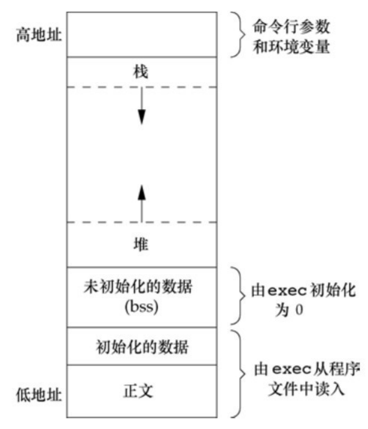

## main 函数

C 程序总是从 main 函数开始执行。main 函数的原型是：

```c
int main(int argc, char *argv[]);
```

其中，`argc` 是命令行参数的数目，`argv` 是指向参数的各个指针所构成的数组。

当内核执行 C 程序时（使用一个 `exec` 函数），在调用 `main` 前先调用一个特殊的启动例程。启动例程从内核取得命令行参数和环境变量值，然后参数传递给 `main` 函数执行。

## 进程终止

有 8 种方式使进程终止，正常终止的方式有 5 种：

1. 从 main 返回。
2. 调用 `exit` 先执行清理，再返回内核。
3. 调用 `_exit` 或 `_Exit` 立即进入内核。
4. 最后一个线程从其启动例程返回。
5. 从最后一个线程调用 `pthread_exit`。

异常终止有 3 种方式：

1. 调用 `abort` 。
2. 接到一个信号。
3. 最后一个线程对取消请求做出响应。

### 退出函数

3 个函数用于正常终止一个程序：`_exit`和`_Exit`立即进入内核，`exit`则先执行一些清理处理，然后返回内核。

```c
#include <stdlib.h>
void exit(int status);
void _Exit(int status);

#include <unistd.h>
void _exit(int status);
```

3 个退出函数都带一个整型参数，称为终止状态。大多数 UNIX 系统 `shell` 都提供检查进程终止状态的方法。

`exit` 和 `_Exit` 是 `ISO C` 标准定义的，`_exit` 是 `POSIX.1` 定义的。

如果 `main` 函数终止时没有显示使用 `return` 语句或调用 `exit` 函数，那么进程终止状态时未定义的。

例如，经典 C 程序：

```c
#include <stdio.h>
main(){
    printf("Hello, world\n");
}
```

对该程序进行编译运行，可以查看其终止码。

```bash
$ gcc -std=c89 01exit.c
$ ./a.out
Hello, world
$ echo $?
13

$ gcc -std=c99 01exit.c
01exit.c:2:1: warning: return type defaults to ‘int’ [-Wimplicit-int]
    2 | main(){
      | ^~~~
$ ./a.out
Hello, world
$ echo $?
0
```

分别使用 c89 和 c99 标准编译运行程序，可以发现 c99 标准编译时会产出 `warning: return type defaults to ‘int’` 警告。

### 函数 atexit

按照 `ISO C` 的规定，一个进程可以登记至多 32 个函数，这些函数将由 `exit` 自动调用。我们称这些函数为终止处理程序，并调用 `atexit` 函数来登记这些函数。

```c
#include <stdlib.h>
int atexit(void (*func)(void));
```

返回值：

- 返回值为 0 则成功，
- 返回值为非 0 则出错。

`atexit` 的参数是一个无参无返回值的函数地址。

`exit` 调用这些函数的顺序与它们登记时候的顺序相反。同一个函数如果登记多次，也会被调用多次。

可以使用 `sysconf` 函数查看系统支持终止处理程序的最大个数。

下图显示了一个 C 程序是如何启动的，以及它终止的各种方式。


注意，内核使程序执行的唯一方法是调用一个 `exec` 函数。进程自愿终止的唯一方法是显式或隐式地（通过调用 `exit`）调用 `_exit` 或 `_Exit`。

例子，终止处理程序实例：

```c
#include <stdlib.h>
#include <stdio.h>

static void my_exit1(void);
static void my_exit2(void);

static int count = 0;

int main(){
	if(atexit(my_exit1) != 0)
		perror("can't register my_exit1");
	if(atexit(my_exit2) != 0)
		perror("can't register my_exit2");
	if(atexit(my_exit2) != 0)
		perror("can't register my_exit2");
	printf("main done.\n");
	return 0;
}

static void my_exit1(){
	count++;
	printf("first exit hander. count = %d\n", count);
}
static void my_exit2(){
	count++;
	printf("second exit hander. count = %d\n", count);
}
```

编译执行：

```bash
$ gcc 02atexit.c
$ ./a.out
main done.
second exit hander. count = 1
second exit hander. count = 2
first exit hander. count = 3
```

### 命令行参数

内核想要执行一个程序，只有通过 `exec` 函数族，而且当启动一个新进程的时候，调用 `exec` 的进程可将命令行参数传递给新进程，即传递给 `main` 函数。

例子：

```c
#include <stdio.h>

int main(int argc, char *argv[]){
	int i;
	for(i = 0; i < argc; i++)
		printf("argv[%d]: %s\n", i, argv[i]);
	return 0;
}
```

编译运行：

```bash
$ gcc 03echo_args.c
$ ./a.out 1 2 3
argv[0]: ./a.out
argv[1]: 1
argv[2]: 2
argv[3]: 3
```

### 环境表

每个程序都接收到一张环境表。与参数表一样，环境表也是一个字符指针数组，其中每个指针包含一个以 `null` 结束的字符串的地址。全局变量 `environ` 则包含了该指针数组的地址。

```c
extern char **environ;
```

例子：

```c
#include <stdio.h>

extern char **environ;

int main(int argc, char const *argv[]){
    int i = 0;
    while(environ[i]){
        printf("environ[%d]: %s\n", i, environ[i]);
        i++;
    }
    return 0;
}
```

编译运行

```bash
$ gcc 04environ.c
$ ./a.out
environ[0]: MAIL=/var/mail/ckcat
environ[1]: USER=ckcat
environ[2]: SSH_CLIENT=192.168.40.1 61412 22
environ[3]: SHLVL=2
environ[4]: OLDPWD=/home/ckcat/study/code/apue
environ[5]: HOME=/home/ckcat
environ[6]: DBUS_SESSION_BUS_ADDRESS=unix:path=/run/user/1000/bus
...
```

`environ` 为环境指针，指针数组为环境表，其中各指针指向的字符串为环境字符串，其格式为：

```
name=value
```

### C 程序的存储空间布局

C 程序一直有下列几部分组成：

- 正文段：这是由 CPU 执行的机器指令部分。通常该段时可共享和只读的。
- 初始化数据段：包含了程序种需明确地赋初值的变量。
- 未初始化数据段：通常称为 `bss` 段，该段的数据初始化为 0 或空指针。
- 栈：自动变量以及每次函数调用时所需保存的信息都存放再此段。栈从高地址向低地址方向增长。
- 堆：通常在堆种进行动态存储分配。位于未初始化数据段和栈之间。



可以发现未初始化段内容并不存放在磁盘文件中，需要存放在磁盘程序文件种的段只有正文段和初始化数据段。

`size(1)` 命令可以查看正文段、数据段和 `bss` 段的长度（单位为字节）。

```bash
$ size /usr/bin/cc /bin/sh
   text    data     bss     dec     hex filename
1025621   15120   10600 1051341  100acd /usr/bin/cc
 110609    4816   11312  126737   1ef11 /bin/sh
```

### 共享库

共享库使得可执行文件中不再需要包含公用的库函数，而只需在所有进程都可引用的存储区中保存这种库例程的一个副本。

动态库的优点：

1. 减小了可执行文件的大小。
2. 可以直接使用新版本的动态库替换旧版本。

动态库的缺点：

1. 程序每次运行时，增加了程序运行时间开销。
2. 不同版本的系统动态库可能不兼容，导致程序运行失败。

### 存储空间分配

`ISO C` 定义了 3 个用于存储空间动态分配的函数以及 1 个释放存储空间的函数。

```c
#include <stdlib.h>
void *malloc(size_t size);
void *calloc(size_t nobj, size_t size);
void *realloc(void *ptr, size_t newsize);
void free(void *ptr);
```

- `malloc`：分配指定字节数的存储区，未初始化。
- `calloc`：为指定数量指定长度的对象分配存储空间，并初始化为 0。
- `realloc`：增加或减少以前分配区的长度。

3 个函数返回值：

- 若成功，返回非空指针；
- 若出错，返回 `NULL`。

**返回的指针一定是适当对齐的，使其可用于任何数据对象。**

函数 `free` 释放 `ptr` 指向的存储空间。

这些分配例程通常用 `sbrk(2)` 系统调用实现扩充或缩小进程的堆。

虽然 `sbrk` 可以扩充或缩小进程的存储空间，但是大多数 `malloc` 和 `free` 的实现都不减小进程的存储空间。释放的空间可供以后再分配，但将它们保持在 `malloc` 池中而不返回给内核。

还可以使用其他的库替换上述的存储空间分配。

### 环境变量

环境字符串的形式为：`name=value`，unix 内核并不关心这些字符串，它们的解释完全取决于各个应用程序。例如，`shell` 使用了大量的环境变量。

`ISO C` 定义了一个函数 `getenv`，可以用其取环境变量值。其他标准定义及实现了各种修改环境表的函数。

```c
#include <stdlib.h>
char *getenv(const char *name);
int putenv(char *str);
int setenv(const char *name, const char *value, int rewrite);
int unsetenv(const char *name);
int clearenv(void);
```

`getenv` 函数从环境中取一个指定环境变量的值。其返回值：

- 指向与 `name` 关联的 `value` 的指针；
- 若未找到，返回 `NULL`。

`putenv` 函数以覆盖的模式设置环境变量。其返回值：

- 若成功，返回 0；
- 若出错，返回非 0。

`setenv` 和 `unsetenv` 两个函数的作用为将 `name` 设置为 `value` 和删除 `name` 的定义。其返回值：

- 若成功，返回 0；
- 若出错，返回 −1。

`setenv` 函数允许你设置一个额外的标志 `rewrite` ，它表示是否要覆盖现有的环境变量。如果设置为非 0，则会覆盖现有值；如果设置为 0，则不会覆盖。

`clearenv` 函数用来删除环境表中的所有项。其返回值：

- 若成功，返回 0；
- 若出错，返回非 0。

需要注意的是 `setenv` 必须分配存储空间存放环境变量；而 `putenv` 可以使用栈空间的字符串，但是存在被覆盖的可能。

修改环境表时内部流程。

1. 修改一个现有的 `name`:
   1. 新 `value` 的长度小于或等于现有 `value` 的长度，直接复制覆盖。
   2. 新 `value` 的长度大于现有 `value` 的长度，先调用 `malloc` 分配空间，然后复制到新空间，接着使环境表指向新地址。
2. 新增一个新的` name`:
   1. 如果使第一次新增，则需要调用 `malloc` 为新的指针表分配空间。接着将原来环境表复制到新分配表，将新增的 `name=value` 的指针移至指针表的表尾，然后将一个空指针存放在其后，最后使 `environ` 指向新指针表。
   2. 如果不是第一次新增一个新的 `name`，只要调用 `realloc`，分配比原来空间多存放一个指针的空间，然后将指向新 `name=value` 的字符串的指针放在该表表尾，后面跟着一个空指针。

Single UNIX Specification 定义的环境变量：

| 变量          | 说明                           |
| ------------- | ------------------------------ |
| `COLUMNS`     | 终端宽度                       |
| `DATEMSK`     | `getdate(3)` 模板文件路径名    |
| `HOME`        | home 起始目录                  |
| `LANG`        | 本地名                         |
| `LC_ALL`      | 本地名                         |
| `LC_COLLATE`  | 本地排序名                     |
| `LC_CTYPE`    | 本地字符分类名                 |
| `LC_MESSAGES` | 本地消息名                     |
| `LC_MONETARY` | 本地货币编辑名                 |
| `LC_NUMERIC`  | 本地数字编辑名                 |
| `LC_TIME`     | 本地日期/时间格式名            |
| `LINES`       | 终端高度                       |
| `LOGNAME`     | 登录名                         |
| `MSGVERB`     | `fmtmsg(3)` 处理的消息组成部分 |
| `NLSPATH`     | 消息类模板序列                 |
| `PATH`        | 搜索可执行文件的路径前缀列表   |
| `PWD`         | 当前工作目录的绝对路径名       |
| `SHELL`       | 用户首选的 shell 名            |
| `TERM`        | 终端类型                       |
| `TMPDIR`      | 在其中创建临时文件的目录路径名 |
| `TZ`          | 时区信息                       |

例子：

```c
#include <stdio.h>
#include <stdlib.h>
#include <string.h>

int main(){
	const char *name = "MY_NAME";
	const char *value = "Hello, World!";

	char *env_str = malloc(strlen(name) + strlen(value) + 2);
	sprintf(env_str, "%s=%s", name, value);
	// 使用 putenv 设置环境变量
	if(putenv(env_str) != 0)
		perror("putenv error");
	// 使用 getenv 获取环境变量
	char *env =getenv(name);
	if(env != NULL)
		printf("name = %s, value = %s\n",name, env);

	// 使用 setenv 设置环境变量
	if(setenv(name, "hello, world!", 1) != 0)
		perror("setenv error");

	env =getenv(name);
	if(env != NULL)
		printf("name = %s, value = %s\n",name, env);
	return 0;
}
```

编译运行：

```bash
$ gcc 05get_set_env.c
$ ./a.out
name = MY_NAME, value = Hello, World!
name = MY_NAME, value = hello, world!
```

这里

### 函数 setjmp 和 longjmp

在 C 中，`goto` 语句是不能跨越函数的，而执行这种类型跳转功能的是函数 `setjmp` 和 `longjmp`。

```c
#include <setjmp.h>
int setjmp(jmp_buf env);
void longjmp(jmp_buf env, int val);
```

`setjmp` 返回值：

- 若直接调用，返回 0；
- 若从 `longjmp` 返回，返回值将会是 `longjmp` 函数第二个参数传递的值。

`setjmp` 参数：

- `env` 参数的类型是一个特殊类型 `jmp_buf`，它是一个数组，用于保存程序的当前执行上下文信息，包括程序计数器、堆栈指针等。通常将 `env` 变量定义为全局变量。

`longjmp` 参数：

- `env`：一个 `jmp_buf` 类型的变量，它是在 `setjmp` 中保存的执行上下文信息。
- `val`：一个整数值，用于指示跳转的原因或条件。这个值将会作为 setjmp 的返回值。

`longjmp` 函数使用第二个参数的原因是对于一个 `setjmp` 可以有多个 `longjmp`。

当 `longjmp` 返回到 `setjmp` 函数时，大多数实现并不回滚这些自动变量和寄存器变量的值，而所有标准则称它们的值是不确定的。

例子：

```c
#include <stdio.h>
#include <setjmp.h>
#include <stdlib.h>

static void f1(int, int, int, int);
static void f2(void);

static jmp_buf jmpbuff;
static int globval;

int main(){
	int autoval;
	register int regval;
	volatile int volaval;
	static int statval;
	globval = 1; autoval=2; regval=3; volaval=4; statval=5;
	if(setjmp(jmpbuff) != 0){
		printf("after longjmp:\n");
		printf("globval=%d, autoval=%d, regval=%d, volaval=%d, statval=%d\n", globval, autoval, regval, volaval, statval);
		exit(0);
	}
	// 在 longjmp 之前 setjmp 之后改变值
	globval=95; autoval=96; regval=97; volaval=98; statval=99;
	f1(autoval, regval, volaval, statval);
	return 0;
}
static void f1(int i, int j, int k, int l){
	printf("in f1():\n");
	printf("globval=%d, autoval=%d, regval=%d, volaval=%d, statval=%d\n", globval, i, j, k, l);
	f2();
}
static void f2(){
	longjmp(jmpbuff, 1);
}
```

编译运行：

```bash
$ gcc 06setjmp.c
$ ./a.out
in f1():
globval=95, autoval=96, regval=97, volaval=98, statval=99
after longjmp:
globval=95, autoval=96, regval=3, volaval=98, statval=99

$ gcc -O2 06setjmp.c # O2 优化选项进行编译
$ ./a.out
in f1():
globval=95, autoval=96, regval=97, volaval=98, statval=99
after longjmp:
globval=95, autoval=2, regval=3, volaval=98, statval=99

```

使用不带优化和带优化选项进行编译运行，得到的结果是不同的。全局变量、静态变量和易失变量不受优化的影响。

### 函数 `getrlimit` 和 `setrlimit`

每个进程都有一组资源限制，其中一些可以用 `getrlimit` 和 `setrlimit` 函数查询和更改。

```c
#include <sys/resource.h>
int getrlimit(int resource, struct rlimit *rlptr);
int setrlimit(int resource, const struct rlimit *rlptr);
```

两个函数返回值：

- 若成功，返回 0；
- 若出错，返回非 0。

其中 `struct rlimit` 结构：

```c
struct rlimit {
    rlim_t rlim_cur; /* soft limit: current limit */
    rlim_t rlim_max; /* hard limit: maximum value for rlim_cur */
};
```

在更改资源限制时，须遵循下列 3 条规则。

1. 任何一个进程都可将一个软限制值更改为小于或等于其硬限制值。
2. 任何一个进程都可降低其硬限制值，但它必须大于或等于其软限制值。这种降低，对普通用户而言是不可逆的。
3. 只有超级用户进程可以提高硬限制值。

这两个函数的 `resource` 参数取下列值之一。

- `RLIMIT_AS` 进程总的可用存储空间的最大长度（字节）。这影响到 `sbrk` 函数和 `mmap` 函数。
- `RLIMIT_CORE` core 文件的最大字节数，若其值为 0 则阻止创建 core 文件。
- `RLIMIT_CPU` CPU 时间的最大量值（秒），当超过此软限制时，向该进程发送 `SIGXCPU` 信号。
- `RLIMIT_DATA` 数据段的最大字节长度。这是初始化数据、非初始以及堆的总和。
- `RLIMIT_FSIZE` 可以创建的文件的最大字节长度。当超过此软限制时，则向该进程发送 `SIGXFSZ` 信号。
- `RLIMIT_MEMLOCK` 一个进程使用 `mlock(2)` 能够锁定在存储空间中的最大字节长度。
- `RLIMIT_MSGQUEUE` 进程为 POSIX 消息队列可分配的最大存储字节数。
- `RLIMIT_NICE` 为了影响进程的调度优先级，nice 值可设置的最大限制。
- `RLIMIT_NOFILE` 每个进程能打开的最多文件数。更改此限制将影响到 `sysconf` 函数在参数 `_SC_OPEN_MAX` 中返回的值。
- `RLIMIT_NPROC` 每个实际用户 ID 可拥有的最大子进程数。更改此限制将影响到 `sysconf` 函数在参数 `_SC_CHILD_MAX` 中返回的值。
- `RLIMIT_NPTS` 用户可同时打开的伪终端的最大数量。
- `RLIMIT_RSS` 最大驻内存集字节长度（resident set size in bytes，RSS）。如果可用的物理存储器非常少，则内核将从进程处取回超过 RSS 的部分。
- `RLIMIT_SBSIZE` 在任一给定时刻，一个用户可以占用的套接字缓冲区的最大长度（字节）。
- `RLIMIT_SIGPENDING` 一个进程可排队的信号最大数量。这个限制是 `sigqueue` 函数实施的。
- `RLIMIT_STACK` 栈的最大字节长度。
- `RLIMIT_SWAP` 用户可消耗的交换空间的最大字节数
- `RLIMIT_VMEM` 这是 `RLIMIT_AS` 的同义词。

**资源限制影响到调用进程并由其子进程继承。**

例子，打印由系统支持的所有资源当前的软限制和硬限制。

```c
#include <stdio.h>
#include <stdlib.h>
#include <sys/resource.h>

#define doit(name) pr_limits(#name, name)

static void pr_limits(char*, int);

int main(int argc, char const *argv[]){
#ifdef RLIMIT_AS
    doit(RLIMIT_AS);
#endif

    doit(RLIMIT_CORE);
    doit(RLIMIT_CPU);
    doit(RLIMIT_DATA);
    doit(RLIMIT_FSIZE);

#ifdef RLIMIT_MEMLOCK
    doit(RLIMIT_MEMLOCK);
#endif

#ifdef RLIMIT_MSGQUEUE
    doit(RLIMIT_MSGQUEUE);
#endif

#ifdef RLIMIT_NICE
    doit(RLIMIT_NICE);
#endif

    doit(RLIMIT_NOFILE);

#ifdef RLIMIT_NPROC
    doit(RLIMIT_NPROC);
#endif

#ifdef RLIMIT_NPTS
    doit(RLIMIT_NPTS);
#endif

#ifdef RLIMIT_RSS
    doit(RLIMIT_RSS);
#endif

#ifdef RLIMIT_SBSIZE
    doit(RLIMIT_SBSIZE);
#endif

#ifdef RLIMIT_SIGPENDING
    doit(RLIMIT_SIGPENDING);
#endif

    doit(RLIMIT_STACK);

#ifdef RLIMIT_SWAP
    doit(RLIMIT_SWAP);
#endif

#ifdef RLIMIT_VIEW
    doit(RLIMIT_VIEW);
#endif
    return 0;
}

static void pr_limits(char* name, int resource){
    struct rlimit limit;
    unsigned long long lim;
    if(getrlimit(resource, &limit) < 0)
        perror("getrlimit errors");
    printf("%-14s ", name);
    if(limit.rlim_cur == RLIM_INFINITY){
        printf("(infinite) ");
    }else{
        lim = limit.rlim_cur;
        printf("%10lld ", lim);
    }
    if (limit.rlim_max == RLIM_INFINITY){
        printf("(infinite) ");
    }else{
        lim = limit.rlim_cur;
        printf("%10lld ", lim);
    }
    putchar((int)'\n');
}
```

编译运行：

```bash
$ gcc 07rlimit.c 
$ ./a.out 
RLIMIT_AS      (infinite) (infinite) 
RLIMIT_CORE             0 (infinite) 
RLIMIT_CPU     (infinite) (infinite) 
RLIMIT_DATA    (infinite) (infinite) 
RLIMIT_FSIZE   (infinite) (infinite) 
RLIMIT_MEMLOCK   67108864   67108864 
RLIMIT_MSGQUEUE     819200     819200 
RLIMIT_NICE             0          0 
RLIMIT_NOFILE        1024       1024 
RLIMIT_NPROC        31275      31275 
RLIMIT_RSS     (infinite) (infinite) 
RLIMIT_SIGPENDING      31275      31275 
RLIMIT_STACK      8388608 (infinite) 
```
