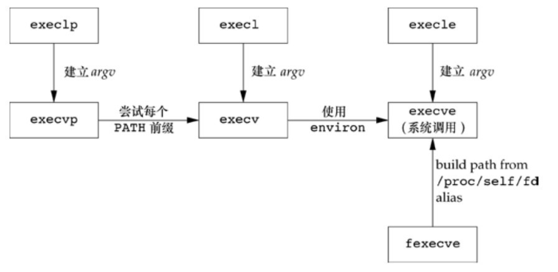

## 进程标识

每个进程都有一个非负整型表示的唯一进程 ID。因为进程 ID 标识符总是唯一的，常将其用作其他标识符的一部分以保证其唯一性。

ID 为 0 的进程通常是调度进程，常常被称为交换进程（swapper）。该进程是内核的一部分，它并不执行任何磁盘上的程序，因此也被称为系统进程。

ID 为 1 的进程通常是 `init` 进程，在自举过程结束时由内核调用。该进程的程序文件在 UNIX 的早期版本中是 `/etc/init`，在较新版本中是 `/sbin/init`。`init` 进程不会终止。

除了进程 ID，每个进程还有一些其他标识符。下列函数返回这些标识符。

```c
#include <unistd.h>
pid_t getpid(void);
pid_t getppid(void);
uid_t getuid(void);
uid_t geteuid(void);
gid_t getgid(void);
gid_t getegid(void);
```

- `getpid` 返回值：调用进程的进程 ID。
- `getppid` 返回值：调用进程的父进程 ID。
- `getuid` 返回值：调用进程的实际用户 ID。
- `geteuid` 返回值：调用进程的有效用户 ID。
- `getgid` 返回值：调用进程的实际组 ID。
- `getegid` 返回值：调用进程的有效组 ID。

这些函数都没有出错返回。

例子：

```c
#include <stdio.h>
#include <unistd.h>
#include <sys/types.h>

int main(int argc, char const *argv[]){
	printf("pid = %d\n", getpid());
	printf("ppid = %d\n", getppid());
	printf("uid = %d\n", getuid());
	printf("euid = %d\n", geteuid());
	printf("gid = %d\n", getgid());
	printf("egid = %d\n", getegid());
    return 0;
}
```

编译运行：

```bash
$ gcc 01uid.c
$ ./a.out
pid = 33561
ppid = 33330
uid = 1000
euid = 1000
gid = 1000
egid = 1000
```

## `fork` 函数

一个现有的进程可以调用 `fork` 函数创建一个新进程。

```c
#include <unistd.h>
pid_t fork(void);
```

返回值：

- 子进程返回 0，父进程返回子进程 ID；
- 若出错，返回 −1 。

由 `fork` 创建的新进程被称为子进程（childprocess）。`fork` 函数被调用一次，但返回两次。两次返回的区别是子进程的返回值是 0，而父进程的返回值则是新建子进程的进程 ID。

子进程是父进程的副本（写时复制）。父进程和子进程共享正文段(指令)，不共享其他段。

例子：

```c
#include <stdio.h>
#include <unistd.h>

// 初始化段
int globvar = 6;
char buf[] = "a write to stdout.\n";

int main(){
	int var;
	pid_t pid;
	var = 88;
	if(write(STDOUT_FILENO, buf, sizeof(buf)-1) != (sizeof(buf)-1)){
		perror("write error");
		return 0;
	}
	printf("before fork.\n");
	if((pid = fork()) < 0){ // 子进程
		perror("fork error");
		return 0;
	}else if(pid == 0){
		globvar++;
		var++;
	}else{// 父进程
		printf("child process id = %d.\n", pid);
		sleep(1);
	}
	printf("pid = %ld, globvar = %d, var = %d.\n", (long)getpid(), globvar, var);
	return 0;
}
```

编译运行：

```bash
$ gcc 02fork.c
$ ./a.out
a write to stdout.
before fork.
child process id = 34043.
pid = 34043, globvar = 7, var = 89.    # 子进程输出
pid = 34042, globvar = 6, var = 88.    # 父进程输出

$ ./a.out >temp.out
$ cat temp.out
a write to stdout.    # write 函数是不带缓冲的。
before fork.          # 标准 I/O 库是带缓冲的。
pid = 34102, globvar = 7, var = 89.
before fork.
child process id = 34102.
pid = 34100, globvar = 6, var = 88.
```

在 `fork` 之后是父进程先执行还是子进程先执行是不确定的，这取决于内核所使用的调度算法。如果要求父进程和子进程之间相互同步，则要求某种形式的进程间通信。

如果标准输出连到终端设备，则它是行缓冲的；否则它是全缓冲的。当以交互方式运行该程序时，只得到该 `printf` 输出的行一次，其原因是标准输出缓冲区由换行符冲洗。但是当将标准输出重定向到一个文件时，却得到 `printf` 输出行两次。其原因是，在 `fork` 之前调用了 `printf` 一次，但当调用 `fork` 时，该行数据仍在缓冲区中，然后在将父进程数据空间复制到子进程中时，该缓冲区数据也被复制到子进程中，此时父进程和子进程各自有了带该行内容的缓冲区。当每个进程终止时，其缓冲区中的内容都被写到相应文件中。

### 文件共享

在重定向父进程的标准输出时，子进程的标准输出也被重定向。实际上，`fork` 的一个特性是父进程的所有打开文件描述符都被复制到子进程中。 **重要的一点是，父进程和子进程共享同一个文件偏移量。** 在这个例子中，当父进程等待子进程时，子进程写到标准输出；而在子进程终止后，父进程也写到标准输出上，并且知道其输出会追加在子进程所写数据之后。


在 `fork` 之后处理文件描述符有以下两种常见的情况。

1. 父进程等待子进程完成。在这种情况下，父进程无需对其描述符做任何处理。当子进程终止后，它曾进行过读、写操作的任一共享描述符的文件偏移量已做了相应更新。
2. 父进程和子进程各自执行不同的程序段。在这种情况下，在 `fork` 之后，父进程和子进程各自关闭它们不需使用的文件描述符，这样就不会干扰对方使用的文件描述符。这种方法是网络服务进程经常使用的。

除了打开文件之外，父进程的很多其他属性也由子进程继承，包括：

- 实际用户 ID、实际组 ID、有效用户 ID、有效组 ID
- 附属组 ID
- 进程组 ID
- 会话 ID
- 控制终端
- 设置用户 ID 标志和设置组 ID 标志
- 当前工作目录
- 根目录
- 文件模式创建屏蔽字
- 信号屏蔽和安排
- 对任一打开文件描述符的执行时关闭（close-on-exec）标志
- 环境
- 连接的共享存储段
- 存储映像
- 资源限制

父进程和子进程之间的区别具体如下。

- `fork` 的返回值不同。
- 进程 ID 不同。
- 这两个进程的父进程 ID 不同：子进程的父进程 ID 是创建它的进程的 ID，而父进程的父进程 ID 则不变。
- 子进程的 `tms_utime`、`tms_stime`、`tms_cutime` 和 `tms_ustime` 的值设置为 0。
- 子进程不继承父进程设置的文件锁。
- 子进程的未处理闹钟被清除。
- 子进程的未处理信号集设置为空集。

使 `fork` 失败的两个主要原因是：

- 系统中已经有了太多的进程。
- 该实际用户 ID 的进程总数超过了系统限制。

`fork` 有以下两种用法。

1. 一个父进程希望复制自己，使父进程和子进程同时执行不同的代码段。这在网络服务进程中是常见的，父进程等待客户端的服务请求。当这种请求到达时，父进程调用 `fork`，使子进程处理此请求。父进程则继续等待下一个服务请求。
1. 一个进程要执行一个不同的程序。这对 `shell` 是常见的情况。在这种情况下，子进程从 `fork` 返回后立即调用 `exec`。

某些操作系统将第 2 种用法中的两个操作（`fork` 之后执行 `exec`）组合成一个操作，称为 `spawn`。

## vfork 函数

`vfork` 函数的调用序列和返回值与 `fork` 相同，但两者的语义不同。可移植的应用程序不应该使用这个函数。

`vfork` 函数用于创建一个新进程，而该新进程的目的是 `exec` 一个新程序。

`vfork` 和 `fork` 之间的区别：

- `vfork` 与 `fork` 一样都创建一个子进程，但是它并不将父进程的地址空间完全复制到子进程中，因为子进程会立即调用 `exec` 或 `exit`，于是也就不会引用该地址空间。
- `vfork` 保证子进程先运行，在它调用 `exec` 或 `exit` 之后父进程才可能被调度运行，当子进程调用这两个函数中的任意一个时，父进程会恢复运行。

例子：

```c
#include "../apue.h"

// 初始化段
int globvar = 6;

int main(int argc, char const *argv[]){
    int var;
    pid_t pid;
    var = 88;
    printf("before vfork\n");

    if((pid = vfork()) < 0){
        err_sys("fork error.");
    }else if(pid == 0){// 子进程
        globvar++;
        var++;
        _exit(0);// 子进程退出。
    }else{//父进程
        printf("child process id = %d\n", pid);
    }
    printf("pid = %ld, glob = %d, var = %d\n", (long)getpid(), globvar, var);
    return 0;
}
```

编译运行：

```bash
$ gcc 03vfork.c
$ ./a.out
before vfork.
child process id = 34786
pid = 34785, globvar = 7, var = 89
```

子进程对变量做增 1 的操作，结果改变了父进程中的变量值。因为子进程在父进程的地址空间中运行。

调用了 `_exit` 而不是 `exit`，是因为 `_exit` 并不执行标准 `I/O` 缓冲区的冲洗操作。

## exit 函数

不管进程如何终止，最后都会执行内核中的同一段代码。这段代码为相应进程关闭所有打开描述符，释放它所使用的存储器等。

在任意一种终止情况下，该终止进程的父进程都能用 `wait` 或 `waitpid` 函数取得其终止状态。

对于父进程已经终止的所有进程，它们的父进程都改变为 `init` 进程。

内核为每个终止子进程保存了一定量的信息，所以当终止进程的父进程调用 `wait` 或 `waitpid` 时，可以得到这些信息。这些信息至少包括进程 ID、该进程的终止状态以及该进程使用的 CPU 时间总量。

在 UNIX 术语中，一个已经终止、但是其父进程尚未对其进行善后处理（获取终止子进程的有关信息、释放它仍占用的资源）的进程被称为僵死进程（zombie）。

一个由 `init` 进程收养的进程终止时， `init` 就会调用一个 `wait` 函数取得其终止状态。

## 函数 wait 和 waitpid

当一个进程正常或异常终止时，内核就向其父进程发送 `SIGCHLD` 信号。因为子进程终止是个异步事件，所以这种信号也是内核向父进程发的异步通知。

调用 `wait` 或 `waitpid` 的进程可能会发生什么。

- 如果其所有子进程都还在运行，则阻塞。
- 如果一个子进程已终止，正等待父进程获取其终止状态，则取得该子进程的终止状态立即返回。
- 如果它没有任何子进程，则立即出错返回 。

如果进程由于接收到 `SIGCHLD` 信号而调用 `wait`，我们期望 `wait` 会立即返回。但是如果在随机时间点调用 `wait`，则进程可能会阻塞。

```c
#include <sys/wait.h>
pid_t wait(int *statloc);
pid_t waitpid(pid_t pid, int *statloc, int options);
```

两个函数返回值：

- 若成功，返回进程 ID；
- 若出错，返回 0 或 −1。

参数：

- `pid`：要等待的子进程的进程 ID。可以指定不同的值：

  - 如果 `pid` 大于 0，表示等待指定 PID 的子进程结束。
  - 如果 `pid` 等于 0，表示等待与当前进程在同一进程组中的任何子进程。
  - 如果 `pid` 等于-1，表示等待任何子进程，类似于 `wait` 函数。
  - 如果 `pid` 小于-1，表示等待进程组 ID 等于 `pid` 绝对值的任何子进程。

- `statloc`：一个指向整数的指针，用于存储子进程的退出状态信息。如果不关心子进程的退出状态，可以传递 `NULL`。

- `options`：一个整数，用于指定等待子进程的选项，可以使用多个选项通过按位或（`|`）操作组合：
  - `WNOHANG`：非阻塞等待，如果没有子进程退出，立即返回，不阻塞。
  - `WUNTRACED`：也等待被停止的子进程的状态变化。
  - `WCONTINUED`：等待已继续执行的子进程的状态变化。
  - `WSTOPPED`：等待已停止的子进程的状态变化。
  - `WEXITED`：等待已退出的子进程的状态变化。
  - `WNOWAIT`：不清除子进程的退出状态，允许稍后再次等待。

这两个函数的区别如下。

- 在一个子进程终止前，`wait` 使其调用者阻塞，而 `waitpid` 有一选项，可使调用者不阻塞。
- `waitpid` 并不等待在其调用之后的第一个终止子进程，它有若干个选项，可以控制它所等待的进程。

如果子进程已经终止，并且是一个僵死进程，则 `wait` 立即返回并取得该子进程的状态；否则 `wait` 使其调用者阻塞，直到一个子进程终止。如调用者阻塞而且它有多个子进程，则在其某一子进程终止时，`wait` 就立即返回。

有 4 个互斥的宏可用来取得进程终止的原因，它们的名字都以 `WIF` 开始。

- `WIFEXITED(status)` 若为正常终止子进程返回的状态，则为真。
- `WIFSIGNALED(status)` 若为异常终止子进程返回的状态，则为真。
- `WIFSTOPPED(status)` 若为当前暂停子进程的返回状态，则为真。
- `WIFCONTINUED(status)` 若在作业控制暂停后已经继续的子进程返回了状态，则为真。

例子：

```c
#include <stdio.h>
#include <sys/wait.h>
#include <stdlib.h>
#include <unistd.h>

void pr_exit(int status);

int main(){
	pid_t pid;
	int status;
	if((pid = fork()) < 0){
		perror("fork error");
		return 1;
	}else if(pid == 0)
		exit(7); // 子进程正常终止
	if(wait(&status) != pid){
		perror("wait error");
		return 1;
	}
	pr_exit(status);

	if((pid = fork()) < 0){
		perror("fork error");
		return 1;
	}else if(pid == 0)
		abort(); // 子进程异常终止
	if(wait(&status) != pid){
		perror("wait error");
		return 1;
	}
	pr_exit(status);


	if((pid = fork()) < 0){
		perror("fork error");
		return 1;
	}else if(pid == 0)
		status /= 0; // 子进程除零异常终止
	if(wait(&status) != pid){
		perror("wait error");
		return 1;
	}
	pr_exit(status);
	return 0;
}
void pr_exit(int status){
	if(WIFEXITED(status)) // 若为正常终止子进程返回的状态，则为真。
        // WEXITSTATUS(status) 获取子进程传送给 exit 参数的低8位。
		printf("normal termination, exit status = %d\n", WEXITSTATUS(status)); //
	else if(WIFSIGNALED(status)) //若为异常终止子进程返回的状态，则为真。
		// WTERMSIG(status) 获取子进程终止的信号编号，
        // WCOREDUMP(status) 若已产生终止进程的 core文件，则返回真。
		printf("abnormal termination, signal number = %d%s\n", WTERMSIG(status),
#ifdef WCOREDUMP
	WCOREDUMP(status) ? " (core file generated)": "");
#else
	"");
#endif
	else if(WIFSTOPPED(status)) // 若当前暂停进程的返回的状态，则为真。
		// WSTOPSIG(status) 获取子进程暂停的信号编号。
		printf("child stopped, signal number = %d\n", WSTOPSIG(status));
}
```

编译运行：

```bash
$ gcc 04wait.c
04wait.c: In function ‘main’:
04wait.c:38:10: warning: division by zero [-Wdiv-by-zero]
   38 |   status /= 0; // 子进程除零异常终止
      |          ^~
$ ./a.out
normal termination, exit status = 7
abnormal termination, signal number = 6 (core file generated)
abnormal termination, signal number = 8 (core file generated)
```

可以查看 `<signal.h>` 头文件验证 `SIGABRT` 的值为 6，`SIGFPE` 的值为 8。

`waitpid` 函数提供了 `wait` 函数没有提供的 3 个功能。

1. `waitpid` 可等待一个特定的进程，而 `wait` 则返回任一终止子进程的状态。在讨论 `popen` 函数时会再说明这一功能。
2. `waitpid` 提供了一个 `wait` 的非阻塞版本。有时希望获取一个子进程的状态，但不想阻塞。
3. `waitpid` 通过 `WUNTRACED` 和 `WCONTINUED` 选项支持作业控制。

例子：

```c
#include <stdio.h>
#include <stdlib.h>
#include <sys/wait.h>
#include <unistd.h>

int main(){
	pid_t pid;
	if((pid = fork()) < 0){
		perror("fork error");
		return 1;
	}else if(pid == 0){
		if((pid = fork()) < 0){
			perror("fork error");
			return 1;
		}else if(pid > 0){
			printf("first child pid = %ld\n", (long)getpid());
			exit(0); // 退出第一个子进程
		}

		printf("second child pid = %ld\n", (long)getpid());
		// 等待地一个子进程退出，然后第二个子进程的父进程为 init 进程
		sleep(2);
		printf("second child parent pid = %ld\n", (long)getppid());
		printf("second child pid = %ld\n", (long)getpid());
		exit(0);
	}
	// 等待地一个子进程退出
	printf("child pid = %ld, parent pid = %ld\n", (long)pid, (long)getpid());
	if(waitpid(pid, NULL, 0) != pid){
		perror("waitpid error");
		return 1;
	}
	printf("first child finish.\n");
	exit(0);
}
```

编译运行：

```bash
$ gcc 05waitpid.c
$ ./a.out
child pid = 38944, parent pid = 38943
first child pid = 38944
second child pid = 38945
first child finish.
$ second child parent pid = 3168
second child pid = 38945

$ ps aux |grep 3168
ckcat       3168  0.0  0.1  20880 11496 ?        Ss   Sep05   0:05 /lib/systemd/systemd --user
```

第二个子进程调用 `sleep` 以保证在打印父进程 ID 时第一个子进程已终止。最终第二个子进程变成孤儿进程，`systemd` 成为其父进程。

> 不同的操作系统可能具有不同的 `init` 进程，如 `init`、`systemd`、`upstart` 等，但它们的作用和功能类似，都是管理孤儿进程和僵尸进程的系统守护进程。

## 函数 waitid

Single UNIX Specification 包括了另一个取得进程终止状态的函数 `waitid`，此函数类似于 `waitpid`，但提供了更多的灵活性。

```c
#include <sys/wait.h>
int waitid(idtype_t idtype, id_t id, siginfo_t *infop, int options);
```

返回值：

- 若成功，返回 0；
- 若出错，返回 −1。

参数：

- `idtype`：一个枚举类型，表示要等待的子进程的标识类型。可以选择以下值之一：
  - `P_PID`：使用 `id` 参数指定一个具体的子进程 PID，等待该子进程的状态变化。
  - `P_PGID`：使用 `id` 参数指定一个进程组 ID（PGID），等待该进程组中的任何一个子进程的状态变化。
  - `P_ALL`：等待任何子进程的状态变化，则 `id` 不需要指定，可以为 0，等效于 `wait` 函数。
- `id`：与 `idtype` 关联的标识符。具体取决于 `idtype` 的值。
- `infop`：一个指向 `siginfo_t` 结构体的指针，用于存储子进程的状态信息。`siginfo_t` 结构体包含了造成子进程状态改变有关信号的详细信息。
- `options`：一个整数，用于指定等待子进程的选项，可以使用多个选项通过按位或（`|`）操作组合。常用选项包括：
  - `WEXITED`：等待已退出的子进程。
  - `WSTOPPED`：等待已停止的子进程。
  - `WCONTINUED`：等待已继续执行的子进程。
  - `WNOHANG`：非阻塞等待，如果没有子进程状态变化，立即返回。

`WCONTINUED`、`WEXITED` 或 `WSTOPPED` 这 3 个常量之一必须在 `options` 参数中指定。

与 `waitpid` 相似，`waitid` 允许一个进程指定要等待的子进程。但它使用两个单独的参数表示要等待的子进程所属的类型，而不是将此与进程 ID 或进程组 ID 组合成一个参数。

## 函数 wait3 和 wait4

大多数 UNIX 系统实现提供了另外两个函数 `wait3` 和 `wait4`。这两个函数是从 UNIX 系统的 BSD 分支延袭下来的。它们提供的功能比 `POSIX.1` 函数 `wait`、`waitpid` 和 `waitid` 所提供功能的要多一个，这与附加参数有关。该参数允许内核返回由终止进程及其所有子进程使用的资源概况。

```c
#include <sys/types.h>
#include <sys/wait.h>
#include <sys/time.h>
#include <sys/resource.h>
pid_t wait3(int *statloc, int options, struct rusage *rusage);
pid_t wait4(pid_t pid, int *statloc, int options, struct rusage *rusage);
```

返回值：

- 若成功，返回进程 ID；
- 若出错，返回 −1。

参数：

- `rusage`: 一个指向 `struct rusage` 结构体的指针，用于获取子进程的资源使用情况信息，如 CPU 时间、内存使用、缺页次数、接收到信号的次数等。如果不关心资源使用情况，可以传递 `NULL`。

## 竞争条件

当多个进程都企图对共享数据进行某种处理，而最后的结果又取决于进程运行的顺序时，我们认为发生了竞争条件（race condition）。如果在 `fork` 之后的某种逻辑显式或隐式地依赖于在 `fork` 之后是父进程先运行还是子进程先运行，那么 `fork` 函数就会是竞争条件活跃的滋生地。

如果一个进程希望等待一个子进程终止，则它必须调用 `wait` 函数中的一个。如果一个进程要等待其父进程终止，则可使用下列形式的循环：

```c
while(getppid() != 1)
    sleep(1);
```

这种形式的循环称为轮询（polling），它的问题是浪费了 CPU 时间，因为调用者每隔 1s 都被唤醒，然后进行条件测试。

为了避免竞争条件和轮询，在多个进程之间需要有某种形式的信号发送和接收的方法。各种形式的进程间通信（IPC）也可使用。

例子， 带有竞争条件的程序。

```c
#include <stdio.h>
#include <stdlib.h>
#include <unistd.h>

static void charatatime(char *);

int main(){
	pid_t pid;
	if((pid = fork()) < 0){
		perror("fork error");
		return 1;
	}else if(pid == 0)
		charatatime("output from child\n");
	else
		charatatime("output from parent\n");
	return 0;
}
static void charatatime(char *str){
	char *ptr;
	int c;
	setbuf(stdout, NULL); // 设置为不带缓冲
	for(ptr = str; (c = *ptr++) != 0;)
		putc(c, stdout);
}
```

编译运行：

```bash
$ gcc 06race.c
$ ./a.out
output from parent
output from child

$ ./a.out
ououtput tpfrout m child
from parent

$ ./a.out
output from parent
output %                                                                       from child

```

因为输出依赖于内核使这两个进程运行的顺序及每个进程运行的时间长度，所以该程序包含了一个竞争条件。实际输出说明该程序的运行结果是会改变的。

例子，修改上面程序以避免竞争条件：

```c
// 07norace.c
#include <stdio.h>
#include <stdlib.h>
#include <unistd.h>
#include "07sig.h"

static void charatatime(char *);

int main(){
	pid_t pid;
	TELL_WAIT();
	if((pid = fork()) < 0){
		perror("fork error");
		return 1;
	}else if(pid == 0){
		WAIT_PARENT();
		charatatime("output from child\n");
	}else{
		charatatime("output from parent\n");
		TELL_CHILD(pid);
	}
	return 0;
}
static void charatatime(char *str){
	char *ptr;
	int c;
	setbuf(stdout, NULL);
	for(ptr = str; (c = *ptr++) != 0;)
		putc(c, stdout);
}
```

编译运行：

```bash
$ gcc 07norace.c 07sig.c
$ ./a.out
output from parent
output from child
```

## 函数 exec

当进程调用一种 `exec` 函数时，该进程执行的程序完全替换为新程序，而新程序则从其 `main` 函数开始执行。因为调用 `exec` 并不创建新进程，所以前后的进程 ID 并未改变。`exec` 只是用磁盘上的一个新程序替换了当前进程的正文段、数据段、堆段和栈段。

有 7 种不同的 `exec` 函数可供使用，它们常常被统称为 `exec` 函数，我们可以使用这 7 个函数中的任一个。这些 `exec` 函数使得 UNIX 系统进程控制原语更加完善。用 `fork` 可以创建新进程，用 `exec` 可以初始执行新的程序。`exit` 函数和 `wait` 函数处理终止和等待终止。这些是我们需要的基本的进程控制原语。

```c
#include <unistd.h>
int execl(const char *pathname, const char *arg0, ... /*(char *)0 */ );
int execv(const char *pathname, char *const argv[]);
int execle(const char *pathname, const char *arg0, .../* (char *)0, char *const envp[] */ );
int execve(const char *pathname, char *const argv[], char *const envp[]);
int execlp(const char *filename, const char *arg0, ... /*(char *)0 */ );
int execvp(const char *filename, char *const argv[]);
int fexecve(int fd, char *const argv[], char *const envp[]);
```

返回值：

- 若出错，返回 −1；
- 若成功，不返回。

参数：

- `pathname`：是一个指向新程序的可执行文件的路径的字符串。
- `arg0`：是新程序的名称，通常是第一个参数。该参数将作为 `argv[0]` 传递给新程序。这是一个字符串。
- `...`：是一系列字符串参数，用于指定新程序的命令行参数，以 `NULL` 结尾。每个参数将成为新程序的 `argv[1]`、`argv[2]` 等。
- `argv`：是一个字符串指针数组，表示新程序的命令行参数。数组的第一个元素 `argv[0]` 通常是新程序的名称，后续元素是新程序的其他命令行参数，数组以指向 `NULL` 的指针结尾。
- `envp`：是一个字符串指针数组，表示新程序的环境变量。每个元素都是一个字符串，形式为 "name=value"，并且数组以指向 `NULL` 的指针结尾。
- `filename`：是一个指向新程序的名称的字符串，不包括路径。
- `fd`：是一个已打开的文件描述符，它关联了待执行程序的可执行文件。这个文件描述符通常是使用 `open` 函数打开可执行文件得到的。

例子：

```c
char *args[] = {"ls", "-l", NULL};
char *envp[] = {"PATH=/bin", "HOME=/home/user", NULL};
int fd = open("/bin/ls", O_RDONLY);

execl("/bin/ls", "ls", "-l", NULL);
execv("/bin/ls", args);
execle("/bin/ls", "ls", "-l", NULL, envp);
execve("/bin/ls", args, envp);
execlp("ls", "ls", "-l", NULL);
execvp("ls", args);
fexecve(fd, args, envp)
```

**这些函数之间的第一个区别是前 4 个函数取路径名作为参数，后两个函数则取文件名作为参数，最后一个取文件描述符作为参数。**

当指定 `filename` 作为参数时：

- 如果 `filename` 中包含`/`，则就将其视为路径名；
- 否则就按 `PATH` 环境变量，在它所指定的各目录中搜寻可执行文件。

`PATH` 变量包含了一张目录表（称为路径前缀），目录之间用冒号`:`分隔。

```bash
PATH=/bin:/usr/bin:/usr/local/bin:.
```

最后的路径前缀`.`表示当前目录。零长前缀也表示当前目录（在 `value` 的开始处可用`:`表示，在行中间则要用`::`表示，在行尾以`:`表示）。例如：

```bash
PATH=:/bin:/usr/bin:/usr/local/bin: # 在 `value` 的开始处可用`:`表示当前目录
PATH=/bin:/usr/bin::/usr/local/bin: # 在行中间则要用`::`表示当前目录
PATH=/bin:/usr/bin:/usr/local/bin:: # 在行尾以`:`表示当前目录
```

如果 `execlp` 或 `execvp` 使用路径前缀中的一个找到了一个可执行文件，但是该文件不是由连接编辑器产生的机器可执行文件，则就认为该文件是一个 `shell` 脚本，于是试着调用`/bin/sh`，并以该 `filename` 作为 `shell` 的输入。

`fexecve` 函数避免了寻找正确的可执行文件，而是依赖调用进程来完成这项工作。调用进程可以使用文件描述符验证所需要的文件并且无竞争地执行该文件。

**第二个区别与参数表的传递有关，`l` 表示列表 `list`，`v` 表示矢量 `vector`。**

- 函数 `execl`、`execlp` 和 `execle` 要求将新程序的每个命令行参数都说明为一个单独的参数。这种参数表以空指针结尾。
- 函数 `execv`、`execvp`、`execve` 和 `fexecve` 则应先构造一个指向各参数的指针数组，然后将该数组地址作为这 4 个函数的参数。

**最后一个区别与向新程序传递环境表相关。**

- 以 `e` 结尾的 3 个函数 `execle`、`execve` 和 `fexecve` 可以传递一个指向环境字符串指针数组的指针。
- 其他 4 个函数则使用调用进程中的 `environ` 变量为新程序复制现有的环境。

这 7 个 `exec` 函数的参数很难记忆。函数名中的字符会给我们一些帮助。

- 字母 `p` 表示该函数取 `filename` 作为参数，并且用 `PATH` 环境变量寻找可执行文件。
- 字母 `l` 表示该函数取一个参数表，它与字母 `v` 互斥。
- 字母 `v` 表示该函数取一个`argv[]`矢量。
- 字母 `e` 表示该函数取`envp[]`数组，而不使用当前环境。

7 个 `exec` 函数之间的区别：

| 函数           | pathname | filename | fd  | 参数表 | `angv[]` | `environ` | `enwp[]` |
| -------------- | :------: | :------: | :-: | :----: | :------: | :-------: | :------: |
| execl          |    •     |          |     |   •    |          |     •     |          |
| execlp         |          |    •     |     |   •    |          |     •     |          |
| execle         |    •     |          |     |   •    |          |           |    •     |
| execv          |    •     |          |     |        |    •     |     •     |          |
| execvp         |          |    •     |     |        |    •     |     •     |          |
| execve         |    •     |          |     |        |    •     |           |    •     |
| fexecve        |          |          |  •  |        |    •     |           |    •     |
| (名字中的字母) |          |    p     |  f  |   l    |    v     |           |    e     |

每个系统对参数表和环境表的总长度都有一个限制，这种限制是由 `ARG_MAX` 给出的。为了摆脱对参数表长度的限制，我们可以使用 `xargs(1)` 命令，将长参数表断开成几部分。

在执行 `exec` 后，进程 ID 没有改变。但新程序从调用进程继承了的下列属性：

- 进程 ID 和父进程 ID
- 实际用户 ID 和实际组 ID
- 附属组 ID
- 进程组 ID
- 会话 ID
- 控制终端
- 闹钟尚余留的时间
- 当前工作目录
- 根目录
- 文件模式创建屏蔽字
- 文件锁
- 进程信号屏蔽
- 未处理信号
- 资源限制
- `nice` 值
- `tms_utime`、`tms_stime`、`tms_cutime` 以及 `tms_cstime` 值

对打开文件的处理与每个描述符的执行时关闭（close-on-exec）标志值有关。若设置了 `FD_CLOEXEC` 标志，则在执行 `exec` 时关闭该描述符；否则该描述符仍打开。除非特地用 `fcntl` 设置了该执行时关闭标志，否则系统的默认操作是在 `exec` 后仍保持这种描述符打开。

`POSIX.1` 明确要求在 `exec` 时关闭打开目录流。这通常是由 `opendir` 函数实现的，它调用 `fcntl` 函数为对应于打开目录流的描述符设置执行时关闭标志。

在 `exec` 前后实际用户 ID 和实际组 ID 保持不变，而有效 ID 是否改变则取决于所执行程序文件的设置用户 ID 位和设置组 ID 位是否设置。

在很多 UNIX 实现中，这 7 个函数中只有 `execve` 是内核的系统调用。另外 6 个只是库函数，它们最终都要调用该系统调用。



例子，`exec` 函数实例：

```c
// echoall.c
#include <stdio.h>

int main(int argc, char *argv[]){
	int i;
	char **ptr;
	extern char **environ;
	for(i = 0; i < argc; i++)
		printf("argv[%d]: %s\n", i, argv[i]);
	for(ptr = environ; *ptr != 0; ptr++)
		printf("%s\n", *ptr);
	return 0;
}

// 08exec.c
#include <stdio.h>
#include <stdlib.h>
#include <sys/wait.h>
#include <unistd.h>

char *env_init[] = {"USER=unknown", "PATH=/tmp", NULL};

int main(int argc, char *argv[]){
	pid_t pid;
	if((pid = fork()) < 0){
		perror("fork error");
		return 1;
	}else if(pid == 0){
		// 传入路径名和特定的环境 env_init
		if(execle("/home/ckcat/echoall", "echoall", "myarg1",
				"MY_ARG2", (char*)0, env_init) < 0){
			printf("execle error");
			return 1;
		}
	}

	if(waitpid(pid, NULL, 0) < 0){
		printf("wait error");
		return 1;
	}
	if((pid = fork()) < 0){
		perror("fork error");
		return 1;
	}else if(pid == 0){
		// 传入一个文件名，并将调用者环境变量传送给新进程
		if(execlp("echoall", "echoall", "only 1 arg", NULL) < 0){
			perror("execlp error");
			return 1;
		}
	}
	return 0;
}
```

编译执行：

```bash
$ gcc echoall.c -o echoall
$ mv echoall ~/
$ gcc 08exec.c
$ export PATH=$PATH:/home/ckcat/ # 将 echoall 目录添加到环境变量中
$ ./a.out
argv[0]: echoall
argv[1]: myarg1
argv[2]: MY_ARG2
USER=unknown
PATH=/tmp                        # execle 使用特定的环境
argv[0]: echoall
argv[1]: only 1 arg
MAIL=/var/mail/ckcat             # execlp 使用调用者环境
USER=ckcat
SHLVL=2
HOME=/home/ckcat
...
ZDOTDIR=/home/ckcat
USER_ZDOTDIR=/home/ckcat
TERM=xterm-256color
```

这里将第一个参数 `argv[0]` 设置为文件名，实际上可以设置为任何字符串。

## 更改用户 ID 和更改组 ID

在 UNIX 系统中，特权以及访问控制，是基于用户 ID 和组 ID 的。当程序需要增加特权，或需要访问当前并不允许访问的资源时，我们需要更换自己的用户 ID 或组 ID，使得新 ID 具有合适的特权或访问权限。

一般而言，在设计应用时，我们总是试图使用最小特权（least privilege）模型。

可以用 `setuid` 函数设置实际用户 ID 和有效用户 ID。与此类似，可以用 `setgid` 函数设置实际组 ID 和有效组 ID。

```c
#include <unistd.h>
int setuid(uid_t uid);
int setgid(gid_t gid);
```

返回值：

- 若成功，返回 0；
- 若出错，返回 −1。

`setuid` 更改用户 ID 的规则：

- 若进程具有超级用户特权，则 `setuid` 函数将实际用户 ID、有效用户 ID 以及保存的设置用户 ID（saved set-user-ID）设置为 `uid`。
- 若进程没有超级用户特权，但是 `uid` 等于实际用户 ID 或保存的设置用户 ID，则 `setuid` 只将有效用户 ID 设置为 `uid`。不更改实际用户 ID 和保存的设置用户 ID。
- 如果上面两个条件都不满足，则 `errno` 设置为 `EPERM`，并返回 −1。

上面所说关于保存的设置用户 ID 部分都在假定 `_POSIX_SAVED_IDS` 为真的情况下。在 `POSIX.1` 2001 版中，保存的 ID 是强制性功能。

关于内核所维护的 3 个用户 ID，还要注意以下几点。

- 只有超级用户进程可以更改实际用户 ID。
- 仅当对程序文件设置了设置用户 ID 位时，`exec` 函数才设置有效用户 ID。
- 保存的设置用户 ID 是由 `exec` 复制有效用户 ID 而得到的。

更改 3 个用户 ID 的不同方法：

| ID                | exec               | exec                    | setuid     | setuid     |
| ----------------- | ------------------ | ----------------------- | ---------- | ---------- |
|                   | 设置用户 ID 位关闭 | 设置用户 ID 位打开      | 超级用户   | 非特权用户 |
| 实际用户 ID       | 不变               | 不变                    | 设为 `uid` | 不变       |
| 有效用户 ID       | 不变               | 设置为程序文件的用户 ID | 设为 `uid` | 设为 `uid` |
| 保存的设置用户 ID | 从有效用户 ID 复制 | 从有效用户 ID 复制      | 设为 `uid` | 不变       |

以下是这些用户 ID 的详细解释：

- 实际用户 ID（`RUID`）：

  - `RUID` 是进程的真正用户标识，它表示进程运行的用户。
  - 当进程启动时，`RUID` 被初始化为启动进程的用户 ID，通常是启动用户的 ID。
  - `RUID` 用于确定进程对文件和资源的实际权限。如果一个进程尝试访问一个文件，系统会检查进程的 `RUID` 是否有权限来访问该文件。
  - `RUID` 通常用于表示进程的真实身份，不会在进程运行过程中发生改变。

- 有效用户 ID（`EUID`）：

  - `EUID` 是进程的有效用户标识，它用于决定进程在运行时对文件和资源的访问权限。
  - 通常情况下，`EUID` 初始值与 `RUID` 相同，但可以通过特权操作来更改 `EUID`，以提升或降低权限级别。
  - 当进程尝试访问文件时，系统会检查 `EUID` 来确定访问权限。如果 `EUID` 具有足够的权限，那么进程将被允许执行操作。
  - `EUID` 的变化通常是由系统调用如 `setuid`、`seteuid`、`setreuid`、`setresuid` 等来实现的。

- 设置用户 ID（`SUID`）：
  - `SUID` 是一个特殊的标志，当设置在一个可执行文件上时，它会在执行该文件时改变进程的 `EUID` 为该文件的所有者的 UID。
  - 这意味着，当一个普通用户执行具有 `SUID` 标志的可执行文件时，进程的 `EUID` 会变为文件的所有者，从而允许进程以文件所有者的权限运行，而不是执行用户的权限。
  - `SUID` 通常用于允许普通用户执行某些需要特权的操作，例如更改密码或执行系统命令。
  - `SUID` 只有在执行过程中有效，执行完成后 `EUID` 会恢复为原来的值。

`getuid` 和 `geteuid` 函数只能获得实际用户 ID 和有效用户 ID 的当前值。我们没有可移植的方法去获得保存的设置用户 ID 的当前值。

> FreeBSD 8.0 和 LINUX 3.2.0 提供了 `getresuid` 和 `getresgid` 函数，它们可以分别用于获取保存的设置用户 ID 和保存的设置组 ID。

1. 函数 `setreuid` 和 `setregid`

```c
#include <unistd.h>
int setreuid(uid_t ruid, uid_t euid);
int setregid(gid_t rgid, gid_t egid);
```

返回值：

- 若成功，返回 0；
- 若出错，返回-1

`setreuid` 用于设置进程的实际用户 ID（RUID）和有效用户 ID（EUID）。`setregid` 用于设置进程的实际组 ID（RGID）和有效组 ID（EGID）。

如若其中任一参数的值为 −1，则表示相应的 ID 应当保持不变。

一个非特权用户总能设置实际用户 ID 和有效用户 ID。

2. 函数 `seteuid` 和 `setegid`

```c
#include <unistd.h>
int seteuid(uid_t uid);
int setegid(gid_t gid);
```

`POSIX.1` 包含了两个函数 `seteuid` 和 `setegid`。它们类似于 `setuid` 和 `setgid`，但只更改有效用户 ID 和有效组 ID。

返回值：

- 若成功，返回 0；
- 若出错，返回-1。

一个非特权用户可将其有效用户 ID 设置为其实际用户 ID 或其保存的设置用户 ID。对于一个特权用户则可将有效用户 ID 设置为 `uid`。


3. 组 ID

上文所说明的一切都以类似方式适用于各个组 ID。附属组 ID 不受 `setgid`、`setregid` 和 `setegid` 函数的影响。

例子，使用 `at` 命令说明保存的设置用户 ID 特性的用法：

`at` 命令和最终代表用户运行命令的守护进程必须在两种特权之间切换：用户特权和守护进程特权。下面列出了其工作步骤。

1. 程序文件是由 `root` 用户拥有的，并且其设置用户 ID 位已设置。当我们运行此程序时，得到下列结果：

   - 实际用户 ID=uid（未改变）；
   - 有效用户 ID=root；
   - 保存的设置用户 ID=root。

2. `at` 程序做的第一件事就是降低特权，以用户特权运行。它调用 `setuid` 函数把有效用户 ID 设置为实际用户 ID。此时得到：

   - 实际用户 ID=uid（未改变）；
   - 有效用户 ID=uid；
   - 保存的设置用户 ID=root（未改变）。

3. `at` 程序以我们的用户特权运行，直到它需要访问控制哪些命令即将运行，这些命令需要何时运行的配置文件时，`at` 程序的特权会改变。`at` 命令调用 `setuid` 函数把有效用户 ID 设为 `root`，因为 `setuid` 的参数等于保存的设置用户 ID。

   - 实际用户 ID=uid（未改变）；
   - 有效用户 ID=root；
   - 保存的设置用户 ID=root（未改变）。

4. 修改文件从而记录了将要运行的命令以及它们的运行时间以后，`at` 命令通过调用 `seteuid`，把有效用户 ID 设置为用户 ID，降低它的特权。防止对特权的误用。

   - 实际用户 ID=uid（未改变）；
   - 有效用户 ID=uid；
   - 保存的设置用户 ID=root（未改变）。

5. 守护进程开始用 `root` 特权运行，代表用户运行命令，守护进程调用 `fork`，子进程调用 `setuid` 将它的用户 ID 更改至 uid。因为子进程以 `root` 特权运行，更改了所有的 ID，所以
   - 实际用户 ID=uid；
   - 有效用户 ID=uid；
   - 保存的设置用户 ID=uid。

现在守护进程可以安全地代表我们执行命令，因为它只能访问我们通常可以访问的文件，我们没有额外的权限。

例子：

```c
#include <stdio.h>
#include <unistd.h>

int main() {

    uid_t original_ruid, original_euid, original_suid;
    // 获取进程的 实际UID 有效UID 和 设置UID
    if (getresuid(&original_ruid, &original_euid, &original_suid) == -1) {
        perror("getresuid");
        return 1;
    }
    printf("Real UID (RUID): %d\n", original_ruid);
    printf("Effective UID (EUID): %d\n", original_euid);
    printf("Saved UID (SUID): %d\n", original_suid);
    // 尝试使用 setresuid 将 RUID、EUID 和 SUID 切换到其他用户
    if (setresuid(1000, 1000, 0) != 0) {
        perror("setresuid");
        return 1;
    }
    if (getresuid(&original_ruid, &original_euid, &original_suid) == -1) {
        perror("getresuid");
        return 1;
    }
    printf("Real UID (RUID): %d\n", original_ruid);
    printf("Effective UID (EUID): %d\n", original_euid);
    printf("Saved UID (SUID): %d\n", original_suid);
    return 0;
}
```

编译运行：

```bash
$ gcc 09setuid.c
$ ls -l a.out        # a.out 用户为 ckcat
-rwxrwxr-x 1 ckcat ckcat 16888 Sep 10 18:06 a.out
$ ./a.out            # 执行 setresuid 失败，没有权限
Real UID (RUID): 1000
Effective UID (EUID): 1000
Saved UID (SUID): 1000
setresuid: Operation not permitted
$ sudo chown root:ckcat a.out    # 修改 a.out 用户为 root
$ sudo chmod u+s a.out           # 设置保存设置UID
$ ls -l a.out
-rwsrwxr-x 1 root ckcat 16888 Sep 10 18:06 a.out
$ ./a.out                       # 可以执行 setresuid 了
Real UID (RUID): 1000
Effective UID (EUID): 0
Saved UID (SUID): 0
Real UID (RUID): 1000
Effective UID (EUID): 1000
Saved UID (SUID): 0
```

## 解释器文件

所有现今的 UNIX 系统都支持解释器文件（interpreter file）。这种文件是文本文件，其起始行的形式是：

```bash
#! pathname [ optional-argument ]
```

在感叹号和 `pathname` 之间的空格是可选的，`pathname` 通常是绝对路径名。对这种文件的识别是由内核作为 `exec` 系统调用处理的一部分来完成的。

例子， 执行一个解释器文件的程序：

```c
// 10interp.c
#include <stdio.h>
#include <sys/wait.h>
#include <unistd.h>

int main(){
	pid_t pid;
	if((pid = fork()) < 0){
		perror("fork error");
		return 1;
	}else if(pid == 0){
		if(execl("/home/ckcat/testinterp", "testinterp",
				"myarg1", "MY_ARG2", NULL) < 0){
			perror("execl error");
			return 1;
		}
	}
	if(waitpid(pid, NULL, 0) < 0){
		perror("waitpid error");
		return 1;
	}
	return 0;
}
```

`testinterp` 内容：

```bash
 #! /home/ckckat/echoall foo
```

编译运行：

```bash
$ gcc 10interp.c
$ ./a.out
argv[0]: /home/ckcat/echoall
argv[1]: foo
argv[2]: /home/ckcat/testinterp
argv[3]: myarg1
argv[4]: MY_ARG2
...
```

当内核 `exec` 解释器（`/home/ckcat/echoall`）时，`argv[0]`是该解释器的 `pathname`，`argv[1]`是解释器文件中的可选参数，其余参数是 `pathname` 以及调用 `execl` 的第 2 个和第 3 个参数。

内核取 `execl` 调用中的 `pathname` 而非第一个参数 `testinterp` ，因为一般而言，`pathname` 包含了比第一个参数更多的信息。

例子，在解释器 `pathname` 后可跟随可选参数。

```bash
#!/usr/bin/awk -f

BEGIN{
    for(i = 0; i < ARGC; i++)
        printf "ARGV[%d] = %s\n", i, ARGV[i]
    exit
}
```

运行结果：

```bash
$ chmod +x awkexample
$ ./awkexample file1 FILENAME2 f3
ARGV[0] = awk
ARGV[1] = file1
ARGV[2] = FILENAME2
ARGV[3] = f3
$ awk -f awkexample file1 FILENAME2 f3
ARGV[0] = awk
ARGV[1] = file1
ARGV[2] = FILENAME2
ARGV[3] = f3
```

解释器文件的作用：

- 有些程序是用某种语言写的脚本，解释器文件可将这一事实隐藏起来。
- 解释器脚本在效率方面也提供了好处。
- 解释器脚本使我们可以使用除 `/bin/sh` 以外的其他 shell 来编写 shell 脚本。

## 函数 system

`ISO C` 定义了 `system` 函数，但是其操作对系统的依赖性很强。`POSIX.1` 包括了 `system` 接口，它扩展了 `ISO C` 定义，描述了 `system` 在 `POSIX.1` 环境中的运行行为。

```c
#include <stdlib.h>
int system(const char *cmdstring);
```

如果 `cmdstring` 是一个空指针，则仅当命令处理程序可用时，`system` 返回非 0 值，这一特征可以确定在一个给定的操作系统上是否支持 `system` 函数。在 UNIX 中，`system` 总是可用的。

因为 `system` 在其实现中调用了 `fork`、`exec` 和 `waitpid`，因此有 3 种返回值。

- `fork` 失败或者 `waitpid` 返回除 `EINTR` 之外的出错，则 `system` 返回 −1，并且设置 `errno` 以指示错误类型。
- 如果 `exec` 失败（表示不能执行 shell），则其返回值如同 shell 执行了 `exit(127)` 一样。
- 否则所有 3 个函数（`fork`、`exec` 和 `waitpid`）都成功，那么 `system` 的返回值是 shell 的终止状态，其格式已在 `waitpid` 中说明。

例子，简单的 `system` 函数实现。

```c
#include <sys/wait.h>
#include <errno.h>
#include <unistd.h>
#include <stdio.h>

int system(const char *cmdstring){
    pid_t pid;
    int status;
    if(cmdstring == NULL)
        return (-1);
    if((pid = fork()) < 0)
        status = -1;
    else if(pid == 0){
        // shell的-c选项告诉shell程序取下一个命令行参数作为命令输入
        execl("/bin/sh", "sh", "-c", cmdstring, (char *)0);
        // _exit 防止任一标准I/O缓冲在子进程中被冲洗。
        _exit(127);
    }else{
        while (waitpid(pid, &status, 0) < 0){
            if(errno != EINTR){
                status = -1;
                break;
            }
        }
    }
    return (status);
}

void pr_exit(int status){
    if (WIFEXITED(status))
        printf("normal termination , exut status = %d\n", WEXITSTATUS(status));
    else if (WIFSIGNALED(status))
        printf("normal termination , exut status = %d%s\n", WTERMSIG(status),
#ifdef WCOREDUMP
               WCOREDUMP(status) ? " (core file generated)" : "");
#else
        "");
#endif
    else if (WIFSTOPPED(status))
        printf("child stopped, signal number = %d\n", WSTOPSIG(status));
}

int main(int argc, char const *argv[])
{
    int status;
    if((status = system("date")) < 0){
        perror("system(date) error");
        return 1;
    }
    pr_exit(status);
    if((status = system("nosuchcommand")) < 0){
        perror("system(nosuchcommand) error");
        return 1;
    }
    pr_exit(status);
    if ((status = system("who; exit 44")) < 0){
        perror("system(who; exit 44) error");
        return 1;
    }
    pr_exit(status);
    return 0;
}
```

编译运行：

```bash
$ gcc 11system.c
$ ./a.out
Tue Apr 25 11:39:31 UTC 2023
normal termination , exut status = 0
sh: 1: nosuchcommand: not found
normal termination , exut status = 127
ckcat    tty1         2023-04-25 01:57
normal termination , exut status = 44
```

使用 `system` 而不是直接使用 `fork` 和 `exec` 的优点是：`system` 进行了所需的各种出错处理以及各种信号处理。

例子，设置用户 ID 程序调用 `system` 。

```c
// 11sys.c
#include <stdio.h>
#include <stdlib.h>

int main(int argc, char *argv[]){
	int status;
	if(argc < 2){
		perror("command-line argument required");
		return 1;
	}
	if((status = system(argv[1])) < 0){
		perror("system() error");
		return 1;
	}
	return 0;
}
```

下面程序打印实际用户 ID 和有效用户 ID。

```c
// 11printuids.c
#include <stdio.h>
#include <unistd.h>

int main(){
	printf("RUID = %d, EUID = %d\n", getuid(), geteuid());
	return 0;
}
```

编译运行

```bash
$ gcc 11sys.c -o sys
$ gcc 11printuids.c -o printuids
$ ./sys ./printuids
RUID = 1000, EUID = 1000
$ sudo chown root sys     # sys 文件用户设置为 root
[sudo] password for ckcat:
$ sudo chmod u+s sys      # 添加设置UID
$ ls -l sys
-rwsrwxr-x 1 root ckcat 16744 Sep 11 09:40 sys
$ ./sys ./printuids
RUID = 1000, EUID = 1000
```

这里实际存在安全漏洞，超级用户权限可能在 `system` 中执行了 `fork` 和 `exec` 之后仍被保持下来。设置用户 ID 或设置组 ID 程序决不应调用 `system` 函数。

有些实现通过更改 `/bin/sh` ，当有效用户 ID 与实际用户 ID 不匹配时，将有效用户 ID 设置为实际用户 ID，这样可以关闭上述安全漏洞。

## 进程会计

大多数 UNIX 系统提供了一个选项以进行进程会计（process accounting）处理。启用该选项后，每当进程结束时内核就写一个会计记录。典型的会计记录包含总量较小的二进制数据，一般包括命令名、所使用的 CPU 时间总量、用户 ID 和组 ID、启动时间等。

任一标准都没有对进程会计进行过说明。每种实现也都有自己的一套管理命令去处理这种原始的会计数据。

会计记录结构定义在头文件 `<sys/acct.h>` 中，虽然每种系统的实现各不相同，但会计记录样式基本如下：

```c
typedef u_short comp_t; /* 3-bit base 8 exponent; 13-bit fraction*/
struct acct
{
    char ac_flag; /* flag (see Figure 8.26)*/
    char ac_stat; /* termination status(signal & core flag
    only)*/
    /* (Solaris only)*/
    uid_t ac_uid; /* real user ID*/
    gid_t ac_gid; /* real group ID*/
    dev_t ac_tty; /* controlling terminal*/
    time_t ac_btime; /* starting calendar time*/
    comp_t ac_utime; /* user CPU time*/
    comp_t ac_stime; /* system CPU time*/
    comp_t ac_etime; /* elapsed time*/
    comp_t ac_mem; /* average memory usage*/
    comp_t ac_io; /* bytes transferred (by
    read and write)*/
    comp_t ac_rw; /* blocks read or written*/
    char ac_comm[8]; /* command name: [8] for
    Solaris,*/
    /* "blocks" on BSD systems*/
    /* (not present on BSD systems)*/
    /* [10] for Mac OS X, [16] for FreeBSD, and*/
    /* [17] for Linux*/
};
```

| ac_flag  | 说明                                      | FreeBSD 8.0 | Linux 3.2.0 | Mac OSX10.6.8 |
| -------- | ----------------------------------------- | :---------: | :---------: | :-----------: |
| `AFORK`  | 进程是由 `fork` 产生的，但从未调用 `exec` |      •      |      •      |       •       |
| `ASU`    | 进程使用超级用户特权                      |             |      •      |       •       |
| `ACORE`  | 进程转储 core                             |      •      |      •      |       •       |
| `AXSIG`  | 进程由一个信号杀死                        |      •      |      •      |       •       |
| `AEXPND` | 扩展的会计条目                            |             |             |               |
| `ANVER`  | 新记录格式                                |      •      |             |               |

会计记录所需的各个数据（各 CPU 时间、传输的字符数等）都由内核保存在进程表中，并在一个新进程被创建时初始化。

进程终止时写一个会计记录。

- 我们不能获取永远不终止的进程的会计记录。
- 在会计文件中记录的顺序对应于进程终止的顺序，而不是它们启动的顺序。

会计记录对应于进程而不是程序。在 `fork` 之后，内核为子进程初始化一个记录，而不是在一个新程序被执行时初始化。

进程会计的工作原理通常涉及一个系统守护进程（通常称为 acct 或 psacct），它定期收集和记录有关系统中运行进程的信息。这些记录通常保存在特定的文件或目录中。

在大多数 `Unix/Linux` 系统中，可以使用 `accton` 命令来启用或禁用进程会计。例如，要启用进程会计，可以运行 `sudo accton on`。

记录通常存储在 `/var/account` 或 `/var/log/account` 等目录中。可以使用命令行工具如 `sa` （System Activity Reporter）或 `lastcomm` 来查看这些记录。

## 用户标识

系统通常记录用户登录时使用的名字，用 `getlogin` 函数可以获取此登录名。

```c
#include <unistd.h>
char *getlogin(void);
```

返回值：

- 若成功，返回指向登录名字符串的指针；
- 若出错，返回 `NULL`，并且 `errno` 设置为指示错误的值。

给出了登录名，就可用 `getpwnam` 在口令文件中查找用户的相应记录，从而确定其登录 `shell` 等。

环境变量 `LOGNAME` 通常由 `login(1)` 以用户的登录名对其赋初值，并由登录 `shell` 继承。但是，用户可以修改环境变量，所以不能使用 `LOGNAME` 来验证用户，而应当使用 `getlogin` 函数。

`getlogin` 函数依赖于终端设备，只有在与终端设备关联的进程中才能返回有效的用户名。如果在非终端环境中调用它，它可能会失败并返回 `NULL`。

在现代 Linux 系统中，更常见的方法是使用 `getpwuid(getuid())->pw_name` 来获取当前用户的用户名，这种方法更可靠。

## 进程调度

UNIX 系统历史上对进程提供的只是基于调度优先级的粗粒度的控制。调度策略和调度优先级是由内核确定的。进程可以通过调整 `nice` 值选择以更低优先级运行。只有特权进程允许提高调度权限。

POSIX 实时扩展增加了在多个调度类别中选择的接口以进一步细调行为。Single UNIX Specification 中 `nice` 值的范围在 `0 ~ (2*NZERO)-1 `之间，`nice` 值越小，优先级越高，`NZERO` 是系统默认的 `nice` 值。

进程可以通过 `nice` 函数获取或更改它的 `nice` 值。使用这个函数，进程只能影响自己的 `nice` 值，不能影响任何其他进程的 `nice` 值。

```c
#include <unistd.h>
int nice(int incr);
```

返回值：

- 若成功，返回新的 `nice` 值 `NZERO`；
- 若出错，返回 −1。

由于 −1 是合法的成功返回值，在调用 `nice` 函数之前需要判断 `errno`。

参数：

- `incr`：一个整数值，表示要调整的进程优先级的增量。可以为正数或负数，正数表示降低进程优先级，负数表示提高进程优先级。

`getpriority` 函数可以像 `nice` 函数那样用于获取进程的 `nice` 值，但是 `getpriority` 还可以获取一组相关进程的 `nice` 值。

`setpriority` 函数可用于为进程、进程组和属于特定用户 ID 的所有进程设置优先级。

```c
#include <sys/resource.h>
int getpriority(int which, id_t who);
int setpriority(int which, id_t who, int value);
```

`getpriority` 返回值：

- 若成功，返回 `-NZERO ~ NZERO-1` 之间的 `nice` 值；
- 若出错，返回 −1。

`setpriority` 返回值：

- 若成功，返回 0；
- 若出错，返回 −1。

参数：

- `which`：用于指定 `who` 参数的含义，可以是以下常量之一：
  - `PRIO_PROCESS`：表示 `who` 是一个进程 ID，用于设置单个进程的优先级。
  - `PRIO_PGRP`：表示 `who` 是一个进程组 ID，用于设置整个进程组的优先级。
  - `PRIO_USER`：表示 `who` 是一个用户 ID，用于设置该用户的所有进程的优先级。
- `who`：根据 `which` 参数的不同，可以是进程 ID、进程组 ID 或用户 ID。
- `value`：用于指定新的进程优先级，值越低表示优先级越高。

遵循 `XSI` 的系统要求进程调用 `exec` 后保留 `nice` 值。

例子，程序度量调整进程 `nice` 值的效果。

```c
#include <stdio.h>
#include <unistd.h>
#include <sys/resource.h>
#include <errno.h>
#include <sys/time.h>
#include <stdlib.h>

unsigned long long count;
struct timeval end;

void checktime(char *str){
	struct timeval tv;
	gettimeofday(&tv, NULL);
	// 运行 10s 后输出计数器并终止
	if(tv.tv_sec >= end.tv_sec && tv.tv_usec >= end.tv_usec){
		printf("%s count = %lld\n", str, count);
		exit(0);
	}
}

int main(int argc, char *argv[]){
	pid_t pid;
	char *s;
	int nzero, ret;
	int adj = 0;
	setbuf(stdout, NULL);
	#if defined(_SC_NZERO)
		nzero = sysconf(_SC_NZERO);
	#else
		#error NZERO undefined
	#endif
	printf("NZERO = %d\n", nzero);
	if (argc == 2)
		adj = strtol(argv[1], NULL, 10);
	gettimeofday(&end, NULL);
	end.tv_sec += 10;

	if ((pid = fork()) < 0){
		perror("fork error");
		return 1;
	}else if(pid == 0){
		s = "child";
		printf("current nice value in child is %d, adjusting by %d\n", nice(0) + nzero, adj);
		if((ret = nice(adj)) == -1 && errno != 0){
			perror("child set scheduling priority");
			return 1;
		}
		printf("now child nice value is %d\n", ret + nzero);
	}else{
		s = "parent";
		printf("current nice value in parent is %d\n", nice(0) + nzero);
	}
	// 两个进程并行运行
	for(;;){
		if(++count == 0){
			printf("%s counter wrap", s);
			return 1;
		}
		checktime(s);
	}
	return 0;
}
```

编译运行：

```bash
$ gcc 13nice.c
$ ./a.out
NZERO = 20
current nice value in parent is 20
current nice value in child is 20, adjusting by 0
now child nice value is 20
child count = 592923868
parent count = 591471242

$ ./a.out 20
NZERO = 20
current nice value in parent is 20
current nice value in child is 20, adjusting by 20
now child nice value is 39
child count = 588693112
parent count = 589200413
```

运行结果与书中的相差比较大，优先级对进程的运行时间影响不大，应该是多个 CPU 核心的原因。

## 进程时间

任一进程都可调用 `times` 函数获得它自己以及已终止子进程的墙上时钟时间、用户 CPU 时间和系统 CPU 时间。

```c
#include <sys/times.h>
clock_t times(struct tms *buf));
```

返回值：

- 若成功，返回流逝的墙上时钟时间（以时钟滴答数为单位）；
- 若出错，返回-1。

`tms` 结构定义如下：

```c
struct tms {
    clock_t tms_utime; /* user CPU time */
    clock_t tms_stime; /* system CPU time */
    clock_t tms_cutime; /* user CPU time,terminated children */
    clock_t tms_cstime; /* system CPU time,terminated children */
};
```

注意，此结构没有包含墙上时钟时间。`times` 函数返回墙上时钟时间作为其函数值。此值是相对于过去的某一时刻度量的，所以不能用其绝对值而必须使用其相对值。一般取两次时间相减的差值就是墙上时钟时间。

所有由此函数返回的 `clock_t` 值都用 `_SC_CLK_TCK` 转换成秒数。

大多数实现提供了 `getrusage(2)` 函数，该函数返回 CPU 时间以及指示资源使用情况的另外 14 个值。

```c
#include <sys/resource.h>

int getrusage(int who, struct rusage *usage);
```

返回值：

- 如果成功，返回 0。
- 如果出现错误，返回 -1，并且设置 `errno` 来指示错误的原因。
  参数：

- `who`：一个常量，用于指定获取哪个进程或资源的使用情况。可以是以下常量之一：
  - `RUSAGE_SELF`：获取当前进程的资源使用情况。
  - `RUSAGE_CHILDREN`：获取当前进程所有已终止子进程的资源使用情况。
- `usage`：一个指向 `struct rusage` 结构的指针，用于存储获取到的资源使用情况信息。

`struct rusage` 结构包含了多个字段，用于存储各种资源的使用情况信息。以下是一些常用字段：

```c
struct rusage {
    struct timeval ru_utime; /* 用户CPU时间 */
    struct timeval ru_stime; /* 系统CPU时间 */
    long ru_maxrss;          /* 最大常驻集大小（以KB为单位） */
    long ru_ixrss;           /* ixrss（不常用） */
    long ru_idrss;           /* idrss（不常用） */
    long ru_isrss;           /* isrss（不常用） */
    long ru_minflt;          /* 未分页的缺页次数 */
    long ru_majflt;          /* 分页的缺页次数 */
    long ru_nswap;           /* 交换出的次数 */
    long ru_inblock;         /* 从块设备读取的次数 */
    long ru_oublock;         /* 写入块设备的次数 */
    long ru_msgsnd;          /* 发送的消息数（不常用） */
    long ru_msgrcv;          /* 接收的消息数（不常用） */
    long ru_nsignals;        /* 传递的信号数 */
    long ru_nvcsw;           /* 自愿上下文切换次数 */
    long ru_nivcsw;          /* 非自愿上下文切换次数 */
};
```

`getrusage` 函数通常用于获取当前进程或其子进程的资源使用情况统计信息。不同操作系统的实现可能会提供不同的资源使用情况字段和单位。

例子， 计时并执行所有命令行参数：

```c
#include <stdio.h>
#include <sys/times.h>
#include <stdlib.h>
#include <unistd.h>

static void pr_times(clock_t, struct tms *, struct tms *);
static void do_cmd(char *);

int main(int argc, char *argv[]){
	int i;
	setbuf(stdout, NULL);
	for(i = 1; i <argc; i++)
		do_cmd(argv[i]);
	return 0;
}

static void do_cmd(char *cmd){
	struct tms tmsstart, tmsend;
	clock_t start, end;
	int status;
	printf("\ncommand: %s\n", cmd);
	if((start = times(&tmsstart)) == -1){
		perror("times error");
		exit(1);
	}
	if((status = system(cmd)) < 0){
		perror("system error");
		exit(1);
	}
	if((end= times(&tmsend)) == -1){
		perror("times error");
		exit(1);
	}
	pr_times(end-start, &tmsstart, &tmsend);
}

static void pr_times(clock_t real, struct tms *tmsstart, struct tms *tmsend){
	static long clktck = 0;
	if(clktck == 0)
		if((clktck = sysconf(_SC_CLK_TCK)) < 0){
			perror("sysconf error");
			exit(1);
		}
	printf(" clktck = %ld, real=%ld\n", clktck, real);
	printf(" real: %7.2f\n", real/(double)clktck);
	printf(" user: %7.2f\n", (tmsend->tms_utime-tmsstart->tms_utime)/(double)clktck);
	printf(" sys %7.2f\n", (tmsend->tms_stime-tmsstart->tms_stime)/(double)clktck);
	printf(" child user: %7.2f\n", (tmsend->tms_cutime-tmsstart->tms_cutime)/(double)clktck);
	printf(" child sys: %7.2f\n", (tmsend->tms_cstime-tmsstart->tms_cstime)/(double)clktck);
}
```

编译运行：

```bash
$ gcc 8.17times.c ../error.c
$ gcc 14times.c
$ ./a.out "sleep 2" "date" "man bash > /dev/null"

command: sleep 2
 clktck = 100, real=200
 real:    2.00
 user:    0.00
 sys    0.00
 child user:    0.00
 child sys:    0.00

command: date
Mon 11 Sep 2023 05:05:39 PM CST
 clktck = 100, real=0
 real:    0.00
 user:    0.00
 sys    0.00
 child user:    0.00
 child sys:    0.00

command: man bash > /dev/null
 clktck = 100, real=23
 real:    0.23
 user:    0.00
 sys    0.00
 child user:    0.15
 child sys:    0.20

```

第三个命令运行了一个处理时间足够长的命令来表明所有的 CPU 时间都出现在子进程中，而 `shell` 和命令正是在子进程中执行的。
