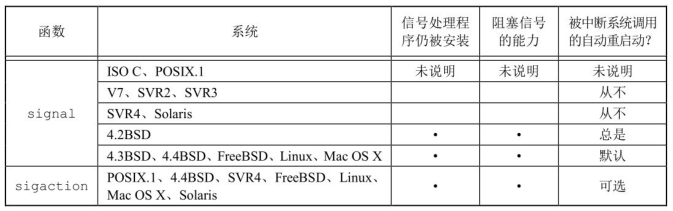
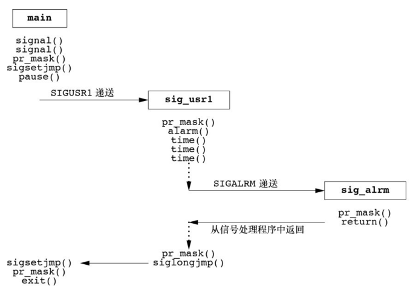

## 信号概念

- 信号是软件中断。
- 很多比较重要的应用程序都需处理信号。
- 信号提供了一种处理异步事件的方法。
- `POSIX.1` 对可靠信号例程进行了标准化。

每个信号都有一个名字，这些名字都以 3 个字符 `SIG` 开头。在头文件 `<signal.h>` 中，**信号名都被定义为正整数常量。**

信号的实现定义在另一个头文件中，内核包括对用户级应用程序有意义的头文件，这被认为是一种不好的形式，所以如若应用程序和内核两者都需使用同一定义，那么就将有关信息放置在内核头文件中，然后用户级头文件再包括该内核头文件。

不存在编号为 0 的信号，`POSIX.1` 将此种信号编号值称为空信号，`kill` 函数对信号编号 0 有特殊的应用。

很多条件可以产生信号：

- 当用户按某些终端键时，引发终端产生的信号。
- 硬件异常产生信号：除数为 0、无效的内存引用等。
- 进程调用 `kill(2)` 函数可将任意信号发送给另一个进程或进程组。
- 用户可用 `kill(1)` 命令将信号发送给其他进程。
- 当检测到某种软件条件已经发生，并应将其通知有关进程时也产生信号。

产生信号的事件对进程而言是随机出现的，进程不能简单地测试一个变量来判断是否发生了一个信号，而是必须告诉内核“在此信号发生时，请执行下列操作”。

在某个信号出现时，可以告诉内核按下列 3 种方式之一进行处理，我们称之为或与信号相关的动作。

- 忽略此信号。`SIGKILL` 和 `SIGSTOP` 不能被忽略，它们向内核和超级用户提供了使进程终止或停止的可靠方法。
- 捕捉信号。为了做到这一点，要通知内核在某种信号发生时，调用一个用户函数。
- 执行系统默认动作。对大多数信号的系统默认动作是终止该进程。

UNIX 系统信号：

| 名字         | 说明                          | 默认动作        |
| ------------ | ----------------------------- | --------------- |
| `SIGABRT`    | 异常终止 (`abort`)            | 终止+core       |
| `SIGALRM`    | 定时器超时(`alarm`)           | 终止            |
| `SIGBUS`     | 硬件故障                      | 终止+core       |
| `SIGCANCEL`  | 线程库内部使用                | 忽略            |
| `SIGCHLD`    | 子进程状态改变                | 忽略            |
| `SIGCONT`    | 使暂停进程继续                | 继续/忽略       |
| `SIGEMT`     | 硬件故障                      | 终止+core       |
| `SIGFPE`     | 算术异常                      | 终止+core       |
| `SIGFREEZE`  | 检查点冻结                    | 忽略            |
| `SIGHUP`     | 连接断开                      | 终止            |
| `SIGILL`     | 非法硬件指令                  | 终止+core       |
| `SIGINFO`    | 键盘状态请求                  | 忽略            |
| `SIGINT`     | 终端中断符                    | 终止            |
| `SIGIO`      | 异步 `I/O`                    | 终止/忽略       |
| `SIGIOT`     | 硬件故障                      | 终止+core       |
| `SIGJVM1`    | Java 虚拟机内部使用           | 忽略            |
| `SIGJVM2`    | Java 虚拟机内部使用           | 忽略            |
| `SIGKILL`    | 终止                          | 终止            |
| `SIGLOST`    | 资源丢失                      | 终止            |
| `SIGLWP`     | 线程库内部使用                | 终止/忽略       |
| `SIGPIPE`    | 写至无读进程的管道            | 终止            |
| `SIGPOLL`    | 可轮询事件(`poll`)            | 终止            |
| `SIGPROF`    | 梗概时间超时(`setitimer`)     | 终止            |
| `SIGPWR`     | 电源失效/重启动               | 终止/忽略       |
| `SIGQUIT`    | 终端退出符                    | 终止+core       |
| `SIGSEGV`    | 无效内存引用                  | 终止+core       |
| `SIGSTKFLT`  | 协处理器栈故障                | 终止            |
| `SIGSTOP`    | 停止                          | 停止进程        |
| `SIGSYS`     | 无效系统调用                  | 终止+core       |
| `SIGTERM`    | 终止                          | 终止            |
| `SIGTHAW`    | 检查点解冻                    | 忽略            |
| `SIGTHR`     | 线程库内部使用                | 忽略            |
| `SIGTRAP`    | 硬件故障                      | 终止+core       |
| `SIGTSTP`    | 终端停止符                    | 停止进程        |
| `SIGTTIN`    | 后台读控制 `tty`              | 停止进程        |
| `SIGTTOU`    | 后台写向控制 `tty`            | 停止进程        |
| `SIGURG`     | 紧急情况(套接字)              | 忽略            |
| `SIGUSR1`    | 用户定义信号                  | 终止            |
| `SIGUSR2`    | 用户定义信号                  | 终止            |
| `SIGVTALRM`  | 虚拟时间闹钟(`setitimer`)     | 终止            |
| `SIGWAITING` | 线程库内部使用                | 忽略            |
| `SIGWINCH`   | 终端窗口大小改变              | 忽略            |
| `SIGXCPU`    | 超过 CPU 限制(s`etrlimit`)    | 终止或终止+core |
| `SIGXFSZ`    | 超过文件长度限制(s`etrlimit`) | 终止或终止+core |
| `SIGXRES`    | 超过资源控制                  | 忽略            |

“终止+core”表示在进程当前工作目录的 `core` 文件中复制了该进程的内存映像，大多数 UNIX 系统调试程序都使用 `core` 文件检查进程终止时的状态。在下列条件下不产生 `core` 文件：

- 进程是设置用户 ID 的，而且当前用户并非程序文件的所有者；
- 进程是设置组 ID 的，而且当前用户并非该程序文件的组所有者；
- 用户没有写当前工作目录的权限；
- 文件已存在，而且用户对该文件设有写权限；
- 文件太大。

下面较详细地逐一说明这些信号。

- `SIGABRT` 调用 `abort` 函数时产生此信号。进程异常终止。
- `SIGALRM` 当用 `alarm` 函数设置的定时器超时时，产生此信号。
- `SIGBUS` 指示一个实现定义的硬件故障。
- `SIGCANCEL` 这是 Solaris 线程库内部使用的信号。
- `SIGCHLD` 在一个进程终止或停止时，`SIGCHLD` 信号被送给其父进程。
- `SIGCONT` 此作业控制信号发送给需要继续运行，但当前处于停止状态的进程。
- `SIGEMT` 指示一个实现定义的硬件故障。
- `SIGFPE` 此信号表示一个算术运算异常，如除以 0、浮点溢出等。
- `SIGFREEZE` 此信号仅由 Solaris 定义。
- `SIGHUP` 如果终端接口检测到一个连接断开，则将此信号送给与该终端相关的控制进程（会话首进程）。
- `SIGILL` 此信号表示进程已执行一条非法硬件指令。
- `SIGINFO` 这是一种 BSD 信号，当用户按状态键（一般采用 `Ctrl+T`）时，终端驱动程序产生此信号并发送至前台进程组中的每一个进程。
- `SIGINT` 当用户按中断键（一般采用 `Delete` 或 `Ctrl+C`）时，终端驱动程序产生此信号并发送至前台进程组中的每一个进程。
- `SIGIO` 此信号指示一个异步 `I/O` 事件。
- `SIGIOT` 这指示一个实现定义的硬件故障。
- `SIGKILL` 它向系统管理员提供了一种可以杀死任一进程的可靠方法。
- `SIGLOST` 运行在 Solaris NFSv4 客户端系统中的进程，恢复阶段不能重新获得锁，此时将由这个信号通知该进程。
- `SIGLWP` 此信号由 Solaris 线程库内部使用，并不做一般使用。
- `SIGPIPE` 如果在管道的读进程已终止时写管道，则产生此信号。
- `SIGPOLL` 这个信号在 SUSv4 中已被标记为弃用，将来的标准可能会将此信号移除。
- `SIGPROF` 这个信号在 SUSv4 中已被标记为弃用，将来的标准可能会将此信号移除。
- `SIGPWR` 这是一种依赖于系统的信号。它主要用于具有不间断电源（UPS）的系统。
- `SIGQUIT` 当用户在终端上按退出键（一般采用 `Ctrl+\`）时，中断驱动程序产生此信号，并发送给前台进程组中的所有进程。
- `SIGSEGV` 指示进程进行了一次无效的内存引用。
- `SIGSTKFLT` 它出现在 Linux 的早期版本，企图用于数学协处理器的栈故障。
- `SIGSTOP` 这是一个作业控制信号，它停止一个进程。
- `SIGSYS` 该信号指示一个无效的系统调用。
- `SIGTERM` 这是由 `kill(1)` 命令发送的系统默认终止信号。
- `SIGTHAW` 此信号仅由 Solaris 定义。
- `SIGTHR` FreeBSD 线程库预留的信号，它的值定义或与 `SIGLWP` 相同。
- `SIGTRAP` 指示一个实现定义的硬件故障。
- `SIGTSTP` 交互停止信号，当用户在终端上按挂起键（一般采用 `Ctrl+Z`）时，终端驱动程序产生此信号。
- `SIGTTIN` 当一个后台进程组进程试图读其控制终端时，终端驱动程序产生此信号
- `SIGTTOU` 当一个后台进程组进程试图写其控制终端时，终端驱动程序产生此信号
- `SIGURG` 此信号通知进程已经发生一个紧急情况。
- `SIGUSR1` 这是一个用户定义的信号，可用于应用程序。
- `SIGUSR2` 这是另一个用户定义的信号
- `SIGVTALRM` 当一个由 `setitimer(2)`函数设置的虚拟间隔时间已经超时时，产生此信号。
- `SIGWAITING` 此信号由 Solaris 线程库内部使用，不做他用。
- `SIGWINCH` 内核维持与每个终端或伪终端相关联窗口的大小。
- `SIGXCPU` Single UNIX Specification 的 XSI 扩展支持资源限制的概念
- `SIGXFSZ` 如果进程超过了其软文件长度限制
- `SIGXRES` 此信号仅由 Solaris 定义。

## 函数 signal

UNIX 系统信号机制最简单的接口是 `signal` 函数。`signal` 函数由 `ISO C` 定义，因为 `ISO C` 不涉及多进程、进程组以及终端 `I/O` 等，所以它对信号的定义非常含糊。从 `UNIX System V` 派生的实现提供旧的不可靠信号语义；`4.4 BSD` 实现提供新的可靠信号语义，目前大多数系统遵循这种策略。

```c
#include <signal.h>
void (*signal(int signo, void (*func)(int)))(int);
```

返回值：

- 若成功，返回以前的信号处理配置；
- 若出错，返回 `SIG_ERR`。

参数：

- `signo` 参数是信号名。
- `func` 的值是常量 `SIG_IGN`、常量 `SIG_DFL` 或当接到此信号后要调用的函数的地址。
  - 如果指定 `SIG_IGN`，则向内核表示忽略此信号
  - 如果指定 `SIG_DFL`，则表示接到此信号后的动作是系统默认动作
  - 当指定函数地址时，则在信号发生时，调用该函数，我们称这种处理为捕捉该信号，称此函数为信号处理程序（signal handler）或信号处理函数（signal-catching function）。

如果查看系统的头文件 `<signal.h>`，则很可能会找到下列形式的声明：

```c
#define SIG_ERR (void (*)())-1
#define SIG_DFL (void (*)())0
#define SIG_IGN (void (*)())1
```

这些常量可用于表示“指向函数的指针，该函数要求一个整型参数，而且无返回值”。这些常量所使用的 3 个值不一定是 −1、0 和 1，但它们必须是 3 个值而决不能是任一函数的地址。

当信号处理程序被调用时，进程的信号掩码（signal mask）会被修改为处理该信号时的信号屏蔽集。具体来说，信号处理程序的信号屏蔽集会包括以下内容：

- 信号处理程序开始执行时，会阻塞（屏蔽）所有与该信号相关的信号。这意味着在信号处理程序内部，该信号不会再次触发同名的信号处理程序。这是为了避免递归的信号处理程序调用。
- 信号处理程序会继承进程的当前信号屏蔽集。这意味着信号处理程序内部可能会阻塞其他信号，而不仅仅是它自己的信号。这取决于在调用信号处理程序之前进程的信号屏蔽集设置。
- 信号处理程序执行完毕后，进程的信号屏蔽集会恢复到信号处理程序执行之前的状态。这意味着在信号处理程序执行期间被阻塞的信号会在信号处理程序退出后重新生效。

这种行为是为了确保信号处理程序能够以一种安全的方式执行，同时避免竞态条件和信号处理程序递归调用引起的问题。信号处理程序的信号屏蔽集的管理由操作系统自动处理。

例子，捕捉 `SIGUSR1` 和 `SIGUSR2` 的简单程序。

```c
#include <stdio.h>
#include <signal.h>
#include <unistd.h>

static void sig_usr(int);

int main(){
	if(signal(SIGUSR1, sig_usr) == SIG_ERR){
		perror("can't catch SIGUSR1");
		return 1;
	}
	if(signal(SIGUSR2, sig_usr) == SIG_ERR){
		perror("can't catch SIGUSR2");
		return 1;
	}
	for(;;){
		pause(); // 只有执行了一个信号处理程序并从其返回时，pause才返回。
		printf("from sig_usr return.\n");
	}
	return 0;
}

static void sig_usr(int signo){
	if(signo == SIGUSR1)
		printf("received SIGUSR1\n");
	else if(signo == SIGUSR2)
		printf("received SIGUSR2\n");
	else
		printf("received signal %d\n", signo);
}
```

编译运行：

```bash
$ gcc 01signal.c
$ ./a.out&            # 在后台启动进程
[1] 24241
$ kill -USR1 24241    # 向该进程发送SIGUSR1
received SIGUSR1
from sig_usr return.
$ kill -USR2 24241    # 向该进程发送SIGUSR2
received SIGUSR2
from sig_usr return.
$ kill 24241          # 向该进程发送SIGTERM
[3]  + 24241 terminated  ./a.out
```

进程不捕捉 `SIGTERM` 信号，而对该信号的系统默认动作是终止，所以当向该进程发送 `SIGTERM` 信号后，该进程就终止。

### 1. 程序启动

当执行一个程序时，所有信号的状态都是系统默认或忽略。通常所有信号都被设置为它们的默认动作，除非调用 `exec` 的进程忽略该信号。确切地讲，`exec` 函数将原先设置为要捕捉的信号都更改为默认动作，其他信号的状态则不变。

`signal` 函数的限制：不改变信号的处理方式就不能确定信号的当前处理方式。使用 `sigaction` 函数可以确定一个信号的处理方式，而无需改变它。

### 2. 进程创建

当一个进程调用 `fork` 时，其子进程继承父进程的信号处理方式。因为子进程在开始时复制了父进程内存映像，所以信号处理函数的地址在子进程中是有意义的。

## 不可靠的信号

在早期的 UNIX 版本中（如 V7），信号是不可靠的。不可靠在这里指的是，信号可能会丢失，同时，进程对信号的控制能力也很差，它能捕捉信号或忽略它，但是无法记住它。

`4.2 BSD` 对信号机制进行了更改，提供了被称为可靠信号的机制。`POSIX.1` 选择了 BSD 模型作为其标准化的基础。

早期版本中的一个问题是在进程每次接到信号对其进行处理时，随即将该信号动作重置为默认值。下面为早期的经典实例。

```c
void sig_int();    /* 信号处理程序 */
...
signal(SIGINT, sig_int); /* 注册信号处理程序*/
...

sig_int()
{
    signal(SIGINT, sig_int); /* 注册信号处理程序防止重置为默认值 */
    ...
}
```

上面的代码存在一个问题：在信号发生之后到信号处理程序调用 `signal` 函数之间有一个时间窗口。在此段时间中，可能发生另一次中断信号。第二个信号会造成执行默认动作，而对中断信号的默认动作是终止该进程。

例子，在信号发生之后到信号处理程序调用 `signal` 函数之间的时间窗口再次产生信号。

```c
#include <stdio.h>
#include <signal.h>
#include <unistd.h>

void sig_segv(int signo){
    printf("received signal %d\n", signo);
    int *ptr = NULL;
    *ptr = 42;  // 在信号处理程序调用 signal 的时间窗口发生另一个信号中断
    signal(SIGSEGV, sig_segv); // 注册信号处理程序
}

int main(int argc, char const *argv[]){
    signal(SIGSEGV, sig_segv); // 注册信号处理程序防止重置为默认值
    int *ptr = NULL;
    *ptr = 42;
    while (1)
        pause();
    return 0;
}
```

编译运行：

```bash
$ gcc 02unreliable.c
$ ./a.out
received signal 11
[1]    9329 segmentation fault (core dumped)  ./a.out # 进程终止
```

早期版本的另一个问题是：在进程不希望某种信号发生时，它不能关闭该信号。进程能做的一切就是忽略该信号。有时希望通知系统“阻止下列信号发生，如果它们确实产生了，请记住它们。”能够显现这种缺陷的的一个经典实例是下列程序段，它捕捉一个信号，然后设置一个表示该信号已发生的标志：

```c
int sig_int();     /* 信号处理程序 */
int sig_int_flag;  /* 当信号发生时设置为非 0 */
int main(){
    signal(SIGINT, sig_int); // 注册信号处理程序
    ...
    while (sig_int_flag == 0) // 当 sig_int_flag 为非 0 时，说明程序已经准备好了
        pause(); // 只有执行了一个信号处理程序并从其返回时，pause才返回。
    ...
}

int sig_int(){
    signal(SIGINT, sig_int);  // 注册信号处理程序防止重置为默认值
    sig_int_flag = 1;         // 当捕捉到信号时，将标志 sig_int_flag 设置为非 0 值。
}
```

上面的代码也存在一个问题：如果在测试 `sig_int_flag` 之后、调用 `pause` 之前发生信号，那么从信号处理程序返回后，进程在调用 `pause` 时可能将永久休眠（假定此信号不会再次产生）。

例子，在测试 `sig_int_flag` 之后、调用 `pause` 之前发生信号。

```c
#include <stdio.h>
#include <signal.h>
#include <unistd.h>

int sig_int_flag = 0;

void sig_segv(int signo){
    signal(SIGSEGV, sig_segv); // 注册信号处理程序
    sig_int_flag = 1;
    printf("received signal %d, sig_int_flag = %d\n", signo, sig_int_flag);
}

int main(int argc, char const *argv[]){
    signal(SIGSEGV, sig_segv); // 注册信号处理程序防止重置为默认值
    while (sig_int_flag == 0){
        printf("start raise(SIGSEGV).\n");
        raise(SIGSEGV);
        printf("finish raise(SIGSEGV).\n");
        pause(); // pause 函数还没有执行的时候，产生了 SIGSEGV 信号，然后再执行 pause 导致进程被挂起。
        printf("from sig_segv return.\n");
    }
    return 0;
}
```

编译运行：

```bash
$ gcc 02unreliable_pause.c
$ ./a.out
start raise(SIGSEGV).
received signal 11, sig_int_flag = 1
finish raise(SIGSEGV).
^C
```

## 中断的系统调用

早期 UNIX 系统的一个特性是：如果进程在执行一个低速系统调用而阻塞期间捕捉到一个信号，则该系统调用就被中断不再继续执行。该系统调用返回出错，其 `errno` 设置为 `EINTR`。

低速系统调用是可能会使进程永远阻塞的一类系统调用，包括：

- 如果某些类型文件（如读管道、终端设备和网络设备）的数据不存在，则读操作可能会使调用者永远阻塞；
- 如果这些数据不能被相同的类型文件立即接受，则写操作可能会使调用者永远阻塞；
- 在某种条件发生之前打开某些类型文件，可能会发生阻塞；
- `pause` 函数和 `wait` 函数；
- 某些 `ioctl` 操作；
- 某些进程间通信函数。

在这些低速系统调用中，一个值得注意的例外是与磁盘 `I/O` 有关的系统调用。虽然读、写一个磁盘文件可能暂时阻塞调用者，但是除非发生硬件错误，`I/O` 操作总会很快返回，并使调用者不再处于阻塞状态。

对于中断的 `read`、`write` 系统调用，`POSIX.1` 的语义在该标准的 2001 版有所改变。采用 BSD 风格的语义，允许该系统调用成功返回，返回值是已接收到的数据量。

与被中断的系统调用相关的问题是必须显式地处理出错返回。典型的例子：

```c
again:
    if ((n = read(fd, buf, BUFFSIZE)) < 0) {
        if (errno == EINTR)
            goto again; /* 如果是中断系统调用，就重新启动它 */
        /* handle other errors */
    }
```

为了帮助应用程序使其不必处理被中断的系统调用，4.2BSD 引进了某些被中断系统调用的自动重启动。

自动重启动的系统调用包括：`ioctl`、`read`、`readv`、`write`、`writev`、`wait` 和 `waitpid`。其中前 5 个函数只有对低速设备进行操作时才会被信号中断。而 `wait` 和 `waitpid` 在捕捉到信号时总是被中断。因为这种自动重启动的处理方式也会带来问题，某些应用程序并不希望这些函数被中断后重启动。为此 4.3BSD 允许进程基于每个信号禁用此功能。

`POSIX.1` 要求只有中断信号的 `SA_RESTART` 标志有效时，实现才重启动系统调用。`sigaction` 函数使用这个标志允许应用程序请求重启动被中断的系统调用。

> System V 的默认工作方式是从不重启动系统调用。而 BSD 则重启动被信号中断的系统调用。FreeBSD 8.0、Linux 3.2.0 和 Mac OS X 10.6.8 中，当信号处理程序是用 `signal` 函数时，被中断的系统调用会重启动。

4.2BSD 引入自动重启动功能的一个理由是：有时用户并不知道所使用的输入、输出设备是否是低速设备。

几种信号实现所提供的功能：



## 可重入函数

进程捕捉到信号并对其进行处理时，进程正在执行的正常指令序列就被信号处理程序临时中断，它首先执行该信号处理程序中的指令。如果从信号处理程序返回，则继续执行在捕捉到信号时进程正在执行的正常指令序列。但在信号处理程序中，不能判断捕捉到信号时进程执行到何处。

如果进程正在执行 `malloc`，在其堆中分配另外的存储空间，而此时由于捕捉到信号而插入执行该信号处理程序，其中又调用 `malloc`，可能会对进程造成破坏，因为 `malloc` 通常为它所分配的存储区维护一个链表，而插入执行信号处理程序时，进程可能正在更改此链表。

若进程正在执行 `getpwnam` 这种将其结果存放在静态存储单元中的函数，其间插入执行信号处理程序，它又调用这样的函数，返回给正常调用者的信息可能会被返回给信号处理程序的信息覆盖。

Single UNIX Specification 说明了在信号处理程序中保证调用安全的函数。这些函数是可重入的并被称为是异步信号安全的。除了可重入以外，在信号处理操作期间，它会阻塞任何会引起不一致的信号发送。

信号处理程序可以调用的可重入函数：

| `abort`         | `faccessat`   | `linkat`            | `select`      | `socketpair`       |
| --------------- | ------------- | ------------------- | ------------- | ------------------ |
| `accept`        | `fchmod`      | `listen`            | `sem_post`    | `stat`             |
| `access`        | `fchmodat`    | `lseek`             | `send`        | `symlink`          |
| `aio_error`     | `fchown`      | `lstat`             | `sendmsg`     | `symlinkat`        |
| `aio_return`    | `fchownat`    | `mkdir`             | `sendto`      | `tcdrain`          |
| `aio_suspend`   | `fcntl`       | `mkdirat`           | `setgid`      | `tcflow`           |
| `alarm`         | `fdatasync`   | `mkfifo`            | `setpgid`     | `tcflush`          |
| `bind`          | `fexecve`     | `mkfifoat`          | `setsid`      | `tcgetattr`        |
| `cfgetispeed`   | `fork`        | `mknod`             | `setsockopt`  | `tcgetpgrp`        |
| `cigetospeed`   | `fstat`       | `mknodat`           | `setuid`      | `tcsendbreak`      |
| `cfsetispeed`   | `fstatat`     | `open`              | `shutdown`    | `tcsetattr`        |
| `cfsetospeed`   | `fsync`       | `openat`            | `sigaction`   | `tcsetpgrp`        |
| `chdir`         | `ftruncate`   | `pause`             | `sigaddset`   | `time`             |
| `chmod`         | `futimens`    | `pipe`              | `sigdelset`   | `timer_getoverrun` |
| `chown`         | `getegid`     | `poll`              | `sigemptyset` | `timer_gettime`    |
| `clock_gettime` | `geteuid`     | `posix_trace_event` | `sigfillset`  | `timer_settime`    |
| `close`         | `getgid`      | `pselect`           | `sigismember` | `times`            |
| `connect`       | `getgroups`   | `raise`             | `signal`      | `umask`            |
| `creat`         | `getpeername` | `read`              | `sigpause`    | `uname`            |
| `dup`           | `getpgrp`     | `readlink`          | `sigpending`  | `unlink`           |
| `dup2`          | `getpid`      | `readlinkat`        | `sigprocmask` | `ulinkat`          |
| `execl`         | `getppid`     | `recv`              | `sigqueue`    | `utime`            |
| `execle`        | `getsockname` | `recvfrom`          | `sigset`      | `utimensat`        |
| `execv`         | `getsockopt`  | `recvmsg`           | `sigsuspend`  | `utimes`           |
| `execve`        | `getuid`      | `rename`            | `sleep`       | `wait`             |
| `_Exit`         | `kill`        | `renameat`          | `socketmark`  | `waitpid`          |
| `_exit`         | `link`        | `rmdir`             | `socket`      | `write`            |

没有列入上表的大多数函数是不可重入的：

- 已知它们使用静态数据结构；
- 它们调用 `malloc` 或 `free`；
- 它们是标准 `I/O` 函数，标准 `I/O` 库的很多实现都以不可重入方式使用全局数据结构。

由于每个线程只有一个 `errno` 变量，所以信号处理程序可能会修改其原先值。因此，作为一个通用的规则，当在信号处理程序中调用上表中的函数时，应当在调用前保存 `errno`，在调用后恢复 `errno`。

例子，在信号处理程序中调用不可再入函数：

```c
#include <stdio.h>
#include <signal.h>
#include <pwd.h>
#include <stdlib.h>
#include <string.h>
#include <unistd.h>

static void my_alarm(int signo){
	struct passwd *rootptr;
	printf("in signal handler\n");
	if((rootptr = getpwnam("root")) == NULL){
		perror("getpwnam root error");
		exit(1);
	}
	alarm(1);
}

int main(){
	struct passwd *ptr;
	signal(SIGALRM, my_alarm);
	alarm(1);
	for(;;){
		if((ptr = getpwnam("ckcat")) == NULL){
			perror("getpwnam ckcat error");
			exit(1);
		}
		if(strcmp(ptr->pw_name, "ckcat") != 0){
			printf("return value corrupted!pw_name = %s\n", ptr->pw_name);
		}
	}
	return 0;
}
```

编译运行：

```bash
$ gcc 02nonreentrant.c
$ ./a.out
in signal handler
return value corrupted!pw_name = root
in signal handler
in signal handler
in signal handler
......
```

这段程序从信号处理程序 `my_alarm` 调用非可重入函数 `getpwnam`，而 `my_alarm` 每秒钟被调用一次。

运行该程序时，其结果具有随机性。通常，在信号处理程序经多次迭代返回时，该程序将由 `SIGSEGV` 信号终止。

## SIGCLD 语义

`SIGCLD` 和 `SIGCHLD` 这两个信号很容易被混淆。`SIGCLD` 是 System V 的一个信号名，其语义与名为 `SIGCHLD` 的 BSD 信号不同。`POSIX.1` 采用 BSD 的 `SIGCHLD` 信号。

BSD 的 `SIGCHLD` 信号语义与其他信号的语义相类似。子进程状态改变后产生此信号，父进程需要调用一个 `wait` 函数以检测发生了什么。

System V 处理 `SIGCLD` 信号的方式不同于其他信号。如果用 `signal` 或 `sigset` 设置信号配置，则基于 SVR4 的系统继承了这一具有问题色彩的传统，对于 `SIGCLD` 的早期处理方式是：

1. 如果进程明确地将该信号的配置设置为 `SIG_IGN`，则调用进程的子进程将不产生僵死进程。注意，这与其默认动作（`SIG_DFL`）“忽略”不同。子进程终止时，将其状态丢弃。子进程在终止时，将其状态丢弃。如果调用进程随后调用一个 `wait` 函数，那么它将阻塞直到所有子进程都终止，然后该 `wait` 会返回 −1，并将其 `errno` 设置为 `ECHILD`。
   > 如果 `SIGCHLD` 被忽略，4.4BSD 总是产生僵死进程。如果要避免僵死进程，则必须等待子进程。
   > 在 SVR4 中，如果调用 `signal` 或 `sigset` 将 `SIGCHLD` 的配置设置为忽略，则决不会产生僵死进程。
   > 使用 `sigaction` 可设置 `SA_NOCLDWAIT` 标志以避免进程僵死。
2. 如果将 `SIGCLD` 的配置设置为捕捉，则内核立即检查是否有子进程准备好被等待，如果是这样，则调用 `SIGCLD` 处理程序。

例子，不能正常工作的 System V `SIGCLD` 处理程序。

```c
#include <stdio.h>
#include <stdlib.h>
#include <signal.h>
#include <sys/wait.h>
#include <unistd.h>

static void sig_cld(int);

int main(int argc, char const *argv[])
{
    pid_t pid;
    // 将 SIGCLD 的配置设置为捕捉
    if(signal(SIGCLD, sig_cld) == SIG_ERR)
        perror("signal error");
    if((pid = fork()) < 0)
        perror("fork error");
    else if(pid == 0){
        printf("pid = %d, ppid = %d\n", getpid(), getppid());
        sleep(2);
        _exit(0);
    }
    // 父进程等待子进程终止产生SIGCLD信号，从信号处理程序返回。
    pause();
    return 0;
}

static void sig_cld(int signo){
    pid_t pid;
    int status;
    printf("SIGCLD received\n");

    if(signal(SIGCLD, sig_cld) == SIG_ERR) // 重新注册信号处理程序
        perror("signal error");
    if((pid = wait(&status)) < 0)    // 在信号处理函数中获取子进程状态
        perror("wait error");
    printf("pid = %d\n", pid);
}
```

编译运行：

```bash
$ gcc 03sigcld.c
$ ./a.out
pid = 26434, ppid = 26433
SIGCLD received
pid = 26434
```

Linux 3.2.0 没有出现此问题，其原因是，虽然 `SIGCLD` 和 `SIGCHLD` 定义为相同的值，但当一个进程安排捕捉 `SIGCHLD`，并且已经有进程准备好由其父进程等待时，该系统并不调用 `SIGCHLD` 信号的处理程序。

此程序的问题是：在信号处理程序的开始处调用 `signal`，按照上述第 2 种方式，内核检查是否有需要等待的子进程（因为我们正在处理一个 `SIGCLD` 信号，所以确实有这种子进程），所以它产生另一个对信号处理程序的调用。信号处理程序调用 `signal`，整个过程再次重复。

为了解决这一问题，应当在调用 `wait` 取到子进程的终止状态后再调用 `signal`。此时仅当其他子进程终止，内核才会再次产生此种信号。

## 可靠信号术语和语义

当造成信号的事件发生时，为进程产生一个信号，内核通常在进程表中以某种形式设置一个标志。当对信号采取了这种动作时，我们说向进程递送了一个信号。在信号产生（generation）和递送（delivery）之间的时间间隔内，称信号是未决的（pending）。

进程可以选用“阻塞信号递送”。如果为进程产生了一个阻塞的信号，而且对该信号的动作是系统默认动作或捕捉该信号，则为该进程将此信号保持为未决状态，直到该进程对此信号解除了阻塞，或者将对此信号的动作更改为忽略。**内核在递送一个原来被阻塞的信号给进程时，才决定对它的处理方式。于是进程在信号递送给它之前仍可改变对该信号的动作。**

`POSIX.1` 允许系统递送该信号一次或多次。如果递送该信号多次，则称这些信号进行了排队。但是除非支持 `POSIX.1` 实时扩展，否则大多数 UNIX 并不对信号排队，而是只递送这种信号一次。

`POSIX.1` 基础部分建议，多个信号要传递给一个进程的递送顺序，与进程当前状态有关的信号会在其他信号之前优先递送，如 `SIGSEGV`。

每个进程都有一个信号屏蔽字（`signal mask`），它规定了当前要阻塞递送到该进程的信号集。 **对于每种可能的信号，该屏蔽字中都有一位与之对应。对于某种信号，若其对应位已设置，则它当前是被阻塞的。** 进程可以调用 `sigprocmask` 来检测和更改其当前信号屏蔽字。

## 函数 kill 和 raise

`kill` 函数将信号发送给进程或进程组。`raise` 函数则允许进程向自身发送信号。

`raise` 最初是由 `ISO C` 定义的。`POSIX.1` 扩展了 `raise` 的规范，使其可处理线程。因为 `ISO C` 并不涉及多进程，所以它不能定义以进程 ID 作为其参数的函数。

```c
#include <signal.h>
int kill(pid_t pid, int signo);
int raise(int signo);
```

返回值：

- 若成功，返回 0；
- 若出错，返回 −1

`kill` 的 `pid` 参数有以下 4 种不同的情况。

- `pid > 0` 将该信号发送给进程 ID 为 `pid` 的进程。
- `pid == 0` 将该信号发送给与发送进程属于同一进程组的所有进程，而且发送进程具有权限向这些进程发送信号。
- `pid < 0` 将该信号发送给其进程组 ID 等于 `pid` 绝对值，而且发送进程具有权限向其发送信号的所有进程。
- `pid == −1` 将该信号发送给发送进程有权限向它们发送信号的所有进程。

进程将信号发送给其他进程需要权限。

- 超级用户可将信号发送给任一进程。
- 对于非超级用户，其基本规则是发送者的实际用户 ID 或有效用户 ID 必须等于接收者的实际用户 ID 或有效用户 ID。
- 如果实现支持 `_POSIX_SAVED_IDS` ，则检查接收者的保存设置用户 ID。
- 在对权限进行测试时也有一个特例：如果被发送的信号是 `SIGCONT`，则进程可将它发送给属于同一会话的任一其他进程。

`POSIX.1` 将信号编号 0 定义为空信号。如果 `signo` 参数是 0，则 `kill` 仍执行正常的错误检查，但不发送信号。如果向一个并不存在的进程发送空信号，则 `kill` 返回 −1，`errno` 被设置为 `ESRCH`。

如果调用 `kill` 为调用进程产生信号，而且此信号是不被阻塞的，那么在 `kill` 返回之前， `signo` 或者某个其他未决的、非阻塞信号被传送至该进程。

## 函数 alarm 和 pause

使用 `alarm` 函数可以设置一个定时器，在将来的某个时刻该定时器会超时。当定时器超时时，产生 `SIGALRM` 信号。如果忽略或不捕捉此信号，则其默认动作是终止调用该 `alarm` 函数的进程。

```c
#include <unistd.h>
unsigned int alarm(unsigned int seconds);
```

返回值：

- 0 或以前设置的闹钟时间的余留秒数。

参数 `seconds` 的值是产生信号 `SIGALRM` 需要经过的时钟秒数。

每个进程只能有一个闹钟时间。如果在调用 `alarm` 时，之前已为该进程注册的闹钟时间还没有超时，则该闹钟时间的余留值作为本次 `alarm` 函数调用的值返回。以前注册的闹钟时间则被新值代替。

**如果有以前注册的尚未超过的闹钟时间，而且本次调用的 `seconds` 值是 0，则取消以前的闹钟时间，其余留值仍作为 `alarm` 函数的返回值。**

`pause` 函数使调用进程挂起直至捕捉到一个信号。

```c
#include <unistd.h>
int pause(void);
```

返回值：

- −1，`errno` 设置为 `EINTR`。

只有执行了一个信号处理程序并从其返回时，`pause` 才返回。在这种情况下，`pause` 返回 −1， `errno` 设置为 `EINTR`。

例子，`sleep` 简化而不完整的实现。

```c
#include <signal.h>
#include <unistd.h>

static void sig_alrm(int signo){
    // 仅仅只是为了返回唤醒 pause
}

unsigned int sleep1(unsigned int seconds){
    // 这里修改了对 SIGALRM 的配置，应保存signal函数的返回值，在返回前重置原配置。
    if(signal(SIGALRM, sig_alrm) == SIG_ERR)
        return(seconds);
    alarm(seconds);     // 设置定时器，这里会将其他的定时器擦除，应该进行检查返回值
    // alarm 在调用 pause 之前超时，并调用了信号处理程序。
    pause();            // 等待信号处理程序返回
    return (alarm(0));  // 取消以前的定时器，其余留值作为 alarm 函数的返回值。
}
```

`sleep1` 函数有以下 3 个问题:

1. 如果在调用 `sleep1` 之前，调用者已设置了闹钟，则它被 `sleep1` 函数中的第一次 `alarm` 调用擦除。可以通过判断 `alarm` 返回值解决。
2. 该程序中修改了对 `SIGALRM` 的配置。可以在调用 `sleep1` 前保存原配置，`sleep1` 返回后恢复原配置。
3. 在第一次调用 `alarm` 和 `pause` 之间有一个竞争条件。在一个繁忙的系统中，可能 `alarm` 在调用 `pause` 之前超时，并调用了信号处理程序。如果发生了这种情况，则在调用 `pause` 后，如果没有捕捉到其他信号，调用者将永远被挂起。

例子，使用了 `setjmp` 和 `longjmp` 实现 `sleep` 的另一个不完善的实现。

```c
#include <signal.h>
#include <unistd.h>
#include <setjmp.h>

static jmp_buf env_alrm;

static void sig_alrm2(int signo){
    // 如果 SIGALRM 中断了某个其他信号处理程序，则调用 longjmp 会提早终止该信号处理程序。
    longjmp(env_alrm, 1);
}

unsigned int sleep2(unsigned int seconds){
    if(signal(SIGALRM, sig_alrm2) == SIG_ERR)
        return (seconds);
    if(setjmp(env_alrm) == 0){ // 若从 longjmp 返回，则为非 0
        alarm(seconds);    // 设置定时器
        pause();           // 等待信号处理程序返回
    }
    return (alarm(0));    // 取消以前的定时器，其余留值作为 alarm函数的返回值。
}
```

此函数避免了 `sleep1` 中具有的竞争条件。即使 `pause` 从未执行，在发生 `SIGALRM` 时，`sleep2` 函数也返回。

但是，`sleep2` 函数中却有另一个难以察觉的问题，它涉及与其他信号的交互。如果 `SIGALRM` 中断了某个其他信号处理程序，则调用 `longjmp` 会提早终止该信号处理程序。

例子，在一个捕捉其他信号的程序中调用 `sleep2` 。

```c
#include <stdio.h>
#include <setjmp.h>
#include <signal.h>
#include <unistd.h>

static jmp_buf env_alrm;

static void sig_alrm2(int signo){
	longjmp(env_alrm, 1);
}

unsigned int sleep2(unsigned int seconds){
	if(signal(SIGALRM, sig_alrm2) == SIG_ERR)
		return seconds;
	if(setjmp(env_alrm) == 0){
		alarm(seconds);
		pause();
	}
	return alarm(0);
}

static void sig_int(int signo){
	int i, j;
	volatile int k;
	printf("\nsig_int starting\n");
	// 下列执行时间大于 sleep 2 的参数值
	for(i = 0; i < 30000000000; i++)
		for(j = 0; j < 1000000; j++)
			k += i +j;
	printf("sig_int finished\n");
}

int main(){
	unsigned int unslept;
	if(signal(SIGINT, sig_int) == SIG_ERR){
		perror("signal(SIGINT) error");
		return 1;
	}
	unslept = sleep2(2); // longjmp 将会提前终止 `sig_int` 信号处理程序。
	printf("sleep2 returned: %u\n", unslept);
	return 0;
}
```

编译运行：

```bash
$ gcc 04alarm.c
$ ./a.out
^C                    # Ctrl + C
sig_int starting      # 开始执行 SIGINT 信号处理函数
sleep2 returned: 0    # sleep2 提前终止了 SIGINT 信号处理函数
```

当触发 `SIGINT` 信号后，由于 `sig_int` 信号处理程序执行的时间超过了 `alarm` 设置的定时的时间，此时 `SIGALRM` 将中断了 `SIGINT` 信号处理程序，则调用 `longjmp` 会提早终止 `sig_int` 信号处理程序。

除了用来实现 `sleep` 函数外，`alarm` 还常用于对可能阻塞的操作设置时间上限值。

例子，带时间限制调用 `read`。

```c
#include <stdio.h>
#include <signal.h>
#include <unistd.h>

static void sig_alrm(int signo){
	// 仅仅只是返回中断读操作
}

int main(){
	int n;
	char line[1024];
	if(signal(SIGALRM, sig_alrm) == SIG_ERR){
		perror("signal(SIGALRM) error");
		return 1;
	}
	alarm(5);
	if((n = read(STDIN_FILENO, line, 1024)) < 0){
		perror("read error");
		return 1;
	}
	alarm(0);
	write(STDOUT_FILENO, line, n);
	return 0;
}
```

上面的程序有两个问题：

1. 在第一次 `alarm` 调用和 `read` 调用之间有一个竞争条件。
2. 如果系统调用是自动重启的，则当从 `SIGALRM` 信号处理程序返回时，`read` 并不被中断。在这种情形下，设置时间限制不起作用。

可以用 `longjmp` 再实现前面的实例。使用这种方法无需担心一个慢速的系统调用是否被中断。

```c
#include <stdio.h>
#include <unistd.h>
#include <signal.h>
#include <setjmp.h>

static jmp_buf env_alrm;

static void sig_alrm(int signo){
	longjmp(env_alrm, 1);
}

int main(){
	int n;
	char line[1024];
	if(signal(SIGALRM, sig_alrm) == SIG_ERR){
		perror("signal(SIGALRM) error");
		return 1;
	}
	if(setjmp(env_alrm) != 0){
		perror("read timeout");
		return 1;
	}

	alarm(5);
	if((n = read(STDIN_FILENO, line, 1024)) < 0){
		perror("read error");
		return 1;
	}
	alarm(0);
	write(STDOUT_FILENO, line, n);
	return 0;
}
```

编译运行：

```bash
$ gcc 04alarm_jmp.c
$ ./a.out
read timeout: Success    # 等待 5 秒后
```

不管系统是否重新启动被中断的系统调用，该程序都会如所预期的那样工作。但是该该程序仍旧有与其他信号处理程序交互的问题。

## 信号集

`POSIX.1` 定义数据类型 `sigset_t` 以包含一个信号集，并且定义了下列 5 个处理信号集的函数。

```c
#include <signal.h>
int sigemptyset(sigset_t *set);
int sigfillset(sigset_t *set);
int sigaddset(sigset_t *set, int signo);
int sigdelset(sigset_t *set, int signo);

int sigismember(const sigset_t *set, int signo);
```

前 4 个函数返回值：

- 若成功，返回 0；
- 若出错，返回 −1。

`sigismember` 返回值：

- 若真，返回 1；
- 若假，返回 0。

说明：

- 函数 `sigemptyset` 初始化由 `set` 指向的信号集，清除其中所有信号。
- 函数 `sigfillset` 初始化由 `set` 指向的信号集，使其包括所有信号。
- 函数 `sigaddset` 将一个信号添加到已有的信号集中。
- 函数 `sigdelset` 从信号集中删除一个信号。
- 函数 `sigismember` 用于检查信号是否属于信号集的函数。

**对所有以信号集作为参数的函数，总是以信号集地址作为向其传送的参数。**

例子，假定一种实现有 31 种信号和 32 位整型 `sigemptyset`、`sigfillset`、`sigaddset`、`sigdelset` 和 `sigismember` 的实现。

```c
#include <signal.h>
#include <errno.h>

#define SIGBAD(signo) ((signo) <= 0 || (signo) >= NSIG)

#define sigemptyset(ptr) (*(ptr) = 0)
#define sigfillset(ptr) (*(ptr) = ~(sigset_t)0, 0) // 使用逗号表达式将 0 返回。

int sigaddset(sigset_t *set, int signo){
    if(SIGBAD(signo)){
        errno = EINVAL;
        return -1;
    }
    *set |= 1 << (signo - 1);
    return 0;
}

int sigdelset(sigset_t *set, int signo){
    if(SIGBAD(signo)){
        errno = EINVAL;
        return -1;
    }
    *set &= ~(1 << (signo - 1));
    return 0;
}

int sigismember(const sigset_t *set, int signo){
    if(SIGBAD(signo)){
        errno = EINVAL;
        return -1;
    }
    return (*set &(1 << (signo - 1)));
}
```

## 函数 sigprocmask

调用函数 `sigprocmask` 可以检测或更改，或同时进行检测和更改进程的信号屏蔽字。

```c
#include <signal.h>
int sigprocmask(int how, const sigset_t *restrict set, sigset_t *restrict oset);
```

返回值：

- 若成功，返回 0；
- 若出错，返回 −1。

参数：

- `how`：指定了信号屏蔽集的操作方式，可以取以下值：
  - `SIG_BLOCK`：将 `set` 中的信号添加到当前信号屏蔽集中。
  - `SIG_UNBLOCK`：从当前信号屏蔽集中移除 `set` 中的信号。
  - `SIG_SETMASK`：将当前信号屏蔽集设置为 `set` 中的信号集。
- `set`：一个指向 `sigset_t` 类型的指针，表示要进行操作的信号集。这是一个包含多个信号的位掩码，决定了要阻塞或解除阻塞哪些信号。
- `oset`：一个可选的指向 `sigset_t` 类型的指针，用于存储之前的信号屏蔽集。如果不需要获取之前的信号屏蔽集，可以将其设置为 `NULL` 。

说明：

- 若 `oset` 是非空指针，那么进程的当前信号屏蔽字通过 `oset` 返回。
- 若 `set` 是一个非空指针，则参数 `how` 指示如何修改当前信号屏蔽字。
- 如果 `set` 是个空指针，则不改变该进程的信号屏蔽字，`how` 的值也无意义。

**注意，不能阻塞 `SIGKILL` 和 `SIGSTOP` 信号。**

**`sigprocmask` 是仅为单线程进程定义的。处理多线程进程中信号的屏蔽使用另一个函数。**

例子，为进程打印信号屏蔽字。

```c
#include <stdio.h>
#include <errno.h>
#include <signal.h>

void pr_mask(const char *str){
	sigset_t sigset;
	int errno_save;
	errno_save = errno;
	if(sigprocmask(0, NULL, &sigset) < 0){
		perror("sigprocmask error");
		return;
	}else{
		printf("%s", str);
		if(sigismember(&sigset, SIGINT))
			printf(" SIGINT");
		if(sigismember(&sigset, SIGQUIT))
			printf(" SIGQUIT");
		if(sigismember(&sigset, SIGUSR1))
			printf(" SIGUSR1");
		if(sigismember(&sigset, SIGALRM))
			printf(" SIGALRM");
		printf("\n");
	}
	errno = errno_save;
}

int main(){
	sigset_t newset, oldset;
	// 初始化信号集
	sigemptyset(&newset);
	sigaddset(&newset, SIGINT);
	sigaddset(&newset, SIGALRM);
	sigaddset(&newset, SIGUSR1);

	// 将 newset 添加到当前的信号屏蔽集中
	sigprocmask(SIG_BLOCK, &newset, &oldset);

	// 打印当前进程的信号屏蔽字
	pr_mask("main mask: ");
	// 恢复原来的信号屏蔽集
	sigprocmask(SIG_SETMASK, &oldset, NULL);
	return 0;
}
```

编译运行：

```bash
$ gcc 05sigprocmask.c
$ ./a.out
main mask:  SIGINT SIGUSR1 SIGALRM
```

## 函数 sigpending

`sigpending` 函数用于获取当前挂起的信号集，即已经发送但尚未被进程处理的信号。

```c
#include <signal.h>
int sigpending(sigset_t *set);
```

返回值：

- 若成功，返回 0；
- 若出错，返回 −1。

例子，信号设置和 `sigprocmask` 实例。

```c
#include <stdio.h>
#include <signal.h>
#include <unistd.h>

static void sig_quit(int signo){
	printf("caught SIGQUIT\n");
	// 将 SIGQUIT 改为系统默认动作
	if(signal(SIGQUIT, SIG_DFL) == SIG_ERR){
		perror("can't reset SIGQUIT");
		return;
	}
}

int main(){
	sigset_t newmask, oldmask, pendmask;
	if(signal(SIGQUIT, sig_quit) == SIG_ERR){
		perror("can't catch SIGQUIT");
		return 1;
	}
	// 将 SIGQUIT 添加到进程信号屏蔽集中
	sigemptyset(&newmask);
	sigaddset(&newmask, SIGQUIT);
	if(sigprocmask(SIG_BLOCK, &newmask, &oldmask) < 0){
		perror("SIG_BLOCK error");
		return 1;
	}
	sleep(5);
	if(sigpending(&pendmask) < 0){
		perror("sigpending error");
		return 1;
	}
	if(sigismember(&pendmask, SIGQUIT))
		printf("\nSIGQUIT pending\n");
	// 恢复之前保存的信号屏蔽集，如果在休眠期间产生了 SIGQUIT 信号，
	// 那么此刻 SIGQUIT 是未决的，但是不再阻塞，在 sigprocmask 返回之前，它将被递送给进程。
	if(sigprocmask(SIG_SETMASK, &oldmask, NULL) < 0){
		perror("sigprocmask SIG_SETMASK error");
		return 1;
	}
	printf("SIGQUIT unblocked\n");
	sleep(5); // 这里产生 SIGQUIT 信号将按默认方式处理，即终止进程
	return 0;
}
```

编译运行：

```bash
$ gcc 06sigpending.c
$ ./a.out
^\                    # 按了1次 Ctrl + \
SIGQUIT pending
caught SIGQUIT
SIGQUIT unblocked
^\[1]    14512 quit (core dumped)  ./a.out # 按了一次 Ctrl + \

$ ./a.out
^\^\^\^\              # 按了4次 Ctrl + \
SIGQUIT pending
caught SIGQUIT
SIGQUIT unblocked
^\[1]    14535 quit (core dumped)  ./a.out # 按了一次 Ctrl + \
```

第二次运行该程序时，在进程休眠期间使 `SIGQUIT` 信号产生 4 次，但是解除了对该信号的阻塞后，只向进程传送一次 `SIGQUIT`。从中可以看出在此系统上没有将信号进行排队。

## 函数 sigaction

`sigaction` 函数的功能是用于设置和检索信号处理函数的系统调用，它允许你更精细地控制信号的处理方式。此函数取代了 UNIX 早期版本使用的 `signal` 函数。

```c
#include <signal.h>
int sigaction(int signo, const struct sigaction *restrict act, struct sigaction *restrict oact);
```

返回值：

- 若成功，返回 0；
- 若出错，返回 −1。

参数：

- `signo`：要操作的信号编号，如 `SIGINT`、`SIGTERM` 等。
- `act`：一个指向 `struct sigaction` 结构的指针，用于设置新的信号处理行为（信号处理函数和标志）。
- `oact`：一个可选的指向 `struct sigaction `结构的指针，用于存储之前的信号处理行为。如果不需要获取之前的行为，可以将其设置为 `NULL`。

`struct sigaction` 如下：

```c
struct sigaction {
    void (*sa_handler)(int);       // 信号处理函数
    void (*sa_sigaction)(int, siginfo_t *, void *); // 信号处理函数（扩展版，通常不与sa_handler同时使用）
    sigset_t sa_mask;              // 用于在信号处理期间阻塞的信号集
    int sa_flags;                  // 信号处理标志
    void (*sa_restorer)(void);     // 废弃的字段，忽略
};
```

当更改信号动作时，如果 `sa_handler` 字段包含一个信号处理函数的地址，则 `sa_mask` 字段说明了一个信号集，在调用该信号处理函数之前，这一信号集要加到进程的信号屏蔽字中。仅当从信号处理函数返回时再将进程的信号屏蔽字恢复为原先值。这样，在调用信号处理程序时就能阻塞某些信号。在信号处理程序被调用时，操作系统建立的新信号屏蔽字包括正被递送的信号。因此保证了在处理一个给定的信号时，如果这种信号再次发生，那么它会被阻塞到对前一个信号的处理结束为止。

一旦对给定的信号设置了一个动作，那么在调用 `sigaction` 显式地改变它之前，该设置就一直有效。这种处理方式与早期的不可靠信号机制不同，符合 `POSIX.1` 在这方面的要求。

`act` 结构的 `sa_flags` 字段指定对信号进行处理的各个选项。

| 选项           | 说明                                                                                                                                                                                                                                                     |
| -------------- | -------------------------------------------------------------------------------------------------------------------------------------------------------------------------------------------------------------------------------------------------------- |
| `SA_INTERRUPT` | 由此信号中断的系统调用不自动重启动                                                                                                                                                                                                                       |
| `SA_NOCLDSTOP` | 若 `signo` 是 `SIGCHLD`，当子进程停止(作业控制)，不产生此信号。当子进程终止时，仍旧产生此信号。若已设置此标志，则当停止的进程继续运行时，作为 XSI 扩展，不产生 `SIGCHLD` 信号                                                                            |
| `SA_NOCLDWAIT` | 若 `signo` 是 `SIGCHLD`，则当调用进程的子进程终止时，不创建僵死进程。若调用进程随后调用 `wait`，则阻塞到它所有子进程都终止，此时返回`-1`，`errno` 设置为 `ECHILD`                                                                                        |
| `SA_NODEFER`   | 当捕捉到此信号时，在执行其信号捕提函数时，系统不自动阻塞此信号(除非 `samask` 包括了此信号)。注意，此种类型的操作对应于早期的不可靠信号                                                                                                                   |
| `SA_ONSTACK`   | 若用 `sigaltstack(2)` 已声明了一个替换栈，则此信号递送给替换栈上的进程                                                                                                                                                                                   |
| `SA_RESETHAND` | 在此信号处理函数的入口处，将此信号的处理方式重置为 `SIGDEL`，并清除 `SASIGINEO` 标志。注意，此种类型的信号对应于早期的不可靠信号。但是，不能自动重置 `SIGILL` 和 `SIGTRAP` 这两个信号的配置。设置此标志使 `sigaction` 的行为如同设置了 `SA_NODEFER` 标志 |
| `SA_RESTART`   | 由此信号中断的系统调用自动重启动                                                                                                                                                                                                                         |
| `SA_SIGINFO`   | 此选项对信号处理程序提供了附加信息:一个指向 `siginfo` 结构的指针以及个指向进程上下文标识符的指针                                                                                                                                                         |

`sa_sigaction` 字段是一个替代的信号处理程序，在 `sigaction` 结构中使用了 `SA_SIGINFO` 标志时，使用该信号处理程序。**对于 `sa_sigaction` 字段和 `sa_handler` 字段两者，实现可能使用同一存储区，所以应用只能一次使用这两个字段中的一个。**

通常，按下列方式调用信号处理程序：
`void handler(int signo);`

但是，如果设置了 `SA_SIGINFO` 标志，那么按下列方式调用信号处理程序：
`void handler(int signo, siginfo_t *info, void *context);`

该信号处理函数参数：

- `int` 参数：表示信号的编号，即触发信号处理的信号编号。
- `siginfo_t *` 参数：一个指向 `siginfo_t` 结构的指针，用于访问有关信号的更多信息，例如发送信号的进程 ID、附加数据等。
- `void *` 参数：通常未使用，可以忽略。

`siginfo_t` 结构包含了信号产生原因的有关信息。该结构的大致样式如下所示。

```c
struct siginfo {
    int si_signo; /* signal number */
    int si_errno; /* if nonzero, errno value from <errno.h> */
    int si_code; /* additional info (depends on signal) */
    pid_t si_pid; /* sending process ID */
    uid_t si_uid; /* sending process real user ID */
    void *si_addr; /* address that caused the fault */
    int si_status; /* exit value or signal number */
    union sigval si_value; /* application-specific value */
    /* possibly other fields also */
};
```

`sigval` 联合包含下列字段：

```c
int sival_int;
void *sival_ptr;
```

应用程序在递送信号时，在 `si_value.sival_int` 中传递一个整型数或者在 `si_value.sival_ptr` 中传递一个指针值。

下表示出了对于各种信号的 `si_code` 值，这些信号是由 Single UNIX Specification 定义的。

| 信号      | 代码            | 原因                                      |
| --------- | --------------- | ----------------------------------------- |
| `SIGILL`  | `ILL_ILLOPC`    | 非法操作码                                |
|           | `ILL_ILLOPN`    | 非法操作数                                |
|           | `ILL_ILLADR`    | 非法地址模式                              |
|           | `ILL_ILLTRP`    | 非法陷入                                  |
|           | `ILL_PRVOPC`    | 特权操作码                                |
|           | `ILL_PRVREG`    | 特权寄存器                                |
|           | `ILL_COPROC`    | 协处理器出错                              |
|           | `ILL_BADSTK`    | 内部栈出错                                |
| `SIGFPE`  | `FPE_INTDIV`    | 整数除以 0                                |
|           | `FPE_INTOVF`    | 整数溢出                                  |
|           | `FPE_FLTDIV`    | 浮点除以 0                                |
|           | `FPE_FLTOVF`    | 浮点向上溢出                              |
|           | `FPE_FLTUND`    | 浮点向下溢出                              |
|           | `FPE_FLTRES`    | 浮点不精确结果                            |
|           | `FPE_FLTINV`    | 无效浮点操作                              |
|           | `FPE_FLTSUB`    | 下标超出范围                              |
| `SIGSEGV` | `SEGV_MAPERR`   | 地址不映射至对象                          |
|           | `SEGV_ACCERR`   | 对于映射对象的无效权限                    |
| `SIGBUS`  | `BUS_ADRALN`    | 无效地址对齐                              |
|           | `BUS_ADRERR`    | 不存在的物理地址                          |
|           | `BUS_OBJERR`    | 对象特定硬件错                            |
| `SIGTRAP` | `TRAP_BRKPT`    | 进程断点陷入                              |
|           | `TRAP_TRACE`    | 进程跟踪陷入                              |
| `SIGCHLD` | `CLD_EXITED`    | 子进程已终止                              |
|           | `CLD_KILLED`    | 子进程已异常终止(无 core)                 |
|           | `CLD_DUMPED`    | 子进程已异常终止(有 core)                 |
|           | `CLD_TRAPPED`   | 被跟踪子进程已陷入                        |
|           | `CLD_STOPPED`   | 子进程已停止                              |
|           | `CLD_CONTINUED` | 停止的子进程已继续                        |
| `Any`     | `SI_USER`       | `kill` 发送的信号                         |
|           | `SI_QUEUE`      | `sigqueue` 发送的信号                     |
|           | `SI_TIMER`      | `timersettime` 设置的定时器超时(实时扩展) |
|           | `SI_ASYNCIO`    | 异步 IO 请求完成(实时扩展)                |
|           | `SI_MESGQ`      | 一条消息到达消息队列 (实时扩展)           |

若信号是 `SIGCHLD`，则将设置 `si_pid`、`si_status` 和 `si_uid` 字段。
若信号是 `SIGBUS`、`SIGILL`、`SIGFPE` 或 `SIGSEGV`，则 `si_addr` 包含造成故障的根源地址，该地址可能并不准确。
`si_errno` 字段包含错误编号，它对应于造成信号产生的条件，并由实现定义。

信号处理程序的 `context` 参数是无类型指针，它可被强制类型转换为 `ucontext_t` 结构类型，该结构标识信号传递时进程的上下文。该结构至少包含下列字段：

```c
ucontext_t *uc_link; /* pointer to context resumed when */
sigset_t uc_sigmask; /* signals blocked when this context */
stack_t uc_stack; /* stack used by this context */
/* this context returns */
/* is active */
mcontext_t uc_mcontext; /* machine-specific representation of */
/* saved context */
```

`uc_stack` 字段描述了当前上下文使用的栈，至少包括下列成员：

```c
void *ss_sp; /* stack base or pointer */
size_t ss_size; /* stack size */
int ss_flags; /* flags */
```

**当实现支持实时信号扩展时，用 `SA_SIGINFO` 标志建立的信号处理程序将造成信号可靠地排队。**

例子，用 `sigaction` 实现 `signal` 函数。

```c
#include <signal.h>

typedef void Sigfunc(int); // 定义一个函数类型

Sigfunc *signal1(int signo, Sigfunc *func){
	struct sigaction act, oact;
	act.sa_handler = func;
	// 必须使用 sigemptyset 函数初始化 act 结构的 sa_mask 成员
	sigemptyset(&act.sa_mask);
	act.sa_flags = 0;
	// 除了 SIGALRM 以外的所有信号，我们都有意尝试设置 SA_RESTART 标志，
	// 于是被这些信号中断的系统调用都能自动重启。
	if(signo == SIGALRM){
		#ifdef SA_INTERRUPT
			act.sa_flags |= SA_INTERRUPT;
		#endif
	}else{
		act.sa_flags |= SA_RESTART;
	}
	if(sigaction(signo, &act, &oact) < 0)
		return SIG_ERR;
	return oact.sa_handler;
}
```

函数类型和函数指针类型的说明：

- `typedef void (*Sigfunc)(int);` 创建了一个名为 `Sigfunc` 的函数指针类型。声明函数指针变量：`Sigfunc handler_function;`
- `typedef void Sigfunc(int);` 创建了一个名为 `Sigfunc` 的函数类型。声明函数指针变量时，需要在声明时使用 `*`，如 `Sigfunc *handler_function;`。

例子，修改带时间限制调用 `read` 的代码，实现精细地控制信号。

```c
#include <stdio.h>
#include <signal.h>
#include <unistd.h>

static void sig_alrm(int signo){
	// 仅仅只是返回中断读操作
}

int main(){
	struct sigaction act, oact;
	int n;
	char line[1024];
	act.sa_handler = sig_alrm;
	act.sa_flags = SA_INTERRUPT; // 由此信号中断的系统调用不自动重启动
	if(sigaction(SIGALRM, &act, &oact) < 0){
		perror("signal(SIGALRM) error");
		return 1;
	}
	alarm(5);
	if((n = read(STDIN_FILENO, line, 1024)) < 0){
		printf("read timeout.\n");
		return 1;
	}
	alarm(0);
	write(STDOUT_FILENO, line, n);
	return 0;
}
```

编译运行：

```bash
$ ./a.out
read timeout.    # 5s后将超时
```

即使系统调用是自动重启的，通过 `sigaction` 也可以精细地控制信号。

## 函数 sigsetjmp 和 siglongjmp

调用 `longjmp` 有一个问题。当捕捉到一个信号时，进入信号处理函数，此时当前信号被自动地加到进程的信号屏蔽字中。这阻止了后来产生的这种信号中断该信号处理程序。

`POSIX.1` 并没有指定 `setjmp` 和 `longjmp` 对信号屏蔽字的作用，而是定义了两个新函数 `sigsetjmp` 和 `siglongjmp`。在信号处理程序中进行非局部转移时应当使用这两个函数。

```c
#include <setjmp.h>
int sigsetjmp(sigjmp_buf env, int savemask);

void siglongjmp(sigjmp_buf env, int val);
```

`sigsetjmp` 返回值：

- 若直接调用，返回 0；
- 若从 `siglongjmp` 调用返回，则返回非 0。

参数：

- `env`：一个类型为 `sigjmp_buf` 的变量，用于存储跳转点信息。
- `savemask`：一个整数，用于指示是否保存当前的信号屏蔽状态。如果 `savemask` 非零，那么会保存当前的信号屏蔽状态，否则不保存。
- `val`：一个整数，用于指定 sigsetjmp 返回的值。

`sigsetjmp` 和 `siglongjmp` 是用于在信号处理器中进行跳转的函数，它们与标准的 `setjmp` 和 `longjmp` 函数类似，但具有特殊的信号处理语义。

- `sigsetjmp` 允许你设置一个跳转点，该跳转点记录了程序的状态，包括信号屏蔽状态。
- `siglongjmp` 允许你从一个之前使用 `sigsetjmp` 设置的跳转点返回，并且可以恢复到该点的信号屏蔽状态。

例子：

```c
#include <stdio.h>
#include <unistd.h>
#include <setjmp.h>
#include <time.h>
#include <stdlib.h>
#include <signal.h>
#include <errno.h>

static void sig_usr1(int);
static void sig_alrm(int);
static void pr_mask(const char *);

static sigjmp_buf jmpbuf;
static volatile sig_atomic_t canjump;

int main(){
	if(signal(SIGUSR1, sig_usr1) == SIG_ERR){
		perror("signal(SIGUSR1) error");
		return 1;
	}
	if(signal(SIGALRM, sig_alrm) == SIG_ERR){
		perror("signal(SIGALRM) error");
		return 1;
	}
	pr_mask("starting main: ");
	// sigsetjmp 会保存当前的信号屏蔽集，
	if(sigsetjmp(jmpbuf, 1)){
        // siglongjmp 恢复了由 sigsetjmp 所保存的信号屏蔽字。
		pr_mask("end main: ");
		exit(0);
	}
	canjump = 1;
	for(;;)
		pause();
}

static void sig_usr1(int signo){
	time_t starttime;
	if(canjump == 0) // 防止 jmpbuf 尚未被 sigsetjmp 初始化。
		return;
	pr_mask("start sig_usr1: ");
	alarm(2);
	starttime = time(NULL);
	for(;;)
		if(time(NULL) > starttime +5)
			break;
	pr_mask("finishing sig_usr1: ");
	canjump = 0;
	siglongjmp(jmpbuf, 1);
}

static void sig_alrm(int signo){
	pr_mask("in sig_alrm: ");
}

void pr_mask(const char *str){
	sigset_t sigset;
	int errno_save;
	errno_save = errno;
	if(sigprocmask(0, NULL, &sigset) < 0){
		perror("sigprocmask error");
		return;
	}else{
		printf("%s", str);
		if(sigismember(&sigset, SIGINT))
			printf(" SIGINT");
		if(sigismember(&sigset, SIGQUIT))
			printf(" SIGQUIT");
		if(sigismember(&sigset, SIGUSR1))
			printf(" SIGUSR1");
		if(sigismember(&sigset, SIGALRM))
			printf(" SIGALRM");
		printf("\n");
	}
	errno = errno_save;
}
```

编译运行：

```bash
$ gcc 08sigjmp.c
$ ./a.out&
[1] 7026
starting main:
$ kill -USR1 7026
start sig_usr1:  SIGUSR1
$ in sig_alrm:  SIGUSR1 SIGALRM
finishing sig_usr1:  SIGUSR1
end main:

[1]  + 7026 done       ./a.out
```

当调用一个信号处理程序时，被捕捉到的信号加到进程的当前信号屏蔽字中。当从信号处理程序返回时，恢复原来的屏蔽字。另外，`siglongjmp` 恢复了由 `sigsetjmp` 所保存的信号屏蔽字。



## 函数 sigsuspend

更改进程的信号屏蔽字可以阻塞所选择的信号，或解除对它们的阻塞，使用这种技术可以保护不希望被信号中断的临界区代码。如果希望对一个信号解除阻塞，然后 `pause` 以等待以前被阻塞的信号发生，则又将如何呢？

```c
sigset_t
newmask, oldmask;
sigemptyset(&newmask);
sigaddset(&newmask, SIGINT);
/* block SIGINT and save current signal mask */
if (sigprocmask(SIG_BLOCK, &newmask, &oldmask) < 0)
err_sys("SIG_BLOCK error");

/* critical region of code */

/* restore signal mask, which unblocks SIGINT */
if (sigprocmask(SIG_SETMASK, &oldmask, NULL) < 0)
err_sys("SIG_SETMASK error");
/* window is open */
pause(); /* wait for signal to occur */
/* continue processing */
```

在信号被阻塞期间，如果有信号产生，那么该信号将被延迟传递，直到解除阻塞。对应用程序而言，这意味着信号好像是在解除对 `SIGINT` 的阻塞和执行 `pause` 之间产生的（具体取决于内核实现方式）。如果出现这种情况，或者在解除阻塞和执行 `pause` 之间确实发生了信号，可能会导致问题。因为在此时间窗口内可能不会再收到该信号，这意味着在这个时间窗口内产生的信号会丢失，从而导致 `pause` 永远阻塞。这是早期不可靠信号机制的另一个问题。

为了纠正此问题，需要在一个原子操作中先恢复信号屏蔽字，然后使进程休眠。这种功能是由 `sigsuspend` 函数所提供的。

`sigsuspend` 函数的作用是临时更改调用线程的信号屏蔽状态，使用由 `sigmask` 指定的信号掩码，然后挂起线程，等待接收一个信号。这个信号要么触发一个信号处理器的执行，要么终止一个进程。

```c
#include <signal.h>
int sigsuspend(const sigset_t *sigmask);
```

返回值：

- 如果 `sigsuspend` 被一个信号中断，它将返回 -1，并设置 `errno` 为 `EINTR`。
- 如果成功挂起并等待信号到来，`sigsuspend` 不会返回，而是在接收到信号且从该信号处理程序返回后才会继续执行。

参数：

- `sigmask`：一个指向 `sigset_t` 类型的指针，表示要在挂起期间设置的新信号屏蔽状态。通常，`sigmask` 包含了你希望在 `sigsuspend` 调用期间阻塞的信号。

在捕捉到一个信号或发生了一个会终止该进程的信号之前，该进程被挂起。如果接收到的信号导致进程终止，那么 `sigsuspend` 不会返回，因为进程已经终止。如果信号被捕获（也就是被一个信号处理器处理），那么 `sigsuspend` 会在信号处理器执行完毕后返回，并且信号屏蔽集会被还原为调用 `sigsuspend` 前的状态。

例子，保护临界区不被信号中断。

```c
#include <stdio.h>
#include <unistd.h>
#include <signal.h>
#include <errno.h>

static void sig_int(int);
void pr_mask(const char *);

int main(){
	sigset_t newmask, oldmask, waitmask;
	pr_mask("program start: ");

	if (signal(SIGINT, sig_int) == SIG_ERR){
		perror("signal(SIGINT) error");
		return 1;
	}
	sigemptyset(&waitmask);
	sigaddset(&waitmask, SIGUSR1);
	sigemptyset(&newmask);
	sigaddset(&newmask, SIGINT);
	// 将 SIGINT 添加到进程信号屏蔽集中
	if (sigprocmask(SIG_BLOCK, &newmask, &oldmask) < 0){
		perror("signal(SIGINT) error");
		return 1;
	}
	// 打印当前的信号屏蔽字
	pr_mask("in critical region: ");
	// 挂起进程，并将信号屏蔽集设置为 waitmask，这是一个原子操作。
	if (sigsuspend(&waitmask) != -1){
		perror("sigsuspend error");
		return 1;
	}
	// 当从 sig_int 返回时，则 sigsuspend 返回，并且将信号屏蔽字设置为调用它之前的值。
	pr_mask("after return from sigsuspend: ");
	if (sigprocmask(SIG_SETMASK, &oldmask, NULL) < 0){
		perror("SIG_SETMASK error");
		return 1;
	}
	pr_mask("program exit: ");
	return 0;
}

static void sig_int(int signo){
	// 信号处理程序开始执行时，会阻塞（屏蔽）所有与该信号相关的信号。
	pr_mask("\nin sig_int: ");
}

void pr_mask(const char *str){
	sigset_t sigset;
	int errno_save;
	errno_save = errno;
	if (sigprocmask(0, NULL, &sigset) < 0)
	{
		perror("sigprocmask error");
		return;
	}
	else
	{
		printf("%s", str);
		if (sigismember(&sigset, SIGINT))
			printf(" SIGINT");
		if (sigismember(&sigset, SIGQUIT))
			printf(" SIGQUIT");
		if (sigismember(&sigset, SIGUSR1))
			printf(" SIGUSR1");
		if (sigismember(&sigset, SIGALRM))
			printf(" SIGALRM");
		printf("\n");
	}
	errno = errno_save;
}
```

编译运行：

```bash
$ gcc 09sigsuspend.c
$ ./a.out
program start:
in critical region:  SIGINT
^C
in sig_int:  SIGINT SIGUSR1
after return from sigsuspend:  SIGINT
program exit:
```

在调用 `sigsuspend` 时，将 `SIGUSRI` 信号加到了进程信号屏蔽字中，所以当运行 `sig_int` 信号处理程序时，信号屏蔽字已经改变了。从中可见，在 `sigsuspend` 返回时，它将信号屏蔽字恢复为调用它之前的值。

例子，用 `sigsuspend` 等待一个全局变量被设置。

```c
#include <stdio.h>
#include <unistd.h>
#include <signal.h>

volatile sig_atomic_t quitflag; /* set nonzero by signal handler */

void pr_mask(const char *str);
static void sig_int(int signo){ /* one signal handler for SIGINT and SIGQUIT */
    if (signo == SIGINT){
        printf("\ninterrupt\n");
        if (signal(SIGINT, sig_int) == SIG_ERR){
            perror("signal(SIGINT) error");
            return;
        }
    }
    else if (signo == SIGQUIT) // 仅当捕捉到退出信号时，才唤醒主例程。
        quitflag = 1;
}

int main()
{
    sigset_t newmask, oldmask, zeromask;

    // 捕捉中断信号和退出信号
    if (signal(SIGINT, sig_int) == SIG_ERR){
        perror("signal(SIGINT) error");
        return 1;
    }
    if (signal(SIGQUIT, sig_int) == SIG_ERR){
        perror("signal(SIGQUIT) error");
        return 1;
    }

    sigemptyset(&zeromask);
    sigemptyset(&newmask);
    sigaddset(&newmask, SIGQUIT);

    // 将 SIGQUIT 添加到进程信号屏蔽集中
    if (sigprocmask(SIG_BLOCK, &newmask, &oldmask) < 0){
        perror("SIG_BLOCK error");
        return 1;
    }

    while (quitflag == 0)
        sigsuspend(&zeromask); // 将信号屏蔽集设为 zeromask，并挂起进程，直到信号处理程序返回
    // 捕获到 SIGQUIT 信号后
    quitflag = 0;
    // 恢复旧的信号屏蔽集
    if (sigprocmask(SIG_SETMASK, &oldmask, NULL) < 0){
        perror("SIG_SETMASK error");
        return 1;
    }
    return 0;
}
```

编译运行：

```bash
$ gcc 09sigsuspend_glob.c
$ ./a.out
^C            # Ctrl + C
interrupt
^C            # Ctrl + C
interrupt
^C            # Ctrl + C
interrupt
^\            # Ctrl + \
```

例子，父子进程可用来实现同步的例程。

```c
volatile sig_atomic_t sigflag; // 在信号处理程序中设置非 0
static sigset_t newmask, oldmask, zeromask;

static void sig_usr(int signo) /* one signal handler for SIGUSR1 and SIGUSR2 */
{
    sigflag = 1;
}

void TELL_WAIT(void){
    if(signal(SIGUSR1, sig_usr) == SIG_ERR)
        err_sys("signal(SIGUSR1) error");
    if(signal(SIGUSR2, sig_usr) == SIG_ERR)
        err_sys("signal(SIGUSR2) error");
    sigemptyset(&zeromask);
    sigemptyset(&newmask);
    sigaddset(&newmask, SIGUSR1);
    sigaddset(&newmask, SIGUSR2);

    // 将 newmask 添加到信号屏蔽集中
    if(sigprocmask(SIG_BLOCK, &newmask, &oldmask) < 0)
        err_sys("SIG_BLOCK error");
}
// SIGUSR2 由子进程发送给父进程
void TELL_PARENT(pid_t pid){
    kill(pid, SIGUSR2);
}

void WAIT_PARENT(void){
    while (sigflag == 0)
        sigsuspend(&zeromask);
    sigflag = 0;
    if(sigprocmask(SIG_SETMASK, &oldmask, NULL) < 0)
        err_sys("SIG_SETMASK error");
}
// SIGUSR1 由父进程发送给子进程
void TELL_CHILD(pid_t pid){
    kill(pid, SIGUSR1);
}

void WAIT_CHILD(void){
    while (sigflag == 0)
        sigsuspend(&zeromask);
    sigflag = 0;
    if(sigprocmask(SIG_SETMASK, &oldmask, NULL) < 0)
        err_sys("SIG_SETMASK error");

}
```

## 函数 abort

`abort` 函数的功能是使程序异常终止。

```c
#include <stdlib.h>
void abort(void);
```

此函数将 `SIGABRT` 信号发送给调用进程。`ISO C` 要求若捕捉到此信号而且相应信号处理程序返回，`abort` 仍不会返回到其调用者。`POSIX.1` 也说明 `abort` 并不理会进程对此信号的阻塞和忽略。

`POSIX.1` 的要求如果 `abort` 调用终止进程，则它对所有打开标准 `I/O` 流的效果应当与进程终止前对每个流调用 `fclose` 相同。

例子， `abort` 的 `POSIX.1` 实现：

```c
#include <signal.h>
#include <stdio.h>
#include <stdlib.h>
#include <unistd.h>

void abort(void)
{
    sigset_t mask;
    struct sigaction action;

    /* 调用者不能忽略 SIGABRT, 如果被忽略，则重新设置为默认处理方式 */
    sigaction(SIGABRT, NULL, &action);
    if (action.sa_handler == SIG_IGN){
        action.sa_handler = SIG_DFL;
        sigaction(SIGABRT, &action, NULL);
    }
    // 如果执行默认动作，则冲洗所有标准IO流
    if (action.sa_handler == SIG_DFL)
        fflush(NULL);

    /* 调用者不能阻塞 SIGABRT; 确保不会被阻塞 */
    sigfillset(&mask);
    sigdelset(&mask, SIGABRT); /* mask has only SIGABRT turned off */
    sigprocmask(SIG_SETMASK, &mask, NULL); // 将信号屏蔽集设置为 SIGABRT
    kill(getpid(), SIGABRT); /* send the signal */

    /* 如果执行到这里，说明从 SIGABRT 信号处理函数返回。 */
    fflush(NULL); /* flush all open stdio streams */
    action.sa_handler = SIG_DFL;
    sigaction(SIGABRT, &action, NULL);     /* reset to default */
    sigprocmask(SIG_SETMASK, &mask, NULL); /* just in case ... */
    kill(getpid(), SIGABRT);               /* and one more time */
    exit(1);                               /* this should never be executed ... */
}
```

## 函数 system

`system` 函数是一个用于在程序中执行外部命令的标准 C 库函数。它接受一个字符串参数，该字符串包含要执行的命令，然后调用操作系统的 shell 来执行该命令。

`POSIX.1` 要求 `system` 忽略 `SIGINT` 和 `SIGQUIT`，阻塞 `SIGCHLD`。

例子， `system` 函数的 `POSIX.1` 正确实现：

```c
#include <sys/wait.h>
#include <errno.h>
#include <signal.h>
#include <unistd.h>

int system(const char *cmdstring) /* with appropriate signal handling */
{
    pid_t pid;
    int status;
    struct sigaction ignore, saveintr, savequit;
    sigset_t chldmask, savemask;

    if (cmdstring == NULL)
        return (1); /* always a command processor with UNIX */

    ignore.sa_handler = SIG_IGN; /* 忽略 SIGINT 和 SIGQUIT */
    sigemptyset(&ignore.sa_mask);
    ignore.sa_flags = 0;
    if (sigaction(SIGINT, &ignore, &saveintr) < 0)
        return (-1);
    if (sigaction(SIGQUIT, &ignore, &savequit) < 0)
        return (-1);
    sigemptyset(&chldmask); /* 阻塞 SIGCHLD */
    sigaddset(&chldmask, SIGCHLD);
    if (sigprocmask(SIG_BLOCK, &chldmask, &savemask) < 0)
        return (-1);

    if ((pid = fork()) < 0)
    {
        status = -1; /* probably out of processes */
    }
    else if (pid == 0)
    { /* child */
        /* 恢复 SIGINT 和 SIGQUIT 之前的处理方式，并且接触对 SIGCHLD 的阻塞 */
        sigaction(SIGINT, &saveintr, NULL);
        sigaction(SIGQUIT, &savequit, NULL);
        sigprocmask(SIG_SETMASK, &savemask, NULL);

        execl("/bin/sh", "sh", "-c", cmdstring, (char *)0);
        _exit(127); /* exec error */
    }
    else
    { /* parent */
        while (waitpid(pid, &status, 0) < 0)
            if (errno != EINTR)
            {
                status = -1; /* error other than EINTR from waitpid() */
                break;
            }
    }

    /* restore previous signal actions & reset signal mask */
    if (sigaction(SIGINT, &saveintr, NULL) < 0)
        return (-1);
    if (sigaction(SIGQUIT, &savequit, NULL) < 0)
        return (-1);
    if (sigprocmask(SIG_SETMASK, &savemask, NULL) < 0)
        return (-1);

    return (status);
}
```

注意 `system` 的返回值，它是 `shell` 的终止状态，但 `shell` 的终止状态并不总是执行命令字符串进程的终止状态。

## 函数 sleep、nanosleep 和 clock_nanosleep

```c
#include <unistd.h>
unsigned int sleep(unsigned int seconds);
```

返回值：

- 0 或未休眠完的秒数。

此函数使调用进程被挂起直到满足下面两个条件之一。

1. 已经过了 `seconds` 所指定的墙上时钟时间。
2. 调用进程捕捉到一个信号并从信号处理程序返回。

例子，`sleep` 的可靠实现：

```c
#include <signal.h>
#include <stdio.h>
#include <unistd.h>

static void sig_alrm(int signo){
	// 什么也不做，仅仅返回唤醒 sigsuspend()
}

unsigned int sleep1(unsigned int seconds){
	struct sigaction newact, oldact;
	sigset_t newmask, oldmask, suspmask;
	unsigned int unslept;
	// 设置信号处理程序
	newact.sa_handler = sig_alrm;
	sigemptyset(&newact.sa_mask);
	newact.sa_flags = 0;
	sigaction(SIGALRM, &newact, &oldact);
	// 将 SIGALRM 添加到信号屏蔽集中
	sigemptyset(&newmask);
	sigaddset(&newmask, SIGALRM);
	sigprocmask(SIG_BLOCK, &newmask, &oldmask);

	alarm(seconds);
	suspmask = oldmask;

	// 确保 SIGALRM 不在信号屏蔽集中
	sigdelset(&suspmask, SIGALRM);
	// 挂起进程等待信号处理程序返回，或者被其他信号中断
	sigsuspend(&suspmask);

	unslept =alarm(0);
	// 恢复原来的 SIGALRM 信号处理程序
	sigaction(SIGALRM, &oldact, NULL);
	// 恢复原来的信号屏蔽集
	sigprocmask(SIG_SETMASK, &oldmask, NULL);
	return unslept;
}

int main(){
	unsigned int unslept = sleep1(5);
	printf("%u\n", unslept);
	return 0;
}
```

`nanosleep` 函数与 `sleep` 函数类似，但提供了纳秒级的精度。

```c
#include <time.h>
int nanosleep(const struct timespec *reqtp, struct timespec *remtp);
int clock_nanosleep(clockid_t clock_id, int flags, const struct timespec *reqtp, struct timespec *remtp);
```

`nanosleep` 返回值：

- 若休眠到要求的时间，返回 0；
- 若出错，返回 −1。

`clock_nanosleep` 返回值：

- 若休眠要求的时间，返回 0；
- 若出错，返回错误码。

参数：

- `clock_id`：指定用于休眠计时的时钟。可以选择使用以下值之一：
  - `CLOCK_REALTIME`：使用系统的实时时钟，通常以纳秒为单位。
  - `CLOCK_MONOTONIC`：使用系统的单调时钟，通常以纳秒为单位。这个时钟不受系统时间的调整影响，适合用于测量时间间隔。
- `flags`：用于指定休眠行为的标志，通常设置为 0。
- `reqtp`：一个指向 `struct timespec` 结构体的指针，指定休眠的时间间隔。该结构体包含两个字段：
  - `tv_sec`：以秒为单位的休眠时间。
  - `tv_nsec`：以纳秒为单位的休眠时间的附加部分。
- `remtp`：一个指向 `struct timespec` 结构体的指针，用于返回未休眠的时间（如果休眠被中断）。如果不需要这个信息，可以传递 `NULL`。

除了出错返回，调用 `clock_nanosleep(CLOCK_REALTIME, 0, reqtp, remtp)` 和调用 `nanosleep(reqtp, remtp)` 的效果是相同的。

例子：

```c
#include <stdio.h>
#include <time.h>
#include <unistd.h>

int main(){
	struct timespec delay;
	delay.tv_sec = 2;
	delay.tv_nsec = 500000000;  // 休眠500毫秒
	printf("sleep for 2.5 s.\n");
	if(nanosleep(&delay, NULL) == 0){
		printf("Woke up after sleeping.\n");
	}else{
		perror("nanosleep");
	}

	printf("sleep for 2.5 s.\n");
	if(clock_nanosleep(CLOCK_REALTIME, 0, &delay, NULL) == 0){
		printf("Woke up after sleeping.\n");
	}else{
		perror("clock_nanosleep");
	}
	return 0;
}
```

编译运行：

```bash
$ gcc 11nanosleep.c
$ ./a.out
sleep for 2.5 s.
Woke up after sleeping.
sleep for 2.5 s.
Woke up after sleeping.
```

## 函数 sigqueue

使用排队信号必须做以下几个操作。

1. 使用 `sigaction` 函数安装信号处理程序时指定 `SA_SIGINFO` 标志。如果没有给出这个标志，信号会延迟，但信号是否进入队列要取决于具体实现。
2. 在 `sigaction` 结构的 `sa_sigaction` 成员中提供信号处理程序。实现可能允许用户使用 `sa_handler` 字段，但不能获取 `sigqueue` 函数发送出来的额外信息。
3. 使用 `sigqueue` 函数发送信号。

```c
#include <signal.h>
int sigqueue(pid_t pid, int signo, const union sigval value);
```

返回值：

- 若成功，返回 0；
- 若出错，返回 −1。

参数：

- `pid`：指定接收信号的进程的进程 ID。
- `signo`：指定要发送的信号，通常是一个信号常量，如 SIGINT 或 SIGUSR1。
- `value`：一个 `union sigval` 类型的联合体，用于传递附加数据给接收进程。`sigval` 结构体包含两个字段：
  - `sival_int`：一个整数值，用于传递整数数据。
  - `sival_ptr`：一个指针，用于传递指针数据。

`sigqueue` 函数只能把信号发送给单个进程，可以使用 `value` 参数向信号处理程序传递整数和指针值，除此之外，`sigqueue` 函数与 `kill` 函数类似。

例子：

```c
#include <stdio.h>
#include <stdlib.h>
#include <signal.h>
#include <unistd.h>
#include <string.h>

void sig_handler(int signo, siginfo_t *info, void *context){
	printf("Received signal %d\n", signo);
	if(info->si_code == SI_QUEUE){
		printf("Value sent with signal: %d\n", info->si_value.sival_int);
	}
}

int main(){
	struct sigaction sa;
	sa.sa_sigaction = sig_handler;
	sa.sa_flags = SA_SIGINFO;
	sigaction(SIGUSR1, &sa, NULL);

	union sigval value;
	value.sival_int = 42;
	if(sigqueue(getpid(), SIGUSR1, value) == -1){
		perror("sigqueue");
		return 1;
	}
	printf("Signal sent to process %d\n", getpid());
	sleep(2);
	return 0;
}
```

编译运行：

```bash
$ gcc 12sigqueue.c
$ ./a.out
Received signal 10
Value sent with signal: 42
Signal sent to process 19932
```

## 作业控制信号

`POSIX.1` 认为有以下 6 个与作业控制有关。

1. `SIGCHLD` 子进程已停止或终止。
2. `SIGCONT` 如果进程已停止，则使其继续运行。
3. `SIGSTOP` 停止信号（不能被捕捉或忽略）。
4. `SIGTSTP` 交互式停止信号。
5. `SIGTTIN` 后台进程组成员读控制终端。
6. `SIGTTOU` 后台进程组成员写控制终端。

除 `SIGCHLD` 以外，大多数应用程序并不处理这些信号，交互式 `shell` 则通常会处理这些信号的所有工作。当键入挂起字符（通常是 `Ctrl+Z`）时，`SIGTSTP` 被送至前台进程组的所有进程。当我们通知 shell 在前台或后台恢复运行一个作业时，shell 向该作业中的所有进程发送 `SIGCONT` 信号。与此类似，如果向一个进程递送了 `SIGTTIN` 或 `SIGTTOU` 信号，则根据系统默认的方式，停止此进程，作业控制 shell 了解到这一点后就通知我们。

## 信号名和编号

可以使用 `psignal` 函数可移植地打印与信号编号对应的字符串。

```c
#include <signal.h>
void psignal(int signo, const char *msg);
```

参数：

- `signo`：要打印的信号的整数编号。
- `msg`：可选参数，用于指定要与信号一起打印的附加消息字符串。通常，这个字符串描述了与信号相关的事件或操作。

如果在 `sigaction` 信号处理程序中有 `siginfo` 结构，可以使用 `psiginfo` 函数打印信号信息。

```c
#include <signal.h>
void psiginfo(const siginfo_t *info, const char *msg);
```

参数：

- `info`：一个指向 `siginfo_t` 结构的指针，该结构包含有关信号的详细信息。
- `msg`：可选参数，用于指定要与信号一起打印的附加消息字符串。通常，这个字符串描述了与信号相关的事件或操作。

如果只需要信号的字符描述部分，也不需要把它写到标准错误文件中，可以使用 `strsignal` 函数，它类似于 `strerror`。

`siginfo_t` 结构通常包含以下信息：

- `si_signo`：信号的编号（整数）。
- `si_errno`：与信号相关的错误编号（整数）。
- `si_code`：指示信号的类型的代码。
- `si_pid`：发送信号的进程的 PID。
- `si_uid`：发送信号的进程的 UID。
- `si_status`：进程的退出状态（如果信号是 `SIGCHLD` 且进程终止）。
- `si_value`：与信号相关的额外信息的联合（通常包含一些整数值）。
- `si_addr`：与信号相关的地址信息（例如，对于 `SIGSEGV`）。

`strsignal` 函数的主要功能是将信号编号转换为对应的信号名称，然后返回该信号名称的字符串，以便在程序中更容易地显示或记录信号的名称。

```c
#include <string.h>
char *strsignal(int signo);
```

返回值：

- 指向描述该信号的字符串的指针。

参数：

- `signo`：要转换为信号名称的信号编号（整数）。

例子：

```c
#include <stdio.h>
#include <signal.h>
#include <string.h>

void sig_handler(int signo, siginfo_t *info, void *context){
	printf("Received signal %d\n", signo);
	psiginfo(info, "signal info: ");
}
int main() {
    struct sigaction sa;
    sa.sa_sigaction = sig_handler;
    sa.sa_flags = SA_SIGINFO;
    sigaction(SIGUSR1, &sa, NULL);

	const char *str = strsignal(SIGUSR2);
	printf("SIGUSR2: %s\n", str);

    // 触发 SIGUSR1 信号
    raise(SIGUSR1);
    return 0;
}
```

编译运行：

```bash
$ gcc 13strsignal.c
$ ./a.out
SIGUSR2: User defined signal 2
Received signal 10
signal info: : User defined signal 1 (Signal sent by tkill() 20785 1000)
```
