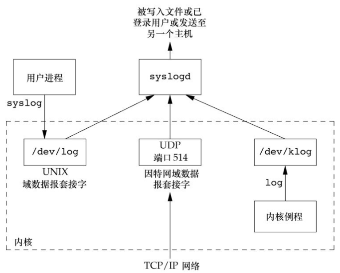

# 守护进程

守护进程（daemon）是生存期长的一种进程。它们常常在系统引导装入时启动，仅在系统关闭时才终止。因为它们没有控制终端，所以说它们是在后台运行的。UNIX 系统有很多守护进程，它们执行日常事务活动。

## 守护进程的特征

使用下列命令查看系统中各个进程的状态。

```bash
$ ps -axj
  PPID    PID   PGID    SID TTY       TPGID STAT   UID   TIME COMMAND
     0      1      1      1 ?            -1 Ss       0   0:06 /sbin/init auto automatic-ubiquity noprompt
     0      2      0      0 ?            -1 S        0   0:00 [kthreadd]
     2      4      0      0 ?            -1 I<       0   0:00 [kworker/0:0H]
     2      6      0      0 ?            -1 I<       0   0:00 [mm_percpu_wq]
     2      7      0      0 ?            -1 S        0   0:00 [ksoftirqd/0]
     2      8      0      0 ?            -1 I        0   3:16 [rcu_sched]
     2      9      0      0 ?            -1 I        0   0:00 [rcu_bh]
     2     10      0      0 ?            -1 S        0   0:00 [migration/0]
     2     11      0      0 ?            -1 S        0   0:00 [watchdog/0]
......
```

选项 `-a` 显示由其他用户所拥有的进程的状态,`-x`显示没有控制终端的进程状态，`-j`显示与作业有关的信息：会话 ID、进程组 ID、控制终端以及终端进程组 ID。

系统进程依赖于操作系统实现。父进程ID 为0 的各进程通常是内核进程，它们作为系统引导装入过程的一部分而启动。（init是个例外，它是一个由内核在引导装入时启动的用户层次的命令。）内核进程是特殊的，通常存在于系统的整个生命期中。它们以超级用户特权运行，无控制终端，无命令行。

在ps 的输出实例中，内核守护进程的名字出现在方括号中。该版本的Linux使用一个名为kthreadd的特殊内核进程来创建其他内核进程，所以kthreadd 表现为其他内核进程的父进程。对于需要在进程上下文执行工作但却不被用户层进程上下文调用的每一个内核组件，通常有它自己的内核守护进程。

大多数守护进程都以超级用户（root）特权运行。所有的守护进程都没有控制终端，其终端名设置为问号。内核守护进程以无控制终端方式启动。用户层守护进程缺少控制终端可能是守护进程调用了setsid的结果。大多数用户层守护进程都是进程组的组长进程以及会话的首进程，而且是这些进程组和会话中的唯一进程（rsyslogd 是一个例外）。最后，应当引起注意的是用户层守护进程的父进程是init进程。

## 编程规则

在编写守护进程程序时需遵循一些基本规则，以防止产生不必要的交互作用。下面先说明这些规则，然后给出一个按照这些规则编写的函数daemonize。

1. 首先要做的是调用umask将文件模式创建屏蔽字设置为一个已知值（通常是0）。由继承得来的文件模式创建屏蔽字可能会被设置为拒绝某些权限。如果守护进程要创建文件，那么它可能要设置特定的权限。例如，若守护进程要创建组可读、组可写的文件，继承的文件模式创建屏蔽字可能会屏蔽上述两种权限中的一种，而使其无法发挥作用。另一方面，如果守护进程调用的库函数创建了文件，那么将文件模式创建屏蔽字设置为一个限制性更强的值（如 007）可能会更明智，因为库函数可能不允许调用者通过一个显式的函数参数来设置权限。

2. 调用fork，然后使父进程exit。这样做实现了下面几点。第一，如果该守护进程是作为一条简单的shell命令启动的，那么父进程终止会让shell认为这条命令已经执行完毕。第二，虽然子进程继承了父进程的进程组 ID，但获得了一个新的进程 ID，这就保证了子进程不是一个进程组的组长进程。这是下面将要进行的setsid调用的先决条件。

3. 调用setsid创建一个新会话。然后执行9.5节中列出的3个步骤，使调用进程：（a）成为新会话的首进程，（b）成为一个新进程组的组长进程，（c）没有控制终端。

4. 将当前工作目录更改为根目录。从父进程处继承过来的当前工作目录可能在一个挂载的文件系统中。因为守护进程通常在系统再引导之前是一直存在的，所以如果守护进程的当前工作目录在一个挂载文件系统中，那么该文件系统就不能被卸载。

5. 关闭不再需要的文件描述符。这使守护进程不再持有从其父进程继承来的任何文件描述符（父进程可能是shell进程，或某个其他进程）。可以使用 open_max 函数或getrlimit函数来判定最高文件描述符值，并关闭直到该值的所有描述符。

6. 某些守护进程打开/dev/null使其具有文件描述符0、1和2，这样，任何一个试图读标准输入、写标准输出或标准错误的库例程都不会产生任何效果。因为守护进程并不与终端设备相关联，所以其输出无处显示，也无处从交互式用户那里接收输入。即使守护进程是从交互式会话启动的，但是守护进程是在后台运行的，所以登录会话的终止并不影响守护进程。如果其他用户在同一终端设备上登录，我们不希望在该终端上见到守护进程的输出，用户也不期望他们在终端上的输入被守护进程读取。

例子，初始化一个守护进程。
```cpp
#include "apue.h"
#include <syslog.h>
#include <fcntl.h>
#include <sys/resource.h>

void
daemonize(const char *cmd)
{
	int					i, fd0, fd1, fd2;
	pid_t				pid;
	struct rlimit		rl;
	struct sigaction	sa;

	/*
	 * Clear file creation mask.
	 */
	umask(0);

	/*
	 * Get maximum number of file descriptors.
	 */
	if (getrlimit(RLIMIT_NOFILE, &rl) < 0)
		err_quit("%s: can't get file limit", cmd);

	/*
	 * Become a session leader to lose controlling TTY.
	 */
	if ((pid = fork()) < 0)
		err_quit("%s: can't fork", cmd);
	else if (pid != 0) /* parent */
		exit(0);
	setsid();

	/*
	 * Ensure future opens won't allocate controlling TTYs.
	 */
	sa.sa_handler = SIG_IGN;
	sigemptyset(&sa.sa_mask);
	sa.sa_flags = 0;
	if (sigaction(SIGHUP, &sa, NULL) < 0)
		err_quit("%s: can't ignore SIGHUP", cmd);
	if ((pid = fork()) < 0)
		err_quit("%s: can't fork", cmd);
	else if (pid != 0) /* parent */
		exit(0);

	/*
	 * Change the current working directory to the root so
	 * we won't prevent file systems from being unmounted.
	 */
	if (chdir("/") < 0)
		err_quit("%s: can't change directory to /", cmd);

	/*
	 * Close all open file descriptors.
	 */
	if (rl.rlim_max == RLIM_INFINITY)
		rl.rlim_max = 1024;
	for (i = 0; i < rl.rlim_max; i++)
		close(i);

	/*
	 * Attach file descriptors 0, 1, and 2 to /dev/null.
	 */
	fd0 = open("/dev/null", O_RDWR);
	fd1 = dup(0);
	fd2 = dup(0);

	/*
	 * Initialize the log file.
	 */
	openlog(cmd, LOG_CONS, LOG_DAEMON);
	if (fd0 != 0 || fd1 != 1 || fd2 != 2) {
		syslog(LOG_ERR, "unexpected file descriptors %d %d %d",
		  fd0, fd1, fd2);
		exit(1);
	}
}
```
若daemonize函数由main程序调用，然后main程序进入休眠状态，那么可以用ps命令检查该守护进程的状态。

## 出错记录

守护进程存在的一个问题是如何处理出错消息。因为它本就不应该有控制终端，所以不能只是简单地写到标准错误上。

自4.2BSD以来，BSD的syslog设施得到了广泛的应用。大多数守护进程都使用这一设施。下图显示了syslog设施的详细组织结构。



有以下3种产生日志消息的方法。
1. 内核例程可以调用 log 函数。任何一个用户进程都可以通过打开（open）并读取（read）/dev/klog设备来读取这些消息。因为我们无意编写内核例程，所以不再进一步说明此函数。

2. 大多数用户进程（守护进程）调用syslog(3)函数来产生日志消息。我们将在下面说明其调用序列。这使消息被发送至UNIX域数据报套接字/dev/log。

3. 无论一个用户进程是在此主机上，还是在通过TCP/IP网络连接到此主机的其他主机上，都可将日志消息发向UDP端口514。注意，syslog函数从不产生这些UDP数据报，它们要求产生此日志消息的进程进行显式的网络编程。

通常，syslogd守护进程读取所有3种格式的日志消息。此守护进程在启动时读一个配置文件，其文件名一般为/etc/syslog.conf，该文件决定了不同种类的消息应送向何处。

该设施的接口是syslog函数。
```cpp
#include <syslog.h>
void openlog(const char *ident, int option, int facility);
void syslog(int priority, const char *format, ...);
void closelog(void);
int setlogmask(int maskpri);
```
返回值：前日志记录优先级屏蔽字值

调用openlog是可选择的。如果不调用openlog，则在第一次调用syslog时，自动调用openlog。调用 closelog也是可选择的，因为它只是关闭被用于与syslogd守护进程进行通信的描述符。

调用openlog使我们可以指定一个ident，以后，此ident将被加至每则日志消息中。ident一般是程序的名称（如cron、inetd）。option参数是指定各种选项的位屏蔽。

openlog的option参数

| option     | XSI | 说明                                                                                                                                                                |
| ---------- | --- | ------------------------------------------------------------------------------------------------------------------------------------------------------------------- |
| LOG_CONS   | x   | 若日志消息不能通过UNIX域数据报送至 syslogd,则将该消息写至控制台                                                                                                     |
| LOG_NDELAY | x   | 立即打开至syslogd守护进程的UNIX域数据报套接字，不要等到第一条消息已经被记录时再打开。通常，在记录第一条消息之前，不打开该套接字                                     |
| LOG_NOWAIT | x   | 不要等待在将消息记入日志过程中可能已创建的子进程。因为在syslog调用wait时，应用程序可能已获得了子进程的状态，这种处理阻止了与捕捉SIGCHLD信号的应用程序之间产生的冲突 |
| LOG_ODELAY | x   | 在第一条消息被记录之前延迟打开至syslogd守护进程的连接                                                                                                               |
| LOG_PERROR |     | 除将日志消息发送给syslogd以外，还将它写至标准出错（在Solaris上不可用）                                                                                              |
| LOG_PID    | x   | 记录每条消息都要包含进程ID。此选项可供对每个不同的请求都fork一个子进程的守护进程使用（与从不调用fork的守护进程相比较，如syslogd)                                    |

设置facility参数的目的是可以让配置文件说明，来自不同设施的消息将以不同的方式进行处理。如果不调用openlog，或者以facility为0来调用它，那么在调用syslog时，可将facility作为priority参数的一个部分进行说明。openlog的facility参数值选取自下表。

调用syslog产生一个日志消息。其priority参数是facility和level的组合，它们可选取的值分别列于facility和level中。level值按优先级从最高到最低依次排列。

openlog的facility参数。

| facility     | XSI      | 说明                                       |
| ------------ | -------- | ------------------------------------------ |
| LOG_AUDIT    |          | 审计设施                                   |
| LOG_AUTH     |          | 授权程序：login、su、getty等               |
| LOG_AUTHPRIV |          | 与LOG_AUTH相同，但写日志文件时具有权限限制 |
| LOG_CONSOLE  |          | 消息写入/dev/console                       |
| LOG_CRON     |          | cron和at                                   |
| LOG_DAEMON   |          | 系统守护进程：inetd、routed等              |
| LOG_FTP      |          | FTP守程（ftpd）                            |
| LOG_KERN     |          | 内核产生的消息                             |
| LOG_LOCALO   | x        | 保留由本地使用                             |
| LOG_LOCAL1   | x        | 保留由本地使用                             |
| LOG_LOCAL2   | x        | 保留由本地使用                             |
| LOG_LOCAL3   | x        | 保留由本地使用                             |
| LOG_LOCAL4   | x        | 保留由本地使用                             |
| LOG_LOCAL5   | x        | 保留由本地使用                             |
| LOG_LOCAL6   | x        | 保留由本地使用                             |
| LOG_LOCAL7   | x        | 保留由本地使用                             |
| LOG_LPR      |          | 行式打印机系统：1pd、1pc等                 |
| LOG_MAIL     |          | 邮件系统                                   |
| LOG_NEWS     |          | Usenet网络新闻系统                         |
| LOG_NTP      |          | 网络时间协议系统                           |
| LOG_SECURITY |          | 安全子系统                                 |
| LOG_SYSLOG   |          | syslogd守护进程本身                        |
| LOG_USER     | x        | 来自其他用户进程的消息（默认）             |
| LOG_UUCP     | UUCP系统 |                                            |

syslog中的level（按序排列）

| level       | 说明                               |
| ----------- | ---------------------------------- |
| LOG_EMERG   | 紧急（系统不可使用）（最高优先级） |
| LOG_ALERT   | 必须立即修复的情况                 |
| LOG_CRIT    | 严重情况（如硬件设备出错）         |
| LOG_ERR     | 出错情况                           |
| LOG_WARNING | 警告情况                           |
| LOG_NOTICE  | 正常但重要的情况                   |
| LOG_INFO    | 信息性消息                         |
| LOG_DEBUG   | 调试消息（最低优先级）             |

将format参数以及其他所有参数传至vsprintf函数以便进行格式化。在format中，每个出现的%m字符都先被代换成与errno值对应的出错消息字符串（strerror）。

setlogmask函数用于设置进程的记录优先级屏蔽字。它返回调用它之前的屏蔽字。当设置了记录优先级屏蔽字时，各条消息除非已在记录优先级屏蔽字中进行了设置，否则将不被记录。注意，试图将记录优先级屏蔽字设置为0并不会有什么作用。

除了syslog，很多平台还提供它的一种变体来处理可变参数列表。
```cpp
#include <syslog.h>
#include <stdarg.h>
void vsyslog(int priority, const char *format, va_list arg);
```
大多数syslog实现将使消息短时间处于队列中。如果在此段时间中有重复消息到达，那么syslog 守护进程不会把它写到日志记录中，而是会打印输出一条类似于“上一条消息重复了N次”的消息。

## 单实例守护进程
为了正常运作，某些守护进程会实现为，在任一时刻只运行该守护进
程的一个副本。

例子，保证只运行一个守护进程的一个副本。
```cpp
#include <unistd.h>
#include <stdlib.h>
#include <fcntl.h>
#include <syslog.h>
#include <string.h>
#include <errno.h>
#include <stdio.h>
#include <sys/stat.h>

#define LOCKFILE "/var/run/daemon.pid"
#define LOCKMODE (S_IRUSR|S_IWUSR|S_IRGRP|S_IROTH)

extern int lockfile(int);

int
already_running(void)
{
	int		fd;
	char	buf[16];

	fd = open(LOCKFILE, O_RDWR|O_CREAT, LOCKMODE);
	if (fd < 0) {
		syslog(LOG_ERR, "can't open %s: %s", LOCKFILE, strerror(errno));
		exit(1);
	}
	if (lockfile(fd) < 0) {
		if (errno == EACCES || errno == EAGAIN) {
			close(fd);
			return(1);
		}
		syslog(LOG_ERR, "can't lock %s: %s", LOCKFILE, strerror(errno));
		exit(1);
	}
	ftruncate(fd, 0);
	sprintf(buf, "%ld", (long)getpid());
	write(fd, buf, strlen(buf)+1);
	return(0);
}
```
守护进程的每个副本都将试图创建一个文件，并将其进程 ID 写到该文件中。这使管理人员易于标识该进程。如果该文件已经加了锁，那么lockfile函数将失败。

## 守护进程的惯例
在UNIX系统中，守护进程遵循下列通用惯例。
- 若守护进程使用锁文件，那么该文件通常存储在/var/run目录中。然而需要注意的是，守护进程可能需要具有超级用户权限才能在此目录下创建文件。锁文件的名字通常是name.pid，其中，name是该守护进程或服务的名字。例如，cron守护进程锁文件的名字是/var/run/crond.pid。
- 若守护进程支持配置选项，那么配置文件通常存放在/etc目录中。配置文件的名字通常是name.conf，其中，name是该守护进程或服务的名字。例如，syslogd守护进程的配置文件通常是/etc/syslog.conf。
- 守护进程可用命令行启动，但通常它们是由系统初始化脚本之一（ `/etc/rc*` 或 `/etc/init.d/*` ）启动的。如果在守护进程终止时，应当自动地重新启动它，则我们可在/etc/inittab中为该守护进程包括respawn记录项，这样，init就将重新启动该守护进程。（假定系统使用SystemV风格的init命令。）
- 若一个守护进程有一个配置文件，那么当该守护进程启动时会读该文件，但在此之后一般就不会再查看它。若某个管理员更改了配置文件，那么该守护进程可能需要被停止，然后再启动，以使配置文件的更改生效。为避免此种麻烦，某些守护进程将捕捉SIGHUP信号，当它们接收到该信号时，重新读配置文件。因为守护进程并不与终端相结合，它们或者是无控制终端的会话首进程，或者是孤儿进程组的成员，所以守护进程没有理由期望接收SIGHUP。于是，守护进程可以安全地重复使用SIGHUP。

例子，守护进程重读配置文件。
```cpp
#include "apue.h"
#include <pthread.h>
#include <syslog.h>

sigset_t	mask;

extern int already_running(void);

void
reread(void)
{
	/* ... */
}

void *
thr_fn(void *arg)
{
	int err, signo;

	for (;;) {
		err = sigwait(&mask, &signo);
		if (err != 0) {
			syslog(LOG_ERR, "sigwait failed");
			exit(1);
		}

		switch (signo) {
		case SIGHUP:
			syslog(LOG_INFO, "Re-reading configuration file");
			reread();
			break;

		case SIGTERM:
			syslog(LOG_INFO, "got SIGTERM; exiting");
			exit(0);

		default:
			syslog(LOG_INFO, "unexpected signal %d\n", signo);
		}
	}
	return(0);
}

int
main(int argc, char *argv[])
{
	int					err;
	pthread_t			tid;
	char				*cmd;
	struct sigaction	sa;

	if ((cmd = strrchr(argv[0], '/')) == NULL)
		cmd = argv[0];
	else
		cmd++;

	/*
	 * Become a daemon.
	 */
	daemonize(cmd);

	/*
	 * Make sure only one copy of the daemon is running.
	 */
	if (already_running()) {
		syslog(LOG_ERR, "daemon already running");
		exit(1);
	}

	/*
	 * Restore SIGHUP default and block all signals.
	 */
	sa.sa_handler = SIG_DFL;
	sigemptyset(&sa.sa_mask);
	sa.sa_flags = 0;
	if (sigaction(SIGHUP, &sa, NULL) < 0)
		err_quit("%s: can't restore SIGHUP default");
	sigfillset(&mask);
	if ((err = pthread_sigmask(SIG_BLOCK, &mask, NULL)) != 0)
		err_exit(err, "SIG_BLOCK error");

	/*
	 * Create a thread to handle SIGHUP and SIGTERM.
	 */
	err = pthread_create(&tid, NULL, thr_fn, 0);
	if (err != 0)
		err_exit(err, "can't create thread");

	/*
	 * Proceed with the rest of the daemon.
	 */
	/* ... */
	exit(0);
}
```
该程序调用了图13-1中的daemonize来初始化守护进程。从该函数返回后，调用图13-6中的already_running函数以确保该守护进程只有一个副本在运行。到达这一点时，SIGHUP信号仍被忽略，所以需恢复对该信号的系统默认处理方式；否则调用sigwait的线程决不会见到该信号。

例子，守护进程重读配置文件的另一种实现。
```cpp
#include "apue.h"
#include <syslog.h>
#include <errno.h>

extern int lockfile(int);
extern int already_running(void);

void
reread(void)
{
	/* ... */
}

void
sigterm(int signo)
{
	syslog(LOG_INFO, "got SIGTERM; exiting");
	exit(0);
}

void
sighup(int signo)
{
	syslog(LOG_INFO, "Re-reading configuration file");
	reread();
}

int
main(int argc, char *argv[])
{
	char				*cmd;
	struct sigaction	sa;

	if ((cmd = strrchr(argv[0], '/')) == NULL)
		cmd = argv[0];
	else
		cmd++;

	/*
	 * Become a daemon.
	 */
	daemonize(cmd);

	/*
	 * Make sure only one copy of the daemon is running.
	 */
	if (already_running()) {
		syslog(LOG_ERR, "daemon already running");
		exit(1);
	}

	/*
	 * Handle signals of interest.
	 */
	sa.sa_handler = sigterm;
	sigemptyset(&sa.sa_mask);
	sigaddset(&sa.sa_mask, SIGHUP);
	sa.sa_flags = 0;
	if (sigaction(SIGTERM, &sa, NULL) < 0) {
		syslog(LOG_ERR, "can't catch SIGTERM: %s", strerror(errno));
		exit(1);
	}
	sa.sa_handler = sighup;
	sigemptyset(&sa.sa_mask);
	sigaddset(&sa.sa_mask, SIGTERM);
	sa.sa_flags = 0;
	if (sigaction(SIGHUP, &sa, NULL) < 0) {
		syslog(LOG_ERR, "can't catch SIGHUP: %s", strerror(errno));
		exit(1);
	}

	/*
	 * Proceed with the rest of the daemon.
	 */
	/* ... */
	exit(0);
}
```
在初始化守护进程后，我们为SIGHUP和SIGTERM配置了信号处理程序。可以将重读逻辑放在信号处理程序中，也可以只在信号处理程序中设置一个标志，并由守护进程的主线程完成所有的工作。

## 客户进程-服务器进程模型

守护进程常常用作服务器进程。确实，我们可以称图13-2中的syslogd进程为服务器进程，用户进程（客户进程）用UNIX域数据报套接字向其发送消息。

在服务器进程中调用fork然后exec另一个程序来向客户进程提供服务是很常见的。这些服务器进程通常管理着多个文件描述符：通信端点、配置文件、日志文件和类似的文件。最好的情况下，让子进程中的这些文件描述符保持打开状态并无大碍，因为它们很可能不会被在子进程中执行的程序所使用，尤其是那些与服务器端无关的程序。最坏情况下，保持它们的打开状态会导致安全问题——被执行的程序可能有一些恶意行为，如更改服务器端配置文件或欺骗客户端程序使其认为正在与服务器端通信，从而获取未授权的信息。

解决此问题的一个简单方法是对所有被执行程序不需要的文件描述符设置执行时关闭（close-on-exec）标志。图13-9展示了一个可以用来在服务器端进程中执行上述工作的函数。

例子，设置执行时关闭标志。
```cpp

```
