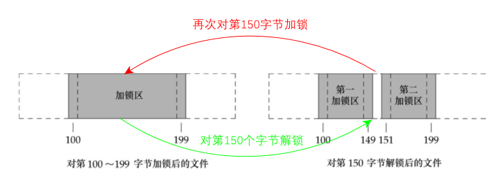
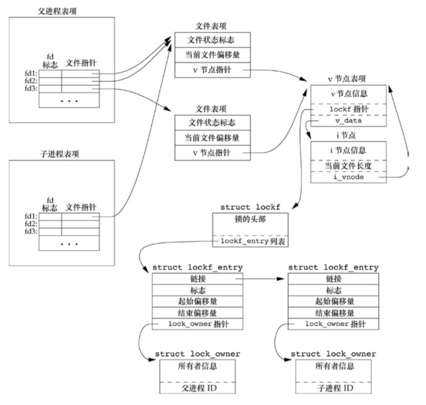
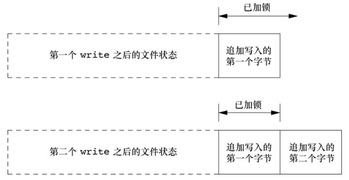

## 非阻塞 `I/O`

非阻塞 `I/O` 使我们可以发出 `open`、`read` 和 `write` 这样的 `I/O` 操作，并使这些操作不会永远阻塞。如果这种操作不能完成，则调用立即出错返回，表示该操作如继续执行将阻塞。

对于一个给定的描述符，有两种为其指定非阻塞 `I/O` 的方法。

1. 如果调用 `open` 获得描述符，则可指定 `O_NONBLOCK` 标志。
2. 对于已经打开的一个描述符，则可调用 `fcntl`，由该函数打开 `O_NONBLOCK` 文件状态标志。

`POSIX.1` 要求，对于一个非阻塞的描述符如果无数据可读，则 `read` 返回 −1，`errno` 被设置为 `EAGAIN`。

例子， 长的非阻塞 `write`。

```cpp
#include <fcntl.h>
#include <stdio.h>
#include <stdlib.h>
#include <unistd.h>
#include <errno.h>

void clr_fl(int fd, int flags){
	int val;
	if((val = fcntl(fd, F_GETFL, 0)) < 0){
		perror("fcntl F_GETFL error");
		exit(1);
	}
	val &= ~flags; // 清除标志
	if(fcntl(fd, F_SETFL, val) < 0){
		perror("fcntl F_SETFL, error");
		exit(1);
	}
}

void set_fl(int fd, int flags){
	int val;
	if((val = fcntl(fd, F_GETFL, 0)) < 0){
		perror("fcntl F_GETFL error");
		exit(1);
	}
	val |= flags; // 设置标志
	if(fcntl(fd, F_SETFL, val) < 0){
		perror("fcntl F_SETFL, error");
		exit(1);
	}
}

char buf[500000];

int main(){
	int ntowrite, nwrite;
	char *ptr;

	ntowrite = read(STDIN_FILENO, buf, sizeof(buf));
	fprintf(stderr, "read %d bytes\n", ntowrite);

	set_fl(STDOUT_FILENO, O_NONBLOCK); // 设置非阻塞

	ptr = buf;
	while(ntowrite > 0){
		errno = 0;
		nwrite = write(STDOUT_FILENO, ptr, ntowrite);
		fprintf(stderr, "nwrite = %d, errno = %d\n", nwrite, errno);

		if(nwrite > 0){
			ptr += nwrite;
			ntowrite -= nwrite;
		}
	}
	clr_fl(STDOUT_FILENO, O_NONBLOCK); //清除非阻塞
	return 0;
}
```

编译运行：

```bash
$ ls -l file.txt
-rw-rw-r-- 1 ckcat ckcat 1880192 Sep 21 18:20 file.txt
$ ./a.out < file.txt >temp.file
read 500000 bytes
nwrite = 500000, errno = 0

$ ./a.out <file.txt 2>stderr.out
$ cat stderr.out
read 500000 bytes
nwrite = 148493, errno = 0
nwrite = -1, errno = 11
nwrite = -1, errno = 11
nwrite = -1, errno = 11
...
nwrite = 8168, errno = 0
nwrite = 7775, errno = 0
nwrite = 7785, errno = 0
nwrite = 8399, errno = 0
nwrite = 3913, errno = 0
nwrite = 7821, errno = 0
nwrite = 7696, errno = 0
nwrite = 43444, errno = 0
```

程序是一个非阻塞 `I/O` 的实例，它从标准输入读 500 000 字节，并试图将它们写到标准输出上。该程序先将标准输出设置为非阻塞的，然后用 `for` 循环进行输出，每次 `write` 调用的结果都在标准错误上打印。

若标准输出是普通文件，则可以期望 `write` 只执行一次。若标准输出是终端，则期望 `write` 有时返回小于 500 000 的一个数字，有时返回错误。

在该系统（ubuntu 20.04）上，`errno` 值 35 对应的是 `EAGAIN`。

```c
#define	EAGAIN		11	/* Try again */
```

## 记录锁

记录锁（record locking）的功能是：当第一个进程正在读或修改文件的某个部分时，使用记录锁可以阻止其他进程修改同一文件区。

### 1. 历史

对早期 UNIX 系统的其中一个批评是它们不能用来运行数据库系统，其原因是这些系统不支持对部分文件加锁。在 UNIX 系统寻找进入商用计算环境的途径时，很多系统开发小组以各种不同方式增加了对记录锁的支持。

`POSIX.1` 标准的基础是 `fcntl` 方法。下表列出了各种系统提供的不同形式的记录锁。

| 系统            | 建议性 | 强制性 | fcntl | lockf | flock |
| --------------- | ------ | ------ | ----- | ----- | ----- |
| SUS             | •      |        | •     | XSI   |       |
| XSI             | •      |        | •     | •     | •     |
| FreeBSD 8.0     | •      |        | •     | •     | •     |
| Linux 3.2.0     | •      | •      | •     | •     | •     |
| Mac OS X 10.6.8 | •      |        | •     | •     | •     |
| Solaris 10      | •      | •      | •     | •     | •     |

### 2. `fcntl` 记录锁

`fcntl` 函数的原型。

```cpp
#include <fcnt1.h>
int fcnt1(int fd, int cmd, .../* struct flock *flockptr */);
```

返回值：

- 若成功，依赖于 cmd，
- 否则，返回 −1。

其中，参数 `fd` 是文件描述符，`cmd` 是命令参数，第三个参数 `flockptr` 是一个指向 `flock` 结构的指针。

```cpp
struct flock {
    short l_type;   // 类型：F_RDLCK、F_WRLCK 或 F_UNLCK
    short l_whence; // 起始位置：SEEK_SET、SEEK_CUR 或 SEEK_END
    off_t l_start;  // 锁定的起始位置
    off_t l_len;    // 锁定的长度
    pid_t l_pid;    // 持有锁的进程ID（仅用于 F_GETLK 命令）
};
```

对 `flock` 结构说明如下。

- 所希望的锁类型：`F_RDLCK`（共享读锁）、`F_WRLCK`（独占性写锁）或 `F_UNLCK`（解锁一个区域）。
- 要加锁或解锁区域的起始字节偏移量（`l_start` 和 `l_whence`）。
- 区域的字节长度（`l_len`）。
- 进程的 ID（`l_pid`）持有的锁能阻塞当前进程（仅由 `F_GETLK` 返回）。

关于加锁或解锁区域的说明还要注意下列几项规则。

- 指定区域起始偏移量的两个元素与 `lseek` 函数中最后两个参数类似。
- 锁可以在当前文件尾端处开始或者越过尾端处开始，但是不能在文件起始位置之前开始。
- 如若 `l_len` 为 `0`，则表示锁的范围可以扩展到最大可能偏移量。这意味着不管向该文件中追加写了多少数据，它们都可以处于锁的范围内，而且起始位置可以是文件中的任意一个位置。
- 为了对整个文件加锁，我们设置 `l_start` 和 `l_whence` 指向文件的起始位置，并且指定长度 `l_len`为 0。

上面提到了两种类型的锁：共享读锁（`F_RDLCK`）和独占性写锁（`F_WRLCK`）。基本规则是：任意多个进程在一个给定的字节上可以有一把共享的读锁，但是在一个给定字节上只能有一个进程有一把独占写锁。进一步而言，如果在一个给定字节上已经有一把或多把读锁，则不能在该字节上再加写锁；如果在一个字节上已经有一把独占性写锁，则不能再对它加任何读锁。下图中示出了这些兼容性规则。


**上面说明的兼容性规则适用于不同进程提出的锁请求，并不适用于单个进程提出的多个锁请求。** 如果一个进程对一个文件区间已经有了一把锁，后来该进程又企图在同一文件区间再加一把锁，那么新锁将替换已有锁。

加读锁时，该描述符必须是读打开。加写锁时，该描述符必须是写打开。

常见的命令参数包括：

- `F_GETLK`：检查特定锁定是否已经被其他锁定所阻塞，如果存在一个锁会阻止我们创建锁定，则该已存在的锁的信息会覆盖 `flockptr` 所指向的信息。如果不存在阻止我们创建锁定的锁，则除了将 `l_type` 成员设置为 `F_UNLCK` 之外，`flockptr` 指向的结构保持不变。
- `F_SETLK`：设置锁定，如果无法获取锁定则立即返回，此时 `errno` 设置为 `EAGAIN`。
- `F_SETLKW`：这个命令是 `F_SETLK` 的阻塞版本，如果无法获取锁定，则调用进程进入睡眠状态等待直到锁定可用。进程会在以下情况下被唤醒：锁定变得可用，或者被信号中断。

应当了解，用 `F_GETLK` 测试能否建立一把锁，然后用 `F_SETLK` 或 `F_SETLKW` 企图建立那把锁，这两者不是一个原子操作。因此不能保证在这两次 `fcntl` 调用之间不会有另一个进程插入并建立一把相同的锁。如果不希望在等待锁变为可用时产生阻塞，就必须处理由 `F_SETLK` 返回的可能的出错。

在设置或释放文件上的一把锁时，系统按要求组合或分裂相邻区。如下图所示，对第 150 字节解锁，则内核维护两个锁，再次加锁，则把 3 个相邻的加锁取合并。



例子，加锁或解锁一个文件区域的函数。

```cpp
#include <fcntl.h>

int lock_reg(int fd, int cmd, int type, off_t offset, int whence, off_t len){
	struct flock lock;
	lock.l_type = type;
	lock.l_start = offset;
	lock.l_whence = whence;
	lock.l_len = len;

	return fcntl(fd, cmd, &lock);
}
```

因为大多数锁调用是加锁或解锁一个文件区域（命令 `F_GETLK` 很少使用），故通常使用下列 5 个宏中的一个。

```cpp
#define	read_lock(fd, offset, whence, len) \
			lock_reg((fd), F_SETLK, F_RDLCK, (offset), (whence), (len))
#define	readw_lock(fd, offset, whence, len) \
			lock_reg((fd), F_SETLKW, F_RDLCK, (offset), (whence), (len))
#define	write_lock(fd, offset, whence, len) \
			lock_reg((fd), F_SETLK, F_WRLCK, (offset), (whence), (len))
#define	writew_lock(fd, offset, whence, len) \
			lock_reg((fd), F_SETLKW, F_WRLCK, (offset), (whence), (len))
#define	un_lock(fd, offset, whence, len) \
			lock_reg((fd), F_SETLK, F_UNLCK, (offset), (whence), (len))
```

例子，测试一把锁。

```cpp
#include <fcntl.h>
#include <stdio.h>
#include <stdlib.h>

pid_t lock_test(int fd, int type, off_t offset, int whence, off_t len){
	struct flock lock;
	lock.l_type = type;
	lock.l_start = offset;
	lock.l_whence = whence;
	lock.l_len = len;

	if(fcntl(fd, F_GETLK, &lock) < 0){
		perror("fcntl error");
		exit(1);
	}
	if(lock.l_type == F_UNLCK)
		return 0;
	return lock.l_pid;
}
```

如果存在一把锁，它阻塞由参数指定的锁请求，则此函数返回持有这把现有锁的进程的进程 ID，否则此函数返回 0。通常用下面两个宏来调用此函数。

```cpp
#define	is_read_lockable(fd, offset, whence, len) \
			(lock_test((fd), F_RDLCK, (offset), (whence), (len)) == 0)
#define	is_write_lockable(fd, offset, whence, len) \
			(lock_test((fd), F_WRLCK, (offset), (whence), (len)) == 0)
```

注意，进程不能使用 `lock_test` 函数测试它自己是否在文件的某一部分持有一把锁。`F_GETLK` 命令的定义说明，返回的信息适用于已经存在的锁，这些锁会阻止我们创建自己的锁。由于 `F_SETLK` 和 `F_SETLKW` 命令总是替换进程的现有锁（如果存在），我们永远无法在自己的锁上阻塞；因此，`F_GETLK` 命令将永远不会报告我们自己的锁。

例子，死锁。

如果两个进程相互等待对方持有并且不释放的资源时，则这两个进程就处于死锁状态。如果一个进程已经控制了文件中的一个加锁区域，然后它又试图对另一个进程控制的区域加锁，那么它就会休眠，在这种情况下，有发生死锁的可能性。

```cpp
#include <stdio.h>
#include <fcntl.h>
#include <stdlib.h>
#include <unistd.h>

extern void TELL_PARENT(pid_t);
extern void TELL_CHILD(pid_t);
extern void WAIT_PARENT(void);
extern void WAIT_CHILD(void);
extern void TELL_WAIT(void);

int lock_reg(int fd, int cmd, int type, off_t offset, int whence, off_t len){
	struct flock lock;
	lock.l_type = type;
	lock.l_start = offset;
	lock.l_whence = whence;
	lock.l_len = len;

	return fcntl(fd, cmd, &lock);
}

#define	writew_lock(fd, offset, whence, len) \
			lock_reg((fd), F_SETLKW, F_WRLCK, (offset), (whence), (len))
#define	FILE_MODE	(S_IRUSR | S_IWUSR | S_IRGRP | S_IROTH)

static void lockabyte(const char *name, int fd, off_t offset){
	if(writew_lock(fd, offset, SEEK_SET, 1) < 0){
		perror("writew_lock error");
		exit(1);
	}
	printf("%s: got the lock, byte %lld.\n", name, (long long)offset);
}

int main(){
	int fd;
	pid_t pid;

	// 创建一个文件并且写入 2 字节
	if((fd = creat("tmplock", FILE_MODE)) < 0){
		perror("creat error");
		exit(1);
	}
	if(write(fd, "ab", 2) != 2){
		perror("write error");
		exit(1);
	}

	TELL_WAIT();
	if((pid = fork()) < 0){
		perror("fork error");
		exit(1);
	}else if(pid == 0){ // 子进程
		lockabyte("child", fd, 0);
		TELL_PARENT(getppid());
		WAIT_PARENT();
		lockabyte("child", fd, 1);
	}else{ // 父进程
		lockabyte("parent", fd, 1);
		TELL_CHILD(pid);
		WAIT_CHILD();
		lockabyte("parent", fd, 0);
	}
	return 0;
}
```

编译运行：

```bash
$ gcc 04deadlock.c tellwait.c
$ ./a.out
parent: got the lock, byte 1.
child: got the lock, byte 0.
writew_lock error: Resource deadlock avoided
child: got the lock, byte 1.
```

子进程对第 0 字节加锁，父进程对第 1 字节加锁。然后，它们中的每一个又试图对对方已经加锁的字节加锁，此时就会出现死锁。

检测到死锁时，内核必须选择一个进程接收出错返回，不同的系统实现不同。

### 3. 锁的隐含继承和释放

关于记录锁的自动继承和释放有 3 条规则。

1. 锁与进程和文件两者相关联。这有两重含义：第一重很明显，当一个进程终止时，它所建立的锁全部释放；第二重则不太明显，无论一个描述符何时关闭，该进程通过这一描述符引用的文件上的任何一把锁都会释放。

2. 由 `fork` 产生的子进程不继承父进程所设置的锁。这意味着，若一个进程得到一把锁，然后调用 `fork`，那么对于父进程获得的锁而言，子进程被视为另一个进程。对于通过 `fork` 从父进程处继承过来的描述符，子进程需要调用 `fcntl` 才能获得它自己的锁。这个约束是有道理的，因为锁的作用是阻止多个进程同时写同一个文件。如果子进程通过 `fork` 继承父进程的锁，则父进程和子进程就可以同时写同一个文件。

3. 在执行 `exec` 后，新程序可以继承原执行程序的锁。但是注意，如果对一个文件描述符设置了执行时关闭标志，那么当作为 `exec` 的一部分关闭该文件描述符时，将释放相应文件的所有锁。

### 4. FreeBSD 实现

考虑一个进程，它执行下列语句：

```c
fd1 = open(pathname, ...);
write_lock(fd1, 0, SEEK_SET, 1);
/* parent write locks byte 0 */
if ((pid = fork()) > 0) {
	/* parent */
	fd2 = dup(fd1);
	fd3 = open(pathname, ...);
} else if (pid == 0) {
	read_lock(fd1, 1, SEEK_SET, 1); /* child read locks byte 1 */
}
pause();
```

下图显示了父进程和子进程暂停（执行 pause()）后的数据结构情况。



图中显示了两个 `lockf` 结构，一个是由父进程调用 `write_lock` 形成的，另一个则是由子进程调用 `read_lock` 形成的。每一个结构都包含了相应的进程 ID。

在父进程中，关闭 `fd1`、`fd2` 或 `fd3` 中的任意一个都将释放由父进程设置的写锁。在关闭这 3 个描述符中的任意一个时，内核会从该描述符所关联的 `i` 节点开始，逐个检查 `lockf` 链接表中的各项，并释放由调用进程持有的各把锁。内核并不清楚（也不关心）父进程是用这 3 个描述中的哪一个来设置这把锁的。

例子，在文件整体上加一把写锁。

```cpp
#include <unistd.h>
#include <fcntl.h>

int lockfile(int fd){
	struct flock fl;

	fl.l_type = F_WRLCK;
	fl.l_start = 0;
	fl.l_whence = SEEK_SET;
	fl.l_len = 0;
	return(fcntl(fd, F_SETLK, &fl));
}
```

另一种方法是用 `write_lock` 函数定义 `lockfile` 函数。

```c
#define lockfile(fd) write_lock((fd), 0, SEEK_SET, 0)
```

### 5. 在文件尾端加锁

在对相对于文件尾端的字节范围加锁或解锁时需要特别小心。大多数实现按照 `l_whence` 的 `SEEK_CUR` 或 `SEEK_END` 值，用 `l_start` 以及文件当前位置或当前长度得到绝对文件偏移量。但是，常常需要相对于文件的当前长度指定一把锁，但又不能调用 `fstat` 来得到当前文件长度，因为我们在该文件上没有锁。

考虑以下代码序列：

```c
writew_lock(fd, 0, SEEK_END, 0);
write(fd, buf, 1);
un_lock(fd, 0, SEEK_END);
write(fd, buf, 1);
```

该代码序列所做的可能并不是你所期望的。它得到一把写锁，该写锁从当前文件尾端起，包括以后可能追加写到该文件的任何数据。由此代码序列造成的文件锁状态如图所示：



当对文件的一部分加锁时，内核将指定的偏移量变换成绝对文件偏移量。另外，除了指定一个绝对偏移量（`SEEK_SET`）之外，`fcntl` 还允许我们相对于文件中的某个点指定该偏移量，这个点是指当前偏移量（`SEEK_CUR`）或文件尾端（`SEEK_END`）。当前偏移量和文件尾端可能会不断变化，而这种变化又不应影响现有锁的状态，所以内核必须独立于当前文件偏移量或文件尾端而记住锁。

### 6. 建议性锁和强制性锁

建议性锁是由应用程序主动请求和释放的锁。它通过 `fcntl()` 系统调用中的 `F_SETLK`、`F_SETLKW` 和 `F_GETLK` 命令来实现。建议性锁在内核中记录，并可以由其他进程查询，但内核不会强制执行建议性锁。

建议性锁可以是共享锁（读锁）或独占锁（写锁）：

- 共享锁（`SHARED`）允许多个进程同时获得读取访问权限。
- 独占锁（`EXCLUSIVE`）只允许一个进程以独占方式访问。

优点：

- 灵活性高，应用程序可以选择何时请求和释放锁。
- 可以根据需要对不同的文件进行不同类型的锁定。
- 可以设置非阻塞模式（`F_SETLK`）或阻塞模式（`F_SETLKW`）。

缺点：

- 锁的检查和使用完全由应用程序控制，容易出现错误和竞争条件。
- 无法阻止未遵循锁定规则的进程访问共享资源。

强制性锁是由内核强制执行的文件锁。与建议性锁不同，强制性锁不能由应用程序主动请求或释放，而是在打开文件时自动应用于所有访问该文件的进程。

强制性锁有两种类型：

- 读锁（`READ`）阻止其他进程对文件进行写操作。
- 写锁（`WRITE`）阻止其他进程对文件进行读和写操作。

优点：

- 内核强制执行锁定策略，确保进程按顺序访问共享资源。
- 可以防止不遵循锁定规则的进程访问共享资源。

缺点：

- 锁定策略由内核控制，应用程序无法控制锁定的逻辑。
- 需要特殊权限（如 `root` 权限）才能设置和管理强制性锁。

对一个特定文件打开其设置组 ID 位、关闭其组执行位便开启了对该文件的强制性锁机制。

强制性锁对其他进程的 `read` 和 `write` 的影响：

| 其他进程在该区域上持有的现有锁的类型 | 阻塞描述符 |         | 非阻塞描述符 |          |
| ------------------------------------ | ---------- | ------- | ------------ | -------- |
|                                      | `read`     | `write` | `read`       | `write`  |
| 读锁                                 | 允许       | 阻塞    | 允许         | `EAGAIN` |
| 写锁                                 | 阻塞       | 阻塞    | `EAGAIN`     | `EAGAIN` |

强制性锁是可以设法避开的，对该文件整体设置一把读锁，然后休眠一段时间，在这段休眠时间内，用 `ed` 编辑器对该文件进行编辑操作，而且编辑结果可以写回磁盘，对 `ed` 操作进行跟踪分析发现，`ed` 将新内容写到一个临时文件中，然后删除原文件，最后将临时文件名改为原文件名。强制性锁机制对 `unlink` 函数没有影响，于是这一切就发生了，在使用强制性锁时还需有所警惕。

例子，测试一个系统是否支持强制性锁机制。

```c
#include <stdio.h>
#include <errno.h>
#include <fcntl.h>
#include <sys/wait.h>
#include <stdlib.h>
#include <unistd.h>
#include <sys/types.h>
#include <sys/stat.h>

int lock_reg(int fd, int cmd, int type, off_t offset, int whence, off_t len);
void set_fl(int fd, int flags);

#define	read_lock(fd, offset, whence, len) \
			lock_reg((fd), F_SETLK, F_RDLCK, (offset), (whence), (len))
#define	write_lock(fd, offset, whence, len) \
			lock_reg((fd), F_SETLK, F_WRLCK, (offset), (whence), (len))

#define	FILE_MODE	(S_IRUSR | S_IWUSR | S_IRGRP | S_IROTH)

extern void TELL_PARENT(pid_t);
extern void TELL_CHILD(pid_t);
extern void WAIT_PARENT(void);
extern void WAIT_CHILD(void);
extern void	TELL_WAIT(void);

int main(int argc, char *argv[]){
	int fd;
	pid_t pid;
	char buf[5];
	struct stat statbuf;
	if(argc != 2){
		fprintf(stderr, "usage: %s filename\n", argv[0]);
		exit(1);
	}
	if((fd = open(argv[1], O_RDWR |O_CREAT | O_TRUNC, FILE_MODE)) < 0){
		perror("open error");
		exit(1);
	}
	if(write(fd, "abcdef", 6) != 6){
		perror("write error");
		exit(1);
	}
	// 开启设置组ID并且关闭组执行
	if(fstat(fd, &statbuf) < 0){
		perror("fstat error");
		exit(1);
	}
	if(fchmod(fd, (statbuf.st_mode & ~S_IXGRP) | S_ISGID) < 0){
		perror("fchmod error");
		exit(1);
	}

	TELL_WAIT();
	if((pid = fork()) < 0){
		perror("fork error");
		exit(1);
	}else if(pid > 0){
		// 父进程对整个文件进行写锁
		if(write_lock(fd, 0, SEEK_SET, 0) < 0){
			perror("write_lock error");
			exit(1);
		}
		TELL_CHILD(pid);
		if(waitpid(pid, NULL, 0) < 0){
			perror("waitpid error");
			exit(1);
		}
	}else{
		WAIT_PARENT();
		set_fl(fd, O_NONBLOCK);
		// 首先子进程对整个文件进行读锁，看看会有什么错误。
		if(read_lock(fd, 0, SEEK_SET, 0) != -1){
			perror("child: read_lock succeeded");
			exit(1);
		}
		printf("read_lock of already-locked region returns %d\n", errno);
		// 然后试图读强制性锁的文件内容
		if(lseek(fd, 0, SEEK_SET) == -1){
			perror("lseek error");
			exit(1);
		}
		if(read(fd, buf, 2) < 0){
			perror("read failed (mandatory locking works)");
			exit(1);
		}else{
			printf("read OK (no mandatory locking), buf = %2.2s\n", buf);
		}
	}
	return 0;
}

void set_fl(int fd, int flags){
	int val;
	if((val = fcntl(fd, F_GETFL, 0)) < 0){
		perror("fcntl F_GETFL error");
		exit(1);
	}
	val |= flags; // 设置标志
	if(fcntl(fd, F_SETFL, val) < 0){
		perror("fcntl F_SETFL, error");
		exit(1);
	}
}

int lock_reg(int fd, int cmd, int type, off_t offset, int whence, off_t len){
	struct flock lock;
	lock.l_type = type;
	lock.l_start = offset;
	lock.l_whence = whence;
	lock.l_len = len;

	return fcntl(fd, cmd, &lock);
}
```

编译运行：

```bash
$ uname -a
Linux ubuntu 5.15.0-84-generic #93~20.04.1-Ubuntu SMP Wed Sep 6 16:15:40 UTC 2023 x86_64 x86_64 x86_64 GNU/Linux

$ gcc 05mandatorylock.c tellwait.c
$ ./a.out tmp.lock
read_lock of already-locked region returns 11
read OK (no mandatory locking), buf = ab
```

此程序首先创建一个文件，并使强制性锁机制对其起作用。然后程序分出一个父进程和一个子进程。父进程对整个文件设置一把写锁，子进程则先将该文件的描述符设置为非阻塞的，然后企图对该文件设置一把读锁，我们期望这会出错返回，并希望看到系统返回是 `EACCES` 或 `EAGAIN`。接着，子进程将文件读、写位置调整到文件起点，并试图读（`read`）该文件。如果系统提供强制性锁机制，则 `read` 应返回 `EACCES` 或 `EAGAIN`（因为该描述符是非阻塞的），否则 `read` 返回所读的数据。

## `I/O` 多路复用

`I/O` 多路复用（`I/O Multiplexing`）是一种通过单个线程同时监视多个 `I/O` 操作的方法。它允许同时处理多个 `I/O` 事件，提高了系统的效率和可扩展性。

在传统的阻塞 `I/O` 模型中，每个 `I/O` 操作都会导致进程阻塞，直到操作完成。而在 `I/O` 多路复用模型中，使用一个系统调用（如 `select`、`poll`、`epoll`）来等待多个 `I/O` 事件的发生。当有任何一个 `I/O` 事件就绪时，该系统调用会返回，并指示哪些 `I/O` 事件已经就绪。然后程序可以根据就绪的事件类型进行相应的处理。

`I/O` 多路复用适用于需要同时处理多个 `I/O` 设备或连接的情况。例如，在服务器程序中，同时监听多个网络连接或文件描述符的输入和输出。通过使用 `I/O` 多路复用，可以避免使用多个线程或进程来处理每个 `I/O` 操作，从而减少资源消耗和提高系统的吞吐量。

常用的系统调用：

- `select`：最早的 `I/O` 多路复用函数，它使用 `fd_set` 的数据结构来管理要监听的文件描述符集合。
- `poll`：与 `select` 类似，但使用 `pollfd` 结构管理文件描述符集合。相比 `select`，`poll` 提供的 API 更加简洁。
- `epoll`：Linux 特有的 `I/O` 多路复用机制，基于事件驱动模型。使用 `epoll_create` 函数创建一个 `epoll` 实例，并使用 `epoll_ctl` 注册要监听的文件描述符。当有事件就绪时，可以调用 `epoll_wait` 来获取就绪的事件。

常见的 `I/O` 事件类型：

- 可读事件（`Read Event`）：表示对应的文件描述符已经有数据可以读取。
- 可写事件（`Write Event`）：表示对应的文件描述符可以写入数据。
- 异常事件（`Exception Event`）：表示对应的文件描述符发生异常情况，如连接中断或错误发生。

优点：

- 节约资源：通过单个线程同时处理多个 `I/O` 事件，避免了创建大量线程或进程的开销。
- 提高效率：能够及时响应多个 `I/O` 事件，提高系统的响应速度和吞吐量。
- 支持高并发：适用于需要同时处理大量客户端连接的服务器应用程序。

注意事项：

- 文件描述符限制：操作系统对单个进程可打开的文件描述符数量有限制，需要注意不超过此限制。
- 阻塞调用：`I/O` 多路复用系统调用本身是阻塞的，直到有 `I/O` 事件就绪才会返回。可以使用非阻塞 `I/O` 或多线程/进程结合使用以避免阻塞。

### 函数 `select` 和 `pselect`

在所有 `POSIX` 兼容的平台上，`select` 函数使我们可以执行 `I/O` 多路转接。传给 `select` 的参数告诉内核：

- 我们所关心的描述符；
- 对于每个描述符我们所关心的条件（是否想从一个给定的描述符读，是否想写一个给定的描述符，是否关心一个给定描述符的异常条件）；
- 愿意等待多长时间（可以永远等待、等待一个固定的时间或者根本不等待）。

从 `select` 返回时，内核告诉我们：

- 已准备好的描述符的总数量；
- 对于读、写或异常这 3 个条件中的每一个，哪些描述符已准备好。

使用这种返回信息，就可调用相应的 `I/O` 函数（一般是 `read` 或 `write`），并且确知该函数不会阻塞。

```cpp
#include <sys/select.h>
int select(int nfds, fd_set *readfds, fd_set *writefds,
           fd_set *exceptfds, struct timeval *timeout);
```

返回值：

- 准备就绪的描述符数目；若超时，返回 0；
- 若出错，返回 −1。

参数：

- `nfds`：要监视的文件描述符的最大值（加 1）。
- `readfds`：指向一个 `fd_set` 结构的指针，包含了要监视可读事件的文件描述符。
- `writefds`：指向一个 `fd_set` 结构的指针，包含了要监视可写事件的文件描述符。
- `exceptfds`：指向一个 `fd_set` 结构的指针，包含了要监视异常事件的文件描述符。
- `timeout`：指向 `struct timeval `结构的指针，用于设置超时值，控制 `select` 的阻塞行为。可以为 `NULL`，表示没有超时。

最后一个参数 `timeout` ，它指定愿意等待的时间长度，单位为秒和微秒。有以下 3 种情况。

- `tvptr == NULL` 永远等待。如果捕捉到一个信号则中断此无限期等待。当所指定的描述符中的一个已准备好或捕捉到一个信号则返回。如果捕捉到一个信号，则 `select` 返回-1，`errno` 设置为 `EINTR`。
- `tvptr->tv_sec == 0 && tvptr->tv_usec == 0` 根本不等待。测试所有指定的描述符并立即返回。这是轮询系统找到多个描述符状态而不阻塞 `select` 函数的方法。
- `tvptr->tv_sec != 0 || tvptr->tv_usec != 0` 等待指定的秒数和微秒数。当指定的描述符之一已准备好，或当指定的时间值已经超过时立即返回。如果在超时到期时还没有一个描述符准备好，则返回值是 0。与第一种情况一样，这种等待可被捕捉到的信号中断。

`fd_set` 数据类型是由实现选择的，它可以为每一个可能的描述符保持一位。我们可以认为它只是一个很大的字节数组。其唯一可以进行的处理是：分配一个这种类型的变量，将这种类型的一个变量值赋给同类型的另一个变量，或对这种类型的变量使用下列 4 个函数中的一个。

```cpp
#include <sys/select.h>
int FD_ISSET(int fd, fd_set *fdset);
void FD_CLR(int fd, fd_set *fdset);
void FD_SET(int fd, fd_set *fdset);
void FD_ZERO(fd_set *fdset);
```

这些接口可实现为宏或函数。调用 `FD_ZERO` 将一个 `fd_set` 变量的所有位设置为 0。要开启描述符集中的一位，可以调用 `FD_SET`。调用 `FD_CLR` 可以清除一位。最后，可以调用 `FD_ISSET` 测试描述符集中的一个指定位是否已打开。

在声明了一个描述符集之后，必须用 `FD_ZERO` 将这个描述符集置为 0，然后在其中设置我们关心的各个描述符的位。

`POSIX.1` 也定义了一个 `select` 的变体，称为 `pselect`。

```cpp
#include <sys/select.h>
int pselect(int nfds, fd_set *readfds, fd_set *writefds,
           fd_set *exceptfds, const struct timespec *timeout,
           const sigset_t *sigmask);
```

返回值：

- 准备就绪的描述符数目；
- 若超时，返回 0；
- 若出错，返回 −1。

除下列几点外，`pselect` 与 `select` 相同。

- `select` 的超时值用 `timeval` 结构指定，但 `pselect` 使用 `timespec` 结构。`timespec` 结构以秒和纳秒表示超时值，而非秒和微秒。如果平台支持这样的时间精度，那么 `timespec` 就能提供更精准的超时时间。
- `pselect` 的超时值被声明为 `const`，这保证了调用 `pselect` 不会改变此值。
- `pselect` 可使用可选信号屏蔽字。若 `sigmask` 为 `NULL`，那么在与信号有关的方面， `pselect` 的运行状况和 `select` 相同。否则，`sigmask` 指向一信号屏蔽字，在调用 `pselect` 时，以原子操作的方式安装该信号屏蔽字。在返回时，恢复以前的信号屏蔽字。

## 函数 poll

`poll` 函数类似于 `select`，但是程序员接口有所不同。`poll` 函数可用于任何类型的文件描述符。

```cpp
#include <poll.h>
int poll(struct pollfd *fds, nfds_t nfds, int timeout);
```

返回值：

- 准备就绪的描述符数目；
- 若超时，返回 0；
- 若出错，返回-1。

参数：

- `fds`：一个指向 `struct pollfd` 数组的指针，其中包含了要监视的文件描述符和所关心的事件。
- `nfds`：数组 `fds` 中的元素数量。
- `timeout`：超时值，以毫秒为单位。如果设置为 -1，`poll` 将一直等待，直到有事件发生；如果设置为 0，`poll` 将立即返回，不等待；如果设置为正整数，`poll` 将等待指定的毫秒数。

与 `select` 不同，`poll` 不是为每个条件（可读性、可写性和异常条件）构造一个描述符集，而是构造一个 `pollfd` 结构的数组，每个数组元素指定一个描述符编号以及我们对该描述符感兴趣的条件。

```c
struct pollfd {
    int fd;         // 要监视的文件描述符
    short events;   // 关心的事件（由常量 POLLIN、POLLOUT、POLLERR 等组成）
    short revents;  // 返回的事件（由系统设置）
};
```

`poll` 的 `events` 和 `revents` 标志：

| 标志名       | 输入至 events? | 从 revents 得到结果? | 说明                                                                |
| ------------ | -------------- | -------------------- | ------------------------------------------------------------------- |
| `POLLIN`     | •              | •                    | 可以不阻寨地读高优先级数据以外的数据(等效于 POLLRDNORM\|POLLRDBAND) |
| `POLLRDNORM` | •              | •                    | 可以不阻塞地读普通数据                                              |
| `POLLRDBAND` | •              | •                    | 可以不阻塞地读优先级数据                                            |
| `POLLPRI`    | •              | •                    | 可以不阻塞地读高优先级数据                                          |
| `POLLOUT`    | •              | •                    | 可以不阻塞地写普通数据                                              |
| `POLLWRNORM` | •              | •                    | 与 POLLOUT 相同                                                     |
| `POLLWRBAND` | •              | •                    | 可以不阻塞地写优先级数据                                            |
| `POLLERR`    |                | •                    | 已出错                                                              |
| `POLLHUP`    |                | •                    | 已挂断                                                              |
| `POLLNVAL`   |                | •                    | 描述符没有引用一个打开文件                                          |

当一个描述符被挂断（`POLLHUP`）后，就不能再写该描述符，但是有可能仍然可以从该描述符读取到数据。

## 异步 `I/O`

使用 `POSIX` 异步 `I/O` 接口，会带来下列麻烦。

- 每个异步操作有 3 处可能产生错误的地方：一处在操作提交的部分，一处在操作本身的结果，还有一处在用于决定异步操作状态的函数中。
- 与 `POSIX` 异步 `I/O` 接口的传统方法相比，它们本身涉及大量的额外设置和处理规则。
- 从错误中恢复可能会比较困难。

`POSIX` 异步 `I/O `接口为对不同类型的文件进行异步 `I/O` 提供了一套一致的方法。这些异步 `I/O` 接口使用 `AIO` 控制块来描述 `I/O` 操作。`aiocb` 结构定义了 `AIO` 控制块。该结构至少包括下面这些字段：

```c
struct aiocb {
    int aio_fildes;          // 文件描述符
    off_t aio_offset;        // 文件偏移量
    volatile void *aio_buf;  // 数据缓冲区
    size_t aio_nbytes;       // 请求的字节数
    int aio_reqprio;         // 请求的优先级
    struct sigevent aio_sigevent; // 通知事件（用于通知操作完成）
    int aio_lio_opcode;      // 操作码（LIO_WRITE、LIO_READ 等）
};
```

注意，异步 `I/O` 操作必须显式地指定偏移量。异步 `I/O` 接口并不影响由操作系统维护的文件偏移量。如果使用异步 `I/O` 接口向一个以追加模式（使用 `O_APPEND`）打开的文件中写入数据，`AIO` 控制块中的 `aio_offset` 字段会被系统忽略。

`aio_sigevent` 字段控制，在 `I/O` 事件完成后，如何通知应用程序。这个字段通过 `sigevent` 结构来描述。

```c
struct sigevent {
    int sigev_notify;         // 通知方式（SIGEV_NONE、SIGEV_SIGNAL、SIGEV_THREAD 等）
    int sigev_signo;          // 信号编号（用于 SIGEV_SIGNAL 通知方式）
    union {
        int sigev_value;          // 用户定义的值（通常为整数）
        void (*sigev_notify_function)(union sigval); // 回调函数指针（用于 SIGEV_THREAD 通知方式）
    } sigev_un;
    pthread_attr_t *sigev_notify_attributes; // 线程属性（用于 SIGEV_THREAD 通知方式）
};
```

以下是对 `sigevent` 结构字段的解释：

- `sigev_notify`：通知方式，指定如何通知应用程序操作已完成。可能的值包括：
  - `SIGEV_NONE`：不进行通知。
  - `SIGEV_SIGNAL`：通过发送指定信号（`sigev_signo`）来通知。
  - `SIGEV_THREAD`：通过执行指定的回调函数（`sigev_notify_function`）在新线程中通知。
  - `SIGEV_THREAD_ID`：通过执行指定的回调函数（`sigev_notify_function`）在新线程中通知，并指定目标线程的线程 ID。
- `sigev_signo`：信号编号，仅在通知方式为 `SIGEV_SIGNAL` 时使用，指定要发送的信号。
- `sigev_un.sigev_value`：用户定义的值，可以用于传递整数参数给通知机制。
- `sigev_un.sigev_notify_function`：回调函数指针，仅在通知方式为 `SIGEV_THREAD` 时使用，指定在新线程中执行的回调函数。
- `sigev_notify_attributes`：线程属性，仅在通知方式为 `SIGEV_THREAD` 时使用，指定新线程的属性。

进行异步 `I/O` 之前需要先初始化 `AIO` 控制块，调用 `aio_read` 函数来进行异步读操作，或调用 `aio_write` 函数来进行异步写操作。

```cpp
#include <aio.h>
int aio_read(struct aiocb *aiocb);
int aio_write(struct aiocb *aiocb);
```

两个函数的返回值：

- 若成功，返回 0；
- 若出错，返回 −1。

当这些函数返回成功时，异步 `I/O` 请求便已经被操作系统放入等待处理的队列中了。这些返回值与实际 `I/O` 操作的结果没有任何关系。`I/O` 操作在等待时，必须注意确保 `AIO` 控制块和数据库缓冲区保持稳定；它们下面对应的内存必须始终是合法的，除非 `I/O` 操作完成，否则不能被复用。

要想强制所有等待中的异步操作不等待而写入持久化的存储中，可以设立一个 `AIO` 控制块并调用 `aio_fsync` 函数。

```cpp
#include <aio.h>
int aio_fsync(int op, struct aiocb *aiocb);
```

返回值：

- 若成功，返回 0；
- 若出错，返回 −1。

`IO` 控制块中的 `aio_fildes` 字段指定了其异步写操作被同步的文件。如果 `op` 参数设定为 `O_DSYNC`，那么操作执行起来就会像调用了 `fdatasync` 一样。否则，如果 `op` 参数设定为 `O_SYNC`，那么操作执行起来就会像调用了 `fsync` 一样。

为了获知一个异步读、写或者同步操作的完成状态，需要调用 `aio_error` 函数。

```cpp
#include <aio.h>
int aio_error(const struct aiocb *aiocb);
```

`aio_error` 返回一个整数，表示异步 `I/O` 操作的错误状态。可能的返回值包括以下情况：

- 返回 0 表示操作成功完成。
- 返回 -1 表示操作失败，并设置 `errno`。
- 返回 `EINPROGRESS`，表示操作正在进行中，尚未完成。
- 其他任何返回值是相关的异步操作失败返回的错误码。。例如，如果操作因文件不存在而失败，错误码可能是 `ENOENT`。

如果异步操作成功，可以调用 `aio_return` 函数来获取异步操作的返回值。

```cpp
#include <aio.h>
ssize_t aio_return(const struct aiocb *aiocb);
```

`aio_return` 可能的返回值包括以下情况：

- 如果 `aio_return` 函数本身失败，会返回 −1，并设置 `errno`。
- 其他情况下，它将返回异步操作的结果，即会返回 `read`、`write` 或者 `fsync` 在被成功调用时可能返回的结果。

通常，应该首先使用 `aio_error` 函数检查异步 `I/O` 操作是否成功完成，然后再调用 `aio_return` 来获取返回值。到异步操作完成之前，都需要小心不要调用 `aio_return` 函数。操作完成之前的结果是未定义的。还需要小心对每个异步操作只调用一次 `aio_return`。一旦调用了该函数，操作系统就可以释放掉包含了 `I/O` 操作返回值的记录。

如果在完成了所有事务时，还有异步操作未完成时，可以调用 `aio_suspend` 函数来阻塞进程，直到操作完成。

```cpp
#include <aio.h>
int aio_suspend(const struct aiocb *const list[], int nent, const struct timespec *timeout);
```

返回值：

- 若成功，返回 0；
- 若出错，返回 −1。

参数：

- `list` 是一个指向 `aiocb` 结构指针数组的指针，数组中包含要等待的异步 `I/O` 操作。
- `nent` 是要等待的异步 `I/O` 操作的数量。
- `timeout` 是一个指向 `timespec` 结构的指针，用于指定等待的超时时间。如果不希望设置超时，可以将其设置为 `NULL`。

`aio_suspend` 函数将阻塞调用线程，直到指定的异步 `I/O` 操作完成为止。可以在等待期间指定一个超时时间，如果超过超时时间操作仍未完成，则 `aio_suspend` 返回，并且可以根据返回值来判断哪些操作已经完成。

`aio_suspend` 返回值为 0 表示指定的异步 `I/O` 操作已经完成，返回值为 -1 表示出错，错误码存储在 `errno` 中。通常，你需要在调用 `aio_suspend` 后使用 `aio_error` 函数来检查哪些操作失败，然后根据需要采取相应的处理措施。

当我们有待处理的异步 `I/O` 操作，但不再希望完成它们时，可以尝试使用 `aio_cancel` 函数来取消它们。

```cpp
#include <aio.h>
int aio_cancel(int fd, struct aiocb *aiocbp);
```

`aio_cancel` 函数可能会返回以下 4 个值中的一个：

- `AIO_ALLDONE` 所有操作在尝试取消它们之前已经完成。
- `AIO_CANCELED` 所有要求的操作已被取消。
- `AIO_NOTCANCELED` 至少有一个要求的操作没有被取消。
- -1 对 `aio_cancel` 的调用失败，错误码将被存储在 `errno` 中。

参数：

- `fd` 是一个文件描述符，用于指定要取消操作的文件描述符。
- `aiocbp` 是一个指向 `aiocb` 结构的指针，用于指定要取消的异步 `I/O` 操作。如果你想取消一个特定的操作，可以将其传递给 `aiocbp`；如果要取消指定文件描述符上的所有操作，可以将 `aiocbp` 设置为 `NULL`。

如果异步 `I/O` 操作被成功取消，对相应的 `AIO` 控制块调用 `aio_error` 函数将会返回错误 `ECANCELED`。如果操作不能被取消，那么相应的 `AIO` 控制块不会因为对 `aio_cancel` 的调用而被修改。

还有一个函数也被包含在异步 `I/O` 接口当中，尽管它既能以同步的方式来使用，又能以异步的方式来使用，这个函数就是 `lio_listio`。该函数提交一系列由一个 `AIO` 控制块列表描述的 `I/O` 请求。

```cpp
#include <aio.h>
int lio_listio(int mode, struct aiocb *restrict const aiocb_list[restrict],
    int nent, struct sigevent *restrict sigev);
```

返回值：

- 若成功，返回 0；
- 若出错，返回 −1。

参数：

- `mode` 是一个整数，指定了 `lio_listio` 的行为。它可以取以下值之一：
  - `LIO_WAIT`：等待所有操作完成后返回。这种情况下，`sigev` 参数将被忽略。
  - `LIO_NOWAIT`：立即返回，不等待操作完成。进程将在所有 `I/O` 操作完成后，按照 `sigev` 参数指定的，被异步地通知。
- `aiocb_list` 是一个指向 `aiocb` 结构指针数组的指针，数组中包含了要提交的异步 `I/O` 操作。
- `nent` 指定了数组中的元素数量。
- `sigev` 是一个指向 `sigevent` 结构的指针，用于指定在异步 `I/O` 操作完成时要生成的信号事件。可以将其设置为 `NULL`，以指示不需要生成信号事件。

在每一个 `AIO` 控制块中，`aio_lio_opcode` 字段指定了该操作是一个读操作（`LIO_READ`）、写操作（`LIO_WRITE`），还是将被忽略的空操作（`LIO_NOP`）。读操作会按照对应的 `AIO` 控制块被传给了 `aio_read` 函数来处理。类似地，写操作会按照对应的 `AIO` 控制块被传给了 `aio_write` 函数来处理。

操作系统实现可以限制我们所允许的未完成异步 `I/O` 操作的数量。这些限制是运行时不变量，如下所示：

| 名称                 | 描述                                      | 可接受的最小值             |
| -------------------- | ----------------------------------------- | -------------------------- |
| `AIO_LISTIO_MAX`     | 单个列表 `I/O` 调用中的最大 `I/O` 操作数  | `POSIX_AIO_LISTIO_MAX` (2) |
| `AIO_MAX`            | 未完成的异步 `I/O` 操作的最大数目         | `POSIX_AIO_MAX` (1)        |
| `AIO_PRIO_DELTA_MAX` | 进程可以减少的其异步 `I/O` 优先级的最大值 | 0                          |

可以通过调用 `sysconf` 函数并把 `name` 参数设置为 `_SC_IO_LISTIO_MAX` 来设定 `AIO_LISTIO_MAX` 的值。类似地，可以通过调用 `sysconf` 并把 `name` 参数设置为 `_SC_AIO_MAX` 来设定 `AIO_MAX` 的值，通过调用 `sysconf` 并把其参数设置为 `_SC_AIO_PRIO_DELTA_MAX` 来设定 `AIO_PRIO_DELTA_MAX` 的值。

例子，用 ROT-13 算法和传统 `I/O` 文件内容转换。

```c
#include <stdio.h>
#include <ctype.h>
#include <fcntl.h>
#include <unistd.h>

#define BSZ 4096
#define	FILE_MODE	(S_IRUSR | S_IWUSR | S_IRGRP | S_IROTH)

unsigned char buf[BSZ];

unsigned char translate(unsigned char c){
	if(isalpha(c)){
		if(c >= 'n')
			c -= 13;
		else if (c >= 'a')
			c += 13;
		else if (c >= 'N')
			c -= 13;
		else
			c += 13;
	}
	return c;
}

int main(int argc, char *argv[]){
	int ifd, ofd, i, n, nw;
	if(argc != 3){
		perror("usage: a.out infile outfile");
		return 1;
	}
	if((ifd = open(argv[1], O_RDONLY)) < 0){
		perror("can't open infile");
		return 1;
	}
	if((ofd = open(argv[2], O_RDWR|O_CREAT|O_TRUNC, FILE_MODE)) < 0){
		perror("can't create outfile");
		return 1;
	}

	while((n = read(ifd, buf, BSZ)) > 0){
		for(i = 1; i < n; i++)
			buf[i] = translate(buf[i]);
		if((nw = write(ofd, buf, n)) != n){
			if (nw < 0){
				perror("write failed");
				return 1;
			}
			else{
				printf("short write(%d %d)", nw, n);
				return 1;
			}
		}
	}
	fsync(ofd);
	return 0;
}
```

该程序从输入文件中读取一个块并转换，然后再把这个块写到输出文件中。

例子，用 ROT-13 和异步 `I/O` 文件内容转换。

```c
#include <stdio.h>
#include <ctype.h>
#include <fcntl.h>
#include <unistd.h>
#include <aio.h>
#include <errno.h>
#include <sys/stat.h>
#include <sys/types.h>

#define BSZ 4096
#define	FILE_MODE	(S_IRUSR | S_IWUSR | S_IRGRP | S_IROTH)
#define NBUF 8

enum rwop{
	UNUSED = 0,
	READ_PENDING = 1,
	WRITE_PENDING = 2
};

struct buf{
	enum rwop op;
	int last;
	struct aiocb aiocb;
	unsigned char data[BSZ];
};

struct buf bufs[NBUF];

unsigned char translate(unsigned char c){
	if(isalpha(c)){
		if(c >= 'n')
			c -= 13;
		else if (c >= 'a')
			c += 13;
		else if (c >= 'N')
			c -= 13;
		else
			c += 13;
	}
	return c;
}

int main(int argc, char *argv[]){
	int ifd, ofd, i, j, n, err, numop;
	struct stat sbuf;
	const struct aiocb *aiolist[NBUF];
	off_t off = 0;

	if(argc != 3){
		perror("usage: a.out infile outfile");
		return 1;
	}
	if((ifd = open(argv[1], O_RDONLY)) < 0){
		perror("can't open infile");
		return 1;
	}
	if((ofd = open(argv[2], O_RDWR|O_CREAT|O_TRUNC, FILE_MODE)) < 0){
		perror("can't create outfile");
		return 1;
	}
	if(fstat(ifd, &sbuf) < 0){
		perror("fstat failed");
		return 1;
	}

	// 初始化缓冲区，使用8个缓冲区，最多 8 个异步 I/O 请求处于等待状态
	for(i = 0; i < NBUF; i++){
		bufs[i].op = UNUSED;
		bufs[i].aiocb.aio_buf = bufs[i].data;
		bufs[i].aiocb.aio_sigevent.sigev_notify = SIGEV_NONE;
		aiolist[i] = NULL;
	}

	numop = 0;
	for(;;){
		for(i = 0; i < NBUF; i++){
			switch(bufs[i].op){
			case UNUSED:
				// 如果还有未读数据则从输入的文件读取
				if(off < sbuf.st_size){
					bufs[i].op = READ_PENDING;
					bufs[i].aiocb.aio_fildes = ifd;
					bufs[i].aiocb.aio_offset = off;
					off += BSZ;
					if(off >= sbuf.st_size)
						bufs[i].last = 1;
					bufs[i].aiocb.aio_nbytes = BSZ;
					if(aio_read(&bufs[i].aiocb) < 0){
						perror("aio_read failed");
						return 1;
					}
					aiolist[i] = &bufs[i].aiocb;
					numop++;
				}
				break;
			case READ_PENDING:
				// 当 aio_error 返回非 EINPROGRESS 表明操作完成。
				if((err = aio_error(&bufs[i].aiocb)) == EINPROGRESS)
					continue;
				// 当返回值是 0 以外的值时，说明操作失败了。
				if(err != 0){
					if(err == -1){
						perror("aio_error failed");
						return 1;
					}else{
						perror("read failed");
						return 1;
					}
				}
				// 使用 aio_return 获取 I/O 操作的返回值
				if((n = aio_return(&bufs[i].aiocb)) < 0){
					perror("aio_return failed");
					return 1;
				}
				// 读取完成，对缓冲区进行转换并且写入
				if(n != BSZ && !bufs[i].last){
					printf("short read (%d %d)",n, BSZ);
					return 1;
				}
				for(j = 0; j < n; j++)
					bufs[i].data[j] = translate(bufs[i].data[j]);
				bufs[i].op = WRITE_PENDING;
				bufs[i].aiocb.aio_fildes = ofd;
				bufs[i].aiocb.aio_nbytes = n;

				if(aio_write(&bufs[i].aiocb) < 0){
					perror("aio_write failed");
					return 1;
				}
				// 保留我们在aiolist中的位置。
				break;
			case WRITE_PENDING:
				if((err = aio_error(&bufs[i].aiocb)) == EINPROGRESS)
					continue;
				if(err != 0){
					if (err == -1){
						perror("aio_error failed");
						return 1;
					}else{
						perror("write fialed");
						return 1;
					}
				}
				// 写入完成；将缓冲区标记为未使用。
				if((n = aio_return(&bufs[i].aiocb)) < 0){
					perror("aio_return failed");
					return 1;
				}
				if( n != bufs[i].aiocb.aio_nbytes){
					printf("short write (%d %d)", n, BSZ);
					return 1;
				}
				aiolist[i] = NULL;
				bufs[i].op = UNUSED;
				numop--;
				break;
			}
		}
		if(numop == 0){
			if(off >= sbuf.st_size)
					break;
		}else{
			// 当所有异步 I/O 控制块都在使用中时，通过调用 aio_suspend 来等待操作完成。
			if(aio_suspend(aiolist, NBUF, NULL) < 0){
				perror("aio_suspend failed");
				return 1;
			}
		}
	}
	bufs[0].aiocb.aio_fildes = ofd;
	if(aio_fsync(O_SYNC, &bufs[0].aiocb) < 0){
		perror("aio_fsync failed");
		return 1;
	}
	return 0;
}
```

这个实例中并没有使用异步通知，因为使用同步编程模型更加简单。

## 函数 readv 和 writev

`readv` 和 `writev` 函数用于在一次函数调用中读、写多个非连续缓冲区。有时也将这两个函数称为散布读（`scatter read`）和聚集写（`gather write`）。

```cpp
#include <sys/uio.h>
ssize_t readv(int fd, const struct iovec *iov, int iovcnt);
ssize_t writev(int fd, const struct iovec *iov, int iovcnt);
```

两个函数的返回值：

- 已读或已写的字节数；
- 若出错，返回 −1。

参数：

- `fd` 是文件描述符，用于指定要读取或写入的文件。
- `iov` 是一个指向 `iovec` 结构数组的指针，每个 `iovec` 结构描述了一个缓冲区的位置和长度。
- `iovcnt` 是 `iovec` 结构数组中元素的数量，其最大值受限于 `IOV_MAX`。

`iovec` 结构如下：

```c
struct iovec {
    void *iov_base; // 缓冲区的起始地址
    size_t iov_len; // 缓冲区的长度
};
```

`readv` 从文件描述符 `fd` 中读取数据，并将其写入到 `iovec` 结构数组描述的多个缓冲区中。它从文件中读取数据，并将数据按照 `iovec` 结构数组中的顺序写入不同的缓冲区。

`writev` 将 `iovec` 结构数组描述的多个缓冲区的数据写入到文件描述符 `fd` 中。它将多个缓冲区中的数据按照 `iovec` 结构数组中的顺序写入文件。

## 函数 readn 和 writen

管道、`FIFO` 以及某些设备（特别是终端和网络）有下列两种性质。

1. 一次 `read` 操作所返回的数据可能少于所要求的数据，即使还没达到文件尾端也可能是这样。这不是一个错误，应当继续读该设备。
2. 一次 `write` 操作的返回值也可能少于指定输出的字节数。这可能是由某个因素造成的，例如，内核输出缓冲区变满。这也不是错误，应当继续写余下的数据。

通常，在读、写一个管道、网络设备或终端时，需要考虑这些特性。下面两个函数 `readn` 和 `writen` 的功能分别是读、写指定的 N 字节数据，并处理返回值可能小于要求值的情况。

```c
ssize_t readn(int fd, void *buf, size_t nbytes);
ssize_t writen(int fd, void *buf, size_t nbytes);
```

返回值：

- 读、写的字节数；
- 若出错，返回 −1。

`readn` 和 `writen` 函数并不是哪个标准的组成部分。其实现如下：

```c
#include <unistd.h>

ssize_t readn(int fd, void *ptr, size_t n){
	size_t nleft;
	ssize_t nread;

	nleft = n;
	while(nleft > 0){
		if((nread = read(fd, ptr, nleft)) < 0){
			if(nleft == n)
				return -1;
			else
				break;
		}else if(nread == 0){
			break;
		}
		nleft -= nread;
		ptr += nread;
	}
	return n - nleft;
}

ssize_t writen(int fd, const void *ptr, size_t n){
	size_t nleft;
	ssize_t nwritten;

	nleft = n;
	while(nleft > 0){
		if ((nwritten = write(fd, ptr, nleft)) < 0){
			if(nleft == n)
				return -1;
			else
				break;
		}else if (nwritten == 0){
			break;
		}
		nleft -= nwritten;
		ptr += nwritten;
	}
	return n - nleft;
}
```

注意，若在已经读、写了一些数据之后出错，则这两个函数返回的是已传输的数据量，而非错误。与此类似，在读时，如达到文件尾端，而且在此之前已成功地读了一些数据，但尚未满足所要求的量，则 `readn` 返回已复制到调用者缓冲区中的字节数。

## 存储映射 `I/O`

储映射 `I/O`（memory-mapped `I/O`）能将一个磁盘文件映射到存储空间中的一个缓冲区上，于是，当从缓冲区中取数据时，就相当于读文件中的相应字节。与此类似，将数据存入缓冲区时，相应字节就自动写入文件。

为了使用这种功能，应首先告诉内核将一个给定的文件映射到一个存储区域中。这是由 `mmap` 函数实现的。

```cpp
#include <sys/mman.h>
void *mmap(void *addr, size_t len, int prot, int flag, int fd, off_t off);
```

返回值：

- 若成功，返回映射区的起始地址；
- 若出错，返回 `MAP_FAILED`。

参数：

- `addr`：指定映射的起始地址，通常设置为 `NULL`，由系统自动分配。
- `len`：映射的长度，以字节为单位。
- `prot`：指定映射区域的保护方式，可以是以下几种组合：
  - `PROT_READ`：可读
  - `PROT_WRITE`：可写
  - `PROT_EXEC`：可执行
  - `PROT_NONE`：不可访问
- `flags`：指定映射区域的标志，可以是以下几种组合：
  - `MAP_SHARED`：共享映射，多个进程可以同时访问该映射区域，并且对该区域的修改会反映到文件中。
  - `MAP_PRIVATE`：私有映射，对映射区域的修改只对当前进程可见，并不会反映到文件中。
  - `MAP_FIXED`：强制将映射区域放在 addr 指定的地址处，如果该地址已经被占用，则映射失败。
- `fd`：需要映射的文件描述符。
- `off`：文件的偏移量，通常被要求是系统虚拟存储页长度的倍数。

与映射区相关的信号有 `SIGSEGV` 和 `SIGBUS`。信号 `SIGSEGV` 通常用于指示进程试图访问对它不可用的存储区。如果映射存储区被 `mmap` 指定成了只读的，那么进程试图将数据存入这个映射存储区的时候，也会产生此信号。如果映射区的某个部分在访问时已不存在，则产生 `SIGBUS` 信号。

调用 `mprotect` 可以更改一个现有映射的权限。

```cpp
#include <sys/mman.h>
int mprotect(void *addr, size_t len, int prot);
```

返回值：

- 若成功，返回 0；
- 若出错，返回-1。

参数：

- `addr`：指定需要修改保护属性的内存区域的起始地址。
- `len`：指定需要修改保护属性的内存区域的长度，以字节为单位。
- `prot`：指定新的保护属性，可以是以下几种组合：
  - `PROT_READ`：可读
  - `PROT_WRITE`：可写
  - `PROT_EXEC`：可执行
  - `PROT_NONE`：不可访问

需要注意的是，使用 `mprotect` 函数修改内存区域的保护属性需要满足一些限制条件，例如：

- `addr` 和 `len` 参数必须与先前通过 `mmap` 或 `malloc` 等函数分配的内存区域的起始地址和长度匹配。
- 修改的内存区域必须按照操作系统的规定分页对齐。
- 如果只修改了一页中的一个字节，当修改被写回到文件中时，整个页都会被写回。

如果共享映射中的页已修改，那么可以调用 `msync` 将该页冲洗到被映射的文件中。`msync` 函数类似于 `fsync`，但作用于存储映射区。

```cpp
#include <sys/mman.h>
int msync(void *addr, size_t len, int flags);
```

返回值：

- 若成功，返回 0；
- 若出错，返回-1。

参数：

- `addr`：指定需要同步到文件系统的内存区域的起始地址。
- `len`：指定需要同步到文件系统的内存区域的长度，以字节为单位。
- `flags`：指定同步的方式和选项，可选以下几种：
  - `MS_ASYNC`：异步同步，表示请求操作系统尽快将数据写入文件系统，但不必等待文件系统完成写入操作。
  - `MS_SYNC`：同步等待，表示请求操作系统将数据完全写入文件系统，并等待写入操作完成之后再返回。
  - `MS_INVALIDATE`：失效缓存，表示将文件系统中对应文件的缓存数据标记为失效，这样下次读取时会从磁盘中重新读取。

如果映射是私有的，那么不修改被映射的文件。与其他存储映射函数一样，地址必须与页边界对齐。

当进程终止时，会自动解除存储映射区的映射，或者直接调用 `munmap` 函数也可以解除映射区。关闭映射存储区时使用的文件描述符并不解除映射区。

```cpp
#include <sys/mman.h>
int munmap(void *addr, size_t len);
```

返回值：

- 若成功，返回 0；
- 若出错，返回 −1。

`munmap` 并不影响被映射的对象，也就是说，调用 `munmap` 并不会使映射区的内容写到磁盘文件上。对于 `MAP_SHARED` 区磁盘文件的更新，会在我们将数据写到存储映射区后的某个时刻，按内核虚拟存储算法自动进行。在存储区解除映射后，对 `MAP_PRIVATE` 存储区的修改会被丢弃。

例子，用存储映射 `I/O` 复制文件：

```c
#include <stdio.h>
#include <fcntl.h>
#include <sys/mman.h>
#include <sys/stat.h>
#include <string.h>
#include <unistd.h>
#include <sys/types.h>

#define COPYINCR (1024*1024*1024) // 1GB
#define	FILE_MODE	(S_IRUSR | S_IWUSR | S_IRGRP | S_IROTH)

int main(int argc, char *argv[]){
	int fdin, fdout;
	void *src, *dst;
	size_t copysz;
	struct stat sbuf;
	off_t fsz = 0;

	if(argc != 3){
		printf("usage:%s <fromfile> <tofile>", argv[0]);
		return 1;
	}
	if((fdin = open(argv[1], O_RDONLY)) < 0){
		perror("can't open fromfile for reading");
		return 1;
	}
	if((fdout = open(argv[2], O_RDWR | O_CREAT | O_TRUNC, FILE_MODE)) < 0){
		perror("can't write tofile for writing");
		return 1;
	}
	if(fstat(fdin, &sbuf) < 0){
		perror("fstat error");
		return 1;
	}
	if(ftruncate(fdout, sbuf.st_size) < 0){
		perror("ftruncate error");
		return 1;
	}

	while(fsz < sbuf.st_size){
		if((sbuf.st_size - fsz) > COPYINCR)
			copysz = COPYINCR;
		else
			copysz = sbuf.st_size - fsz;
		if((src = mmap(0, copysz, PROT_READ, MAP_SHARED, fdin, fsz)) == MAP_FAILED){
			perror("mmap error for input");
			return 1;
		}
		if((dst = mmap(0, copysz, PROT_READ | PROT_WRITE, MAP_SHARED, fdout, fsz)) == MAP_FAILED){
			perror("mmap error for output");
			return 1;
		}
		memcpy(dst, src, copysz);
		munmap(src, copysz);
		munmap(dst, copysz);
		fsz += copysz;
	}
	return 0;
}
```

该程序首先打开两个文件，然后调用 `fstat` 得到输入文件的长度。在为输入文件调用 `mmap` 和设置输出文件长度时都需使用输入文件长度。可以调用 `ftruncate` 设置输出文件的长度。如果不设置输出文件的长度，则对输出文件调用 `mmap` 也可以，但是对相关存储区的第一次引用会产生 `SIGBUS` 信号。

然后对每个文件调用 `mmap`，将文件映射到内存，最后调用 `memcpy` 将输入缓冲区的内容复制到输出缓冲区。为了限制使用内存的量，我们每次最多复制 1 GB 的数据。在映射文件中的后一部分数据之前，我们需要解除前一部分数据的映射。
