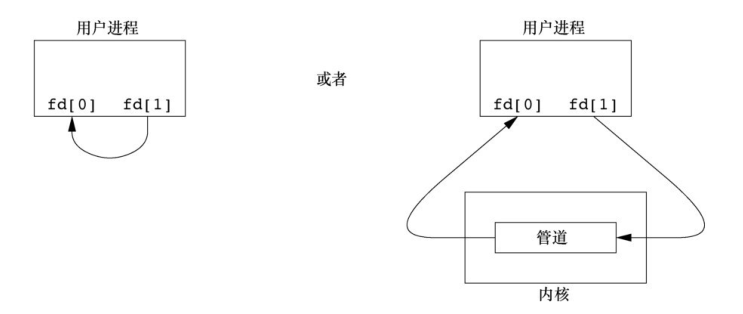
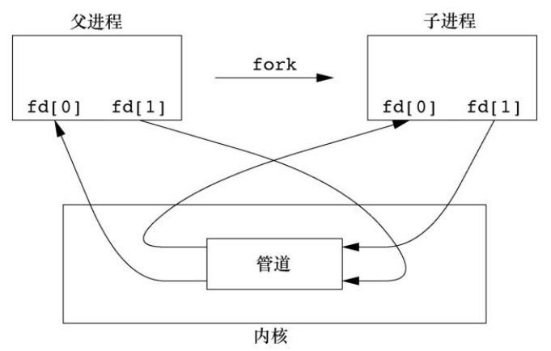
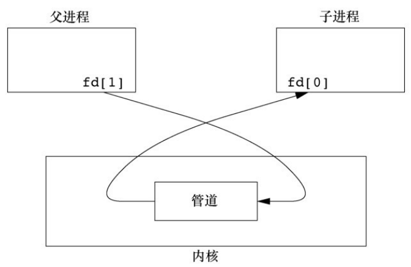
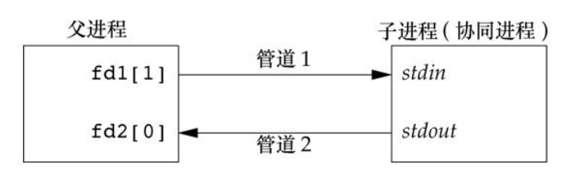

过去，`UNIX` 系统 `IPC` 是各种进程通信方式的统称，但是，这些通信方式中极少有能在所有 `UNIX` 系统实现中进行移植的。随着 `POSIX` 和 `The Open Group`（以前是 `X/Open`）标准化的推进和影响的扩大，情况已得到改善，但差别仍然存在。

## 管道

管道是 `UNIX` 系统 `IPC` 的最古老形式，所有 `UNIX` 系统都提供此种通信机制。管道有以下两种局限性。

- 历史上，它们是半双工的（即数据只能在一个方向上流动）。现在，某些系统提供全双工管道，但是为了最佳的可移植性，我们决不应预先假定系统支持全双工管道。
- 管道只能在具有公共祖先的两个进程之间使用。通常，一个管道由一个进程创建，在进程调用 `fork` 之后，这个管道就能在父进程和子进程之间使用了。

尽管有这两种局限性，半双工管道仍是最常用的 `IPC` 形式。每当在管道中键入一个命令序列，让 `shell` 执行时，`shell` 都会为每一条命令单独创建一个进程，然后用管道将前一条命令进程的标准输出与后一条命令的标准输入相连接。

管道是通过调用 `pipe` 函数创建的。

```cpp
#include <unistd.h>
int pipe(int fd[2]);
```

返回值：

- 若成功，返回 0，
- 若出错，返回-1。

经由参数 `fd` 返回两个文件描述符：`fd[0]` 为读而打开，`fd[1]` 为写而打开。`fd[1]` 的输出是 `fd[0]` 的输入。

下图中给出了两种描绘半双工管道的方法。左图显示管道的两端在一个进程中相互连接，右图则强调数据需要通过内核在管道中流动。



`fstat` 函数对管道的每一端都返回一个 `FIFO` 类型的文件描述符。可以用 `S_ISFIFO` 宏来测试管道。

单个进程中的管道几乎没有任何用处。通常，进程会先调用 `pipe`，接着调用 `fork`，从而创建从父进程到子进程的 `IPC` 通道，反之亦然。下图显示了 `fork` 之后的半双工管道的情况。



`fork` 之后做什么取决于我们想要的数据流的方向。对于从父进程到子进程的管道，父进程关闭管道的读端 `fd[0]`，子进程关闭写端 `fd[1]`。对于一个从子进程到父进程的管道，父进程关闭 `fd[1]`，子进程关闭 `fd[0]`。下图显示了从父进程到子进程的管道。



当管道的一端被关闭后，下列两条规则起作用。

1. 当读（`read`）一个写端已被关闭的管道时，在所有数据都被读取后，`read` 返回 0，表示文件结束。
2. 如果写（`write`）一个读端已被关闭的管道，则产生信号 `SIGPIPE`。如果忽略该信号或者捕捉该信号并从其处理程序返回，则 `write` 返回 −1，`errno` 设置为 `EPIPE`。

在写管道（或 `FIFO`）时，常量 `PIPE_BUF` 规定了内核的管道缓冲区大小。如果对管道调用 `write`，而且要求写的字节数小于等于 `PIPE_BUF`，则此操作不会与其他进程对同一管道（或 `FIFO`）的 `write` 操作交叉进行。但是，若有多个进程同时写一个管道（或 `FIFO`），而且我们要求写的字节数超过 `PIPE_BUF`，那么我们所写的数据可能会与其他进程所写的数据相互交叉。

例子，经由管道从父进程向子进程传送数据。

```cpp
#include <stdio.h>
#include <unistd.h>

int main(){
	int n;
	int fd[2];
	pid_t pid;
	char line[4096];

	if(pipe(fd) < 0){
		perror("pipe error");
		return 1;
	}
	if((pid = fork()) < 0){
		perror("fork error");
		return 1;
	}else if(pid > 0){ // 父进程关闭管道读端
		close(fd[0]);
		write(fd[1], "hello wrold\n", 12);
	}else{ // 子进程关闭管道写端
		close(fd[1]);
		n = read(fd[0], line, 4096);
		write(STDOUT_FILENO, line, n);
	}
	return 0;
}
```

编译运行：

```bash
$ gcc 01pipe.c
$ ./a.out
hello wrold
```

在上面的例子中，直接对管道描述符调用了 `read` 和 `write`。更有趣的是将管道描述符复制到了标准输入或标准输出上。通常，子进程会在此之后执行另一个程序，该程序或者从标准输入（已创建的管道）读数据，或者将数据写至其标准输出。

例子，将文件复制到 `PAGER` 程序。

```cpp
#include <stdio.h>
#include <unistd.h>
#include <sys/wait.h>
#include <string.h>
#include <stdlib.h>

#define DEF_PAGER "/bin/more"	// 默认的 pager 程序

int main(int argc, char *argv[]){
	int n;
	int fd[2];
	pid_t pid;
	char *pager, *argv0;
	char line[4096];
	FILE *fp;

	if(argc != 2){
		printf("usage: a.out <pathname>");
		return 1;
	}
	if((fp = fopen(argv[1], "r")) == NULL){
		perror("fopen error");
		return 1;
	}
	if(pipe(fd) < 0){
		perror("pipe error");
		return 1;
	}

	if((pid = fork()) < 0){
		perror("fork error");
		return 1;
	}else if(pid > 0){  //父进程
		close(fd[0]);	// 关闭管道的读端
		// 读取 fp 的内容，写入管道的写端
		while(fgets(line, 4096, fp) != NULL){
			n = strlen(line);
			if(write(fd[1], line, n) != n){
				perror("write error to pipe");
				return 1;
			}
		}
		if(ferror(fp)){
			perror("fgets error");
			return 1;
		}
		close(fd[1]); // 关闭管道的写端
		// 等待子进程结束
		if(waitpid(pid, NULL, 0) < 0){
			perror("waitpid error");
			return 1;
		}
		return 0;
	}else{ // 子进程
		close(fd[1]);	// 关闭管道的写端
		// 如果 fd[0] 已经是标准输入，那么就不应该复制。
		if(fd[0] != STDIN_FILENO){
			if(dup2(fd[0], STDIN_FILENO) != STDIN_FILENO){
				perror("dup2 error to stdin");
				return 1;
			}
			close(fd[0]); // dup2 后关闭管道的读端
		}
		// 获取 execl 函数的参数
		if((pager = getenv("PAGER")) == NULL)
			pager = DEF_PAGER;
		if((argv0 = strrchr(pager, '/')) != NULL)
			argv0++;
		else
			argv0 = pager;
		// 使用 execlp 函数执行 pager 程序
		if(execlp(pager, argv0, (char *)0) < 0){
			perror("execl error");
			return 1;
		}
	}
	return 0;
}
```

编译运行：

```bash
$ gcc 02pipe_more.c
$ ./a.out 02pipe_more.c
...
```

上面代码先创建一个管道，`fork` 一个子进程，使子进程的标准输入成为管道的读端，然后调用 `exec`，执行用的 `PAGER` 程序。在调用 `fork` 之前，先创建一个管道。调用 `fork` 之后，父进程关闭其读端，子进程关闭其写端。然后子进程调用 `dup2`，使其标准输入成为管道的读端。当执行 `PAGER` 程序时，其标准输入将是管道的读端。

例子，使用管道实现让父进程和子进程同步。

```c
#include <stdio.h>
#include <unistd.h>
#include <stdlib.h>

static int pfd1[2], pfd2[2];

void TELL_WAIT(){
	// 在调用 fork 之前创建两个管道
	if(pipe(pfd1) < 0 || pipe(pfd2) < 0){
		perror("pipe error");
		exit(1);
	}
}

void TELL_PARENT(pid_t pid){
	// 子进程向管道写入一个字符 c
	if(write(pfd2[1], "c", 1) != 1){
		perror("write pfd2[1] error");
		exit(1);
	}
}

void WAIT_PARENT(){
	char c;
	// 子进程从管道读取一个字符 p
	if(read(pfd1[0], &c, 1) != 1){
		perror("read pfd[0] error");
		exit(1);
	}
	if(c != 'p'){
		perror("WAIT_PARENT: incorrect data");
		exit(1);
	}
}

void TELL_CHILD(pid_t pid){
	// 父进程向管道写入一个字符 p
	if(write(pfd1[1], "p", 1) != 1){
		perror("write pfd1[1] error");
		exit(1);
	}
}

void WAIT_CHILD(){
	char c;
	// 父进程从管道读取一个字符 c
	if(read(pfd2[0], &c, 1) != 1){
		perror("read pfd2[0] error");
		exit(1);
	}
	if(c != 'c'){
		perror("WAIT_CHILD: incorrect data");
		exit(1);
	}
}
```

## 函数 popen 和 pclose

由于常见的操作是创建一个管道到另一个进程，以便读取其输出或向其发送输入，为此，标准 `I/O` 库提供了两个函数 `popen` 和 `pclose`。

```cpp
#include <stdio.h>
FILE *popen(const char *cmdstring, const char *type);
```

返回值：

- 若成功，返回文件指针；
- 若出错，返回 `NULL`。

参数：

- `command` 是一个字符串，指定要在子进程中执行的命令，可以包括命令行参数。
- `mode` 是一个字符串，指定管道的模式。通常，有两种有效的模式：
  - `"r"`：表示父进程将从子进程的标准输出中读取数据。
  - `"w"`：表示父进程将向子进程的标准输入写入数据。

```cpp
int pclose(FILE *fp);
```

返回值：

- 若成功，返回 `cmdstring` 的终止状态；
- 若出错，返回-1。

函数 `popen` 先执行 `fork`创建一个新的子进程，然后调用 `exec` 执行 `cmdstring`命令，并且返回一个标准 `I/O` 文件指针。如果 `type` 是 `"r"`，则文件指针连接到 `cmdstring` 的标准输出。如果 `type` 是 `"w"`，则文件指针连接到 `cmdstring` 的标准输入。

`pclose` 函数关闭标准 `I/O` 流，等待命令终止，然后返回 `shell` 的终止状态。如果 `shell` 不能被执行，则 `pclose` 返回的终止状态与 `shell` 已执行 `exit(127)` 一样。

`cmdstring` 由 `Bourne shell` 以下列方式执行：

```bash
sh -c cmdstring
```

这表示 `shell` 将扩展 `cmdstring` 中的任何特殊字符，使其作为命令执行。例如：

```c
fp = popen("ls *.c" , "r");
fp = popen("cmd 2>&1" , "r");
```

例子，用 `popen` 向分页程序传送文件。

```c
#include <stdio.h>
#include <sys/wait.h>

#define PAGER "${PAGER:-more}"	// 使用环境变量 PAGER 的值，如果没有设置，则使用 more

int main(int argc, char *argv[]){
	char line[4096];
	FILE *fpin, *fpout;
	if(argc != 2){
		printf("usage: a.out <pathname>");
		return 0;
	}
	if((fpin = fopen(argv[1], "r")) == NULL){
		perror("can open file");
		return 1;
	}
	if((fpout = popen(PAGER, "w")) == NULL){ // fpout 链接到 PAGER 的标准输入
		perror("popen error");
		return 1;
	}
	// 复制 argv[1] 的内容到 pager 的标准输入
	while(fgets(line, 4096, fpin) != NULL){
		if(fputs(line, fpout) == EOF){
			perror("fputs error to pipe");
			return 1;
		}
	}
	if(ferror(fpin)){
		perror("fgets error");
		return 1;
	}
	if(pclose(fpout) == -1){
		perror("pclose error");
		return 1;
	}
	return 0;
}
```

编译运行：

```bash
$ gcc 04popen.c
$ ./a.out 04popen.c
...
```

`shell` 命令 `${PAGER:-more}` 的意思是：如果 `shell` 变量 `PAGER` 已经定义，且其值非空，则使用其值，否则使用字符串 `more`。

例子，函数 `popen` 和 `pclose` 的实现。

```cpp
#include <stdio.h>
#include <errno.h>
#include <fcntl.h>
#include <sys/wait.h>
#include <unistd.h>
#include <stdio.h>
#include <stdlib.h>

static pid_t *childpid = NULL;	// 指向运行时分配的数组
static int maxfd;		// 最大文件描述符数

extern int open_max();

FILE* popen(const char *cmdstring, const char *type){
	int i;
	int pfd[2];
	pid_t pid;
	FILE *fp;
	// 仅仅只允许 type 为 r 或 w
	if((type[0] != 'r' && type[0] != 'w') || type[1] != 0){
		errno = EINVAL;
		return NULL;
	}
	if(childpid == NULL){	// 第一次执行时分配数组存放子进程的 pid
		maxfd = open_max();
		if((childpid = calloc(maxfd, sizeof(pid_t))) == NULL)
			return NULL;
	}
	if(pipe(pfd) < 0)
		return NULL;
	if(pfd[0] >= maxfd || pfd[1] >= maxfd){
		close(pfd[0]);
		close(pfd[1]);
		errno = EMFILE;
		return NULL;
	}
	if((pid = fork()) < 0){
		return NULL;
	}else if(pid == 0){		// 子进程
		if(*type == 'r'){	// 写管道重定向到标准输出
			close(pfd[0]);
			if(pfd[1] != STDOUT_FILENO){
				dup2(pfd[1], STDOUT_FILENO);
				close(pfd[1]);
			}
		}else{				// 读管道重定向到标准输入
			close(pfd[1]);
			if(pfd[0] != STDIN_FILENO){
				dup2(pfd[0], STDIN_FILENO);
				close(pfd[0]);
			}
		}
		// 关闭 childpid 中所有文件描述符
		for(i = 0; i <maxfd; i++)
			if(childpid[i] > 0)
				close(i);
		execl("/bin/sh", "sh", "-c", cmdstring, (char *)0);
		_exit(127);
	}
	// 父进程
	if(*type == 'r'){	// 返回读管道对应的文件指针
		close(pfd[1]);
		if((fp = fdopen(pfd[0], type)) == NULL)
			return NULL;
	}else{				//  返回写管道对应的文件指针
		close(pfd[0]);
		if((fp = fdopen(pfd[1], type)) == NULL)
			return NULL;
	}
	childpid[fileno(fp)] = pid;	// 记住此文件描述符的子进程PID。
	return fp;
}

int pclose(FILE *fp){
	int fd, stat;
	pid_t pid;
	if(childpid == NULL){
		errno = EINVAL;
		return -1;		// popen() 没有被调用过
	}
	fd = fileno(fp);
	if(fd >= maxfd){
		errno = EINVAL;
		return -1;		// 非法的文件描述符
	}
	if((pid = childpid[fd]) == 0){
		errno = EINVAL;
		return -1;		// fp 不是被 popen 打开的
	}
	childpid[fd] = 0;
	if(fclose(fp) == EOF)
		return -1;
	while(waitpid(pid, &stat, 0) < 0)
		if (errno != EINTR)
			return -1;	// 从 waitpid() 返回的错误，除了 EINTR 以外
	return stat;		// 返回子进程终止的状态
}
```

`POSIX.1` 要求 `popen` 关闭那些以前调用 `popen` 打开的、现在仍然在子进程中打开着的 `I/O` 流。为此，在子进程中从头逐个检查 `childpid` 数组的各个元素，关闭仍旧打开着的描述符。

若 `pclose` 的调用者已经为信号 `SIGCHLD` 设置了一个信号处理程序，则 `pclose` 中的 `waitpid` 调用将返回一个错误 `EINTR`。因为允许调用者捕捉此信号（或者任何其他可能中断 `waitpid` 调用的信号），所以当 `waitpid` 被一个捕捉到的信号中断时，我们只是再次调用 `waitpid`。

注意，`popen` 决不应由设置用户 ID 或设置组 ID 程序调用。当它执行命令时，`popen` 等同于：

```c++
execl("/bin/sh", "sh", "-c", command, NULL);
```

它从调用者继承的环境中执行 `shell`，并由 `shell` 解释执行 `command`。

`popen` 特别适用于执行简单的过滤器程序，它变换运行命令的输入或输出。当命令希望构造它自己的管道时，就是这种情形。

例子，用 `popen` 对输入进行变换处理。

```cpp
// myuclc.c
#include <stdio.h>
#include <ctype.h>

int main(){
	int c;
	while ((c = getchar()) != EOF){
		if(isupper(c))
			c = tolower(c);
		if(putchar(c) == EOF){
			perror("output error");
			return 1;
		}
		if(c == '\n')
			fflush(stdout);
	}
	return 0;
}
```

上面的例子将标准输入复制到标准输出，在复制时将大写字符变换为小写字符。

```cpp
#include <stdio.h>
#include <sys/wait.h>
#include <stdlib.h>

int main(){
	char line[4096];
	FILE *fpin;
	if((fpin = popen("./myuclc", "r")) == NULL){
		perror("popen error");
		return 1;
	}
	for(;;){
		fputs("prompt> ", stdout);
		fflush(stdout);
		if(fgets(line, 4096, fpin) == NULL)
			break;
		if(fputs(line, stdout) == EOF){
			perror("fputs error to pipe");
			return 1;
		}
	}
	if(pclose(fpin) == -1){
		perror("pclose error");
		return 1;
	}
	putchar('\n');
	return 0;
}
```

编译运行：

```bash
$ gcc 06myuclc.c -o myuclc

$ gcc 06popen.c
$ ./a.out
prompt> HEllo World
hello world
prompt>
```

使用 `popen` 调用 `myuclc` 程序，因为标准输出通常是行缓冲的，而提示并不包含换行符，所以在写了提示之后，需要调用 `fflush`。

## 协同进程

UNIX 系统中的过滤器（filter）是一种从标准输入读取数据并将结果写入标准输出的程序。过滤器通常在 `shell` 管道中按线性方式连接。当同一个程序生成过滤器的输入并读取过滤器的输出时，过滤器就成为了协同进程（coprocess）。协同进程通常在 `shell` 的后台运行，其标准输入和标准输出通过管道连接到另一个程序。

`popen` 只提供连接到另一个进程的标准输入或标准输出的一个单向管道，而协同进程则有连接到另一个进程的两个单向管道：一个接到其标准输入，另一个则来自其标准输出。我们想将数据写到其标准输入，经其处理后，再从其标准输出读取数据。

例子，通过写协同进程的标准输入和读取它的标准输出来驱动协同进程。

```c
// 07add.c
#include <stdio.h>
#include <unistd.h>
#include <string.h>
#include <stdlib.h>

int main(){
	int n, a, b;
	char line[4096];
	while((n = read(STDIN_FILENO, line, 4096)) > 0){
		line[n] = 0;
		if(sscanf(line, "%d%d", &a, &b) == 2){
			sprintf(line, "%d\n", a + b);
			n = strlen(line);
			if(write(STDOUT_FILENO, line, n) != n){
				perror("write error");
				exit(1);
			}
		}else{
			if(write(STDOUT_FILENO, "invalid args\n", 13) != 13){
				perror("write error");
				exit(1);
			}
		}
	}
	return 0;
}
```

将上面的代码编译为可执行程序 `add`，然后使用下面的程序从其标准输入读取两个数之后调用 `add` 协同进程，并将协同进程送来的值写到其标准输出。

```c
#include <unistd.h>
#include <stdio.h>
#include <sys/signal.h>
#include <string.h>
#include <stdlib.h>

static void sig_pipe(int);

int main(){
	int n, fd1[2], fd2[2];
	pid_t pid;
	char line[4096];
	if(signal(SIGPIPE, sig_pipe) == SIG_ERR){
		perror("signal error");
		exit(1);
	}
	if(pipe(fd1) < 0 || pipe(fd2) < 0){
		perror("pipe error");
		exit(1);
	}
	if((pid = fork()) < 0){
		perror("fork error");
		exit(1);
	}else if(pid > 0){
		close(fd1[0]);
		close(fd2[1]);

		while(fgets(line, 4096, stdin) != NULL){
			n = strlen(line);
			if(write(fd1[1], line, n) != n){
				perror("write error");
				exit(1);
			}
			if((n = read(fd2[0], line, 4096)) < 0){
				perror("read error");
				exit(1);
			}
			if(n == 0){
				printf("child closed pipe.\n");
				break;
			}
			line[n] = 0;
			if(fputs(line, stdout) == EOF){
				perror("fputs error");
				exit(1);
			}
		}
		if(ferror(stdin)){
			perror("fgets error on stdin");
			exit(1);
		}
		exit(0);
	}else{
		close(fd1[1]);
		close(fd2[0]);
		if(fd1[0] != STDIN_FILENO){
			if(dup2(fd1[0], STDIN_FILENO) != STDIN_FILENO){
				perror("dup2 error to stdin");
				exit(1);
			}
			close(fd1[0]);
		}
		if(fd2[1] != STDOUT_FILENO){
			if(dup2(fd2[1], STDOUT_FILENO) != STDOUT_FILENO){
				perror("dup2 error to stdout");
				exit(1);
			}
			close(fd2[1]);
		}
		if(execl("./add", "add", (char *)0) < 0){
			perror("execl error");
			exit(1);
		}
	}
	exit(0);
}

static void sig_pipe(int signo){
	printf("SIGPIPE caught\n");
	exit(1);
}
```

编译运行：

```bash
$ gcc 07add.c -o add
$ gcc 07coprocess.c
$ ./a.out
1 3
4
f
invalid args
87
invalid args        # 在这里终止 add 进程，然后在输入 1234
1234
SIGPIPE caught
```

进程创建两个管道：一个是协同进程的标准输入，另一个是协同进程的标准输出。



正常情况下，程序按照预期工作，但是当终止 `add` 进程后，再次输入一个数时，会调用信号处理程序。

如果使用标准 `I/O` 来改写 `add` 协同进程，那么该程序将不再工作。问题出在默认的标准 `I/O` 缓冲机制上。因为标准输入是一个管道，所以标准 `I/O` 库默认是全缓冲的。标准输出也是如此。当 `add` 从其标准输入读取而发生阻塞时，该程序从管道读时也发生阻塞，于是产生了死锁。

## FIFO

`FIFO` 有时被称为命名管道。未命名的管道只能在两个相关的进程之间使用，而且这两个相关的进程还要有一个共同的创建了它们的祖先进程。但是，通过 `FIFO`，不相关的进程也能交换数据。

创建 `FIFO` 类似于创建文件，`FIFO` 的路径名存在于文件系统中。

```c
#include <sys/stat.h>
int mkfifo(const char *path, mode_t mode);
int mkfifoat(int fd, const char *path, mode_t mode);
```

两个函数的返回值：

- 若成功，返回 0；
- 若出错，返回 −1。

参数：

- `path` 是要创建的命名管道的路径名。
- `mode` 是要创建的管道的权限位，类似于文件的权限位，它指定了谁可以读取或写入管道。
- `fd` 是代表目录的文件描述符。
  - 如果 `path` 参数指定的是绝对路径名，则 `fd` 参数会被忽略掉。
  - 如果 `path` 参数指定的是相对路径名，则 `fd` 参数是一个打开目录的有效文件描述符，路径名和目录有关。
  - 如果 `path` 参数指定的是相对路径名，并且 `fd` 参数有一个特殊值 `AT_FDCWD`，则路径名以当前目录开始。

> 应用程序也可以用 `mknod` 和 `mknodat` 函数创建 `FIFO`，它们包括在 `POSIX.1` 的 `XSI` 扩展中。

`FIFO` 有以下两种用途。

- `shell` 命令使用 `FIFO` 将数据从一条管道传送到另一条时，无需创建中间临时文件。
- 客户进程-服务器进程应用程序中，`FIFO` 用作汇聚点，在客户进程和服务器进程二者之间传递数据。

类似于管道，若 `write` 一个尚无进程为读而打开的 `FIFO`，则产生信号 `SIGPIPE`。若某个 `FIFO` 的最后一个写进程关闭了该 `FIFO`，则将为该 `FIFO` 的读进程产生一个文件结束标志。

例子：

```c
// 08fifo_writer.c
#include <stdio.h>
#include <stdlib.h>
#include <string.h>
#include <unistd.h>
#include <sys/types.h>
#include <sys/stat.h>
#include <fcntl.h>

int main(){
	// 命名管道的路径和名称
	const char *fifo_path = "/tmp/myfifo";
	const char *msg = "Hello named pipe!";
	int fd;
	// 创建命名管道
	if(mkfifo(fifo_path, 0666) == -1){
		perror("mkfifo error");
		exit(1);
	}
	printf("Named pipe created at %s.\n", fifo_path);
	// 打开管道进行写入操作

	if((fd = open(fifo_path, O_WRONLY)) == -1){
		perror("open error");
		exit(1);
	}
	write(fd, msg, strlen(msg) + 1);
	close(fd);
	return 0;
}

// 08fifo_reader.c
#include <stdio.h>
#include <stdlib.h>
#include <string.h>
#include <unistd.h>
#include <sys/types.h>
#include <sys/stat.h>
#include <fcntl.h>

int main(){
	const char *fifo_path = "/tmp/myfifo";
	ssize_t bytes_read;
	char buffer[256];
	int fd;
	if((fd = open(fifo_path, O_RDONLY)) == -1){
		perror("open error");
		exit(1);
	}
	if((bytes_read = read(fd, buffer, sizeof(buffer))) == -1){
		perror("read error");
		exit(1);
	}
	printf("Received data: %s\n", buffer);
	close(fd);
	return 0;
}
```

首先编译运行 `08fifo_writer.c`，然后在另一个终端中编译运行 `08fifo_reader.c`，运行结果如下：

```bash
$ gcc 08fifo_writer.c -o writer
$ ./writer                             # 先运行 writer
Named pipe created at /tmp/myfifo.

$ gcc 08fifo_reader.c -o reader
$ ./reader                             # 再运行 reader
Received data: Hello named pipe!

$ ./writer                             # 再次运行 writer
mkfifo error: File exists
```

当首次运行 writer 时，进程会等待 reader 进程终止而退出，再次运行 writer，会报错 File exists，这表明命名管道并没有在程序退出后自动删除。

## XSI IPC

`XSI IPC` 函数是紧密地基于 `System V` 的 `IPC` 函数的，有 3 种称作 `XSI IPC` 的 `IPC`：消息队列、信号量以及共享存储器，它们之间有很多相似之处。

### 标识符和键

每个内核中的 `IPC` 结构（消息队列、信号量或共享存储段）都用一个非负整数的标识符（identifier）加以引用。与文件描述符不同，`IPC` 标识符不是小的整数。当一个 `IPC` 结构被使用完成后，与这种结构相关的标识符连续加 1，直至达到一个整型数的最大正值，然后又回转到 0。

标识符是 `IPC` 对象的内部名，每个 `IPC` 对象都与一个键（key）相关联，将这个键作为该对象的外部名。无论何时创建 IPC 结构（通过调用 `msgget`、`semget` 或 `shmget` 创建），都应指定一个键，这个键由内核变换成标识符。

有多种方法使客户进程和服务器进程在同一 `IPC` 结构上汇聚。

1. 服务器进程可以指定键 `IPC_PRIVATE` 创建一个新 `IPC` 结构，将返回的标识符存放在某处（如一个文件）以便客户进程取用。键 `IPC_PRIVATE` 保证服务器进程创建一个新 `IPC` 结构。
2. 可以在一个公用头文件中定义一个客户进程和服务器进程都认可的键。然后服务器进程指定此键创建一个新的 `IPC` 结构。
3. 客户进程和服务器进程认同一个路径名和项目 ID，接着，调用函数 `ftok` 将这两个值变换为一个键，然后在方法（2）中使用此键。

`ftok` 函数是一个用于生成一个 `System V IPC` 对象键的函数，它通常用于创建共享内存、消息队列和信号量等 `System V IPC` 对象的标识符。

```c
#include <sys/ipc.h>
key_t ftok(const char *path, int id);
```

返回值：

- 若成功，返回键；
- 若出错，返回(`key_t`)−1。

参数：

- `path` 是一个指向路径名的字符串，通常是指向一个现有的文件。
- `id` 是一个整数，通常是一个小于 256 的正整数，用于在给定路径名的情况下生成唯一的键值。

`ftok` 创建的键的规则通常是将 `pathname` 参数所指定的文件的索引节点号（`st_ino`）的低 16 位与 `id` 参数进行异或操作。如果两个路径名引用的是两个不同的文件，那么 `ftok` 通常会为这两个路径名返回不同的键。但是，因为 `i` 节点编号和键通常都存放在长整型中，所以创建键时可能会丢失信息。这意味着，如果不同文件的两个路径名使用同一 `id`，那么可能产生相同的键。

3 个 `get` 函数（`msgget`、`semget` 和 `shmget`）都有两个类似的参数：一个 `key` 和一个整型 `flag`。在创建新的 `IPC` 结构（通常由服务器进程创建）时，如果 `key` 是 `IPC_PRIVATE` 或者和当前某种类型的 `IPC` 结构无关，则需要指明 `flag` 的 `IPC_CREAT` 标志位。使用一个现有队列（通常由客户进程创建）时，`key` 必须等于队列创建时指明的 `key` 的值，并且 `IPC_CREAT` 必须不被指明。

如果希望创建一个新的 `IPC` 结构，而且要确保没有引用具有同一标识符的一个现有 `IPC` 结构，那么必须在 `flag` 中同时指定 `IPC_CREAT` 和 `IPC_EXCL` 位。这样做了以后，如果 `IPC` 结构已经存在就会造成出错，返回 `EEXIST`。

### 权限结构

`XSI IPC` 为每一个 IPC 结构关联了一个 `ipc_perm` 结构。该结构规定了权限和所有者，它至少包括下列成员：

```c
struct ipc_perm {
    uid_t uid;     /* owner's effective user id */
    gid_t gid;     /* owner's effective group id */
    uid_t cuid;    /* creator's effective user id */
    gid_t cgid;    /* creator's effective group id */
    mode_t mode;   /* access modes */
};
```

在创建 `IPC` 结构时，对所有字段都赋初值。以后，可以调用 `msgctl`、`semctl` 或 `shmctl` 修改 `uid`、`gid `和 `mode` 字段。为了修改这些值，调用进程必须是 `IPC` 结构的创建者或超级用户。

`mode` 字段的值类似于文件 `mode` 值，但是对于任何 `IPC` 结构都不存在执行权限。另外，消息队列和共享存储使用术语“读”和“写”，而信号量则用术语“读”和“更改”（alter）。下表显示了每种 `IPC` 的 6 种权限。

| 权限         | 位   |
| ------------ | ---- |
| 用户读       | 0400 |
| 用户写(更改) | 0200 |
| 组读         | 0040 |
| 组写(更改)   | 0020 |
| 其他读       | 0004 |
| 其他写(更改) | 0002 |

### 结构限制

所有 3 种形式的 `XSI IPC` 都有内置限制。大多数限制可以通过重新配置内核来改变。`FreeBSD 8.0`、`Linux 3.2.0` 和 `Mac OS X 10.6.8` 提供了 `sysctl` 命令来观察和修改内核配置参数。在 `Linux` 中，可以运行 `ipcs -l` 来显示 `IPC` 相关的限制。在 `FreeBSD` 中，等效的命令是 `ipcs -T`。

```bash
$ ipcs -l

------ Messages Limits --------
max queues system wide = 32000
max size of message (bytes) = 8192
default max size of queue (bytes) = 16384

------ Shared Memory Limits --------
max number of segments = 4096
max seg size (kbytes) = 18014398509465599
max total shared memory (kbytes) = 18014398509481980
min seg size (bytes) = 1

------ Semaphore Limits --------
max number of arrays = 32000
max semaphores per array = 32000
max semaphores system wide = 1024000000
max ops per semop call = 500
semaphore max value = 32767

```

### 优点和缺点

`XSI IPC` 的一个基本问题是：`IPC` 结构是在系统范围内起作用的，没有引用计数。例如，如果进程创建了一个消息队列，并且在该队列中放入了几则消息，然后终止，那么该消息队列及其内容不会被删除。它们会一直留在系统中直至发生下列动作为止：由某个进程调用 `msgrcv` 或 `msgctl` 读消息或删除消息队列；或某个进程执行 `ipcrm(1)`命令删除消息队列；或正在自举的系统删除消息队列。

`XSI IPC` 的另一个问题是：这些 `IPC` 结构在文件系统中没有名字。为了支持这些 `IPC` 对象，内核中增加了十几个全新的系统调用（`msgget`、`semop`、`shmat` 等）。因为这些形式的 `IPC` 不使用文件描述符，所以不能对它们使用多路转接 `I/O` 函数（`select` 和 `poll`）。这使得它很难一次使用一个以上这样的 `IPC` 结构，或者在文件或设备 `I/O` 中使用这样的 `IPC` 结构。

下表对这些不同形式 `IPC` 的某些特征进行了比较，表中“无连接”指的是无需先调用某种形式的打开函数就能发送消息的能力。

| IPC 类型            | 无连接? | 可靠的? | 流控制? | 记录? | 消息类型或优先级? |
| ------------------- | ------- | ------- | ------- | ----- | ----------------- |
| 消息队列            | 否      | 是      | 是      | 是    | 是                |
| STREAMS             | 否      | 是      | 是      | 是    | 是                |
| UNIX 域流套接字     | 否      | 是      | 是      | 否    | 否                |
| UNIX 域数据报套接字 | 是      | 是      | 否      | 是    | 否                |
| FIFO (非 STREAMS）  | 否      | 是      | 是      | 否    | 否                |

## 消息队列

**消息队列是消息的链接表，存储在内核中，由消息队列标识符标识。**

`msgget` 用于创建一个新队列或打开一个现有队列。`msgsnd` 将新消息添加到队列尾端。每个消息包含一个正的长整型类型的字段、一个非负的长度以及实际数据字节数（对应于长度），所有这些都在将消息添加到队列时，传送给 `msgsnd`。`msgrcv` 用于从队列中取消息。我们并不一定要以先进先出次序取消息，也可以按消息的类型字段取消息。

每个队列都有一个 `msqid_ds` 结构与其相关联：

```c
struct msqid_ds {
    struct ipc_perm msg_perm;    /* see Section 15.6.2 */
    msgqnum_t msg_qnum;          /* # of messages on queue */
    msglen_t msg_qbytes;         /* max # of bytes on queue */
    pid_t msg_lspid;             /* pid of last msgsnd() */
    pid_t msg_lrpid;             /* pid of last msgrcv() */
    time_t msg_stime;            /* last-msgsnd() time */
    time_t msg_rtime;             /* last-msgrcv() time */
    time_t msg_ctime;            /* last-change time*/
    ...
};
```

此结构定义了队列的当前状态。结构中所示的各成员是由 `Single UNIX Specification` 定义的。具体实现可能包括标准中没有定义的另一些字段。

调用的第一个函数通常是 `msgget`，其功能是打开一个现有队列或创建一个新队列。

```c
#include <sys/msg.h>
int msgget(key_t key, int flag);
```

返回值：

- 若成功，返回消息队列 ID；
- 若出错，返回 −1。

参数：

- `key` 是消息队列的键值，通常通过 `ftok` 函数生成，用于唯一标识一个消息队列。
- `flag` 是标志位，用于指定 `msgget` 的行为，可以是以下标志的组合：
  - `IPC_CREAT`：如果指定的消息队列不存在，则创建它。
  - `IPC_EXCL`：与 `IPC_CREAT` 一起使用，如果消息队列已经存在，则返回错误。
  - 权限位：可以通过 `|` 运算符与权限位（例如 0666）组合，用于设置消息队列的权限。

在创建新队列时，要初始化 `msqid_ds` 结构的下列成员。

- `msg_perm` 结构，该结构中的 `mode` 成员按 `flag` 中的相应权限位设置。
- `msg_qnum`、`msg_lspid`、`msg_lrpid`、`msg_stime` 和 `msg_rtime` 都设置为 0。
- `msg_ctime` 设置为当前时间。
- `msg_qbytes` 设置为系统限制值。

`msgctl` 函数对队列执行多种操作。它和另外两个与信号量及共享存储有关的函数（`semctl` 和 `shmctl`）都是 `XSI IPC` 的类似于 `ioctl` 的函数。

```c
#include <sys/msg.h>
int msgctl(int msqid, int cmd, struct msqid_ds *buf);
```

返回值：

- 若成功，返回 0；
- 若出错，返回 −1。

参数：

- `msqid` 是要操作的消息队列的标识符，通常由 `msgget` 返回。
- `cmd` 是指定要执行的操作的命令，可以是以下之一：
  - `IPC_STAT`：获取消息队列的信息，并将结果存储在 `buf` 指向的 `struct msqid_ds` 结构中。
  - `IPC_SET`：设置消息队列的信息，使用 `buf` 中的内容来修改消息队列的属性。
  - `IPC_RMID`：删除消息队列，将其标识符从系统中移除。
- `buf` 是一个指向 `struct msqid_ds` 结构的指针，用于存储或传递消息队列的信息。

调用 `msgsnd` 将数据放到消息队列中。

```c
#include <sys/msg.h>
int msgsnd(int msqid, const void *ptr, size_t nbytes, int flag);
```

返回值：

- 若成功，返回 0；
- 若出错，返回 −1。

参数：

- `msqid` 是要发送消息的消息队列的标识符，通常由 `msgget` 返回。
- `ptr` 是一个指向消息数据的指针，通常是一个用户自定义的结构体指针，用于存储要发送的数据。
- `nbytes` 是消息数据的大小（以字节为单位）。
- `flag` 是发送消息的标志，可以是以下之一或它们的组合：
  - `IPC_NOWAIT`：如果消息队列已满，不要等待，立即返回错误。
  - 0：阻塞，等待消息队列有足够的空间。
  - 其他标志：通常设置为 0。

`msgrcv` 从队列中取用消息。

```c
#include <sys/msg.h>
ssize_t msgrcv(int msqid, void *ptr, size_t nbytes, long type, int flag);
```

返回值：

- 若成功，返回消息数据部分的长度；
- 若出错，返回-1。

参数：

- `msqid` 是要接收消息的消息队列的标识符，通常由 `msgget` 返回。
- `ptr` 是一个指向消息数据的缓冲区的指针，通常是一个用户自定义的结构体指针，用于存储接收到的数据。
- `nbytes` 是消息数据的最大大小（以字节为单位）。
- `type` 是接收消息的类型，可以指定要接收的消息类型。如果设置为 0，将接收队列中的第一条消息。如果设置为正整数，将接收指定类型的消息。
- `flag` 是接收消息的标志，可以是以下之一或它们的组合：
  - `IPC_NOWAIT`：如果消息队列为空，不要等待，立即返回错误。
  - `MSG_NOERROR`：如果消息大小大于 `nbytes`，截断消息并不返回错误。

例子：

```c
// 09msg_send.c
#include <stdio.h>
#include <stdlib.h>
#include <string.h>
#include <sys/types.h>
#include <sys/ipc.h>
#include <sys/msg.h>

// 定义消息结构
struct message{
	long mtype;
	char mtext[100];
};

int main(){
	key_t key;
	int msgid;
	struct message msg;
	// 生成一个唯一键
	if((key = ftok("/tmp", 'A')) == -1){
		perror("fork");
		exit(1);
	}
	// 创建消息队列，如果队列已经存在则获取队列 ID
	if((msgid = msgget(key, 0666|IPC_CREAT)) == -1){
		perror("msgget error");
		exit(1);
	}
	// 准备消息
	msg.mtype = 1;
	strcpy(msg.mtext, "hello, this is a message frome msg_send!");
	// 发送消息
	if(msgsnd(msgid, &msg, sizeof(msg.mtext), 0) == -1){
		perror("msgsnd error");
		exit(1);
	}
	printf("Message sent: %s\n", msg.mtext);
	return 0;
}

// 09msg_receive.c
#include <stdio.h>
#include <stdlib.h>
#include <string.h>
#include <sys/types.h>
#include <sys/ipc.h>
#include <sys/msg.h>

// 定义消息结构
struct message {
    long mtype;       // 消息类型
    char mtext[100];  // 消息内容
};

int main(){
	key_t key;
	int msgid;
	struct message msg;
	// 生成一个唯一的键
	if((key = ftok("/tmp", 'A')) == -1){
		perror("ftok error");
		exit(1);
	}
	// 获取消息队列 ID
	if((msgid = msgget(key, 0666)) == -1){
		perror("msgget error");
		exit(1);
	}
	// 接收消息
	if(msgrcv(msgid, &msg, sizeof(msg.mtext), 1, 0) == -1){
		perror("msgrcv");
		exit(1);
	}
	printf("Received message: %s\n", msg.mtext);
	return 0;
}
```

编译运行：

```bash
$ gcc 09msg_send.c -o msg_send
$ gcc 09msg_receive.c -o msg_rec
$ ./msg_send
Message sent: hello, this is a message frome msg_send!
$ ./msg_rec
Received message: hello, this is a message frome msg_send!
```

消息队列原来的目的是提供高于一般速度的 `IPC`，但现在与其他形式的 `IPC` 相比，在速度方面已经没有什么差别了。考虑到使用消息队列时遇到的问题，在新的应用程序中不应当再使用它们。

## 信号量

信号量与其他形式的 `IPC`（管道、`FIFO` 以及消息列队）不同。它是一个计数器，用于为多个进程提供对共享数据对象的访问。

为了获得共享资源，进程需要执行下列操作。

1. 测试控制该资源的信号量。
2. 若此信号量的值为正，则进程可以使用该资源。在这种情况下，进程会将信号量值减 1，表示它使用了一个资源单位。
3. 否则，若此信号量的值为 0，则进程进入休眠状态，直至信号量值大于 0。进程被唤醒后，它返回至步骤 1。

当进程不再使用由一个信号量控制的共享资源时，该信号量值增 1。如果有进程正在休眠等待此信号量，则唤醒它们。

一般而言，信号量的初值可以是任意一个正值，该值表明有多少个共享资源单位可供共享应用。遗憾的是，`XSI` 信号量与此相比要复杂得多。以下 3 种特性造成了这种不必要的复杂性。

1. 信号量并非是单个非负值，而必需定义为含有一个或多个信号量值的集合。当创建信号量时，要指定集合中信号量值的数量。
2. 信号量的创建（`semget`）是独立于它的初始化（`semctl`）的。这是一个致命的缺点，因为不能原子地创建一个信号量集合，并且对该集合中的各个信号量值赋初值。
3. 即使没有进程正在使用各种形式的 `XSI IPC`，它们仍然是存在的。有的程序在终止时并没有释放已经分配给它的信号量，所以我们不得不为这种程序担心。

内核为每个信号量集合维护着一个 `semid_ds` 结构：

```c
struct semid_ds {
    struct ipc_perm sem_perm; /* see Section 15.6.2 */
    unsigned short sem_nsems; /* # of semaphores in set */
    time_t sem_otime;         /* last-semop() time */
    time_t sem_ctime;         /* last-change time */
    ...
};
```

具体实现可在 `semid_ds` 结构中定义添加的成员。

每个信号量由一个无名结构表示，它至少包含下列成员：

```c
struct {
    unsigned short semval;  /* semaphore value, always >=0 */
    pid_t sempid;           /* pid for last operation */
    unsigned short semncnt; /* # processes awaiting semval>curval */
    unsigned short semzcnt; /* # processes awaiting semval==0 */
...
};
```

当我们想使用 `XSI` 信号量时，首先需要通过调用函数 `semget` 来获得一个信号量 ID。

```c
#include <sys/sem.h>
int semget(key_t key, int nsems, int flag);
```

返回值：

- 若成功，返回信号量 ID；
- 若出错，返回 −1。

参数：

- `key` 是用于创建或获取信号量集合的键值。通常使用 `ftok` 函数生成一个唯一的键值。
- `nsems` 是要创建的信号量集合中信号量的数量（或者是要获取的信号量集合中已经存在的信号量数量）。
- `flag` 是标志位，用于指定创建或获取信号量集合的方式和权限。
  - `IPC_CREAT`：如果没有指定的键值对应的信号量集合存在，则创建一个新的。如果已经存在，则返回已存在的标识符。
  - `IPC_EXCL`：与 `IPC_CREAT` 一起使用，表示如果指定的键值对应的信号量集合已经存在，则返回错误。
  - 权限标志：可以使用诸如 0666 之类的标志指定信号量集合的权限，类似于文件权限。

`semctl` 允许你执行各种操作，如创建、删除、设置值、获取值以及其他与信号量相关的控制操作。

```c
#include <sys/sem.h>
int semctl(int semid, int semnum, int cmd, ... /* union semun arg */);
```

参数：

- `semid` 是信号量集合的标识符，通常由 semget 返回。
- `semnum` 是要操作的信号量的索引。对于信号量集合中的每个信号量，都有一个唯一的索引，从 0 开始。
- `cmd` 是要执行的操作代码，可以是以下之一：
  - `GETVAL`：获取指定信号量的值。
  - `SETVAL`：设置指定信号量的值，该值由 `arg.val` 指定。
  - `IPC_RMID`：删除信号量集合，这种删除是立即发生的。
  - `IPC_STAT`：获取信号量集合的状态，并存储在由 `arg.buf` 指向的结构中。
  - `IPC_SET`：按 `arg.buf` 指向的结构中的值，设置信号量集合的状态。
  - `GETPID` 返回 `semnum` 对应的信号量的 `sempid` 值。
  - `GETNCNT` 返回 `semnum` 对应的信号量的 `semncnt` 值。
  - `GETZCNT` 返回 `semnum` 对应的信号量的 `semzcnt` 值。
  - `GETALL` 取该集合中所有的信号量值。这些值存储在 `arg.array` 指向的数组中。
  - `SETALL` 将该集合中所有的信号量值设置成 `arg.array` 指向的数组中的值。
- 可选的参数 `arg`：根据不同的命令，可以有附加的参数。

如果使用可选参数，则其类型是 `semun`，它是多个命令特定参数的联合：

```c
union semun {
    int val;                 /* for SETVAL */
    struct semid_ds *buf;    /* for IPC_STAT and IPC_SET */
    unsigned short *array;   /* for GETALL and SETALL */
};
```

对于除 `GETALL` 以外的所有 `GET` 命令，`semctl` 函数都返回相应值。对于其他命令，若成功则返回值为 0，若出错，则设置 `errno` 并返回 −1。

函数 `semop` 自动执行信号量集合上的操作数组。

```c
#include <sys/sem.h>
int semop(int semid, struct sembuf semoparray[], size_t nops);
```

返回值：

- 若成功，返回 0；
- 若出错，返回 −1。

参数：

- `semid` 是信号量集合的标识符，通常由 `semget` 返回。
- `semoparray` 是一个指向 `sembuf` 结构体数组的指针，每个结构体描述了对一个信号量的操作。
- `nops` 是 `semoparray` 数组中元素的数量，表示要执行的操作数。

`sembuf` 结构体定义如下：

```c
struct sembuf {
    unsigned short sem_num;  // 信号量的索引
    short sem_op;            // 操作类型，正数表示增加，负数表示减少，0表示等待
    short sem_flg;           // 操作标志，通常设置为 SEM_UNDO
};
```

对集合中每个成员的操作由相应的 `sem_op` 值规定。此值可以是负值、0 或正值。

- 若 `sem_op` 为正值，这对应于进程释放的占用的资源数。`sem_op` 值会加到信号量的值上。如果指定了 `SEM_UNDO`，则也从该进程的此信号量调整值中减去 `sem_op`。
- 若 `sem_op` 为负值，则表示要获取由该信号量控制的资源。
  - 如若该信号量的值大于等于 `sem_op` 的绝对值，则从信号量值中减去 `sem_op` 的绝对值。
  - 如果信号量值小于 `sem_op` 的绝对值（资源不能满足要求），则适用下列条件。
    - 若指定了 `IPC_NOWAIT`，则 `semop` 出错返回 `EAGAIN`。
    - 若未指定 `IPC_NOWAIT`，则该信号量的 `semncnt` 值加 `1`，然后调用进程被挂起，直到发现下列情况：
      - 此信号量值变成大于等于 `sem_op` 的绝对值。
      - 从系统中删除了此信号量。在这种情况下，函数出错返回 `EIDRM`。
      - 进程捕捉到一个信号，并从信号处理程序返回，此信号量的 `semncnt` 值减 `1`，并且函数出错返回 `EINTR`。
- 若 `sem_op` 为 0，这表示调用进程希望等待到该信号量值变成 0，如果信号量值非 0，则与上面的情况类似。

`semop` 函数具有原子性，它或者执行数组中的所有操作，或者一个也不做。

例子：

```c
// 10sem_creat.c
#include <stdio.h>
#include <stdlib.h>
#include <sys/types.h>
#include <sys/ipc.h>
#include <sys/sem.h>

int main(){
	key_t key;
	int semid;
	// 生成一个唯一的key
	if((key = ftok("/tmp", 'A')) == -1){
		perror("ftok error");
		exit(1);
	}
	// 创建一个信号集合，包含一个信号量
	if((semid = semget(key, 1, 0666|IPC_CREAT)) == -1){
		perror("semget error");
		exit(1);
	}
	printf("Semaphore created with ID: %d\n", semid);
	return 0;
}

// 10sem_control.c
#include <stdio.h>
#include <stdlib.h>
#include <sys/types.h>
#include <sys/ipc.h>
#include <sys/sem.h>

int main() {
	key_t key;
	int semid;
	int cmd;
	struct semid_ds seminfo;
	// 生成一个唯一的键
	if ((key = ftok("/tmp", 'A')) == -1) {
		perror("ftok");
		exit(1);
	}
	// 获取现有的信号量集合 ID
	if ((semid = semget(key, 0, 0666)) == -1) {
		perror("semget");
		exit(1);
	}
	// 获取信号量的信息
	cmd = IPC_STAT;
	if (semctl(semid, 0, cmd, &seminfo) == -1) {
		perror("semctl");
		exit(1);
	}
	printf("Semaphore key: 0x%x\n", key);
	printf("Semaphore ID: %d\n", semid);
	printf("Semaphore permissions: %o\n", seminfo.sem_perm.mode);
	printf("Semaphore value: %d\n", semctl(semid, 0, GETVAL));
	printf("Semaphore process owner: %d\n", seminfo.sem_perm.uid);
	return 0;
}
```

编译运行：

```bash
$ gcc sem_creat.c -o sem_creat
$ gcc sem_control.c -o sem_control
$ ./sem_creat
Semaphore created with ID: 4
$ ./sem_control
Semaphore key: 0x41050001
Semaphore ID: 4
Semaphore permissions: 666
Semaphore value: 0
Semaphore process owner: 1000
```

## 共享存储

共享存储允许两个或多个进程共享一个给定的存储区。因为数据不需要在客户进程和服务器进程之间复制，所以这是最快的一种 `IPC`。使用共享存储时要掌握的唯一窍门是，在多个进程之间同步访问一个给定的存储区。若服务器进程正在将数据放入共享存储区，则在它做完这一操作之前，客户进程不应当去取这些数据。通常，信号量用于同步共享存储访问。

`XSI` 共享存储和内存映射的文件的不同之处在于，前者没有相关的文件。`XSI` 共享存储段是内存的匿名段。

内核为每个共享存储段维护着一个结构，该结构至少要为每个共享存储段包含以下成员：

```c
struct shmid_ds {
    struct ipc_perm shm_perm; /* see XSI IPC 权限结构 */
    size_t shm_segsz; /* size of segment in bytes */
    pid_t shm_lpid; /* pid of last shmop() */
    pid_t shm_cpid; /* pid of creator */
    shmatt_t shm_nattch; /* number of current attaches */
    time_t shm_atime; /* last-attach time */
    time_t shm_dtime; /* last-detach time */
    time_t shm_ctime; /* last-change time */
    ...
};
```

`shmatt_t` 类型定义为无符号整型，它至少与 `unsigned short` 一样大。

调用的第一个函数通常是 `shmget`，它获得一个共享存储标识符。

```c
#include <sys/shm.h>
int shmget(key_t key, size_t size, int flag);
```

返回值：

- 若成功，返回共享存储 ID；
- 若出错，返回 −1。

参数：

- `key` 是共享内存段的标识符，它通常是一个正整数或使用 `ftok` 函数生成的键值。多个进程可以使用相同的 `key` 来访问同一个共享内存段。
- `size` 是共享内存段的大小（以字节为单位），通常将其取为系统页长的整倍数。
- `flag` 是创建或获取共享内存段的标志。可以通过位掩码来指定不同的选项，例如，可以指定共享内存段的权限、是否创建新的段等。

`shmctl` 函数对共享存储段执行多种操作。

```c
#include <sys/shm.h>
int shmctl(int shmid, int cmd, struct shmid_ds *buf);
```

返回值：

- 若成功，返回 0；
- 若出错，返回 −1。

参数：

- `shmid` 是共享内存段的标识符，它是由 `shmget` 返回的共享内存标识符。
- `cmd` 是控制命令，用于指定要执行的操作，如获取信息、设置权限、删除共享内存段等。
  - `IPC_STAT` 取此段的 `shmid_ds` 结构，并将它存储在由 `buf` 指向的结构中。
  - `IPC_SET` 按 buf 指向的结构中的值设置与此共享存储段相关的 `shmid_ds` 结构中的下列 3 个字段：`shm_perm.uid`、`shm_perm.gid `和 `shm_perm.mode`。
  - `IPC_RMID` 从系统中删除该共享存储段。
  - `SHM_LOCK` 在内存中对共享存储段加锁。此命令只能由超级用户执行。
  - `SHM_UNLOCK` 解锁共享存储段。此命令只能由超级用户执行。
- `buf` 是一个指向 `struct shmid_ds` 结构体的指针，用于传递或接收共享内存段的信息。

一旦创建了一个共享存储段，进程就可调用 `shmat` 将其连接到它的地址空间中。

```c
#include <sys/shm.h>
void *shmat(int shmid, const void *addr, int flag);
```

返回值：

- 若成功，返回指向共享存储段的指针；
- 若出错，返回-1。

参数：

- `shmid` 是共享内存段的标识符，它是由 `shmget` 返回的共享内存标识符。
- `addr` 是一个指向期望共享内存段附加到的地址的指针。通常可以将其设置为 `NULL`，让内核自动选择适当的地址。
- `flag` 是附加标志，用于指定共享内存段的附加方式。通常可以将其设置为 0。

当对共享存储段的操作已经结束时，则调用 `shmdt` 与该段分离。注意，这并不从系统中删除其标识符以及其相关的数据结构，该标识符仍然存在，直至某个进程（一般是服务器进程）带 `IPC_RMID` 命令的调用 `shmctl` 特地删除它为止。

```c
#include <sys/shm.h>
int shmdt(const void *addr);
```

返回值：
若成功，返回 0；

- 若出错，返回-1。

`addr` 参数是以前调用 `shmat` 时的返回值。如果成功，`shmdt` 将使相关 `shmid_ds` 结构中的 `shm_nattch` 计数器值减 1。

例子，打印共享存储段各种类型的数据存放的位置。

```c
#include <stdio.h>
#include <sys/shm.h>
#include <stdlib.h>

#define ARRAY_SIZE 40000
#define MALLOC_SIZE 100000
#define SHM_SIZE    100000
#define SHM_MODE    0666   // user read/write

char array[ARRAY_SIZE];    // 为初始化数据 = bss

int main(){
	int shmid;
	char *ptr, *shmptr;

	printf("array[] from %p to %p\n", (void *)&array[0], (void *)&array[ARRAY_SIZE]);
	printf("stack around %p\n",(void *)&shmid);

	if((ptr = malloc(MALLOC_SIZE)) == NULL){
		perror("malloc error");
		exit(1);
	}
	printf("malloced from %p to %p\n", (void *)ptr, (void *)ptr+MALLOC_SIZE);

	if((shmid = shmget(IPC_PRIVATE, SHM_SIZE, SHM_MODE)) < 0){
		perror("shmget error");
		exit(1);
	}
	if((shmptr = shmat(shmid, 0, 0)) == (void *)-1){
		perror("shmat error");
		exit(1);
	}
	printf("shared memory attached from %p to %p\n", (void *)shmptr, (void *)shmptr+SHM_SIZE);
	if(shmctl(shmid, IPC_RMID, 0) < 0){
		perror("shmctl error");
		exit(1);
	}
	return 0;
}
```

编译运行：

```bash
$ gcc 11shm_info.c
$ ./a.out
array[] from 0x56525e528040 to 0x56525e531c80
stack around 0x7ffdf4862744
malloced from 0x56525e8d66b0 to 0x56525e8eed50
shared memory attached from 0x7fac85e62000 to 0x7fac85e7a6a0
```

可以发现其内存分布如下

```
             +----------------+
高地址 +----->                 | 命令行参数和环境变量
             +----------------+
             |      栈        | 0x7ffdf4862744
             |                |
             +----------------+
             |                | 0x7fac85e7a6a0 100000字节的共享存储
             |     共享存储    |
             |                | 0x7fac85e62000
             +----------------+
             |                | 0x56525e8eed50  100000字节的malloc
             |      堆        |
             |                | 0x56525e8d66b0
             +----------------+
             |                | 0x56525e531c80  40000字节的arrary[]
             |    bss数据     | 0x56525e528040
             +----------------+
             |                |
             |    已初始化数据|
             +----------------+
             |    正文        |
             +----------------+
低地址+------>                |
             +----------------+

以上使用 http://asciiflow.cn/ 做图
```

例子，在父进程、子进程之间使用 `/dev/zero` 的存储映射 `I/O` 的 `IPC`。

```c
#include <stdio.h>
#include <fcntl.h>
#include <sys/mman.h>
#include <stdlib.h>
#include <unistd.h>

#define NLOOPS	1000
#define SIZE	sizeof(long)	// 共享存储的大小

static int update(long *ptr){
	return (*ptr)++;
}

int main(){
	int fd, i, counter;
	pid_t pid;
	void *area;
	// 打开 /dev/zero 设备
	if((fd = open("/dev/zero", O_RDWR)) < 0){
		perror("open error");
		exit(1);
	}
	//  映射共享存储区
	if((area = mmap(0, SIZE,PROT_READ | PROT_WRITE, MAP_SHARED, fd, 0)) == MAP_FAILED){
		perror("mmap error");
		exit(1);
	}
	close(fd);

	TELL_WAIT();
	// 父进程、子进程交替运行，各自对共享存储映射区中的长整型数加1。
	if((pid = fork()) < 0){
		perror("fork error");
		exit(1);
	}else if(pid > 0){
		for(i = 0; i < NLOOPS; i += 1){
			if((counter = update((long *)area)) != i){
				printf("parent: expected %d, got %d", i, counter);
				exit(1);
			}
			TELL_CHILD(pid);
			WAIT_CHILD();
		}
	}else{
		for(i = 1; i < NLOOPS + 1; i += 2){
			WAIT_PARENT();
			if((counter = update((long *)area)) != i){
				printf("child: expected %d, got %d", i, counter);
				exit(1);
			}
			TELL_PARENT(getppid());
		}
	}
	return 0;
}
```

以上述方式使用 `/dev/zero` 的优点是：在调用 mmap 创建映射区之前，无需存在一个实际文件。映射 `/dev/zero` 自动创建一个指定长度的映射区。这种技术的缺点是：它只在两个相关进程之间起作用。但在相关进程之间使用线程可能更为简单有效。

很多实现提供了一种类似于 `/dev/zero` 的设施，称为匿名存储映射。为了使用这种功能，要在调用 `mmap` 时指定 `MAP_ANON` 标志，并将文件描述符指定为 −1。结果得到的区域是匿名的，并且创建了一个可与后代进程共享的存储区。

> 注意，Linux 为此设备定义了 `MAP_ANONYMOUS` 标志，并将 `MAP_ANON` 标志定义为与它相同的值以改善应用的可移植性。

## POSIX 信号量

`POSIX` 信号量机制是 3 种 `IPC` 机制之一，3 种 `IPC` 机制源于 `POSIX.1` 的实时扩展。`POSIX` 信号量接口意在解决 `XSI` 信号量接口的几个缺陷。

- 相比于 `XSI` 接口，`POSIX` 信号量接口考虑到了更高性能的实现。
- `POSIX` 信号量接口使用更简单：没有信号量集，在熟悉的文件系统操作后一些接口被模式化了。尽管没有要求一定要在文件系统中实现，但是一些系统的确是这么实现的。
- `POSIX` 信号量在删除时表现更完美。

`POSIX` 信号量有两种形式：命名的和未命名的。它们的差异在于创建和销毁的形式上，但其他工作一样。未命名信号量只存在于内存中，并要求能使用信号量的进程必须可以访问内存。这意味着它们只能应用在同一进程中的线程，或者不同进程中已经映射相同内存内容到它们的地址空间中的线程。相反，命名信号量可以通过名字访问，因此可以被任何已知它们名字的进程中的线程使用。

我们可以调用 `sem_open` 函数来创建一个新的命名信号量或者使用一个现有信号量。

```c
#include <semaphore.h>
sem_t *sem_open(const char *name, int oflag, ... /* mode_t mode, unsigned int value */ );
```

返回值：

- 若成功，返回指向信号量的指针；
- 若出错，返回 `SEM_FAILED`。

参数：

- `name` 是信号量的名字，它必须以斜杠 `/` 开头，并且在文件系统中唯一。这个名字允许不同进程通过相同的名字来访问同一个信号量。
- `oflag` 是打开标志，用于指定操作方式，可以是以下之一：
  - `O_CREAT`：如果信号量不存在，则创建一个新的信号量。
  - `O_EXCL`：与 `O_CREAT` 一起使用时，如果信号量已经存在，则创建失败。
  - `O_RDWR`：以读写方式打开信号量，允许进行 `sem_post` 和 `sem_wait` 操作。
- `mode` 是权限模式，用于指定信号量的权限。它通常使用八进制表示，如 `0666`。
- `value` 是信号量的初始值。通常用于指定信号量的可用资源数量。它的取值是 0~SEM_VALUE_MAX。

为了增加可移植性，在选择信号量命名时必须遵循一定的规则。

- 名字的第一个字符应该为斜杠（/）。
- 名字不应包含其他斜杠以此避免实现定义的行为。
- 信号量名字的最大长度不应该长于 `_POSIX_NAME_MAX` 个字符长度。

当完成信号量操作时，可以调用 `sem_close` 函数来释放任何信号量相关的资源。

```c
#include <semaphore.h>
int sem_close(sem_t *sem);
```

返回值：

- 若成功，返回 0；
- 若出错，返回-1。

如果进程没有首先调用 `sem_close` 而退出，那么内核将自动关闭任何打开的信号量。

可以使用 `sem_unlink` 函数来销毁一个命名信号量。

```c
#include <semaphore.h>
int sem_unlink(const char *name);
```

返回值：

- 若成功，返回 0；
- 若出错，返回-1

`sem_unlink` 函数删除信号量的名字。如果没有打开的信号量引用，则该信号量会被销毁。否则，销毁将延迟到最后一个打开的引用关闭。

可以使用 `sem_wait` 或者 `sem_trywait` 函数来实现信号量的减 1 操作。

```c
#include <semaphore.h>
int sem_trywait(sem_t *sem);
int sem_wait(sem_t *sem);
```

两个函数的返回值：

- 若成功，返回 0；
- 若出错则，返回 −1

使用 `sem_wait` 函数时，如果信号量计数是 0 就会发生阻塞。直到成功使信号量减 1 或者被信号中断时才返回。可以使用 `sem_trywait` 函数来避免阻塞。调用 `sem_trywait` 时，如果信号量是 0，则不会阻塞，而是会返回 −1 并且将 `errno` 置为 `EAGAIN`。

第三个选择是阻塞一段确定的时间。为此，可以使用 `sem_timewait` 函数。

```c
#include <semaphore.h>
#include <time.h>
int sem_timedwait(sem_t *restrict sem, const struct timespec *restrict tsptr);
```

返回值：

- 若成功，返回 0；
- 若出错，返回 −1

可以调用 `sem_post` 函数使信号量值增 1。这和解锁一个二进制信号量或者释放一个计数信号量相关的资源的过程是类似的。

```c
#include <semaphore.h>
int sem_post(sem_t *sem);
```

返回值：

- 若成功，返回 0；
- 若出错，返回 −1

调用 `sem_post` 时，如果在调用 `sem_wait` 中发生进程阻塞，那么进程会被唤醒并且被 `sem_post` 增 1 的信号量计数会再次被 `sem_wait` 减 1。

当我们想在单个进程中使用 `POSIX` 信号量时，使用未命名信号量更容易。这仅仅改变创建和销毁信号量的方式。可以调用 `sem_init` 函数来创建一个未命名的信号量。

```c
#include <semaphore.h>
int sem_init(sem_t *sem, int pshared, unsigned int value);
```

返回值：

- 若成功，返回 0；
- 若出错，返回 −1

`pshared` 参数表明是否在多个进程中使用信号量。如果是，将其设置成一个非 0 值。`value` 参数指定了信号量的初始值。

需要声明一个 `sem_t` 类型的变量并把它的地址传递给 `sem_init` 来实现初始化，而不是像 `sem_open` 函数那样返回一个指向信号量的指针。如果要在两个进程之间使用信号量，需要确保 `sem` 参数指向两个进程之间共享的内存范围。

对未命名信号量的使用已经完成时，可以调用 `sem_destroy` 函数丢弃它。

```c
#include <semaphore.h>
int sem_destroy(sem_t *sem);
```

返回值：

- 若成功，返回 0；
- 若出错，返回 −1。

调用 `sem_destroy` 后，不能再使用任何带有 `sem` 的信号量函数，除非通过调用 `sem_init` 重新初始化它。

`sem_getvalue` 函数可以用来检索信号量值。

```c
#include <semaphore.h>
int sem_getvalue(sem_t *restrict sem, int *restrict valp);
```

返回值：

- 若成功，返回 0；
- 若出错，返回 −1

成功后，`valp` 指向的整数值将包含信号量值。但是请注意，我们试图要使用我们刚读出来的值的时候，信号量的值可能已经变了。除非使用额外的同步机制来避免这种竞争，否则 `sem_getvalue` 函数只能用于调试。

例子，基于信号量的互斥原语的实现。

```c
// 12slock.h
#include <semaphore.h>
#include <fcntl.h>
#include <limits.h>
#include <sys/stat.h>

struct slock {
	sem_t *semp;
	char name[_POSIX_NAME_MAX];
};

struct slock * s_alloc();
void s_free(struct slock *);
int s_lock(struct slock *);
int s_trylock(struct slock *);
int s_unlock(struct slock *);


// 12slock.c
#include "12slock.h"
#include <stdlib.h>
#include <stdio.h>
#include <unistd.h>
#include <errno.h>

struct slock *s_alloc(){
    struct slock *sp;
    static int cnt;

    if ((sp = malloc(sizeof(struct slock))) == NULL)
        return (NULL);
    do{
        snprintf(sp->name, sizeof(sp->name), "/%ld.%d", (long)getpid(), cnt++);
        sp->semp = sem_open(sp->name, O_CREAT | O_EXCL, S_IRWXU, 1);
    } while ((sp->semp == SEM_FAILED) && (errno == EEXIST));

    if (sp->semp == SEM_FAILED){
        free(sp);
        return (NULL);
    }
    sem_unlink(sp->name);
    return (sp);
}

void s_free(struct slock *sp){
    sem_close(sp->semp);
    free(sp);
}

int s_lock(struct slock *sp){
    return (sem_wait(sp->semp));
}

int s_trylock(struct slock *sp){
    return (sem_trywait(sp->semp));
}

int s_unlock(struct slock *sp){
    return (sem_post(sp->semp));
}
```


根据进程 ID 和计数器来创建名字。我们不会刻意用互斥量去保护计数器，因为当两个竞争的线程同时调用 `s_alloc` 并以同一个名字结束时，在调用 `sem_open` 中使用 `O_EXCL` 标志将会使其中一个线程成功而另一个线程失败，失败的线程会将 `errno` 设置成 `EEXIST`，所以对于这种情况，我们只是再次尝试。注意，我们打开一个信号量后断开了它的连接。这销毁了名字，所以导致其他进程不能再次访问它，这也简化了进程结束时的清理工作。
