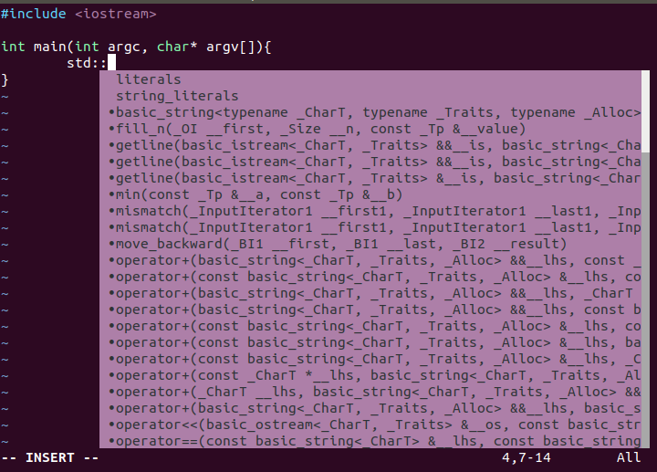

# 快速开始
## 介绍:

安装需要Git，触发git clone,默认将每一个指定特定格式插件的仓库复制到~/.vim/bundle/. 搜索需要Curl支持。

Windows用户请直接访问Windows setup. 如果有任何问题, 请参考 FAQ. 查看 Tips 获取相关高级配置。

使用 non-POSIX shells, 比如比较流行对 Fish shell, 需要额外对步骤。 请查看 FAQ.

## 初始安装 Vundle：
```
$ git clone https://github.com/VundleVim/Vundle.vim.git ~/.vim/bundle/Vundle.vim
```

## 配置插件 :

请将以下加在 .vimrc 方可使用Vundle. 删掉你不需要的插件, 这些只是用做示例.
```
set nocompatible              " 去除VI一致性,必须
filetype off                  " 必须

" 设置包括vundle和初始化相关的runtime path
set rtp+=~/.vim/bundle/Vundle.vim
call vundle#begin()
" 另一种选择, 指定一个vundle安装插件的路径
"call vundle#begin('~/some/path/here')

" 让vundle管理插件版本,必须
Plugin 'VundleVim/Vundle.vim'

" 以下范例用来支持不同格式的插件安装.
" 请将安装插件的命令放在vundle#begin和vundle#end之间.
" Github上的插件
" 格式为 Plugin '用户名/插件仓库名'
Plugin 'tpope/vim-fugitive'
" 来自 http://vim-scripts.org/vim/scripts.html 的插件
" Plugin '插件名称' 实际上是 Plugin 'vim-scripts/插件仓库名' 只是此处的用户名可以省略
Plugin 'L9'
" 由Git支持但不再github上的插件仓库 Plugin 'git clone 后面的地址'
Plugin 'git://git.wincent.com/command-t.git'
" 本地的Git仓库(例如自己的插件) Plugin 'file:///+本地插件仓库绝对路径'
Plugin 'file:///home/gmarik/path/to/plugin'
" 插件在仓库的子目录中.
" 正确指定路径用以设置runtimepath. 以下范例插件在sparkup/vim目录下
Plugin 'rstacruz/sparkup', {'rtp': 'vim/'}
" 安装L9，如果已经安装过这个插件，可利用以下格式避免命名冲突
Plugin 'ascenator/L9', {'name': 'newL9'}

" 你的所有插件需要在下面这行之前
call vundle#end()            " 必须
filetype plugin indent on    " 必须 加载vim自带和插件相应的语法和文件类型相关脚本
" 忽视插件改变缩进,可以使用以下替代:
"filetype plugin on
"
" 简要帮助文档
" :PluginList       - 列出所有已配置的插件
" :PluginInstall    - 安装插件,追加 `!` 用以更新或使用 :PluginUpdate
" :PluginSearch foo - 搜索 foo ; 追加 `!` 清除本地缓存
" :PluginClean      - 清除未使用插件,需要确认; 追加 `!` 自动批准移除未使用插件
"
" 查阅 :h vundle 获取更多细节和wiki以及FAQ
" 将你自己对非插件片段放在这行之后
```
## 安装插件:

运行 `vim` 再运行 `:PluginInstall`

通过命令行直接安装 `vim +PluginInstall +qall`

# 使用

## 查看帮助
```
:h vundle
```

## 常见命令
```
:PluginInstall
:PluginUpdate
:PluginSearch
:PluginList
:PluginClean
```

# 安装插件

## 安装 ctrlp 模糊搜索文件插件

打开 `.vimrc` 加入下面内容后，执行 `:PluginInstall` 。
```
Plugin 'ctrlpvim/ctrlp.vim'
```
ctrlp 插件使用

| 快捷键     | 功能                           |
| ---------- | ------------------------------ |
| ctrl + p   | 开启文件搜索                   |
| F5         | 刷新当前目录内容               |
| ctrl + f/b | 切换显示模式                   |
| ctrl + d   | 只搜索文件名                   |
| ctrl + r   | 正则查找模式                   |
| ctrl + j/k | 搜索结果中移动光标             |
| ctrl + t   | 新标签页打开                   |
| ctrl + v/x | 垂直分割打开 / 水平分割打开    |
| ctrl + n/p | 上下翻阅上次搜索历史           |
| ctrl + y   | 在选中文件的父级目录创建新文件 |
| ctrl + z   | 标记选择多个文件               |
| ctrl + o   | 选择打开方式                   |

## 安装 vim-autoformat 自动格式化插件
`.vimrc` 中增加
```
Plugin 'Chiel92/vim-autoformat'
```
增加快捷键配置
```
noremap <F3> :Autoformat<CR>
```
增加对python代码的支持,安装autopep8
```
pip install --upgrade autopep8
```
按F3开启自动格式化。

# 使用 LSP 插件

## 安装 vim-plug
```bash
curl -fLo ~/.vim/autoload/plug.vim --create-dirs \
    https://raw.githubusercontent.com/junegunn/vim-plug/master/plug.vim
```
如果由于网络问题，无法访问 https://raw.githubusercontent.com ，可以手动安装。

1. 下载 `plug.vim` 。
2. 将 `plug.vim` 移动到 `~/.vim/autoload/plug.vim` 。

安装成功后修改 `~/.vimrc` 声明插件安装，然后进入 VIM 中运行 `:PlugInstall` 命令安装插件。

```bash
" Plugins will be downloaded under the specified directory.
call plug#begin('~/.vim/plugged')

" 声明需要安装的插件
Plug 'prabirshrestha/vim-lsp'
Plug 'mattn/vim-lsp-settings'
Plug 'prabirshrestha/asyncomplete.vim'
Plug 'prabirshrestha/asyncomplete-lsp.vim'
Plug 'piec/vim-lsp-clangd'

" List ends here. Plugins become visible to Vim after this call.
call plug#end()
```
更多信息参考：https://github.com/junegunn/vim-plug


## 安装 vim-lsp
安装 vim-lsp 插件比较简单，上面安装 vim-plug 插件中已经安装好了。

这里主要讲一下注册服务。

例如：注册 python 服务。

首先安装 `python-language-server`。
```bash
pip install python-language-server
```

然后在 `~/.vimrc` 中，添加下列内容。
```bash
if executable('pyls')
    au User lsp_setup call lsp#register_server({
        \ 'name': 'pyls',
        \ 'cmd': {server_info->['pyls']},
        \ 'whitelist': ['python'],
        \ })
endif
```
更详细的信息参考： https://github.com/prabirshrestha/vim-lsp/wiki/Servers-Python 。

例如：安装 Clangd - C/C++ 。

首先安装 llvm。

然后将下面内容添加到 中。
```bash
if executable('clangd')
    au User lsp_setup call lsp#register_server({
        \ 'name': 'clangd',
        \ 'cmd': {server_info->['clangd', '-background-index']},
        \ 'whitelist': ['c', 'cpp', 'objc', 'objcpp'],
        \ })
endif
```
最后安装 `piec/vim-lsp-clangd` 插件。



更多信息请参考：https://github.com/prabirshrestha/vim-lsp/wiki 。