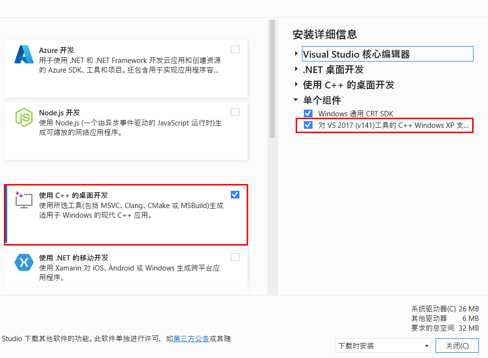
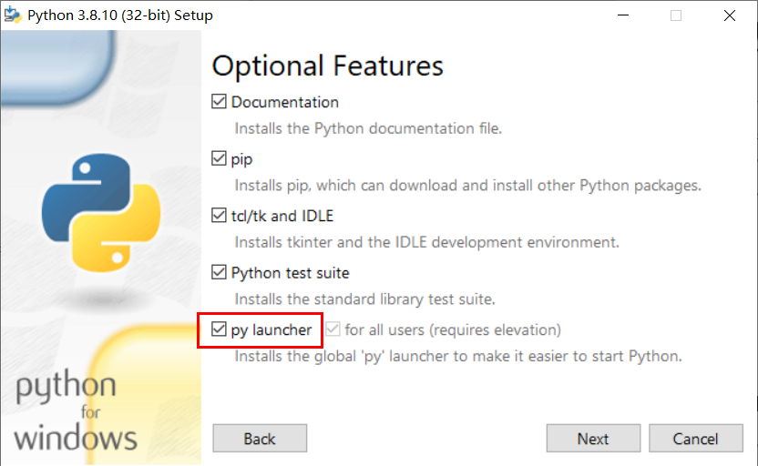
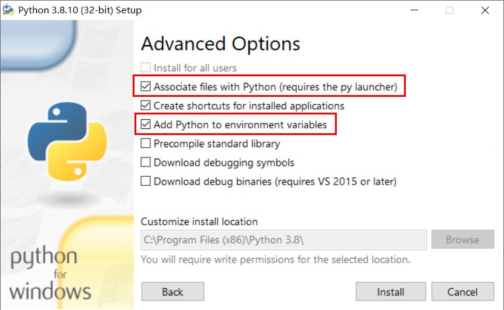
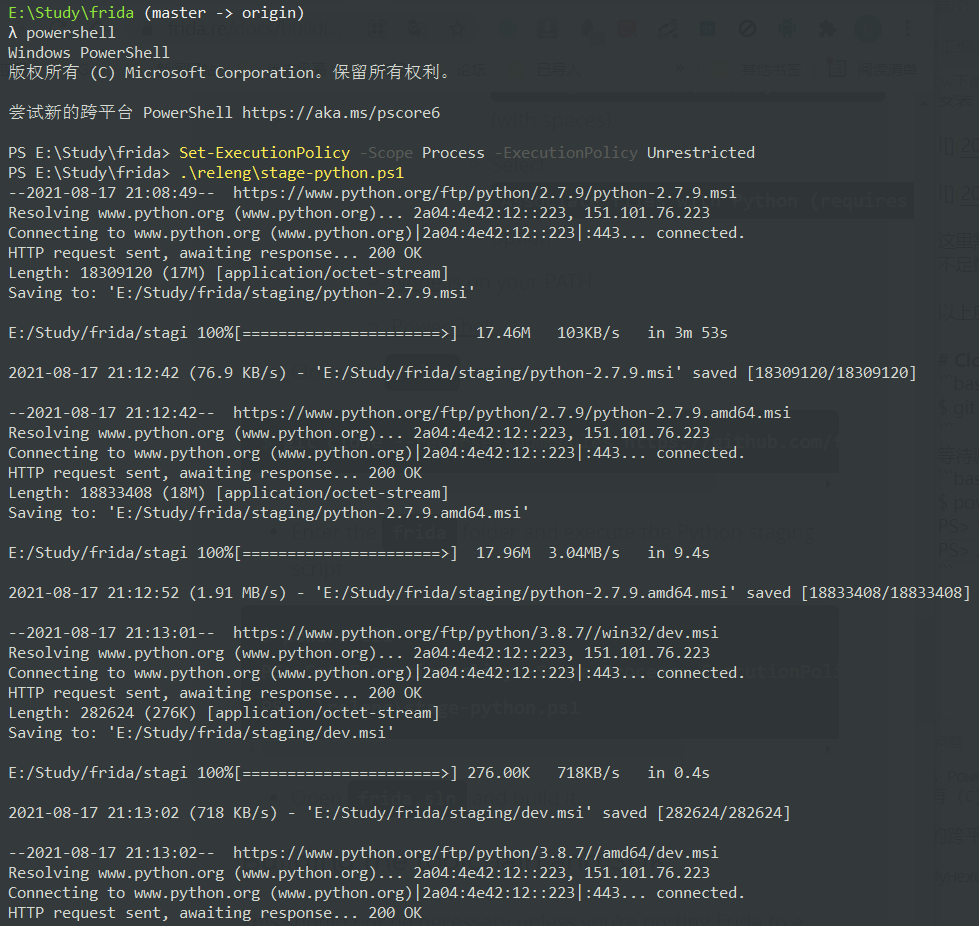
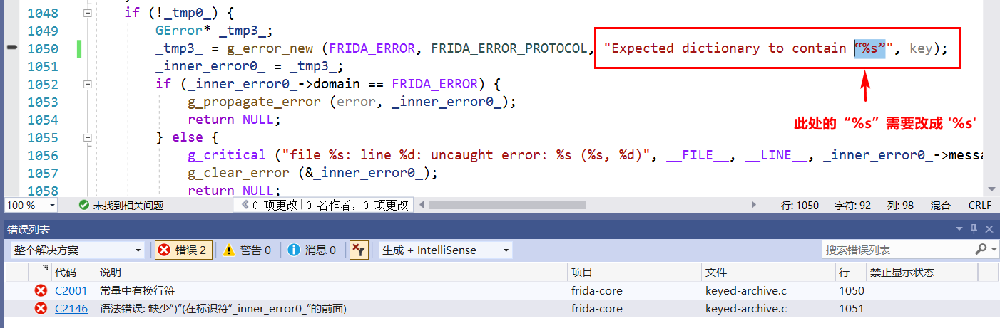
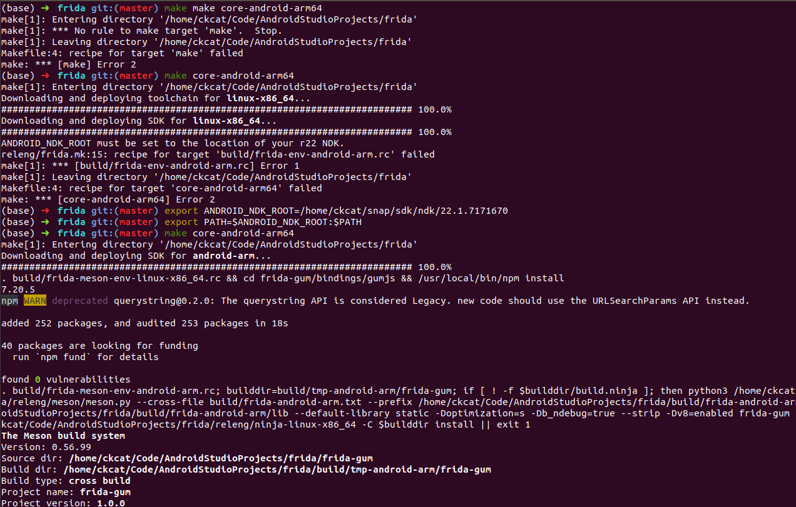

# 环境配置
安装 `VS2019` 选择 使用 `C++` 的桌面开发 ，并选择 对 `VS2017`（v141） 工具的 C++ Window XP 支持[已弃用] 组件，如下图所示。



安装 `git` 和 `nodejs` , 并加入环境变量。

安装 `python3.8` ，安装目录为 `C:\Program Files (x86)\Python 3.8\` ，安装选项如下图所示。





这里需要注意， `python` 最好安装在系统盘，因为安装在其他盘在编译过程中可能会出现 `python` 执行子命令权限不足的情况。

安装好以上应用之后，在 `cmd` 中应该可以执行 `git` , `node` , `python`, `py` 这些命令。

# 下载 Frida 源码并编译
下载 Frida 源码。
```bash
$ git clone --recurse-submodules https://github.com/frida/frida
```
等待源码下载完成，然后进入源码目录，执行下列命令。
```bash
$ powershell
PS> Set-ExecutionPolicy -Scope Process -ExecutionPolicy Unrestricted
PS> .\releng\stage-python.ps1
```



等待命令运行完成，然后打开 `frida.sln` 文件直接 `F7` 编译源码。

在编译过程中，可能会出现下列错误
```bash
严重性	代码	说明	项目	文件	行	禁止显示状态
错误	C2001	常量中有换行符	frida-core	e:\study\frida\build\tmp-windows\win32-debug\frida-core\src\fruity\keyed-archive.c	1050	
严重性	代码	说明	项目	文件	行	禁止显示状态
错误	C2146	语法错误: 缺少“)”(在标识符“_inner_error0_”的前面)	frida-core	e:\study\frida\build\tmp-windows\win32-debug\frida-core\src\fruity\keyed-archive.c	1051	
```
这里需要将 `keyed-archive.c` 文件中的 `“%s”`换成 `'%s'` ，这是由于相应的 `c` 文件 `keyed-archive.c`  来源于 `vala` 文件 `keyed-archive.vala` ，所以需要将对应 `valva` 里的所有宽字符 `“”` 替换为 `''` 。



以上的所有错误修改完后，再编译即可成功.

# 编译 frida-server
> 环境：Ubuntu 18.04 

根据官方文档，配置必要的环境，其中官方文档中提到的 `lib32stdc++-9-dev` 库安装不了，但是最后编译是没有问题的。
```bash
sudo apt-get install build-essential curl git libc6-dev-i386 nodejs npm python3-dev python3-pip
```

配置 `ndk` 环境变量。
```bash
export ANDROID_NDK_ROOT=/home/ckcat/snap/sdk/ndk/22.1.7171670
export PATH=$ANDROID_NDK_ROOT:$PATH
```

然后进入 `frida` 源码目录，执行下列命令进行编译。
```bash
make core-android-arm64    # 编译 arm64 的 frida-server
make core-android-arm        # 编译 arm 的 frida-server
```
执行以上命令，会自动下载对应的 `toolchain` 和 `sdk` ，编译好的




如果因为网络原因无法自动下载，可以手动下载，官方 `toolchain` 和 `sdk` 下载地址如下。
```bash
https://build.frida.re/deps/20210123/toolchain-linux-x86_64.tar.bz2
https://build.frida.re/deps/20210123/sdk-linux-x86_64.tar.bz2
https://build.frida.re/deps/20210123/sdk-android-arm.tar.bz2
https://build.frida.re/deps/20210123/sdk-android-arm64.tar.bz2
```
其中 `20210123` 是 `frida` 中 `releng/deps.mk` 中的 `frida_deps_version` 。

下载完之后，解压至 `frida/build` 目录，然后再执行上面的编译命令即可。（这个操作我没有试过，所以可能有坑，但是问题应该不大。）

> 这里要说明一点，我使用的 `Ubuntu 18.04` 此前编译过 `Android` 系统，所以可能装的库比较齐全，如果安装上面的库以后还是编译不了，那么就根据报错信息安装对应的库就好了。


# 参考 
```bash
https://frida.re/docs/building/#windows
https://bbs.pediy.com/thread-267015.htm
https://blog.seeflower.dev/archives/16/
https://github.com/hluwa/strongR-frida-android/blob/main/.github/workflows/build.yml
```

