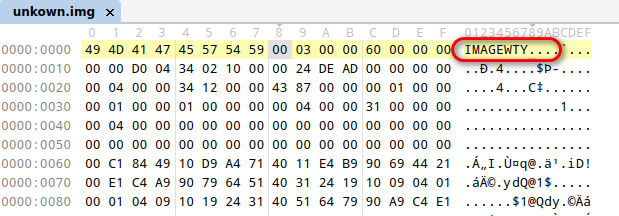
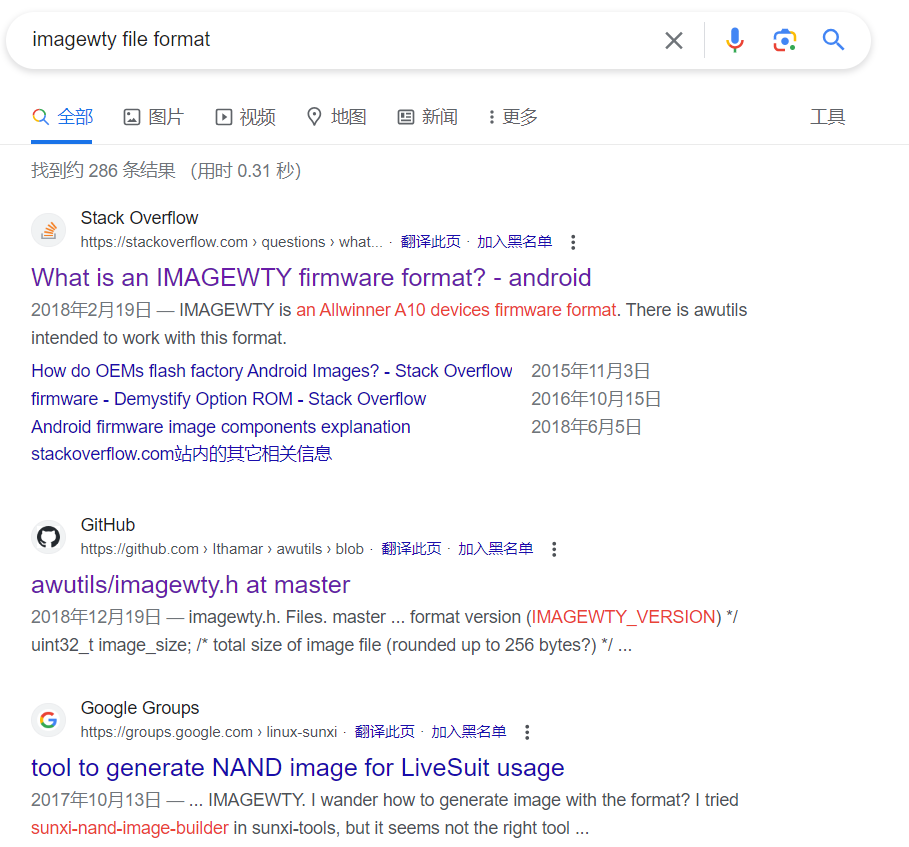
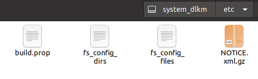

最近遇到一个 ROM 包，需要获取其中的 APK，因此产生了解包的需求。

首先使用 `file` 命令查看文件格式：

```bash
$ file unkown.img
unkown.img: data
```

发现为 data 类型，即未知格式，接下来使用 [010Editor](http://www.010editor.com/) 查看，发现文件头有 `IMAGEWTY` 标志：



接着搜索 `imagewty file format` 关键字，找到这个项目：https://github.com/Ithamar/awutils 。



编译 `awimage`。

```bash
$ git clone https://github.com/Ithamar/awutils
Cloning into 'awutils'...
remote: Enumerating objects: 181, done.
remote: Total 181 (delta 0), reused 0 (delta 0), pack-reused 181
Receiving objects: 100% (181/181), 64.50 KiB | 92.00 KiB/s, done.
Resolving deltas: 100% (99/99), done.
$ cd awutils
$ make awimage
cc  -Wall -o awimage awimage.c parsecfg.c twofish.c rc6.c
awimage.c: In function ‘decrypt_image’:
awimage.c:371:43: warning: variable ‘firmware_id’ set but not used [-Wunused-but-set-variable]
...
```

执行 awimage 程序解包。

```bash
$ ./awimage unkown.img
./awimage: unpacking unkown.img to unkown.img.dump
Extracting: COMMON   SYS_CONFIG100000 (17060, 17072)
Extracting: COMMON   BOARD_CONFIG_BIN (1024, 1024)
Extracting: COMMON   SYS_CONFIG_BIN00 (27648, 27648)
Extracting: COMMON   SPLIT_0000000000 (512, 512)
Extracting: COMMON   SYS_CONFIG000000 (5789, 5792)
Extracting: COMMON   DTB_CONFIG000000 (154112, 154112)
Extracting: BOOT     BOOT0_0000000000 (73728, 73728)
...
```

这时会在当前目录下产生一个 `unkown.img.dump` 目录，其中为解包的内容，找到文件名包含 `SUPER` 的文件 `RFSFAT16_SUPER_FEX0000000`，再次使用 `file` 命令查看文件格式。

```bash
$ file RFSFAT16_SUPER_FEX0000000
RFSFAT16_SUPER_FEX0000000: Android sparse image, version: 1.0, Total of 917504 4096-byte output blocks in 63 input chunks.
```

这时可以看到文件格式为 `Android sparse image, version: 1.0`，搜索相关关键字，找到工具 [android-simg2img](https://github.com/anestisb/android-simg2img)，接着编译获取工具。

```bash
$ git clone https://github.com/anestisb/android-simg2img.git
Cloning into 'android-simg2img'...
remote: Enumerating objects: 195, done.
remote: Counting objects: 100% (7/7), done.
remote: Compressing objects: 100% (6/6), done.
remote: Total 195 (delta 1), reused 7 (delta 1), pack-reused 188
Receiving objects: 100% (195/195), 103.10 KiB | 99.00 KiB/s, done.
Resolving deltas: 100% (100/100), done.
$ cd android-simg2img
$ make
g++ -std=gnu++17 -O2 -W -Wall -Werror -Wextra -D__STDC_FORMAT_MACROS -D__STDC_CONSTANT_MACROS -Iinclude -Iandroid-base/include -c backed_block.cpp -o backed_block.o
g++ -std=gnu++17 -O2 -W -Wall -Werror -Wextra -D__STDC_FORMAT_MACROS -D__STDC_CONSTANT_MACROS -Iinclude -Iandroid-base/include -c output_file.cpp -o output_file.o
g++ -std=gnu++17 -O2 -W -Wall -Werror -Wextra -D__STDC_FORMAT_MACROS -D__STDC_CONSTANT_MACROS -Iinclude -Iandroid-base/include -c sparse.cpp -o sparse.o
g++ -std=gnu++17 -O2 -W -Wall -Werror -Wextra -D__STDC_FORMAT_MACROS -D__STDC_CONSTANT_MACROS -Iinclude -Iandroid-base/include -c sparse_crc32.cpp -o sparse_crc32.o
g++ -std=gnu++17 -O2 -W -Wall -Werror -Wextra -D__STDC_FORMAT_MACROS -D__STDC_CONSTANT_MACROS -Iinclude -Iandroid-base/include -c sparse_err.cpp -o sparse_err.o
g++ -std=gnu++17 -O2 -W -Wall -Werror -Wextra -D__STDC_FORMAT_MACROS -D__STDC_CONSTANT_MACROS -Iinclude -Iandroid-base/include -c sparse_read.cpp -o sparse_read.o
g++ -std=gnu++17 -O2 -W -Wall -Werror -Wextra -D__STDC_FORMAT_MACROS -D__STDC_CONSTANT_MACROS -Iinclude -Iandroid-base/include -c android-base/stringprintf.cpp -o
...
```

执行 `simg2img` 命令：

```bash
$ ./simg2img RFSFAT16_SUPER_FEX0000000 super.img
$ file super.img
super.img: data
```

可以发现 Android sparse image 并没有被转为 ext4 的 image，实际上直接使用 7z 可以解压这个文件，但是解压出来也无法识别文件格式。

这里使用关键字 `super img unpack` 搜索，找到了一个项目：[super_image_dumper](https://github.com/munjeni/super_image_dumper)，然后编译使用。

```bash
$ git clone https://github.com/munjeni/super_image_dumper
Cloning into 'super_image_dumper'...
remote: Enumerating objects: 186, done.
remote: Total 186 (delta 0), reused 0 (delta 0), pack-reused 186
Receiving objects: 100% (186/186), 9.64 MiB | 243.00 KiB/s, done.
Resolving deltas: 100% (107/107), done.
$ cd super_image_dumper
$ make
gcc -Wall -g -O2 -Iinclude superunpack.c -o superunpack
```

使用 `superunpack` 操作 `super.img` 可以解压出来一些文件，最后发现这个操作与使用 7z 解压的效果一样。

```bash
$ ./superunpack super.img
---------------------------------------------------------
Super image unpacker v_15 by munjeni @ xda 2020)
---------------------------------------------------------

LpMetadataGeometry magic = 0x616c4467
LpMetadataGeometry struct size = 0x34
LpMetadataGeometry sha256 = 123456F0ABA7B506F25CB5DA5DCA09344234E8DF1D9C93AE82A499D98019467E
LpMetadataGeometry metadata_max_size = 0x10000
LpMetadataGeometry metadata_slot_count = 0x3
LpMetadataGeometry logical_block_size = 0x1000
...
```

其中值得关注的是文件名包含 system 的文件 `system_dlkm_a.ext4` 和 `system_a.bin`，使用 `file` 命令查看文件格式：

```bash
$ file system_a.bin
system_a.bin: data
$ file system_dlkm_a.ext4
system_dlkm_a.ext4: Linux rev 1.0 ext2 filesystem data, UUID=0887d040-56a8-4f76-b47d-4b2685db8d45, volume name "system_dlkm" (extents) (large files) (huge files)
```

`system_a.bin` 为未知文件，`system_dlkm_a.ext4` 为 `Linux rev 1.0 ext2 filesystem data` 文件，然后挂载 `system_dlkm_a.ext4` 文件，

```bash
$ mkdir system
$ sudo mount -t ext4 -o loop system_dlkm_a.ext4 system
[sudo] password for ckcat:
```

可以发现 `system_dlkm_a.ext4` 为下图中展示的内容：



这时仍然没有实现我们最初的目标，尝试搜索了一下 `system_dlkm_a.ext4`，发现了这一段话：`system_dlkm` 分区的文件系统应该是 `EROFS` 而不是 `EXT4`。后续也搜了一下 `EROFS` 格式，但是没有深入。这时找到了一篇[文章](https://xdaforums.com/t/editing-system-img-inside-super-img-and-flashing-our-modifications.4196625/)，在其中发现了 [imjtool](https://newandroidbook.com/tools/imjtool.html) 工具。接下来试了一下这个工具。

```bash
$ ./imjtool.ELF64 system_a.bin
Huawei EROFS (not handled yet)
```

虽然没有能够成功解包，但是至少知道了文件格式为 `Huawei EROFS`。搜索 `EROFS unpack` 找到了工具 [erofs-extract](https://github.com/sekaiacg/erofs-extract)。接下来下载使用：

```bash
$ ./extract.erofs -i system_a.bin -x
Extract:        Starting...
Extract:        [ 100.00% ]
fs_config:      save...
fs_config:      done.
files_context:  save...
files_context:  done.
Extract:        The operation took: 4.758 second(s).
```

该工具可以解包 `EROFS` 格式，达到了最初的目的，获取到了相应的 APK。

整个过程其实比较曲折，本文只是记录了一些比较重要的点，并将顺序进行了调整。

参考：

https://wuxianlin.com/2019/03/22/android-reverse-engineering

https://xdaforums.com/t/editing-system-img-inside-super-img-and-flashing-our-modifications.4196625/
