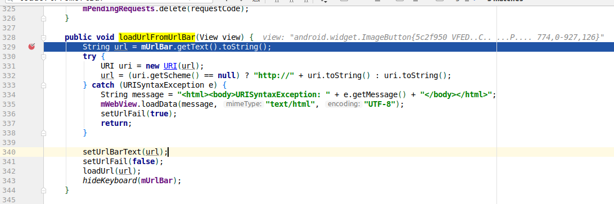

<!-- TOC -->

- [一、导入源码到 Android Studio](#一导入源码到-android-studio)
  - [1. 编译 idegen](#1-编译-idegen)
  - [2. 导入源码](#2-导入源码)
  - [3. 开始调试](#3-开始调试)

<!-- /TOC -->
# 一、导入源码到 Android Studio
导入源码到 Android Studio
要在 Android Studio 中调试源码，那第一步自然是导入系统源码到 Android Studio 中了。

## 1. 编译 idegen
对于 Android 源码的导入， Google 官方给我们提供了一个很方便的工具idegen

它位于我们所下载的系统源码路径中：
```
developement/tools/idegen
```
引用 README 的一句话
```
IDEGen automatically generates Android IDE configurations for IntelliJ IDEA and Eclipse.
```
idegen 工具会自动生成针对 Android 开发工具（Android Studio和Eclipse）的配置文件。 既然如此，那我们就来使用 idegen 工具生成导入源码所需的配置文件。

首先打开命令行工具，cd 进入到源码路径下，

执行如下指令：
```
#初始化命令工具
soruce build/envsetup.sh 

#编译 idegen 模块，生成idegen.jar
mmm development/tools/idegen/

#生成针对 Android 开发工具的配置文件 
sudo ./development/tools/idegen/idegen.sh

```


在执行完上述指令后，会在源码路径下生成下面三个文件


```
android.ipr：工程相关的设置，比如编译器配置、入口，相关的libraries等。

android.iml：描述了modules，比如modules的路径,依赖关系等。

android.iws：包含了一些个人工作区的设置。
```

## 2. 导入源码
接下来我们可以开始导入源码了.

由于Android太大了,所以我们需要给IDE更多的内存，在Help > Edit Custom VM 中添加:
```
-Xms1g
-Xmx5g
```
这两个参数的意思是初始堆内存为1G,最大堆内存为5G，其实不设置也没什么问题,但是经常会在看代码的时候,出现内存不够的错误信息,所以换个大内存还是很有必要的。

然后是AndroidStudio的类大小配置,在Help -> Edit custom properties中添加:
```
idea.max.intellisense.filesize=100000
```
这个参数是定义AS默认的类大小的,默认值是2500,会导致太大的Java文件不能被识别,把这个数调大,
配置完成后重启IDE。

使用 `AndroidStudio` 打开 `android.ipr` ，之后AndroidStudio就开始打开项目了,这个过程会比较缓慢,有时,AS会出现如下信息:
```
Extnrnal file changes sync may be slow:The current inotify(7) watch limit is too low.
```
大致的意思就是由于项目过于庞大,现在AS没有办法很好的监视整个项目的改变了,可以通过如下方式解决:

1. 在/etc/sysctl.conf 文件末尾中添加如下代码:
```
fs.inotify.max_user_watches = 524288
```

2. 然后在终端执行以下命令:
```
sudo sysctl -p --system
```

最后重启AS，等待源码加载完成。


由于 Android 的系统源码非常庞大，一次性导入 Android Studio 的话需要加载非常长的时间

因此，在正式开始导入前，我们可以打开 android.iml 文件根据自己需要调整要加载的源码。


这里` <excludeFolder>` 表示不需要加载的目录，我们根据自己的需要使用 `<excludeFolder>` 标签添加对应的目录地址即可。


在加载完源码后，我们也可以在 Project Structure 中的 Module 选项中右键 exclude 来排除不需要加载的源码目录，如图：


## 3. 开始调试
调试前要设置 Project 的 SDK ，File -> Project 下打开 Project Structure，选中 Project 设置对应版本的 SDK，于系统版本一致：


此时点击 `Android Studio` 工具栏的 `run -> attach debugger to Android process` 按钮，会打开 `Choose Process` 窗口，我们根据自己需要调试的代码选择对应的进程：


这里假设我们要调试 `Android` 自带浏览器的源码，如图，我们在它的入口文件 `WebViewBrowserActivity` 中的 `loadUrlFromUrlBar` 方法中打上断点。


然后我们在 `app` 的 `url` 输入栏输入 网址进行跳转,我们可以看到，代码成功进入了断点，然后我们就可以随心所欲地调试我们想要的调试的 Java 代码了。




> 参考：
> 
> https://www.jianshu.com/p/4ab864caefb2
> 
> http://gityuan.com/2016/08/13/android-os-env/