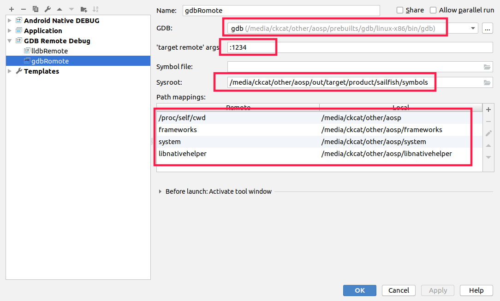
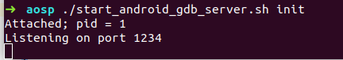
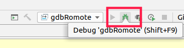
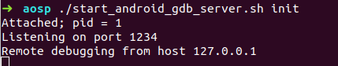
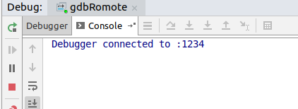
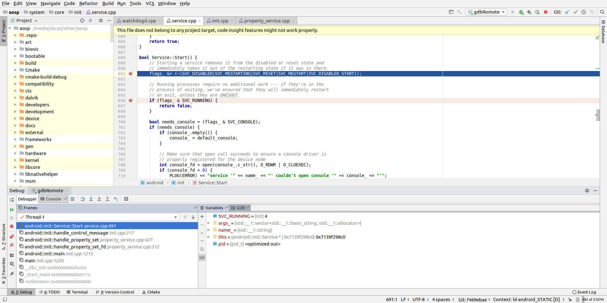
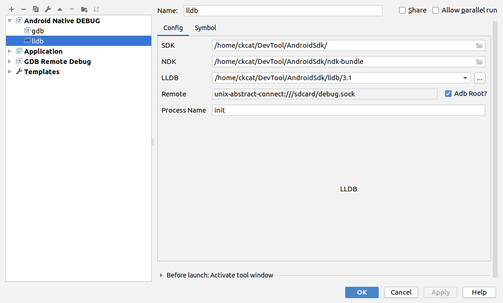
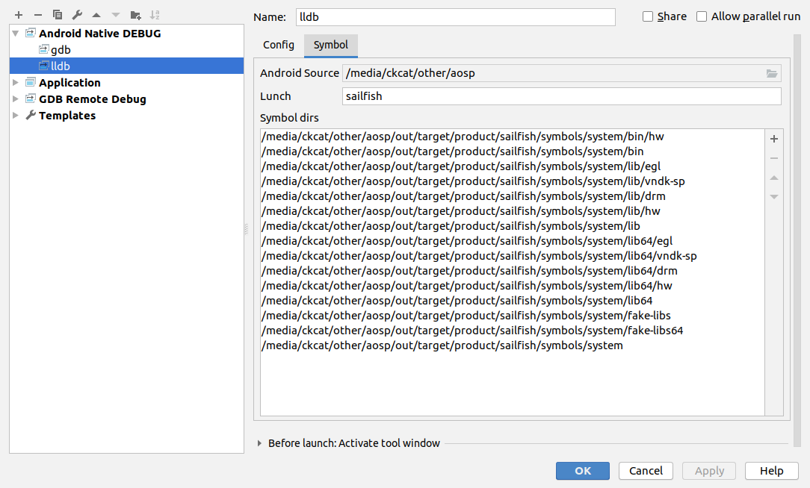

<!-- TOC -->

- [一、Clion配置](#一clion配置)
  - [1.编写CMakelists.txt](#1编写cmakeliststxt)
- [二、 导入Aosp项目，配置远程调试](#二-导入aosp项目配置远程调试)
  - [1. 配置gdb远程调试环境](#1-配置gdb远程调试环境)
  - [2. 编写android_gdbserver脚本](#2-编写android_gdbserver脚本)
  - [3. 调试](#3-调试)
- [三、其他](#三其他)
  - [1. 打开调试](#1-打开调试)
  - [2. 配置CMakeList,并导入源码](#2-配置cmakelist并导入源码)
  - [3. 安装AndroidNativeDebug插件，并配置](#3-安装androidnativedebug插件并配置)

<!-- /TOC -->
# 一、Clion配置
## 1.编写`CMakelists.txt`
目前CLion只能识别CMake项目，所以为了使用CLion调试AOSP，需要编写CMakeList.txt。否则无法使用远程调试功能。
参考这篇博客[Android Native C/C++ 使用CLion阅读/编译技巧](https://blog.csdn.net/li864804994/article/details/79487834)

直接下载此地址的配置文件[android-cmake-project](https://github.com/Ahren-Li/android-cmake-project)，并拷贝至Android源码根目录。

配置`env_android.cmake`文件，我的配置如下：
```

set(ANDROID_SDK_VERSION 27)
set(ANDROID_LUNCH sailfish) # 编译目标
set(ANDROID_TARGET_ARCH arm64)
#set(ANDROID_ABI "armeabi-v7a")
#set(ANDROID_ABI "armeabi-v7a with NEON")
set(ANDROID_ABI "arm64-v8a")
set(ANDROID_TOOLCHAIN_NAME "clang")
set(ANDROID_STL c++_static)
set(ANDROID_CLANG_VERSION "clang-4053586")
#set(ANDROID_PLATFORM android-25)
#set(ANDROID_NATIVE_API_LEVEL 25)
```

# 二、 导入Aosp项目，配置远程调试
导入aosp需要等待index完成。

## 1. 配置gdb远程调试环境
选择 `Edit Configurations` -> `GDB Remote Debug` 按照下图进行配置：


```
GDB: 这里我配置的为源码目录下的gdb
‘target remote’ args: 这里填的端口号
Sysroot: 这里填源码路径下的symbols
Path mappings: 根据自己的源码填相应的path
```
## 2. 编写android_gdbserver脚本
这里我对[原博](https://blog.csdn.net/lylwo317/article/details/86545130)中的脚本做了一点小修改，将 `gdbserver` 改为了 `gdbserver64` 。原因是后面调试时使用`gdb`连接不上远程的`gdbserver`，报错信息为`Reply contains invalid hex digit 59`，然后改为`gdbserver64`就可以了。猜测与`init`为64位程序有关。

`-s ~/script/start_android_gdb_server.sh`
```
#!/usr/bin/env bash
gdbServerPid=`adb shell ps | grep gdbserver | awk '{print $2}'`

if [[ "" != ${gdbServerPid} ]]; then
    adb shell su -c "kill ${gdbServerPid}"
fi

adb forward tcp:1234 tcp:1234

if [[ `adb shell whoami` == 'root'  ]]; then
    is_root=true
fi

if [[ -n $1 ]]; then
	appPid=`adb shell ps | grep ${1} | awk '{print $2}'`
	if [[ -n ${appPid} ]]; then
        if [[ $is_root == true  ]]; then
            adb shell gdbserver64 :1234 --attach ${appPid}
        else
            adb shell su -c "gdbserver64 :1234 --attach ${appPid} "
        fi
    else
    	echo "$1 进程没有启动！"
	fi
else
	echo "请设置要调试的进程名（app的进程名是包名）。例如 $0 <process name>"
fi
```

通过软连接连接到 ~/bin目录下
```
ln -s ~/script/start_android_gdb_server.sh ~/bin/android_gdb_server
```

## 3. 调试
这里通过调试zygote来演示如何使用CLion调试

1. 先停止zygote服务
```
adb shell stop zygote
```

2. 启动gdbserver
   


3. 点击调试按钮（右边绿色按钮）



如下图表示连接成功




4. 设置断点位置如下
`system/core/init/service.cpp`
```
bool Service::Start() {
    // Starting a service removes it from the disabled or reset state and
    // immediately takes it out of the restarting state if it was in there.
    flags_ &= (~(SVC_DISABLED|SVC_RESTARTING|SVC_RESET|SVC_RESTART|SVC_DISABLED_START));

    // Running processes require no additional work --- if they're in the
    // process of exiting, we've ensured that they will immediately restart
    // on exit, unless they are ONESHOT.
    if (flags_ & SVC_RUNNING) {//在这里断点
        return false;
    }
    ...
}
```

5. 启动zygote服务
```
adb shell start zygote
```

6. 停止在断点处



> 参考：https://blog.csdn.net/lylwo317/article/details/86545130

# 三、其他

使用[此链接](https://www.lili.kim/2019/01/28/android/Debug%20Android%20Native%20with%20LLDB/)的方法进行调试，记录以下使用过程，虽然未成功。

## 1. 打开调试

将下列内容添加至 `aosp/build/core/binary.mk` 中， 加了之后编译的系统暂时未感觉有什么不同。
```
......
# No one should ever use this flag. On GCC it's mere presence will disable all
# warnings, even those that are specified after it (contrary to typical warning
# flag behavior). This circumvents CFLAGS_NO_OVERRIDE from forcibly enabling the
# warnings that are *always* bugs.
my_illegal_flags := -w
my_cflags := $(filter-out $(my_illegal_flags),$(my_cflags))
my_cppflags := $(filter-out $(my_illegal_flags),$(my_cppflags))
my_conlyflags := $(filter-out $(my_illegal_flags),$(my_conlyflags))

#调试信息
ifndef LOCAL_IS_HOST_MODULE
    lili_test_so := libsurfaceflinger libcutils liblog libbinder libutils \
                    libc++ libc libm libhardware libui libgui libpowermanager \
                    libvulkan libbacktrace libsync libnativeloader libbase libz \
                    gralloc.msm8974 libmemalloc hwcomposer.msm8974 liboverlay libhdmi \
                    libhardware_legacy libmedia libskia libvirtual libstdc++

    ifneq (,$(filter $(LOCAL_MODULE), $(lili_test_so)))
            my_cflags_no_override += -O0 -g3 -Wno-error
            ifeq ($(my_clang),true)
                my_cflags_no_override += -fno-limit-debug-info -glldb
            else
                my_cflags_no_override += -ggdb3
            endif
    endif
endif

$(LOCAL_INTERMEDIATE_TARGETS): PRIVATE_YACCFLAGS := $(LOCAL_YACCFLAGS)
```

## 2. 配置CMakeList,并导入源码
这个和之前的没有区别，略。

## 3. 安装`AndroidNativeDebug`插件，并配置



| Name         | Description                                              | Default                                    |
| ------------ | -------------------------------------------------------- | ------------------------------------------ |
| SDK          | Android SDK Path                                         | none                                       |
| NDK          | Android NDK Path (Auto gen when ndk-bundle exist in SDK) | none                                       |
| LLDB         | LLDB Path (Auto gen when lldb exist in SDK)              | none                                       |
| Remote       | LLDB Target Remote                                       | unix-abstract-connect:///sdcard/debug.sock |
| Adb Root     | The adb can root?                                        | false                                      |
| Process Name | The name of debug process                                | none                                       |




| Name           | Description              | Default |
| -------------- | ------------------------ | ------- |
| Android Source | Android Source Tree Path | none    |
| Lunch          | Android target lunch     | none    |

后续直接进行调试就可以了。

我这里遇到的问题，可以启动调试，但是断点无法段下来，后续有时间再研究。

> 参考：https://www.lili.kim/2019/01/28/android/Debug%20Android%20Native%20with%20LLDB/