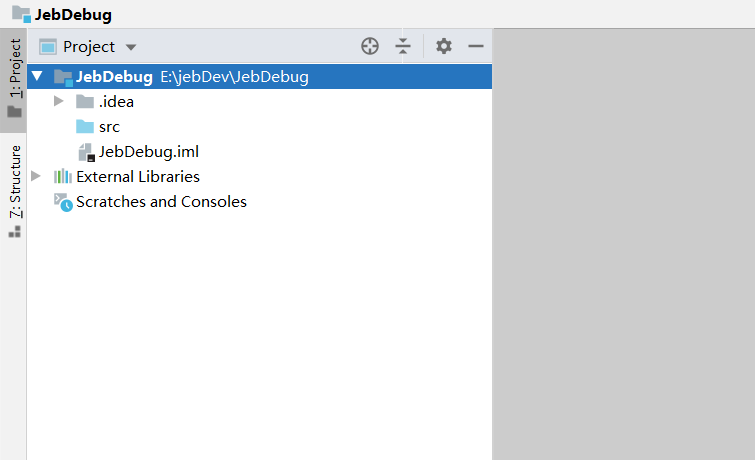
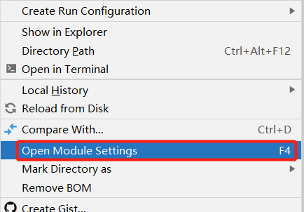
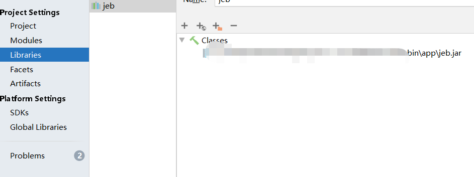
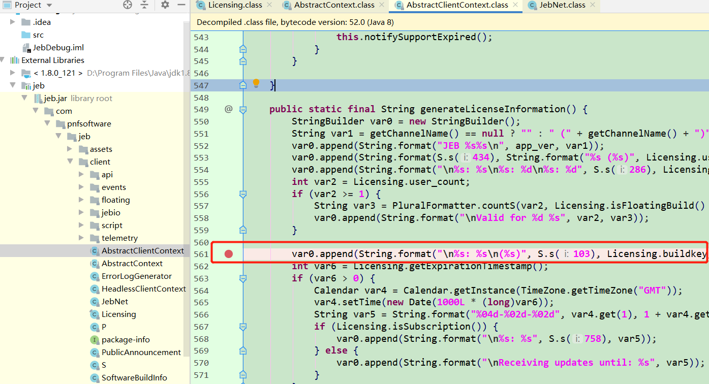
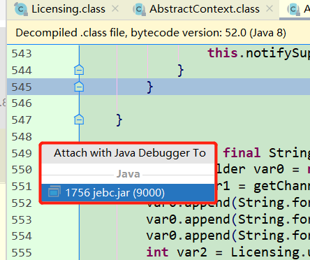
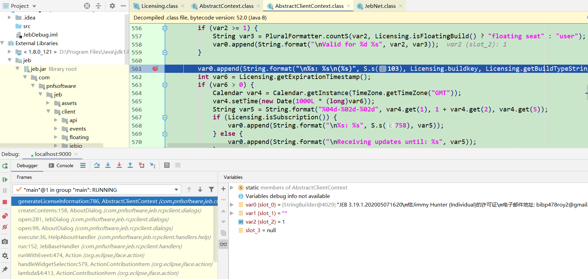

参考:
> http://scz.617.cn:8/misc/202006051232.txt

> https://www.ms509.com/2020/03/19/Java-Debug/

<!-- TOC -->

- [前期准备](#%E5%89%8D%E6%9C%9F%E5%87%86%E5%A4%87)
- [开始调试](#%E5%BC%80%E5%A7%8B%E8%B0%83%E8%AF%95)

<!-- /TOC -->

# 1. 前期准备

使用 Idea 新建一个空 java 工程。



把待调试的jar包加入到工程的依赖包中：右键点击工程名，选择 `Open
Module Setteings` 。



然后在Libraries中加入待调试的jar文件。



然后就可以在工程中反编译jar包了，下好断点。



# 2. 开始调试

以调试方式启动 jeb 。
```
java -jar -Xdebug -Xrunjdwp:transport=dt_socket,address=9000,server=y,suspend=n jebc.jar
```

使用 Idea 附加 Jeb , `Run->Attach to Process` 选中 jeb。



在 jeb 中选则关于，可以看到直接断在断点处。




可以很清楚的看到和修改各变量的值，剩下的就自我发挥了。


## Jeb 配置

1. 禁止自动展开包结构

- jeb 5.x 

进入下面设置面板 `Edit -> Options -> Back-end Properties... -> parsers -> dex` 滚动进度条至 `Well known library packages` GroupBox 控件，将该控件中编辑框内容修改为 `*` 。


