# 动态调试送给最好的 TA

> 如果手机系统是 android 10，那么需要设置一下

```bash
export IDA_LIBC_PATH=/apex/com.android.runtime/lib/bionic/libc.so
or export IDA_LIBC_PATH=/apex/com.android.runtime/lib64/bionic/libc.so
```

参考：https://bbs.pediy.com/thread-258103.htm

## 常规方式

### 1. 使用 IDA 打开需要调试的 so 文件，找到关键的方法，设置断点。

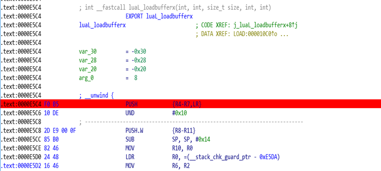

### 2. 选择 Android 调试器，设置 hostname 和端口。

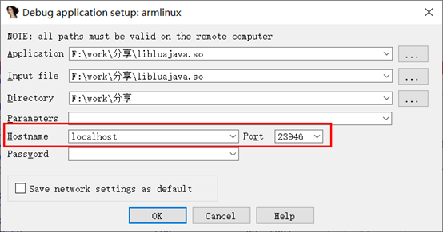

### 3. 开始调试

- 启动 `android_server` 。
- 端口转发 `adb forward tcp:23946 tcp:23946` 。
- 以调试模式启动对应的 Activaty ，`adb shell am start -D -n com.sgzh.dt/com.androlua.Welcome` 。

执行完以上操作完，使用 IDA 附加对应的 APP 。

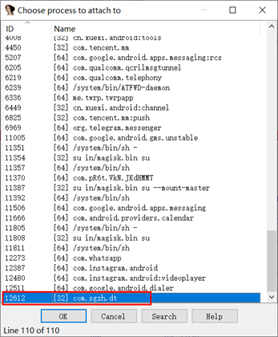

### 4. jdb 连接

打开 monitor ，查看 APP 的调试端口，使用 jdb 命令连接 ` jdb -connect com.sun.jdi.SocketAttach:hostname=127.0.0.1,port=8700` 。

> 通过 `adb forward tcp:<hostport> jdwp:<pid>` 命令，替代使用 DDMS 的方式。

此时 APP 将会运行起来，IDA 将会弹出下列界面，点击 same 就可以了。

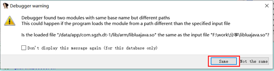

最终将会断在我们之前下断点的地方。

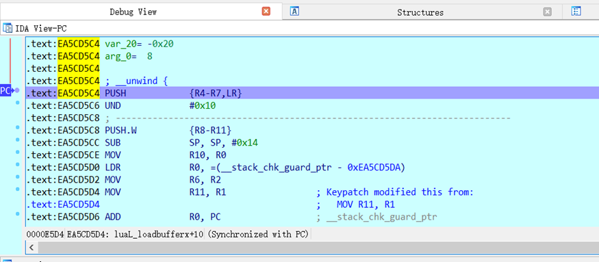

### 5. 分析并 dump lua 字节码

通过参考其他文章可知 luaL_loadbufferx 是关键解密函数，但是也需要我们要分析解密的具体地方。看到有 malloc 就很可疑。我们就需要重点关注这个地方。通过调试发现其申请的空间就是存放解密后的 lua 字节码。

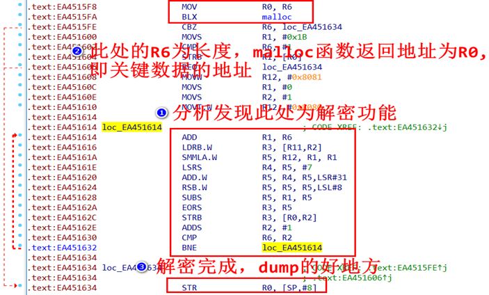

编写 dump 脚本，下面提供了 IDC 和 Python 脚本。

`dump.idc`

```c
static main()
{
    auto i,fp;
    fp = fopen("d:\\init.lua","wb");
    auto start = 0xF18B7140;
    auto size = 0x1A6;
    for(i = 0; i < size; i++)
        fputc(Byte(start + i),fp);
}
```

`dump.py`

```python
import idaapi
start_address = 0xF18B7140
data_length = 0x1A6
data = idaapi.dbg_read_memory(start_address ,
data_length)
fp = open('d:\\dump1', 'wb')
fp.write(data)
fp.close()
print "Dump OK"
```

### 将字节码转换为 lua 代码

在网上找到 `unluac_2015_06_13.jar` ，将 lua 节码转换为 lua 代码。

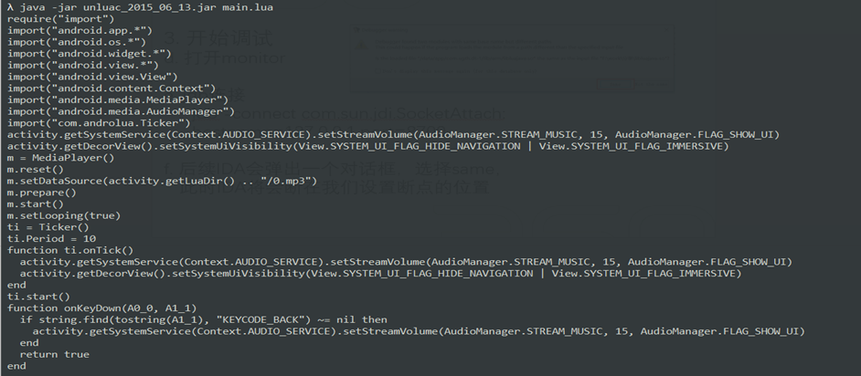

## 修改 so 方式

这种方式主要是探索 IDA 断点的字节码，同样使用于探索其他调试器的断点字节码。

### 修改字节码

使用 IDA 打开需要调试的 so 文件，找到关键的方法，修改字节码，并将修改后的内容保存至文件。

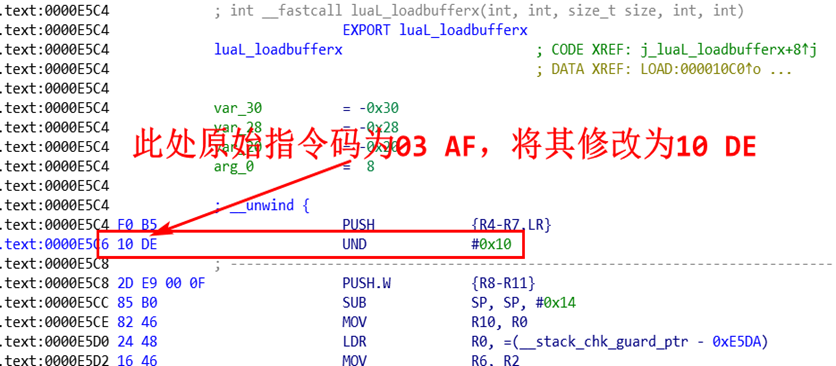

为什么将字节码修 03 AF 改为 10 DE 。

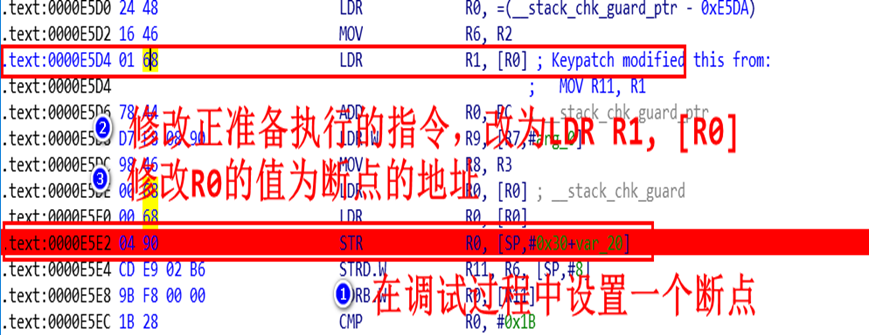

使用的 IDA 插件：

```bash
下载Keypatch.py复制到插件目录：https://github.com/keystone-engine/keypatch
下载安装keystone python模块：https://github.com/keystone-engine/keystone/releases/download/0.9.1/keystone-0.9.1-python-win64.msi
```

**注意**

> 其实这里不一定要使用这种方式获取断点的字节码，也可以通过循环断下来，将指令改为一个死循环，最后暂停就可以断到相应的位置了，最后再将指令改回去就可以了。

最后重打包，按照之前的方式调试即可。

# 如何在 `.init_proc` 和 `init_arrary` 调用下断点

## `.init_proc` 函数和 `init_arrary` 的产生方法。

`_init` 函数经过编译后就是 `.init_proc` 函数，是目前我所知道的在 so 最早被调用的函数 。`_init` 函数无参，无返回值，其次必须函数名必须是 `_init` ，并且不能名称粉碎。

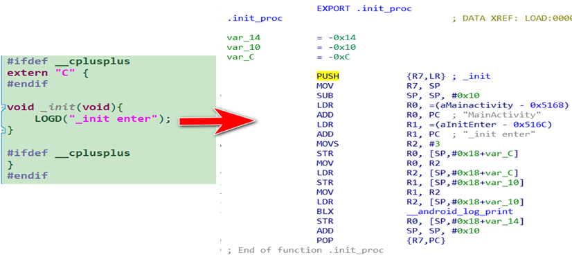

函数添加 `__attribute__((constructor))` 属性后，就会将对应的函数指针放在 `init_array` 节中，在 JNI_Onload 之前被调用。

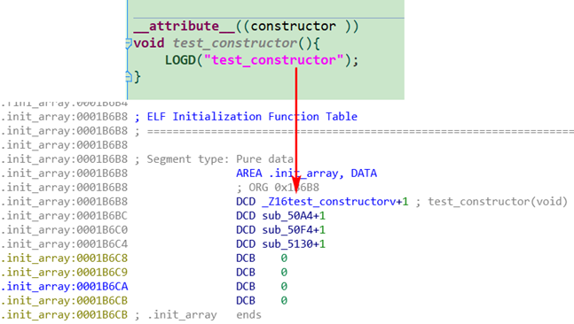

执行结果如下：

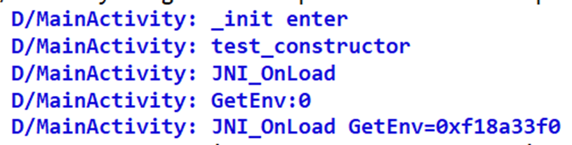

可以看到先执行的 `.init_proc` 函数，然后执行 `init_arrary` 节里的函数，最后执行 JNI_Onload 。

## 通过源码找到调用的关键位置

由于 `.init_proc` 和 `init_arrary` 是在 so 加载完成前调用的，那么就需要知道他们是在何时调用的，这里就需要跟一下 dlopen 的源码，最终会发现调用他们实现在 `linker.cpp `中，这一块大家有兴趣可以自己看看。我这里就直接给 android 7.1.2 源码中的关键点了。

`http://androidxref.com/7.1.2_r36/xref/bionic/linker/linker.cpp`

```cpp
void soinfo::call_function(const char* function_name __unused,
                           linker_function_t function) {
  if (function == nullptr
      || reinterpret_cast<uintptr_t>(function) == static_cast<uintptr_t>(-1)) {
    return;
  }

  TRACE("[ Calling %s @ %p for \"%s\" ]", function_name, function, get_realpath());
  function(); //直接调用函数指针
  TRACE("[ Done calling %s @ %p for \"%s\" ]", function_name, function, get_realpath());
}
```

大家看源码时也最好根据自己的手机版本看相对应的源码。其中 `funcion()` 就是调用 `.init_proc` 和 `init_arrary` 的地方，大家看看这个地方有什么特点？我们可以根据其上下两行输出字符串确定其位置。

我们直接到手机的 `system/bin` 目录中导出 linker 文件，如果调试 ARMv8 则需要导出 linker64 文件。通过查找字符串` [ Calling %s @ %p for \"%s\" ]` 找到关键位置，其偏移为 0x6414 ，最后就可以通过基址+偏移得到最终的地址需要下断点的地址。

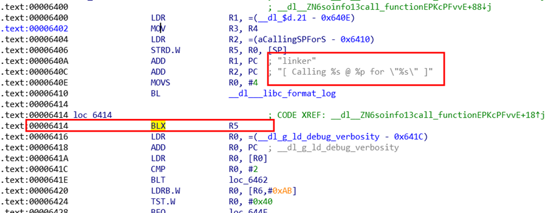

## 开始调试

当在 libc 中断下来直接，ctrl+s 找到 linker 的基址，然后加上偏移 0x6414 。可以发现其基址为 0xF44DC000+0x6414 = F44E2414 最后跳到此处，下断点直接 F9 运行。然后 jdb 连接，最终会断在此处，F7 单步步入，即为 `.init_proc` 函数，继续执行就会又断在此处，F7 步入，则 test_construtor 函数。

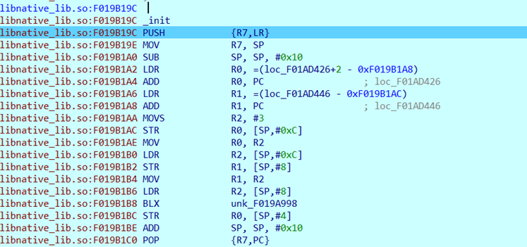

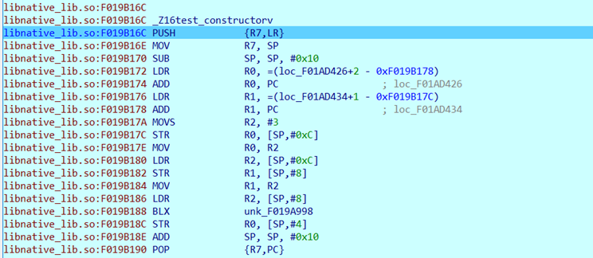

其中也可以通过前文讲的修改 so 文件，修改字节码实现断点或无限循环达到相同的效果。

调试应用和代码：

[送给最好的 TA](https://github.com/CKCat/CKCat.github.io/blob/main/source/_posts/%E5%8A%A8%E6%80%81%E8%B0%83%E8%AF%95so/%E9%80%81%E7%BB%99%E6%9C%80%E5%A5%BD%E7%9A%84TA.apk)

[unluac_2015_06_13.jar](https://github.com/CKCat/CKCat.github.io/blob/main/source/_posts/%E5%8A%A8%E6%80%81%E8%B0%83%E8%AF%95so/unluac_2015_06_13.jar)

[init_proc 相关代码](https://github.com/CKCat/CKCat.github.io/tree/main/source/_posts/%E5%8A%A8%E6%80%81%E8%B0%83%E8%AF%95so/ndkcode)

参考：

https://bbs.pediy.com/thread-254770.htm

https://bbs.kanxue.com/thread-266378.htm
